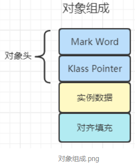
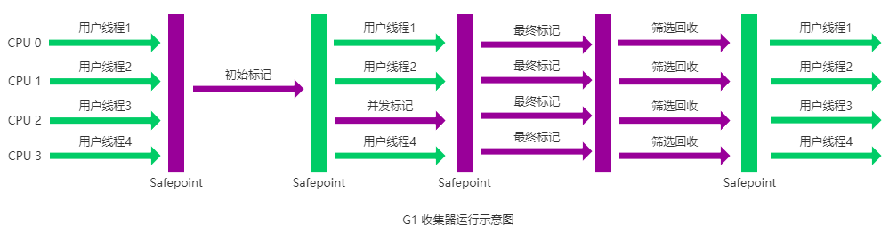

[TOC]


参考：

- oracle jdk官方文档：https://docs.oracle.com/javase/specs/

两个pdf分别为java语言规范和java虚拟机规范


- 深入理解Java虚拟机-周志明  第3版
- 宋红康  JVM从入门到精通


知识体系：


# 上篇 内存与垃圾回收


## 1.第一章  走进java


## 2. 第二章  Java内存区域与内存溢出异常


### 2.1内存模型

注意jdk版本升级过程中内存区域的调整：


- 除程序计数器外，另外4个都有可能OOM
- 栈是运行时的单位（对应方法帧栈的出入栈），堆是存储时的单位（存对象、数组）

|            | Error                 | GC   |
| ---------- | --------------------- | ---- |
| 程序计数器 | x                     | x    |
| 虚拟机栈   | ✓(StackOverFlow, OOM) | x    |
| 本地方法栈 | ✓                     | x    |
| 堆         | ✓(OOM)                | ✓    |
| 方法区     | ✓(OOM)                | ✓    |


#### 2.1.1 线程私有

##### 2.1.1.1 程序计数器

原因： <font color=red>**任意时刻，一个单核处理器只会执行一条线程中的指令**</font> 多线程靠时间片时分复用  轮流切换来实现。因此线程切换后为了能够恢复现场，每个线程需要一个私有的程序计数器记录自己代码的执行位置。

==程序计数器：== java方法记录的是==正在执行的虚拟机字节码指令的地址==；native方法计数器值为空


测试程序

```java
public class Main {
    public static void main(String[] args) {
        int i=10;
        int j=20;
        int k=i+j;
        String s="abc";
        System.out.println(i);
        System.out.println(k);
    }
}
```

**==将.class文件反编译：==**

```bash
javap -v Main.class
```


```bash
Constant pool:   // 常量池
   #1 = Methodref          #6.#26         // java/lang/Object."<init>":()V
   #2 = String             #27            // abc
   #3 = Fieldref           #28.#29        // java/lang/System.out:Ljava/io/PrintStream;
   #4 = Methodref          #30.#31        // java/io/PrintStream.println:(I)V
   #5 = Class              #32            // Main
   #6 = Class              #33            // java/lang/Object
   #7 = Utf8               <init>
   #8 = Utf8               ()V
   #9 = Utf8               Code
  #10 = Utf8               LineNumberTable
  #11 = Utf8               LocalVariableTable
  #12 = Utf8               this
  #13 = Utf8               LMain;
  #14 = Utf8               main
  #15 = Utf8               ([Ljava/lang/String;)V
  #16 = Utf8               args
  #17 = Utf8               [Ljava/lang/String;
  #18 = Utf8               i
  #19 = Utf8               I
  #20 = Utf8               j
  #21 = Utf8               k
  #22 = Utf8               s
  #23 = Utf8               Ljava/lang/String;
  #24 = Utf8               SourceFile
  #25 = Utf8               Main.java
  #26 = NameAndType        #7:#8          // "<init>":()V
  #27 = Utf8               abc
  #28 = Class              #34            // java/lang/System
  #29 = NameAndType        #35:#36        // out:Ljava/io/PrintStream;
  #30 = Class              #37            // java/io/PrintStream
  #31 = NameAndType        #38:#39        // println:(I)V
  #32 = Utf8               Main
  #33 = Utf8               java/lang/Object
  #34 = Utf8               java/lang/System
  #35 = Utf8               out
  #36 = Utf8               Ljava/io/PrintStream;
  #37 = Utf8               java/io/PrintStream
  #38 = Utf8               println
  #39 = Utf8               (I)V
{
  ...
  public static void main(java.lang.String[]);   // 虚拟机栈 main方法
    descriptor: ([Ljava/lang/String;)V
    flags: ACC_PUBLIC, ACC_STATIC
    Code:
      stack=2, locals=5, args_size=1
         0: bipush        10               //把10放进去
         2: istore_1                       // 保存
         3: bipush        20
         5: istore_2
         6: iload_1                       //取出10
         7: iload_2 
         8: iadd                           // 相加
         9: istore_3
        10: ldc           #2                  // String abc ldc取常量
        12: astore        4                   // 保存
        14: getstatic     #3                  // Field java/lang/System.out:Ljava/io/PrintStream;
        17: iload_1
        18: invokevirtual #4                  // Method java/io/PrintStream.println:(I)V
        21: getstatic     #3                  // Field java/lang/System.out:Ljava/io/PrintStream;
        24: iload_3
        25: invokevirtual #4                  // Method java/io/PrintStream.println:(I)V
        28: return
      ...
}
SourceFile: "Main.java"
```

程序计数器中存储偏移地址，记录程序执行的位置，执行引擎取出程序计数器中对应的操作指令执行（操作局部变量表和操作数栈，翻译成机器指令执行）。


字节码关键结构：

| Constant pool           | 常量池                                   |
| ----------------------- | ---------------------------------------- |
| public static void main | 每个方法对应一个虚拟机栈，找对应方法即可 |


操作数总结：

| 操作指令      | 含义                                  |
| ------------- | ------------------------------------- |
| bipush        | 将int型数放入操作数栈                 |
| istore        | 将int型数从操作数栈弹出存入局部变量表 |
| iload         | 取出int型数                           |
| iadd          | 相加 （int）                          |
| ldc           | 到常量池中取常量                      |
| astore        | 保存                                  |
| getstatic     | 获取静态类                            |
| invokevirtual | 执行方法                              |
| return        | 返回                                  |


##### 2.1.1.2 java虚拟机栈（对应方法）

###### 2.1.1.2.1 概述

- 生命周期和线程相同
- ==<font color=red>**每个方法在执行时，java虚拟机都会创建一个帧栈用来存储局部变量表、操作数栈、动态链接、方法出口（返回值、方法返回地址）等信息，一个方法从被调用到执行完毕对应一个帧栈在虚拟机中入栈到出栈的过程**</font>==
- 局部变量表：存基本数据类型、对象引用
- 局部变量表所需内存大小在编译期间确定，进入一个方法时，它所需要在帧栈中分配多大的局部变量空间是完全确定的，不会在方法运行期间改变大小。
- 两种异常： StackOverflowError: 线程请求的栈深度大于虚拟机允许的深度  ； OOM: 虚拟机栈容量扩展时超出物理内存限制
- 栈：先进后出
- **==在一条活动的线程中，某一时间点上只会有一个活动的栈帧==**。即当前正在执行方法的栈帧（栈顶栈帧）是有效的，该栈帧称为<font color=red>**当前栈帧**</font>，与之对应的方法称为**当前方法**，定义该方法的类称为**当前类**


- **==<font color=red>不同线程所包含的栈帧不允许相互引用</font>==**
- 方法返回时当前栈帧会传回执行结果给前一个栈帧，接着虚拟机会丢弃当前栈帧，并使前一个栈帧成为当前栈帧

###### 2.1.1.2.2 示例

```java
public static void methodA(){
        int i=10;
        int j=20;
        methodB();
    }
public static void methodB(){
    int i=30;
    int j=40;
}
```


以下为虚拟机栈的示意图，上述代码中方法A、B分别对应一个栈帧（下图为简化版，完成的栈帧还有操作数栈、返回值等），栈顶为当前执行方法对应的栈帧，方法执行完毕后栈帧出栈。

流程：

- 执行方法A，方法A的栈帧入栈，A为当前栈帧      
- A中调了B，B的栈帧入栈，此时B为当前栈帧      
- 方法B执行结束B的栈帧出栈， 
- A又成为当前栈帧，  
- 方法A执行结束，A对应的栈帧出栈。


###### 2.1.1.2.3 栈帧的内部结构

栈帧：包含局部变量表、操作数栈、方法返回地址、动态链接、一些附加信息

1.局部变量表

一个数字数组，用于存储方法参数（**==从形参开始算==**）和定义在方法体内的局部变量，这些数据类型包括各类基本数据类型（都可以转换为数值）、**==对象引用==**以及returnAddress类型。

```java
public class LocalVariableTest {
    int count=0;
    public static void main(String[] args) {
        LocalVariableTest test=new LocalVariableTest();
        int num=10;
        System.out.println("Hello world!");
    }
    public void test1(){
        Date date=new Date();
        String s="hello";
        System.out.println(s);
    }
}
```


反编译后找到main方法对应的帧栈，其中**==LocalVariableTable就是该方法的局部变量表==**，locals为局部变量表数组长度。可以看出上述程序main方法的局部变量表包含args(形参)、test和num ，Slot为槽位（索引），


安装插件更方便看：


点击字节码文件，view-> show bytecode with Jclasslib


java代码和字节码指令的行号对应关系：


局部变量表：

- 起始PC：字节码指令的行号
- 长度：与起始PC合起来表示当前变量的作用域（比如变量test，其作用域起始位置对应字节码行号为8，作用域为从起始位置往后数12行字节码，可以发现起始PC+长度为定值20，即main方法字节码的长度）


局部变量和静态变量：类中的成员变量（包括静态变量和实例成员变量）在类加载过程中会赋默认值，而方法里的==局部变量没有初始化过程，必须人为初始化，否则报错：==

```java
class Test{
    static int a;  // 成员变量（静态）   -> 可以不初始化,类加载过程中会赋默认值0
    String b;  // 实例成员变量（非静态）  -> 可以不初始化,类加载过程中会赋默认值null

    public void test(){
        int c;  // 局部变量  -> 必须初始化
        System.out.println(c);  // 错误，没有赋初值不能使用
    }
    
    public void test1(){
        int c;  // 局部变量  -> 必须初始化
        c=5;
        System.out.println(c);  // 可以，不报错
    }
}
```


代码追踪：

```java
public class LocalVariableTest {
    public static void main(String[] args) {
        test();
    }
    public static void test(){
        int i=15;
        int j=8;
        int k=i+j;
    }
}
```

分析方法test:


局部变量表大小：3（若非static方法，则下标0为this，局部变量表大小为4）    操作数栈大小：2  

- 行号0：将15放入操作数栈
- 行号2：将15从操作数栈弹出存入局部变量表下标0位置 （其中istore_0表示存入下标0）
- 行号 3：将8放入操作数栈
- 行号5：将8从操作数栈弹出存入局部变量表下标1位置
- 行号6：取出局部变量表下标0处的15放入操作数栈
- 行号7：取出局部变量表下标1处的8放入操作数栈
- 行号8：将15和8从操作数栈弹出给执行引擎CPU计算结果，结果23保存到操作数栈
- 行号9：将23从操作数栈弹出保存到局部变量表下标2位置
- 行号10：退出方法返回


动态链接：方法B中调方法A，会从常量池中获取动态链接（如下图的方法A动态链接#7  ，num的动态链接#2）

```java
blic class DynamicLinkingTest {
    int num=10;
    public void methodA(){
        System.out.println("methodA...");
    }

    public void methodB(){
        System.out.println("methodB...");
        methodA();
        num++;
    }
}
```


###### 2.1.1.2.4 虚拟机栈相关面试题

1.调整栈大小，就能保证不溢出吗？

不能，只是能推迟（方法调用次数多一点）出现StackOverflow的时间，当无限调用没有设置终止条件时一定会出现。

2.分配的栈内存越大越好吗？

不是，栈内存越大出StackOverflow的概率越小，但总内存一定，能同时运行的线程数减少

3.方法中定义的局部变量是否线程安全？

具体问题具体分析，在方法内部产生内部消亡的是线程安全，但是若由形参传入或者返回出去则线程不安全。

###### 2.1.1.2.5 虚拟机栈参数设置

hotspot虚拟机不区分虚拟机栈和本地方法栈，栈容量仅由参数 **==<font color=red>-Xss设置</font>==**。

模拟超过虚拟机栈的最大容量：不设终止条件自己调自己（dfs中容易出现），虚拟机栈中会有无数该方法的栈帧。

```java
public class Main {
    public static void main(String[] args) {
        main(args);
    }
}
```


##### 2.1.1.3 本地方法栈

与虚拟机栈类似，对应native方法


#### 2.1.2 线程公有 


##### 2.1.2.1 堆（对象）

###### 2.1.2.1.1 概述

- 存放所有类的对象实例（含数组，数组也是对象）。jdk1.7及以后将方法区中的静态变量（类级别）和字符串常量池也移到堆中。

- ==**对象和数组永远不会存储在栈上，但栈帧中可保存它们的引用，这个引用指向对象或者数组在堆中的位置**==。

- **==在方法结束（该方法已无到对象的引用）后，堆中的对象不会马上被移除，仅在垃圾回收时才会被清除。==**避免垃圾回收太频繁影响用户线程。

- 最大的一块内存区域，**==<font color=red>堆只包含新生代和老年代，不包括永久代和元空间。默认占比  老年代：新生代=2：1；新生代中默认Eden：s0：s1=8：1：1</font>==**

  


###### 2.1.2.1.2 参数设置

-  -Xms（起始内存，最小内存）     -Xmx（最大内存），**==两者相同表示堆空间不可扩展==**。

  其中-X表示jvm运行参数，ms为memery start缩写，单位默认字节。例如-Xms20m -Xmx20m

- 堆内存超出Xmx抛OOM异常

- ==默认（不设-Xmx和-Xms时）：Xms=物理电脑内存/64  Xmx=物理内存/4==

- 设置老年代和新生代的占比  -XX:NewRatio=2 ，即老年代：新生代=2：1

- 设置Eden和s0/s1的比例，其中s0:s1永远1：1， -XX:SurvivorRatio=8即Eden：s0：s1=8：1：1

- 由于自适应内存分配策略的存在，要使Eden：s0：s1=8：1：1，需显示设置XX:SurvivorRatio

代码获取Xmx 和Xms参数，假设设置的vm参数为：

  -Xms300m -Xmx300m -XX:NewRatio=2 -XX:SurvivorRatio=8

```java
public class Main {

    public static void main(String[] args) {
        // 代码获取Xmx 和Xms参数
        long initialMemory=Runtime.getRuntime().totalMemory()/1024/1024;
        long maxMemory=Runtime.getRuntime().maxMemory()/1024/1024;
        System.out.println("-Xms: "+initialMemory+"MB");
        System.out.println("-Xmx: "+maxMemory+"MB");
    }
}
```


打印出的是290MB而非300MB的原因？

老年代： 200MB

新生代中：  Eden 80MB  s0 10MB  s1 10MB

由于采用标志-复制算法，**==<font color=red>s0 s1永远只能用其一</font>==**，故getRuntime获取出来的是200+80+10=290MB


###### 2.1.2.1.3 ==<font color=red>对象分配过程（结合垃圾回收，超级重要）</font>==

一般流程：（升级打怪）

1. new的对象优先在eden中分配

2. eden满却又要创建对象时，JVM会触发Minor GC(也叫YGC)对eden进行垃圾回收，存活下来的对象移到s0/s1中

3. Minor GC会带动s0或s1区的清理（s0、s1永远只能占用一个，标记-复制算法），在后续触发的Minor GC中，存活的对象往s0或s1中空白的分区存放，且没熬过一次Minor GC年龄加1

4. 默认对象的年龄为15时会晋升到老年代（空间更大，老年代：新生代默认2：1，且老年代GC频率更低，更加高枕无忧）。晋升到老年代的年龄阈值可以通过参数-XX:MaxTenuringThreshold=<N>设置。

5. 老年代相对悠闲，当老年代空间不足时触发Major GC，清理老年代中无用的对象。

6. 若老年代执行Major GC后依然无法进行对象的保存，就会报OOM (java heap space)异常  

   说明：**==凡GC都要停止用户线程（stop the world）==**，GC Roots到对象的引用链不能在判断过程中还在变，方便判断谁是垃圾，也不能边打扫边扔垃圾

   


​                                                                                    图1


​                                                                                       图2


​                                                                                        图3

图解说明:

1. 新对象一来先考虑放在eden区，eden满了触发Minor GC，途中红色为无用对象，绿色为存活对象
2. eden经过Minor GC存活下来的对象移到s0区，年龄记为1
3. 图2，后面eden又满了，此时再触发Minor GC，此时将eden区GC存活下来的对象以及s0中的对象（**==Minor GC会带动s0或s1的垃圾回收：判断s0中哪些对象有用，哪些无用，有用的移到s1，无用的清理==**）移到s1区，且年龄+1，s0区清空。后面类似，存活对象都是移到s0/s1中空白区域。
4. 后面重复上面的Minor GC，到图3的特殊情况，s1中的有用对象时发现有些年龄到了15，此时将它们（年龄为15的对象）移到老年区（晋升）
5. 若s0/s1清理无用对象后还满了，那么s0/s1中的对象直接晋升到老年代，不受年龄15的限制
6. **==每次Minor GC后eden都会清空==**，==<font color=red>**若新对象还是放不下，就说明是大对象，此时直接放到老年代**</font>==, (eden:s0:s1=8:1:1，eden都放不下，s0/s1更放不下，因此不会放到s0/s1)。
7. 如果新对象在老年代也放不下，那么进行一次Full GC （大屠杀：eden、s0/s1、老年代及**==方法区==**都进行一次垃圾回收）。**==Full GC后还放不下且堆内存不允许自动扩展时，OOM==**


注意：

- ==触发Minor GC的条件：eden满。s0/s1满不会触发==，但不意味s0/s1不会进行垃圾回收，因为每次Minor GC会去判断s0/s1中哪些对象无用并清理掉（被动回收）。
- ==关于垃圾回收：频繁发生在新生代（80%的对象朝生夕死），很少在老年代，几乎不在永久代/元空间==


对象分配过程和GC演示：

vm参数设置：-Xms50m -Xmx50m -XX:+PrintGCDetails

```java
public class HeapInstanceTest {
    private byte[] buffer=new byte[new Random().nextInt(1024*20)];
    public static void main(String[] args){
        ArrayList<HeapInstanceTest> list=new ArrayList<>();
        while(true){
            list.add(new HeapInstanceTest());
            try {
                Thread.sleep(10);
            }catch (InterruptedException e){
                e.printStackTrace();
            }
        }
    }
}
```


使用jvisualvm观察GC过程，一般走势如下图：

演示视频：链接：https://pan.baidu.com/s/1SKzfhBt8ehnRcCe6LoThHQ   提取码：1234 


- GC Time表示了发生GC的时间，可以看出每次发生 Minor GC eden区都被清空，内存骤降到0
- 每进行一次Minor GC 后eden区存活的对象都移动到s0/s1，故Minor GC后s0/s1空间有所增长，且s0/s1交替作为下次移动的目标区域
- GC后s0/s1还存不下，就放大老年代，故老年代增长也发生在GC后
- 老年代经过Major GC或Full GC还放不下，报OOM

打印的GC细节：


###### 2.1.2.1.5 Minor GC、Major GC和Full GC区别

**==Minor GC、Major GC和Full GC区别==**：


###### 2.1.2.1.6 为何堆空间进行分代


分代目的：优化GC，提高GC效率，或者尽量减少老年代、永久代（元空间）的GC，将80%朝生夕死的对象放在新生代频繁GC

###### 2.1.2.1.7 常用调优工具


JProfiler： GC调优常用


装好插件后再到官网下载exe：https://www.ej-technologies.com/download/jprofiler/files  ，这里直接到百度网盘下jprofiler11 (验证通过，10有点问题，里面有注册码)：https://pan.baidu.com/s/1UbYJ7L0DA2Z4V9Izj2G6lg  提取码：1234 

点击exe安装（serial.txt里有注册码）：


集成到IDEA：


直接点运行：


##### 2.1.2.2 方法区（**==逻辑概念==**，类信息）

###### 2.1.2.2.1 概述

- 存储已被虚拟机加载的 ==<font color=red>**类型信息、字段信息、方法信息、常量（运行时常量池）、静态变量(jdk1.7之前)**</font>==、编译后的代码缓存等
- 运行时常量池：存编译期生成的字面量和符号引用
- **==<font color=red>方法区的大小决定了系统可以保存多少个类</font>==**，如果系统定义了太多类，导致方法区溢出(加载大量第三方jar包)，会报OOM
- **==逻辑概念，具体实现为永久代或者元空间==**
- <font color=red>**jdk7把永久代中的字符串常量池、静态变量等移到java堆**</font>中；jdk8完全废弃永久代，改用在本地内存中实现的元空间替代，将永久代中剩余内容（主要是类型信息）移到元空间。
- 方法区和永久代（元空间）等价仅在hotspot时成立


- 方法区和堆严格区分开


- 元空间和永久代的区别：==**元空间不在虚拟机设置的内存中，而是直接使用本地内存**==

  

**==方法区演进细节==**

| jdk1.6及之前 | 有永久代，静态变量存放在永久代                               |
| ------------ | ------------------------------------------------------------ |
| jdk1.7       | 有永久代，但已逐步“去永久代”，字符串常量池、静态变量移到堆中 |
| jdk1.8及之后 | 无永久代，类型信息、字段、方法、常量保存在本地内存的元空间，但**==<font  color=red>字符串常量池、静态变量仍在堆中</font>==** |


之前都是jvm的内存，jdk8变为本地内存（**==方法区成为jvm中的一个逻辑概念==**）


将永久代替换为元空间的原因？

- **==永久代空间大小很难确定==**：若动态加载类过多容易导致永久代OOM，Full GC的次数也会增加，而元空间仅受本地内存限制，不易产生该现象。
- 对永久代调优比较困难：判断类不再被使用比较花时间且困难，应尽量避免Full GC


==字符串常量池（StringTable）为什么要迁移到堆中？==

永久代回收效率很低，在Full GC（老年代和永久代空间不足）时才触发。而开发中会有大量字符串创建（比如substring方法，是new 一个新的字符串，不可变类保证线程安全），导致字符串常量池无法及时被回收，从而引发永久代内存不足。


**==静态变量为什么要迁移到堆中？==**


注意区分静态变量和实例成员变量：

1. Integer默认值是null，不是0。 区别于int
2. **<font color=red size=5>类中的静态变量一个类只有一份（jdk1.8存在堆中，1.7以前在方法区），多个实例共享</font>**,  对象本身的内存结构里不存静态变量，任一实例修改静态变量都对其他实例可见。而**<font color=red size=5>实例成员变量每个实例各有一份（存在方法区）</font>**，修改仅影响自身实例。


```java
@Data
class Test{
    public static Integer i;  // 静态变量一个类只存一份（jdk1.8静态变量的引用存放在堆中），多个实例共享。  对象实体永远在堆中
    private Integer j;  // 实例成员变量 每个实例都有自己的， 存放在方法区
    public Test(Integer i,Integer j){
        this.i=i;
        this.j=j;
    }
    public Test(Integer j) {
        this.j = j;
    }
    public void setI(Integer i){
        this.i=i;
    }
}


@Slf4j
public class TestThread {
    public static void main(String[] args){
       
        Test t1=new Test(1,2);   
        Test t2=new Test(3);  // t2.i=1  

        log.info("【t1】 i={}, j={}",t1.i,t1.getJ());  
        log.info("【t2】 i={}, j={}",t2.i,t2.getJ());  // t2.i=1 t2.j=3  因为i是静态变量整个类共享
        
        t2.setI(3);  // 修改t2.i=3 ,  公共数据  ->  t1.i=3
        log.info("【t1】 i={}, j={}",t1.i,t1.getJ());  // t1.i=3  t1.j=2
        }
}
```


方法区GC：主要回收常量池中废弃的常量和不再使用的类型，元空间内存不足时触发。

方法区常量池中两大常量：字面量和符号引用。其中字面量比较接近java语言层次的常量概念，比如文本字符串、被final修饰的常量值等；而符号引用属于编译原理方面的概念，包括：

- 类和接口的全限定名
- 字段的名称和描述符
- 方法的名称和描述符

HotSpot虚拟机常量池回收策略：只要常量没有被任何地方引用，就可以回收。


**==判定一个类为无用类？==**比较困难，需满足以下条件：

- 该类的所有实例都已被回收，包括该类和**==所有子类==**的实例
- 加载该类的类加载器已被回收
- 该类对应额Class对象没有在任何地方被引用，无法通过反射访问该类的方法


**==满足上述3个条件的无用类允许回收，但不是必然被回收==**。关于是否要对类型进行回收HotSpot虚拟机提供了-Xnoclassgc参数进行控制，还可使用-verbose:class以及-XX:+TranceClass-Loading、-XX:+TranceClassUnLoading查看类加载和卸载信息。


总的来说，方法区有GC，但GC的效果较难令人满意，尤其是类型卸载，条件相当苛刻，但是GC又确实有必要。


Class文件：类的版本、字段、

方法、接口、常量池表等信息


###### 2.1.2.2.2 参数设置

jdk7及以前：

- -XX:PermSize  设置永久代初始分配空间，默认值20.75MB

- -XX:MaxPermSize  设置永久代最大可分配空间，32位默认值64MB，64位默认值82MB

  当JVM加载的类信息容量超过该值报OOM:PermGenspace

  

jdk8及以后：

- -XX:MetaspaceSize=21m 设置元空间初始内存大小，windows 64位默认21M
- -XX:MaxMetaspaceSize=-1  设置元空间最大内存大小，-1表示没有限制（取决于物理内存）
- 与永久代不同，若不指定元空间最大内存大小默认会耗尽所有可用物理内存，抛异常OOM:Metaspace
- windows 64位下初始元空间大小为21MB，一旦触及这个水位线，将触发Full GC并卸载没用的类（即这些类对应的类加载器不再存活），然后该水位先将被重置。新的水位线取决于GC后释放了多少元空间，若释放的元空间不足，那么在不超过MaxMetaspaceSize时适当提高该值；若释放空间过多则适当降低该值。
- 若元空间初始内存设置过低，易引发多次Full GC, 为避免该情况建议设置一个相对较高的初始值。


模拟OOM:  参数设置  -XX:MaxMetaspaceSize=5m -XX:MaxDirectMemorySize=5m

```java
public class Main extends ClassLoader{
    public static void main(String[] args) {
        int j=0;
        try {
            Main test=new Main();
            for(int i=0;i<10000;i++){
                // 创建ClassWriter对象，用于生成类的二进制字节码
                ClassWriter classWriter=new ClassWriter(0);
                // 指明版本号，public, 类名， 包名， 父类， 接口
                classWriter.visit(Opcodes.V1_6,Opcodes.ACC_PUBLIC,"Class"+i,null,"java/lang/Object",null);
                // 返回byte[]
                byte[] code=classWriter.toByteArray();
                // 类的加载
                test.defineClass("Class"+i,code,0,code.length);  // Class对象
                j++;
            }
        }finally {
            System.out.println(j);
        }
    }
}
```

加载10000个类，到7329就溢出了


如何解决OOM？


###### 2.1.2.2.3 方法区内部结构


1.类型信息

对每个加载的类型（类Class、接口Interface、枚举 enum 、注解annotation)，JVM必须在方法区中存储以下类型信息：

- 类型的完整有效名称（全名=包名.类名）

- 直接父类的完整有效名（对于interface或Object没有父类）

- 类型修饰符（public abstract final的某个子集）

- 类型直接接口的一个有序列表 （implements 后实现的接口也是有顺序的）

  

2.域信息

- 方法区保存了类型的所有域信息及域的声明顺序
- 域信息包括：域名称、域类型、域修饰符（public,private, protected, static, final, volatile, transient的某个子集）


3.方法信息

包括方法声明顺序

- 方法名称
- 方法返回类型
- 参数的数量和类型（按顺序）
- 方法修饰符（public private, ....)
- 方法的字节码、操作数栈、局部变量表及大小
- 异常表（abstract和native方法除外）：每个异常处理的开始位置、结束位置、代码处理在程序计数器中的偏移地址、被捕获的异常类的常量池索引


现有字节码文件，然后使用类加载系统加载到内存中，==类信息及使用的类加载器信息会加载到方法区==。


```bash
javap -v -p MethodInnerStructTest.class    // -p 显示private相关
```

  

```java
public class MethodInnerStructTest extends Object implements Comparable<String>, Serializable {
    public int num=10;
    private static String str="初始方法区内部结构";
    public void test1(){
        int count=20;
        System.out.println("count= "+count);
    }

    public static int test2(int cal){
        int result=0;
        try{
            int value=30;
            result=value/cal;
        }catch (Exception e){
            e.printStackTrace();
        }
        return result;
    }
    @Override
    public int compareTo(String o) {
        return 0;
    }
}
```


```bash
// 1. 类信息
public class MethodInnerStructTest extends java.lang.Object implements java.lang.Comparable<java.lang.String>, java.io.Serializable
  minor version: 0
  major version: 52
  flags: ACC_PUBLIC, ACC_SUPER
// 2. 常量池（类加载器加载进方法区后就叫运行时常量池），其中字符两常量池jdk1.7及以后移到了堆中，剩余的还在方法区 
Constant pool:
   #1 = Methodref          #18.#52        // java/lang/Object."<init>":()V
   #2 = Fieldref           #17.#53        // MethodInnerStructTest.num:I
   #3 = Fieldref           #54.#55        // java/lang/System.out:Ljava/io/PrintStream;
   #4 = Class              #56            // java/lang/StringBuilder
   #5 = Methodref          #4.#52         // java/lang/StringBuilder."<init>":()V
   #6 = String             #57            // count=
   #7 = Methodref          #4.#58         // java/lang/StringBuilder.append:(Ljava/lang/String;)Ljava/lang/StringBuilder;
   #8 = Methodref          #4.#59         // java/lang/StringBuilder.append:(I)Ljava/lang/StringBuilder;
   #9 = Methodref          #4.#60         // java/lang/StringBuilder.toString:()Ljava/lang/String;
  #10 = Methodref          #61.#62        // java/io/PrintStream.println:(Ljava/lang/String;)V
  #11 = Class              #63            // java/lang/Exception
  #12 = Methodref          #11.#64        // java/lang/Exception.printStackTrace:()V
  #13 = Class              #65            // java/lang/String
  #14 = Methodref          #17.#66        // MethodInnerStructTest.compareTo:(Ljava/lang/String;)I
  #15 = String             #67            // 初始方法区内部结构
  #16 = Fieldref           #17.#68        // MethodInnerStructTest.str:Ljava/lang/String;
  #17 = Class              #69            // MethodInnerStructTest
  #18 = Class              #70            // java/lang/Object
  #19 = Class              #71            // java/lang/Comparable
  #20 = Class              #72            // java/io/Serializable
  #21 = Utf8               num
  #22 = Utf8               I
  #23 = Utf8               str
  #24 = Utf8               Ljava/lang/String;
  #25 = Utf8               <init>
  #26 = Utf8               ()V
  #27 = Utf8               Code
  #28 = Utf8               LineNumberTable
  #29 = Utf8               LocalVariableTable
  #30 = Utf8               this
  #31 = Utf8               LMethodInnerStructTest;
  #32 = Utf8               test1
  #33 = Utf8               count
  #34 = Utf8               test2
  #35 = Utf8               (I)I
  #36 = Utf8               value
  #37 = Utf8               e
  #38 = Utf8               Ljava/lang/Exception;
  #39 = Utf8               cal
  #40 = Utf8               result
  #41 = Utf8               StackMapTable
  #42 = Class              #63            // java/lang/Exception
  #43 = Utf8               compareTo
  #44 = Utf8               (Ljava/lang/String;)I
  #45 = Utf8               o
  #46 = Utf8               (Ljava/lang/Object;)I
  #47 = Utf8               <clinit>
  #48 = Utf8               Signature
  #49 = Utf8               Ljava/lang/Object;Ljava/lang/Comparable<Ljava/lang/String;>;Ljava/io/Serializable;
  #50 = Utf8               SourceFile
  #51 = Utf8               MethodInnerStructTest.java
  #52 = NameAndType        #25:#26        // "<init>":()V
  #53 = NameAndType        #21:#22        // num:I
  #54 = Class              #73            // java/lang/System
  #55 = NameAndType        #74:#75        // out:Ljava/io/PrintStream;
  #56 = Utf8               java/lang/StringBuilder
  #57 = Utf8               count=
  #58 = NameAndType        #76:#77        // append:(Ljava/lang/String;)Ljava/lang/StringBuilder;
  #59 = NameAndType        #76:#78        // append:(I)Ljava/lang/StringBuilder;
  #60 = NameAndType        #79:#80        // toString:()Ljava/lang/String;
  #61 = Class              #81            // java/io/PrintStream
  #62 = NameAndType        #82:#83        // println:(Ljava/lang/String;)V
  #63 = Utf8               java/lang/Exception
  #64 = NameAndType        #84:#26        // printStackTrace:()V
  #65 = Utf8               java/lang/String
  #66 = NameAndType        #43:#44        // compareTo:(Ljava/lang/String;)I
  #67 = Utf8               初始方法区内部结构
  #68 = NameAndType        #23:#24        // str:Ljava/lang/String;
  #69 = Utf8               MethodInnerStructTest
  #70 = Utf8               java/lang/Object
  #71 = Utf8               java/lang/Comparable
  #72 = Utf8               java/io/Serializable
  #73 = Utf8               java/lang/System
  #74 = Utf8               out
  #75 = Utf8               Ljava/io/PrintStream;
  #76 = Utf8               append
  #77 = Utf8               (Ljava/lang/String;)Ljava/lang/StringBuilder;
  #78 = Utf8               (I)Ljava/lang/StringBuilder;
  #79 = Utf8               toString
  #80 = Utf8               ()Ljava/lang/String;
  #81 = Utf8               java/io/PrintStream
  #82 = Utf8               println
  #83 = Utf8               (Ljava/lang/String;)V
  #84 = Utf8               printStackTrace
{
// 3. 域信息（字段）
  public int num;
    descriptor: I
    flags: ACC_PUBLIC

  private static java.lang.String str;
    descriptor: Ljava/lang/String;
    flags: ACC_PRIVATE, ACC_STATIC
    
// 4. 方法信息
// 构造器
  public MethodInnerStructTest();
    descriptor: ()V
    flags: ACC_PUBLIC
    Code:
      stack=2, locals=1, args_size=1
         0: aload_0
         1: invokespecial #1                  // Method java/lang/Object."<init>":()V
         4: aload_0
         5: bipush        10
         7: putfield      #2                  // Field num:I
        10: return
      LineNumberTable:
        line 9: 0
        line 10: 4
      LocalVariableTable:
        Start  Length  Slot  Name   Signature
            0      11     0  this   LMethodInnerStructTest;

  public void test1();  // 方法名称 返回值类型
    descriptor: ()V
    flags: ACC_PUBLIC  // 方法权限
    Code:      // 字节码
      stack=3, locals=2, args_size=1  // 操作数栈深度  局部变量表长度  方法参数个数（此处为this）
         0: bipush        20
         2: istore_1
         3: getstatic     #3                  // Field java/lang/System.out:Ljava/io/PrintStream;
         6: new           #4                  // class java/lang/StringBuilder
         9: dup
        10: invokespecial #5                  // Method java/lang/StringBuilder."<init>":()V
        13: ldc           #6                  // String count=
        15: invokevirtual #7                  // Method java/lang/StringBuilder.append:(Ljava/lang/String;)Ljava/lang/StringBuilder;
        18: iload_1
        19: invokevirtual #8                  // Method java/lang/StringBuilder.append:(I)Ljava/lang/StringBuilder;
        22: invokevirtual #9                  // Method java/lang/StringBuilder.toString:()Ljava/lang/String;
        25: invokevirtual #10                 // Method java/io/PrintStream.println:(Ljava/lang/String;)V
        28: return
      LineNumberTable:
        line 14: 0
        line 15: 3
        line 16: 28
      LocalVariableTable:
        Start  Length  Slot  Name   Signature
            0      29     0  this   LMethodInnerStructTest;
            3      26     1 count   I

  public static int test2(int);
    descriptor: (I)I
    flags: ACC_PUBLIC, ACC_STATIC
    Code:
      stack=2, locals=3, args_size=1
         0: iconst_0
         1: istore_1
         2: bipush        30
         4: istore_2
         5: iload_2
         6: iload_0
         7: idiv
         8: istore_1
         9: goto          17
        12: astore_2
        13: aload_2
        14: invokevirtual #12                 // Method java/lang/Exception.printStackTrace:()V   // 异常
        17: iload_1
        18: ireturn
      Exception table:    // 异常表
         from    to  target type
             2     9    12   Class java/lang/Exception
      LineNumberTable:
        line 19: 0
        line 21: 2
        line 22: 5
        line 25: 9
        line 23: 12
        line 24: 13
        line 26: 17
      LocalVariableTable:
        Start  Length  Slot  Name   Signature
            5       4     2 value   I
           13       4     2     e   Ljava/lang/Exception;
            0      19     0   cal   I
            2      17     1 result   I
      StackMapTable: number_of_entries = 2
        frame_type = 255 /* full_frame */
          offset_delta = 12
          locals = [ int, int ]
          stack = [ class java/lang/Exception ]
        frame_type = 4 /* same */

  public int compareTo(java.lang.String);
    descriptor: (Ljava/lang/String;)I
    flags: ACC_PUBLIC
    Code:
      stack=1, locals=2, args_size=2
         0: iconst_0
         1: ireturn
      LineNumberTable:
        line 30: 0
      LocalVariableTable:
        Start  Length  Slot  Name   Signature
            0       2     0  this   LMethodInnerStructTest;
            0       2     1     o   Ljava/lang/String;

  public int compareTo(java.lang.Object);
    descriptor: (Ljava/lang/Object;)I
    flags: ACC_PUBLIC, ACC_BRIDGE, ACC_SYNTHETIC
    Code:
      stack=2, locals=2, args_size=2
         0: aload_0
         1: aload_1
         2: checkcast     #13                 // class java/lang/String
         5: invokevirtual #14                 // Method compareTo:(Ljava/lang/String;)I
         8: ireturn
      LineNumberTable:
        line 9: 0
      LocalVariableTable:
        Start  Length  Slot  Name   Signature
            0       9     0  this   LMethodInnerStructTest;

  static {};
    descriptor: ()V
    flags: ACC_STATIC
    Code:
      stack=1, locals=0, args_size=0
         0: ldc           #15                 // String 初始方法区内部结构
         2: putstatic     #16                 // Field str:Ljava/lang/String;
         5: return
      LineNumberTable:
        line 11: 0
}
Signature: #49                          // Ljava/lang/Object;Ljava/lang/Comparable<Ljava/lang/String;>;Ljava/io/Serializable;
SourceFile: "MethodInnerStructTest.java"
```


- 静态变量和类关联在一起，随类的加载而加载，成为类数据在逻辑上的一部分

- 静态变量被类的所有实例共享，即使没有类实例也能访问。

  下面的代码中order为null但不会报空指针异常，可正常运行

```java
public class MethodAreaTest {
    public static void main(String[] args){
        Order order=null;  
        order.hello();
    }
}

class Order{
    public static int count=1;
    public static void hello(){
        System.out.println("hello");
    }
}
```


静态变量（符号引用）存放在方法区中（jdk1.7及以后移到堆中），若它指向类对象，这个对象实体永远存在堆中。

```java
public class MethodAreaTest {
    private static byte[] arr=new byte[1024*1024*50];
    public static void main(String[] args){
        System.out.println(MethodAreaTest.arr);
    }
}
```

vm参数设置打印GC信息：-XX:+PrintGCDetails

可以看出arr实体存在老年代（堆）中


#### 2.1.3 其他：不属于JVM内存

1.直接内存

- 可能导致OOM。

- JDK4中引入的NIO类使用native函数库直接分配堆外内存，并通过一个存储在java堆中的DirectByteBuffer对象作为这块内存的引用进行操作。


#### 2.1.4 堆、栈、方法区的交互关系

假设下面这行代码是在方法里定义的（局部变量）：


#### 2.1.5 java内存模型面试题

1.为什么程序计数器和虚拟机栈设计为线程私有？

程序计数器：方便线程切换后能够恢复到正确的执行位置

虚拟机栈：保证线程中的局部变量不被别的线程访问到(线程隔离)


### 2.2 线程与JVM

- JVM允许一个应用有多个线程并行执行，<font color=red>**任意时刻，一个单核处理器只会执行一条线程中的指令**</font> 
- HotSpot JVM里，java线程与操作系统本地线程一一映射，生命周期相同。
- 操作系统负责所有线程的安排调度（分配CPU时间片），一旦本地线程初始化成功，它就会调用java线程中的run方法。
- 使用jconsole等调试工具可查看后台线程，这些后台线程不包括public static void main(String[] args)的main线程和由main线程创建的线程
- Hotspot JVM中主要后台线程：虚拟机线程、周期任务线程、GC线程、编译线程（将字节码编译成本地代码）、信号调度线程


### 2.3 对象创建过程

1. 遇到new指令，先检查常量池中是否有该类的符号引用，并检查符号引用代表的类是否已加载、解析和初始化，若没有，先执行类加载（**==<font color=red>先有类再有对象</font>==**）。
2. 类加载（此时便已确定对象的内存大小）检查通过后，虚拟机为新对象分配内存，即从堆中划分一块空间出来。根据内存空间是否规整（可用空间和已用空间的布局）分别有“指针碰撞”和“空闲列表”两种方式。
3. 内存分配完成后，将字段赋默认值（比如int 0  boolean false）
4. 必要的设置：对象属于哪个类实例、怎么找到类的元数据信息、对象的GC分代年龄等
5. 执行初始化函数


注意：**==对象分配内存后修改内存指针位置是非线程安全的==**。可能线程1正在给对象分配内存，但指针没来得及修改，线程2就使用了原来的指针分配内存。此处的指针指可用内存和已用内存的分界。


### 2.4 对象的内存布局

1. 对象组成：
   - 对象头`(Mark Word、Klass Pointer)`
   - 实例数据`: 对象真正存储的有效信息，遵循:（1）相同宽度的字段一起存放（比如都是long类型）；（2）父类定义的变量出现在子类之前
   - 对象填充：确保任何对象大小都是8字节的整数倍



2.对象头：包括Mark Word和Klass Word

- Mark Word: 对象运行时数据，包括哈希码（hashcode）、GC分代年龄、是否是偏向锁（biased_lock）、加锁状态（01未锁定或可偏向，00轻量级锁定，10重量级锁定，11GC标记）。不同状态存储的内容有所不同：

  | 存储内容                                                     | 标志位 | 状态           |
  | ------------------------------------------------------------ | ------ | -------------- |
  | 对象哈希码（hashcode）、GC分代年龄(age)、是否偏向锁（biased_lock=0为否） | 01     | 正常（未锁定） |
  | 偏向线程id（thread）、时间戳（epoch）、GC分代年龄(age)、是否偏向锁（biased_lock=1为是） | 01     | 可偏向         |
  | 指向锁记录的指针（ptr_to_lock_record）                       | 00     | 轻量级锁定     |
  | 指向重量级锁的指针（ptr_to_lock_record）                     | 10     | 重量级锁定     |
  | 空，无需记录信息                                             | 11     | GC标记         |

  

- Klass Pointer: 类型指针，用来确定该对象属于哪种类型（比如String、Object...）

### 2.5 对象使用（访问定位）

对象创建后如何访问和使用？以下为两种主流方式：

- 句柄：java堆中划分一块内存作为句柄池，reference中存储对象的句柄地址，句柄中包含对象实例数据和类型数据的地址信息。这种方式的优点是对象移动时（垃圾收集期间）只需改变句柄中的实例数据指针。

- 直接指针：reference存储对象实例的地址。优点是速度快，节省一次指针定位的时间开销。HotSpot虚拟机主要使用这种方式。

  

  

  


### 2.6内存溢出异常（OOM）

#### 2.6.1 堆

2.5.1.1 参数设置

堆出现OOM的条件：堆内存超出了-Xmx

不断创建对象，且保证GC Roots到对象之间有可达路径以避免垃圾回收清除这些对象即可。测试代码如下：

```java
public class Main {
    public static void main(String[] args) {
        List<OOM> list=new ArrayList<>();
        int count=0;
        while (true){
            list.add(new OOM());
            count++;
            System.out.println(count);
        }
    }
}

class OOM{
    private long a;
}
```


-Xms和-Xmx设为一样表示堆内存不可扩展。

参数设置：run-> edit configuration-> modify options-> add vm options


运行代码后：在24万左右的OOM对象后报OOM （**==堆造成的OOM会提示java heap space, 方便排查错误==**）


将-Xmx设为10m：在36万左右报OOM


jvisualVm查看：下图为-Xmx设为70M的情况，可以看出old区满了就报OOM


#### 2.6.2 虚拟机栈和本地方法栈

hotspot虚拟机不区分虚拟机栈和本地方法栈，栈容量仅由参数 **==<font color=red>-Xss设置</font>==**。

模拟超过虚拟机栈的最大容量：不设终止条件自己调自己（dfs中容易出现），虚拟机栈中会有无数该方法的栈帧。

```java
public class Main {
    public static void main(String[] args) {
        main(args);
    }
}
```


## 3. 第三章 垃圾回收算法

### 3.1 垃圾回收概述

#### 3.1.1 内存溢出和内存泄漏

1.内存溢出（OOM）：没有空闲内存---垃圾回收跟不上内存消耗最终超出上限。原因：

- Java虚拟机堆内存设置不够，可通过-Xms  -Xmx参数调整。
- 代码中创建了大量大对象且长时间不能被垃圾收集器收集（存在引用链）
- 方法区：不断添加新类型，常量池回收、类卸载不及时，也会导致OOM。但随着jdk1.8元空间使用本地内存，方法区造成OOM的几率非常小。

注意：抛出OOM前，通常触发垃圾收集以清理空间。**==但并非必然，若分配的大对象超过堆内存最大值时，则不会触发垃圾收集直接抛出OOM==**, 因为垃圾收集也解决不了。


2.内存泄漏

对象不会被程序用到了，但又无法GC回收它们。

举例：

- 单例模式：单例的生命周期和应用程序一样长，所以在单例程序中，若持有对外部对象的引用，那么这个外部对象无法被回收。
- 一些提供close的资源未关闭：数据库链接（dataSource.getConnection()），网络连接（socket）和io连接必须手动close，否则不能被回收


#### 3.1.2 System.gc的理解

调用System.gc()或Runtime.getRuntime.gc()会显式触发Full GC。但该方法附带一个免责声明，无法保证对垃圾收集器的调用，且优先级较低，一般需要sleep一段时间等待执行。

==注意3和4==  视频P155


#### 3.1.3 强软弱虚四种引用

说明：以下都是可达的情况谈GC

- 强引用：类似Object obj=new Object(); 只要强引用关系存在，被引用的对象就不会被回收。java程序中99%是强引用。
- 软引用：在系统发生内存溢出之前，会把这些软引用对象列入回收范围内进行第二次回收（第一次回收：那些不可达对象的回收）。如果这次回收后还没足够的内存，才会报OOM。==内存够====不回收软引用的可达对象，不够才回收。==
- 弱引用：被弱引用关联的对象只能生存到下一次垃圾收集发生之前，无论内存空间是否足够，都要回收。
- 虚引用：幽灵引用，最弱（和没引用一样)。一个对象是否有虚引用，不对其生存时间产生影响。

除强引用外，其他3种引用都可在java.lang.ref包中找到对应的类：


##### 3.1.3.1 强引用

```java
public class StrongRefTest {
    public static void main(String[] args) throws InterruptedException {
        StringBuffer str=new StringBuffer("hello");  // 强引用
        StringBuffer str1=str;   // 强引用

        str=null; // str1还指向它，无法回收
        System.gc();  // 手动触发Full GC
        Thread.sleep(3000);
        System.out.println(str1);
    }
}
```


##### 3.1.3.2 软引用

通过SoftReference实现软引用：

```java
Object obj=new Object();  // 声明强引用
SoftReference<Object> sf=new SoftReference<>(obj);
obj=null;  // 销毁强引用（必须）
```


示例：

```java
public class SoftRefTest {
    public static class User{
        public int id;
        public String name;
        public User(int id, String name) {
            this.id = id;
            this.name = name;
        }
        @Override
        public String toString() {
            return "[id=" + id + ", name='" + name + ']';
        }
    }

    public static void main(String[] args) throws InterruptedException {

        // 创建对象，建立软引用
        SoftReference<Object> sf=new SoftReference<>(new User(1,"zhangsan"));
        // 从软引用中获取强引用对象
        System.out.println(sf.get());
        System.gc();  // 手动触发Full GC
        Thread.sleep(3000);
        // 垃圾回收后再获取软引用中的对象
        System.out.println(sf.get());  // 内存空间充足，不回收软引用指向的对象

        // 模拟内存空间不足 -Xms10m -Xmx10m
        byte[] b=new byte[1024*(6848-560)]; // 6.3MB

        System.out.println(sf.get()==null?"null":sf.get());  //被回收了
    }
}
```


##### 3.1.3.3 弱引用

通过WeakReference实现软引用：

```java
Object obj=new Object();  // 声明强引用
WeakReference<Object> sf=new WeakReference<>(obj);
obj=null;  // 销毁强引用（必须）
```


示例：

```java
public class WeakRefTest {
    public static class User{
        public int id;
        public String name;
        public User(int id, String name) {
            this.id = id;
            this.name = name;
        }
        @Override
        public String toString() {
            return "[id=" + id + ", name='" + name + ']';
        }
    }

    public static void main(String[] args) throws InterruptedException {

        // 创建对象，建立若引用
        WeakReference<Object> sf=new WeakReference<>(new User(1,"zhangsan"));
        // 从弱引用中获取强引用对象
        System.out.println(sf.get());
        System.gc();  // 手动触发Full GC
        Thread.sleep(3000);
        // 垃圾回收后再获取软引用中的对象
        System.out.println(sf.get());  // 内存空间充足也回收

    }
}
```


##### 3.1.3.4 虚引用

==为一个对象设置虚引用关联的唯一目的是用来跟踪对象的垃圾回收过程==，因此，可将一些资源释放操作放置再虚引用中执行和记录。虚引用和没有一样，==get()方法也获取不到，总是null。==

==通过PhantomReference实现虚引用，创建时必须提供一个引用队列ReferenceQueue作为参数==，当垃圾回收器准备回收一个对象时，若发现它还有虚引用，就会在回收对象后将这个虚引用加入引用队列，以通知应用程序对象的回收情况。

```java
// 创建强引用
Object obj=new Object();
ReferenceQueue phantomQueue=new ReferenceQueue(); // 引用队列
PhantomReference<Object> pf=new PhantomReference<>(obj,phantomQueue);  // 创建虚引用
obj=null;  // 销毁强引用
```


示例：

```java
public class PhantomRefTest {
    public static PhantomRefTest obj;  //当前类对象的声明
    static ReferenceQueue<PhantomRefTest> phantomQueue=new ReferenceQueue<>();

    public static class CheckRefQueue extends Thread{
        @Override
        public void run(){
            while(true){
                if(phantomQueue!=null){
                    PhantomReference<PhantomRefTest> objt=null;
                    try {
                        objt=(PhantomReference<PhantomRefTest>) phantomQueue.remove();
                    } catch (InterruptedException e)
                    {
                        throw new RuntimeException(e);
                    }
                    if(objt!=null){
                        System.out.println("追踪垃圾回收过程：PhantomRefTest实例被GC了");
                    }
                }
            }
        }
    }

    @Override
    protected void finalize() throws Throwable{
        super.finalize();
        System.out.println("调用当类的finalize方法");
        obj=this; //复活对象
    }
    public static void main(String[] args) throws InterruptedException {
        // 启动引用队列处理线程
        Thread t=new CheckRefQueue();
        t.setDaemon(true);
        t.start();

        // 创建强引用
        phantomQueue=new ReferenceQueue<PhantomRefTest>();
        obj=new PhantomRefTest();
        // 构造PhantomRefTest对象的虚引用，引指定引用队列
        PhantomReference<PhantomRefTest> phantomRef=new PhantomReference<>(obj,phantomQueue);
        System.out.println(phantomRef.get()); // 虚引用无法获取对象
        obj=null;  //将强引用去除

        ReferenceQueue phantomQueue=new ReferenceQueue(); // 引用队列
        PhantomReference<Object> pf=new PhantomReference<>(obj,phantomQueue);  // 创建虚引用
        obj=null;  // 销毁强引用
        // 第一次GC，由于finalize复活了，GC无法回收该对象
        System.out.println("第1次gc");
        System.gc();
        Thread.sleep(1000);
        print(obj);


        System.out.println("第2次gc");
        obj=null;  // 销毁强引用
        // 第二次GC，finalize只能执行一次，无法复活
        System.gc();  // 引用队列处理线程：现在引用队列phantomQueue不是null
        Thread.sleep(1000);
        print(obj);
    }
    public static void print(Object o){
        System.out.println(o==null?"obj是null":"obj可用");
    }
}
```


#### 3.1.4 并行和并发

并行：同一时刻请几个人做一样的事（多搞几个cpu核心）

并发：同一个人时分复用做不同的事（1个cpu时间片切换）

垃圾回收中的并发并行：


#### 3.1.5 死亡对象的判断

- 引用计数：在对象中添加一个引用计数器，每当有一个地方引用它时，计数器值就加一；当引用失效时，计数器值就减一；任何时刻计数器为零的对象就是不可能再被使用的。缺点：有**循环引用问题-> 内存泄漏**、增加存储开销（单独的字段存储计数器）

- **==可达性分析（java虚拟机使用的）==**：GC Roots与对象间不可达，则认定为无用对象

可达性分析算法思路：

1. 以GC Roots为起点，从上至下搜索根对象所连接的目标对象是否可达
2. 内存中的活对象会被根对象集合直接或间接连接，搜索所走过的路径成为引用链
3. 若目标对象没有任何引用链到GC Roots，则认为不可达，即死亡对象


==可以作为GC Roots的对象：==

- **虚拟机栈中引用的对象（当前方法，已经运行结束的方法断了引用链，成了垃圾）**

- **方法区中类静态变量引用的对象**

- **方法区中常量引用的对象，比如字符串常量池里的引用**

- **被同步锁（synchronized关键字）持有的对象**

  ==上面必须答出==

- native方法引用的对象

- java虚拟机内部的引用，如基本数据类型对应的Class对象，一些常驻的异常对象（如NullPointExecption、OutOfMemoryError）等，还有系统类加载器

- 反映java虚拟机内部情乱的JMXBean、JVMTI中注册的回调、本地代码缓存等。


==可达性分析法确定为不可达的对象有一次在finalize()方法中复活自己的机会====，不是非死不可==。即：

判定一个对象objA是否可被回收，至少经历两次标记过程：

1. 若对象objA到GC Roots没有引用链，则进行第一次标记

2. 进行筛选，判断对象是否有必要执行finalize()方法

   （1）对象未重写finalize()方法，或者finalize()方法已被虚拟机调用过，则不会再执行，判定objA不可触及

   （2）对象重写了finalize()方法且未被执行，则objA会被插入F-Queue队列中，由一个虚拟机自动创建的、低优先级的Finalizer线程触发器finalize()方法执行

   （3）**==finalize()方法是对象逃脱死亡的最后机会==**。若在finalize()方法中与引用链上的任意一个对象建立关联，就会被移出F-Queue队列。==finalize()方法只会执行一次，因此只有一次复活机会==。


finalize中自救

```java
public class FinalizeEscapeGC {
    public static FinalizeEscapeGC SAVE_HOOK=null;
    @Override
    protected void finalize() throws Throwable{
        super.finalize();
        System.out.println("finalize method executed");
        SAVE_HOOK=this;  // 指向自己自救
    }

    public static void main(String[] args) throws InterruptedException {
        SAVE_HOOK=new FinalizeEscapeGC();
        SAVE_HOOK=null;
        System.gc(); // 显示调用Full GC: 判断对象无用后会执行finalize方法  
        Thread.sleep(500); // finalize方法优先级很低，暂停0.5s以等待它
        if (SAVE_HOOK!=null){
            System.out.println("i am still alive");
        }else{
            System.out.println("i am dead");
        }
        // 同样的代码，这次自救失败，因为finalize方法只会调用一次
        SAVE_HOOK=null;
        System.gc();
        Thread.sleep(500);
        if (SAVE_HOOK!=null){
            System.out.println("i am still alive");
        }else{
            System.out.println("i am dead");
        }
    }
}
```


#### 3.1.6 GC Roots溯源（可视化工具MAT和JProfiler）

GC Roots溯源（可视化工具）：mat   https://eclipse.dev/mat/downloads.php

注意：即使是64位的机器，也能运行32位的jvm，一定要先核对装的jvm版本

我的jvm版本是32位的：


下了64的运行MemoryAnalyzer.exe报错（到configuration里log文件）


同时，需配置javaw.exe的路径，否则报错：


编辑MemoryAnalyzer.ini：将jdk  bin下的javaw.exe配上：


测试程序：

```java
public class GCRootsTest {

    public static void main(String[] args) throws InterruptedException {
        List<Object> numlist=new ArrayList<>();
        Date birth=new Date();
        for(int i=0;i<100;i++){
            numlist.add(String.valueOf(i));
            Thread.sleep(10);
        }
        // 比较两个dump文件
        // 将堆dump文件1保存下来
        System.out.println("数据加载完毕，请操作：");
        new Scanner(System.in).next();
        numlist=null;
        birth=null;
        // 清空引用后再将堆dump文件2保存下来
        System.out.println("numlist、birth已置空，请操作： ");
        new Scanner(System.in).next();
        System.out.println("结束");
    }
}
```


运行程序，监视->堆 Dump, 就会生成当前快照，右键快照文件保存。  保存清空前后的两个dump文件


使用eclipse memory analyzer分析dump文件：

file -> open file


#### 3.1.7 垃圾收集算法

|          | 标记-清除      | 标记-复制       | 标记-整理      |
| -------- | -------------- | --------------- | -------------- |
| 速度     | 中等           | 最快            | 最慢           |
| 空间开销 | 少（但碎片化） | 最大（50%浪费） | 少（无碎片化） |
| 移动对象 | 否             | 是              | 是             |

标记-整理算法相对平滑，但效率不如人意。比标记-复制多了标记阶段，比标记-清除多了整理内存阶段。

**==3种算法没有最优，看情况使用。==**


##### 3.1.7.1 标记-清除

1. 找出死亡对象：标记出所有需要回收的对象
2. 标记完成后，统一回收掉所有被标记的对象


缺点：

- ==内存空间碎片化==
- 执行效率不稳定，如果Java堆中包含大量对象，且其中大部分是需要被回收的，这时必须进行大量标记和清除的动作，导致标记和清除两个过程的执行效率都随对象数量增长而降低

##### 3.1.7.2 标记-复制

1. 内存空间平分为2
2. 将存活对象往另一空白区域移动
3. 原来那块全部清理，成为新的空白区域


优点：

- 没有标记和清除过程，实现简单，运行高效
- 没有碎片化

缺点：

- 可用内存缩小为了原来的一半

- 对于G1垃圾收集器，分拆成了大量region，复制而非移动以及维护region之间的引用关系，不管是内存占用还是时间开销都不小。

- 适用于新生代垃圾收集（存活对象较少，需要复制的对象才不会很多），典型应用: eden、s0、s1

  

##### 3.1.7.3 标记-整理(压缩)

老年代适用：标记过程与“标记-清除”算法一样，但后续步骤不是直接对可回收对象进行清理，而是让所有存活的对象都向内存空间一端移动，然后直接清理掉边界以外的内存。 标记-清除算法与标记-整理算法的本质差异在于前者是一种非移动式的回收算法，而后者是移动式的。


优点：

- 消除了标记-清除算法中碎片化的问题
- 没有标记-复制中的内存减半问题

缺点：

- 效率上低于标记-复制
- 移动对象的同时，若对象被其他对象引用，还需调整引用的地址
- 移动过程中，需全程暂停用户线程，即STW

##### 3.1.7.4 增量收集

**CMS垃圾收集器**


##### 3.1.7.5 分区算法

**G1垃圾收集器**


## 4. 第四章 垃圾收集器

### 4.1 垃圾收集器分类

可从不同角度分类

#### 4.1.1 串行回收与并行回收

按线程分，可分为串行回收和并行回收。

- 串行回收：同一时间只允许一个cpu执行垃圾回收操作，且用户线程被暂停直到垃圾收集结束。
- 并行回收：同一时刻可运行多个cpu执行垃圾回收操作，仍是独占式stop the world


| 串行收集器     | Serial、Serial Old                          |
| -------------- | ------------------------------------------- |
| **并行收集器** | **ParNew、Parallel Scavenge、Parallel Old** |
| **并发收集器** | **CMS、G1**                                 |

#### 4.1.2 压缩式和非压缩式

按碎片处理方式分，可分压缩式垃圾回收器和非压缩式垃圾回收器。

- 压缩式回收器：回收完成后会对存活对象进行压缩整理以消除碎片
- 非压缩式回收器：回收完成后不会整理，存在内存碎片

#### 4.1.3 年轻代和老年代

按工作内存区间分，可分为年轻代垃圾收集器和老年代垃圾收集器。

- 年轻代垃圾收集器： 
- 老年代垃圾收集器

| 新生代收集器     | Serial、ParNew、Parallel Scavenge |
| ---------------- | --------------------------------- |
| **老生代收集器** | **Serial Old、Parallel Old、CMS** |
| **整堆收集器**   | **G1**                            |

### 4.2 垃圾收集器性能指标

重点关注1-3，其中暂停时间最为重要：

1. 暂停时间：执行垃圾收集时，用户线程被暂停的时间

2. 吞吐量：运行用户线程的时间占总运行时间的比例

3. 内存占用：java堆区所占的内存大小

4. 收集频率

5. 速度：一个对象从诞生到被回收经历的时间

   ==**1-3构成“不可能三角”，最多仅能满足其中两项**==


 **==吞吐量=用户线程运行时间/ (用户线程运行时间+垃圾收集时间)==**

例如：虚拟机共运行100分钟，其中垃圾收集花掉1分钟，那么吞吐量为99%

- 吞吐量优先：意味着在单位时间内，STW的时间最短：0.2+0.2=0.4s。高吞吐量意味低垃圾回收频率，对应高暂停时间


- 暂停时间优先：意味着尽可能让单次STW的时间最短：0.1+0.1+0.1+0.1+0.1=0.5ms ，单次暂停时间越短，堆区大小越小，垃圾收集频率越高，吞吐量越小。


不同场景：

- 对于交互式应用程序，低暂停时间优先
- 对于后台程序，高吞吐量优先


在设计GC算法时，应确定一个目标：一个GC算法高吞吐量和低暂停时间只能取其一。

标准：==**在最大吞吐量优先的前提下，降低暂停时间。**==

### 4.3 垃圾收集器发展史


==7款经典垃圾收集器：==

| 串行收集器     | Serial、Serial Old                          |
| -------------- | ------------------------------------------- |
| **并行收集器** | **ParNew、Parallel Scavenge、Parallel Old** |
| **并发收集器** | **CMS、G1**                                 |


| 分类             | 垃圾收集器                        | 所用算法                                                     |
| ---------------- | --------------------------------- | ------------------------------------------------------------ |
| 新生代收集器     | Serial、ParNew、Parallel Scavenge | 标记-复制                                                    |
| **老生代收集器** | **Serial Old、Parallel Old、CMS** | 标记-整理。CMS特殊：使用标记-清除，因为是并发清理，另两种都会对象移动，线程不安全。 |
| **整堆收集器**   | **G1**                            | Region之间是标记-复制，整体是标记-整理（压缩）               |


1. 两收集器间有连接线：表明可以搭配使用
2. 其中Serial Old作为CMS出现“Concurrent Mode Failure"失败的后备预案
3. （红色虚线）由于维护和兼容性测试版本，在JDK8 时将Serial+CMS、ParNew+Serial Old两个组合声明为废弃（JEP 173），并在JDK9 中移除。
4. （绿色虚线）JDK14中：弃用了Parallel Scavenge和SerialOld组合(JEP 366)
5. (青色虚线) JDK14中：删除CMS垃圾收集器（JEP363）


查看默认的收集器：

- vm参数：   +XX:+PrintCommandLineFlags或+XX:+PrintGCDetails 
- 命令行：jinfo -flag 相关垃圾收集器参数  ID


### 4.4 垃圾收集器

#### 4.4.1 Serial 收集器（串行单线程）

##### 4.4.1.1 概述

- jdk1.3前回收新生代唯一选择，==只会使用一个cpu或一条线程去完成垃圾收集工作（单线程）==
- hotspot中client模式下的默认新生代垃圾收集器
- ==使用标记-复制、串行回收和stop the world机制==
- 其老年代版本为==serial old垃圾收集器，采用标记-整理（压缩）==、串行回收和stop the world
- serial old是运行在client模式下默认的老年代垃圾收集器
- serial old在server模式下主要有两个用途：（1）与新生代的parallel scavenge配合使用 （2）作为老年代CMS收集器的后备垃圾收集方案


优点：

- 简单高效，无线程切换开销
- 在用户的桌面应用场景中，可用内存一般不大（几十MB至一两百MB），可在较短的时间内完成垃圾收集(几十ms至一百多ms)

缺点：

- 对于强交互应用而言暂停时间过长，单线程垃圾回收效率低

##### 4.1.1.2 配置

**==使用-XX:+UseSerialGC 参数==**指定年轻代用serial、老年代用serial old收集器


#### 4.4.2 ParNew 收集器（Serial的并行版）

##### 4.4.2.1 概述

- **==ParNew 是Serial 收集器的多线程版本==**，**==只能处理新生代==**

- 采用并行回收、标记-复制、stop the world机制

- **==ParNew 是很多JVM在server模式下新生代的默认垃圾收集器==**

  


- 新生代：回收次数频繁，使用并行高效

- 老生代：回收次数少，使用串行减少切换

- 单核cpu下仍是serial收集器效率高，因为它没有切换

  

##### 4.1.2.2 配置

- 使用==-XX:+UseParNewGC参数==指定年轻代使用ParNew垃圾收集器
- ==-XX:ParallelGCThreads=10限制线程数量==为10，默认开启和cpu核数相同的线程数

#### 4.4.3 Parallel 收集器（吞吐量优先）

##### 4.4.3.1 概述

- ==吞吐量优先==，新生代为Parallel  Scavenge，老生代为Parallel  Old
- Parallel  Scavenge 采用标记-复制、并行回收和stop the world
- Parallel  Old采用标记-整理、并行回收和stop the world
- server模式下内存回收性能不错，==Parallel  Scavenge+Parallel  Old是jdk1.8默认的垃圾收集器==


Parallel Scavenge和ParNew的区别，前者：

- 达到一个可控制的吞吐量
- 具有自适应调节策略


##### 4.4.3.2 参数配置

- -XX:+UseParallelGC  手动指定新生代使用Parallel Scavenge收集器
- -XX:+UseParallelOldGC  手动指定老生代使用Parallel Old收集器
- 上面==两个参数互相激活==，只用配一个即可
- -XX:ParallelGCThreads=10 设置年轻代并行收集的线程数，最好与cpu核数相等
  - 默认情况：cpu核数小于8时，ParallelGCThreads的值等于cpu核数
  - 当cpu核数大于8时，ParallelGCThreads的值等于3+【5*cpu核数】/8
- -XX:MaxGCMinorPauseMillis=10  设置垃圾收集器最大停顿时间（即STW时间，单位ms）
  - 为了尽可能把停顿时间控制在MaxGCMinorPauseMillis内，收集器会自动调整java堆大小或其他参数

- **==-XX:GCTimeRatio=10==**  ==**垃圾收集时间占总时间的比例，用于衡量吞吐量大小**==
  - 取值范围（0，100）。默认值99，也就是垃圾收集时间不超过1%
  - 与前一个参数-XX:MaxGCMinorPauseMillis有一定矛盾性，暂停时间越长，GCTimeRatio容易超过设定的比例

- -XX:+UseAdaptiveSizePolicy  设置Parallel Scavenge收集器具有自适应调节策略
  - 这种模式下，年轻代大小、eden和survivor比例、晋升老年代的年龄阈值等参数会自动调整，以达到在堆大小、吞吐量和暂停时间之间的平衡点
  - 在手动调优较为困难的场合，可设置自适应，仅指定虚拟机的最大堆、目标吞吐量和停顿时间。

#### 4.4.4 CMS 收集器（低延时优先）

##### 4.4.4.1 概述

- ==第一款并发收集器==，用户线程和垃圾收集线程可同时工作。适用于==老生代收集==
- 低延迟优先：尽可能缩短垃圾收集时用户线程暂停时间
- 采用==标记-清除==、**==有stop the world==**，会导致内存碎片
- 无法与Parallel  Scavenge搭配

优点：

- 并发收集
- 低延迟

缺点：

- 会产生内存碎片
- 对cpu资源非常敏感：由于垃圾收集线程和用户线程并发执行，总吞吐量降低
- 无法处理浮动垃圾：可能出现“Concurrent Mode Failure”而导致另一次Full GC。同时，==并发标记阶段用户线程产生的垃圾对象无法及时被回收，只能等到下一次执行GC时回收。==


版本演进：

- JDK9：CMS被废弃，deprecate
- JDK14: CMS被移除

##### 4.4.4.2 工作流程

包括初始标记、并发标记、重新标记、并发清理4个阶段。

1. 初始标记：暂停用户线程（耗时t1），标记处与GC Roots直接相连的对象
2. 并发标记：从GC Roots的直接关联对象开始遍历整个对象图，该过程耗时较长，无需暂停用户线程
3. 重新标记：暂停用户线程(耗时t2)，修正并发标记期间因用户线程运行导致的变动，停顿时间较初始标记长
4. 并发清除：清理标记阶段死亡对象，释放内存空间。由于不需要移动存活对象，该阶段无需暂停用户线程


用户线程暂停总时长STW=t1+t2

注意：由于垃圾收集过程中用户线程未中断，故CMS回收过程中应确保用户线程有足够的内存可用，即==内存超过某一阈值就开始回收，而非满了再回收==。若预留的内存无法满足用户线程需要，会出现一次==“Concurrent Mode Failure”==失败，此时会启动==serial Old收集器进行老年代垃圾收集==，Stop the world，停顿时间很长。


==为何不用标记-整理代替标记-清除避免内存碎片的产生？==

标记-整理有对象移动存在线程安全问题，这样用户线程和垃圾回收线程无法并发。

##### 4.4.4.3 参数设置

- -XX:+UseConcMarkSweepGC   老年代使用CMS垃圾收集，会自动激活-XX:+UseParNewGC，即ParNew（新生代）+CMS（老年代）+Serial Old(后备方案)
- ==-XX:CMSInitiatingOccupancyFraction=  设置堆内存使用率的阈值，一旦达到该阈值就进行回收==。
  - JDK5 及以前的版本默认值为68, 即当老年代的内存使用率达到68%时触发CMS回收，JDK6及以上默认值为92%
  - 若内存增长缓慢，可设置一个稍大的阈值；反之则应设置一个稍小的阈值，以降低"Concurrent Mode Failure"导致Full GC
- -XX:+UseCMSCompactAtFullCollection  执行完Full GC后对内存空间进行压缩整理，以避免内存碎片化
- 碎片整理必须暂停用户线程
- -XX:CMSFullGCsBeforeCompaction=3  设置执行多少次Full GC后对内存碎片进行整理
- -XX:ParallelCMSThreads=  设置CMS线程数
  - 默认启动的线程数： （ParallelGCThreads+3）/4

#### 4.4.5 G1 收集器（整堆）

##### 4.4.5.1 概述

为何叫G1 （Garbage First）?

- G1是一个并行回收器，它把堆分成很多不相关的区域Region（物理上不连续）。使用不同的Region来表示eden、s0、s1，老年代等
- G1 GC 非全区域收集，而是跟踪各个Region里面垃圾堆积的价值大小（回收所获得的空间大小以及回收所需的时间经验值），在后台维护一个优先列表，每次根据允许收集的时间，优先回收价值最大的Region
- 由于这种方式的侧重点在于回收垃圾最大量的区间（Region），所以将其起名垃圾优先（Garbage First）


G1目标：主要针对多核CPU及大容量内存的机器，以极高概率满足GC停顿时间的前提下，还兼具高吞吐量的特征。

演变：JDK9及以后版本的默认垃圾收集器


G1收集器的特点（优势）：

- 并行与并发：
  - 并行：G1回收期间，可以有多个GC线程同时工作，有效缩短STW
  - 并发：垃圾收集线程和用户线程可以同时执行
- 分代收集
  - 从分代上看，G1仍属于分代垃圾收集器，它会区分年轻代和老年代，年轻代依然有eden 、s0/s1区。但==从堆的结构上看，它不要求整个eden区、年轻代或者老年代都是连续的，也不再坚持固定大小和固定数量。==
  - 将堆空间分为若干个区域（Region）,这些区域中包含逻辑上的年轻代和老年代
  - 和之前的垃圾收集器不同，它==同时负责年轻代和老年代的垃圾收集==。
- 空间整合：**==没有CMS碎片化的问题==**，以region为基本单位进行垃圾收集，Region之间是标记-复制算法，整体是标记-整理（压缩）算法。
- 可预测的停顿时间模型：G1除了追求低停顿外，还能建立可预测的停顿时间模型，能让使用者明确指定在一个长度为M毫秒的时间片段内，消耗在垃圾收集上的时间不超过N毫秒
  - 由于分区的原因，G1可以只选取部分区域进行内存回收，这样缩小了回收的范围，因此对于全局停顿情况的发生能够得到较好的控制
  - ==G1跟踪各个Region里面堆垃圾的价值大小（回收空间和回收时间的经验值），在后台维护一个优先列表，每次根据允许收集的时间，优先回收价值最大的Region==。保证了G1收集器在有限时间内可以获取尽可能高的收集效率
  - 相比于CMS。G1未必能做到CMS在最好情况下的延时停顿，但最差情况要好很多


G1收集器的缺点：

- 相较于CMS，G1还不具备全方位压倒性优势。比如**==内存占用==**（Remember Set的存储）和程序运行时的额外负载都比CMS高
- 小内存上CMS的表现大概率优于G1，而G1在大内存应用上则发挥优势。平衡点在6-8GB之间。


**==G1收集器适用场景==**：

- 主要面向**==服务端应用，大内存、多处理器==**的机器，要求==**低延迟**==（通过清理部分Region区域而非整个eden、s0、s1来保证每次GC时间不会太长）的场景（普通大小的堆中表现不突出）
- 替换JDK1.5中的CMS收集器
  - 超过50%的java堆被活动数据占据
  - 对象分配频率或年代提升频率变化很大
  - GC停顿时间过长
- Hotspot垃圾收集器里除G1外，其他垃圾收集器使用内置的JVM线程执行GC多线程操作，而**==G1可采用应用线程承担后台运行的GC工作==**，当JVM的GC线程处理速度慢时，会调用应用程序线程帮助加速垃圾回收过程


##### 4.4.5.2 参数设置

- ==-XX:+UseG1GC   设置使用G1收集器==

  - ==-XX:G1HeapRegionSize=32 设置每个Region的大小，值为2的幂，范围是1MB到32MB之间，目标是根据最小的java堆划分出约2048个区域。默认堆内存的1/2000==

- ==-XX:MaxGCPauseMillis=10  设置期望达到的最大GC停顿时间，默认200ms==

- -XX:ParallelGCThreads=5 设置STW时的GC线程数，最大设置为8

- -XX:ConcGCThreads=3 设置并发标记的线程数，将n设置为并行垃圾回收线程数（ParallelGCThreads）的1/4左右

- **==-XX:InitiatingHeapOccupancyPercent==**=30  设置触发并发GC周期（**==开始老年代并发标记==**）的java堆占用率阈值，默认值45

  

##### 4.4.5.3 分区region


##### 4.4.5.4 垃圾回收过程


==**记忆集 Remember Set**==


==G1回收过程一-年轻代GC==


**==说明：会有一个列表记录空闲的Region，分配对象时从队列里找空闲Region为对象分配内存==**


==G1回收过程二-年轻代GC+整堆并发标记==


这里有点出入，周志明《深入理解java虚拟机》里指出：主要包含初始标记、并发标记、最终标记和筛选回收四个阶段，**==除并发标记外都是STW的==**。先以书中为准。




==G1回收过程三-混合回收==


==G1回收过程四（可选）-Full GC==


补充：


G1收集器优化建议：


#### 4.4.6 七种经典垃圾收集器总结


| 垃圾收集器   | 分类       | 作用区域      | 使用算法             | 特点         | 使用场景                          |
| ------------ | ---------- | ------------- | -------------------- | ------------ | --------------------------------- |
| Serial       | 串行       | 新生代        | 标记-复制            | 暂停时间优先 | 单核cpu下的client模式             |
| ParNew       | 并行       | 新生代        | 标记-复制            | 暂停时间优先 | 多核cpu server模式，与CMS配合使用 |
| Parallel     | 并行       | 新生代        | 标记-复制            | 吞吐量优先   | 后台运算无需大量交互              |
| Serial Old   | 串行       | 老年代        | 标记-整理            | 暂停时间优先 | 单核cpu下的client模式             |
| Parallel Old | 并行       | 老年代        | 标记-整理            | 吞吐量优先   | 后台运算无需大量交互              |
| CMS          | 并发       | 老年代        | 标记-清除            | 暂停时间优先 | 强交互的互联网或B/S业务           |
| G1           | 并行、并发 | 新生代+老年代 | 标记-复制  标记-整理 | 暂停时间优先 | 服务端应用                        |


#### 4.4.9 垃圾收集器选择策略

- 想最小化使用内存和并行开销：Serial GC
- 想最大化应用程序吞吐量：Parallel GC
- 想最小化GC的中断或停顿时间：CMS


### 4.5 GC日志分析


示例：


# 中篇 字节码与类加载

## 1. 第一章 class文件结构

### 1.1 字节码文件查看工具

#### 1.1.1 Jclasslib

1.点击操作码会跳转到官网


#### 1.1.2 Binary viewer

二进制查看


#### 1.1.3 javap

反编译

```bash
javap -v -p Son.class     # -p 暴漏私有方法
```


### 1.2 概述

前端编译器和后端编译器

前端编译器： 统一语言处理，IDEA默认使用javac（全量编译），除javac外还有ECJ（Eclipse Compiler for Java）编译器（非全量编译，只编译之前未编译的，更快）、AspectJ编译器。同时，Tomcat也使用ECJ编译jsp文件。前端编译器不直接涉及编译优化方面的技术，优化效率由JIT负责

后端编译器：JIT

java是半解释半编译型的语言：字节码文件执行的时候可以选择解释执行（左）也可以选择编译执行（右）


1. 自动装箱：把基本类型转换为包装类类型 int a =10; Integer i = new Integer(a);	

​	Integer value = 10; 为什么基本类型就能直接转化为Integer ，Integer 不应该是new出来的吗 内部会自动的 new Integer(10)  自动装箱   2. 自动拆箱: 把包装类型转换为基本类型 Integer value2 = new Integer(120); int a = value2; 对象赋值给基本数据类型，为什么会不报错，因为内部会调用  value2.intValue() 这种就是自动拆箱

举一反三

Double d1 = 9.14  //内部会自动new一个Double 然后传递进去

new 出来的东西 每个都会分配一个内存地址

拆箱:devaning 装箱:

装箱拆箱面试题:  考点（Integer内部装箱的内部实现）

```java
Integer value1 = new Integer(97);
Integer value2 = new Integer(97);
System.out.println(value1 == value2);
System.out.println(value.equals(value2));  //这个就是比较值
System.out.println("-------------------");

// 答案 ： false   true
```

	2.  自动装箱，如果值一样、地址也一样

```java
Integer value3 = 127;  //自动装箱
Integer value4 = 127;
System.out.println(value3 == value4);
System.out.println(value3.equals(value4));  //这个也是比较值

// 答案:true   true
```

  3

```java
Integer value5 = 128;
Integer value6 = 128;
System.out.println(value5==value6);   //false
System.out.println(value5.equals(value6));  //true

//  答案: false  true
```

总结: ==自动装箱，范围在 -128 ~ 127 【256个数字 】的地址是一样的，其他范围地址不一样     -128 到 127 之间的有个自动装箱的缓存池  如果不在这个范围，就会使用new  新创建==

①无论如何，Integer与new Integer不会相等。不会经历拆箱过程，
  ②两个都是非new出来的Integer，如果数在-128到127之间，则是true,否则为false
  java在编译Integer  吗i2 = 128的时候,被翻译成-> Integer i2 = Integer.valueOf(128);而valueOf()函数会对-128到127之间的数进行缓存
  ③两个都是new出来的,都为false
  ④int和integer(无论new否)比，都为true，因为会把Integer自动拆箱为int再去比

源码：


```java
public static void main(String[] args){
        Father f=new Son();
        System.out.println(f.x);
    }


class Father{
    int x=10;
    public Father(){
        this.print();
        x=20;
    }
    public void print(){
        System.out.println("Father.x= "+x);
    }
}

class Son extends Father{
    int x=30;
    public Son(){
        this.print();
        x=40;
    }
    public void print(){
        System.out.println("Son.x= "+x);
    }
}
```

1. Son的构造方法中先调Farther的构造方法，print方法被重写了，Son.x=0
2. 再执行Son构造方法中的print方法，Son.x=30
3. f.x是Farther的成员变量，没有多态性，故为20


### 1.3 class文件结构

官方参考：https://docs.oracle.com/javase/specs/jvms/se8/html/jvms-4.html


class文件：本质是一个二进制流（8字节的整数倍），一般以磁盘形式存在，也可通过网络传输


class文件结构：

- 魔数

- Class文件版本

- 常量池

- 访问标志

- 类索引、父类索引，接口索引集合

- 字段表集合

- 方法表集合

- 属性表集合

  说明：下面的u4表示4个字节，u2为2个字节

```java
ClassFile {
    u4             magic; // 魔数CAFEBABE
    u2             minor_version;  // Class文件版本：小版本
    u2             major_version; // Class文件版本：大版本
    u2             constant_pool_count; // 常量池数组长度
    cp_info        constant_pool[constant_pool_count-1]; // 常量池数组
    u2             access_flags;  // 访问标识（类还是接口，权限public private..,）
    u2             this_class; // 类索引
    u2             super_class;  // 父类索引（名字）
    u2             interfaces_count; // 接口数组长度
    u2             interfaces[interfaces_count];  // 实现的接口数组
    u2             fields_count;  // 字段数组长度
    field_info     fields[fields_count]; // 字段数组
    u2             methods_count; //方法数组长度
    method_info    methods[methods_count]; //方法数组
    u2             attributes_count;  // 属性数组长度
    attribute_info attributes[attributes_count]; // 属性数组
}
```


| 类型           | 名称                                 | 说明                                          | 长度  | 数量                      |
| -------------- | ------------------------------------ | --------------------------------------------- | ----- | ------------------------- |
| u4             | magic                                | 魔数CAFEBABE                                  | 4字节 | 1                         |
| u2             | minor_version                        | Class文件版本：小版本                         | 2字节 | 1                         |
| u2             | major_version                        | Class文件版本：大版本                         | 2字节 | 1                         |
| u2             | constant_pool_count                  | 常量池数组长度                                | 2字节 | 1                         |
| cp_info        | constant_pool[constant_pool_count-1] | 常量池数组                                    | n字节 | **constant_pool_count-1** |
| u2             | access_flags                         | 访问标识（类还是接口，权限public private..,） | 2字节 | 1                         |
| u2             | this_class                           | 类索引                                        | 2字节 | 1                         |
| u2             | super_class                          | 父类索引（名字）                              | 2字节 | 1                         |
| u2             | interfaces_count                     | 接口数组长度                                  | 2字节 | 1                         |
| u2             | interfaces[interfaces_count]         | 实现的接口数组                                | 2字节 | interfaces_count          |
| u2             | fields_count                         | 字段数组长度                                  | 2字节 | 1                         |
| field_info     | fields[fields_count]                 | 字段数组                                      | n字节 | fields_count              |
| u2             | methods_count                        | 方法数组长度                                  | 2字节 | 1                         |
| method_info    | methods[methods_count]               | 方法数组                                      | n字节 | methods_count             |
| u2             | attributes_count                     | 属性数组长度                                  | 2字节 | 1                         |
| attribute_info | attributes[attributes_count]         | 属性数组                                      | n字节 | attributes_count          |


- 魔术CAFEBABE： Class文件格式校验，增强安全性（后缀可以随便改）。图片jpg  png也有类似的校验机制。


- 版本号和java编译器的对应关系:

jdk1.8对应主版本为52=0x34  父版本0=0x00


向下兼容：高版本虚拟机可以解析低版本的class文件，反之不能


- 常量池表：Class文件中非常重要的部分，存放**==字面量和符号引用==**


### 1.4 类加载过程

包含7步：加载（Loading）、验证（Verification）、准备（Preparation）、解析（Resolution）、初始化（Initialization）、使用（Using）和卸载（Unloading）。

- 验证、准备和解析这三个阶段统称为连接（Linking）
- 加载、验证、准备、初始化、卸载这五个阶段顺序是确定的，解析则不一定：某些情况下可以在初始化之后，以支持动态绑定


#### 1.4.1 加载

主要完成下面 3 件事：

1. 通过全类名获取定义此类的二进制字节流。
2. 将字节流所代表的静态存储结构转换为方法区的运行时数据结构。
3. 在内存中生成一个代表该类的 `Class` 对象，作为方法区这些数据的访问入口。

一句话概括：将字节码文件加载到方法区，并生成Class对象


#### 1.4.2 验证

**确保 Class 文件的字节流中包含的信息符合《Java 虚拟机规范》的全部约束要求，保证这些信息被当作代码运行后不会危害虚拟机的安全。**


验证阶段主要由四个检验阶段组成：


#### 1.4.3 准备

**==<font color=red size>为类变量分配内存并赋默认值</font>==**

- 只包含静态变量, **==不含实例变量==**，实例变量会在对象实例化时随着对象一块分配在 Java 堆中
- 例如`public static int value=111` ，**==value 在准备阶段的初始值是 0 而不是 111（初始化阶段才会赋值）==**。


#### 1.4.4 解析

**将常量池内的符号引用替换为直接引用**。解析动作主要针对类或接口、字段、类方法、接口方法、方法类型、方法句柄和调用限定符 7 类符号引用进行。


#### 1.4.5 初始化

**执行初始化方法 `<clinit> ()`方法的过程，是类加载的最后一步，这一步 JVM 才开始真正执行类中定义的 Java 程序代码(字节码)。**

> 说明：`<clinit> ()`方法是编译之后自动生成的。

对于`<clinit> ()` 方法的调用，虚拟机会自己确保其在多线程环境中的安全性。因为 `<clinit> ()` 方法是带锁线程安全，所以在多线程环境下进行类初始化的话可能会引起多个线程阻塞，并且这种阻塞很难被发现。


#### 1.4.6 卸载

**卸载类即该类的 Class 对象被 GC。**

卸载类需要满足 3 个要求:

- 该类的所有的实例对象都已被 GC，也就是说堆不存在该类的实例对象。
- 该类没有在其他任何地方被引用
- 该类的类加载器的实例已被 GC


### 1.5 类加载器

**==<font color=red size=5>只有类和加载该类的类加载器都相同，才认为两个类相同。</font>==**


JVM 中内置了三个重要的 `ClassLoader`：

1. **`BootstrapClassLoader`(启动类加载器)**：最顶层的加载类，由 C++实现，通常表示为 null，并且没有父级，主要用来加载 JDK 内部的核心类库（ `%JAVA_HOME%/lib`目录下的 `rt.jar`、`resources.jar`、`charsets.jar`等 jar 包和类）以及被 `-Xbootclasspath`参数指定的路径下的所有类。
2. **`ExtensionClassLoader`(扩展类加载器)**：主要负责加载 `%JRE_HOME%/lib/ext` 目录下的 jar 包和类以及被 `java.ext.dirs` 系统变量所指定的路径下的所有类。
3. **`AppClassLoader`(应用程序类加载器)**：面向我们用户的加载器，负责加载当前应用 classpath 下的所有 jar 包和类。


 拓展一下：

- **`rt.jar`**：rt 代表“RunTime”，`rt.jar`是 Java 基础类库，包含 Java doc 里面看到的所有的类的类文件。也就是说，我们常用内置库 `java.xxx.*`都在里面，比如`java.util.*`、`java.io.*`、`java.nio.*`、`java.lang.*`、`java.sql.*`、`java.math.*`。
- Java 9 引入了模块系统，并且略微更改了上述的类加载器。扩展类加载器被改名为平台类加载器（platform class loader）。Java SE 中除了少数几个关键模块，比如说 `java.base` 是由启动类加载器加载之外，其他的模块均由平台类加载器所加载。

除了这三种类加载器之外，用户还可以加入自定义的类加载器来进行拓展，以满足自己的特殊需求。就比如说，我们可以对 Java 类的字节码（ `.class` 文件）进行加密，加载时再利用自定义的类加载器对其解密。


#### 1.5.1 自定义类加载器

除了 `BootstrapClassLoader` 其他类加载器均由 Java 实现且全部继承自`java.lang.ClassLoader`。要自定义自己的类加载器，需要继承 `ClassLoader`抽象类。

`ClassLoader` 类有两个关键的方法：

- `protected Class loadClass(String name, boolean resolve)`：加载指定二进制名称的类，实现了双亲委派机制 。`name` 为类的二进制名称，`resolve` 如果为 true，在加载时调用 `resolveClass(Class<?> c)` 方法解析该类。
- `protected Class findClass(String name)`：根据类的二进制名称来查找类，默认实现是空方法。

官方 API 文档中写到：

> Subclasses of `ClassLoader` are encouraged to override `findClass(String name)`, rather than this method.
>
> 建议 `ClassLoader`的子类重写 `findClass(String name)`方法而不是`loadClass(String name, boolean resolve)` 方法。

如果我们不想打破双亲委派模型，就重写 `ClassLoader` 类中的 `findClass()` 方法即可，无法被父类加载器加载的类最终会通过这个方法被加载。但是，如果想打破双亲委派模型则需要重写 `loadClass()` 方法。


#### 1.5.2 双亲委派机制

如果一个类加载器收到了类加载请求，它会先将请求交给父类加载器完成，若父类加载器无法加载才会尝试自己加载。


该机制的好处：保证 Java 程序的稳定运行，避免类的重复加载（JVM 区分不同类的方式不仅仅根据类名，相同的类文件被不同的类加载器加载产生的是两个不同的类），也保证了 Java 的核心 API 不被篡改。


说明：如果没有使用双亲委派机制，而是每个类加载器加载自己的话就会出现一些问题，比如我们编写一个称为 `java.lang.Object` 类的话，那么程序运行的时候，系统就会出现两个不同的 `Object` 类。双亲委派模型可以保证加载的是 JRE 里的那个 `Object` 类，而不是你写的 `Object` 类。这是因为 `AppClassLoader` 在加载你的 `Object` 类时，会委托给 `ExtClassLoader` 去加载，而 `ExtClassLoader` 又会委托给`BootstrapClassLoader`，`BootstrapClassLoader` 发现自己已经加载过了 `Object` 类，会直接返回，不会去加载你写的 `Object` 类。


## 2.第二章 JVM调优


https://zhuanlan.zhihu.com/p/363961261


