[toc]


# 1.Linux 

## 1.1磁盘

```bash
lsblk  #列出磁盘 -m 以M为单位
```

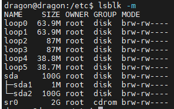

### 1.1.1磁盘挂载

#### 1.1.1.1临时挂载

1. 查看可用磁盘分区： 使用以下命令查看系统中的磁盘分区信息：

```bash
sudo fdisk -l  # 查看可用磁盘分区
```

2. 创建挂载点： 创建一个目录作为挂载点。这是磁盘将被挂载的位置。例如，创建一个名为 data 的 挂载点：

```bash
sudo mkdir /mnt/data
```

3. 挂载磁盘： 使用 mount 命令挂载磁盘。假设要挂载 /dev/sdb1 分区到 /mnt/data ：

```bash
sudo mount /dev/sdb1 /mnt/data
```

4. 查看挂载情况： 使用 df 命令查看已挂载的磁盘：

```bash
df -h
```

#### 1.1.1.2永久挂载

编辑 /etc/fstab

下面是一个示例，演示如何将磁盘设备永久挂载到指定的目录：

1. 编辑 /etc/fstab 文件：

```
sudo vi /etc/fstab
```

2.在文件的末尾添加一行，描述要挂载的磁盘设备和挂载点。格式如下：

```bash
UUID=<磁盘UUID> <挂载点> <文件系统类型> <挂载选项> <备份选项
```

可以使用以下命令获取磁盘的 UUID：

```bash
sudo blkid /dev/sda
```

示例：

```bash
UUID=12345678-9abc-def0-1234-567890abcdef /mnt/sda ext4 defaults 0 2
```

其中：

-  <磁盘UUID> 是磁盘的 UUID。 
- <挂载点> 是你希望挂载到的目录。 
- <文件系统类型> 是文件系统的类型（例如，ext4）。 
- <挂载选项> 是挂载选项，通常使用 defaults 。 
- <备份选项> 通常设置为 0 表示不进行备份，或者 1 表示进行备份。

3. 保存并关闭文件。
4. 重新挂载 /etc/fstab ，以确保没有错误：

```bash
sudo mount -a
```

5. 重启系统，验证是否在启动时自动挂载了磁盘。 请谨慎编辑 /etc/fstab 文件，确保你了解每项配置的含义，并备份数据以防发生问题。如果出现错误，可能导致系统启动失败，因此务必小心操作。

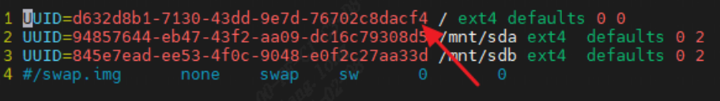

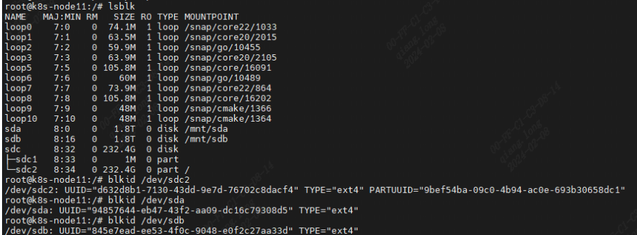

### 1.1.2取消挂载

1.查看已挂载的磁盘： 使用 df 命令查看已挂载的磁盘，并找到要取消挂载的磁盘：

```bash
df -h
```

2.取消挂载： 使用 umount 命令取消挂载磁盘。假设要取消挂载 /mnt/data ：

```bash
sudo umount /mnt/data
```

3.删除挂载点（可选）： 如果不再需要挂载点，可以删除它：

```bash
sudo rmdir /mnt/data
```

请注意，为了执行这些操作，你可能需要具有适当权限的管理员权限（通过 sudo ）。确保在进行磁盘操 作之前备份重要数据，以免意外数据丢失。


## 1.2 基础

```bash
jps   #查看java进程号
jstack java进程号  #查看java进程id详情 （包括死锁等情况）


#win下端口占用查杀
C:\Users\dragon>netstat -ano | findstr :10000
  TCP    127.0.0.1:10000        0.0.0.0:0              LISTENING       13940
C:\Users\dragon>tasklist |findstr 13940  #查看具体是什么进程
C:\Users\dragon>taskkill -f -pid 13940
成功: 已终止 PID 为 13940 的进程。


grep -r 关键字  #在当前文件夹下所有文件中找关键字，-r递归

#端口占用
lsof -i #有时不太管用
kill -9 pid #强杀
telnet ip 端口号  #判断端口所在服务是否可用

sudo netstat -tulpn |grep LISTEN #列出tcp端口
#k8s中遇到端口占用，先kubeadm reset,然后杀掉所有kube*相关端口，一定不能占用啥kill啥，一起kill掉，不然还是失败，kill之后重新执行kubeadm join命令。
```

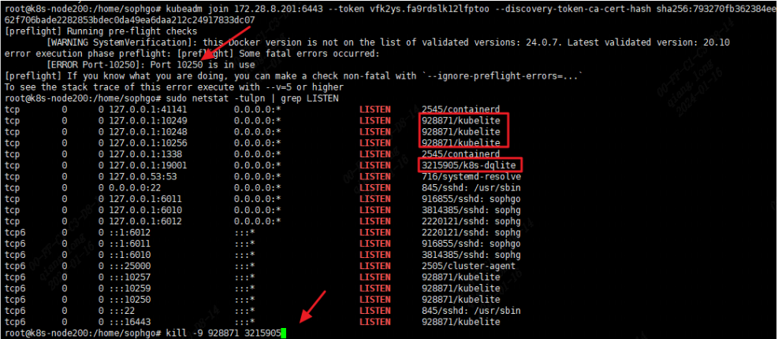


在当前文件夹下所有文件中找关键字：

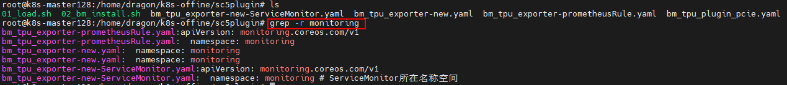

## 1.3 cpu占用

将如下代码打成jar包运行，死循环模拟cpu占用：

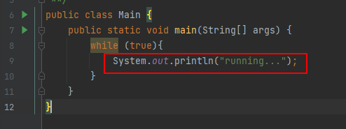

java -jar运行

1.top定位哪个进程占用cpu最高, 看java相关

```bash
top
```

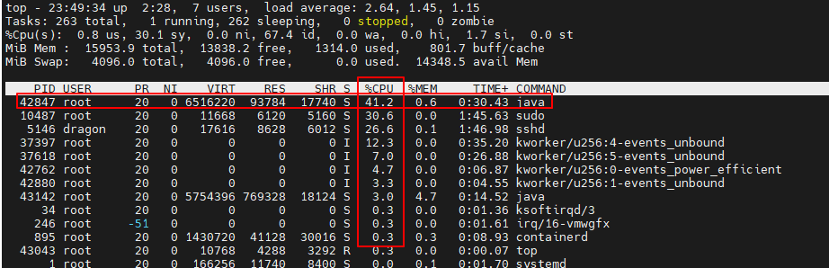

可以看出占用较高的java进程号为42847，ps核对一下:

```java
ps -ef |grep java
```

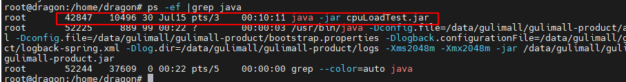

2. 定位具体线程

```bash
ps -mp 42847 -o THREAD,tid,time  #tid为线程号
```

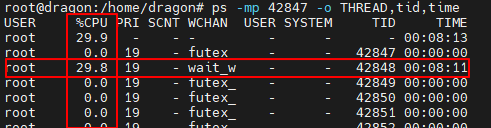

可以看出线程号为42848的占用cpu最高。

3.将线程号转为16进制小写，然后jstack根据进程号和线程号定位出问题的代码位置

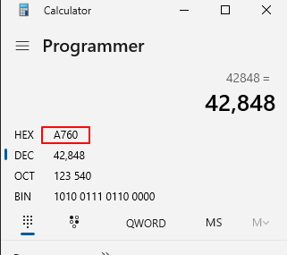


核对线程状态为runnable，可以看出Main类的第9行有问题，正是死循环里的System.*out*.println（这里为了简单，没写artifact，一般找公司名字相关的）

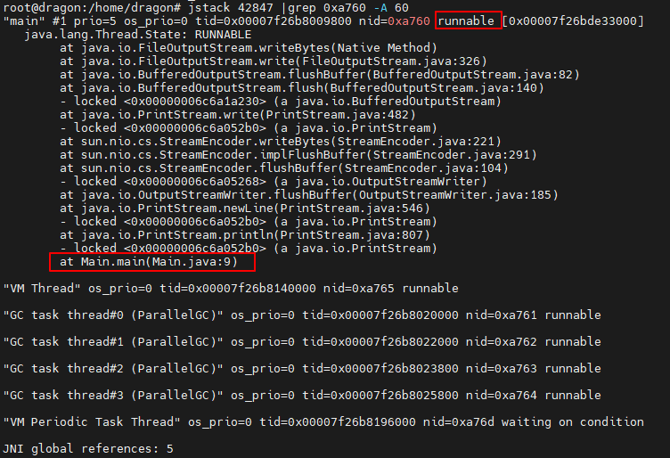


jstack查看进程下所有线程状态，找状态为runnable的：

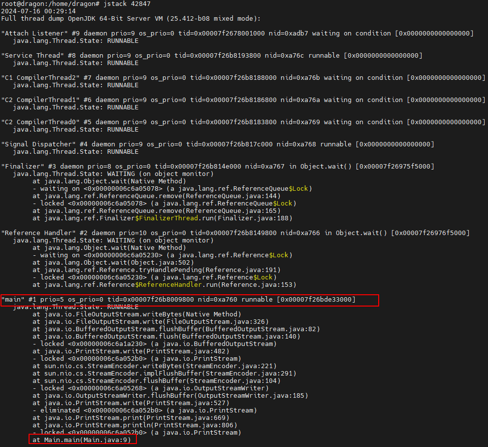


## 1.4 内存占用过高

故障（内存、cpu）排查汇总： https://mp.weixin.qq.com/s/lOEYJkB-H9nHpWSgY9UsEg


# 2.Docker

```bash
docker start $(docker ps -a -q) #启动所有容器，包括停止的。 -a 所有容器  -q 只显示容器id
docker restart $(docker ps -q)  #重启所有正在运行的容器
docker exec -it 容器ID bash  #进容器
docker exec -it d5ac6821dfe9 redis-cli -a 181181@Lq --raw  # 连接redis容器， -a密码 --raw显示中文
docker logs -f -t --tail=25 容器ID/名称  #查看容器最后25行日志,动态更新并显示时间戳
docker inspect containerID  #获取Docker容器的元数据、配置、网络设置等详细信息
exit #退出容器
docker ps -a #查看所有容器
docker images 
docker update --restart=always 容器ID #已启动的容器设置开机自启

#更改docker路径
docker info |grep Dir  #查看默认路径
vi /etc/docker/daemon.json #修改配置文件
#配置路径
"data-root": "/docker"
systemctl restart docker  #重启服务
docker cp 物理机路径 容器名（id）:容器内文件全路径


docker load -i 镜像tar包  #导入docker镜像 
docker save -o test.tar test:4.0   #从docker镜像导出本地文件
docker tag 02545f58c7e4 172.28.8.55:9500/grandhonor/behavior-construct-site:soc-2.0.26  #修改镜像tag

#私仓
docker login http://172.28.8.55:9500  #登录docker私仓，用户名密码都是admin (可以在算法仓配置表里看)
docker push 172.28.8.55:9500/grandhonor/behavior-construct-site:soc-2.0.26  #将镜像推送到私仓

```

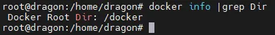


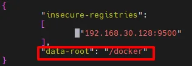

docker cp:复制文件到容器

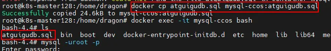


## 2.1 jar包制作docker镜像

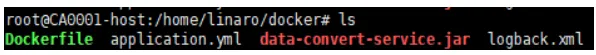

（1） 编写Dockerfile  

```bash
FROM openjdk:8-jre #使用jdk8镜像构建
ADD data-convert-service.jar data-convert-service.jar #将宿主机的jar包拷贝到容器镜像内
ADD logback.xml logback.xml #ADD logback.xml /data/logback.xml 容器没有的路径会自
动创建，无需手动创建
EXPOSE 1000 #暴露端口1000
CMD ["java","-jar","data-convert-service.jar"] #容器启动命令
```

（2）制作docker 镜像

```bash
docker build -t data-convert:1.0 . #-t 后面为镜像名：标签，标签一般为版本号 .表示基于
当前路径下的Dockerfile构建镜像
#执行完后docker images可以看到新打的镜像
```

（3）从镜像开出docker容器

```bash
docker run -d -p 1000:1000 data-convert:1.0 #-d后台运行 -p端口映射
```

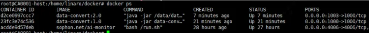

## 2.2 docker设置代理

有时候docker.hub会被墙，docker pull下不来镜像，配terminal代理也没用，后面才知道docker有自己的代理：

```json
#  vi /etc/docker/daemon.json配置代理
{
  "proxies": {
    "http-proxy": "http://192.168.1.4:7890", #填自己代理的ip端口
    "https-proxy": "http://192.168.1.4:7890"
 }
}

# 重启服务重新拉就行了
systemctl restart docker 
```


# 3.Redis

```bash
docker exec -it redis容器名 redis-cli -a 密码   #进redis容器
```


# 4.k8s

## 4.1 Node

```bash
kubectl get node -o wide -A  #列出所有节点
kubectl describe node k8s-node11 #查看节点详情（标签、资源总量、分配详情、pod详情等）

#移除节点
#法1：
kubeadm reset （要删除的node节点上执行，主节点上会重置整个集群，慎重操作）
kubectl delete node k8s-node191  #master节点上执行

#法2
主节点上执行：
kubectl drain <node name> --delete-local-data --force --ignore-daemonsets
kubectl delete node <node name>
要删除的节点上执行：
kubeadm reset


kubectl label node k8s-master191 bitmainnode=master --overwrite #为节点打标签
kubectl get nodes show-labels  #查看节点标签 
kubeadm token create print-join-command   #master节点打印加入命令，在node节点上执行可加入master节点
```

## 4.2 Pod

```bash
kubectl get pod -o wide -A  #列出集群中所有的 Pod
kubectl describe pod pod名 -n 命名空间 #查看pod详情：（异常时里面有event或者看log）常用
kubectl logs pod名 -n 命名空间 #查看pod日志（状态异常查看原因，常用）
kubectl delete pod pod名 -n 命名空间 #删除pod触发滚动更新,常用
kubectl exec -it pod名 -n 命名空间 -- /bin/sh #进入pod内部
```


## 4.3 Contatiner

```bash
kubectl describe pod <podname> -n <namespace>  # 获取pod的详细信息，包括容器
kubectl exec -it -n <namespace> <podname> -c <container-name> -- /bin/sh #进pod容器内部
```


# 5.vi

```bash
:%s/旧字符串/新字符串/g     #全局替换

#跨行操作
:n  #跳到指定行  如:5 跳到第5行
gg  #跳到第一行
G  #跳到最后一行


#行内操作
0  #跳到本行行首
$   #跳到本行行尾
w  #往右跳一词
b  #往左跳一词


复制：Visual模式下，y复制一行，p粘贴
撤销操作：u
```


