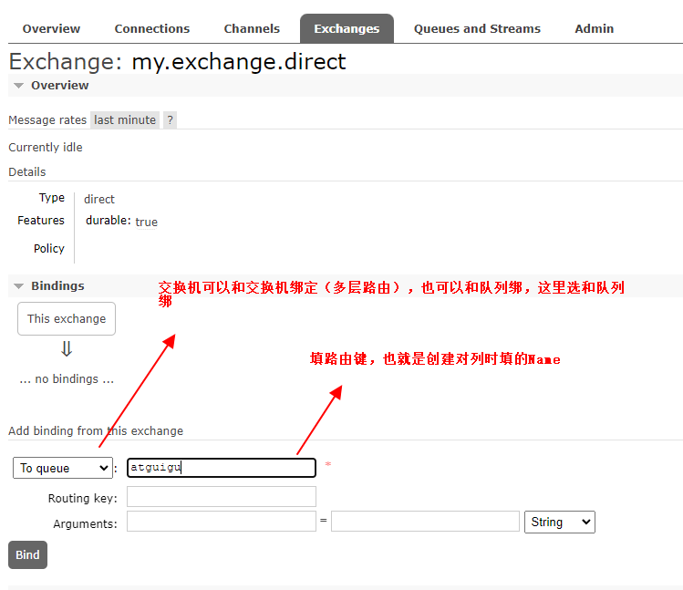
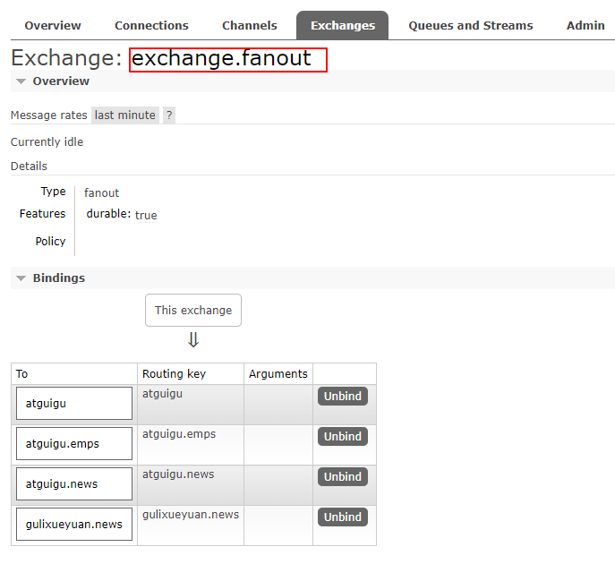
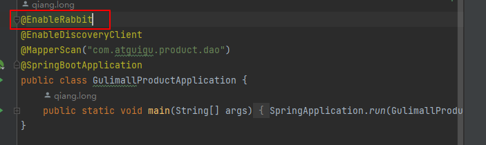
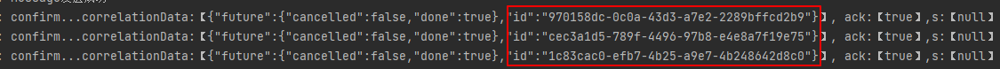
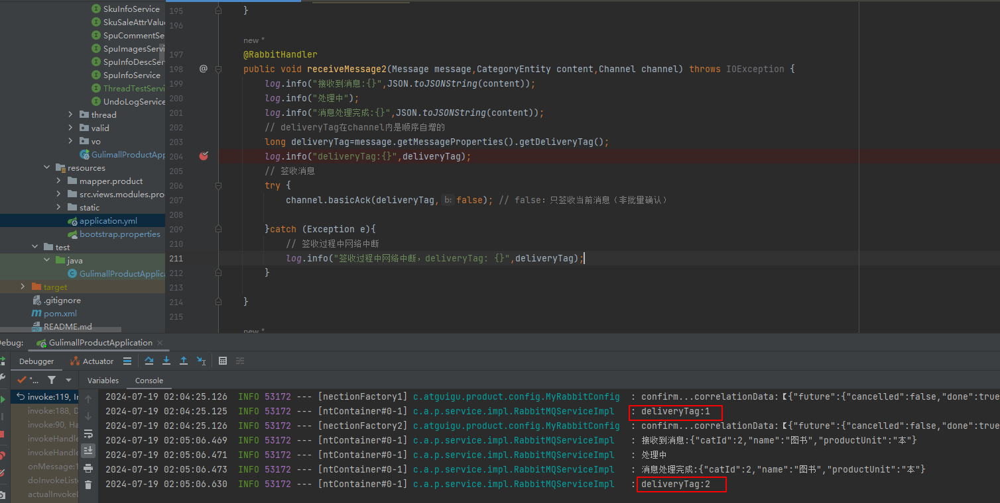

[toc]

参考：谷粒商城 RabbitMQ部分

# RabbitMQ

## 1. 第一章 安装

```bash
docker run -d --name rabbitmq -p 5671:5671 -p 5672:5672 -p 4369:4369 -p 25672:25672 -p 15671:15671 -p 15672:15672 rabbitmq:management   
```

端口参考：https://www.rabbitmq.com/docs/networking

4369，25672（Erlang发现&集群端口）

5672，5671（AMQP端口）

15672（web管理后台端口）

61613，61614（STOMP协议端口）

1883，8883（MQTT协议端口）


网页访问15672端口，账号密码都是guest


## 2. 第二章 核心概念

它是一个由erlang开发的 AMQP（Advanced Message Queue Protocol）开源实现。


核心概念

### 2.1 Message（消息）

消息是不具名的，由<font color=orange>**消息头**</font>和<font color=orange>**消息体**</font>组成。消息体是不透明的。消息头则由一系列的可选属性组成，包括<font color=orange>**routinig-key(路由键)、priority（相对于其他消息的优先权）、delivery-mode(指出该消息可能需要持久性存储)**</font>等。

### 2.2 Publisher（消息生产者）

是一个向交换器发布消息的客户端应用程序。

### 2.3 Exchange（交换机/器）

用来<font color=orange>**接收**</font>生产者发送的<font color=orange>**消息**</font>并将它们<font color=orange>**路由给服务器中的队列**</font>。

消息流向：消息由消费者产生，首先到达RabbitMQ服务器的消息代理(Broker)，然后由代理交给指定的交换机（Exchange），后面交换机路由到哪个消息队列由消息里的路由键决定（一个交换机可以绑定多个队列，一个队列也可以绑定多个交换机）。

**交换机类型介绍**

Exchange有4种类型：direct（默认）、fanout、topic、headers，不同类型转发消息的策略有所区别。headers匹配AMOP消息的header而不是路由键，它和direct交换器完全一致（<font color=oran>**它们在JMS中都是点对点通信，而fanout和topic都是发布订阅模式**</font>），但性能差很多，目前几乎用不到了，所以直接看另外三种类型：

#### 2.3.1 **Direct Exchange**

消息中的路由键如果和Binding中的binding key一致，交换机就将消息发送到对应的队列中。Exchange有4种类型：direct（默认）、fanout、topic、headers，不同类型转发消息的策略有所区别。<font color=red>**路由键与队列名完全匹配**</font>，如果一个队列绑定到交换机要求路由键为"dog"，则只转发routing key标记为"dog"的消息，不转发"dog.puppy"，也不转发"dog.guard"等，它是<font color=oran>**完全匹配、单播（点对点）**</font>的模式。


#### 2.3.2 Fanout Exchange

广播模式，每个发到fanout类型交换机的消息都会分发到所有与之绑定的队列上。不处理路由键，只是简单的将队列绑定到交换机上。该类型转发消息最快。


#### 2.3.3 Topic Exchange

发布订阅模式，topic交换机通过模式匹配分配消息的路由键属性，将<font color=orange>**路由键和某个模式进行匹配**</font>，此时队列需要绑定到一个模式上。它将路由键和绑定键的字符串切分成单次，这些单次之间用点隔开。它同样会识别两个通配符：**<font color=orange>#匹配0个或多个单词，*匹配一个单词</font>**。


### 2.4 Queue（消息队列）

用来保存消息直到发送给消费者。它是消息的容器，也是消息的终点。<font color=orange>**一个消息可投入一个或多个队列**</font>。消息一直在队列里面，等待消费者连接到这个队列将其取走。

### 2.5 Binding（绑定）

用于队列和交换器之间的关联。一个绑定就是基于<font color=orange>**路由键**</font>将交换器和消息队列连接起来的路由规则，所以可以将交换器理解为一个由绑定构成的路由表。Exchange和Queue的绑定可以是多对多的关系。

### 2.6 Connection（网络连接）

比如一个TCP连接

### 2.7 Channal（信道）

多路复用连接中的一条独立的双向数据流通道。信道是建立在真实的TCP连接内的虚拟连接，AMOP命令都是通过信道发出去的，不管是Exchange有4种类型：direct（默认）、fanout、topic、headers，不同类型转发消息的策略有所区别。**发布消息、订阅队列还是接收消息**</font>，这些动作都是通过信道完成。因为对于操作系统来说建立和销毁TCP都是非常昂贵的开销，所以引入了信道的概念，以复用一条TCP连接。

### 2.8 Virtual Host(虚拟主机)

表示一批交换器、消息队列和相关对象。虚拟主机是共享相同的身份认证和加密环境的独立服务器域。每个vhost本质是一个mini版的RabbitMQ服务器，拥有自己的队列、交换器、绑定和权限机制。vhost是AMQP概念的基础，必须在连接时指定，RabbitMQ默认的vhost是/ 。

虚拟主机用于环境的隔离，假设有两套系统，分别是java和php，都将消息发给RabbitMQ服务器（java和php分别有自己的虚拟主机，相互隔离），其中一个宕机了，不会影响另一套系统的使用。

### 2.9 Broker（消息队列服务器实体）


## 3. 第三章 rabbitMQ前端界面基本操作

官方文档：https://www.rabbitmq.com/docs


### 3.1 界面介绍

#### 3.1.1 Overview


#### 3.1.2 Connection


#### 3.1.3 Channals


#### 3.1.4 Exchanges


#### 3.1.5 Queues and Streams


#### 3.1.6 Admin

管理设置，包括用户、虚拟主机等等。


### 3.2 Exchanges测试

消息流向：消息由生产者产生，首先到达RabbitMQ服务器的消息代理，然后由代理交给指定的交换机（Exchange），后面交换机路由到哪个消息队列由消息里的路由键决定（一个交换机可以绑定多个队列，一个队列也可以绑定多个交换机）。

#### 3.2.1 **Direct Exchange**

填交换机名字，选direct类型，Durable持久化，其他保持默认，如下图：


参照3.3创建队列


然后将交换机和队列绑定：



绑定之后可以点unbind解绑


接下来按照如下图：

- 3个交换机
- 4个队列


交换机绑定队列：

exchange.direct和4个队列都绑定（队列名和路由键填相同）


发送消息：点开具体的交换机，publish message


回到队列，发现对应的队列中收到1条消息：


获取消息：有两种回复模式


#### 3.2.2 Fanout Exchange

测试前先将消息全部消费掉，然后为exchange.fanout交换机绑定4个队列



接着给路由键atguigu.emps发消息


发现所有队列都能收到：


#### 3.2.3 Topic Exchange

测试前先将消息全部消费掉，然后为exchange.topic交换机绑定4个队列，注意绑定的路由键为模糊匹配。


发送消息：

（1）路由键填hello.news ，由于只能匹配到队列gulixueyaun.news，所以只有它收到消息。


（2）消费掉所有消息后，路由键填atguigu.nihao，重新发送一条消息


3个匹配上的队列都收到了消息：


### 3.3 Queues测试

创建队列，如下图：


## 4. 第四章 Spring Boot整合rabbitMQ

### 4.1 rabbitMQ引入

#### 4.1.1 pom.xml引入spring-boot-starter-amqp依赖

```xml
<dependency>
    <groupId>org.springframework.boot</groupId>
    <artifactId>spring-boot-starter-amqp</artifactId>
</dependency>
```

#### 4.1.2 application.yml配置

默认配置类RabbitAutoConfiguration（引入依赖自动生效），会向IOC容器中注册RabbitTemplate、AmqpAdmin、CachingConnectionFactory、RabbitMessagingTemplate等组件

@EnableRabbit注解开启rabbitMQ


连接信息的配置都在RabbitProperties类中：


属性信息：@ConfigurationProperties(
    prefix = "spring.rabbitmq"
)


```yaml
#配置rabbitMQ连接
spring:
  rabbitmq:
    host: 192.168.30.130 # 服务器ip
    port: 5672  # 端口
    virtual-host: /  # 虚拟主机
    # 用户名密码，若为guest默认值则不用配置
    username: guest  
    password: guest  
```


### 4.2 组件使用

#### 4.2.1 AmqpAdmin（管理组件）

可以使用它创建交换器（Exchange）、队列（Queue）和绑定关系（Binding）

##### 4.2.1.1 创建交换机Exchange

交换机类型，实现Exchange接口


```java
@Slf4j
@SpringBootTest(classes = GulimallProductApplication.class )
public class GulimallProductApplicationTest {
    @Autowired
    AmqpAdmin amqpAdmin;  
    
    /**
     * @description:创建交换机
     */
    @Test
    public void createExchange(){
        /**DirectExchange全参构造
         DirectExchange(String name【交换机名字】,
         boolean durable【是否持久化】,
         boolean autoDelete【是否自动删除】,
         Map<String, Object> arguments【其他参数，对应前端arguments】)
         **/
        amqpAdmin.declareExchange(new DirectExchange("hello-java-exchange",true,false));
    }
}
```

创建成功：


##### 4.2.1.2 创建队列Queue

创建队列

```java
/**
     * @description:创建队列
     */
    @Test
    public void createQueue(){
        /**Queue全参构造
         Queue(String name【队列名】,
         boolean durable【是否持久化】,
         boolean exclusive【是否排它，即只能让当前连接连接到该队列，一般设为false】,
         boolean autoDelete【是否自动删除】,
         @Nullable Map<String, Object> arguments【其他参数，对应前端arguments】)
         **/
        amqpAdmin.declareQueue(new Queue("hello-java-queue", true,false,false));
    }
```

创建成功：


##### 4.2.1.3 创建绑定关系Binding

将交换机hello-java-exchange和队列hello-java-queue绑定，路由键使用"hello-java"


```java
 /**
     * @description:创建绑定
     */
    @Test
    public void createBinding(){
        /**Binding全参构造
         Binding(String destination【目的地，传队列或交换机的名字】,
         DestinationType destinationType【类型，和队列还是交换机绑定】,
         String exchange【起始交换机】,
         String routingKey【路由键】,
         @Nullable Map<String, Object> arguments【自定义参数】)
         **/
        amqpAdmin.declareBinding(new Binding("hello-java-queue", Binding.DestinationType.QUEUE,"hello-java-exchange","hello-java",null));
    }
```

绑定成功：


#### 4.2.2 RabbitTemplate（消息发送组件）

##### 4.2.2.1 以String发送

给hello-java-exchange交换机发消息"hello-world!"，使用路由键"hello-java"，由于是direct型，所以队列hello-java-queue会收到消息。

```java
@Slf4j
@SpringBootTest(classes = GulimallProductApplication.class )
public class GulimallProductApplicationTest {
    @Autowired
    RabbitTemplate rabbitTemplate;
    /**
     * @description:发送消息
     */
    @Test
    public void sendMessage(){
        /**convertAndSend参数
         convertAndSend(String exchange【给哪个交换机发消息】,
         String routingKey【路由键】,
         Object object【消息内容】)
         **/
        rabbitTemplate.convertAndSend("hello-java-exchange","hello-java","hello-world!");
    }
}
```


##### 4.2.2.2 以json字符串发送（对象）

发送的消息可以是一个对象，但前端无法直接显示，所以一般以对象的json字符串形式发送。实现该功能要求：

- 发送的对象所属类必须实现Serializable接口
- rabbitMQ配置对象转换器Jackson2JsonMessageConverter

RabbitAutoConfiguration配置中有一个MessageConverter用来配置对象转换


MessageConverter接口有多个实现，选择Jackson2JsonMessageConverter，用于对象和json字符串的转换


所以新建配置类MyRabbitConfig

```java
@Configuration
public class MyRabbitConfig {
    @Bean
    public MessageConverter messageConverter(){
        return new Jackson2JsonMessageConverter();
    }
}
```


准备消息类:


发送一个CategoryEntity对象的消息：

```java
/**
     * @description:发送消息
     */
    @Test
    public void sendMessage(){
        /**convertAndSend参数
         convertAndSend(String exchange【给哪个交换机发消息】,
         String routingKey【路由键】,
         Object object【消息内容】)
         **/
        // 以json形式发送消息对象
        CategoryEntity category=new CategoryEntity();
        category.setCatId(1L);
        category.setName("图书");
        category.setProductUnit("本");
        rabbitTemplate.convertAndSend("hello-java-exchange","hello-java",category);
        log.info("Message发送成功");
    }
```


#### 4.2.3 RabbitListener  &  RabbitHandler接收（消费）消息

<font color=red>**要监听消息，必须开启@EnableRabbit注解。**</font>



##### 4.2.3.1 RabbitListener  注解

Rabbit监听器，用于监听指定队列里的内容。业务逻辑中使用RabbitListener监听消息。<font color=red>**RabbitListener 注解 可以标在类或方法上。**</font>


- **<font color=orange>方法1：使用原生Message接收消息，拿到消息头，消息体，然后将消息体反序列化为具体对象。</font>**

```java
import org.springframework.amqp.core.Message;

@Slf4j
@Service("categoryService")
public class CategoryServiceImpl extends ServiceImpl<CategoryDao, CategoryEntity> implements CategoryService {
    /**
     * @description: 监听rabbit队列里的消息
     * @RabbitListener(queues = {"hello-java-queue"}) :queues是一个数组（可以监听多个队列），写要监听队列的名字
     **/
    @RabbitListener(queues = {"hello-java-queue"})
    public void receiveMessage1(Message message){
        MessageProperties messageProperties=message.getMessageProperties(); // 消息头
        byte[] body=message.getBody(); // 消息体
        CategoryEntity categoryEntity=JSON.parseObject(body,CategoryEntity.class); // 反序列化
        log.info("消息头：{}，消息体：{}",JSON.toJSONString(messageProperties),JSON.toJSONString(categoryEntity));
    }
}
```

打印内容（同时rabbitMQ前端界面hello-java-queue队列里的消息被消费清除了）：

```bash
2024-07-18 15:55:57.144  INFO 46888 --- [ntContainer#0-1] c.a.p.service.impl.CategoryServiceImpl   : 消息头：{"consumerQueue":"hello-java-queue","consumerTag":"amq.ctag-daiNjM-va15CeIQgNeHFxw","contentEncoding":"UTF-8","contentLength":0,"contentType":"application/json","deliveryTag":1,"finalRetryForMessageWithNoId":false,"headers":{"__TypeId__":"com.atguigu.product.entity.CategoryEntity"},"lastInBatch":false,"priority":0,"projectionUsed":false,"publishSequenceNumber":0,"receivedDeliveryMode":"PERSISTENT","receivedExchange":"hello-java-exchange","receivedRoutingKey":"hello-java","redelivered":false}，消息体：{"catId":1,"name":"图书","productUnit":"本"}
```


- **<font color=orange>方法2：直接用具体对象接，会自动解析</font>**

```java
import org.springframework.amqp.core.Message;
import com.rabbitmq.client.Channel;
/**
     * 参数可写以下类型：
     * Message message： 使用原生Message（含消息头+消息体）接收
     * CategoryEntity content： 使用具体类接收（和发送的消息类保持一致）
     * Channel channel：通道
     **/
    @RabbitListener(queues = {"hello-java-queue"})
    public void receiveMessage2(Message message, CategoryEntity content, Channel channel{
        log.info("消息体：{}",JSON.toJSONString(content));
    }
```


```bash
2024-07-18 16:05:49.805  INFO 48140 --- [ntContainer#0-1] c.a.p.service.impl.CategoryServiceImpl   : 消息体：{"catId":1,"name":"图书","productUnit":"本"}
```


<font color=orange>**注意：**</font>

- <font color=orange>**可以有很多人（竞争关系）监听，只要收到消息，队列删除消息，且只能有一个收到此消息**</font>。

测试：弄两个gulimall-product的实例，然后发送10条消息（往实例192.168.30.130发发送消息请求，每发送一次catId加1，模拟不同消息）。receiveMessage2方法同时监听hello-java-queue队列。


192.168.30.128实例：


192.168.30.30实例：


可以发现各消费5条消息。


- <font color=orange>**单个服务只有1条消息处理完，才能接收下一条消息**</font>。

测试：单实例下，休眠3s模拟业务处理

```java
	@RabbitListener(queues = {"hello-java-queue"})
    public void receiveMessage2(Message message, CategoryEntity content, Channel channel) throws InterruptedException {
        log.info("接收到消息:{}",JSON.toJSONString(content));
        // 休眠3s模拟业务处理
        Thread.sleep(3000);
        log.info("消息处理完成:{}：{}",JSON.toJSONString(content));
    }
```

可以看出只有处理完消息2才能处理3，处理完3才能处理4：

```bash
2024-07-18 18:51:36.372  INFO 50536 --- [ntContainer#0-1] c.a.p.service.impl.RabbitMQServiceImpl   : 接收到消息:{"catId":2,"name":"图书","productUnit":"本"}
2024-07-18 18:51:39.374  INFO 50536 --- [ntContainer#0-1] c.a.p.service.impl.RabbitMQServiceImpl   : 消息处理完成:{"catId":2,"name":"图书","productUnit":"本"}：{}
2024-07-18 18:51:39.375  INFO 50536 --- [ntContainer#0-1] c.a.p.service.impl.RabbitMQServiceImpl   : 接收到消息:{"catId":3,"name":"图书","productUnit":"本"}
2024-07-18 18:51:42.382  INFO 50536 --- [ntContainer#0-1] c.a.p.service.impl.RabbitMQServiceImpl   : 消息处理完成:{"catId":3,"name":"图书","productUnit":"本"}：{}
2024-07-18 18:51:42.383  INFO 50536 --- [ntContainer#0-1] c.a.p.service.impl.RabbitMQServiceImpl   : 接收到消息:{"catId":4,"name":"图书","productUnit":"本"}
2024-07-18 18:51:45.383  INFO 50536 --- [ntContainer#0-1] c.a.p.service.impl.RabbitMQServiceImpl   : 消息处理完成:{"catId":4,"name":"图书","productUnit":"本"}：{}
```


##### 4.2.3.2 RabbitHandler注解

该注解也可以用来监听消息，但<font color=red>**RabbitHandler注解 只能标在方法上。**</font>


RabbitListener+RabbitHandler组合的一个应用场景：

首先调sendMessage2发送10条消息，偶数发CategoryEntity型消息，奇数发BrandEntity型消息。

<font color=red>**@RabbitListener注解标注在类上，表示要监听哪些队列里的消息**</font>，比如下面监听hello-java-queue队列。

 **<font color=red>@RabbitHandler标注在方法上，用来重载区分不同类型的消息</font>**。比如下面receiveMessage2只接收CategoryEntity类型的消息，receiveMessage3只接收BrandEntity类型的消息。

```java
@Slf4j
@Service
@RabbitListener(queues = {"hello-java-queue"})  // 监听队列hello-java-queue中的消息
public class RabbitMQServiceImpl implements RabbitMQService {
    @Autowired
    AmqpAdmin amqpAdmin;
    @Autowired
    RabbitTemplate rabbitTemplate;
    
    /**
     * @description:发送消息
     */
    @Override
    public void sendMessage2(int num){
        for(int i=1;i<=num;i++){
            if(i%2==0){ // 偶数发CategoryEntity型消息
                CategoryEntity category=new CategoryEntity();
                category.setCatId((long)i);
                category.setName("图书");
                category.setProductUnit("本");
                rabbitTemplate.convertAndSend("hello-java-exchange","hello-java",category);
            }else{  // 奇数发BrandEntity型消息
                BrandEntity brandEntity=new BrandEntity();
                brandEntity.setBrandId((long)i);
                brandEntity.setName("华为");
                brandEntity.setLogo("HUAWEI");
                rabbitTemplate.convertAndSend("hello-java-exchange","hello-java",brandEntity);
            }
        }
        log.info("Message发送成功");
    }

   
    /**
     * @description:监听CategoryEntity类型的消息
     */
    @RabbitHandler
    public void receiveMessage2(CategoryEntity content){
        log.info("接收到消息:{}",JSON.toJSONString(content));
    }
    
	/**
     * @description:监听BrandEntity类型的消息
     */
    @RabbitHandler
    public void receiveMessage3(BrandEntity content){
        log.info("接收到消息:{}",JSON.toJSONString(content));
    }
}
```

从下面的结果可以看出：能够收到CategoryEntity和BrandEntity两种类型的消息。

```java
2024-07-18 19:30:42.830  INFO 35916 --- [io-10000-exec-2] c.a.p.service.impl.RabbitMQServiceImpl   : Message发送成功
2024-07-18 19:30:42.856  INFO 35916 --- [ntContainer#0-1] c.a.p.service.impl.RabbitMQServiceImpl   : 接收到消息:{"brandId":1,"logo":"HUAWEI","name":"华为"}
2024-07-18 19:30:42.862  INFO 35916 --- [ntContainer#0-1] c.a.p.service.impl.RabbitMQServiceImpl   : 接收到消息:{"catId":2,"name":"图书","productUnit":"本"}
2024-07-18 19:30:42.862  INFO 35916 --- [ntContainer#0-1] c.a.p.service.impl.RabbitMQServiceImpl   : 接收到消息:{"brandId":3,"logo":"HUAWEI","name":"华为"}
2024-07-18 19:30:42.862  INFO 35916 --- [ntContainer#0-1] c.a.p.service.impl.RabbitMQServiceImpl   : 接收到消息:{"catId":4,"name":"图书","productUnit":"本"}
2024-07-18 19:30:42.862  INFO 35916 --- [ntContainer#0-1] c.a.p.service.impl.RabbitMQServiceImpl   : 接收到消息:{"brandId":5,"logo":"HUAWEI","name":"华为"}
2024-07-18 19:30:42.863  INFO 35916 --- [ntContainer#0-1] c.a.p.service.impl.RabbitMQServiceImpl   : 接收到消息:{"catId":6,"name":"图书","productUnit":"本"}
2024-07-18 19:30:42.863  INFO 35916 --- [ntContainer#0-1] c.a.p.service.impl.RabbitMQServiceImpl   : 接收到消息:{"brandId":7,"logo":"HUAWEI","name":"华为"}
2024-07-18 19:30:42.863  INFO 35916 --- [ntContainer#0-1] c.a.p.service.impl.RabbitMQServiceImpl   : 接收到消息:{"catId":8,"name":"图书","productUnit":"本"}
2024-07-18 19:30:42.863  INFO 35916 --- [ntContainer#0-1] c.a.p.service.impl.RabbitMQServiceImpl   : 接收到消息:{"brandId":9,"logo":"HUAWEI","name":"华为"}
2024-07-18 19:30:42.863  INFO 35916 --- [ntContainer#0-1] c.a.p.service.impl.RabbitMQServiceImpl   : 接收到消息:{"catId":10,"name":"图书","productUnit":"本"}
```

### 4.3 @Bean声明式创建队列、交换机、绑定关系

配置类中@Bean声明式创建队列、交换机、绑定关系，会将它们以Bean的形式注册到IOC容器中

```java
@Slf4j
@Configuration
public class RabbitMQOneConfig {
    /**
     * @description: 创建死信队列 order.delay.queue
     **/
    @Bean
    public Queue orderDelayQueue(){
        Map<String, Object> arguments=new HashMap<>();
        arguments.put("x-dead-letter-exchange","order-event-exchange");
        arguments.put("x-dead-letter-routing-key","order.release.order");
        arguments.put("x-message-ttl",60000); // 单位ms ，即1min
        Queue queue=new Queue("order.delay.queue", true,false,false,arguments);
        return queue;
    }

    /**
     * @description: 创建队列 order.release.order.queue
     **/
    @Bean
    public Queue orderReleaseOrderQueue(){
        Queue queue=new Queue("order.release.order.queue", true,false,false);
        return queue;
    }

    /**
     * @description: 创建交换器：order-event-exchange
     **/
    @Bean
    public Exchange orderEventExchange(){
        TopicExchange topicExchange=new TopicExchange("order-event-exchange",true,false);
        return topicExchange;
    }
    /**
     * @description: 创建绑定关系：orderCreateOrderBinding
     **/
    @Bean
    public Binding orderCreateOrderBinding(){
        Binding binding=new Binding("order.delay.queue", Binding.DestinationType.QUEUE,"order-event-exchange","order.create.order",null);
        return binding;
    }
    /**
     * @description: 创建绑定关系：orderReleaseOrderBinding
     **/
    @Bean
    public Binding orderReleaseOrderBinding(){
        Binding binding=new Binding("order.release.order.queue", Binding.DestinationType.QUEUE
                ,"order-event-exchange","order.release.order",null);
        return binding;
    }

    /**
     * @description: 监听队列 order.release.order.queue
     **/
    @RabbitListener(queues = "order.release.order.queue")
    public void listenQueue(OrderEntity order, Channel channel,Message message) throws IOException {
        log.info("收到过期的订单信息：{}, 准备关闭订单",JSON.toJSONString(order));
        channel.basicAck(message.getMessageProperties().getDeliveryTag(),false); // 手动确认，非批量
    }
}
```

**<font color=red>必须写一个监听@RabbitListener（不写不会创建）</font>**

做好上述两步，以及其他配置正常，每次启动服务就会创建对应的队列、交换机和绑定关系，前提是之前不存在，之前存在的不会覆盖，需要手动删除：


## 5. 第五章 消息确认机制

为了保证消息不丢失，可靠抵达，可以使用事务消息，但性能下降250倍，为此引入确认机制。


- <font color=orange>**publisher confirmCallback确认模式**</font>：生产者发送的消息成功抵达MQ服务器Broker后回调，向publisher发消息表明收到。（成功触发）
- <font color=orange>**publisher returnCallback未投递到queue退回模式**</font>：从交换机到队列的过程中，若消息投递失败（比如投递过程中目标队列被其他客户端删除），调用returnCallback，向publisher发消息表明投递失败。（失败触发）
- <font color=orange>**consumer ack机制**</font>：从队列到消费者的过程中，如果新消息被消费者成功消费，则向服务端返回确认信息，表明已经消费完成，MQ服务器就会将该消息从队列中移除；若消费失败，则应该将消息重新加入队列。


为何要保证可靠抵达：网络原因、服务器宕机、生产者把消息发出去了但MQ服务器没收到、MQ服务器把消息发出去了但消费者没收到等等。

官方文档：https://www.rabbitmq.com/docs/reliability


### 5.1 confirmCallback-成功抵达回调

<font color=orange>**触发时机：生产者发送的消息成功抵达了MQ服务器Broker就会调用；如果是集群（cluster）模式，则需要被所有broker接收才会调用**</font>。被broker接收只能表明message已经到达服务器，并无法保证消息一定会被投递到目标Queue里，所以需要接下来的returnCallback。


要使用confirmCallback，必须配置：

```yaml
spring:
  rabbitmq:
    publisher-confirm-type: correlated # 开启confirmCallback回调(低版本配置为publisher-confirms: true)
```

ConfirmCallback接口在RabbitTemplate类中：

```java
/**
 var1：消息的唯一id
 var2: 消息是否成功抵达Broker
 var3：出现异常的原因（没有成功抵达Broker）
 */
@FunctionalInterface
public interface ConfirmCallback {
    void confirm(@Nullable CorrelationData var1, boolean var2, @Nullable String var3);
}
```


定制RabbitTemplate：设置ConfirmCallback并重写其中的confirm方法，直接打印broker是否收到消息，若没收到显示失败原因。

```java
@Slf4j
@Configuration
public class MyRabbitConfig {
    @Autowired
    RabbitTemplate rabbitTemplate;
    /**
     * @description: 定制化RabbitTemplate
     */
    @PostConstruct // 让MyRabbitConfig对象创造完成后再调用initRabbitTemplate方法
    public void initRabbitTemplate(){
        // 设置确认回调
        rabbitTemplate.setConfirmCallback(new RabbitTemplate.ConfirmCallback(){
            /**
             * @param correlationData :消息的唯一标识
             * @param b 消息是否成功抵达Broker
             * @param s 失败的原因
             **/
            @Override
            public void confirm(CorrelationData correlationData, boolean b, String s) {
                log.info("confirm...correlationData:【{}】, ack:【{}】,s:【{}】", JSON.toJSONString(correlationData),b,s);
            }
        });
    }
}
```

测试：调接口发送3个消息，可以看出都收到了（ack为true）

```bash
2024-07-19 00:34:07.347  INFO 55124 --- [nectionFactory1] c.atguigu.product.config.MyRabbitConfig  : confirm...correlationData:【null】, ack:【true】,s:【null】
2024-07-19 00:34:07.347  INFO 55124 --- [nectionFactory2] c.atguigu.product.config.MyRabbitConfig  : confirm...correlationData:【null】, ack:【true】,s:【null】
2024-07-19 00:34:07.348  INFO 55124 --- [nectionFactory2] c.atguigu.product.config.MyRabbitConfig  : confirm...correlationData:【null】, ack:【true】,s:【null】
2024-07-19 00:34:07.349  INFO 55124 --- [io-10000-exec-2] c.a.p.service.impl.RabbitMQServiceImpl   : Message发送成功
```


#### 5.1.1 **改进-设置消息唯一ID**

在发消息那里指定消息唯一ID：加一个参数new CorrelationData(UUID.randomUUID().toString())，使用UUID随机产生。这样做的好处：消息发给交换机时可以将消息唯一ID和内容保存到MySQL数据库，如果MQ服务器或消费者没收到生产者发的消息，可以将状态同步到数据库中，之后遍历数据库就能找出未成功抵达的消息，重新投递，保证可靠性，消费者还能知道收到的是哪个消息。

```java
@Override
    public void sendMessage2(int num){
        for(int i=1;i<=num;i++){
            if(i%2==0){ // 偶数发CategoryEntity型消息
                CategoryEntity category=new CategoryEntity();
                ....
                rabbitTemplate.convertAndSend("hello-java-exchange","hello-java",category,new CorrelationData(UUID.randomUUID().toString())); // 最后一个参数指定消息的唯一ID
            }else{ 
                ......
            }
        }
    }
```

ConfirmCallback中可以看到消息id了：



### 5.2 returnCallback-投递队列失败回调

<font color=orange>**触发：消息投送指定队列失败**</font>

application.yml配置开启returnCallback：

```yaml
spring:
  rabbitmq:
    publisher-returns: true  #开启returnCallback（消息抵达队列确认）
    template:
      mandatory: true  #只要抵达队列，优先以异步方式回调
```


设置消息抵达确认回调，在MyRabbitConfig中定制化RabbitTemplate：重写returnedMessage方法，若投递到指定队列失败，打印投递失败的消息详细信息、状态码、回复内容、交换机、路由键信息。

```java
@Slf4j
@Configuration
public class MyRabbitConfig {
    @Autowired
    RabbitTemplate rabbitTemplate;
    /**
     * @description: 定制化RabbitTemplate
     */
    @PostConstruct // 让MyRabbitConfig对象创造完成后再调用initRabbitTemplate方法
    public void initRabbitTemplate(){
        // 设置确认回调
        rabbitTemplate.setConfirmCallback(new RabbitTemplate.ConfirmCallback(){
            /**
             * @param correlationData :消息的唯一标识
             * @param b 消息是否成功抵达Broker
             * @param s 失败的原因
             **/
            @Override
            public void confirm(CorrelationData correlationData, boolean b, String s) {
                log.info("confirm...correlationData:【{}】, ack:【{}】,s:【{}】", JSON.toJSONString(correlationData),b,s);
            }
        });

        // 设置消息抵达队列回调
        rabbitTemplate.setReturnsCallback(new RabbitTemplate.ReturnsCallback(){
            /**
             * @description: 只要消息未投递到指定队列，就触发回调
             ReturnedMessage里的属性：
             Message message：投递失败的消息详细信息
             int replyCode：回复的状态码
             String replyText：回复的内容
             String exchange：当时消息是发给哪个交换机的
             String routingKey：消息指定的路由键
             **/
            @Override
            public void returnedMessage(ReturnedMessage returnedMessage) {
                log.info("Fail Message:【{}】,replyCode:【{}】,replyText:【{}】,exchange:【{}】,routingKey:【{}】",
                        JSON.toJSONString(returnedMessage.getMessage()),
                        returnedMessage.getReplyCode(),
                        returnedMessage.getReplyText(),
                        returnedMessage.getExchange(),
                        returnedMessage.getRoutingKey());
            }
        });
    }
}
```


模拟发送失败：发消息时指定路由键hello-java22（不存在）


调接口发送6条消息：可以看出路由键为hello-java22投递到队列都失败了

```java
2024-07-19 01:01:38.617  INFO 54260 --- [nectionFactory1] c.atguigu.product.config.MyRabbitConfig  : Fail Message:【(Body:'[B@3229e97f(byte[110])' MessageProperties [headers={__TypeId__=com.atguigu.product.entity.BrandEntity}, contentType=application/json, contentEncoding=UTF-8, contentLength=0, receivedDeliveryMode=PERSISTENT, priority=0, deliveryTag=0])】,replyCode:【312】,replyText:【NO_ROUTE】,exchange:【hello-java-exchange】,routingKey:【hello-java22】 #失败的路由键
2024-07-19 01:01:38.623  INFO 54260 --- [nectionFactory1] c.atguigu.product.config.MyRabbitConfig  : confirm...correlationData:【null】, ack:【true】,s:【null】
2024-07-19 01:01:38.624  INFO 54260 --- [nectionFactory1] c.atguigu.product.config.MyRabbitConfig  : confirm...correlationData:【null】, ack:【true】,s:【null】
2024-07-19 01:01:38.625  INFO 54260 --- [nectionFactory1] c.atguigu.product.config.MyRabbitConfig  : Fail Message:【(Body:'[B@622672be(byte[110])' MessageProperties [headers={__TypeId__=com.atguigu.product.entity.BrandEntity}, contentType=application/json, contentEncoding=UTF-8, contentLength=0, receivedDeliveryMode=PERSISTENT, priority=0, deliveryTag=0])】,replyCode:【312】,replyText:【NO_ROUTE】,exchange:【hello-java-exchange】,routingKey:【hello-java22】
2024-07-19 01:01:38.626  INFO 54260 --- [nectionFactory2] c.atguigu.product.config.MyRabbitConfig  : confirm...correlationData:【null】, ack:【true】,s:【null】
2024-07-19 01:01:38.626  INFO 54260 --- [nectionFactory1] c.atguigu.product.config.MyRabbitConfig  : confirm...correlationData:【null】, ack:【true】,s:【null】
2024-07-19 01:01:38.626  INFO 54260 --- [nectionFactory2] c.atguigu.product.config.MyRabbitConfig  : Fail Message:【(Body:'[B@847275b(byte[110])' MessageProperties [headers={__TypeId__=com.atguigu.product.entity.BrandEntity}, contentType=application/json, contentEncoding=UTF-8, contentLength=0, receivedDeliveryMode=PERSISTENT, priority=0, deliveryTag=0])】,replyCode:【312】,replyText:【NO_ROUTE】,exchange:【hello-java-exchange】,routingKey:【hello-java22】  
```

### 5.3 consumer ack机制

消费者获取到消息，成功处理，可以回复Ack给Broker

- basic.ack：  用于肯定确认，broker可以移除此消息
- basic.nack：用于否定确认，可以指定broker是否丢弃此消息，可以批量
- basic.reject：同上，但不能批量

<font color=orange>**默认：消息被消费者收到，就会从broker的Queue中移除**。</font>

Queue无消费者，消息依然会被存储，直至被消费者消费。

消费者收到消息，默认会自动ack。但若无法确定此消息是否被成功处理完成，可以开启手动ack模式。

- 消息处理成功：ack()，接收下一个消息，此消息就会被broker移除
- 消息处理失败，nack()/ reject()，重新发送给其他人进行处理，或者容错处理后ack
- 消息一直未调用ack/nack方法，broker认为此消息正在被处理，不会投递给别人，此时客户端断开，消息不会被broker移除，会投递给别人。


测试1：默认消息被消费者收到，就会从broker的Queue中移除。

先发送5条消息，在监听方法中间打断点，模拟处理消息过程，处理完1条消息后，该消息被移除，前端显示4条，之后处理下一条，在这个过程中<font color=orange>**停掉该服务(模拟宕机)**</font>，再看前端发现消息条数为0，这样就<font color=orange>**丢掉了未处理的4条消息**</font>。


#### 5.3.1 手动签收消息

收到5条消息，只成功处理1条，宕机导致其他消息丢失。原因在于消费者一连上队列（MQ服务器）就自动回复了。为解决这个问题，改为<font color=orange>**手动确认**</font>。

配置：

```yaml
spring:
  rabbitmq:
    listener:
      simple:
        acknowledge-mode: manual # 消费者开启消息手动确认模式
```

<font color=orange>**手动签收模式下，只要没明确告诉MQ消息被签收，即使消费者宕机，消息也一直是unacked状态，不会丢失。**</font>

如何手动签收?

调Channal的basicAck方法：

```java
@RabbitHandler
public void receiveMessage2(Message message,CategoryEntity content,Channel channel){
    log.info("接收到消息:{}",JSON.toJSONString(content));
    log.info("处理中");
    log.info("消息处理完成:{}",JSON.toJSONString(content));
    // deliveryTag在channel内是顺序自增的
    long deliveryTag=message.getMessageProperties().getDeliveryTag();
    log.info("deliveryTag:{}",deliveryTag);
    // 签收消息
    try {
        channel.basicAck(deliveryTag,false); // false：只签收当前消息（非批量确认）
    }catch (Exception e){
        // 签收过程中网络中断
        log.info("签收过程中网络中断，deliveryTag: {}",deliveryTag);
    }
}
```


还是开始发5个消息，打上断点一个个签收：



签收2条后队列中还有3条：


此时间服务停调：重新查看前端界面，剩余3条消息未丢失


可以看到，<font color=orange>**即使中断了，程序仍然会运行下去**</font>（处理消息3、4、5，但是处理会失败，如果没有设置手动签收模式，那么相当于高速MQ服务器全部签收完成了）


#### 5.3.2 手动拒收消息

<font color=orange>**拒收消息：使用basicNack或者basicReject**</font>。又有<font color=orange>**两种**</font>情况：

- 发回MQ服务器，<font color=orange>**让消息重新入队**</font>
- <font color=orange>**直接丢弃**</font>

```java
@RabbitHandler
public void receiveMessage2(Message message,CategoryEntity content,Channel channel) throws IOException {
    log.info("接收到消息:{}",JSON.toJSONString(content));
    log.info("处理中");
    log.info("消息处理完成:{}",JSON.toJSONString(content));
    // deliveryTag在channel内是顺序自增的
    long deliveryTag=message.getMessageProperties().getDeliveryTag();
    log.info("deliveryTag:{}",deliveryTag);
    // 签收消息
    try {
        // 签收
        if(deliveryTag%2==0){
            channel.basicAck(deliveryTag,false); // false：只签收当前消息（非批量确认）
            log.info("签收了消息：{}",deliveryTag);
        }else{ // 拒收消息
            /**
             1. basicNack里的参数
             long deliveryTag: 拒收消息的标签
            boolean var3： 是否批量拒收
            boolean var4：消息是否重新入队,true:发回MQ服务器，让消息重新入队 false: 丢弃
             **/
            channel.basicNack(deliveryTag,false,false);
            /**
             2. basicReject里的参数
             boolean var1： 是否批量拒收
             boolean var3：消息是否重新入队,true:发回MQ服务器，让消息重新入队 false: 丢弃
             **/
            //channel.basicReject();
            log.info("拒收消息直接丢弃：{}",deliveryTag);
        }
    }catch (Exception e){
        // 签收过程中网络中断
        log.info("签收过程中网络中断，deliveryTag: {}",deliveryTag);
    }
}

```

测试：首先发送5条消息，然后手动处理一条（直接丢弃），剩下4条。


前端只剩4条：


库存锁定成功后订单服务发生异常，订单滚库存不滚，库存工作单详情有内容：

