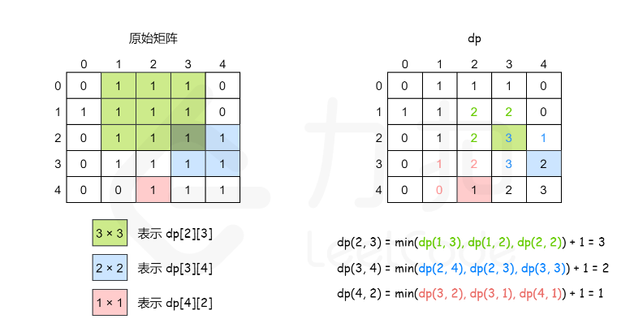
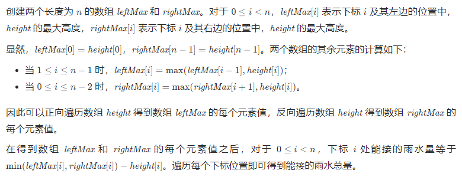
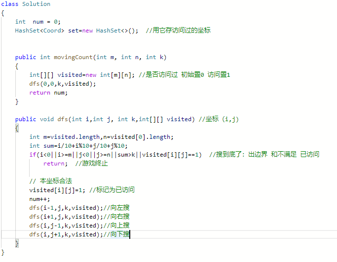
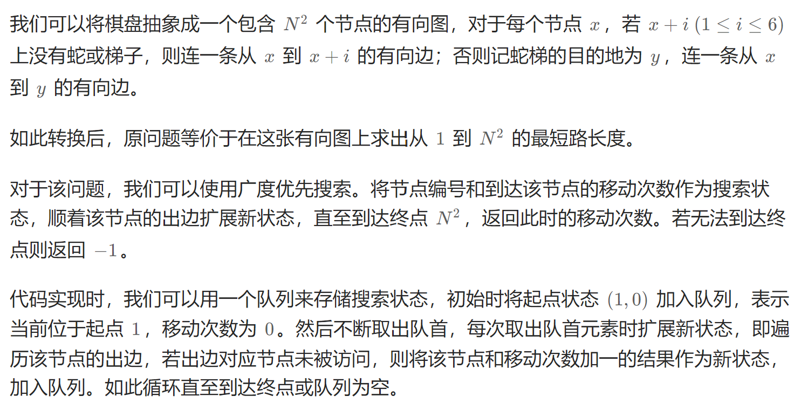
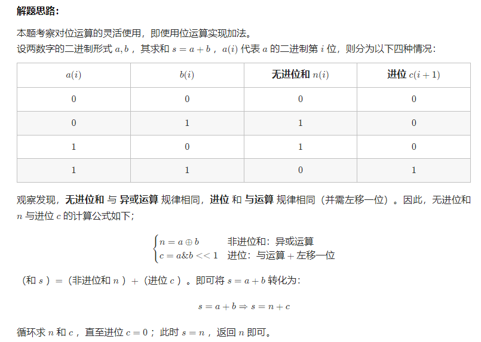
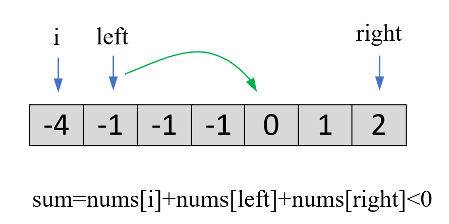
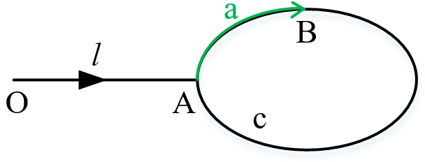

**<font size=6>算法</font>**


[toc]

# 一、动态规划(DP)

**类型：**

**1、dp数组本身就是最后结果**

**2、求出所有点，然后dp数组求全局最大,** 

**如 [11、 **[最大正方形](https://leetcode.cn/problems/maximal-square/)] 

还有如[14、**[最长递增子序列](https://leetcode.cn/problems/longest-increasing-subsequence/)**] ，定义$dp[i]$为以$nums[i]$结尾的最长递增子序列的长度，全局最大为dp数组的最大值。

**3、二维动态规划**

涉及两个数组

[12、**[最长公共子序列](https://leetcode.cn/problems/longest-common-subsequence/)(**二维动态规划)]

[**[剑指 Offer 47. 礼物的最大价值](https://leetcode.cn/problems/li-wu-de-zui-da-jie-zhi-lcof/)**]

## 1、完全背包，有顺序(leetcode 377)

[力扣](https://leetcode-cn.com/problems/combination-sum-iv/)

```markdown
给你一个由不同整数组成的数组 nums ，和一个目标整数 target 。
请你从 nums 中找出并返回总和为 target 的元素组合的个数。

示例：
输入：nums = [1,2,3], target = 4
输出：7
解释：
所有可能的组合为：
(1, 1, 1, 1)
(1, 1, 2)
(1, 2, 1)
(1, 3)
(2, 1, 1
(2, 2）
(3, 1)
请注意，顺序不同的序列被视作不同的组合。
```


有顺序的组合背包问题固定公式：

新建一个数组

```java
int[] dp=new int[target+1];   //dp[i]表示和为i的组合方案个数  0-target
```

假设和$i$的组合方案个数表示为$dp[i]$，则遍历数组$nums$，若元素$nums[j]<=i$，则可在和为$i-num[j]$的组合最后插入$num[j]$，使新组合和为$i$，故公式如下:

```java
dp[i] +=dp[i-nums[j]];
```

边界初值：

```java
dp[0]=1;  //和为0的组合只有一种，就是一个都不取
```

分析：

```
nums=[1,2,3]  target=4

和为0： []
和为1：[1]          在和为0的基础上加1
和为2：[1 1]        在和为1的基础上加1
       [2]         在和为0的基础上加2
和为3：[1 1 1] [2 1] 
      [1 2] 
      [3]
和为4：[1 1 1 1] [2 1 1] [1 2 1] [3 1]   在和为3的基础上加1
      [1 1 2] [2 2]                      在和为2的基础上加2
      [1 3]                              在和为1的基础上加3
```

完整代码：

```java
class Solution   //16:40-16:52
{
    public int combinationSum4(int[] nums, int target) 
    {
        int[] dp=new int[target+1];
        dp[0]=1;
        for(int i=1;i<=target;i++)
        {
            int count=0;
            for(int j:nums)
            {
                if(j<=i)
                count +=dp[i-j];      
            }
            dp[i]=count;
        }
       return dp[target];
    }
}
```

时间复杂度：

$O(target*n)$                             $n$为数组长度

## 2、组合问题（无顺序，要避免重复）(518 零钱兑换)

[力扣](https://leetcode-cn.com/problems/coin-change-2/)

```markdown
示例

输入：amount = 5, coins = [1, 2, 5]
输出：4
解释：有四种方式可以凑成总金额：
5=5
5=2+2+1
5=2+1+1+1
5=1+1+1+1+1
```

思路还是和上一个一样，但要避免重复。因此先遍历数组元素，后遍历总和。（先遍历数组元素保证硬币出现的顺序固定：即每种组合中按照1→2→5的顺序出现，2只会出现在1之后，5只会出现在1、2之后，因此总和为3的组合中没有{2，1}，从而避免和{1，2}重复）

```java
class Solution {
    public int change(int amount, int[] coins) 
    {
        int[] dp=new int[amount+1];
        dp[0]=1;
        for(int i=0;i<coins.length;i++)  //先遍历数组元素
        for(int j=coins[i];j<=amount;j++) //后遍历总和
        {
            dp[j] +=dp[j-coins[i]];
        }
        return dp[amount];
    }
}
```


## 3、零钱兑换


```java
public class Solution {
    public int coinChange(int[] coins, int amount) {
        int max = amount + 1;
        int[] dp = new int[amount + 1];   
        Arrays.fill(dp, max);  //除dp[0]都初始化一个较大值  方便后面比较和判断是否更新
        dp[0] = 0;
        for (int i = 1; i <= amount; i++) {
            for (int j = 0; j < coins.length; j++) {
                if (coins[j] <= i) {
                    dp[i] = Math.min(dp[i], dp[i - coins[j]] + 1);  
                }
            }
        }
        return dp[amount] > amount ? -1 : dp[amount];  //没有更新说明找不到组合
    }
}
```

## 4、剪绳子


状态转移方程

对绳长$n$的绳子，可分为$i+(n-i)$，其中$1\le i<n$：

- 若$n-i$不再分  ，则乘积为$i*(n-i)$
- 若$n-i$再分，则乘机为$i*dp[n-i]$

故状态转移方程：

$dp[n]=\mathop{max}\limits_{1\le i<n}\ (i*(n-i),i*dp[n-i])$

```java
class Solution 
{
    public int cuttingRope(int n) 
    {
        int[] dp=new int[n+1];
        //边界条件
        dp[0]=0;
        dp[1]=0;
        dp[2]=1;

        int max_mul=0;
        for(int i=3;i<=n;i++)
        {
            for(int j=1;j<i;j++)
            {
                max_mul=Math.max(max_mul,Math.max(j*(i-j),j*dp[i-j]));
            }
            dp[i]=max_mul;
        }
        return dp[n];
    }
}
```

**dfs写法:严重超时，此处要准确把握dfs中的递归点（调用之后的返回点  最大最小都是这种套路，需要还原现场）**

```java
class Solution 
{

    int target=1;
    int mul_max=1;
    int num=0;
    public int cuttingRope(int n) 
    {
        dfs(n);
        return mul_max;
    }

    public void dfs(int n)
    {
        if(n<0)
            return;
        if(n==0&&num!=1)
        {
            mul_max=Math.max(mul_max,target);
            return;
        }

        for(int i=1;i<=n;i++)
        {
            target *=i;
            num++;
            dfs(n-i);
            target /=i;  //准确把握调用之后的返回点  最大最小都是这种套路，这叫还原现场
            num--;
        }
    }
}
```

## 5、最小路径和


**dfs超时 ，一看数组这么大就不要用dfs**

```java
class Solution 
{
    public int minPathSum(int[][] grid) 
    {
       int[][] dp=new int[grid.length][grid[0].length];
       dp[0][0]=grid[0][0];
       for(int i=0;i<grid.length;i++)
       {
           for(int j=0;j<grid[0].length;j++)
           {
               if(i==0&&j==0)
               continue;
               if(j==0)  //菜逼 边界错误检查这么久 缺少continue  执行完if里的语句后还会执行最后一句 
               {
                   dp[i][j]=dp[i-1][j]+grid[i][j];
                   continue;
               }
               
               if(i==0)
               {
                   dp[i][j]=dp[i][j-1]+grid[i][j];
                   continue;
               }
               
               dp[i][j]=Math.min(dp[i][j-1],dp[i-1][j])+grid[i][j];
           }
       }
       return dp[grid.length-1][grid[0].length-1];

    }
}
```

**注意：if 不写else时的情况，后面的还要执行（很容易出错），如果不执行后面，勤快点加个continue**

## 7、二维动态规划

**[剑指 Offer 47. 礼物的最大价值](https://leetcode.cn/problems/li-wu-de-zui-da-jie-zhi-lcof/)**

在一个 m*n 的棋盘的每一格都放有一个礼物，每个礼物都有一定的价值（价值大于 0）。你可以从棋盘的左上角开始拿格子里的礼物，并每次向右或者向下移动一格、直到到达棋盘的右下角。给定一个棋盘及其上面的礼物的价值，请计算你最多能拿到多少价值的礼物？

```
示例1：
输入:[
  [1,3,1],
  [1,5,1],
  [4,2,1]
]输出:12
解释: 路径 1→3→5→2→1 可以拿到最多价值的礼物
```

提示：

- `0 < grid.length <= 200`
- `0 < grid[0].length <= 200`

**dfs超时**

```java
class Solution  
{
    int max=0;
    int total=0;
    public int maxValue(int[][] grid) 
    {
        int m=grid.length,n=grid[0].length;
        int[][] dp=new int[m][n];  //dp[i][j]代表从（0，0）到（i，j）能获得的最大礼物值
]        dp[0][0]=grid[0][0];  
        for(int i=1;i<n;i++)
        dp[0][i]=dp[0][i-1]+grid[0][i];
        for(int j=1;j<m;j++)
        dp[j][0]=dp[j-1][0]+grid[j][0];

        for(int i=1;i<m;i++)
        for(int j=1;j<n;j++)
            dp[i][j]=Math.max(dp[i-1][j],dp[i][j-1])+grid[i][j];
        
        return dp[m-1][n-1];
    }
}
```

## 8、**[连续子数组的最大和](https://leetcode.cn/problems/lian-xu-zi-shu-zu-de-zui-da-he-lcof/)**


思路：

定义dp[i]为以nums[i]结尾的连续子数组最大和，则

$$
dp[i]=\begin{cases} dp[i-1]+nums[i]  \quad dp[i-1]>=0 \\nums[i] \qquad \qquad \qquad dp[i-1]<0 \end{cases}
$$

数组dp的最大值即为全局最大

```java
class Solution  //7:09-
{
    public int maxSubArray(int[] nums) 
    {
        int res=nums[0]; //全局最大
        int[] dp=new int[nums.length];
        dp[0]=nums[0];
        for(int i=1;i<nums.length;i++)
        {
           dp[i]=dp[i-1]>=0?dp[i-1]+nums[i]:nums[i];      
           res=Math.max(res,dp[i]);                                                                                                         
        }
        return res;
    }
}
```

## 9、**乘积最大子数组**


对比和最大，任然是定义dp[i]为以nums[i]结尾的乘积极值，但是需要保存两个：一个最大值、一个最小值，以应对正负性（比如nums[i]为负数，乘一个最小负数得正）

【-2，3，-4】

【2，3，4】

```java
class Solution 
{
    public int maxProduct(int[] nums) 
    {
        int[][] dp=new int[nums.length][2]; //dp[i][0]表示以nums[i]结尾的乘机最大值  dp[0][1]为最小值 
        dp[0][0]=nums[0];
        dp[0][1]=nums[0];
        int res=dp[0][0];
        for(int i=1;i<nums.length;i++)
        {
        
            dp[i][0]=Math.max(Math.max(nums[i],dp[i-1][0]*nums[i]),dp[i-1][1]*nums[i]);
            res=Math.max(res,dp[i][0]);
            dp[i][1]=Math.min(Math.min(nums[i],dp[i-1][0]*nums[i]),dp[i-1][1]*nums[i]);
        } 

        return res;

    }
}
```

## 9、**[圆圈中最后剩下的数字](https://leetcode.cn/problems/yuan-quan-zhong-zui-hou-sheng-xia-de-shu-zi-lcof/)**

[16、**[剑指 Offer 62. 圆圈中最后剩下的数字](https://leetcode.cn/problems/yuan-quan-zhong-zui-hou-sheng-xia-de-shu-zi-lcof/)**](https://www.notion.so/16-Offer-62-0c804beb48544c849aa6905aab38b6c7?pvs=21) 

## 10、 **[打家劫舍](https://leetcode.cn/problems/house-robber/)（简单，作为参考）**

## [11]()、 **[最大正方形](https://leetcode.cn/problems/maximal-square/)**


思路：

- $dp[i][j]$代表以$(i,j)$为右下角且只包含1 的正方形的边长最大值，遍历矩阵所有格子，dp数组的最大值就是最大边长。

转移方程

- $matrix[i][j]=$0，$dp[i][j]=0$
- 第一行和第一列，若$matrix[i][j]=1$，则$dp[i][j]=1$
- 对于$1<=i<matrix.length,\quad 1<=j<matrix[0].length \quad$,若$matrix[i][j]=1$，则$dp[i][j]=min(dp[i-1][j],dp[i-1][j-1],dp[i][j-1])+1$（由其上方、左方和左上方的三个相邻位置的$dp$值决定）
- 示例：



```java
class Solution  //14:30-  19:46-
{
    public int maximalSquare(char[][] matrix) 
    { 
        if(matrix.length==0||matrix[0].length==0)
        return 0;
        else
        {
            int col=matrix.length,row=matrix[0].length;
            int[][] dp=new int[col][row]; //dp[i][j]表示以matrix[i][j]为右下角的最大矩形边长
            for(int i=0;i<row;i++)
                dp[0][i]=(matrix[0][i]=='0')?0:1;
            for(int i=1;i<col;i++)
                dp[i][0]=(matrix[i][0]=='0')?0:1;
            
            for(int i=1;i<col;i++)
            {
                for(int j=1;j<row;j++)
                {
                    if(matrix[i][j]=='0')
                    dp[i][j]=0;
                    else
                    dp[i][j]=Math.min(Math.min(dp[i-1][j],dp[i-1][j-1]),dp[i][j-1])+1;
                    
                }
            }

            int res=0;
            for(int i=0;i<col;i++)
                for(int j=0;j<row;j++)
                     res=Math.max(res,dp[i][j]);
         
            return res*res;
 
        }
    }  
}
```

## 12、**[最长公共子序列](https://leetcode.cn/problems/longest-common-subsequence/)(**二维动态规划)


思路：

（1）定义dp数组

$dp[i][j]$：表示$text1[0:i-1]和text2[0:j-1]$最长公共子序列的长度

(2)边界条件和转移方程

$dp[i][j]=0 \quad (i=0或j=0)$

转移方程

- 当$text1[i-1]=text2[j-1]$时，$dp[i][j]=dp[i-1][j-1]+1$，例如ac与bc的最后长子序列等于a与b的最长子序列加1
- 当$text1[i-1]!=text2[j-1]$时，$dp[i][j]=max(dp[i-1][j],dp[i][j-1])$，例如acf与bce的最后长子序列等于：acf与bc的最长子序列、ac与bce的最长子序列   中的最大值

```java
class Solution 
{
    public int longestCommonSubsequence(String text1, String text2) 
		{
	        int M = text1.length();
	        int N = text2.length();
	        int[][] dp = new int[M + 1][N + 1];
	        for (int i = 1; i <= M; ++i) 
					{
	            for (int j = 1; j <= N; ++j) 
					    {
	                if (text1.charAt(i - 1) == text2.charAt(j - 1)) 
	                    dp[i][j] = dp[i - 1][j - 1] + 1;
									else 
	                    dp[i][j] = Math.max(dp[i - 1][j], dp[i][j - 1]);
	            }
	        }
	        return dp[M][N];
		}
}
```

参考解答：

[力扣](https://leetcode.cn/problems/longest-common-subsequence/solution/fu-xue-ming-zhu-er-wei-dong-tai-gui-hua-r5ez6/)

## 13、一维**[接雨水](https://leetcode.cn/problems/trapping-rain-water/)**


思路：



```java
class Solution
{
    public int trap(int[] height)
    {
        int len=height.length;
        int[] leftMax=new int[len];  //leftMax[i]代表下标i及左边的最大柱高
        int[] rightMax=new int[len];   //rightMax[i]代表下标i及右边的最大柱高
        leftMax[0]=height[0];
        rightMax[len-1]=height[len-1];

        for(int i=1;i<len;i++)
        leftMax[i]=Math.max(leftMax[i-1],height[i]);
        for(int i=len-2;i>=0;i--)
        rightMax[i]=Math.max(rightMax[i+1],height[i]);
        int res=0;

        for(int i=0;i<len;i++)
        res +=Math.min(leftMax[i],rightMax[i])-height[i];  **//下标i处能接雨水量（关键）**
        return res;
    }
}
```

## 14、**[最长递增子序列](https://leetcode.cn/problems/longest-increasing-subsequence/)**


套路：

定义$dp[i]$：以$nums[i]$结尾的最长递增子序列的长度，全局最大为dp数组的最大值

转移方程：

$dp[i]=max(dp[j])+1,其中0\le j<i且nums[j]<nums[i]$ 

```java
class Solution  //9:36-10:06
{
    public int lengthOfLIS(int[] nums)  
    {
        int[] dp=new int[nums.length]; //dp[i]为以nums[i]结尾的最长递增子序列的长度
        dp[0]=1;
        int res=dp[0];
        for(int i=1;i<nums.length;i++)
        {
            //往前搜 找到比nums[i]小的nums[j]且dp[j]最大的
             int j=i-1;
             int max=0;
            for(;j>=0;j--)
            {
                if(nums[j]<nums[i])
                {
                    max=Math.max(dp[j],max);
                }    
            }
            dp[i]=max+1;
            res=Math.max(res,dp[i]);
        }
        return res;
    }
}
```

## 15、**[子集](https://leetcode.cn/problems/subsets/)（组合类问题）**


思路：$nums[0:i]$的组合A等于$nums[0:i-1]$组合B+B中的每个元素加上num[i]

以[1,2,3]为例：

```java
开始：[]    
[1]: 加上  [1]变成：  [] [1]
[1,2]: 加上[2] [1,2]  变成： [] [1] [2] [1,2]
[1,2,3]: 加上[3] [1,3] [2,3] [1,2,3]
```

```java
class Solution  //8:52-10:23
{
    public List<List<Integer>> subsets(int[] nums) 
    {
        List<List<Integer>> list=new ArrayList<>();

        if(nums.length==0)
        {
            list.add(new ArrayList<Integer>());
            return list;
        }
        else
        {
            list.add(new ArrayList<Integer>());
            for(int i=0;i<nums.length;i++)
            {
                int size=list.size();
                for(int j=0;j<size;j++)
                {
                    //特别注意下面要深拷贝，不然最后输出的所有元素都一样，第一次提交就是因为这里没过
                    List<Integer> tem=new ArrayList<Integer>(list.get(j)); 
                    tem.add(nums[i]);
                    list.add(tem);
                }
            }
            return list;
        }
    }
}
```

## 16、**[全排列](https://leetcode.cn/problems/permutations/)**


这种题目最需要**注意的地方就是深浅拷贝**

```java
class Solution 
{
    public List<List<Integer>> permute(int[] nums) 
    {
        if(nums.length==1)
        {
            List<List<Integer>> list=new ArrayList<>();
            List<Integer> tem=new ArrayList<>();
            tem.add(nums[0]);
            list.add(tem);
            return list;
        }
        else
        {
            int[] sub=new int[nums.length-1];
            System.arraycopy(nums,0,sub,0,sub.length);
            List<List<Integer>> tem=permute(sub);
            List<List<Integer>> res=new ArrayList<>();
            for(int i=0;i<tem.size();i++)
            {
                List<Integer> t=new ArrayList<>(tem.get(i));
                for(int j=0;j<=t.size();j++)
                {
                    t.add(j,nums[nums.length-1]);
                    res.add(new ArrayList<>(t));  **//特别注意这里的深拷贝**
                    t.remove(j);
                }
            }
           
            return res;
        }
    }
}
```

## 17、**[买卖股票的最佳时机 III](https://leetcode.cn/problems/best-time-to-buy-and-sell-stock-iii/)**


暴力解法：

```java
class Solution 
{
    public int maxProfit(int[] prices) 
    {
        if(prices.length==1)
        return 0;
        else
        {
            int res=0;
            for(int i=0;i<prices.length-1;i++)  //以prices[i]为界劈开
            {
                int[] a=new int[i+1];
                int[] b=new int[prices.length-i];
                System.arraycopy(prices,0,a,0,a.length);
                System.arraycopy(prices,i,b,0,b.length);
							  //下面不改进，只将max_sigle改为dp，时间复杂度改善很小
                int reward=max_sigle(a)+max_sigle(b); 
                res=Math.max(res,reward);
            }
            return  res;
        }
    }

     public static int max_sigle(int[] prices)
    {
        if(prices.length<=1)
        return 0;
        else
        {
            int res=0;
            for(int i=0;i<prices.length-1;i++)
            {
                for(int j=i+1;j<prices.length;j++)
                {
                    int tem=prices[j]-prices[i];
                    if(tem>0)
                    res=Math.max(res,tem);
                }
            }
            return  res;
        }
    }
}
```


**双向dp**

记$len=prices.length$,遍历数组$prices$, 以$price[i]$为界劈成2个数组：$prices[0:i]$和$prices[i:len-1]$。
从左往右$dp$得到数组$left$,其中$left[i]$为$prices[0:i]$一次交易的最大值，
从右往左$dp$得到数组$right$,其中$right[i]$为$prices[i:len-1]$一次交易的最大值。
$left[i]+right[i]$就是以$prices[i]$劈开的最大收益。

```java
class Solution {
    public int maxProfit(int[] prices) {
        int n=prices.length;
        int[] left=new int[n]; // 从左往右dp, left[i]表示prices[0:i]一笔交易最大利润  
        int minValue=prices[0];
        left[0]=0;
        for(int i=1;i<n;i++){
            if(prices[i]-minValue>0){
                left[i]=Math.max(prices[i]-minValue,left[i-1]);
            }else{
                left[i]=left[i-1];
            }
            minValue=Math.min(minValue,prices[i]);
        }

        int[] right=new int[n]; // 从右往左dp，right[i]表示prices[i:n-1]一笔交易最大利润
        int maxValue=prices[n-1];
        right[n-1]=0;
        for(int i=n-2;i>=0;i--){
            if(maxValue-prices[i]>0){
                right[i]=Math.max(maxValue-prices[i],right[i+1]);
            }else{
                right[i]=right[i+1];
            }
            maxValue=Math.max(maxValue,prices[i]);
        }

        int res=0;
        for(int i=0;i<n;i++){  // 遍历，以price[i]为界分成两个数组：prices[0:i]和prices[i:len-1]
            System.out.println(left[i]+" "+right[i]);
            res=Math.max(res,left[i]+right[i]);
        }
        return res;
    }
}
```


## 18、**跳跃游戏 VI  （DP+滑动窗口）**


**该题主要考察优先队列求滑动窗口最大值（不用滑动窗口会超时），dp非常好想。**

```java
class Solution 
{
    public int maxResult(int[] nums, int k) 
    {
       int n=nums.length; 
       int[] dp=new int[n];  //dp[i]：从0->i的最大和
       dp[0]=nums[0];

       //用优先队列：存dp元素和下标。求滑动窗口dp[i-k:i-1]的最大值
       PriorityQueue<int[]> queue=new PriorityQueue<>(
           new Comparator<int[]>()
           {
               //自定义比较器：优先队列元素的优先级
               public int compare(int[] o1,int[] o2)
               {
                   return o2[0]-o1[0];
               }
           }
       );

       queue.add(new int[]{dp[0],0});
       int max=0;  //dp[i-k:i-1]的最大值
       for(int i=1;i<n;i++)
       {   
            if(queue.size()<=k)
            max=queue.peek()[0];
            else
            {
                //判断最大值下标是否落在滑动窗口内 【i-k,i-1】
                while(queue.peek()[1]<i-k)
                {
                    queue.remove();
                }
                max=queue.peek()[0];
            }

            dp[i]=max+nums[i];
            queue.add(new int[]{dp[i],i});
       }
       return dp[n-1];
    }   
}
```

## 19、预测赢家

[2、预测赢家（486）](%E7%AE%97%E6%B3%95%204c486dd119b24f67aff1b9e9dcdd1813.md) 

## 20、**最长等差数列**


```java
class Solution 
{
    public int longestArithSeqLength(int[] nums) 
    {
        int n=nums.length;   
        int[][] dp=new int[n][1001]; //dp[i][j]表示以nums[i]结尾且公差为d的最长等差子序列长度,公差由[-500,500]变换到[0,1000]
        int res=0;
        for(int i=1;i<n;i++) 
        {
            for(int j=0;j<i;j++)
            {
                int d=nums[i]-nums[j]+500;  //公差为d
                dp[i][d]=dp[j][d]+1; //原来[...,nums[j]],现在将nums[i]加入其中                
                res=Math.max(res,dp[i][d]);
            }
        }
        return res+1;
    }
}
```

暴力也能过

```java
class Solution 
{
    HashSet<Integer> set=new HashSet<>();//存已经遍历过的公差
    int res=0;
    int len=0;
    public int longestArithSeqLength(int[] nums) 
    {
        int n=nums.length;
        for(int i=0;i<n-1;i++)
        {
            for(int j=i+1;j<n;j++)
            {
                int d=nums[j]-nums[i];
                //if(!set.contains(d))
                {
                    set.add(d);
                    len=2;
                    dfs(i,j,d,nums);
                }
            }
        }
        return res;
    }
    public void dfs(int last,int i,int d,int[] nums) // 上一下标 当前下标 公差
    {
        int n=nums.length;
        int index=i+1;
        while(index<n)
        {
            if(nums[index]-nums[i]==d)
            break;
            index++;
        }
        if(index<n)
        {
            len++;
            dfs(i,index,d,nums);
        }
        else
        {
            res=Math.max(res,len);
            return;
        }
    }
}
```

## **21. 最大矩形**

[https://leetcode.cn/problems/maximal-rectangle/description/](https://leetcode.cn/problems/maximal-rectangle/description/)

给定一个仅包含 `0` 和 `1` 、大小为 `rows x cols` 的二维二进制矩阵，找出只包含 `1` 的最大矩形，并返回其面积。

**示例 1：**


```
输入：matrix = [["1","0","1","0","0"],["1","0","1","1","1"],["1","1","1","1","1"],["1","0","0","1","0"]]
输出：6
解释：最大矩形如上图所示。

```

**示例 2：**

```
输入：matrix = [["0"]]
输出：0

```

**示例 3：**

```
输入：matrix = [["1"]]
输出：1

```

**提示：**

- `rows == matrix.length`
- `cols == matrix[0].length`
- `1 <= row, cols <= 200`
- `matrix[i][j]` 为 `'0'` 或 `'1'`

思路：暴力

用int[][] width=new int[m][n]维护, 其中width[i][j]表示 第i行，以下标[i,j]为终点的最大连续1的个数。示例1中：

```java
width[1][0]=1
width[1][1]=0
width[2][2]=1
width[2][3]=2
width[2][4]=3
```

以图中黄色1为右下角坐标的矩形（全1），向上拓展：

高度为 1: 面积S1=4*1=width[2][3]


高度为2：面积S2=2*2=min(width[2][3], width[1][3]) *2


高度为3：面积S3=2*3=min(width[2][3], width[1][3], width[0][3]) *3


综上：以黄色1为右下角坐标的矩形（全1）最大面积为max(S1, S2, S3)=6

遍历所有全1 节点，以其为矩形右下角坐标，找出全局最大面积即可：

```java
class Solution {
    public int maximalRectangle(char[][] matrix) {
        int m=matrix.length,n=matrix[0].length;
        int[][] width=new int[m][n];

        int maxArea=0;
        for(int i=0;i<m;i++){
            for(int j=0;j<n;j++){
                if(matrix[i][j]=='1'){
                    if(j==0){
                        width[i][0]=1;
                    }else{
                        width[i][j]=width[i][j-1]+1;
                    }
                }else{
                    width[i][j]=0;
                }

                maxArea=Math.max(maxArea,width[i][j]); // 矩形面积
                int minWidth =width[i][j]; // 矩形宽
                for(int up=i-1;up>=0;up--){  // 向上扩展
                    int height=i-up+1;  // 矩形高
                    minWidth =Math.min(width[up][j],minWidth);
                    maxArea=Math.max(maxArea,height*minWidth );
                }
            }
        }
        return maxArea;
    }
}
```

## 22、[分割数组的最大值](https://leetcode.cn/problems/split-array-largest-sum/)

给定一个非负整数数组 `nums` 和一个整数 `k` ，你需要将这个数组分成 `k` 个非空的连续子数组。

设计一个算法使得这 `k` 个子数组各自和的最大值最小。

**示例 1：**

```
输入：nums = [7,2,5,10,8], k = 2
输出：18
解释：
一共有四种方法将 nums 分割为 2 个子数组。 
其中最好的方式是将其分为 [7,2,5] 和 [10,8] 。
因为此时这两个子数组各自的和的最大值为18，在所有情况中最小。
```

**示例 2：**

```
输入：nums = [1,2,3,4,5], k = 2
输出：9
```

**示例 3：**

```
输入：nums = [1,4,4], k = 3
输出：4
```

 

**提示：**

- `1 <= nums.length <= 1000`
- `0 <= nums[i] <= 106`
- `1 <= k <= min(50, nums.length)`


参考题解：https://leetcode.cn/problems/split-array-largest-sum/solutions/242909/er-fen-cha-zhao-by-liweiwei1419-4/


第 1 步：定义状态$$dp[i][k]$$表示：将前缀区间 $$[0, i] $$被分成 $$k $$段的各自和的最大值的最小值，则前缀区间$$ [0, j]$$ （这里$$ j < i$$） 被分成$$ k - 1$$ 段各自和的最大值的最小值为 $$dp[j][k - 1]$$。即：第一维是第$$ k$$ 个分割的最后一个元素的下标 ，第二维是分割的段数。

第 2 步：状态转移方程
$$dp[i][k]=max⁡(dp[j][k−1],  rangeSum(j+1,i))$$
这里 $$rangeSum(j+1,i)$$表示数组 $$nums[j + 1..i] $$的区间和，它可以先计算出所有前缀和，然后以 $$O(1)$$的方式计算出区间和。

上面的状态转移方程中，$$j$$ 是第 $$k - 1$$ 个段最后一个元素的下标，因此取值范围为$$[k - 2, i-1]$$

第 3 步：初始化

- 由于要找最小值，初值赋值为Integer.MAX_VALUE；
- 分割段数为 1 ，即不分割的情况，所有的前缀和就是依次的状态值。

第 4 步：输出

$$dp[len][k]$$，根据状态定义，这是显然的。

下面给出题目中的示例$$ [7, 2, 5, 10, 8]$$ 的状态计算表，为了更突出一般性，把 $$m$$ 设置成为数组的长度 $$5$$：


编码：

根据以上分析，三层循环：

- 阶段：分割段数从 $$1$$增长到$$m$$ 

- 状态：前缀区间 $$[0, i]$$ 的状态值，由于 $$i$$ 要被分成 $$k$$ 段，前缀区间里至少要有 $$k $$个元素，最小前缀区间 $$k$$ 个元素的最后一个元素的下标为 $$k - 1$$，故$$ i$$ 从$$ k - 1$$ 开始到 $$len - 1$$；

- 选择：枚举第$$ k - 1 $$段的最后一个元素的下标，根据上面的分析，从$$ k - 2$$ 到 $$i - 1$$。

  

```java
class Solution {
    public int splitArray(int[] nums, int k) {
        int n=nums.length;
        int[][] dp=new int[n][k+1]; // dp[i][k] 表示将下标i（含）之前的数组分成k段，各自和最大值的最小值
        for(int[] a:dp){
            Arrays.fill(a,Integer.MAX_VALUE);
        }
        
        int[] preSum=new int[n];
        preSum[0]=nums[0];
        for(int i=1;i<n;i++){
            preSum[i]=preSum[i-1]+nums[i];
        }

        // 分成1段
        for(int i=0;i<n;i++){
            dp[i][1]=preSum[i];
        }

        for(int m=2;m<=k;m++){  // 从分成2段开始，逐渐递增到k段
            for(int i=m-1;i<n;i++){ // 最后一段的终点下标
                for(int j=m-2;j<i;j++){  // 第m-1段的终点下标
                    dp[i][m]=Math.min(dp[i][m],Math.max(dp[j][m-1],preSum[i]-preSum[j]));
                }  
            }
        }
        return dp[n-1][k];
    }
}
```


# 二、深度优先搜索(DFS, Depth First Search)

**总结：dfs就是不断往下搜，搜到底（设置终止条件）。且不能重复访问（已经访问过的点，return)。适合解决存不存在、给定和种类、路径之类的题目**

恢复现场与否：再体会

恢复：

不恢复：题3 机器人

## 1、矩阵中的路径

[力扣](https://leetcode-cn.com/problems/ju-zhen-zhong-de-lu-jing-lcof/)


```java
class Solution //23:01-23:19
{
    boolean is_exist=false;
    public boolean exist(char[][] board, String word) 
    {
        int m=board.length,n=board[0].length;
        for(int i=0;i<m;i++)
        {
            for(int j=0;j<n;j++)
            {
                if(word.charAt(0)==board[i][j])
                {
                    int[][] visited=new int[m][n];
                    dfs(i,j,board,visited,word);
                    if(is_exist)
                    return true;
                }
            }
        }
        return is_exist;
    }

    public void dfs(int i,int j,char[][] board,int[][] visited,String word)
    {
        int m=board.length,n=board[0].length;
        if(i<0||i>=m||j<0||j>=n)  //越界
        return;
        if(visited[i][j]==1) //已访问
        return; 
        if(word.length()==1&&word.charAt(0)==board[i][j]) //匹配
        {
            is_exist=true;
            return;
        }
        if(word.charAt(0)!=board[i][j]) //第一个字母就不匹配
        return;
        visited[i][j]=1;
        dfs(i-1,j,board,visited,word.substring(1));
        dfs(i+1,j,board,visited,word.substring(1));
        dfs(i,j-1,board,visited,word.substring(1));
        dfs(i,j+1,board,visited,word.substring(1));
        visited[i][j]=0;
    }
}
```

上面的代码有些测试用例已超时，优化如下：**探索4个方向时任意方向找到了都返回**

```jsx
class Solution {
    boolean res=false;
    public boolean wordPuzzle(char[][] grid, String target) {
        int m=grid.length,n=grid[0].length;
        for(int i=0;i<m;i++){
            for(int j=0;j<n;j++){
                if(target.charAt(0)==grid[i][j]){
                    int[][] visited=new int[m][n];
                    dfs(grid,i,j,visited,target);
                    if(res){
                        return true;
                    }
                }
            }
        }
        return res;
    }

    public void dfs(char[][] grid, int i,int j,int[][] visited,String target){
        int m=grid.length,n=grid[0].length;
        if(target.equals("")){
            res=true;
            return;
        }
        if(i<0||i>m-1||j<0||j>n-1||visited[i][j]==1){
            return;
        }

        visited[i][j]=1;
        int[][] dir={{0,-1},{0,1},{-1,0},{1,0}};
        if(target.charAt(0)==grid[i][j]){
            for(int[] direction:dir){
                dfs(grid,i+direction[0],j+direction[1],visited,target.substring(1));
                if(res){
                    return;  // 找到了就即刻返回，不用等探索完4个方向，不然最后2个测试用例超时
                }
            }
        }
        visited[i][j]=0;
    }
}
```

## 2、新员工考试（华为机试)


```java
/**
 * @Author qiang.long
 * @Date 2024/03/29
 * @Description 新员工考试  10:27-10:48
 * 共10+10+5=25题
 * 10*2
 * 10*4
 * 5*8
 *
 **/
public class Main {
    static int res=0;
    public static void main(String[] args) {

        int[] score=new int[25];
        for(int i=0;i<10;i++){
            score[i]=2;
        }
        for(int i=10;i<20;i++){
            score[i]=4;
        }
        for(int i=20;i<25;i++){
            score[i]=8;
        }

        for(int N=0;N<=100;N++){
            dfs(0,0,score,N,0);
            System.out.println("solution-"+N+":"+res);
            res=0;
        }
    }
    /**
     * @description:
     * @param:
     * @param i 第i道题
     * @param scoreSum 总分
     * @param score 单分
     * @param target 目标分数
     * @param wrong 错题数
     * @return: void
     **/
    public static void dfs(int i,int scoreSum,int[] score,int target,int wrong){
        if(wrong>=3||i>24){
            if(target==scoreSum){
                res++;
            }
            return;
        }
        dfs(i+1,scoreSum+score[i],score,target,wrong);
        dfs(i+1,scoreSum,score,target,wrong+1);
    }
    
}
```

## 3、机器人的运动范围




**不用恢复现场**

## 4、课程表


感觉下面写的有问题，能过完全是运气 （每换一个起点搜，set要清零，不知道当初怎么想的）

```java
class Solution 
{

    boolean is=false;  
    HashSet<Integer> set=new HashSet<>(); //存修过的课程编号
    public boolean canFinish(int numCourses, int[][] prerequisites) 
    {
        if(prerequisites.length==0)  //没有限制
        return true;
        else
        {
            for(int i=0;i<numCourses;i++)   //每个初始位置都尝试  只要存在就行
            {
                dfs(numCourses,i,prerequisites,set);
            }
            return is;
        }
    }

    public void dfs(int numCourses,int i,int[][] prerequisites,HashSet<Integer> set) //第i门课能不能修
    {
        if(set.size()==numCourses)  //找到
        {
            is=true;   
            return;
        }
        if(set.contains(i))   //修过的课程不再访问
        return;
        for(int m=0;m<prerequisites.length;m++)  //遍历每一条规则
        {
            if(prerequisites[m][0]==i)  //找到课程i相关的规则
            {
                if(!set.contains(prerequisites[m][1])) //没修前置课程
                return;
            }
        }
        //可以修课程i
        set.add(i);
        
        for(int j=0;j<numCourses;j++)   //继续修下一门课
        {
            if(j!=i)
            dfs(numCourses,j,prerequisites,set);
        }
    }
}
```

拓扑排序解法:

```java
class Solution 
{
    public boolean canFinish(int numCourses, int[][] prerequisites) 
    {

        int[] in_degree=new int[numCourses]; //入度数组
        List<List<Integer>> list=new ArrayList<>();  //节点指向的节点序列
        for(int i=0;i<numCourses;i++)
        list.add(new ArrayList<>());

        for(int[] tem:prerequisites)
        {
            list.get(tem[1]).add(tem[0]);
            in_degree[tem[0]]++;
        }
        LinkedList<Integer> link=new LinkedList<>();
        for(int i=0;i<numCourses;i++)
        {
            if(in_degree[i]==0)
            link.add(i);
        }

        HashSet<Integer> set=new HashSet<>();

        while(!link.isEmpty())
        {
            Integer tem=link.remove();
            set.add(tem);

            List<Integer> ss=list.get(tem);

            for(Integer o:ss)
            {
                in_degree[o]--;
                if(in_degree[o]==0)
                link.add(o);
            }
        }
        return set.size()==numCourses;
    }
}
```

## 5、**[岛屿数量](https://leetcode.cn/problems/number-of-islands/)**


```java
class Solution 
{
    public int numIslands(char[][] grid) 
    {

        int[][] visited=new int[grid.length][grid[0].length];  //记录是否访问过
        
        int num=0;
        for(int i=0;i<grid.length;i++)  //遍历所有网格
        {
            for(int j=0;j<grid[0].length;j++)
            {
                if(grid[i][j]=='1'&&visited[i][j]==0)  //找到没被访问过的陆地  以它为起点开始搜
                {
                    dfs(grid,i,j,visited);
                    num++;  //找到一座岛屿集群
                }    
            }
        }
        return num;
    }

    public void dfs(char[][] grid,int i,int j,int[][] visited)  //判断grid[i,j]是否可访问  遇到水+超出边界+访问过 都不行
    {

        if(i<0||i>=grid.length||j<0||j>=grid[0].length)   //越界
        return;
        if(visited[i][j]==1||grid[i][j]=='0')  // 访问过 遇到水 
        return;
        //可访问
        visited[i][j]=1;  //标记
        dfs(grid,i-1,j,visited);
        dfs(grid,i+1,j,visited);
        dfs(grid,i,j-1,visited);
        dfs(grid,i,j+1,visited);

    }
}
```

并查集 

```jsx
//并查集  超时49/49  不能用quick find  要用路径压缩和加权
class Solution //9:21-
{
    public int numIslands(char[][] grid) 
    {
        int m=grid.length,n=grid[0].length;
        UF uf=new UF(m*n);
        for(int i=0;i<m-1;i++) //向右和向下union 免去重复和界限判断
        {
            for(int j=0;j<n-1;j++)
            {
                if(grid[i][j]=='1')
                {
                    if(grid[i][j+1]=='1')
                    uf.union(i*n+j,i*n+j+1);
                    if(grid[i+1][j]=='1')
                    uf.union(i*n+j,(i+1)*n+j);
                }
                else
                uf.set_id[i*n+j]=-1;
            }
        }
        //最右边一列往下union
        for(int i=0;i<m-1;i++)
        {
            if(grid[i][n-1]=='1'&&grid[i+1][n-1]=='1')
            uf.union(i*n+n-1,(i+1)*n+n-1);
            if(grid[i][n-1]=='0')
            uf.set_id[i*n+n-1]=-1;
        }
        //最下边一列往右union
        for(int j=0;j<n-1;j++)
        {
            if(grid[m-1][j]=='1'&&grid[m-1][j+1]=='1')
            uf.union((m-1)*n+j,(m-1)*n+j+1);
            if(grid[m-1][j]=='0')
            uf.set_id[(m-1)*n+j]=-1;
        }
        if(grid[m-1][n-1]=='0')
        uf.set_id[m*n-1]=-1;

        HashSet<Integer> set=new HashSet<>();
        for(int i=0;i<uf.set_id.length;i++)
            set.add(uf.set_id[i]);
        return set.contains(-1)?set.size()-1:set.size();
        
    }
    public boolean axis_legal(int i,int j,int m,int n)
    {
        return i>=0&&i<m&&j>=0&&j<n;
    }
    
}

class UF
{
    int[] set_id;
    public UF(int n)
    {
        set_id=new int[n]; 
        for(int i=0;i<n;i++)
        set_id[i]=i;
    }

    public int find(int i) //节点i对应的连通分量
    {
        return set_id[i];
    }

    public boolean is_connected(int i,int j) //是否联通
    {
        return find(i)==find(j);
    }
    public void union(int i,int j) //连接节点i和j
    {
        int id1=find(i);
        int id2=find(j);
        if(id1==id2)
        return;
        for(int k=0;k<set_id.length;k++)
        {
            if(set_id[k]==id2)
            set_id[k]=id1;
        }
    }
}
```

bfs

```jsx
//bfs  超时39/49  有时间再优化
class Solution //9:02-9:18
{
    
    public int numIslands(char[][] grid) 
    {
        int res=0;
        int m=grid.length,n=grid[0].length;

        int[][] visited=new int[m][n];
        for(int i=0;i<m;i++)
        {
            for(int j=0;j<n;j++)
            {
                if(grid[i][j]=='1'&&visited[i][j]==0)
                {
                    LinkedList<int[]> list=new LinkedList<>();
                    list.add(new int[]{i,j});
                    while(!list.isEmpty())
                    {
                        int[] tem=list.remove();
                        int k=tem[0],l=tem[1];
                        visited[k][l]=1;
                        if(axis_legal(k-1,l,m,n)&&visited[k-1][l]==0&&grid[k-1][l]=='1')
                        list.add(new int[]{k-1,l});
                        if(axis_legal(k+1,l,m,n)&&visited[k+1][l]==0&&grid[k+1][l]=='1')
                        list.add(new int[]{k+1,l});
                        if(axis_legal(k,l-1,m,n)&&visited[k][l-1]==0&&grid[k][l-1]=='1')
                        list.add(new int[]{k,l-1});
                        if(axis_legal(k,l+1,m,n)&&visited[k][l+1]==0&&grid[k][l+1]=='1')
                        list.add(new int[]{k,l+1});
                    }
                    res++;
                }
            }
        }

        return res;  
    }

    public boolean axis_legal(int i,int j,int m,int n)
    {
        return i>=0&&i<m&&j>=0&&j<n;
    }
    
}
```

## 6、二叉树中和为某一值的路径

[力扣](https://leetcode-cn.com/problems/er-cha-shu-zhong-he-wei-mou-yi-zhi-de-lu-jing-lcof/)


```java
class Solution {
    LinkedList<List<Integer>> sum=new LinkedList<List<Integer>>(); //总路径
    LinkedList<Integer> path=new LinkedList<Integer>(); //单条路径
    public List<List<Integer>> pathSum(TreeNode root, int target) 
    {
        dfs(root,target);
        return sum;
    }
    public void dfs(TreeNode root,int target)  //传入一颗子树和目标和值  
    {
        if(root==null)  //递归终止条件
        return;
        path.offer(root.val);  //将root节点值加入路径
        target -=root.val;  //总和减去已经遍历的节点值
        if(root.left==null&&root.right==null&&target==0) 
        sum.offer(new LinkedList<Integer>(path));  
      //**注意体会深拷贝 ，防止后面修改path把sum里的元素修改** 以及此处不要return 
        
        dfs(root.left,target); //递归调用  判断左子树
        dfs(root.right,target); //递归调用 判断右子树
        path.pollLast();   //**恢复现场 不满足弹出前面加的**  
    }
}
```

## 7、**[剑指 Offer 68 - II. 二叉树的最近公共祖先](https://leetcode.cn/problems/er-cha-shu-de-zui-jin-gong-gong-zu-xian-lcof/)**


dfs:

```java
class Solution  ///10:01-
{
    public TreeNode lowestCommonAncestor(TreeNode root, TreeNode p, TreeNode q) 
    {
        if(root==null||root==p||root==q)
        return root;  //终止条件
        TreeNode left=lowestCommonAncestor(root.left,p,q); //往左搜
        TreeNode right=lowestCommonAncestor(root.right,p,q); //往右搜
        if(left==null)  //不在左子树
        return right;
        if(right==null) //不在右子树
        return left;

        return root;  //返回本身
        
    }
}
```

用map好理解一点的：

```jsx
/**
 * Definition for a binary tree node.
 * public class TreeNode {
 *     int val;
 *     TreeNode left;
 *     TreeNode right;
 *     TreeNode(int x) { val = x; }
 * }
 */
 //22:32-22:55
class Solution 
{
    HashMap<TreeNode,TreeNode> map=new HashMap<>();//存节点对应的父节点
    public TreeNode lowestCommonAncestor(TreeNode root, TreeNode p, TreeNode q) 
    {
        if(root==null)
        return null;
        if(p==null)
        return q;
        if(q==null)
        return p;

        pre_order(root);  //前序遍历构建map存父节点

        ArrayList<TreeNode> list1=new ArrayList<>(); //存从p到root节点的路径
        list1.add(p);
        TreeNode work=p;
        while(work!=root)
        {
            list1.add(map.get(work));
            work=map.get(work);  //往父节点方向
        }
        
        //从p往上到root节点  若经过的节点在list1中 存在  则为最近公共祖先
        work=q;  
        while(work!=root)
        {
            if(list1.contains(work))
            return work;
            work=map.get(work);
        }
        return root;
    }

    public void pre_order(TreeNode root)
    {
        if(root==null)
        return;

        if(root.left!=null)
        map.put(root.left,root);
        if(root.right!=null)
        map.put(root.right,root);
        pre_order(root.left);
        pre_order(root.right);
    }
}
```

## 8、 **[省份数量](https://leetcode.cn/problems/number-of-provinces/)**


（1）法一：DFS

不一定有显示的边界条件（碰到边界return），也可以是搜到尽头自动停止

```java
class Solution //22:44-22:57  dfs
{
    public int findCircleNum(int[][] isConnected) 
    {
        int n=isConnected.length;
        int[] visited=new int[n];
        int res=0;
        for(int i=0;i<n;i++)
        {
            if(visited[i]==0)
            {
                dfs(i,isConnected,visited);
                res++;
            }
        }
        return res;
    }

    public void dfs(int i,int[][] isConnected,int[] visited)
    {
        int n=isConnected.length;
        if(visited[i]==1)
        return;
        visited[i]=1;
        for(int j=0;j<n;j++)
        {
            if(isConnected[i][j]==1&&i!=j)
            dfs(j,isConnected,visited);
        }
    }
}
```

（2）法二：BFS

```java
class Solution  //9:46-9:53
{
    public int findCircleNum(int[][] isConnected) 
    {
        int col=isConnected.length,row=isConnected[0].length;
        int[] isvisited=new int[col];  // isvisited[i]为第i个城市是否被访问过
        int count=0;
       
        for(int i=0;i<col;i++)  //遍历每一个城市
        {
            if(isvisited[i]==0)  //从没被访问过的城市开始搜
            { 
                LinkedList<Integer> list=new LinkedList<>();
                list.add(i);
                isvisited[i]=1;
                while(!list.isEmpty())
                {
                    Integer tem=list.remove();
                    for(int j=0;j<row;j++)
                    {
                        if(tem!=j&&isvisited[j]==0&&isConnected[tem][j]==1)
                        {
                            list.add(j);
                            isvisited[j]=1;
                        }
                    }
                }
               count++;
            }
        }
        return count;       
    }
}
```

(3)法三：并查集

```java
class Solution  
{
    public int findCircleNum(int[][] isConnected) 
    {
        int num_city=isConnected.length;
        UF uf=new UF(num_city);
        for(int i=0;i<num_city;i++)
        {
            for(int j=i+1;j<num_city;j++)  
            {
                if(isConnected[i][j]==1)  
                {
                    uf.union(i,j);  
                }
            }
        }
        HashSet<Integer> set=new HashSet<>();
        for(int id:uf.id)
        set.add(id);
        return set.size();    
    }
}

class UF  //并查集
{
    protected int[] id; //id[i]为第i个节点所属的连通集合代号
    public UF(int N)   //创建N个节点
    {
        id = new int[N];
        for (int i = 0; i < N; i++)   //初始时将所有的节点都设为不连通（id号相同为连通）
            id[i] = i;
    }

    public boolean connected(int p, int q)  //判断节点p、q是否连通
    {
        return id[p]== id[q];
    }

    public int find(int p)  //查询节点p所属连通集合代号
    {
        return id[p];
    }

    public void union(int p, int q)  //合并p、q两个节点所在的集合
    {
        int id_p=find(p);
        int id_q=find(q);  //这个一定要先保存，不然q改完之后，它之后的就没法改了
        if(id_p!=id_q)
        {
            for(int i=0;i<id.length;i++)  //将q所在连通集合中的所有节点id改为p连通集合的id
            {
                if(id[i]==id_q)
                    id[i]=id_p;
            }
        }
    }
}
```

## 9、**[路径总和 III](https://leetcode.cn/problems/path-sum-iii/)（简单）**


**思路：对每一个节点进行dfs（设该节点为路径起点就可避免重复）**

**注意：求和sum要设为long ，否则数据太大时不通过（最后一个用例）**

```java
class Solution  //21:04-22:29
{
    long sum=0;  //设为int最后一个测试用例会溢出
    int count=0;
    public int pathSum(TreeNode root, int targetSum) 
    {
        if(root==null)
        return 0;
        LinkedList<TreeNode> list=new LinkedList<>();
        list.add(root);
        while(!list.isEmpty())
        {
            TreeNode tem=list.remove();
            sum=0;
            dfs(tem,targetSum);
            if(tem.left!=null)
            list.add(tem.left);
            if(tem.right!=null)
            list.add(tem.right);
        }
        return count;

    }

    public void dfs(TreeNode node,int targetSum)
    {
        if(node==null)
        return;
        sum +=node.val;
        if(sum==targetSum)
        count++;
        dfs(node.left,targetSum);
        dfs(node.right,targetSum);
        sum -=node.val;
    }
}
```


**前缀和**：避免重复计算


```java

 //前缀和
class Solution {
    public int ans;
    public int pathSum(TreeNode root, int targetSum) {
        Map<Long, Integer> prefix = new HashMap<>(); //键：前缀和 值：对应的数量
        //当targetSum 等于某个节点值时，curPrefix - targetSum = 0,当前节点自己就算做一条符合条件的路径，所以也要计数
        prefix.put(0L, 1);
        dfs(root, prefix, 0L, targetSum);
        return ans;
    }

    //先序遍历
    private void dfs (TreeNode root, Map<Long, Integer> prefix, long curPrefix, int targetSum) {
        //递归终止的条件
        if (root == null) {
            return;
        }
        //当前节点的前缀和
        curPrefix += root.val;
        //查看是否有curPrefix - targetSum的前缀和已经存在
        int cnt = prefix.getOrDefault(curPrefix - targetSum, 0);
        ans += cnt;
        //记录前缀和
        prefix.put(curPrefix, prefix.getOrDefault(curPrefix, 0) + 1);
        //遍历左子树
        dfs(root.left, prefix, curPrefix, targetSum);
        //遍历右子树
        dfs(root.right, prefix, curPrefix, targetSum);
        //因为先序遍历是遍历根、左、右，即当前节点及其所有子节点，所以当遍历完当前节点和其所以子节点之后，当前节点的前缀和就没有用了，就需要把map里的记录删除，否则会影响其他子树的计算。跟当前节点没有路径关系的节点，不需要当前节点的前缀和
        prefix.put(curPrefix, prefix.getOrDefault(curPrefix, 0) - 1);
    }
}
```


## 10、**[螺旋矩阵](https://leetcode.cn/problems/spiral-matrix/)**


```java
//最常规的方法，每轮起点都是(start,start),长m,高n,
//下一轮的start=start+1, m=m-2, n=n-2,但是代码又臭又长
//这里演示dfs解法
class Solution 
{
    int n,m;
    List<Integer> ans = new LinkedList<>();
    //                          右、    下、    左、    上
    int[][] dir = new int[][]{{0, 1},{1, 0},{0, -1},{-1, 0}};
    boolean[][] visited;
    public List<Integer> spiralOrder(int[][] matrix) 
    {
        n = matrix.length;
        m = matrix[0].length;
        visited = new boolean[n][m];

        dfs(0, 0, 0, matrix);
        return ans;
    }

    public void dfs(int x, int y, int u, int[][] matrix)
    {
        //第一次的边界是数组本身边界，后面是上一轮遍历过的数围起的墙
        if(x >= n || x < 0 || y >= m || y < 0 || visited[x][y]) return;
        
        visited[x][y] = true;
        ans.add(matrix[x][y]);
        // 如果走的通，一直往u方向走
        int a = x + dir[u][0], b = y + dir[u][1];
        dfs(a, b, u, matrix);
        
        // 换下一个方向
        u = (u + 1) % 4; 
        dfs( x + dir[u][0], y + dir[u][1], u, matrix);

    }
}
```

## 11、**[二叉树中的最大路径和](https://leetcode.cn/problems/binary-tree-maximum-path-sum/)**


法一：递归

```java
class Solution   //5:00-
{
    
    int res=Integer.MIN_VALUE;
    public int maxPathSum(TreeNode root)  
    {
     max_gain(root);
     return res;
    }

    public int max_gain(TreeNode node)  //以node为起点的最大增益
    {
        if(node==null)
        return 0;
        int left_gain=Math.max(0,max_gain(node.left));  //正增益才计入
        int right_gain=Math.max(0,max_gain(node.right));
        res=Math.max(res,node.val+left_gain+right_gain);
        return node.val+Math.max(left_gain,right_gain);
    }
   
}
```

法二：dfs(过92/94，超时)

```java
class Solution 
{
    int res=Integer.MIN_VALUE;
    int sum=0;
    HashMap<TreeNode,TreeNode> map_parent=new HashMap<>();  //键：节点 值：键的父节点  没有为null
    HashMap<TreeNode,Integer> map_visited=new HashMap<>();  //键：节点 值：是否访问过 没有为null 访问过为1
    public int maxPathSum(TreeNode root)  
    {
        LinkedList<TreeNode> list=new LinkedList<>();
       
        list.add(root);
        while(!list.isEmpty())  //构建map_parent
        {
            TreeNode tem=list.remove();
            if(tem.left!=null)
            {
                map_parent.put(tem.left,tem);
                list.add(tem.left);
            }
            
            if(tem.right!=null)
            {
                map_parent.put(tem.right,tem);
                list.add(tem.right);
            }
           
        }

        list.add(root);
        while(!list.isEmpty())  //遍历每个节点，以它为起点开始搜
        {
            TreeNode tem=list.remove();   
            sum=0;
            map_visited.clear();
            dfs(tem);
            
            if(tem.left!=null)
            list.add(tem.left);
            if(tem.right!=null)
            list.add(tem.right);
        }

        return res;

    }
    public void dfs(TreeNode node)  
    {
        if(node==null||map_visited.get(node)!=null)
        return;
        sum +=node.val;
        map_visited.put(node,1);
        res=Math.max(res,sum);
        //搜索（3个方向）：有父节点搜父节点+左右，没有则搜左右
        if(map_parent.containsKey(node))
        dfs(map_parent.get(node));
        dfs(node.left);
        dfs(node.right);
        sum -=node.val;
        map_visited.put(node,null);
    }

}
```

## 12、字节笔试

[字节笔试 9.25 3/4_笔经面经_牛客网](https://www.nowcoder.com/discuss/1063783?channel=-1&source_id=discuss_terminal_nctrack&trackId=undefined)


```java
public class Main
{
    public static void main(String[] args)
    {
        Scanner input=new Scanner(System.in);
        String ss=input.nextLine();

        int N=Integer.parseInt(ss.substring(0,1)); //N组数据
        char[][] a=new char[N][];
        HashMap<Character,ArrayList<Character>> map=new HashMap<>();  ///键：父节点  值：子节点列表

        HashSet<Character> set1=new HashSet<>();  //所有字母
        HashSet<Character>  set2=new HashSet<>(); //子
        for(int i=0;i<N;i++)
        {
            String s=input.nextLine();
            String[] t=s.split(" ");
            for(int j=0;j<t.length-1;j++)
            {
                char p=t[j].charAt(0);
                char c=t[j+1].charAt(0);
                if(!map.containsKey(p))
                {
                    ArrayList<Character> tem=new ArrayList<>();
                    tem.add(c);
                    map.put(p,tem);
                }
                else
                {
                    ArrayList<Character> tem=map.get(p);
                    tem.add(c);
                    map.put(p,tem);
                }

            }
        }

        Set<Map.Entry<Character,ArrayList<Character>>> set=map.entrySet();

        Iterator<Map.Entry<Character,ArrayList<Character>>> ite=set.iterator();
        while(ite.hasNext())
        {
            Map.Entry<Character,ArrayList<Character>> tem=ite.next();
            System.out.print(tem.getKey()+": <");
            ArrayList<Character> list=tem.getValue();
            set1.add(tem.getKey());
            for(int i=0;i<list.size();i++)
            {
                set1.add(list.get(i));
                set2.add(list.get(i));
                if(i!=list.size()-1)
                System.out.print(list.get(i)+",");
                else
                System.out.print(list.get(i));

            }
            System.out.println(">");
        }
        Character parent='a';  //根
        for(Character o:set1)
        {
            if(!set2.contains(o))
            {
                parent=o;
                break;
            }
        **}**

        //bfs统计各层节点个数
        ArrayList<Integer> res=new ArrayList<>();//各层的节点数  从0开始
        res.add(1);
        LinkedList<Character> linkedList=new LinkedList<>();
        linkedList.add(parent);

        while(!linkedList.isEmpty())
        {
            int count=linkedList.size();
            int count_child=0;
            for(int k=0;k<count;k++)
            {
                Character tem=linkedList.remove();
                ArrayList<Character> tt=map.get(tem);
                if(tt!=null)
                {
                    count_child +=tt.size();
                    for(int m=0;m<tt.size();m++)
                        linkedList.add(tt.get(m));
                }
            }
            res.add(count_child);
        }
        System.out.println("各层节点个数：");
        for(Integer r:res)
            System.out.print(r+" ");

    }

}

//多叉树
class Node
{
    public Character val;
    public ArrayList<Node> children=new ArrayList<>();
    public Node(Character val)
    {
        this.val=val;
    }

    public void addNode(Node n)
    {
        children.add(n);
    }
}
```

## 13、**组合总和 II**


```java
//dfs
class Solution 
{
    
    List<List<Integer>> res=new ArrayList<>();
    List<Integer> list=new ArrayList<>();
    TreeMap<Integer,Integer> map=new TreeMap<>();  //TreeMap能根据Key的compareTo方法排序   键：数字  值：出现的次数  因此map键从小到大排序
    public List<List<Integer>> combinationSum2(int[] candidates, int target) 
    {
        for(int a:candidates)
        {
            if(map.containsKey(a))
            map.put(a,map.get(a)+1);
            else
            map.put(a,1);
        }

        int[][] nums=new int[map.size()][2];    //将map存入数组  nums[i][0] 为键 nums[i][1]为值
        Set<Map.Entry<Integer,Integer>> set=map.entrySet();
        Iterator<Map.Entry<Integer,Integer>> ite=set.iterator();
        int i=0;
        while(ite.hasNext())
        {
            Map.Entry<Integer,Integer> tem=ite.next();
            nums[i][0]=tem.getKey();
            nums[i][1]=tem.getValue();
            i++;
        }

        dfs(0,nums,target);
        return res;
    }

    public void dfs(int i,int[][] nums,int target) 
    {
        if(target==0)
        {
            if(!res.contains(list))
            res.add(new ArrayList<>(list));
            return;
        }
        if(i>nums.length-1||target<nums[i][0])
        return;

        for(int j=0;j<=nums[i][1];j++)  //每个位置选或者不选 假如(1,4) 表示1出现4次，那么j可选0-4(0为不选，其他为选择1的次数)
        {
            for(int k=0;k<j;k++)
            list.add(nums[i][0]);
            dfs(i+1,nums,target-j*nums[i][0]);
            for(int k=0;k<j;k++)
            list.remove((Integer)nums[i][0]);
        }
    
    }  
}
```

# 三、广度优先搜索（BFS, Breadth-First Search）

**这种题目都是用LinkedList，后插头出，循环条件list非空： 适用于树的逐层遍历、从某一点逐层往外扩之类的题**

## 1、**[腐烂的橘子](https://leetcode.cn/problems/rotting-oranges/)**

在给定的 m x n 网格 grid 中，每个单元格可以有以下三个值之一：

- 值 0 代表空单元格；
- 值 1 代表新鲜橘子；
- 值 2 代表腐烂的橘子。

每分钟，腐烂的橘子 周围 4 个方向上相邻 的新鲜橘子都会腐烂。

返回 直到单元格中没有新鲜橘子为止所必须经过的最小分钟数。如果不可能，返回 -1 。


```markdown
输入：grid = [[2,1,1],[1,1,0],[0,1,1]]
输出：4
```

实例2

```markdown
输入：grid = [[2,1,1],[0,1,1],[1,0,1]]
输出：-1
解释：左下角的橘子（第 2 行， 第 0 列）永远不会腐烂，因为腐烂只会发生在 4 个正向上。
```

示例3

```markdown
输入：grid = [[0,2]]
输出：0
解释：因为 0 分钟时已经没有新鲜橘子了，所以答案就是 0 。
```

提示：

- `m == grid.length`
- `n == grid[i].length`
- `1 <= m, n <= 10`
- `grid[i][j]` 仅为 `0`、`1` 或 `2`

思路：BFS都是用LinkedList，遍历grid，把所有腐烂的橘子加入列表，同时统计好橘子数量，接下来while循环弹出（list非空），注意是多源同时腐烂，所以**要弹出上一层所有腐烂橘子，而不是一个**，

直到list为空，统计最后好橘子的个数，若还有好橘子，返回-1，否则返回时间。

```java
class Solution 
{
    boolean is=true;
    public int orangesRotting(int[][] grid)
    {
        int m=grid.length;
        int n=grid[0].length;

        int[][] new_grid=new int[m+2][n+2];
        for(int i=1;i<=m;i++)
            for(int j=1;j<=n;j++)
                new_grid[i][j]=grid[i-1][j-1];

        int good_orange=0; //记录橘子的个数

        LinkedList<Coord> list=new LinkedList<>();
        for(int i=1;i<=m;i++)
            for(int j=1;j<=n;j++)
            { 
                if(new_grid[i][j]==1)
                    good_orange++;
                if(new_grid[i][j]==2)  //将所有坏橘子加入LinkedList
                    list.add(new Coord(i-1,j-1));
            }

        if(good_orange==0)
            return 0;

        int time=0;
        while(!list.isEmpty())  
        {
            int list_size=list.size(); //注意不是一次弹出一个  而是将上一层的全部弹出 因此要记录上一层的个数
            for(int k=0;k<list_size;k++)
            {
                Coord c=list.removeFirst();
                int i=c.x;
                int j=c.y;
                if(is_bound(i-1,j,m,n)&&grid[i-1][j]==1&&!list.contains(new Coord(i-1,j)))
                {
                    list.add(new Coord(i-1,j)); //上
                    grid[i-1][j]=2;  //好橘子腐烂
                    good_orange--;
                }

                if(is_bound(i+1,j,m,n)&&grid[i+1][j]==1&&!list.contains(new Coord(i+1,j)))
                {
                    list.add(new Coord(i+1,j)); //下
                    grid[i+1][j]=2;
                    good_orange--;
                }

                if(is_bound(i,j-1,m,n)&&grid[i][j-1]==1&&!list.contains(new Coord(i,j-1)))
                {
                    list.add(new Coord(i,j-1)); //左
                    grid[i][j-1]=2;
                    good_orange--;
                }

                if(is_bound(i,j+1,m,n)&&grid[i][j+1]==1&&!list.contains(new Coord(i,j+1)))
                {
                    list.add(new Coord(i,j+1)); //右
                    grid[i][j+1]=2;
                    good_orange--;
                }
            }
            time++;  //弹出一层时间+1 对应一轮腐坏
        }
      
        if(good_orange>0)  //最后还有好橘子返回-1  不要再写个dfs判断有无好橘子孤岛  太麻烦了而且易错  这多简单
        return -1;
        else
        return time-1; 
    }

    public boolean is_bound(int i,int j,int m,int n) //下标是否合法  grid[i][j]  
    {
        if(i>=0&&i<m&&j>=0&&j<n)
        return true;
        else
        return false;
    }

}

class Coord 
{
    public int x;
    public int y;
    public Coord(int x,int y)
    {
        this.x=x;
        this.y=y;
    }
}
```

## **[钥匙和房间](https://leetcode.cn/problems/keys-and-rooms/)**

有 n 个房间，房间按从 0 到 n - 1 编号。最初，除 0 号房间外的其余所有房间都被锁住。你的目标是进入所有的房间。然而，你不能在没有获得钥匙的时候进入锁住的房间。当你进入一个房间，你可能会在里面找到一套不同的钥匙，每把钥匙上都有对应的房间号，即表示钥匙可以打开的房间。你可以拿上所有钥匙去解锁其他房间。给你一个数组 rooms 其中 rooms[i] 是你进入 i 号房间可以获得的钥匙集合。如果能进入 所有 房间返回 true，否则返回 false。

示例1：

```markdown
输入：rooms = [[1],[2],[3],[]]
输出：true
解释：
我们从 0 号房间开始，拿到钥匙 1。
之后我们去 1 号房间，拿到钥匙 2。
然后我们去 2 号房间，拿到钥匙 3。
最后我们去了 3 号房间。
由于我们能够进入每个房间，我们返回 true。
```

示例2：

```markdown
输入：rooms = [[1,3],[3,0,1],[2],[0]]
输出：false
解释：我们不能进入 2 号房间。
```

提示：

```java
n == rooms.length
2 <= n <= 1000
0 <= rooms[i].length <= 1000
1 <= sum(rooms[i].length) <= 3000
0 <= rooms[i][j] < n
所有 rooms[i] 的值 互不相同
```

```java
class Solution 
{
    public boolean canVisitAllRooms(List<List<Integer>> rooms) 
    {
        int[] state=new int[rooms.size()]; //房间状态 0为未开 1为开
        state[0]=1;

        LinkedList<Integer> list=new LinkedList<>();
        for(Integer o:rooms.get(0))  //将第0个房间的所有钥匙加入list
        list.add(o);
        while(!list.isEmpty())
        {
            int size_num=list.size();
            for(int i=0;i<size_num;i++)
            {
                Integer e=list.remove(); //弹出钥匙开对应的房门
                if(state[e]==1) //开了就不开  要善于剪枝  不然会超时
                continue;
                else
                {
                     List<Integer> tem=rooms.get(e); //进入对应房间找到该房间里的钥匙串
                for(Integer obj:tem)
                list.add(obj); //将钥匙串加入list
                state[e]=1;  //未开房间 -1
                }
               
            }
        }

        for(int k=0;k<state.length;k++)
        {
            if(state[k]==0)
            return false;
        }
        return true;
    }
}
```

## **[二叉树最大宽度](https://leetcode.cn/problems/maximum-width-of-binary-tree/)**

给定一个二叉树，编写一个函数来获取这个树的最大宽度。树的宽度是所有层中的最大宽度。这个二叉树与满二叉树（full binary tree）结构相同，但一些节点为空。每一层的宽度被定义为两个端点（该层最左和最右的非空节点，两端点间的null节点也计入长度）之间的长度。


```java
class Solution {
    public int widthOfBinaryTree(TreeNode root) {  
        int res=0;
        LinkedList<NodeWithIndex> list=new LinkedList<>();
        list.add(new NodeWithIndex(root,0));
        while(!list.isEmpty()){
            int len=list.size();
            int l=0,r=0;
            for(int i=0;i<len;i++){
                NodeWithIndex tem=list.remove();
                if(i==0){
                    l=tem.index;
                }
                if(i==len-1){
                    r=tem.index;
                }
                if(tem.node.left!=null){
                    list.add(new NodeWithIndex(tem.node.left,2*tem.index));
                }
                if(tem.node.right!=null){
                    list.add(new NodeWithIndex(tem.node.right,2*tem.index+1));
                }   
            }
        res=Math.max(res,r-l+1);
    }
    return res;
}
}

class NodeWithIndex{
    TreeNode node;
    Integer index;
    public NodeWithIndex(TreeNode node,Integer index){
        this.node=node;
        this.index=index; //节点下标  每层节点下标都从0开始
    }
}
```

利用规律：

**左节点的编号2*i，右节点编号2*i+1 (每一层编号从0开始)**

超时解法： null节点用空格表示，去掉String两边的空格，通过72/116

```jsx
class Solution {
    public int widthOfBinaryTree(TreeNode root) {  // null用“ ”表示，去掉两边的空格
        int depth=0,res=0;
        LinkedList<TreeNode> list=new LinkedList<>();
        list.add(root);
        while(!list.isEmpty()){
            int len=list.size();
            String s="";
            boolean allNull=true;
            for(int i=0;i<len;i++){
                TreeNode node=list.remove();
                if(node==null){
                    s=s+" ";
                    list.add(null);
                    list.add(null);

                }else{
                    allNull=false;
                    s=s+"1";
                    list.add(node.left);
                    list.add(node.right);
                }
            }
        res=Math.max(res,s.trim().length());
        if(allNull){
            break;
        }
    }
    return res;
}
}
```

## **[奇偶树](https://leetcode.cn/problems/even-odd-tree/)**

[](https://leetcode-cn.com/problems/even-odd-tree/)


思路和实现比较简单 就不贴题解

## 剑指offer 之字形打印二叉树

[力扣](https://leetcode-cn.com/problems/cong-shang-dao-xia-da-yin-er-cha-shu-iii-lcof/)


比较简单（正常层序遍历加层深度判断）

## **[序列化二叉树](https://leetcode.cn/problems/xu-lie-hua-er-cha-shu-lcof/)（困难，特别留意）**


说明：

**题目没有声明二叉树中不含重复元素，所以不能用（前序、中序、后序）中的两种进行编码** 。

[4、重建二叉树](https://www.notion.so/4-fc9743be8c8b4df09c987ba87df4c57c?pvs=21) 

正确思路为：

1、编码：**带null节点的层序遍历, 2次bfs**

（1）定义一个NodewithDepth类，进行第1次bfs，求出二叉树的最大深度max_depth （层：0~maxdepth-1）

(2)第2次bfs，将null节点加入，生成编码字符串：

遍历时若当前节点为null，根据所在层是不是最后一层决定加不加左右子节点null进list

不是最后一层，list加两个null子节点进去；

是，不加

2、解码：**由层序遍历重建，类似华为机试**

(1)将字符串数组用空格split得到字符串数组s

(2)s[0]就是根节点值，然后根据数学规律获取左右子树的字符数组，再调用自身重建左右子树，加到root节点并返回。

自己写的：超时


```java
/**
 * Definition for a binary tree node.
 * public class TreeNode {
 *     int val;
 *     TreeNode left;
 *     TreeNode right;
 *     TreeNode(int x) { val = x; }
 * }
 */
public class Codec 
{
    // Encodes a tree to a single string.
    public String serialize(TreeNode root) 
    {
        if(root==null)
        return "";
        LinkedList<NodewithDepth> list=new LinkedList<>();
        int max_depth=0;  //最大深度 从0开始
        
        //第1次bfs ：求二叉树的最大深度
        list.add(new NodewithDepth(root,0));
        while(!list.isEmpty())
        {
            NodewithDepth tem=list.remove();
            max_depth=Math.max(max_depth,tem.depth); 
            if(tem.node.left!=null)
            list.add(new NodewithDepth(tem.node.left,tem.depth+1));
            if(tem.node.right!=null)
            list.add(new NodewithDepth(tem.node.right,tem.depth+1)); 
        }
        
        //第2次bfs ：生成具有null节点的层序遍历，结果放入字符串s
         String s="";
        list.add(new NodewithDepth(root,0));
        while(!list.isEmpty())
        {
            NodewithDepth tem=list.remove();
            if(tem.node==null)  //当前节点为null
            {
                s=s+"null"+" ";
                if(tem.depth!=max_depth)  //不是最后一层，继续加左右节点（null)
                {
                    list.add(new NodewithDepth(null,tem.depth+1));
                    list.add(new NodewithDepth(null,tem.depth+1));
                }
            }
            else //当前节点不为null
            {
                s=s+tem.node.val+" ";
                if(tem.depth!=max_depth) //不是最后一层
                {
                    list.add(new NodewithDepth(tem.node.left,tem.depth+1));
                    list.add(new NodewithDepth(tem.node.right,tem.depth+1));
                }      
            }
        }
        System.out.println(s.substring(0,s.length()-1)); //去掉最后最后一个空格
        return s.substring(0,s.length()-1); 
    }

    // Decodes your encoded data to tree.
    public TreeNode deserialize(String data) 
    {
        if(data.equals(""))
        return null;

        String[] s=data.split(" ");
        return rebuile(s); 
    }

    public TreeNode rebuile(String[] s)
    {
        if(s.length==0||s[0].equals("null")) //空或者根节点为null
        return null;
        if(s.length==1) 
            return new TreeNode(Integer.parseInt(s[0]));
        
        int n=(int)(Math.log(s.length+1)/Math.log(2)); //深度:0~n-1
        //根节点值
        int root=Integer.parseInt(s[0]);
        //获得左右子树数组
        String[] left=new String[(int)(s.length-1)/2];
        String[] right=new String[(int)(s.length-1)/2];
        int index1=0,index2=0,index3=1;
        for(int i=1;i<n;i++) //第i层
        {
            int len=(int)Math.pow(2,i-1);
            for(int j=0;j<len;j++)
                left[index1++]=s[index3++];
            for(int j=0;j<len;j++)
                right[index2++]=s[index3++];       
        }

        TreeNode ROOT=new TreeNode(root);
        ROOT.left=rebuile(left);
        ROOT.right=rebuile(right);
        return ROOT;
    } 
}

class NodewithDepth
{
    TreeNode node;
    int depth;
    public NodewithDepth(TreeNode node,int depth)
    {
        this.node=node;
        this.depth=depth;
    }
}
```

参考别人：

```java
public class Codec {

    // Encodes a tree to a single string.
   
//把null也加入层序遍历，示例输出[1,2,3,null,null,4,5,null,null,null,null,]
    public String serialize(TreeNode root) 
    {
        if(root == null)
            return "";
        
        StringBuilder res = new StringBuilder();
        res.append("[");
        Queue<TreeNode> queue = new LinkedList<>();
        queue.add(root);
        while(!queue.isEmpty())
        {
            TreeNode node = queue.remove();
            if(node != null)
            {
                res.append("" + node.val);
                queue.add(node.left);
                queue.add(node.right);
            }
            else
                res.append("null");
            
            res.append(",");
        }
        res.append("]");
        return res.toString();
    }

    // Decodes your encoded data to tree.
   //由层序遍历建树
    public TreeNode deserialize(String data) 
    {
        if(data == "")
            return null;

        //正则表达式分割字符串
        String[] dataList = data.substring(1, data.length() - 1).split(","); 
        
        TreeNode root = new TreeNode(Integer.parseInt(dataList[0]));
        Queue<TreeNode> queue = new LinkedList<>();
        queue.add(root);
        int i = 1;
        while(!queue.isEmpty())
        {
            TreeNode node = queue.remove();
            if(!"null".equals(dataList[i]))
            {
                node.left = new TreeNode(Integer.parseInt(dataList[i]));
                queue.add(node.left);
            }
            i++;
            if(!"null".equals(dataList[i]))
            {
                node.right = new TreeNode(Integer.parseInt(dataList[i]));
                queue.add(node.right);
            }
            i++;
        }
        return root;
    }
}
```

## **蛇梯棋（909）**

给你一个大小为 `n x n` 的整数矩阵 `board` ，方格按从 `1` 到 $n^2$ 编号，编号遵循 [转行交替方式](https://baike.baidu.com/item/%E7%89%9B%E8%80%95%E5%BC%8F%E8%BD%AC%E8%A1%8C%E4%B9%A6%E5%86%99%E6%B3%95/17195786) ****，**从左下角开始** （即，从 `board[n - 1][0]` 开始）每一行交替方向。

玩家从棋盘上的方格 `1` （总是在最后一行、第一列）开始出发。

每一回合，玩家需要从当前方格 `curr` 开始出发，按下述要求前进：

- 选定目标方格 `next` ，目标方格的编号符合范围 `[curr + 1, min(curr + 6,` $n^2$`)]` 。
    - 该选择模拟了掷 **六面体骰子** 的情景，无论棋盘大小如何，玩家最多只能有 6 个目的地。
- 传送玩家：如果目标方格 `next` 处存在蛇或梯子，那么玩家会传送到蛇或梯子的目的地。否则，玩家传送到目标方格 `next` 。
- 当玩家到达编号 $n^2$ 的方格时，游戏结束。

`r` 行 `c` 列的棋盘，按前述方法编号，棋盘格中可能存在 “蛇” 或 “梯子”；如果 `board[r][c] != -1`，那个蛇或梯子的目的地将会是 `board[r][c]`。编号为 `1` 和 $n^2$ 的方格上没有蛇或梯子。

注意，玩家在每回合的前进过程中最多只能爬过蛇或梯子一次：就算目的地是另一条蛇或梯子的起点，玩家也 **不能** 继续移动。

- 举个例子，假设棋盘是 `[[-1,4],[-1,3]]` ，第一次移动，玩家的目标方格是 `2` 。那么这个玩家将会顺着梯子到达方格 `3` ，但 **不能** 顺着方格 `3` 上的梯子前往方格 `4` 。

返回达到编号为 $n^2$ 的方格所需的最少移动次数，如果不可能，则返回 `-1`。


思路



```java
class Solution  //21:31-
{
     int res=Integer.MAX_VALUE;
     int load=0;
     boolean reach=false;
    public int snakesAndLadders(int[][] board) 
    {
        int res=0;
        int n=board.length;
        int direct=1;
        HashMap<Integer,Integer> map=new HashMap<>(); //编号-board值
        int num=1;
        for(int i=n-1;i>=0;i--)//行
        {
            if(direct==1) //向右遍历
            {
                for(int j=0;j<n;j++)
                {
                    map.put(num,board[i][j]);
                    num++;
                }
                direct=-1; //改变方向
            }
            else
            {
                for(int j=n-1;j>=0;j--) //向左遍历
                {
                    map.put(num,board[i][j]);
                    num++;
                }
                direct=1;
            }
        }
 
        num=1; //当前位置
        int[] visited=new int[n*n+1];
        LinkedList<int[]> list=new LinkedList<>();
        list.add(new int[]{1,0});
        while(!list.isEmpty())
        {
            int[] p=list.remove();
            for(int j=p[0]+1;j<=p[0]+6&&j<=n*n;j++)
            {
                int next=j;
                if(map.get(j)!=-1)
                    next=map.get(j);
                    
                if(next==n*n)
                return p[1]+1;
                if(visited[next]==0)
                {
                    visited[next]=1;
                    list.add(new int[]{next,p[1]+1});
                }         
            }
        }
        return -1;  
    }
}
```

# 四、记忆化搜索（DP+递归）

和简单递归（dfs）的区别：

**递归过程中会将求得的中间结果保存起来（比如HashMap），减少子问题的重复计算**

重点看

**1、大礼包**

**2、统计所有可行路径**

## 1、大礼包(难)

[](https://leetcode.cn/problems/shopping-offers/description/)


思路：

1、建立合格礼包列表 filterSpecial：总价小于正常价

2、递归dfs

传入正常价格、大礼包、购买需求，返回最小花费

```java
public int dfs(List<Integer> price,List<List<Integer>> filterSpecial,List<Integer> currNeeds);
```

首先用一个HashMap存储  < 需求，最小花费> 键值对，减少重复递归。

逐个遍历大礼包，若当前大礼包不超出购买需求，则该礼包可以使用，更新购买需求，

则


```java
class Solution 
{

    //键：购买需求 值：最小花费
    HashMap<List<Integer>,Integer> map=new HashMap<>();   

    public int shoppingOffers(List<Integer> price, List<List<Integer>> special, List<Integer> needs) 
    {
        //去除不合格的礼包
        List<List<Integer>> filterSpecial=new ArrayList<>();
        for(List<Integer> tem:special)
        {
            int n=tem.size();
            //求大礼包正常价格
            int sum=0;
            for(int i=0;i<n-1;i++)
            sum +=tem.get(i)*price.get(i);

            if(tem.get(n-1)<=sum)  //合格大礼包
            filterSpecial.add(tem);
        }

        return dfs(price,filterSpecial,needs);
    }

    public int dfs(List<Integer> price,List<List<Integer>> filterSpecial,List<Integer> currNeeds)
    {
        if(!map.containsKey(currNeeds))
        {
            //最大花费为正常购买，不用大礼包
            int min_cost=0;
            for(int i=0;i<currNeeds.size();i++)
            min_cost +=currNeeds.get(i)*price.get(i);

            //逐个遍历大礼包
            for(List<Integer> sp:filterSpecial)
            {
                //买了这个大礼包后的消费需求（更新）
                List<Integer> nextNeeds=new ArrayList<>(); 
                for(int j=0;j<sp.size()-1;j++)
                {
                    if(currNeeds.get(j)<sp.get(j))
                    break;

                    nextNeeds.add(currNeeds.get(j)-sp.get(j));
                }
                if(nextNeeds.size()==currNeeds.size())  //当前礼包不超出预算范围
                {
                    min_cost=Math.min(min_cost,sp.get(sp.size()-1)+dfs(price,filterSpecial,nextNeeds)); //递归买剩下的
                }
            }

            map.put(currNeeds,min_cost);
        }
        return map.get(currNeeds);
    }
   
}
```

## 2、**统计所有可行路径**


思路：

用  函数dfs求从start到finish，油量为fuel的路线总数

```java
int  dfs(int[] locations, int start, int finish, int fuel)；
```

$int[][]$ dp数组存储状态，其中$dp[start][fuel]$表示：从start到finish且油量为fuel的路线总数

遍历数组$location$选中转站$i$：

当$i!=start$且$cost=Math.abs(locations[i]-locations[start])<=fuel$时表示中转站可用

$dp[start][fuel]=\sum_idp[i][fuel-cost]$

当$finish=start$时，不动也是一种路线，方案总数+1

剪枝：

两点之间直线最短，当$Math.abs(locations[finish]-locations[start])>fuel$时，路线总数必为0。

```java
class Solution 
{
    int[][] dp;  //dp[i][fuel]:从起点i到终点且汽油为fuel的路线总数
    public int countRoutes(int[] locations, int start, int finish, int fuel) 
    {
        dp=new int[locations.length][fuel+1];
        for(int[] a:dp)
        Arrays.fill(a,-1);  //所有都填充 -1 
        return dfs(locations,start,finish,fuel);
        
    }
    public int dfs(int[] locations, int start, int finish, int fuel)
    {
        int Mod=(int)Math.pow(10,9) + 7;
        if(dp[start][fuel]==-1) //之前没有探索过
        {
            //剪枝：两点直线最短，如果直接都到不了，中转站的方式更到不了
            if(Math.abs(locations[finish]-locations[start])>fuel)
            {
                dp[start][fuel]=0;
                return 0;
            }
            
            //选中转站: start->i->finish
            int count=0;
            for(int i=0;i<locations.length;i++)
            {
                int cost=Math.abs(locations[i]-locations[start]); //从start到i
                if(i!=start&&cost<=fuel)
                {
                    count +=dfs(locations,i,finish,fuel-cost);
                    count %=Mod;
                }
            }
            if(start==finish) 
            count++;
            dp[start][fuel]=count%Mod;
        }
        return dp[start][fuel];  //探索过直接返回
    }
}
```

## 3、移除盒子


**3个小时写了一坨屎山，还超时，疯了（题解也是又臭又长，不说人话，之后再看）**


## 2、 **[打家劫舍 III](https://leetcode.cn/problems/house-robber-iii/)**


题解：

[力扣](https://leetcode.cn/problems/house-robber-iii/solution/san-chong-fang-fa-jie-jue-shu-xing-dong-tai-gui-hu/)

```java
public int rob(TreeNode root) {
    HashMap<TreeNode, Integer> memo = new HashMap<>();
    return robInternal(root, memo);
}

public int robInternal(TreeNode root, HashMap<TreeNode, Integer> memo) {
    if (root == null) return 0;
    if (memo.containsKey(root)) return memo.get(root);
    int money = root.val;

    if (root.left != null) {
        money += (robInternal(root.left.left, memo) + robInternal(root.left.right, memo));
    }
    if (root.right != null) {
        money += (robInternal(root.right.left, memo) + robInternal(root.right.right, memo));
    }
    int result = Math.max(money, robInternal(root.left, memo) + robInternal(root.right, memo));
    memo.put(root, result);
    return result;
}
```

记忆化搜索解决递归超时：

```java
class Solution 
{
    HashMap<TreeNode,Integer> map=new HashMap<>();
    public int rob(TreeNode root) 
    {
        if(!map.containsKey(root))
        {
            if(root==null)
            {
                map.put(root,0);
                return  0;
            }
            if(root.left==null&&root.right==null)
            {
                map.put(root,root.val);
                return root.val;
            }
            int root_select=root.val;
            if(root.left!=null)
            root_select +=rob(root.left.left)+rob(root.left.right);
            if(root.right!=null)
            root_select +=rob(root.right.left)+rob(root.right.right);

            int root_no_select=rob(root.left)+rob(root.right);
            map.put(root,Math.max(root_select,root_no_select));
            return map.get(root);
        }
        else
        return map.get(root);
        
    }
}
```

## 3、**[水壶问题](https://leetcode.cn/problems/water-and-jug-problem/)**


# 五、DFS与BFS多重解法、转换

## 1、 **[被围绕的区域](https://leetcode.cn/problems/surrounded-regions/)**


(1) DFS

从非边界O开始搜，找到所有与之相连的O并加入ArrayList,搜完若没有发现边界O，则里面的O都置X

```java
class Solution  //14:48-14:58
{
    boolean find=false;
    ArrayList<Grid> list=new ArrayList<>();
    public void solve(char[][] board) 
    {
        int col=board.length,row=board[0].length;

        int[][] visited=new int[col][row];

        for(int i=0;i<col;i++)
        {
            for(int j=0;j<row;j++)
            {
                if(board[i][j]=='O'&&i>0&&i<col-1&&j>0&&j<row-1&&visited[i][j]==0)
                {
                    list.clear();
                    find=false;
                    dfs(i,j,visited,board);
                    if(!find)
                    {
                        for(Grid g:list)
                        {
                            board[g.x][g.y]='X';
                        }
                    }
                }
            }
        }
    }

    public void dfs(int i,int j,int[][] visited,char[][] board)
    {
        int col=board.length,row=board[0].length;
        if(i<0||i>=col||j<0||j>=row||visited[i][j]==1)
        return;
        if(board[i][j]=='X')
        return;
        visited[i][j]=1;
        list.add(new Grid(i,j));
        if(i==0||i==col-1||j==0||j==row-1)
        find=true;  //找到边界为O的  标记
        dfs(i-1,j,visited,board);
        dfs(i+1,j,visited,board);
        dfs(i,j-1,visited,board);
        dfs(i,j+1,visited,board);
    }
}

class Grid
{
    public int x;
    public int y;
    public Grid(int x,int y)
    {
        this.x=x;
        this.y=y;
    }
}
```

(2) BFS

从边界O开始搜起，凡是与边界O相连的O都加入LinkedList并且标记为#，之后遍历board,还保留的O置X，被标记的#还原成O

```java
class Solution
{
    public class Pos
    {
        int i;
        int j;
        Pos(int i, int j)
        {
            this.i = i;
            this.j = j;
        }
    }
    public void solve(char[][] board)
    {
        if (board == null || board.length == 0) return;
        int m = board.length;
        int n = board[0].length;
        for (int i = 0; i < m; i++)
        {
            for (int j = 0; j < n; j++)
            {
                // 从边缘第一个是o的开始搜索
                boolean isEdge = i == 0 || j == 0 || i == m - 1 || j == n - 1;
                if (isEdge && board[i][j] == 'O')
                    bfs(board, i, j);
            }
        }

        for (int i = 0; i < m; i++)
        {
            for (int j = 0; j < n; j++)   //还保留的O，不和边缘O相连
            {
                if (board[i][j] == 'O')
                {
                    board[i][j] = 'X';
                }
                if (board[i][j] == '#') //标记为#，与边缘O相连
                {
                    board[i][j] = 'O';
                }
            }
        }
    }

    public void bfs(char[][] board, int i, int j)
    {
        Queue<Pos> queue = new LinkedList<>();
        queue.add(new Pos(i, j));
        board[i][j] = '#';
        while (!queue.isEmpty())
        {
            Pos current = queue.poll();
            // 上
            if (current.i - 1 >= 0 && board[current.i - 1][current.j] == 'O')
            {
                queue.add(new Pos(current.i - 1, current.j));
                board[current.i - 1][current.j] = '#';
                // 没有continue.
            }
            // 下
            if (current.i + 1 <= board.length - 1 && board[current.i + 1][current.j] == 'O')
            {
                queue.add(new Pos(current.i + 1, current.j));
                board[current.i + 1][current.j] = '#';
            }
            // 左
            if (current.j - 1 >= 0 && board[current.i][current.j - 1] == 'O')
            {
                queue.add(new Pos(current.i, current.j - 1));
                board[current.i][current.j - 1] = '#';
            }
            // 右
            if (current.j + 1 <= board[0].length - 1 && board[current.i][current.j + 1] == 'O')
            {
                queue.add(new Pos(current.i, current.j + 1));
                board[current.i][current.j + 1] = '#';
            }
        }
    }
}
```

## 2、[8、 **[省份数量](https://leetcode.cn/problems/number-of-provinces/)**](%E7%AE%97%E6%B3%95%204c486dd119b24f67aff1b9e9dcdd1813.md)

# 六、递归

## 1、**[排列序列](https://leetcode.cn/problems/permutation-sequence/)**


思路：

1、先求全排列再排序，超时

**2、直接确定数字(不需要求全排列)**


```java
class Solution //4:24-
{
    public String getPermutation(int n, int k) 
    {
        int[] nums=new int[n];
        for(int i=1;i<=n;i++)
        nums[i-1]=i;
        return solution(nums,k);  
    }

    public String solution(int[] nums, int k) //有序数组nums 返回第k个
    {
        int n=nums.length;
        if(n==1)
        return nums[0]+"";

        int sub=muti(n-1);  //上一层的数量
        int b=k/sub;  
        int c=k%sub;
        
        String s="";
        for(int i=1;i<=n;i++)
        s=s+i;
        int [] rest=new int[n-1];
        if(c==0)
            c=sub;     
        else
            b=b+1; //第1位数字

        int prefix=nums[b-1];  //第1位
        //递归求后续
        System.arraycopy(nums,0,rest,0,b-1);
        System.arraycopy(nums,b,rest,b-1,n-b);

        return prefix+""+solution(rest,c);
    }

    public int muti(int n) //阶乘
    {
        if(n==1)
        return 1;
        else
        return n*muti(n-1);
    }
}
```


超时代码：

```java
class Solution //10：20-
{
    public String getPermutation(int n, int k) 
    {
        List<List<Integer>> res=get(n); //全排列
        int[] a=new int[res.size()];
        int m=0;
        for(List<Integer> o:res)
        {
            String s="";
            for(Integer i:o)
            s=i+s;
            System.out.println(s);

            a[m++]= Integer.parseInt(s);
            
        }

        Arrays.sort(a);  //排序
        return a[k-1]+"";

    }
    public List<List<Integer>> get(int n)
    {
        if(n==1)
        {
            List<Integer> list=new ArrayList<>();
            list.add(1);
            List<List<Integer>> res=new ArrayList<>();
            res.add(list);

            return res;
        }
        else
        {
            List<List<Integer>> res=new ArrayList<>();
            List<List<Integer>> list=get(n-1);
            for(List<Integer> o:list)
            {
                for(int j=0;j<n;j++)
                {
                    o.add(j,n);
                    res.add(new ArrayList<>(o));
                    o.remove(j);
                }
                
            }
            return res;
        }
    }
}
```


## 2、预测赢家（486）

给你一个整数数组 `nums` 。玩家 1 和玩家 2 基于这个数组设计了一个游戏。玩家 1 和玩家 2 轮流进行自己的回合，玩家 1 先手。开始时，两个玩家的初始分值都是 `0` 。每一回合，玩家从数组的任意一端取一个数字（即，`nums[0]` 或 `nums[nums.length - 1]`），取到的数字将会从数组中移除（数组长度减 `1` ）。玩家选中的数字将会加到他的得分上。当数组中没有剩余数字可取时，游戏结束。如果玩家 1 能成为赢家，返回 `true` 。如果两个玩家得分相等，同样认为玩家 1 是游戏的赢家，也返回 `true` 。你可以假设每个玩家的玩法都会使他的分数最大化。

**示例 1：**

```
输入：nums = [1,5,2]
输出：false
解释：一开始，玩家 1 可以从 1 和 2 中进行选择。
如果他选择 2（或者 1 ），那么玩家 2 可以从 1（或者 2 ）和 5 中进行选择。如果玩家 2 选择了 5 ，那么玩家 1 则只剩下 1（或者 2 ）可选。
所以，玩家 1 的最终分数为 1 + 2 = 3，而玩家 2 为 5 。
因此，玩家 1 永远不会成为赢家，返回 false 。
```

**示例 2：**

```
输入：nums = [1,5,233,7]
输出：true
解释：玩家 1 一开始选择 1 。然后玩家 2 必须从 5 和 7 中进行选择。无论玩家 2 选择了哪个，玩家 1 都可以选择 233 。
最终，玩家 1（234 分）比玩家 2（12 分）获得更多的分数，所以返回 true，表示玩家 1 可以成为赢家。
```

**提示：**

- `1 <= nums.length <= 20`
- `0 <= nums[i] <= 107`

法1：递归

```java
class Solution 
{
    public boolean PredictTheWinner(int[] nums) 
    {
        return pure_score(nums,0,nums.length-1)>=0;
    }

    public int pure_score(int[] nums,int i,int j) //面对下标[i,...,j]的盘面当前决策者的最大净得分
    {
        if(i==j)
        return nums[i];
        int s1=nums[i]-pure_score(nums,i+1,j); //选择左边的净得分，剩下的[i+1,j]让对手选（对手也是最佳策略），因此相对自己来说就是负分
        int s2=nums[j]-pure_score(nums,i,j-1); //选择右边的净得分
        return Math.max(s1,s2); //站在上帝视角做最佳选择
    }
}
```

法2：动态规划


```java
//动态规划:由递归演变
class Solution 
{
    public boolean PredictTheWinner(int[] nums) 
    {
       int n=nums.length;
       int[][] dp=new int[n][n]; //dp[i][j]：面对盘面[i,...，j]最大净得分
       for(int i=0;i<n;i++)
       dp[i][i]=nums[i];
       for(int i=n-2;i>=0;i--)
       {
           for(int j=i+1;j<n;j++)
               dp[i][j]=Math.max(nums[i]-dp[i+1][j],nums[j]-dp[i][j-1]);
       }
       return dp[0][n-1]>=0;
    }

}
```

## 3、不同的二叉搜索树

[力扣](https://leetcode-cn.com/problems/unique-binary-search-trees-ii/)


```jsx
class Solution {
    public List<TreeNode> generateTrees(int n) {
        return generate(1,n);
    }

    public List<TreeNode> generate(int start, int end){
        List<TreeNode> res=new ArrayList<>();
        if(start>end){
            res.add(null);
            return res;
        }
        for(int i=start;i<=end;i++){ // 枚举所有根节点
           List<TreeNode> left=generate(start,i-1);
           List<TreeNode> right=generate(i+1,end);
           for(TreeNode l:left){
            for(TreeNode r:right){
                TreeNode root=new TreeNode(i);
                root.left=l;
                root.right=r;
                res.add(root);
            }
           }
        }
        return res;
    }
}
```

# 七、正则表达式

## 1、剑指offer20 表示数值的字符串


```java
class Solution {
    public boolean isNumber(String s) 
    {
        return s.matches("\\s*[+-]?((\\d+)|(\\d*\\.\\d+)|(\\d+\\.\\d*))([eE][+-]?\\d+)?\\s*");
    }
}
```

## 2、**字符串转换整数 (atoi)**


正则表达式参考：

[Java 正则表达式](https://www.runoob.com/java/java-regular-expressions.html)

双斜杠：java正则表达式表转义。

^[\\+\\-]?\\d+

^ 表示匹配字符串开头，我们匹配的就是 '+'  '-'  号

[] 表示匹配包含的任一字符，比如[0-9]就是匹配数字字符 0 - 9 中的一个

? 表示前面一个字符出现零次或者一次，这里用 ? 是因为 '+' 号可以省略

\\d 表示一个数字 0 - 9 范围

表示前面一个字符出现一次或者多次，\\d+ 合一起就能匹配一连串数字了

```java
//需要导入包
import java.util.regex.*;
class Solution {
    public int myAtoi(String str) {
        //清空字符串开头和末尾空格（这是trim方法功能，事实上我们只需清空开头空格）
        str = str.trim();
        //java正则表达式
        Pattern p = Pattern.compile("^[\\+\\-]?\\d+");
        Matcher m = p.matcher(str);
        int value = 0;
        //判断是否能匹配
        if (m.find()){
            //字符串转整数，溢出
            try {
                value = Integer.parseInt(str.substring(m.start(), m.end()));
            } catch (Exception e){
                //由于有的字符串"42"没有正号，所以我们判断'-'
                value = str.charAt(0) == '-' ? Integer.MIN_VALUE: Integer.MAX_VALUE;
            }
        }
        return value;
    }
}
```

# 八、位运算

## 1、**[剑指 Offer 56 - I. 数组中数字出现的次数](https://leetcode.cn/problems/shu-zu-zhong-shu-zi-chu-xian-de-ci-shu-lcof/)**

一个整型数组 `nums`里除两个数字之外，其他数字都出现了两次。请写程序找出这两个只出现一次的数字。要求时间复杂度是O(n)，空间复杂度是O(1)。

```
示例1：
输入：nums = [4,1,4,6]
输出：[1,6] 或 [6,1]

示例2：
输入：nums = [1,2,10,4,1,4,3,3]
输出：[2,10] 或 [10,2] 
```

**限制：**

- `2 <= nums.length <= 10000`

解题思路：

由于空间复杂度的限制，排除HashSet去重

1、异或性质

$0\oplus N=N(展开为二进制)$ 

$N\oplus N=0$

$3\oplus 8={(0011)}_B\oplus {(1000)}_B={(1011)}_B=11$

2、设整型数组 $nums$中出现一次的数字为 $x$，出现两次的数字为$a,a,b,b,...$，即$nums=[a,a,b,b,...,x]$,利用性质1有：

$$
a\oplus a\oplus b\oplus b\oplus ... \oplus x=0\oplus 0\oplus ... \oplus x=x
$$

3、设两个只出现一次的数字为 $x,y$由于$x\neq y$，则 $x$ 和 $y$ 二进制至少有一位不同，据此位可将 $nums$ 拆分为分别包含 $x$和 $y$ 的两个子数组。分别对两子数组遍历执行异或操作，即可得到两个只出现一次的数字 $x,y$。

算法流程：

1、遍历$nums$执行异或

设$nums=\{a,a,b,b,...,x,y\}$，对所有元素异或得：

$$
a\oplus a \oplus b\oplus b\oplus ... \oplus x\oplus y=x\oplus y
$$

2、循环移位计算m

设$x\oplus y=a$，找到$a$中为1的二进制位，据此位进行拆分：

- 若$a\&0001\neq0$，则$a$的第一位为1；
- 若$a\&0010\neq0$，则$a$的第二位为1；
- 依此类推……

初始化一个辅助变量 $m=1$，通过与运算从右向左循环判断，可获取整数$x\oplus y$首位1

3、拆分$nums$数组

遍历$nums$中每个元素$num$，$num \& m \neq0$的分为一组，$num \& m =0$的分为一组

示例：

$nums=\{3,3,2,4,6,6\}$

$2\oplus 4=(110)_B$

$m=（010)_B(第二位为1)$

遍历$nums$，并与m做$\&$运算

拆分成两组：

$num1=\{4\}$                                       $(num\& m==0)$

$num2=\{3,3,2,6,6\}$                      $(num\& m!=0)$

4、两个子数组异或返回$x,y$

```java
class Solution {
    public int[] singleNumbers(int[] nums) {
        int x = 0, y = 0, n = 0, m = 1;
        for(int num : nums)               // 1. 遍历异或
            n ^= num;
        while((n & m) == 0)               // 2. 循环左移，计算 m
            m <<= 1;
        for(int num: nums) {              // 3. 遍历 nums 分组
            if((num & m) != 0) x ^= num;  // 4. 当 num & m != 0
            else y ^= num;                // 4. 当 num & m == 0
        }
        return new int[] {x, y};          // 5. 返回出现一次的数字
    }
}
```

## 2、**[剑指 Offer 15. 二进制中1的个数](https://leetcode.cn/problems/er-jin-zhi-zhong-1de-ge-shu-lcof/)**


思路：

设n的二进制为：011110001010……11，则判断某一位是否为1可和 该位为1其他位都为0的二进制数相与，若结果不为0则改为1，否则为0.

java中的位运算语法：

```java
a<<i;  //表示a的二进制数左移i位
a>>i;  //右移
```

```java
public class Solution   
{
    public int hammingWeight(int n) 
    {

        int num=0;
        int a=1;
        for(int i=0;i<32;i++)
        {
             if((n & (1<<i)) != 0)   //a<<i  表示a的二进制数左移i位  >>为右移
             num++;   
        }
        return num;
    }
}
```

## 3、**[剑指 Offer 65. 不用加减乘除做加法](https://leetcode.cn/problems/bu-yong-jia-jian-cheng-chu-zuo-jia-fa-lcof/)**





```java
class Solution //12:08-
{
    public int add(int a, int b) 
    {

      int sum=a^b; //无进位和
      int acc=(a&b)<<1; //进位  a&b一定要有括号，否则会错
   
      while(acc!=0)
      {
          a=sum^acc;
          b=(sum&acc)<<1;
          sum=a; 
          acc=b;  
      }
      return sum;
    }
}
```

# 八、双指针

## 1、**[剑指 Offer 25. 合并两个排序的链表](https://leetcode.cn/problems/he-bing-liang-ge-pai-xu-de-lian-biao-lcof/)**

其实就是归并排序中合并的变种，把数组换成了链表（**熟练掌握，15min中内写完，面试常考**）

对比数组的归并排序：[**4、归并排序**](https://www.notion.so/4-fa6151466b4f4e9996a68572a43103d5?pvs=21) 

```java
class Solution   //21:20-21:47
{
    public ListNode mergeTwoLists(ListNode l1, ListNode l2) 
    {
        if(l1==null)
        return l2;
        else if(l2==null)
        return l1;
        else
        {
            ListNode index1=l1,index2=l2,index3=null,res=null;
            while(index1!=null&&index2!=null)
            {
                if(index1.val<index2.val)
                {
                    if(index1==l1&&index2==l2)
                    {
                         res=new ListNode(index1.val);
                         index3=res;
                    }
                    else
                    {
                        index3.next=new ListNode(index1.val);
                        index3=index3.next;
                    }
                    index1=index1.next;
                }
                else
                {
                    if(index1==l1&&index2==l2)
                    {
                         res=new ListNode(index2.val);
                         index3=res;
                    }
                    else
                    {
                        index3.next=new ListNode(index2.val);
                        index3=index3.next;
                    }

                    index2=index2.next;
                }
            }

            if(index1!=null)
                index3.next=index1;
        

            if(index2!=null)
                index3.next=index2;
            
            return res;
        }
    }
}
```

## 2、**[剑指 Offer 57. 和为s的两个数字](https://leetcode.cn/problems/he-wei-sde-liang-ge-shu-zi-lcof/)**


算法流程：

- 初始化： 双指针 $left,right$分别指向数组 $nums$的左右两端
- 计算和 $s = nums[left] + nums[right]$

 若$s<target$，则$left$向右移；

 若$s>target$，则$right$向左移；

若$s=target$, 返回数组$\{ nums[left],nums[right]\}$。

- 返回空数组

```
class Solution   //20:11-20:43
{   //20:48-
    public int[] twoSum(int[] nums, int target) 
    {

        if(nums.length==1)
        return new int[0];
        else
        {
            int left=0,right=nums.length-1;
            while(left<right)
            {
                if(nums[left]+nums[right]>target)
                right--;
                else if(nums[left]+nums[right]<target)
                left++;
                else
                    return new int[] {nums[left],nums[right]};
            }
            return new int[0];      //注意返回空数组怎么写  
        }
      
    }
}
```

## 3、**三数之和**


先排序

暴力：$O(n^3)$,且list.contains去重耗时较长

双指针：$O(n^2)$

最左边固定，后面两个数用双指针

算法：

（1）变量说明

nums[i]：3个数中的最小数

nums[left]:第2大，从i+1开始

nums[right]：最大数

（2）初始状态

left=i+1

right=nums.length-1

(3)移动策略

对每个固定的i，

sum<0  ：left右移并越过重复的数

sum>0:    right左移并越过重复的数

sum=0：left- -, right++，并越过重复的数

（4）剪枝

nums[i]>0: 直接跳出第一重循环，因为后面的都比它大

i>0&&nums[i]==nums[i-1]:跳过i，防止重复

[力扣](https://leetcode.cn/problems/3sum/solutions/11525/3sumpai-xu-shuang-zhi-zhen-yi-dong-by-jyd/)



```java
class Solution 
{
    public List<List<Integer>> threeSum(int[] nums) 
    {
        List<List<Integer>>  res=new ArrayList<>();
        Arrays.sort(nums);
        int n=nums.length;
        for(int i=0;i<nums.length-2;i++)
        {
            //剪枝
            if(i>0&&nums[i]==nums[i-1])
            continue;
            if(nums[i]>0)
            break;
            
            int left=i+1;
            int right=n-1;
            while(left<right)
            {
                int sum=nums[i]+nums[left]+nums[right];
                if(sum<0)
                {
                    while(left<right&&nums[left]==nums[left+1])
                    {
                        left++;
                    }
                    left++;
                }
                else if(sum>0)
                {
                    while(left<right&&nums[right-1]==nums[right])
                    {
                        right--;
                    }
                    right--;
                }
                else
                {
                    List<Integer> tem=Arrays.asList(nums[i],nums[left],nums[right]);
                    res.add(tem);
                    while(left<right&&nums[left]==nums[left+1]&&nums[right-1]==nums[right])
                    {
                        left++;
                        right--;
                    }
                    left++;
                    right--;
                }
            }
        }

        return res;

    }
}
```

## 4、**删除有序数组中的重复项**


[力扣](https://leetcode.cn/problems/remove-duplicates-from-sorted-array/solutions/728105/shan-chu-pai-xu-shu-zu-zhong-de-zhong-fu-tudo/)

```java
class Solution 
	{
    public int removeDuplicates(int[] nums) 
		{
        int n = nums.length;
        if (n == 0) 
            return 0;
        
        int fast = 1, slow = 1;
        while (fast < n) 
				{
            if (nums[fast] != nums[fast - 1]) 
						{
                nums[slow] = nums[fast];
                ++slow;
            }
            ++fast;
        }
        return slow;
    }
}

```

## 5、环形链表

https://leetcode.cn/problems/linked-list-cycle-ii/description/

给定一个链表的头节点  `head` ，返回链表开始入环的第一个节点。 *如果链表无环，则返回 `null`。*

如果链表中有某个节点，可以通过连续跟踪 `next` 指针再次到达，则链表中存在环。 为了表示给定链表中的环，评测系统内部使用整数 `pos` 来表示链表尾连接到链表中的位置（**索引从 0 开始**）。如果 `pos` 是 `-1`，则在该链表中没有环。**注意：`pos` 不作为参数进行传递**，仅仅是为了标识链表的实际情况。

**不允许修改** 链表。

 

**示例 1：**


```
输入：head = [3,2,0,-4], pos = 1
输出：返回索引为 1 的链表节点
解释：链表中有一个环，其尾部连接到第二个节点。
```

**示例 2：**


```
输入：head = [1,2], pos = 0
输出：返回索引为 0 的链表节点
解释：链表中有一个环，其尾部连接到第一个节点。
```

**示例 3：**


```
输入：head = [1], pos = -1
输出：返回 null
解释：链表中没有环。
```

 

**提示：**

- 链表中节点的数目范围在范围 `[0, 104]` 内
- `-105 <= Node.val <= 105`
- `pos` 的值为 `-1` 或者链表中的一个有效索引

 

**进阶：**你是否可以使用 `O(1)` 空间解决此题？


**<font color=red>法1：快慢指针</font>**



快指针fast一次走2步，慢指针slow一次走1步，若有环必相遇（模拟操场）。设相遇点为B，慢指针所走长度为***l+a***， 即图中OA-> AB； 快指针为***l+n(a+c)+a***, 即快指针比慢指针多走n个环的长度。又因为速度是慢指针的2倍，故***l+n(a+c)+a=2*(l+a)**，-->    ***l=c+(n-1)(a+c)***，即相遇后再额外使用一个指针 current=head，从O出发，慢指针从B出发，二者步幅相同，必相遇于点A。

```java
/**
 * Definition for singly-linked list.
 * class ListNode {
 *     int val;
 *     ListNode next;
 *     ListNode(int x) {
 *         val = x;
 *         next = null;
 *     }
 * }
 */

public class Solution {
    public ListNode detectCycle(ListNode head) {
        if(head==null){
            return null;
        }
        ListNode slow=head,fast=head;
        while(fast!=null&&fast.next!=null&&fast.next.next!=null){
            slow=slow.next;
            fast=fast.next.next;
            if(slow==fast){
                ListNode current=head;  // 另起一指针从O出发
                while(current!=slow){
                    current=current.next;
                    slow=slow.next;
                }
                return slow;
            }
        }
        return null;
    }
}
```


法2：HashSet

```java
public class Solution {
    public ListNode detectCycle(ListNode head) {
        if(head==null){
            return null;
        }
        HashSet<ListNode> set=new HashSet<>();
        ListNode current=head.next;
        set.add(head);
        while(current!=null){
            if(set.contains(current)){
                return current;
            }else{
                set.add(current);
            }
            current=current.next;
        }
        return null;
        
    }
}
```

# 九、并查集

## 1、**[省份数量](https://leetcode.cn/problems/number-of-provinces/)**


**并查集知识点请参考**：

[算法 - 并查集 | CS-Notes](http://www.cyc2018.xyz/%E7%AE%97%E6%B3%95/%E5%9F%BA%E7%A1%80/%E7%AE%97%E6%B3%95%20-%20%E5%B9%B6%E6%9F%A5%E9%9B%86.html#%E5%89%8D%E8%A8%80)

```java
class Solution //15:36-15:58
{
    public int findCircleNum(int[][] isConnected) 
    {
        int n=isConnected.length; //节点个数
        UF uf=new UF(n);
        for(int i=0;i<n;i++)
        {
            for(int j=i+1;j<isConnected[0].length;j++)
            {
                if(isConnected[i][j]==1)
                    uf.union(i,j);  //连接节点i  j    
            }
        }
        
        //统计联通分量个数
        HashSet<Integer> set=new HashSet<>();
        for(int i=0;i<uf.id.length;i++)
            set.add(uf.id[i]);
        
        return set.size();

    }
}

class UF //并查集
{

    public int[] id;  //id[i]表示节点i所在的联通分量编号
    public UF(int n) //构造含n个节点的并查集
    {
        id=new int[n]; 
        for(int i=0;i<n;i++)
        id[i]=i;  //初始化：所有节点都孤立，共n个联通分量
    }

    public boolean connected(int p,int q)  //节点p和节点q是否相连
    {
        return find(p)==find(q); 
    }
    public int find(int p) //查找节点p所在联通分量编号
    {
        return id[p];
    }

    public void union(int p,int q) //连接节点p和节点q
    {
        int set_p=find(p);  //p所在联通分量编号
        int set_q=find(q);  //q所在联通分量编号
        if(set_p==set_q)
        return;  //本身就同属一个联通分量，不操作

        for(int i=0;i<id.length;i++)  //将q所在联通分量（集合）中的所有节点的连通分量编号改为set_p
        {
            if(set_q==id[i])
            id[i]=set_p;
        }
    }
}
```

```java
class Solution {
    public int findCircleNum(int[][] isConnected) {
        UF uf=new UF(isConnected.length,isConnected);
        uf.merge();
        return uf.orgCount();
    }
}

class UF{

    int num;
    int cities[];  // 每个城市对应的集合编号
    int[][] connected;  //连接矩阵
    public UF(int num,int[][] connected){
        this.num=num;
        this.cities=new int[num];

        for(int i=0;i<num;i++){
            cities[i]=i;   // 初始化每个城市都不相连
        }
        this.connected=connected;
    }

    public void union(int i,int j){ // 将城市i和j相连
       int org=cities[i];
       for(int k=0;k<num;k++){
        if(cities[k]==org){
            cities[k]=cities[j];
        }
       }
    }

    public void merge(){
        for(int i=0;i<num;i++){
            for(int j=i+1;j<num;j++){
                if(connected[i][j]==1){
                    union(i,j);
                }
            }
        }
    }

    public int orgCount(){
        HashSet<Integer> set=new HashSet<>();
        for(int i:cities){
            set.add(i);
        }
        return set.size();
    }

}
```

## 2、**面试题 17.07. 婴儿名字**

每年，政府都会公布一万个最常见的婴儿名字和它们出现的频率，也就是同名婴儿的数量。有些名字有多种拼法，例如，John 和 Jon 本质上是相同的名字，但被当成了两个名字公布出来。给定两个列表，一个是名字及对应的频率，另一个是本质相同的名字对。设计一个算法打印出每个真实名字的实际频率。注意，如果 John 和 Jon 是相同的，并且 Jon 和 Johnny 相同，则 John 与 Johnny 也相同，即它们有传递和对称性。

在结果列表中，选择 **字典序最小** 的名字作为真实名字。

**示例：**

```
输入：names = ["John(15)","Jon(12)","Chris(13)","Kris(4)","Christopher(19)"], synonyms = ["(Jon,John)","(John,Johnny)","(Chris,Kris)","(Chris,Christopher)"]
输出：["John(27)","Chris(36)"]
```

**提示：**

- `names.length <= 100000`

```java
class Solution  //17:19-18:26  19:31-19:52
{
    public String[] trulyMostPopular(String[] names, String[] synonyms) 
    {
        int m=names.length,n=synonyms.length;
        HashMap<String,Integer> map1=new HashMap<>(); //每个单词出现的次数
        String[] nums=new String[m+2*n];//存点（names+synonyms ）
        HashMap<String,Integer> map2=new HashMap<>();//存nums中单词对应的下标
        int k=0;
        for(;k<names.length;k++)
        {
            String s=names[k];
            int index1=s.indexOf('(');
            String name=s.substring(0,index1);
            int freq=Integer.parseInt(s.substring(index1+1,s.length()-1));
            nums[k]=name;
            map1.put(name,freq);
            map2.put(name,k);
        }
        for(String s:synonyms)
        {
            String[] num=s.split(",");
            String name1=num[0].substring(1);
            String name2=num[1].substring(0,num[1].length()-1);
            if(!map2.containsKey(name1))
            {
                map2.put(name1,k);
                nums[k++]=name1;
            }
            if(!map2.containsKey(name2))
            {
                map2.put(name2,k);
                nums[k++]=name2;
            }
        }
        
        //以names+synonyms中所有的点（去重后）建立并查集
        UF uf=new UF(k); 
        for(String s:synonyms)
        {
            String[] num=s.split(",");
            String name1=num[0].substring(1);
            String name2=num[1].substring(0,num[1].length()-1);
            int index1=map2.get(name1),index2=map2.get(name2);
            uf.union(index1,index2);
        }
        
        //只统计0~m-1（names中的点）
        HashMap<Integer,TreeSet<String>> map3=new HashMap<>();  //连通分量统计
        for(int i=0;i<m;i++)
        {
            int id_scorce=uf.id[i];
            if(!map3.containsKey(id_scorce))
            map3.put(id_scorce,new TreeSet<String>());
            map3.get(id_scorce).add(nums[i]);
        }
        String[] res=new String[map3.size()];
        k=0;
        Set<Map.Entry<Integer,TreeSet<String>>>  ss=map3.entrySet();
        Iterator<Map.Entry<Integer,TreeSet<String>>> ite=ss.iterator();
        while(ite.hasNext())
        {
            Map.Entry<Integer,TreeSet<String>> tem=ite.next();
            TreeSet<String> value=tem.getValue();
            int j=0;
            String name="";
            int sum=0;
            for(String s:value)
            {
                if(j==0)
                name=s;
                j++;
                sum +=map1.get(s);
            }
            res[k++]=name+"("+sum+")";  
        }
        return res;
    }
}

class UF  //并查集
{
    public int[] id;
    public UF(int n) //n个节点
    {
        id=new int[n];
        for(int i=0;i<n;i++)
        id[i]=i;
    }
    public int get_id(int i) //获取节点对应的联通分量编号
    {
        return id[i];
    }
    public void union(int i,int j) //联通节点i和j
    {
        int id1=get_id(i);
        int id2=get_id(j);
        if(id1!=id2) //将id2所属联通分量中的所有点改掉
        {
            for(int k=0;k<id.length;k++)
            {
                if(id[k]==id2)
                id[k]=id1;
            }
        }
    }
}
```

# 十、滑动窗口

## 1、 **[滑动窗口最大值](https://leetcode.cn/problems/sliding-window-maximum/)**


**补优先队列的基础知识：**

元素出队顺序根据优先级从大到小。**优先级由Comparator接口中的compare方法返回值决定。**

示例：

（1) 优先级定义为：`按数组元素大小倒序排列，当元素相同时，下标大的排在前面`


（2）优先级定义为：`按数组元素大小倒序排列，当元素相同时，下标小的排在前面`


思路：

**维护一个优先队列，队列中的元素为nums数组中的元素和下标**组成的数组：$int$[] $\{nums[i],$$i \}$，优先级定义为根据nums元素值大小倒序排列。因此**每次从队列中移除的都是队列中的最大值**。

算法如下：

（1）将nums数组中前k个数加入队列

（2）窗口右侧从i=k起，一直移动到nums数组末尾。移动过程中取出（但不移除）队列中的最大值，**当最大值落在滑动窗口【i-k+1,i】左侧时，移除最大值，直到它落在窗口内**，此时就是满足要求的最大值。

```java
class Solution 
{
    public int[] maxSlidingWindow(int[] nums, int k) 
    {
        //起一个优先队列，存放的元素是nums数组的值和下标：(nums[i],i) 
        //优先级按元素大小降序排列：队首元素就是最大值
        PriorityQueue<int[]> queue=new PriorityQueue<>(
            new Comparator<int[]>()
            {
                public int compare(int[] o1,int[] o2)
                {
                    return o2[0]-o1[0];
                }
            }
            );

        //将前k个元素加入优先队列，
        for(int i=0;i<k;i++)
        queue.add(new int[]{nums[i],i});

        int[] res=new int[nums.length-k+1];
        res[0]=queue.peek()[0];

        for(int i=k;i<nums.length;i++)
        {
            queue.add(new int[]{nums[i],i});
            //优先队列中的最大值所在下标落在滑动窗口【i-k+1,i】左侧时，将队首元素移除（因为它并不是窗口里的最大值）
            while(queue.peek()[1]<i-k+1)
            {
                queue.remove();
            }
            //队列里的最大元素落在滑动窗口内  
            res[i-k+1]=queue.peek()[0];
        }
        return res;
    }
}
```

## 2、**最小覆盖子串(lc 76)**

给你一个字符串 `s` 、一个字符串 `t` 。返回 `s` 中涵盖 `t` 所有字符的最小子串。如果 `s` 中不存在涵盖 `t` 所有字符的子串，则返回空字符串 `""` 。

**注意：**

- 对于 `t` 中重复字符，我们寻找的子字符串中该字符数量必须不少于 `t` 中该字符数量。
- 如果 `s` 中存在这样的子串，我们保证它是唯一的答案。

**示例 1：**

```
输入：s = "ADOBECODEBANC", t = "ABC"
输出："BANC"
```

**示例 2:**

```
输入: s = "a", t = "aa"
输出: ""
解释: t 中两个字符 'a' 均应包含在 s 的子串中，
因此没有符合条件的子字符串，返回空字符串。
```

**提示：**

- `1 <= s.length, t.length <= 10^5`
- `s` 和 `t` 由英文字母组成


**滑动窗口**：两个指针，**一个用于延伸现有窗口的 r 指针，一个用于收缩窗口的 l 指针**。在任意时刻，只有一个指针运动，另一个保持静止。我们在 s上滑动窗口，通过移动 r指针不断扩张窗口。当窗口包含 t 全部所需的字符后，如果能收缩，我们就收缩窗口直到得到最小窗口。

判断当前的窗口包含 t 所有字符：用哈希表统计字母出现次数

```java
class Solution
{
    static Map<Character, Integer> win_map = new HashMap<Character, Integer>();  //滑动窗口
    static Map<Character, Integer> t_map = new HashMap<Character, Integer>();  //t字符串

    public static String minWindow(String s, String t)
    {

        //统计t字符串每个字符的个数
        for (int i = 0; i < t.length(); i++)
        {
            if(t_map.containsKey(t.charAt(i)))
                t_map.put(t.charAt(i),t_map.get(t.charAt(i))+1);
            else
                t_map.put(t.charAt(i),1);
        }

        //初始时  l r 置默认值
        int l = 0, r = -1;  //窗口左右边界
        int min_win = Integer.MAX_VALUE, resL = -1, resR = -1;  //最小窗口

        while (r < s.length())
        {
            r++;  //向右拓展
            if (r < s.length() && t_map.containsKey(s.charAt(r)))
                win_map.put(s.charAt(r), win_map.getOrDefault(s.charAt(r), 0) + 1);

            while (valid() && l <= r) //满足条件,窗口收缩,左指针右移
            {
                if (r - l + 1 < min_win)  //更新满足条件的最小窗口
                {
                    min_win = r - l + 1;
                    resL = l;
                    resR = r + 1;
                }
                if (t_map.containsKey(s.charAt(l)))
                    win_map.put(s.charAt(l), win_map.get(s.charAt(l)) - 1);

                l++; //收缩
            }
        }
        return resL == -1 ? "" : s.substring(resL, resR);
    }

    public static boolean valid()
    {
        Set<Map.Entry<Character, Integer>> set=t_map.entrySet();
        Iterator<Map.Entry<Character, Integer>> ite=set.iterator();
        while (ite.hasNext())
        {
            Map.Entry<Character, Integer> tem = ite.next();
            if (!win_map.containsKey(tem.getKey())||win_map.get(tem.getKey())<tem.getValue())
                return false;
        }
        return true;
    }
}
```

## 3、**合并 K 个升序链表**

链接：[https://leetcode.cn/problems/merge-k-sorted-lists/description/](https://leetcode.cn/problems/merge-k-sorted-lists/description/)

给你一个链表数组，每个链表都已经按升序排列。

请你将所有链表合并到一个升序链表中，返回合并后的链表。

**示例 1：**

```
输入：lists = [[1,4,5],[1,3,4],[2,6]]
输出：[1,1,2,3,4,4,5,6]
解释：链表数组如下：
[
  1->4->5,
  1->3->4,
  2->6
]
将它们合并到一个有序链表中得到。
1->1->2->3->4->4->5->6
```

**示例 2：**

```
输入：lists = []
输出：[]
```

**示例 3：**

```
输入：lists = [[]]
输出：[]
```

**提示：**

- `k == lists.length`
- `0 <= k <= 10^4`
- `0 <= lists[i].length <= 500`
- `10^4 <= lists[i][j] <= 10^4`
- `lists[i]` 按 **升序** 排列
- `lists[i].length` 的总和不超过 `10^4`

思路：使用优先队列存链表，按链表头节点由小到大排列，因此queue的队首链表的头节点对应的值必然最小。当队列不为空时循环：移除队首链表ListNode tem，取出头节点加到结果ListNode res的尾部，tem=tem.next，若tem不为null，重新将tem加入队列。

```java
/**
 * Definition for singly-linked list.
 * public class ListNode {
 *     int val;
 *     ListNode next;
 *     ListNode() {}
 *     ListNode(int val) { this.val = val; }
 *     ListNode(int val, ListNode next) { this.val = val; this.next = next; }
 * }
 */
class Solution {
    public ListNode mergeKLists(ListNode[] lists) {
        int n=lists.length;
        ListNode[] currentNode=lists;
        PriorityQueue<ListNode> queue=new PriorityQueue<>((o1,o2)->{
            return o1.val-o2.val;
        });

        for(ListNode node:lists){
            if(node!=null){
                queue.add(node);
            }
        }

        ListNode res=null,current=res;
        while(!queue.isEmpty()){
            ListNode tem=queue.remove();
            if(res==null){
                res=new ListNode(tem.val);
                current=res;
            }else{
                current.next=new ListNode(tem.val);
                current=current.next;
            }
            tem=tem.next;
            if(tem!=null){
                queue.add(tem);
            }
        }
        return res;
    }
}
```

# 十一、桶

## 1、**[任务调度器](https://leetcode.cn/problems/task-scheduler/)**


思路：

从数量最多的任务开始考虑

[力扣](https://leetcode.cn/problems/task-scheduler/solution/tong-zi-by-popopop/)

```java
class Solution 
{
    public int leastInterval(char[] tasks, int n) 
    {
         if (tasks==null || tasks.length==0)
            return 0;
        
        int len = tasks.length;
      //统计任务的频率
        int[] counter = new int[26];
        for (int i = 0; i < len; i++) 
            counter[tasks[i]-'A']++;
        
        //从頻率最高的开始处理，它满足了间距其他都能满足
        Arrays.sort(counter);
        //行數,貪心 將頻率最大的任務，排成一列，中間間隔 n
        //贪心策略，尽可能让cpu每个周期执行满任务，不要有空闲存在
        //使cpu利用率达到最高
        /*
            AAABBB
            n=2            这里要等待 2 个时间片，所以是两列
     一个cpu周期        A | B  N
     一个cpu周期        A | B  N
     一个cpu周期        A | B
         */
        int row = counter[25]-1;  //0全到前面去了 取最大频率
        //空格总数
        int space = row*n;
        for (int i = 24; i >=0 ; i--)  //填坑
            space-=Math.min(counter[i],row);
        
        return space>0?space+tasks.length:tasks.length;
    }
}
```

# 十二、有向图的拓扑排序

## 1、[课程表 II](https://leetcode.cn/problems/course-schedule-ii/description/?favorite=2ckc81c#:~:text=210.-,%E8%AF%BE%E7%A8%8B%E8%A1%A8%20II,-%E4%B8%AD%E7%AD%89)


思路：参考官方题解法2

[力扣](https://leetcode.cn/problems/course-schedule-ii/solutions/249149/ke-cheng-biao-ii-by-leetcode-solution/)

有向图的拓扑排序


**有向图拓扑排序定义：**

一个包含 $n$个节点的有向图 $G$，给出节点编号的一种排列，若满足：

对于 G 中的任意一条有向边 $(u,v)$，在排列中$u$都出现在$v$的前面。

则称该排列是图 G的拓扑排序。

1、若图中存在环，则拓扑排序的种类为0

2、满足条件的拓扑排序种类可能不止一种，例如当图中没有任何边时，任意排列都满足。

因此可以对该问题建模：

1、将$n$ 门课程建模为$n$个节点，节点节点编号0~n-1，依赖修课程0前必须先修课程1建模为存在一条有向边$(1,0)$

2、根据依赖建图

用$List<List<Integer>> edges$存有向边，$edges.get(i)$表示节点$i$指向的节点列表

用数组$int[]\quad in\_degree=new\quad int[n]$存每个节点的入度

用$int[]\quad res=new\quad int[n]$存结果

3、bfs遍历该有向图

```java
LinkedList<Integer> list=new Linkedlist<>();
```

遍历$in\_degree$，将所有入度为0的节点加入list

然后bfs逐层遍历，弹出最前面的入度为0的节点，存入res数组(下标index从0开始)，并将该节点从图中删去，所有它指向节点的入度减1，若更改后存在新的入度为0的节点，将其加入list

4、$index!=n$表明有环，存在节点入度永不为0，返回空数组

否则返回res

```java
class Solution 
{
    public int[] findOrder(int numCourses, int[][] prerequisites) 
    {
        //图的拓扑排序  bfs解决，(u,v)表示从u到v的有向边，课程建模成顶点，设修课程A之前要先修课程B，则用有向边(B,A)建模
        //当一个顶点的入度为0时表示它没有先修课程要求，因此可以排在前面
        //之后将入度为0的顶点从图中去掉，同时去掉与之相连的顶点之间的有向边，判断与之相连的顶点入度是否为0，若为0加入LinedList

        List<List<Integer>> edges=new ArrayList<>(); //存储有向边
        int[] in_degree=new int[numCourses]; //存储顶点的入度
        int[] res=new int[numCourses]; //存储结果 

        for(int i=0;i<numCourses;i++)
            edges.add(new ArrayList<Integer>());  //初始化：所有顶点孤立
        
       //建图，将依赖建模成有向边
        for(int i=0;i<prerequisites.length;i++)
        {
            edges.get(prerequisites[i][1]).add(prerequisites[i][0]); 
            in_degree[prerequisites[i][0]]++; 
        }

        LinkedList<Integer> list=new LinkedList<>();

        for(int i=0;i<numCourses;i++)
        {
            if(in_degree[i]==0)//将入度为0的节点加入队列
            list.add(i);
        }
        int index=0;  //从下标0开始记录 入度为0的节点 对应res数组的构建

        //bfs
        while(!list.isEmpty())
        {
            Integer tem=list.remove(); //弹出入度为0的节点
            res[index++]=tem;
            //节点tem指向的节点列表  
            List<Integer> direct_nodes=edges.get(tem); 
            //删除节点tem 并将与之相连的边删除
            for(Integer o:direct_nodes)
            {
                in_degree[o]--;
                if(in_degree[o]==0)  //将新的入度为0的节点加入list
                list.add(o);
            }
        }
        if(index!=numCourses)  //到不了numCourses,说明有环，有的节点入度永远不为0
        return new int[]{};
        else
        return res;
    }
}
```

## 2、有向无环图节点的所有祖先


法1：思路与课程表2类似 

从入度为0的节点开始bfs遍历

```java
class Solution 
{
    public List<List<Integer>> getAncestors(int n, int[][] edges) 
    {
        //建入度数组
        int[] in_degree=new int[n];
        List<List<Integer>> edge_list=new ArrayList<>();// 第i个节点指向的节点列表

        for(int i=0;i<n;i++)
        edge_list.add(new ArrayList<>());

        for(int[] i:edges) //建图
        {
            edge_list.get(i[0]).add(i[1]);
            in_degree[i[1]]++;
        }

        List<TreeSet<Integer>> res=new ArrayList<>(); //结果
        for(int i=0;i<n;i++)
        res.add(new TreeSet<>());

        LinkedList<Integer> list=new LinkedList<>();

        //bfs从入度为0的节点开始遍历
        for(int i=0;i<n;i++)
        {
            if(in_degree[i]==0)
            list.add(i);
        }
        while(!list.isEmpty())
        {
            Integer tem=list.remove();
            for(Integer o:edge_list.get(tem))
            {
                //从图中去除tem节点
                in_degree[o]--;  
                if(in_degree[o]==0)
                list.add(o);
                //更新tem指向节点的祖先节点列表
                TreeSet<Integer> t=res.get(tem);
                if(t.size()!=0)
                {
                    for(Integer z:t)
                    res.get(o).add(z);
                }
                res.get(o).add(tem);     
            }
        }

        List<List<Integer>> res1=new ArrayList<>(); //结果，TreeSet转化为List
        for(int i=0;i<n;i++)
        res1.add(new ArrayList<>());
        int j=0;
        for(TreeSet<Integer> o:res)
        {
            if(o.size()!=0)
            {
                for(Integer k:o)
                res1.get(j).add(k);
            }
            j++;
        }

        return res1;
    }
}
```


法2：

从节点一层一层反向推，每个节点都要bfs一次，超时


```java
class Solution 
{
    public List<List<Integer>> getAncestors(int n, int[][] edges) 
    {
        //建入度数组
        int[] in_degree=new int[n];
        List<List<Integer>> edge_list=new ArrayList<>();// 指向第i个节点的节点列表

        for(int i=0;i<n;i++)
        edge_list.add(new ArrayList<>());

        for(int[] i:edges)
        {
            edge_list.get(i[1]).add(i[0]);
            in_degree[i[1]]++;
        }

        List<List<Integer>> res=new ArrayList<>(); //结果
        for(int i=0;i<n;i++)
        res.add(new ArrayList<>());

        for(int i=0;i<n;i++)
        {
            if(in_degree[i]!=0)
            {
                TreeSet<Integer> set=new TreeSet<>();
                List<Integer> pre=edge_list.get(i);
                LinkedList<Integer> linklist=new LinkedList<>();
                for(Integer o:pre)
                linklist.add(o);
                while(!linklist.isEmpty())
                {
                    Integer tem=linklist.remove();
                    set.add(tem);
                    List<Integer> ppre=edge_list.get(tem);
                    if(ppre.size()!=0)
                    {
                        for(Integer oo:ppre)
                        linklist.add(oo);
                    }
                }
                for(int ooo:set)
                res.get(i).add(ooo);
  
            }
        }

        return res;

    }
}
```

# 十三、未分类

## 1、**插入区间**


算法思路：

1、遍历$intervals$中的每个区间$intervals[i]$

2、

（1）若$newInterval[0]>intervals[i][1]$，说明插入的区间在当前区间右侧，将当前区间加入结果

（2）若$newInterval[1]>intervals[i][0]$，说明插入的区间在当前区间左侧，退出循环，后面的不会有交集

（3）否则，当前区间必与插入区间相交，两区间合并（更新newInterval）

```java
newInterval[0]=Math.min(newInterval[0],intervals[i][0]);
newInterval[1]=Math.max(newInterval[1],intervals[i][1]);
```

```java
class Solution 
{
    public int[][] insert(int[][] intervals, int[] newInterval) 
    {
        int n=intervals.length;
        int[][] res=new int[n+1][2];  //合并后的区间个数最大为n+1
        int j=0;
        int i=0;
        for(;i<n;i++)
        {
            if(newInterval[0]>intervals[i][1]) //在插入区间的左侧，直接加入
            res[j++]=intervals[i];  
            else if(newInterval[1]<intervals[i][0]) //在插入区间的右侧，退出循环
                break;
            else  //相交  更新newInterval
            {
                newInterval[0]=Math.min(newInterval[0],intervals[i][0]);
                newInterval[1]=Math.max(newInterval[1],intervals[i][1]);
            }
        }

        res[j++]=newInterval; 
        for(int k=i;k<n;k++)  //将后续区间加入
        res[j++]=intervals[k];

        int[][] res1=new int[j][2]; //取出返回
        for(int m=0;m<j;m++)
        res1[m]=res[m];
        return res1;
     
    }

}
```

# 十四、双链表

多练练，总用ArrayList接会生疏，还是经常指来指去

## 1、**设计浏览器历史记录**


```java
class BrowserHistory 
{
    Node  head;
    Node current;

    public BrowserHistory(String homepage) 
    {
        head=new Node(homepage);
        current=head;
    }
    
    public void visit(String url) 
    {
        current.next=new Node(url);
        current.next.previous=current;    
        current=current.next;
    }
    
    public String back(int steps) 
    {
        int k=0;
        while(current!=head&&k<steps)
        {
            current=current.previous;
            k++;
        }
        return current.val;

    }
    
    public String forward(int steps) 
    {
        int k=0;
        while(current.next!=null&&k<steps)
        {
            current=current.next;
            k++;
        }
        return current.val;

    }
}

class Node //双向链表节点
{
    public String val;
    public Node next;
    public Node previous;

    public Node(String val)
    {
        this.val=val;
    }
}
```

# 十五、单调栈

## 1、**移掉 K 位数字**


# 十六、栈

## 1、有效的括号


思路：

新建HashMap，键为右括号，值为对应的左括号。

使用栈，遍历字符串中每个字符，当当前字符为左括号时入栈，否则进行匹配：看栈顶元素是否为对应的左括号，如果不是直接返回false；若是则弹出栈顶元素，这一对成功匹配。遍历完satck为空则字符串有效，否则无效。

举例出入栈过程：

( [  ] ) { }


```java
class Solution 
{
    public boolean isValid(String s) 
    {
        HashMap<Character,Character> map=new HashMap<>(); //键：右括号  值：对应的左括号
        map.put(')','(');
        map.put('}','{');
        map.put(']','[');

        if(s.length()%2!=0)
        return false;
        Stack<Character> stack=new Stack<>(); //栈中只存左括号，遇到当前元素是右括号时进行匹配：弹出栈顶对应的左括号

        for(int i=0;i<s.length();i++)
        {
            char c=s.charAt(i);
            if(!map.containsKey(c)) //当前为左括号
                stack.push(c);
            else                    //当前为右括号
            {
                if(stack.isEmpty()||stack.peek()!=map.get(c)) //栈顶左括号与当前右括号不匹配
                return false;
                stack.pop();  //匹配 ，则弹出对应左括号
            }
        }
        return stack.isEmpty();
       
    }
}
```

# 十七、贪心

## 1、最小会议室数量（联通数科笔试）

[算法训练--最少会议室_java萌新凌的博客-CSDN博客_最少会议室](https://blog.csdn.net/qq_57205114/article/details/123899267?csdn_share_tail=%7B%22type%22%3A%22blog%22%2C%22rType%22%3A%22article%22%2C%22rId%22%3A%22123899267%22%2C%22source%22%3A%22unlogin%22%7D)

# 十八、排序+二分变种

1、**供暖器（475）**

冬季已经来临。 你的任务是设计一个有固定加热半径的供暖器向所有房屋供暖。在加热器的加热半径范围内的每个房屋都可以获得供暖。现在，给出位于一条水平线上的房屋 `houses` 和供暖器 `heaters` 的位置，请你找出并返回可以覆盖所有房屋的最小加热半径。

**说明**：所有供暖器都遵循你的半径标准，加热的半径也一样。


思路：先对heaters排序，然后针对每个houses[i]，使用二分查找（变种）找到离它最近的炉子，结果为所有半径的最大值。

```jsx
//排序+二分（变种）：先对heaters排序，然后对每个houses[i]找离它最近的炉子
class Solution 
{
    public int findRadius(int[] houses, int[] heaters) 
    {

        int res=Integer.MIN_VALUE;
        int n=heaters.length-1;
        Arrays.sort(heaters);

        for(int i=0;i<houses.length;i++)
        {
            if(houses[i]<=heaters[0])
            res=Math.max(res,heaters[0]-houses[i]);
            else if(houses[i]>=heaters[n])
            res=Math.max(res,houses[i]-heaters[n]);
            else
            {
                int left=find(heaters,houses[i]);
                int distance=Math.min(houses[i]-heaters[left],heaters[left+1]-houses[i]);
                res=Math.max(res,distance);
            }
        }  
        return res;
    }

    public int find(int[] heaters,int target) //target在heaters范围内用二分
    {
        int left=0,right=heaters.length-1;
        while(left<=right)
        {
            int med=(int)(left+right)/2;
            if(target<heaters[med])
            right=med-1;
            else if(target>heaters[med])
            left=med+1;
            else
            return med;
        }
        return right; //返回靠近target偏小的那个的下标
    }
}
```

# 十九、最短路径

## 1、**前往目标的最小代价（2662）**


Dijkstra算法： [**Dijkstra算法**](https://www.notion.so/Dijkstra-e30f0a3dc1b04d2eac90220af1df132d?pvs=21) 

# 二十、状态压缩

## 1、 **贴纸拼词（691）**

[https://leetcode.cn/problems/stickers-to-spell-word/description/](https://leetcode.cn/problems/stickers-to-spell-word/description/)