[toc]

# 第1章 SQL介绍

## 1. 介绍

SQL（Structed Query Language，结构化查询语言）：由美国国家标准局（ANSI）制定，先后有SQL-86，SQL-89, SQL-92, SQL-99等标准。

不同数据库厂商都支持SQL语句，但都有特有内容。Oracle比MySQL对大小写等规范更加严格，更符合ANSI标准。

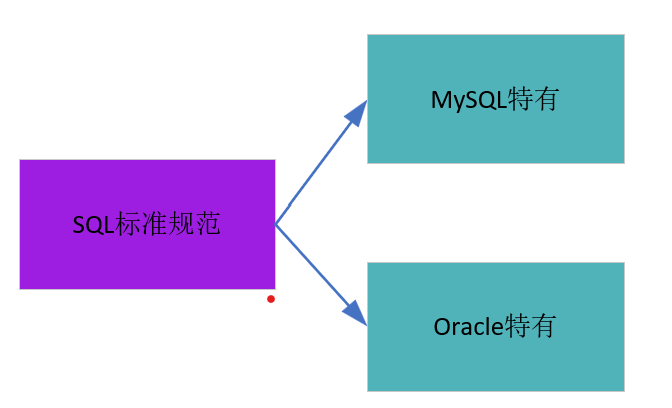

## 2. SQL分类 

主要分为3大类：

- **<font color=blue>DDL（Data Definition Language，数据定义语言）</font>**：定义不同的数据库、表、视图、索引等数据库对象，还可以用来创建、修改、删除数据库和表结构，主要有**<font color=blue>CREATE、DROP、ALTER</font>**等。
- **<font color=blue>DML(Data Manipulation Language，数据操作语言)</font>**，用于添加、删除、更新和查询数据库记录，并检查数据完整性，比如**<font color=blue>INSERT、DELETE、UPDATE、SELECT</font>**
- **<font color=blue>DCL(Data Control Language，数据控制语言)</font>**，用于定义数据库、表、字段、用户的访问权限和安全级别，比如**<font color=blue>GRANT、REVOKE、COMMIT、ROLLBACK、SAVEPOINT</font>**

## 3. SQL语言规范

### 3.1 基本规则

- 为提高可读性，建议各子句分行书写
- 每条命令以;或\g或\G结束
- 关键字不能分行
- 字符串、时间类型的数据用单引号''；列的别名，用双引号"",且不建议省略as。

### 3.2 大小写规范

- **<font color=blue>MySQL在Windows下对大小写不敏感</font>**

- **<font color=blue>MySQL在Linux下大小写敏感</font>**

  - 数据库名、表名、表的别名、变量名严格区分大小写
  - 关键字、函数名、列名（字段名）、列的别名（字段别名）忽略大小写

- **<font color=blue>推荐使用统一的大小写规范</font>**：

  - 数据库名、表名、表别名、字段名、字段别名等都小写
  - SQL关键字、函数名、绑定变量等都大写

  

### 3.3 注释

```mysql
单行注释： #
多行注释： /*  */
```

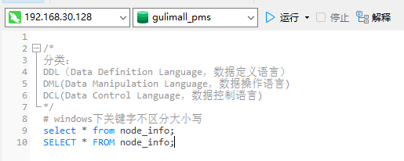


### 3.4 命名规则

- 数据库、表名不得超过30个字符，变量名限制为29个

- 必须只能包含A-Z, a-z, 0-9，_共63个字符

- 数据库名、表名、字段名等对象名中间无空格

  

### 3.5 导入数据库

- 方式1： source 文件全路径
- 图形化工具导入


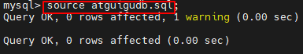


# 第2章. SELECT语句

## 2.1  基本SELECT语句

### 2.1.1 SELECT...

```mysql
SELECT 1;  #没有任何字句
SELECT 1+1,3+3;  #没有任何字句
# 等价于从伪表DUAL中查询
SELECT 1+1,3+3 FROM DUAL;
```

**<font color=red>没有FROM默认从伪表DUAL中查询</font>**

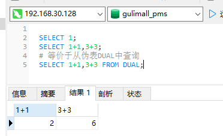

### 2.1.2 SELECT ... FROM

从某个表中查询指定列

```mysql
SELECT * FROM 表名;   #查询所有字段
SELECT 字段名1,字段名2 FROM 表名;
```

### 2.1.3 列的别名

```mysql
#有无AS效果相同，AS为alias的缩写
SELECT 字段名1 AS 别名 FROM 表名;
SELECT 字段名1 别名 FROM 表名; 
SELECT 字段名1 "别名" FROM 表名;  #用双引号（不要用单引号）适合别名中有空格的情况，此时不加双引号会报错
```


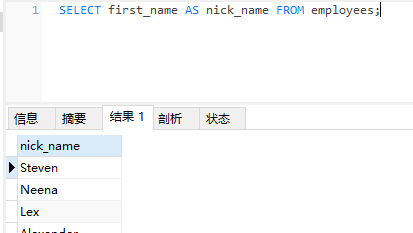

### 2.1.4 去除重复行

```mysql
SELECT DISTINCT 字段名 FROM 表名;
SELECT DISTINCT 字段1,字段2 FROM 表名;  #对（字段1，字段2）的整体去重，若写成 SELECT 字段1,DISTINCT 字段2 FROM 表名; 报错，因为行数不一样，字段1不会去重
```

### 2.1.5 空值参与运算

空值（NULL）不等同于0, '', 'null'，它参与运算结果也为空（未知）

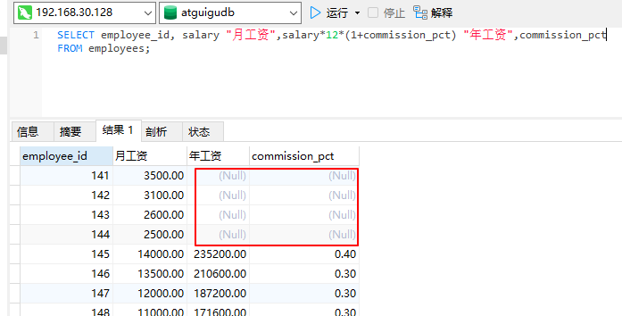

如果commission_pct(奖金率)NULL时当作0来计算，使用函数IFNULL进行流程控制:

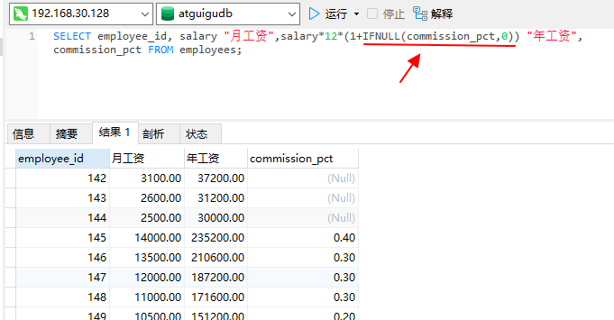

### 2.1.6 着重号

当表名和关键字重复（命名时尽量不要这样）时，要用着重号**<font color=red>``</font>**，否则会报错：

```mysql
SELECT * FROM `order`;  # order要加着重号
```

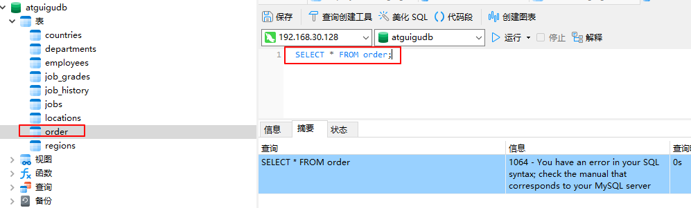

### 2.1.7 查询常数

表中没有该字段，统一添加。下面为统一添加公司名“尚硅谷”：

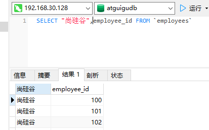

## 2.2 显示表结构

```mysql
DESCRIBE 表名;
或
DESC 表名;
```

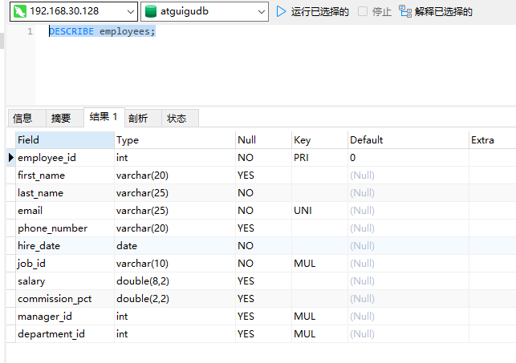

## 2.3 过滤数据

用**<font color=red>WHERE</font>**过滤

```mysql
SELECT * FROM employees WHERE last_name='King';  #查询last为King的员工
SELECT last_name,salary FROM employees WHERE salary>12000;  #工资大于12000
```

注意：**WHERE过滤只会显示比较结果为1的**，有NULL参与比较结果为NULL，1条都不会显示


# 第3章 运算符

## 3.1 算数运算符

加减乘除、取模

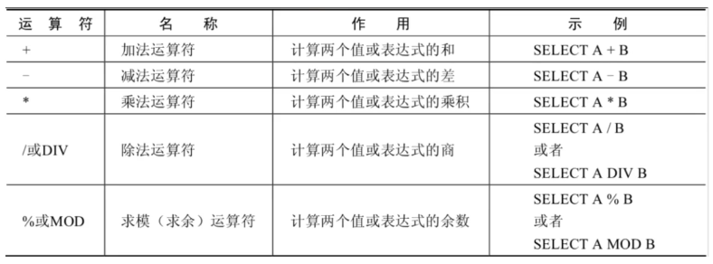

示例：

```mysql
SELECT employee_id,last_name FROM employees WHERE employee_id%2=0;  #查询id为偶数的员工信息，注意判断用= 而非==
```

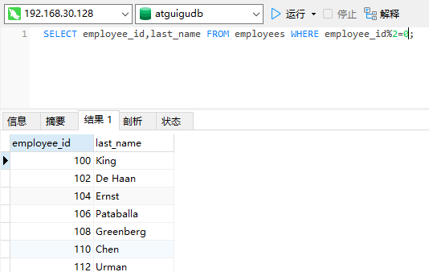


## 3.2 比较运算符

### 3.2.1 运算符

对左右两边的操作数进行比较，比较结果为真返回1，假返回0，其他情况返回NULL。比较运算符经常被用来作为SELECT查询语句的条件来使用，返回符合条件的结果记录。


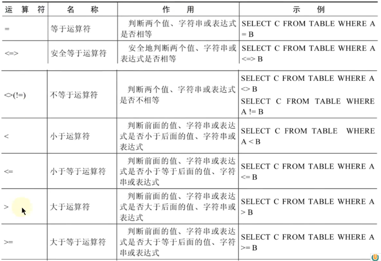

1. **等号运算符**
   - 等号运算符（=)判断等号两边的值、字符串表达式是否相等，若相等返回1,不等返回0
   - 在使用等号运算符时，根据等号两边的值遵循如下规则：
     - 都为字符串：按照字符串进行比较，其比较的是每个字符串中的ANSI编码是否相等。
     - 都是整数：按照整数来比较两个值的大小
     - 一个整数，一个字符串：将字符串转化为数字进行比较
     - 有一个为NULL：比较结果为NULL
   - SQL中赋值用   **<font color=red>:=</font>**

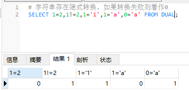


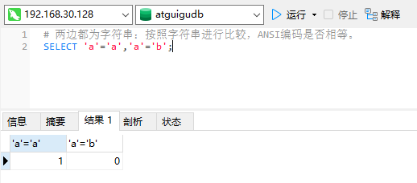


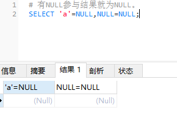


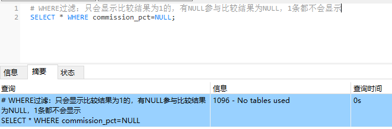

**2.安全等于**（为NULL而生）

安全等于运算符（<=>）用于补足等于运算符（=）对NULL的判断。在两个操作数均为NULL时，返回值为1；一个为NULL时，返回值为0；从而规避NULL的情况。

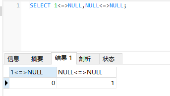

查询commission_pct字段为NULL的员工数据

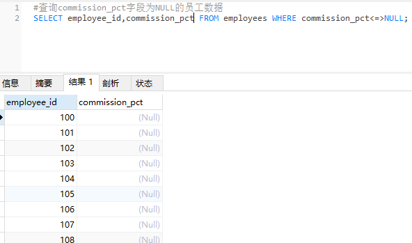


### 3.2.2 关键字

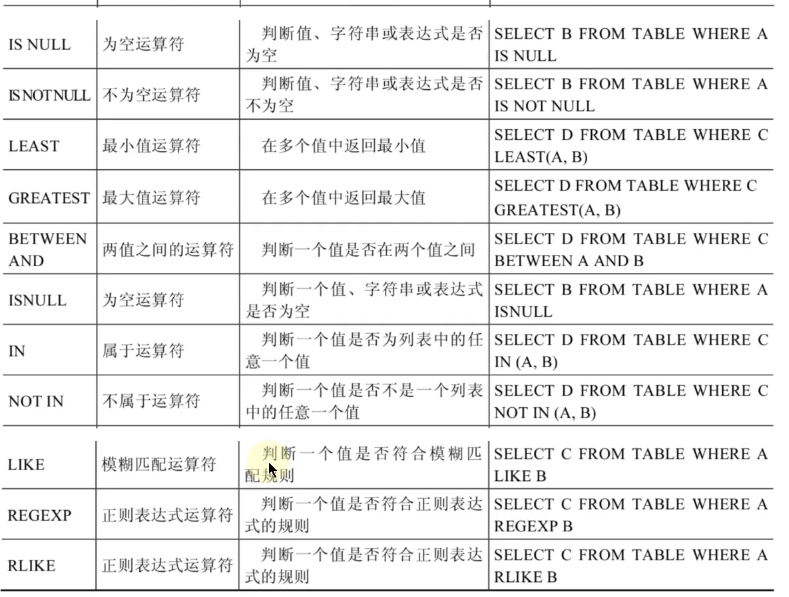


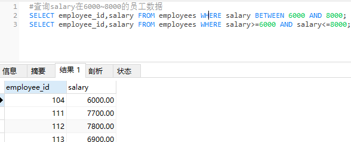


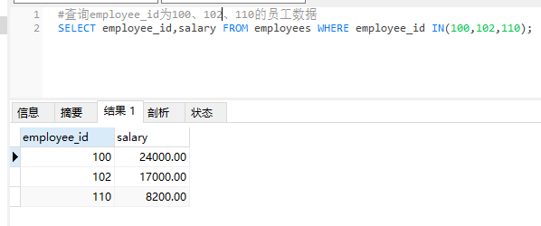


**LIKE模糊查询**：

- % : 表示不确定个数的字符
- _  : 表示一个字符 
- \ :转义字符。也可用**ESCAPE**指定转义字符

```mysql
#查询last_name中包含'ch'的员工数据, %表示不确定个数的字符
SELECT last_name FROM employees WHERE last_name LIKE '%ch%';   #包含ch
SELECT last_name FROM employees WHERE last_name LIKE 'ch%';   #以ch开头
SELECT last_name FROM employees WHERE last_name LIKE '%c%' AND last_name LIKE '%h%';   #既包含c又包含h
SELECT last_name FROM employees WHERE last_name LIKE '_h%';   #第2个字符是h的
SELECT last_name FROM employees WHERE last_name LIKE '_\_h%';   #第2个字符是_且第3个字符是h的（\转义字符）
SELECT last_name FROM employees WHERE last_name LIKE '_$_h%' ESCAPE '$';   #第2个字符是_且第3个字符是h的（指定$为转义字符）
```

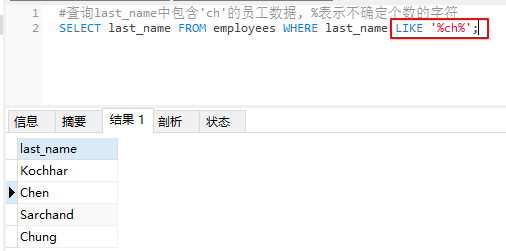


正则表达式REGEXP

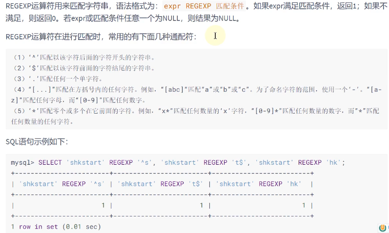

## 3.3 逻辑运算符


| 运算符     |                           作用                           |                  示例                  |
| ---------- | :------------------------------------------------------: | :------------------------------------: |
| NOT 或  !  |                            非                            |             SELECT NOT  A              |
| AND 或 &&  |                            与                            |             SELECT A AND B             |
| OR 或 \|\| |                            或                            | SELECT A OR B    或   SELECT A \|\|  B |
| XOR        | 异或(两个都NULL返回NULL，一个0一个1返回1，都0或都1返回0) |             SELECT A XOR B             |


- OR和AND可以一起使用，且AND优先级高于OR，因此先对AND两边的操作数进行操作，再与OR中操作数结合

## 3.4 位运算符


| 运算符 | 作用 | 示例        |
| ------ | ---- | ----------- |
| &      | 与   | SELECT A&B  |
| \|     | 或   | SELECT A\|B |
| ^      | 异或 | SELECT A^B  |
| ~      | 取反 | SELECT ~A   |
| >>     | 右移 | SELECT A>>2 |
| <<     | 左移 | SELECT A<<2 |


## 3.5 运算符的优先级

| 优先级 |                            运算符                            |
| :----: | :----------------------------------------------------------: |
| **1**  |                      **:= ，=（赋值）**                      |
| **2**  |                      **\|\|, OR, XOR**                       |
| **3**  |                         **&&, AND**                          |
| **4**  |                           **NOT**                            |
| **5**  |            **BETWEEN, CASE, WHEN, THEN 和 ELSE**             |
| **6**  | **=(比较运算符)，<=>, >=, >, <=, <, <>, !=, IS, LIKE, REGEXP和IN** |
| **7**  |                            **\|**                            |
| **8**  |                            **&**                             |
| **9**  |                          **<<与>>**                          |
| **10** |                           **-和+**                           |
| **11** |                    ***, /, DIV, %和MOD**                     |
| **12** |                            **^**                             |
| **13** |                  **-(负号)和~（按位取反）**                  |
| **14** |                            **!**                             |
| **15** |                            **()**                            |


## 3.6 拓展：使用正则表达式查询


## 3.7 练习题

题目：

```mysql
#1. 选择工资不在5000到12000的员工的姓名和工资
SELECT first_name,salary FROM employees WHERE salary NOT BETWEEN 5000 AND 12000;
#WHERE salary<5000 OR salary>12000;

#2.选择在20或50号部门工作的员工姓名和部门号
SELECT first_name,department_id FROM employees WHERE department_id IN (20,50);

#3.选择公司中没有管理者的员工姓名及job_id
SELECT first_name,job_id FROM employees WHERE manager_id IS NULL;
#WHERE manager_id<=>NULL;

#4.选择公司中有奖金的员工姓名，工资和奖金级别
SELECT first_name,salary,commission_pct FROM employees WHERE commission_pct IS NOT NULL;
#WHERE NOT commission_pct<=>NULL;

#5.选择员工姓名的第三个字母是a的员工姓名

#6.选择姓名中有字母a和k的员工姓名
SELECT first_name FROM employees WHERE first_name LIKE '%a%' AND first_name LIKE '%K%';

#7.显示表employees中first_name以'e'结尾的员工信息
SELECT first_name FROM employees WHERE first_name LIKE '%e';
SELECT first_name FROM employees WHERE first_name REGEXP 'e$';  # 以e开头：'^e'
```


# 第4章 安装

ubuntu裸机


官网下载deb包，https://downloads.mysql.com/archives/community/，查看支持的系统和版本。（8.0.30前后对redo 日志的处理是两个版本，ubuntu22不支持mysql 8.0.30之前的版本）

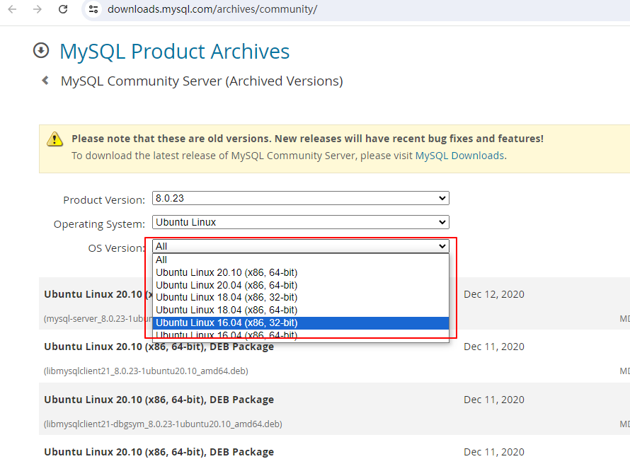


https://dev.mysql.com/doc/refman/8.0/en/innodb-redo-log.html

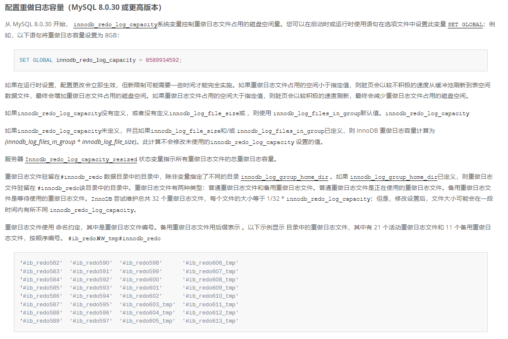


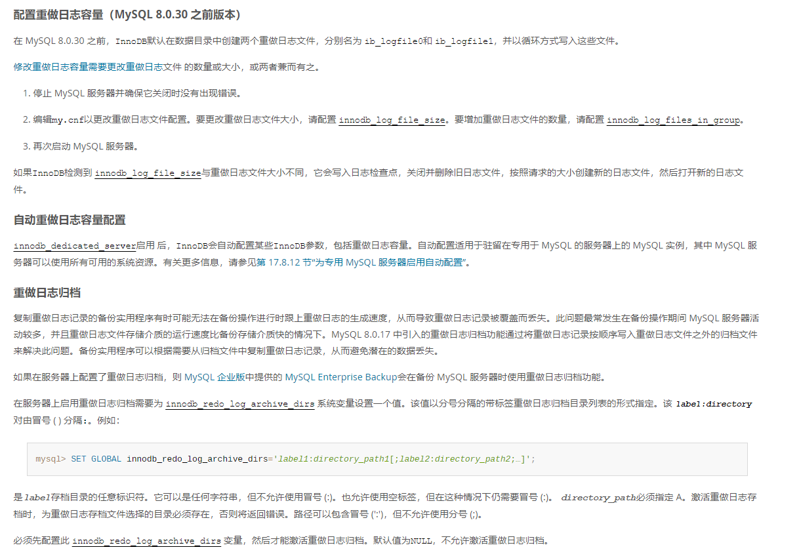


## 4.1 离线安装

以在ubuntu18.04上安装mysql 8.0.23为例

下载全量包bundle.tar：

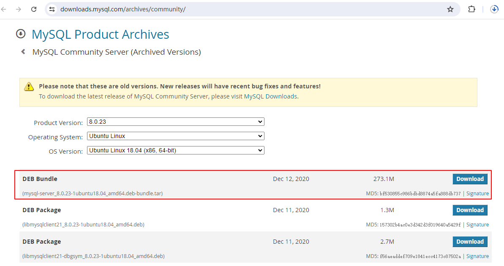

解压后

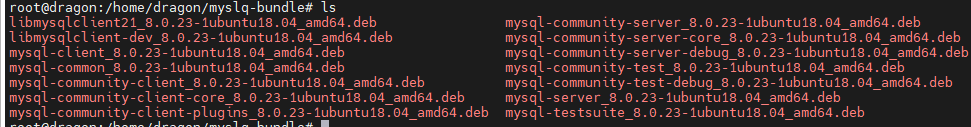

```bash
sudo su  
apt update  
apt upgrade 

#安装libaio1
apt install libaio1 #有问题apt --fix-broken ，或者按照提示来
#进入deb包路径
dpkg -i *   #安装全部deb包，有依赖顺序，自定义容易出错
```

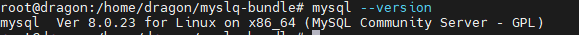


## 4.2 在线安装

以在ubuntu22上安装mysql 8.0.37为例

```bash
sudo su  
apt update  #可跳过
apt upgrade #可跳过
wget -c https://repo.mysql.com//mysql-apt-config_0.8.13-1_all.deb #下载deb包
dpkg -i mysql-apt-config_0.8.13-1_all.deb  #安装
apt install mysql-server
systemctl status mysql #若没启动手动启动
systemctl start mysql

#sudo mysql_secure_installation #调整安全策略
```

设置root密码

```mysql
mysql -u root -p  #刚开始没设密码，随便填
mysql> ALTER USER 'root'@'localhost' IDENTIFIED WITH mysql_native_password BY '新密码';  #设置密码
mysql> FLUSH PRIVILEGES;  #刷新
```


远程无法访问

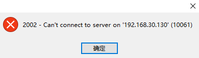

本机上telnet 3306端口也不通（用localhost通，用ip不通，大体就能猜到设置了只能通过localhost访问）

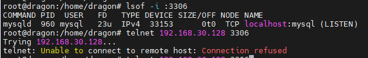

登录mysql查看系统参数设置：

```mysql
mysql -u root -p
mysql> use mysql;   #在mysql表里
mysql> select Host,User from user;  #查看用户设置
```

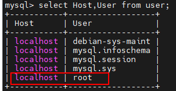

可以看到root用户的当前主机配置信息为localhost，修改为任意ip均可访问：

```mysql
mysql> update user set host='%' where user ='root'; # 通配符%任意ip可访问
mysql> flush privileges; # 刷新配置
```


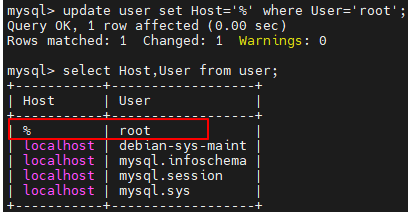

改完后用ip telnet一下3306，若还不通，修改配置文件my.cnf:

```bash
vi /etc/mysql/my.cnf  #修改配置文件
#添加如下内容  
[mysqld]
bind-address = 0.0.0.0  #允许所有ip
port = 3306
systemctl restart mysql #重启服务
```

确保telent能通：

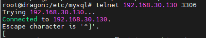


再次远程连接成功：


