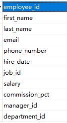
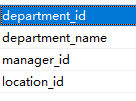
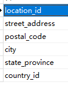
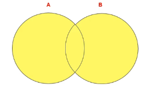
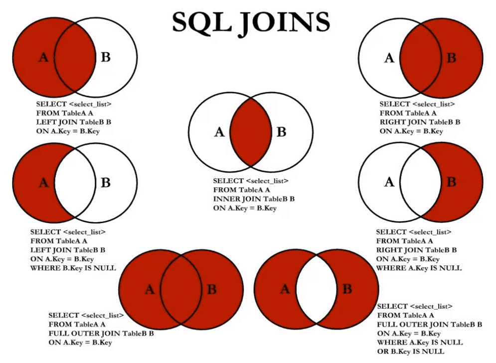

[toc]


# 第六章_多表查询

## 1. 多表查询分类讲解

employees表



departments表



locations表




为何不将3张表合为一张表？

- 产生冗余数据：比如只建employees表，为了存储部门信息，需要加上departments表中的4个字段，相同部门的员工这4个字段相同，但却要重复存储。数据冗余进一步造成单个数据页能存储的数据条数减少，B+树高度增加，IO次数增加，降低查询效率。
- 并发度低：多张表时，一张表锁定，不影响其他表的查询


示例：查询员工的employee_id,last_name,department_name,city

```mysql
SELECT e.employee_id,e.last_name,d.department_name,l.city 
FROM `employees` e, departments d,locations l 
WHERE e.department_id=d.department_id AND d.location_id=l.location_id;
```

要实现n个表的多表查询，至少需要n-1个连接条件


多表查询的分类：

角度1：等值连接和非等值连接

前者WHERE中使用等号连接，后者比如> 、<，例如找出每个员工的工作等级：

```mysql
SELECT e.last_name,e.salary,j.grade_level
FROM employees e,job_grades j 
WHERE e.salary BETWEEN j.lowest_sal AND j.highest_sal;  #通过工资确定等级
```

角度2：自连接和非自连接

自连接：自己和自己连接（单表），例如找出员工的管理者信息：

```mysql
SELECT CONCAT(worker.last_name , ' works for ', manager.last_name)
FROM employees worker, employees manager
WHERE worker.manager_id = manager.employee_id;
```

角度3：内连接和外连接


### 1) 自连接

自己和自己连接（单表）

题目：查询employees表，返回 <员工 works for 老板>

```mysql
SELECT CONCAT(worker.last_name , ' works for ', manager.last_name)
FROM employees worker, employees manager
WHERE worker.manager_id = manager.employee_id;
```

### 2) 内连接与外连接

* 内连接: 合并具有同一列的两个以上的表的行, <font color=red>**结果集中不包含一个表与另一个表不匹配的行** </font>

**SQL92语法**

```mysql
SELECT emp.employee_id, dep.department_name
FROM employee emp, department dep
WHERE emp.`department_id` = dep.`department_id`;
```

**SQL99语法**

```mysql
SELECT emp.employee_id, dep.department_name
FROM employee emp JOIN department dep
ON emp.`department_id` = dep.`department_id`;
```

* 外连接: 两个表在连接过程中除了返回满足连接条件的行以外, <font color=red>**还返回左（或右）表中不满足条件的 行**</font> ，这种连接称为左（或右） 外连接。没有匹配的行时, 结果表中相应的列为空(NULL)。 <font color=red>**外连接包括左外连接、右外连接、满外连接**</font>。
* 如果是左外连接，则连接条件中左边的表也称为 主表 ，右边的表称为 从表 。 

**LEFT OUTER JOIN**

**<font color=red>OUTER可以省略</font>**

```mysql
SELECT last_name, department_name
FROM employees emp LEFT OUTER JOIN department dep
ON emp.`department_id` = dep.`department_id`;
```

* 如果是右外连接，则连接条件中右边的表也称为 主表 ，左边的表称为 从表 。

**RIGHT OUTER JOIN**

```mysql
SELECT last_name, department_name
FROM employees emp RIGHT OUTER JOIN department dep
ON emp.`department_id` = dep.`department_id`;  
```

**FULL OUTER JOIN**

**<font color=red>满外连接，但MySQL不支持，Oracle支持</font>**。比如表A有100条记录，表B有20条记录，满外连接可以查出120条记录。

## 2. UNION的使用

**合并查询结果** 

利用UNION关键字，可以给出多条SELECT语句，并将它们的结果组合成单个结果集。合并 时，两个表对应的列数和数据类型必须相同，并且相互对应。各个SELECT语句之间使用UNION或UNION ALL关键字分隔。

语法格式：

```mysql
SELECT column,... FROM table1
UNION [ALL]
SELECT column,... FROM table2
```

**UNION操作符**



UNION 操作符返回两个查询的结果集的并集，**<font color=red>去除重复记录</font>**。

**UNION ALL操作符**（**<font color=red>推荐使用，效率高</font>**）

UNION ALL操作符返回两个查询的结果集的并集，**<font color=red>不去除两个结果集的重复部分</font>**。

> 注意：执行UNION ALL语句时所需要的资源比UNION语句少。如果明确知道合并数据后的结果数据不存在重复数据，或者不需要去除重复的数据，**<font color=red>推荐使用UNION ALL语句，提高数据查询的效率</font>**。

举例：查询部门编号>90或邮箱包含a的员工信息

```mysql
#方式1
SELECT * FROM employees WHERE email LIKE '%a%' OR department_id>90;
```

```mysql
#方式2
SELECT * FROM employees WHERE email LIKE '%a%'
UNION
SELECT * FROM employees WHERE department_id>90;
```

举例：查询中国用户中男性的信息以及美国用户中年男性的用户信息

```mysql
SELECT id,cname FROM t_chinamale WHERE csex='男'
UNION ALL
SELECT id,tname FROM t_usmale WHERE tGender='male';
```

## 3.七种SQL JOINS的实现（重要）



```mysql
# 中图：内连接
SELECT employee_id,department_name
FROM employees e JOIN departments d
ON e.`department_id` = d.`department_id`;

# 左上图：左外连接
SELECT employee_id,department_name
FROM employees e LEFT JOIN departments d
ON e.`department_id` = d.`department_id`;

# 右上图：右外连接
SELECT employee_id,department_name
FROM employees e RIGHT JOIN departments d
ON e.`department_id` = d.`department_id`;

# 左中图：在左上图（左外连接）的基础上去掉中图数据（内连接）
SELECT employee_id,department_name
FROM employees e LEFT JOIN departments d
ON e.`department_id` = d.`department_id`
WHERE d.`department_id` IS NULL;

# 右中图：
SELECT employee_id,department_name
FROM employees e RIGHT JOIN departments d
ON e.`department_id` = d.`department_id`
WHERE e.`department_id` IS NULL;


# 左下图：满外连接
# 方式1：左上图 UNION ALL 右中图
SELECT employee_id,department_name
FROM employees e LEFT JOIN departments d
ON e.`department_id` = d.`department_id`
UNION ALL
SELECT employee_id,department_name
FROM employees e RIGHT JOIN departments d
ON e.`department_id` = d.`department_id`
WHERE e.`department_id` IS NULL;


# 方式2：左中图 UNION ALL 右上图
SELECT employee_id,department_name
FROM employees e LEFT JOIN departments d
ON e.`department_id` = d.`department_id`
WHERE d.`department_id` IS NULL
UNION ALL
SELECT employee_id,department_name
FROM employees e RIGHT JOIN departments d
ON e.`department_id` = d.`department_id`;

# 右下图：左中图  UNION ALL 右中图
SELECT employee_id,department_name
FROM employees e LEFT JOIN departments d
ON e.`department_id` = d.`department_id`
WHERE d.`department_id` IS NULL
UNION ALL
SELECT employee_id,department_name
FROM employees e RIGHT JOIN departments d
ON e.`department_id` = d.`department_id`
WHERE e.`department_id` IS NULL;
```

## 4. SQL99语法的新特性

### 1) 自然连接

SQL99 在 SQL92 的基础上提供了一些特殊语法，比如 NATURAL JOIN 用来表示自然连接。我们可以把 自然连接理解为 SQL92 中的等值连接。它会帮你<font color=red>**自动查询两张连接表中 所有相同的字段 ，然后进行 等值 连接** </font>。

在SQL92标准中：

```mysql
SELECT employee_id,last_name,department_name
FROM employees e JOIN departments d
ON e.`department_id` = d.`department_id`
AND e.`manager_id` = d.`manager_id`;
```

在 SQL99 中你可以写成：

```mysql
SELECT employee_id,last_name,department_name
FROM employees e NATURAL JOIN departments d;
```

### 2) USING连接

当我们进行连接的时候，SQL99还支持使用 USING 指定数据表里的 同名字段 进行等值连接。但是只能配 合JOIN一起使用。比如：

```mysql
SELECT employee_id,last_name,department_name
FROM employees e JOIN departments d
USING (department_id);
```

你能看出与自然连接 NATURAL JOIN 不同的是，<font color=red>**USING 指定了具体的相同的字段名称**</font>，你需要在 USING 的括号 () 中填入要指定的同名字段。同时使用 JOIN...USING 可以简化 JOIN ON 的等值连接。它与下 面的 SQL 查询结果是相同的：

```mysql
SELECT employee_id,last_name,department_name
FROM employees e ,departments d
WHERE e.department_id = d.department_id;
```

## 5. 小结

表连接的约束条件可以有三种方式：WHERE, ON, USING 

* WHERE：适用于所有关联查询 
* ON ：只能和JOIN一起使用，只能写关联条件。虽然关联条件可以并到WHERE中和其他条件一起 写，但分开写可读性更好。 (<font color=red>**推荐使用**</font>)
* USING：只能和JOIN一起使用，而且要求两个关联字段在关联表中名称一致，而且只能表示关联字 段值相等

> 我们要控制连接表的数量 。
>
> 多表连接就相当于嵌套 for 循环一样，非常消耗资源，会让 SQL 查询性能下 降得很严重，因此不要连接不必要的表。
>
> 在许多 DBMS 中，也都会有最大连接表的限制。

```mysql
# 习题巩固
# 注意：当两个表外连接之后，组成主表和从表，主表的连接字段是不为空的，从表的连接字段可能为空，因此从表的关键字段用来判断是否为空。

# 1.查询哪些部门没有员工
# 方式一
SELECT d.department_id
FROM departments d LEFT JOIN employees e
ON d.`department_id` = e.`department_id`
WHERE e.`department_id` IS NULL;

# 方式二
SELECT department_id
FROM departments d
WHERE NOT EXISTS (
		SELECT *
    	FROM employees e
    	WHERE e.`department_id` = d.`department_id`
);

# 2.查询哪个城市没有部门
SELECT l.location_id, l.city
FROM locations l LEFT JOIN departments d
ON l.`location_id` = d.`location_id`
WHERE d.`location_id` IS NULL;

# 3.查询部门名为 Sales 或 IT 的员工信息
SELECT e.employee_id, e.last_name, e.department_id
FROM employees e JOIN department d
ON e.`department_id` = d.`department_id`
WHERE d.`department_name` IN ('Sales', 'IT');
```


课后练习题

```mysql
# 第06章_多表查询的课后练习

# 1.显示所有员工的姓名，部门号和部门名称。
SELECT e.last_name,e.department_id,d.department_name
FROM employees e LEFT OUTER JOIN departments d
ON e.`department_id` = d.`department_id`;

# 2.查询90号部门员工的job_id和90号部门的location_id
SELECT e.job_id,d.location_id
FROM employees e JOIN departments d
ON e.`department_id` = d.`department_id`
WHERE d.`department_id` = 90;


DESC departments;

# 3.选择所有有奖金的员工的 last_name , department_name , location_id , city
SELECT e.last_name ,e.`commission_pct`, d.department_name , d.location_id , l.city
FROM employees e LEFT JOIN departments d
ON e.`department_id` = d.`department_id`
LEFT JOIN locations l
ON d.`location_id` = l.`location_id`
WHERE e.`commission_pct` IS NOT NULL; #也应该是35条记录


SELECT *
FROM employees
WHERE commission_pct IS NOT NULL; #35条记录


# 4.选择city在Toronto工作的员工的 last_name , job_id , department_id , department_name 

SELECT e.last_name , e.job_id , e.department_id , d.department_name
FROM employees e JOIN departments d
ON e.`department_id` = d.`department_id`
JOIN locations l
ON d.`location_id` = l.`location_id`
WHERE l.`city` = 'Toronto';

#sql92语法：
SELECT e.last_name , e.job_id , e.department_id , d.department_name
FROM employees e,departments d ,locations l
WHERE e.`department_id` = d.`department_id` 
AND d.`location_id` = l.`location_id`
AND l.`city` = 'Toronto';


# 5.查询员工所在的部门名称、部门地址、姓名、工作、工资，其中员工所在部门的部门名称为’Executive’

SELECT d.department_name,l.street_address,e.last_name,e.job_id,e.salary
FROM departments d LEFT JOIN employees e
ON e.`department_id` = d.`department_id`
LEFT JOIN locations l
ON d.`location_id` = l.`location_id`
WHERE d.`department_name` = 'Executive';


DESC departments;

DESC locations;

# 6.选择指定员工的姓名，员工号，以及他的管理者的姓名和员工号，结果类似于下面的格式
employees	Emp#	manager	Mgr#
kochhar		101	king	100

SELECT emp.last_name "employees",emp.employee_id "Emp#",mgr.last_name "manager", mgr.employee_id "Mgr#"
FROM employees emp LEFT JOIN employees mgr
ON emp.manager_id = mgr.employee_id;


# 7.查询哪些部门没有员工

SELECT d.department_id
FROM departments d LEFT JOIN employees e
ON d.`department_id` = e.`department_id`
WHERE e.`department_id` IS NULL;

#本题也可以使用子查询：暂时不讲

# 8. 查询哪个城市没有部门 

SELECT l.location_id,l.city
FROM locations l LEFT JOIN departments d
ON l.`location_id` = d.`location_id`
WHERE d.`location_id` IS NULL;

SELECT department_id
FROM departments
WHERE department_id IN (1000,1100,1200,1300,1600);


# 9. 查询部门名为 Sales 或 IT 的员工信息

SELECT e.employee_id,e.last_name,e.department_id
FROM employees e JOIN departments d
ON e.`department_id` = d.`department_id`
WHERE d.`department_name` IN ('Sales','IT');
```
