[toc]


# 第15章_锁

<font color=orange>**锁**</font>保护事务的<font color=orange>**隔离性**</font>。

## 1. 概述

<font color=orange>**锁**</font>是计算机协调多个进程或线程<font color=orange>**并发访问某资源**</font>的机制。在程序开发中会存在多线程同步的问题，当多个线程并发访问某个数据的时候，尤其是针对一些敏感的数据（比如订单、金额等），就需要保证这个数据在任何时刻<font color=orange>**最多只有一个线程访问**</font>，保证数据的<font color=orange>**完整性**</font>和<font color=orange>**一致性**</font>。加锁就是为了保证数据的一致性。

在数据库中，除传统的计算资源（如CPU、RAM、I/O等）的争用以外，数据也是一种供许多用户共享的 资源。为保证数据的一致性，需要对 `并发操作进行控制` ，因此产生了 `锁` 。同时 `锁机制` 也为实现MySQL 的各个隔离级别提供了保证。 <font color=orange>**锁冲突**</font> 也是影响数据库 <font color=orange>**并发访问性能**</font>的一个重要因素。所以锁对数据库而言显得尤其重要，也更加复杂。

## 2. MySQL并发事务访问相同记录

并发事务访问相同记录的情况大致可以划分为3种：

### 2.1 读-读情况

`读-读`情况，即并发事务相继<font color=orange>**读取相同的记录**</font>。读取操作本身不会对记录有任何影响，并不会引起什么问题，所以允许这种情况的发生。

### 2.2 写-写情况

`写-写` 情况，即并发事务相继<font color=orange>**对相同的记录做出改动**</font>。

在这种情况下会发生 <font color=orange>**脏写**</font> 的问题，任何一种隔离级别<font color=orange>**都不允许**</font>这种问题的发生。所以在多个未提交事务相继对一条记录做改动时，需要让它们 `排队执行` ，这个排队的过程其实是通过 `锁` 来实现的。这个所谓的锁其实是一个内存中的结构 ，在事务执行前本来是没有锁的，也就是说一开始是没有 <font color=orange>**锁结构**</font> 和记录进 行关联的，如图所示：


当一个事务想对这条记录做改动时，首先会看看内存中有没有与这条记录关联的 `锁结构` ，当没有的时候 就会在内存中生成一个 `锁结构` 与之关联。比如，事务` T1` 要对这条记录做改动，就需要生成一个 `锁结构` 与之关联：

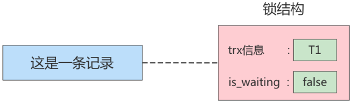

在`锁结构`里有很多信息，为了简化理解，只把两个比较重要的属性拿了出来：

* <font color=orange>**trx信息**</font>：代表这个锁结构是<font color=orange>**哪个事务**</font>生成的。
* <font color=orange>**is_waiting**</font>：代表当前事务<font color=orange>**是否等待**</font>。

在事务`T1`改动了这条记录后，就生成了一个`锁结构`与该记录关联，因为之前没有别的事务为这条记录加锁，所以`is_waiting`属性就是`false`，我们把这个场景就称值为`获取锁成功`，或者`加锁成功`，然后就可以继续执行操作了。

在事务`T1`提交之前，另一个事务`T2`也想对该记录做改动，那么先看看有没有`锁结构`与这条记录关联，发现有一个`锁结构`与之关联后，然后也生成了一个锁结构与这条记录关联，不过锁结构的`is_waiting`属性值为`true`，表示当前事务需要等待，我们把这个场景就称之为`获取锁失败`，或者`加锁失败`，图示：


在事务T1提交之后，就会把该事务生成的`锁结构释放`掉，然后看看还有没有别的事务在等待获取锁，发现了事务T2还在等待获取锁，所以把事务<font color=orange>**T2**</font>对应的锁结构的`is_waiting`属性设置为<font color=orange>**false**</font>，然后<font color=orange>**把该事务对应的线程唤醒**</font>，让它继续执行，此时事务T2就算获取到锁了。效果就是这样。

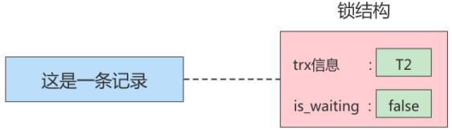

<font color=orange>**小结**</font>：

* **<font color=orange>不加锁</font>**

  意思就是不需要在内存中生成对应的 `锁结构` ，可以直接执行操作。

* **<font color=orange>加锁成功</font>**

  意思就是在内存中生成了对应的 `锁结构` ，而且锁结构的 `is_waiting` 属性为 `false` ，也就是事务 可以继续执行操作。

* **<font color=orange>加锁失败</font>**

  意思就是在内存中生成了对应的 `锁结构` ，不过锁结构的 `is_waiting` 属性为 `true` ，也就是事务 需要等待，不可以继续执行操作。

### 2.3 读-写或写-读情况

 <font color=orange>**读-写** </font>或<font color=orange> **写-读** </font>，即一个事务进行读取操作，另一个进行改动操作。这种情况下可能发生  <font color=orange>**脏读 、 不可重复读 、 幻读**</font> 。

各个数据库厂商对 `SQL标准` 的支持都可能不一样。比如 <font color=orange>**MySQL在 REPEATABLE READ 隔离级别上就已经解决了 幻读问题**</font>。

### 2.4 并发问题的解决方案

怎么解决 `脏读、不可重复读、幻读` 呢？有两种可选解决方案：

* <font color=orange>**方案一：读操作利用多版本并发控制（ MVCC，下章讲解），写操作加锁**</font> 。

所谓的**<font color=orange>MVCC</font>**，就是生成一个**<font color=orange>ReadView</font>**，通过ReadView找到符合条件的记录版本（历史版本由<font color=orange>**undo日志**</font>构 建）。查询语句只能<font color=orange>**读**</font>到在生成ReadView之前<font color=orange>**已提交事务所做的更改**</font>，在生成ReadView之前未提交的事务或者之后才开启的事务所做的更改是看不到的。而写操作针对的是<font color=orange>**最新版本的记录**</font>，读记录的历史版本和改动记录的最新版本并不冲突，也就是<font color=orange>**采用MVCC时，读-写操作并不冲突**</font>。

> 普通的SELECT语句在READ COMMITTED和REPEATABLE READ隔离级别下会使用到MVCC读取记录。
>
> * 在 `READ COMMITTED` 隔离级别下，一个事务在执行过程中每次执行SELECT操作时都会生成一 个ReadView，ReadView的存在本身就保证了<font color=red>**事务不可以读取到未提交的事务所做的更改**</font> ，也就是避免了<font color=red>**脏读**</font>现象；
> * 在 `REPEATABLE READ` 隔离级别下，一个事务在执行过程中只有 <font color=red>**第一次执行SELECT操作才会生成一个ReadView**</font>，之后的SELECT操作都复用这个ReadView，这样也就避免了<font color=red>**不可重复读**</font>和<font color=red>**幻读**</font>的问题。

* <font color=orange>**方案二：读、写操作都加锁**</font>。

<font color=orange>**脏读**</font>的产生是因为当前事务读取了另一个未提交事务写的一条记录，如果另一个事务在写时就给这条记录加锁，那么当前事务就无法继续读取该记录了，所以也就不会有脏读问题的产生了。

<font color=orange>**不可重复读**</font>的产生是因为当前事务先读取一条记录，另外一个事务对该记录做了改动并提交之后，当前事务再次读取时会获得不同的值，如果在当前事务读取记录时就给该记录加锁，那么另一个事务就无法修改该记录，自然也不会发生不可重复读了。

<font color=orange>**幻读**</font>的产生是因为当前事务读取了一个范围的记录，然后其他事务向该范围内插入了新记录，当前事务再次读取该范围的记录时发现了新插入的新记录。采用加锁的方式解决幻读问题有一些麻烦，因为当前事务在第一次读取记录时幻影记录并不存在，所以读取的时候加锁就有点尴尬（不知道给谁加锁，后面会讲用<font color=orange>**间隙锁**</font>）。


* 小结：

  * 采用 <font color=orange>**MVCC**</font>方式的话， <font color=orange>**读-写 操作不冲突， 性能更高**</font> 。
  * 采用 `加锁` 方式的话， 读-写 操作彼此需要 `排队执行` ，影响性能。

  一般情况下我们当然愿意采用 `MVCC` 来解决 `读-写` 操作并发执行的问题，但是业务在某些特殊情况下，要求必须采用 `加锁 `的方式执行。下面就讲解下MySQL中不同类别的锁。

## 3. 锁的不同角度分类

锁的分类图，如下：

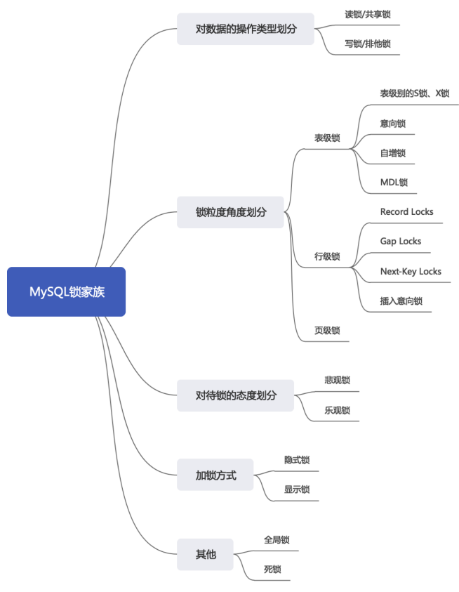

### 3.1 从数据操作的类型划分：读锁、写锁

数据库中并发事务的<font color=orange>**读-读**</font>不会引起问题，但<font color=orange>**写-写、读-写、写-读**</font>则可能引起一些问题，需要使用<font color=orange>**MVCC或者加锁**</font>解决。在使用加锁解决时，既要使<font color=orange>**读-读不受影响**</font>，又要使<font color=orange>**写-写、读-写、写-读操作相互阻塞**</font>，所以MySQL实现一个由两种类型的锁组成的锁系统来解决。这两种类型的锁通常被称为<font color=red>**共享锁（Shared Lock, S Lock）**</font>和<font color=red>**排他锁（Exclusive Lock, X Lock）**</font>, 也叫<font color=red>**读锁（readlock）**</font>和<font color=red>**写锁（write lock）**</font>。 

- 读锁：也称为共享锁、用英文S表示。针对同一份数据，多个事务的读操作可以同时进行而互不影响， 相互不阻塞的。 
- 写锁：也称为排他锁、用英文X表示。当前写操作没有完成前，它会阻断其他写锁和读锁。以确保在给定时间内，只有一个事务能执行写入，并防止其他用户读取正在写入的同一资源。

 对于InnoDB引擎来说，<font color=red>**读锁和写锁可以加在表上，也可以加在行上**</font>。

<font color=orange>**举例（行级读写锁）**</font>：如果事务T1已经获得了某个行r的读锁，此时事务T2是可以去获得 这个行的读锁的，因为读取操作并没有改变行r的数据；但是，如果事务T3想获得行r的写锁，则它必须等待事务T1、T2释放掉行r上的读锁才行。

总结：这里的兼容是指对同一张表或记录的锁的兼容性情况。

|      |  X锁   |   S锁    |
| :--: | :----: | :------: |
| X锁  | 不兼容 |  不兼容  |
| S锁  | 不兼容 | **兼容** |

#### 1. 锁定读

在采用加锁方式解决<font color=orange>**脏读、不可重复读、幻读**</font>时，读取一条记录时需要获取该记录的<font color=orange>**S锁**</font>，其实是不严谨的，有时需要在读取记录时就获取记录的<font color=orange>**X锁**</font> ，来禁止别的事务读写该记录，为此MySQL提出了两种比较特殊的SELECT语句格式：

- 对读取的记录加<font color=orange>**S锁**</font>： 

```mysql
SELECT ... LOCK IN SHARE MODE;
或
SELECT ... FOR SHARE;  # 8.0新增语法
```

在普通的SELECT语句后边加<font color=orange>**LOCK IN SHARE MODE**</font>，如果当前事务执行了该语句，那么它会为读取到的记录加S锁，这样允许别的事务继续获取这些记录的<font color=orange>S锁</font>（比方说别的事务也使用SELECT ... LOCK IN SHARE MODE语句来读取这些记录），但是<font color=orange>**不能获取这些记录的X锁**</font>。（比如使用<font color=orange>**SELECT ... FOR UPDATE**</font>语句来读取这些记录，或者直接修改这些记录）。如果别的事务想要获取这些记录的X锁，那么它们会阻塞，直到当前事务提交之后将这些记录上的S锁释放掉.

- 对读取的记录加<font color=orange>**X锁**</font>： 

```mysql
SELECT ... FOR UPDATE;
```

在普通的SELECT语句后边加<font color=orange>**FOR UPDATE**</font> ，如果当前事务执行了该语句，会为读取到的记录加<font color=orange>**X锁**</font>， 既<font color=orange>**不允许别的事务获取这些记录的S锁**</font>（比方说别的事务使用SELECT ... LOCK IN SHARE MODE语句来读取这些记录），<font color=orange>**也不允许获取这些记录的X锁**</font>（比如使用SELECT ... FOR UPDATE语句来读取这些记录，或者直接修改这些记录）。如果别的事务想要获取这些记录的S锁或者X锁，那么它们会<font color=orange>**阻塞**</font>，直到当前事务提交之后将这些记录上的X锁释放掉。


<font color=orange>**MySQL8.0新特性**</font>：

在5.7及之前的版本，SELECT... FOR UPDATE如果获取不到锁，会一直等待，直到 <font color=orange>**innodb_lock_wait_timeout 超时**</font>。在 8.0 版本中，SELECT... FOR UPDATE, SELECT ... FOR SHARE 添力NOWAIT、SKIP LOCKED语法，<font color=orange>**跳过锁等待**</font>，或跳过锁定。

- 通过添加NOWAIT、SKIP LOCKED语法，能够立即返回。如果查询的行已经加锁：
  - <font color=orange>**NOWAIT**</font>：立即报错返回 
  - <font color=orange>**SKIP LOCKED**</font>：立即返回，只是返回的结果中不包含被锁定的行。 


```mysql
# session1
mysql> begin;
mysql> select * from t1 where c1=2 for update;
+------+------+
| c1   | c2   |
+------+------+
|    2 |    2 |
+------+------+
1 row in set (0.00 sec)

# session2
mysql> begin;
mysql> select * from t1 where c1=2 for update nowait;
ERROR 3572 (HY000): Statement aborted because lock(s) could not be acquired immediately and NOWAIT is set.
mysql> select * from t1 where c1=2 for update skip locked;
Empty set (0.00 sec)
```

会话1：给c1=2所在行加X锁

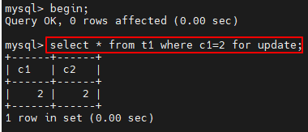

紧接着会话2：给c1=2所在行加X锁

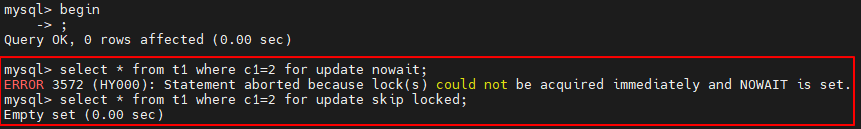

#### 2. 写操作

平常所用到的<font color=orange>**写操作**</font>无非<font color=orange>**DELETE、UPDATE 、INSERT**</font>三种：

- <font color=orange>**DELETE**</font> : 对一条记录做DELETE操作的过程其实是先在<font color=orange>**B+**</font>树中定位到这条记录的位置，然后获取这条记录的<font color=orange>**X锁**</font>，再执行<font color=orange>**delete mark**</font>操作。也可以把这个定位待删除记录在B+树中位置的过程看成是一个获取X锁的<font color=orange>**锁定读**</font>。
- <font color=orange>**UPDATE**</font> ：在对一条记录做UPDATE操作时分为三种情况：
  - 情况1：未修改该记录的键值，并且被更新的列占用的存储空间在修改前后未发生变化。 则先在B+树中定位到这条记录的位置，然后再获取记录的X锁，最后在原记录的位置进行修改操作。也可以把这个定位待修改记录在B+树中位置的过程看成是一个获取<font color=orange>**X锁**</font>的<font color=orange>**锁定读**</font>。
  - 情况2：未修改该记录的键值，并且至少有一个被更新的列占用的存储空间在修改前后发生变化。 则先在B+树中定位到这条记录的位置，然后获取记录的X锁，将该记录彻底删除（把记录移入垃圾链表），最后再插入一条新记录。这个定位待修改记录在B+树中位置的过程看成是一个获取X锁的锁定读，新插入的记录由<font color=orange>**INSERT**</font>操作提供的<font color=orange>**隐式锁**</font>进行保护。
  - 情况3：<font color=orange>**修改了**</font>该记录的<font color=orange>**键值**</font>，则相当于<font color=orange>**在原记录上做DELETE操作之后再来一次INSERT操作**</font>，加锁操作 就需要按照DELETE和INSERT的规则进行了。
- INSERT ： 一般情况下，新插入一条记录的操作并不加锁，通过一种<font color=orange>**隐式锁**</font>(当前事务没提交前其他事务看不到)的结构来保护这条新插入的记录在本事务提交前不被别的事务访问。

### 3.2 从数据操作的粒度划分：表级锁、页级锁、行锁

为尽可能提高数据库的并发度，每次锁定的数据范围越小越好，理论上每次只锁定当前操作的数据的方案会得到最大的并发度，但是管理锁是很<font color=orange>**耗资源**</font>的事（涉及获取、检查、释放锁等动作）。因此数据库系统需要在<font color=orange>高并发响应</font>和<font color=orange>**系统性能**</font>两方面进行平衡，这样就产生了"<font color=orange>**锁粒度**</font>（Lock granularity）"的概念。 

对一条记录（行）加锁，粒度比较细；对整个表加锁，称为表级锁或表锁，粒度比较粗。锁的粒度主要分为<font color=orange>**表级锁、页级锁和行锁**</font>。

#### 1. 表锁（Table Lock）

该锁会锁定整张表，它是MySQL中最基本的锁策略，<font color=orange>**不依赖于存储引擎**</font>，表锁是<font color=orange>**开销最小**</font>的策略（因为粒度大）。由于它一次会将整张表锁定，所以可以很好地<font color=orange>**避免死锁**</font>问题。但是锁粒度大所带来问题就是出现锁竞争的概率也会很高，<font color=orange>**并发率降低**</font>。

##### ① 表级别的S锁、X锁

在对某个表执行SELECT、INSERT、DELETE、UPDATE语句时，InnoDB存储引擎是不会为这个表添加表级别的 `S锁` 或者 `X锁` 的。在对某个表执行一些诸如 `ALTER TABLE 、 DROP TABLE` 这类的 DDL 语句时，其他事务对这个表并发执行诸如SELECT、INSERT、DELETE、UPDATE的语句会发生阻塞。同理，某个事务中对某个表执行SELECT、INSERT、DELETE、UPDATE语句时，在其他会话中对这个表执行 `DDL` 语句也会 发生阻塞。这个过程其实是通过在 server层使用一种称之为 `元数据锁` （英文名： Metadata Locks ， 简称 MDL ）结构来实现的。

一般情况下，<font color=orange>**不使用InnoDB存储引擎表级别的 S锁和 X锁**</font> 。只会在一些特殊情况下，比方说 <font color=orange>**崩溃恢复**</font> 过程中用到。比如，在系统变量 `autocommit=0，innodb_table_locks = 1` 时， 手动 获取 InnoDB存储引擎提供的表t 的 `S锁` 或者 `X锁` 可以这么写：

* `LOCK TABLES t READ` ：InnoDB存储引擎会对表 t 加表级别的 `S锁 `。

* `LOCK TABLES t WRITE` ：InnoDB存储引擎会对表 t 加表级别的 `X锁` 。

不过尽量避免在使用InnoDB存储引擎的表上使用 `LOCK TABLES` 这样的手动锁表语句，它们并不会提供 什么额外的保护，只是会降低并发能力而已。InnoDB的厉害之处还是实现了更细粒度的 `行锁` ，关于 InnoDB表级别的 `S锁` 和` X锁` 大家了解一下就可以了。

**举例：**下面我们讲解MyISAM引擎下的表锁。

步骤1：创建表并添加数据

```mysql
CREATE TABLE mylock(
id INT NOT NULL PRIMARY KEY auto_increment,
NAME VARCHAR(20)
)ENGINE myisam;

# 插入一条数据
INSERT INTO mylock(NAME) VALUES('a');

# 查询表中所有数据
SELECT * FROM mylock;
+----+------+
| id | Name |
+----+------+
| 1  | a    |
+----+------+
```

步骤二：查看表上加过的锁

```mysql
SHOW OPEN TABLES; # 主要关注In_use字段的值
或者
SHOW OPEN TABLES where In_use > 0;
```

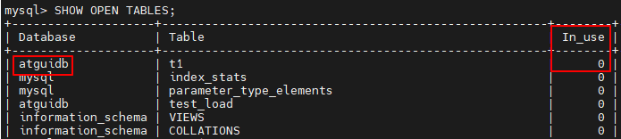

上面的结果表明，当前数据库中没有被锁定的表

步骤3：手动增加表锁命令

```mysql
LOCK TABLES t READ; # 存储引擎会对表t加表级别的共享锁。共享锁也叫读锁或S锁（Share的缩写）
LOCK TABLES t WRITE; # 存储引擎会对表t加表级别的排他锁。排他锁也叫独占锁、写锁或X锁（exclusive的缩写）
```

比如：对表mylock加表读锁

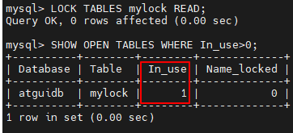

步骤4：释放表锁

```mysql
UNLOCK TABLES; # 使用此命令解锁当前加锁的表，不需要指定表名
```

比如：

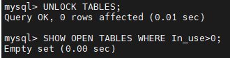

步骤5：加读锁

我们为mylock表加read锁（读阻塞写），观察阻塞的情况，流程如下：

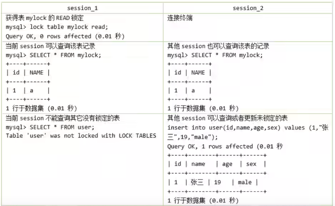


步骤6：加写锁

为mylock表加write锁，观察阻塞的情况，流程如下：

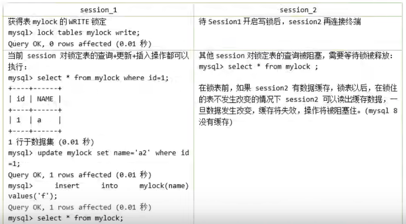

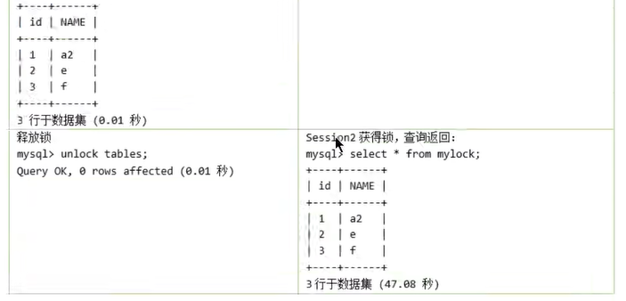

总结：

MyISAM在执行查询语句（SELECT）前，会给涉及的所有表加读锁，在执行增删改操作前，会给涉及的表加写锁。InnoDB存储引擎是不会为这个表添加表级别的读锁和写锁的。

MySQL的表级锁有两种模式：（以MyISAM表进行操作的演示）

* 表共享读锁（Table Read Lock）
* 表独占写锁（Table Write Lock）

| 锁类型 | 自己可读 | 自己可写 | 自己可操作其他表 | 他人可读 | 他人可写 |
| :----: | :------: | :------: | :--------------: | :------: | :------: |
|  读锁  |    是    |    否    |        否        |    是    |  否，等  |
|  写锁  |    是    |    是    |        否        |  否，等  |  否，等  |

##### ② 意向锁 （intention lock）

InnoDB 支持 <font color=orange>**多粒度锁**</font>（multiple granularity locking） ，它<font color=orange>**允许行级锁 与 表级锁 共存**</font>，而<font color=orange>**意向锁**</font>就是其中的一种 `表锁` 。

1. <font color=red>**意向锁的存在是为了协调行锁和表锁的关系，支持多粒度（表锁和行锁）的锁并存**</font>。
2. 意向锁是一种`不与行级锁冲突表级锁`，这一点非常重要。
3. 表明“某个事务正在某些行持有了锁或该事务准备去持有锁”

意向锁分为两种：

* **<font color=orange>意向共享锁</font>**（intention shared lock, IS）：事务有意向对表中的某些行加**<font color=orange>共享锁</font>**（S锁）

  ```mysql
  -- 事务要获取某些行的 S 锁，必须先获得表的 IS 锁。
  SELECT column FROM table ... LOCK IN SHARE MODE;
  ```

* **<font color=orange>意向排他锁</font>**（intention exclusive lock, IX）：事务有意向对表中的某些行加**<font color=orange>排他锁</font>**（X锁）

  ```mysql
  -- 事务要获取某些行的 X 锁，必须先获得表的 IX 锁。
  SELECT column FROM table ... FOR UPDATE;
  ```

即：意向锁是由存储引擎 <font color=orange>**自己维护 ，用户无法手动操作意向锁**</font>，在为数据行加共享 / 排他锁之前， InooDB 会先获取该数据行 <font color=orange>**所在数据表的对应意向锁**</font> 。

**1. 意向锁要解决的问题**

现在有事务T1和T2，其中T2试图在该表级别上应用共享或排它锁，如果没有意向锁存在，那么T2就需要去检查各个页或行是否存在锁；如果存在意向锁，那么此时就会受到由T1控制的表级别意向锁地阻塞。T2在锁定该表前不必检查各个页或行锁，只需检查表上的意向锁。简单来说就是给更大一级别的空间示意里面是否上过锁。

在数据表的场景中，<font color=orange>**如果给某一行数据加上了排它锁，数据库会自动给更大一级的空间，比如数据页或数据表加上意向锁，告诉其他人这个数据页或数据表已经有人上过排它锁了**</font>，这样当其他人想要获取数据表排它锁时，只需要了解是否有人已经获取了这个数据表的意向排他锁即可。 

- 如果事务想要获得数据表中某些记录的共享锁，就需要在数据表上<font color=orange>**添加意向共享锁**</font>。
- 如果事务想要获得数据表中某些记录的排他锁，就需要在数据表上<font color=orange>**添加意向排他锁**</font>。

这时，意向锁会告诉其他事务已经有人锁定了表中的某些记录。


**举例：**创建表teacher,插入6条数据，事务的隔离级别默认为`Repeatable-Read`，如下所示。

```mysql
CREATE TABLE `teacher` (
	`id` int NOT NULL,
    `name` varchar(255) NOT NULL,
    PRIMARY KEY (`id`)
)ENGINE=InnoDB DEFAULT CHARSET=utf8mb4 COLLATE=utf8mb4_0900_ai_ci;

INSERT INTO `teacher` VALUES
('1', 'zhangsan'),
('2', 'lisi'),
('3', 'wangwu'),
('4', 'zhaoliu'),
('5', 'songhongkang'),
('6', 'leifengyang');
```

```mysql
mysql> SELECT @@transaction_isolation;
+-------------------------+
| @@transaction_isolation |
+-------------------------+
| REPEATABLE-READ         |
+-------------------------+
```

假设事务A获取了某一行的排他锁，并未提交，语句如下所示:

```mysql
BEGIN;
SELECT * FROM teacher WHERE id = 6 FOR UPDATE; #手动对该条记录加X锁（行级别），会自动加上表级别的IX锁
```

事务B想要获取teacher表的表读锁，语句如下：

```mysql
BEGIN;
LOCK TABLES teacher READ;
```

因为共享锁与排他锁互斥，所以事务B在试图对teacher表加共享锁时，必须保证：

(1)当前没有其他事务持有teacher表的排他锁 

 (2)当前没有其他事务持有teacher表中任意一行的排他锁。

为了检测是否满足第二个条件，事务B必须在确保teacher表不存在任何排他锁的前提下，去检测表中的每一行是否存在排他锁。很明显这是一个效率很差的做法，但是有了意向锁之后，情况就不一样了。

意向锁是怎么解决这个问题的呢？首先，我们需要知道意向锁之间的兼容互斥性，如下所示。

|                  | 意向共享锁（IS） | 意向排他锁（IX） |
| :--------------: | :--------------: | :--------------: |
| 意向共享锁（IS） |       兼容       |       兼容       |
| 意向排他锁（IX） |       兼容       |       兼容       |

即<font color=red>**意向锁之间是互相兼容**</font>的，虽然意向锁和自家兄弟互相兼容，但是它会与普通的排他/共享锁互斥。

|             | 意向共享锁（IS） | 意向排他锁（IX） |
| :---------: | :--------------: | :--------------: |
| 共享锁（S） |       兼容       |       互斥       |
| 排他锁（X） |       互斥       |       互斥       |

注意这里的排他/共享锁指的都是表锁，意向锁不会与行级的共享/排他锁互斥。回到刚才teacher表的例子， 事务A获取了某一行的排他锁，并未提交：

```mysql
BEGIN;
SELECT * FROM teacher WHERE id = 6 FOR UPDATE;
```

此时teacher表存在两把锁：teacher表上的意向排他锁与id未6的数据行上的排他锁。事务B想要获取teacher表的共享锁。

```mysql
BEGIN;
LOCK TABLES teacher READ;
```

此时事务B检测事务A持有teacher表的意向排他锁，就可以得知事务A必须持有该表中某些数据行的排他锁，那么事务B对teacher表的加锁请求就会被排斥（阻塞），而无需去检测表中的每一行数据是否存在排他锁。

**意向锁的并发性**

意向锁不会与行级的共享 / 排他锁互斥！正因为如此，意向锁并不会影响到多个事务对不同数据行加排他锁时的并发性。（不然我们直接用普通的表锁就行了）

我们扩展一下上面 teacher表的例子来概括一下意向锁的作用（一条数据从被锁定到被释放的过程中，可 能存在多种不同锁，但是这里我们只着重表现意向锁）。

事务A先获得了某一行的排他锁，并未提交：

```mysql
BEGIN;
SELECT * FROM teacher WHERE id = 6 FOR UPDATE;
```

事务A获取了teacher表上的意向排他锁。事务A获取了id为6的数据行上的排他锁。之后事务B想要获取teacher表上的共享锁。

```mysql
BEGIN;
LOCK TABLES teacher READ;
```

事务B检测到事务A持有teacher表的意向排他锁。事务B对teacher表的加锁请求被阻塞（排斥）。最后事务C也想获取teacher表中某一行的排他锁。

````mysql
BEGIN;
SELECT * FROM teacher WHERE id = 5 FOR UPDATE; #不会阻塞
````

事务C申请teacher表的意向排他锁。事务C检测到事务A持有teacher表的意向排他锁。因为意向锁之间<font color=orange>**并不互斥**</font>，所以事务C获取到了teacher表的意向排他锁。因为id为5的数据行上不存在任何排他锁，最终事务C成功获取到了该数据行上的排他锁。

**从上面的案例可以得到如下结论：**

1. InnoDB 支持 `多粒度锁` ，特定场景下，行级锁可以与表级锁共存。 
2. 意向锁之间互不排斥，但除了 IS 与 S 兼容外， **<font color=orange>意向锁会与 共享锁 / 排他锁 互斥</font>**。 
3. IX，IS是表级锁，不会和行级的X，S锁发生冲突。只会和表级的X，S发生冲突。 
4. 意向锁在保证并发性的前提下，实现了 <font color=orange>**行锁和表锁共存**</font> 且 **<font color=orange>满足事务隔离性</font>**的要求。

##### ③ 自增锁（AUTO-INC锁）

应用场景：<font color=red>**设置主键自增，在并发场景下如何保证多个事务同时操作时主键的全局唯一性？**</font>

在使用MySQL过程中，我们可以为表的某个列添加 `AUTO_INCREMENT` 属性。举例：

```mysql
CREATE TABLE `teacher` (
`id` int NOT NULL AUTO_INCREMENT,
`name` varchar(255) NOT NULL,
PRIMARY KEY (`id`)
) ENGINE=InnoDB DEFAULT CHARSET=utf8mb4 COLLATE=utf8mb4_0900_ai_ci;
```

由于这个表的id字段声明了AUTO_INCREMENT，意味着在书写插入语句时不需要为其赋值，SQL语句修改 如下所示。

```mysql
INSERT INTO `teacher` (name) VALUES ('zhangsan'), ('lisi');
```

上边的插入语句并没有为id列显式赋值，所以系统会自动为它赋上递增的值，结果如下所示。

```mysql
mysql> select * from teacher;
+----+----------+
| id | name     |
+----+----------+
| 1  | zhangsan |
| 2  | lisi     |
+----+----------+
2 rows in set (0.00 sec)
```

现在我们看到的上面插入数据只是一种简单的插入模式，所有插入数据的方式总共分为三类，分别是 “ `Simple inserts` ”，“ `Bulk inserts` ”和“ `Mixed-mode inserts `”。

**1. “Simple inserts” （简单插入）**

可以 **<font color=orange>预先确定要插入的行数</font>** （当语句被初始处理时）的语句。包括没有嵌套子查询的单行和多行` INSERT...VALUES() `和 `REPLACE` 语句。比如我们上面举的例子就属于该类插入，已经确定要插入的行数。

**2. “Bulk inserts” （批量插入）**

<font color=orange>**事先不知道要插入的行数**</font>（和所需自动递增值的数量）的语句。比如 `INSERT ... SELECT` ， `REPLACE ... SELECT` 和 `LOAD DATA` 语句，但不包括纯INSERT。 InnoDB在每处理一行，为AUTO_INCREMENT列

**3. “Mixed-mode inserts” （混合模式插入）**

这些是“Simple inserts”语句但是<font color=orange>**指定部分新行的自动递增值**</font>。例如 `INSERT INTO teacher (id,name) VALUES (1,'a'), (NULL,'b'), (5,'c'), (NULL,'d');` 只是指定了部分id的值。另一种类型的“混合模式插入”是 `INSERT ... ON DUPLICATE KEY UPDATE` 。


对于上面数据插入的案例，MySQL中采用了<font color=orange>**自增锁**</font>的方式来实现，<font color=red>**AUTO-INC锁是当向使用含有AUTO_INCREMENT 列的表中插入数医时需要获取的一种特殊的表级锁**</font>，在执行插入语句时就在表级别加—AUTO-INC锁，然后为每条待插入记录的AUTO_INCREMENT修饰的列分配递增的值，在该语句执行结束后，再把AUTO-INC锁释放掉。<font color=red>**一个事务在持有AUTO-INC锁的过程中，其他事务的插入语句都要被阻塞**</font>，可以保证一个语句中分配的递增值是连续的。也正因为此，其并发性不高，<font color=red>**当向一个有AUTO_INCREMENT关键字的主键插入值时，每条语句都要对这个表锁进行竞争**</font>，这样的并发潜力是很低下的，所以innodb通<font color=orange>**innodb_autoinc_lock_mode**</font> 的不同取值来提供不同的锁定机制，以显著提高SQL语句的可伸缩性和性能。

innodb_autoinc_lock_mode有三种取值，分别对应与不同锁定模式：

**<font color=orange>（1）innodb_autoinc_lock_mode = 0(“传统”锁定模式)</font>**

在此锁定模式下，所有类型的insert语句都会获得一个特殊的表级AUTO-INC锁，用于插入具有 AUTO_INCREMENT列的表。这种模式其实就如我们上面的例子，即每当执行insert的时候，都会得到一个 表级锁(AUTO-INC锁)，使得语句中生成的auto_increment为顺序，且在binlog中重放的时候，可以保证 master与slave中数据的auto_increment是相同的。因为是表级锁，当在同一时间多个事务中执行insert的 时候，对于AUTO-INC锁的争夺会 `限制并发` 能力。

**<font color=orange>（2）innodb_autoinc_lock_mode = 1(“连续”锁定模式)</font>**

在 MySQL 8.0 之前，连续锁定模式是 **<font color=orange>默认</font>** 的。

在这个模式下，“bulk inserts”仍然使用AUTO-INC表级锁，并保持到语句结束。这适用于所有INSERT ... SELECT，REPLACE ... SELECT和LOAD DATA语句。同一时刻只有一个语句可以持有AUTO-INC锁。

对于“Simple inserts”（要插入的行数事先已知），则通过在 <font color=orange>**mutex（轻量锁）**</font> 的控制下获得所需数量的自动递增值来避免表级AUTO-INC锁， 它只在分配过程的持续时间内保持，而不是直到语句完成。不使用表级AUTO-INC锁，除非AUTO-INC锁由另一个事务保持。如果另一个事务保持AUTO-INC锁，则“Simple inserts”等待AUTO-INC锁，如同它是一个“bulk inserts”。

**<font color=orange>（3）innodb_autoinc_lock_mode = 2(“交错”锁定模式)</font>**

从 MySQL 8.0 开始，交错锁模式是 `默认` 设置。

在此锁定模式下，自动递增值 `保证` 在所有并发执行的所有类型的insert语句中是 <font color=orange>**唯一**</font>且 <font color=orange>**单调递增**</font>的。但是，由于多个语句可以同时生成数字（即，跨语句交叉编号），**<font color=orange>为任何给定语句插入的行生成的值可能不是连续的</font>。**

如果执行的语句是“simple inserts"，其中要插入的行数已提前知道，除了"Mixed-mode inserts"之外，为单个语句生成的数字不会有间隙。然后，当执行"bulk inserts"时，在由任何给定语句分配的自动递增值中可能存在间隙。

##### ④ 元数据锁（MDL锁）

MySQL5.5引入了meta data lock，简称MDL锁，属于表锁范畴。MDL 的作用是，保证读写的正确性。比 如，如果一个查询正在遍历一个表中的数据，而执行期间另一个线程对这个 <font color=orange>**表结构做变更（应用场景）**</font> ，增加了一 列，那么查询线程拿到的结果跟表结构对不上，肯定是不行的。

因此，**<font color=orange>当对一个表做增删改查操作的时候，加 MDL读锁；当要对表做结构变更操作的时候，加 MDL 写锁</font>**。

读锁之间不互斥，因此你可以有多个线程同时对一张表增删查改。读写锁之间、写锁之间都是互斥的，用来保证变更表结构操作的安全性，解决了DML和DDL操作之间的一致性问题。<font color=orange>**不需要显式使用**</font>，在访问一个表的时候会被自动加上。

**举例：元数据锁的使用场景模拟**

**会话A：**从表中查询数据

```mysql
mysql> BEGIN;
Query OK, 0 rows affected (0.00 sec)
mysql> SELECT COUNT(1) FROM t1;
+----------+
| COUNT(1) |
+----------+
| 2        |
+----------+
1 row int set (7.46 sec)
```

**会话B：**修改表结构，增加新列

```mysql
mysql> BEGIN;
Query OK, 0 rows affected (0.00 sec)
mysql> alter table t1 add c4 int not null;  #阻塞
```

**会话C：**查看当前MySQL的进程

```mysql
mysql> show processlist;
```

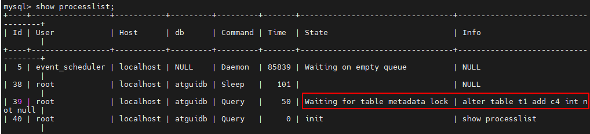

通过会话C可以看出会话B被阻塞，这是由于会话A拿到了t1表的元数据读锁，会话B想申请t1表的元数据写锁，由于读写锁互斥，会话B需要等待会话A释放元数据锁才能执行。

<font color=orange>**元数据锁可能带来的问题**</font>

| Session A               | Session B                                  | Session C              |
| ----------------------- | ------------------------------------------ | ---------------------- |
| begin;select * from t1; |                                            |                        |
|                         | alter table t1 add c4 int not null;  #阻塞 |                        |
|                         |                                            | select *from t1; #阻塞 |

可以看到session A会对表t1加一MDL读锁，之后session B要加MDL写锁会被blocked, 因为session A的MDL读锁还没有释放，而session C要在表t1上新申请MDL读锁的请求也会被session B阻塞。前面说了，所有对表的增删改查操作都需要先申请MDL读锁，就都被阻塞，等于这个表现在完全不可读写了（**<font color=orange>本来读读可以并发，但由于sessionB的写阻塞带动了session c的阻塞</font>**）。

#### 2. InnoDB中的行锁

行锁（Row Lock）也称为记录锁，顾名思义，就是锁住某一行（某条记录 row）。需要注意的是，MySQL服务器层并没有实现行锁机制，**<font color=orange>行级锁只在存储引擎层实现</font>**。

**优点：**<font color=orange>**锁粒度小**</font>，发生`锁冲突概率低`，可以实现的<font color=orange>**并发度高**</font>。

**缺点：**对于锁的<font color=orange>**开销比较大**</font>，加锁会比较慢，容易出现<font color=orange>**死锁**</font>情况。

InnoDB与MyISAM的最大不同有两点：一是支持事务（TRANSACTION）；二是采用了行级锁。

首先我们创建表如下：

```mysql
CREATE TABLE student (
	id INT,
    name VARCHAR(20),
    class VARCHAR(10),
    PRIMARY KEY (id)
) Engine=InnoDB CHARSET=utf8;
```

向这个表里插入几条记录：

```mysql
INSERT INTO student VALUES
(1, '张三', '一班'),
(3, '李四', '一班'),
(8, '王五', '二班'),
(15, '赵六', '二班'),
(20, '钱七', '三班');

mysql> SELECT * FROM student;
```

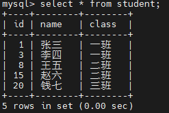

student表中的聚簇索引的简图如下所示。


这里把B+树的索引结构做了超级简化，只把索引中的记录拿了出来，下面看看都有哪些常用的行锁类型。

##### ① 记录锁（Record Locks）

记录锁也就是仅仅把一条记录锁，官方的类型名称为：<font color=orange>**LOCK_REC_NOT_GAP**</font>。比如我们把id值为8的那条记录加一个记录锁的示意图如果所示。仅仅是锁住了id值为8的记录，对周围的数据没有影响。


举例如下：


注意：<font color=red>**表中update student set ...where操作存储引擎会自动加上行锁。**</font>

记录锁是有S锁和X锁之分的，称之为 <font color=orange>**S型记录锁**</font> 和 **<font color=orange>X型记录锁</font>** 。

* 当一个事务获取了一条记录的S型记录锁后，其他事务也可以继续获取该记录的S型记录锁，但不可以继续获取X型记录锁；
* 当一个事务获取了一条记录的X型记录锁后，其他事务既不可以继续获取该记录的S型记录锁，也不可以继续获取X型记录锁。

##### ② 间隙锁（Gap Locks）

<font color=orange>**MySQL 在 REPEATABLE READ隔离级别下是可以解决幻读问题的**</font>，解决方案有两种，可以使用 **<font color=orange>MVCC</font>** 方案解决，也可以采用 <font color=orange>**加锁** </font>方案解决。但是在使用加锁方案解决时有个大问题，就是事务在第一次执行读取操作时，那些<font color=orange>**幻影记录尚不存在**</font>，我们无法给这些 幻影记录加上 `记录锁` 。InnoDB提出了一种称之为 `Gap Locks` 的锁，官方的类型名称为：<font color=orange> **LOCK_GAP**</font> ，我们可以简称为 <font color=orange>**gap锁**</font> 。比如，把id值为8的那条 记录加一个gap锁的示意图如下。

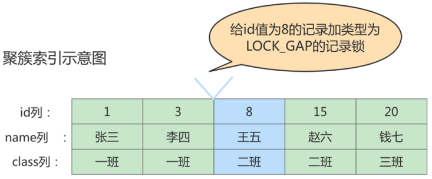

图中id值为8的记录加了gap锁，意味着 <font color=orange>**不允许别的事务在id值为8的记录前边的间隙插入新记录**</font> ，其实就是 id列的值(3, 8)这个区间的新记录是不允许立即插入的。比如，有另外一个事务再想插入一条id值为4的新 记录，它定位到该条新记录的下一条记录的id值为8，而这条记录上又有一个gap锁，所以就会阻塞插入 操作，直到拥有这个gap锁的事务提交了之后，id列的值在区间(3, 8)中的新记录才可以被插入。

**gap锁的提出仅仅是为了防止插入幻影记录而提出的。**虽然有`共享gap锁`和`独占gap锁`这样的说法，但是它们起到的作用是相同的。而且如果对一条记录加了gap锁（不论是共享gap锁还是独占gap锁），并不会限制其他事务对这条记录加记录锁或者继续加gap锁。

**举例：**

| Session1                                             | Session2                                     |
| ---------------------------------------------------- | -------------------------------------------- |
| select * from student where id=5 lock in share mode; |                                              |
|                                                      | select * from student where id=5 for update; |

这里session2并不会被堵住。因为表里并没有id=5这条记录，因此session1加的是间隙锁(3,8)。而session2也是在这个间隙加的间隙锁。它们有共同的目标，即：**<font color=orange>保护这个间隙锁，不允许插入值(此时插入一条id=6的数据会阻塞)</font>**。但它们之间是不冲突的。

注意，给一条记录加了 <font color=orange>**gap锁**</font>只是<font color=orange>**不允许其他事务往这条记录前边的间隙插入新记录**</font>，那对于最后一条记录之后 的间隙，也就是student表中id值为20的记录之后的间隙该咋办呢？也就是说给哪条记录加gap锁才能阻止其他事务插入id值在$(20, +\infty)$这个区间的新记录呢？这时在讲数据页时介绍的两条伪记录派上用场了：

* <font color=orange>**Infimum**</font>记录，表示该页面中最小的记录。
* <font color=orange>**Supremun**</font>记录，表示该页面中最大的记录。

为了实现阻止其他事务插入id值再(20,正无穷)这个区间的新纪录，我们可以给索引中的最后一条记录，也就是id值为20的那条记录所在页面的Supremun记录加上一个gap锁，如图所示。


```mysql
mysql> select * from student where id > 20 lock in share mode;
Empty set (0.01 sec)
```

检测：

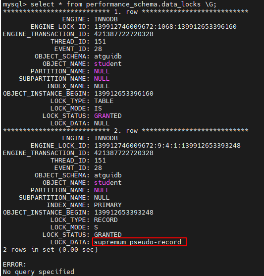

这样就可以阻止其他事务插入id值在$(20, +\infty)$这个区间的新记录。

间隙锁的引入，可能会导致同样的语句锁住更大的范围，这其实是影响了并发度的。下面的例子会产生<font color=orange>**死锁**</font>：

| Session1                                                     | Session2                                                  |
| ------------------------------------------------------------ | --------------------------------------------------------- |
| begin;<br/>select * from student where id = 5 for update;    | begin;<br/>select * from student where id = 5 for update; |
|                                                              | INSERT INTO student VALUES (5,'宋红康','二班'); #阻塞     |
| INSERT INTO student VALUES (5,'宋红康','二班'); <br/>(ERROR 1213 (40001): Deadlock found when trying to get lock; try restarting transaction) |                                                           |

⑴ Session1执行select…for update语句，由于id = 5这一行并不存在，因此会加上间隙锁(3, 8)；

(2) Session 2执行select…for update语句，同样会加上间隙锁(3, 8)，<font color=orange>**间隙锁之间不会冲突**</font>，因此这个语句可以执行成功； 

(3) session 2试图插入一行 (5,'宋红康','二班') 被session 1的间隙锁挡住了，只好进入等待；

 ⑷session 1试图插入一行 (5,'宋红康','二班')  ，被session 2的间隙锁挡住了。至此，两个session进入互相等待状态，形成<font color=orange>**死锁**</font>。当然，InnoDB的死锁检测马上就发现了这对死锁关系，让session 1的insert语句报错返回。

##### ③ 临键锁（Next-Key Locks）

有时既想 <font color=orange>**锁住某条记录**</font> ，又想阻止 其他事务在该记录前边的 **<font color=orange>间隙插入新记录</font>** ，所以InnoDB就提出了一种称之为 <font color=orange>**Next-Key Locks** </font>的锁，官方的类型名称为： <font color=orange>**LOCK_ORDINARY**</font> ，也可以简称为 next-key锁 。Next-Key Locks是在存储引擎 innodb 、事务级别在 <font color=orange>**可重复读**</font> 的情况下使用的数据库锁， <font color=orange>**innodb默认的锁就是Next-Key locks**</font>。比如，我们把id值为8的那条记录加一个next-key锁的示意图如下：


`next-key锁`的本质就是<font color=orange>**一个记录锁和一个gap锁的合体**</font>，它既能保护该条记录，又能阻止别的事务将新记录插入被保护记录前边的`间隙`。

```mysql
begin;临键锁
select * from student where id <=8 and id > 3 for update;  #加临键锁
```

##### ④ 插入意向锁(Insert Intention Locks)

<font color=orange>**插入意向锁**</font>是在插入一条记录行前，由<font color=orange>**INSERT操作产生的一种间隙锁**</font>。该锁用以表示插入意向，当多个事务在同一区间（gap）插入位置不同的多条数据时，事务之间不需要互相等待。假设存在两条值分别为4和7的记录，两个不同的事务分别试图插入值为5和6的两条记录，每个事务在获取插入行上独占的（排他）锁前都会获取（4, 7）之间的间隙锁，但是因为数据行之间并<font color=orange>**不冲突**</font>，所以两个事务之间并不会产生冲突（阻塞等待）。 总结来说，插入意向锁的特性可以分成两部分：

（1）插入意向锁是一种<font color=orange>**特殊的间隙锁**</font> -- 间隙锁可以锁定开区间内的部分记录。 

（2）插入意向锁之间<font color=orange>**互不排斥**</font>，所以即使多个事务在同一区间插入多条记录，只要记录本身（主键、唯一索引）不冲突，那么事务之间就不会出现冲突等待。

注意，虽然插入意向锁中含有意向锁三个字，但并<font color=orange>**不属于意向锁而属于间隙锁**</font>，因为意向锁是表锁而插入意向锁是<font color=orange>**行锁**</font>。

比如，把id为8的那条记录加一个插入意向锁的示意图如下：

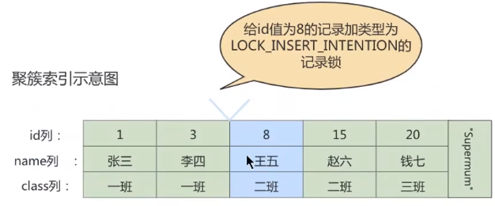

比如，现在T1为id值为8的记录加了一个gap锁，然后T2和T3分别想向student表中插入id值分别为4、5的两条记 录，所以现在为id值为8的记录加的锁的示意图如下所示：

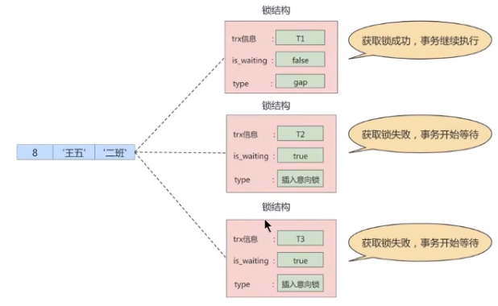

从图中可以看到，由于T1持有gap锁，所以T2和T3需要生成一个插入意向锁的锁结构并且处于等待状态。当T1提 交后会把它获取到的锁都释放掉，这样T2和T3就能获取到对应的插入意向锁了（本质上就是把插入意向锁对应锁 结构的is_waiting属性改为false） , T2和T3之间并不会相互阻塞，它们可以同时获取到id值为8的插入意向锁， 然后执行插入操作。事实上<font color=orange>**插入意向锁并不会阻止别的事务继续获取该记录上任何类型的锁**</font>。

#### 3. 页锁

页锁就是在 `页的粒度` 上进行锁定，锁定的数据资源比行锁要多，因为一个页中可以有多个行记录。当我 们使用页锁的时候，会出现数据浪费的现象，但这样的浪费最多也就是一个页上的数据行。**<font color=orange>页锁的开销介于表锁和行锁之间，会出现死锁。锁定粒度介于表锁和行锁之间，并发度一般</font>。**

每个层级的锁数量是有限制的，因为锁会占用内存空间， <font color=orange>**锁空间的大小是有限的**</font> 。当某个层级的锁数量 超过了这个层级的阈值时，就会进行 <font color=red>**锁升级**</font> 。锁升级就是<font color=orange>**用更大粒度的锁替代多个更小粒度的锁**</font>，比如 InnoDB 中行锁升级为表锁，这样做的好处是占用的锁空间降低了，但同时数据的并发度也下降了。

### 3.3 从对待锁的态度划分:乐观锁、悲观锁

从对待锁的态度来看锁的话，可以将锁分成乐观锁和悲观锁，从名字中也可以看出这两种锁是两种看待 `数据并发的思维方式` 。需要注意的是，乐观锁和悲观锁<font color=orange>**并不是锁**</font>，而是锁的 <font color=orange>**设计思想**</font>。

#### 1. 悲观锁（Pessimistic Locking）

悲观锁是一种思想，顾名思义，就是很悲观，对数据被其他事务的修改持保守态度，会通过数据库自身的锁机制来实现，从而保证数据操作的排它性。

悲观锁总是假设最坏的情况，每次去拿数据的时候都认为别人会修改，所以每次在拿数据的时候都会上锁，这样别人想拿这个数据就会 <font color=orange>**阻塞**</font> 直到它拿到锁（**<font color=orange>共享资源每次只给一个线程使用，其它线程阻塞， 用完后再把资源转让给其它线程</font>**）。比如行锁，表锁等，读锁，写锁等，都是在做操作之前先上锁，当其他线程想要访问数据时，都需要阻塞挂起。Java中 `synchronized` 和 `ReentrantLock` 等独占锁就是悲观锁思想的实现。

**<font color=orange>秒杀案例1</font>：**

商品秒杀过程中，库存数量的减少，避免出现<font color=orange>**超卖**</font>情况。比如，商品表中有一个字段为quantity表示当前该商品的库存量。假设商品为华为mate40, id为1001, quantity=100个。如果不使用锁的情况下，操作方法如下所示：

```mysql
# 第1步:查出商品库存
select quantity from items where id = 1001;
# 第2步:如果库存大于0 则根据商品信息生产订单
insert into orders (item_id) values(1001);
# 第3步：修改商品的库存. num衣示购买数量
update items set quantity = quantity-num where id=1001;
```

这样写在并发量小的公司没有太大问题，但是在<font color=orange>**高并发环境**</font>下可能出现以下问题：

|      | 线程A                      | 线程B                      |
| ---- | -------------------------- | -------------------------- |
| 1    | step1（查询还有100部手机） | step1（查询还有100部手机） |
| 2    |                            | step2 （生成订单）         |
| 3    | step2 （生成订单）         |                            |
| 4    |                            | step3 (减库存1)            |
| 5    | step3 (减库存2)            |                            |

其中线程B此时已经下单并且减完库存，这时线程A依然去执行step3，就造成了超卖。 

使用悲观锁可以解决这个问题，商品信息从查询出来到修改，中间有一个生成订单的过程，使用悲观锁的原理就是，当在直询items信息后就把当前的数据锁定，直到修改完毕后再解锁。整个过程中，因为数据被锁定了，就不会出现第三者来对其进行修改。而这样做的前提是<font color=orange>**需要将要执行的SQL语句放在同一个事务中，否则达不到锁定数据行的目的**</font>。

修改如下：

```mysql
# 第1步：查出商品库存
select quantity from items where id = 1001 for update; #加行级X锁
# 第2步：如果库存大于0 则根据商品信息生产订单
insert into orders (item_id) values (1001);
# 第3步:修改商品的库存. num表示购买数量
update items set quantity = quantity-num where id=1001;
```

<font color=orange>**select .... for update**</font>是MySQL中<font color=orange>**悲观锁**</font>。此时在items表中，id为1001的那条数据就被锁定了，其他的要执行select quantity from items where id = 1001 for update;语句的事务必须等本次事务提交之后才能执行。这样可以保证当前的数据不会被其它事务修改。

注意，当执行select quantity from items where id = 1001 for update;语句之后，如果在其他事务中执行select quantity from items where id = 1001;语句，并不会受第一个事务的影响，仍然可以正常直询出数据。 

注意：<font color=orange>**select L..for update语句执行过程中所有扫描的行都会被锁上，因此在MySQL中用悲观锁必须确定使用了 索引，而不是全表扫描，否则将会把整个表锁住**</font>。 

悲观锁不适用的场景较多，它存在一些不足，因为悲观锁大多数情况下依靠数据库的锁机制来实现，以保证程序 的并发访问性，同时这样对数据库性能开销影响也很大，特别是<font color=orange>**长事务**</font>而言，这样的<font color=orange>**开销往往无法承受**</font>，这时就需要乐观锁。

#### 2. 乐观锁（Optimistic Locking）

乐观锁认为对同一数据的并发操作不会总发生，属于小概率事件，不用每次都对数据上锁，但是在更新的时候会判断一下在此期间别人有没有去更新这个数据，也就是**<font color=red>不采用数据库自身的锁机制，而是通过程序来实现</font>**。在程序上，我们可以采用 <font color=orange>**版本号机制**</font>或者  <font color=orange>**CAS机制**</font>实现。**乐观锁适用于多读的应用类型， 这样可以提高吞吐量**。在Java中` java.util.concurrent.atomic` 包下的原子变量类就是使用了乐观锁的一种实现方式：CAS实现的。

**1. 乐观锁的版本号机制**

在表中设计一个  <font color=orange>**版本字段 version**</font>，第一次读的时候，会获取 version 字段的取值。然后对数据进行更新或删除操作时，会执行 `UPDATE ... SET version=version+1 WHERE version=version` 。此时  <font color=orange>**如果已经有事务对这条数据进行了更改，修改就不会成功**</font>。

这种方式类似我们熟悉的SVN、CVS版本管理系统，当我们修改了代码进行提交时，首先会检查当前版本号与服务器上的版本号是否一致，如果一致就可以直接提交，如果不一致就需要更新服务器上的最新代码，然后再进行提交。

**2. 乐观锁的时间戳机制**

时间戳和版本号机制一样，也是在更新提交的时候，将当前数据的时间戳和更新之前取得的时间戳进行 比较，如果两者一致则更新成功，否则就是版本冲突。

你能看到乐观锁就是程序员自己控制数据并发操作的权限，基本是通过给数据行增加一个戳（版本号或 者时间戳），从而证明当前拿到的数据是否最新。

**<font color=orange>秒杀案例2</font>**

依然使用上面秒杀的案例，执行流程如下

```mysql
# 第1步：查出商品库存
select quantity from items where id = 1001;
# 第2步：如果库存大于0 则根据商品信息生产订单
insert into orders (item_id) values (1001);
# 第3步:修改商品的库存. num表示购买数量
update items set quantity = quantity-num,version = version+1 where id = 1001 and version = #{version};  # 如果别的事务改了version会变，导致修改失败
```

注意，如果数据表是<font color=orange>**读写分离**</font>的表，当matser表中写入的数据没及时同步到slave表中时，会造成更新一直失败的问题。此时需要<font color=orange>**强制读取master表**</font>中的数据（将select语句放到事务中即可，这时查询的就是master主库) 。

如果对同一条数据进行<font color=orange>**频繁修改**</font>，就会出现如下场景：每次修改都只有一个事务能更新成功，在业务感知上面就有大量的失败操作。我们把代码修改如下:

```mysql
# 第1步：查出商品库存
select quantity from items where id = 1001;
# 第2步：如果库存大于0 则根据商品信息生产订单
insert into orders (item_id) values (1001);
# 第3步:修改商品的库存. num表示购买数量
update items set quantity = quantity-num where id = 1001 and quantity-num>0;
```

这样就会使每次修改都能成功，而且不会出现超卖现象。

#### 3. 两种锁的适用场景

从这两种锁的设计思想中，我们总结一下乐观锁和悲观锁的适用场景：

1.  <font color=orange>**乐观锁**</font> 适合  <font color=orange>**读操作多**</font> 的场景，相对来说写的操作比较少。它的优点在于  **<font color=orange>程序实现</font>** ， `不存在死锁` 问题，不过适用场景也会相对乐观，因为它阻止不了除了程序以外的数据库操作。
2.  <font color=orange>**悲观锁**</font> 适合  <font color=orange>**写操作多**</font> 的场景，因为写的操作具有 `排它性` 。采用悲观锁的方式，可以在数据库层 面阻止其他事务对该数据的操作权限，防止 `读 - 写` 和 `写 - 写` 的冲突。


### 3.4 按加锁的方式划分：显式锁、隐式锁

#### 1. 隐式锁

一个事务在执行<font color=orange>**INSERT**</font>操作时，如果即将插入的<font color=orange>**间隙**</font>已被其他事务加了 <font color=orange>**gap锁**</font>，那么本次INSERT操作会阻塞，并且当前事务会在该间隙上加一个<font color=orange>**插入意向锁**</font>，否则一般情况下INSERT操作是不加锁的。那如果一个事务首先插入了一条记录（此时并没有在内存生产与该记录关联的锁结构），然后另一个事务： 

- 立即使用<font color=orange>**SELECT ... LOCK IN SHARE MODE**</font>语句读取该记录，也就是要衣取这条记录的<font color=orange>**S锁**</font>，或者使用 **<font color=orange>SELECT ... FOR UPDATE</font>**语句读取这条记录，也就是要获取这条记录的<font color=orange>**X锁**</font>，怎么办？ 

  如果允许这种情况的发生，那么可能产生<font color=orange>**脏读**</font>问题。

- 立即修改这条记录，也就是要获取这条记录的<font color=orange>**X锁**</font>，怎么办？ 

  如果允许这种情况的发生，那么可能产生<font color=orange>**脏写**</font>问题。

这时候前边提过的<font color=orange>**事务id**</font>又要起作用了，把聚簇索引和二级索引中的记录分开看一下：

* **情景一**：对于聚簇索引记录来说，有一个 `trx_id` 隐藏列，该隐藏列记录着最后改动该记录的 `事务 id` 。那么如果在当前事务中新插入一条聚簇索引记录后，该记录的 trx_id 隐藏列代表的的就是 当前事务的 事务id ，如果其他事务此时想对该记录添加 S锁 或者 X锁 时，首先会看一下该记录的 trx_id 隐藏列代表的事务是否是当前的活跃事务，如果是的话，那么就帮助当前事务创建一个 X 锁 （也就是为当前事务创建一个锁结构， is_waiting 属性是 false ），然后自己进入等待状态 （也就是为自己也创建一个锁结构， is_waiting 属性是 true ）。
* **情景二**：对于二级索引记录来说，本身并没有 trx_id 隐藏列，但是在二级索引页面的 Page Header 部分有一个 `PAGE_MAX_TRX_ID` 属性，该属性代表对该页面做改动的最大的 `事务id` ，如 果 PAGE_MAX_TRX_ID 属性值小于当前最小的活跃 事务id ，那么说明对该页面做修改的事务都已 经提交了，否则就需要在页面中定位到对应的二级索引记录，然后回表找到它对应的聚簇索引记 录，然后再重复 情景一 的做法。

即：一事务对新插入的记录可以不显式的加锁（生成一个锁结构），但由于<font color=orange>**事务id**</font>的存在，相当于加了一 个<font color=orange>**隐式锁**</font>。别的事务在对这条记录加<font color=orange>**S锁或X锁**</font>时，由于隐式锁的存在，会先帮助当前事务生成一个锁结构， 然后自己再生成一个锁结构后进入等待状态。隐式锁是一种<font color=orange>**延迟加锁**</font>机制，以减少加锁数量。 

隐式锁在实际内存对象中并不含有这个锁信息，只有当产生锁等待时，隐式微转化为显式锁。

InnoDB的insert操作，对插入的记录不加锁，但此时如果另一个线程进行当前读，类似以下的用例，session 2 会锁等待session 1，这是如何实现的呢？

**session 1:**

```mysql
mysql> begin;
Query OK, 0 rows affected (0.00 sec)
mysql> insert INTO student VALUES(34,"周八","二班");
Query OK, 1 row affected (0.00 sec)
```

**session 2:**

```mysql
mysql> begin;
Query OK, 0 rows affected (0.00 sec)
mysql> select * from student lock in share mode; #执行完，当前事务被阻塞
```

执行下述语句，输出结果：

```mysql
mysql> SELECT * FROM performance_schema.data_lock_waits\G;
*************************** 1. row ***************************
						ENGINE: INNODB
		REQUESTING_ENGINE_LOCK_ID: 140562531358232:7:4:9:140562535668584
REQUESTING_ENGINE_TRANSACTION_ID: 422037508068888
			REQUESTING_THREAD_ID: 64
			REQUESTING_EVENT_ID: 6
REQUESTING_OBJECT_INSTANCE_BEGIN: 140562535668584
		BLOCKING_ENGINE_LOCK_ID: 140562531351768:7:4:9:140562535619104
BLOCKING_ENGINE_TRANSACTION_ID: 15902
			BLOCKING_THREAD_ID: 64
			BLOCKING_EVENT_ID: 6
BLOCKING_OBJECT_INSTANCE_BEGIN: 140562535619104
1 row in set (0.00 sec)
```

隐式锁的逻辑过程如下：

A. InnoDB的每条记录中都一个隐含的trx_id字段，这个字段存在于聚簇索引的B+Tree中。 

B. 在操作一条记录前，首先根据记录中的trx_id检查该事务是否是活动的事务(未提交或回滚)。如果是活动的事务，首先将 `隐式锁` 转换为 `显式锁` (就是为该事务添加一个锁)。 

C. 检查是否有锁冲突，如果有冲突，创建锁，并设置为waiting状态。如果没有冲突不加锁，跳到E。 

D. 等待加锁成功，被唤醒，或者超时。 

E. 写数据，并将自己的trx_id写入trx_id字段。

#### 2. 显式锁

通过特定的语句进行加锁，我们一般称之为显示加锁，例如：

显示加共享锁：

```mysql
select .... lock in share mode
```

显示加排它锁：

```mysql
select .... for update
```

### 3.5 其它锁之：全局锁

全局锁就是对  <font color=orange>**整个数据库实例**</font> 加锁。当你需要让整个库处于  <font color=orange>**只读状态**</font> 的时候，可以使用这个命令，之后 其他线程的以下语句会被阻塞：数据更新语句（数据的**<font color=orange>增删改阻塞，读不阻塞</font>**）、数据定义语句（包括建表、修改表结 构等）和更新类事务的提交语句。全局锁的典型使用  <font color=orange>**场景**</font> 是：做  <font color=orange>**全库逻辑备份**</font> 。

全局锁的命令：

```mysql
Flush tables with read lock
UNLOCK TABLES; #释放锁
```

### 3.6 其它锁之：死锁

#### 1. 概念

 <font color=orange>**两个事务都持有对方需要的锁，并且在等待对方释放，并且双方都不会释放自己的锁**。</font>(类比线程，因为事务也是由具体线程来执行)

**举例1：**


**举例2：**

用户A给用户B转账100，再次同时，用户B也给用户A转账100。这个过程，可能导致死锁。

```mysql
#事务1
update account set balance = balance - 100 where name = 'A'; #操作1
update account set balance = balance + 100 where name = 'B'; #操作3
#学务2
update account set balance = balance - 100 where name = 'B'; #操作2
update account set balance = balance + 100 where name = 'A'; #操作4

```

#### 2. 产生死锁的必要条件

1. 两个或者两个以上事务
2. 每个事务都已经持有锁并且申请新的锁
3. 锁资源同时只能被同一个事务持有或者不兼容
4. 事务之间因为持有锁和申请锁导致彼此循环等待

> 死锁的关键在于：两个（或以上）的Session加锁的顺序不一致。

#### 3. 如何处理死锁

**方式1：**等待，直到超时（innodb_lock_wait_timeout=50s)

即当两个事务互相等待时，当一个事务等待时间超过设置的阈值时，就将其<font color=orange>**回滚**</font>，另外事务继续进行。该方法简单有效，在innodb中，参数<font color=orange>**innodb_lock_wait_timeout**</font>用来设置超时时间。

缺点：对于在线服务来说，这个等待时间往往是无法接受的.。

另端此值修改短一些，比如1s， 0.1s是否合适？不合适，容易误伤到普通的锁等待。


**方式2：**使用死锁检测处理死锁程序

方式1检测死锁太过被动，innodb还提供了<font color=orange>**wait-for graph算法**</font>来主动进行死锁检测，每当加锁请求无法立即满足需要并进入等待时，wait-for graph算法都会被触发。

这是一种较为`主动的死锁检测机制`，要求数据库保存`锁的信息链表`和`事务等待链表`两部分信息。

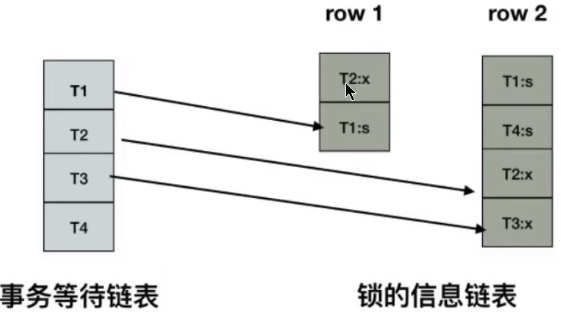

基于这两个信息，可以绘制wait-for graph（等待图）

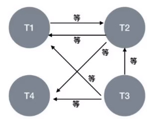

> 死锁检测的原理是构建一个以事务为顶点，锁为边的有向图，判断有向图是否<font color=orange>**存在环**</font>，存在既有死锁。

一旦检测到回路、有死锁，这时候InnoDB存储引擎会选择<font color=orange>**回滚undo量最小的事务**</font>，让其他事务继续执行（<font color=orange>**innodb_deadlock_detect=on**</font>表示开启这个逻辑）。

缺点：每个新的被阻塞的线程，都要判断是不是由于自己的加入导致了死锁，这个操作时间复杂度是O(n)。如果100个并发线程同时更新同一行，意味着要检测100*100=1万次，1万个线程就会有1千万次检测。

**如何解决？**

* 方式1：关闭死锁检测，但意味着可能会出现大量的超时，会导致业务有损。
* 方式2：控制并发访问的数量。比如在中间件中实现对于相同行的更新，在进入引擎之前排队，这样在InnoDB内部就不会有大量的死锁检测工作。

**进一步的思路：**

可以考虑通过将一行改成逻辑上的多行来减少`锁冲突`。比如，连锁超市账户总额的记录，可以考虑放到多条记录上。账户总额等于这多个记录的值的总和。

#### 4. <font color=orange>如何避免死锁</font>

-  合理设计索引，使业务SQL尽可能通过索引定位更少的行，减少锁竞争。
- 调整业务逻辑SQL执行顺序，避免update/delete长时间持有锁的SQL在事务前面。 
- 避免大事务，尽量将大事务拆成多个小事务来处理，小事务缩短锁定资源的时间，发生锁冲突的几率也更小。
- 在并发比较高的系统中，不要显式加锁，特别是在事务里显式加锁。如select…for update语句，如果是在事务里运行了 start transaction或设置了autocommit等于0，那么就会锁定所查找到的记录。 
- 降低隔离级别。如果业务允许，将隔离级别调低也是较好的选择，比如将隔离级别从RR调整为RC，可以避免 掉很多因为gap锁造成的死锁。

## 4. 锁的内部结构

我们前边说对一条记录加锁的本质就是在内存中创建一个<font color=orange>**锁结构**</font>与之关联，那么是不是一个事务对多条记录加锁，就要创建多个`锁结构`呢？比如：

```mysql
# 事务T1
SELECT * FROM user LOCK IN SHARE MODE;
```

理论上创建多个`锁结构`没问题，但是如果一个事务要获取10000条记录的锁，生成10000个锁结构也太崩溃了！所以决定在对不同记录加锁时，如果符合下边这些条件的记录会<font color=orange>**放在一个锁结构**</font>中。

* 在同一个事务中进行加锁操作
* 被加锁的记录在同一个页面中
* 加锁的类型是一样的
* 等待状态是一样的

`InnoDB` 存储引擎中的 `锁结构` 如下：


结构解析：

1. <font color=orange>**锁所在的事务信息**</font> ：

不论是 `表锁` 还是 `行锁` ，都是在事务执行过程中生成的，哪个事务生成了这个锁结构 ，这里就记录这个 事务的信息。

此 `锁所在的事务信息` 在内存结构中只是一个<font color=orange>**指针**</font>，通过指针可以找到内存中关于该事务的更多信息，比方说事务id等。

2. <font color=orange>**索引信息** </font>：

对于 `行锁` 来说，需要记录一下加锁的记录是属于哪个索引的。这里也是一个<font color=orange>**指针**</font>。

3. <font color=orange>**表锁／行锁信息**</font> ：

`表锁结构` 和 `行锁结构` 在这个位置的内容是不同的：

* 表锁：

  记载着是对哪个表加的锁，还有其他的一些信息。

* 行锁：

  记载了三个重要的信息：

  * `Space ID` ：记录所在表空间。
  * `Page Number` ：记录所在页号。
  * `n_bits `：对于行锁来说，<font color=orange>**一条记录就对应着一个比特位**</font>，一个页面中包含很多记录，用不同 的比特位来区分到底是哪一条记录加了锁。为此在行锁结构的末尾放置了一堆比特位，这个` n_bis `属性代表使用了多少比特位。

  > n_bits的值一般都比页面中记录条数多一些。主要是为了之后在页面中插入了新记录后 也不至于重新分配锁结构

4. <font color=orange>**type_mode**</font> ：

这是一个32位的数，被分成了 `lock_mode` 、 `lock_type` 和 `rec_lock_type` 三个部分，如图所示：

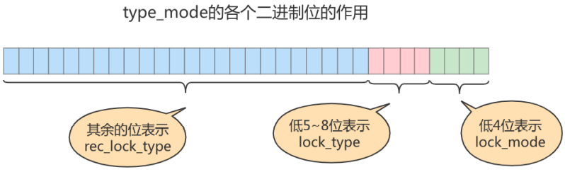

* 锁的模式（ <font color=orange>**lock_mode**</font> ），占用低4位，可选的值如下：
  * `LOCK_IS` （十进制的 0 ）：表示共享意向锁，也就是 `IS锁` 。 
  * `LOCK_IX` （十进制的 1 ）：表示独占意向锁，也就是 `IX锁` 。 
  * `LOCK_S` （十进制的 2 ）：表示共享锁，也就是 `S锁` 。 
  * `LOCK_X` （十进制的 3 ）：表示独占锁，也就是 `X锁` 。 
  * `LOCK_AUTO_INC` （十进制的 4 ）：表示 `AUTO-INC锁` 。

在InnoDB存储引擎中，LOCK_IS，LOCK_IX，LOCK_AUTO_INC都算是表级锁的模式，LOCK_S和 LOCK_X既可以算是表级锁的模式，也可以是行级锁的模式。

* 锁的类型（ **<font color=orange>lock_type</font>** ），占用第5～8位，不过现阶段只有第5位和第6位被使用：
  * `LOCK_TABLE` （十进制的 16 ），也就是当第5个比特位置为1时，表示<font color=orange>**表级锁**</font>。
  * `LOCK_REC `（十进制的 32 ），也就是当第6个比特位置为1时，表示<font color=orange>**行级锁**</font>。
* 行锁的具体类型（ <font color=orange>**rec_lock_type**</font> ），使用其余的位来表示。只有在 `lock_type` 的值为 `LOCK_REC` 时，也就是只有在该锁为行级锁时，才会被细分为更多的类型：
  * `LOCK_ORDINARY` （十进制的 0 ）：表示 `next-key锁` 。
  * `LOCK_GAP` （十进制的 512 ）：也就是当第10个比特位置为1时，表示 `gap锁` 。
  * `LOCK_REC_NOT_GAP` （十进制的 1024 ）：也就是当第11个比特位置为1时，表示正经 `记录锁` 。
  * `LOCK_INSERT_INTENTION` （十进制的 2048 ）：也就是当第12个比特位置为1时，表示插入意向锁。其他的类型：还有一些不常用的类型我们就不多说了。
* <font color=orange>**is_waiting**</font> 属性呢？基于内存空间的节省，所以把 `is_waiting` 属性放到了 `type_mode` 这个32 位的数字中：
  * `LOCK_WAIT` （十进制的 256 ） ：当第9个比特位置为 1 时，表示 `is_waiting` 为 `true` ，也 就是当前事务尚未获取到锁，处在等待状态；当这个比特位为 0 时，表示 `is_waiting` 为 `false` ，也就是当前事务获取锁成功。

`5. 其他信息` ：

为了更好的管理系统运行过程中生成的各种锁结构而设计了各种哈希表和链表。

`6. 一堆比特位` ：

如果是 `行锁结构` 的话，在该结构末尾还放置了一堆比特位，比特位的数量是由上边提到的 `n_bits` 属性 表示的。InnoDB数据页中的每条记录在 `记录头信息` 中都包含一个 `heap_no` 属性，伪记录 `Infimum` 的 `heap_no` 值为 0 ， `Supremum` 的 `heap_no` 值为 1 ，之后每插入一条记录， `heap_no` 值就增1。 锁结 构 最后的一堆比特位就对应着一个页面中的记录，一个比特位映射一个 `heap_no` ，即一个比特位映射 到页内的一条记录。

## 5. 锁监控

关于MySQL锁的监控，我们一般可以通过检查 <font color=orange>**InnoDB_row_lock**</font> 等状态变量来分析系统上的行锁的争夺情况

```mysql
mysql> show status like 'innodb_row_lock%';
+-------------------------------+-------+
| Variable_name                 | Value |
+-------------------------------+-------+
| Innodb_row_lock_current_waits | 0     |
| Innodb_row_lock_time          | 0     |
| Innodb_row_lock_time_avg      | 0     |
| Innodb_row_lock_time_max      | 0     |
| Innodb_row_lock_waits         | 0     |
+-------------------------------+-------+
5 rows in set (0.01 sec)
```

对各个状态量的说明如下：

* Innodb_row_lock_current_waits：当前正在等待锁定的数量； 
* <font color=orange>**Innodb_row_lock_time**</font> ：从系统启动到现在锁定总时间长度；（**等待总时长**） 
* <font color=orange>**Innodb_row_lock_time_avg**</font> ：每次等待所花平均时间；（**等待平均时长**） 
* Innodb_row_lock_time_max：从系统启动到现在等待最常的一次所花的时间； 
* <font color=orange>**Innodb_row_lock_waits**</font> ：系统启动后到现在总共等待的次数；（**等待总次数**）

对于这5个状态变量，比较重要的3个见上面（灰色）。

尤其是当<font color=orange>**等待次数很高**</font>，而且每次等待时长也不小的时候，我们就需要分析系统中为什么会有如此多的等待，然后根据分析结果着手指定<font color=orange>**优化计划**</font>。

**<font color=orange>其他监控方法</font>：**

MySQL把事务和锁的信息记录在了 <font color=orange>**information_schema**</font> 库中，涉及到的三张表分别是 <font color=orange>**INNODB_TRX 、 INNODB_LOCKS 和 INNODB_LOCK_WAITS**</font> 。

`MySQL5.7及之前` ，可以通过information_schema.INNODB_LOCKS查看事务的锁情况，但只能看到阻塞事 务的锁；如果事务并未被阻塞，则在该表中看不到该事务的锁情况。

MySQL8.0删除了information_schema.INNODB_LOCKS，添加了 <font color=orange>**performance_schema.data_locks**</font> ，可以通过performance_schema.data_locks查看事务的锁情况，和MySQL5.7及之前不同， performance_schema.data_locks不但可以看到阻塞该事务的锁，还可以看到该事务所持有的锁。

同时，information_schema.INNODB_LOCK_WAITS也被 **<font color=orange>performance_schema.data_lock_waits</font>** 所代 替。

我们模拟一个锁等待的场景，以下是从这三张表收集的信息

锁等待场景，我们依然使用记录锁中的案例，当事务2进行等待时，查询情况如下：

（1）查询正在被锁阻塞的sql语句。

```mysql
SELECT * FROM information_schema.INNODB_TRX\G;
```

重要属性代表含义已在上述中标注。

示例：

```mysql
#会话1
mysql> begin;
Query OK, 0 rows affected (0.00 sec)

mysql> select * from student for update;
+----+--------+--------+
| id | name   | class  |
+----+--------+--------+
|  1 | 张三   | 一班   |
|  3 | 李四   | 一班   |
|  8 | 王五   | 二班   |
| 15 | 赵六   | 二班   |
| 20 | 钱七   | 三班   |
+----+--------+--------+
5 rows in set (0.00 sec)

#会话2
mysql> begin;
Query OK, 0 rows affected (0.00 sec)

mysql> select * from student for update;  # 被会话1的x锁阻塞
ERROR 1205 (HY000): Lock wait timeout exceeded; try restarting transaction  
```

此时查看：可以显示被阻塞事务和具体SQL

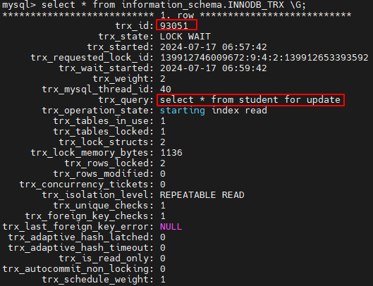


（2）查询锁等待情况

```mysql
SELECT * FROM data_lock_waits\G;
*************************** 1. row ***************************
							ENGINE: INNODB
		REQUESTING_ENGINE_LOCK_ID: 139750145405624:7:4:7:139747028690608
REQUESTING_ENGINE_TRANSACTION_ID: 13845 #被阻塞的事务ID
			REQUESTING_THREAD_ID: 72
			REQUESTING_EVENT_ID: 26
REQUESTING_OBJECT_INSTANCE_BEGIN: 139747028690608
		BLOCKING_ENGINE_LOCK_ID: 139750145406432:7:4:7:139747028813248
BLOCKING_ENGINE_TRANSACTION_ID: 13844 #正在执行的事务ID，阻塞了13845
			BLOCKING_THREAD_ID: 71
			BLOCKING_EVENT_ID: 24
BLOCKING_OBJECT_INSTANCE_BEGIN: 139747028813248
1 row in set (0.00 sec)
```

（3）查询锁的情况

```mysql
mysql > SELECT * from performance_schema.data_locks\G;
*************************** 1. row ***************************
ENGINE: INNODB
ENGINE_LOCK_ID: 139750145405624:1068:139747028693520
ENGINE_TRANSACTION_ID: 13847
THREAD_ID: 72
EVENT_ID: 31
OBJECT_SCHEMA: atguigu
OBJECT_NAME: user
PARTITION_NAME: NULL
SUBPARTITION_NAME: NULL
INDEX_NAME: NULL
OBJECT_INSTANCE_BEGIN: 139747028693520
LOCK_TYPE: TABLE
LOCK_MODE: IX
LOCK_STATUS: GRANTED
LOCK_DATA: NULL
*************************** 2. row ***************************
ENGINE: INNODB
ENGINE_LOCK_ID: 139750145405624:7:4:7:139747028690608
ENGINE_TRANSACTION_ID: 13847
THREAD_ID: 72
EVENT_ID: 31
OBJECT_SCHEMA: atguigu
OBJECT_NAME: user
PARTITION_NAME: NULL
SUBPARTITION_NAME: NULL
INDEX_NAME: PRIMARY
OBJECT_INSTANCE_BEGIN: 139747028690608
LOCK_TYPE: RECORD
LOCK_MODE: X,REC_NOT_GAP
LOCK_STATUS: WAITING
LOCK_DATA: 1
*************************** 3. row ***************************
ENGINE: INNODB
ENGINE_LOCK_ID: 139750145406432:1068:139747028816304
ENGINE_TRANSACTION_ID: 13846
THREAD_ID: 71
EVENT_ID: 28
OBJECT_SCHEMA: atguigu
OBJECT_NAME: user
PARTITION_NAME: NULL
SUBPARTITION_NAME: NULL
INDEX_NAME: NULL
OBJECT_INSTANCE_BEGIN: 139747028816304
LOCK_TYPE: TABLE
LOCK_MODE: IX
LOCK_STATUS: GRANTED
LOCK_DATA: NULL
*************************** 4. row ***************************
ENGINE: INNODB
ENGINE_LOCK_ID: 139750145406432:7:4:7:139747028813248
ENGINE_TRANSACTION_ID: 13846
THREAD_ID: 71
EVENT_ID: 28
OBJECT_SCHEMA: atguigu
OBJECT_NAME: user
PARTITION_NAME: NULL
SUBPARTITION_NAME: NULL
INDEX_NAME: PRIMARY
OBJECT_INSTANCE_BEGIN: 139747028813248
LOCK_TYPE: RECORD
LOCK_MODE: X,REC_NOT_GAP
LOCK_STATUS: GRANTED
LOCK_DATA: 1
4 rows in set (0.00 sec)

ERROR:
No query specified
```

从锁的情况可以看出来，两个事务分别获取了IX锁，我们从意向锁章节可以知道，IX锁互相时兼容的。所 以这里不会等待，但是事务1同样持有X锁，此时事务2也要去同一行记录获取X锁，他们之间不兼容，导 致等待的情况发生。

## 6. 附录

**间隙锁加锁规则（共11个案例）**

间隙锁是在可重复读隔离级别下才会生效的： next-key lock 实际上是由间隙锁加行锁实现的，如果切换 到读提交隔离级别 (read-committed) 的话，就好理解了，过程中去掉间隙锁的部分，也就是只剩下行锁 的部分。而在读提交隔离级别下间隙锁就没有了，为了解决可能出现的数据和日志不一致问题，需要把 binlog 格式设置为 row 。也就是说，许多公司的配置为：读提交隔离级别加 binlog_format=row。业务不 需要可重复读的保证，这样考虑到读提交下操作数据的锁范围更小（没有间隙锁），这个选择是合理的。

next-key lock的加锁规则

总结的加锁规则里面，包含了两个 “ “ 原则 ” ” 、两个 “ “ 优化 ” ” 和一个 “bug” 。

1. 原则 1 ：加锁的基本单位是 next-key lock 。 next-key lock 是前开后闭区间。 
2. 原则 2 ：查找过程中访问到的对象才会加锁。任何辅助索引上的锁，或者非索引列上的锁，最终 都要回溯到主键上，在主键上也要加一把锁。 
3. 优化 1 ：索引上的等值查询，给唯一索引加锁的时候， next-key lock 退化为行锁。也就是说如果 InnoDB扫描的是一个主键、或是一个唯一索引的话，那InnoDB只会采用行锁方式来加锁 
4. 优化 2 ：索引上（不一定是唯一索引）的等值查询，向右遍历时且最后一个值不满足等值条件的 时候， next-keylock 退化为间隙锁。 
5. 一个 bug ：唯一索引上的范围查询会访问到不满足条件的第一个值为止。

我们以表test作为例子，建表语句和初始化语句如下：其中id为主键索引

```mysql
CREATE TABLE `test` (
`id` int(11) NOT NULL,
`col1` int(11) DEFAULT NULL,
`col2` int(11) DEFAULT NULL,
PRIMARY KEY (`id`),
KEY `c` (`c`)
) ENGINE=InnoDB;
insert into test values(0,0,0),(5,5,5),
(10,10,10),(15,15,15),(20,20,20),(25,25,25);
```

**案例一：唯一索引等值查询间隙锁**


由于表 test 中没有 id=7 的记录

根据原则 1 ，加锁单位是 next-key lock ， session A 加锁范围就是 (5,10] ； 同时根据优化 2 ，这是一个等 值查询 (id=7) ，而 id=10 不满足查询条件， next-key lock 退化成间隙锁，因此最终加锁的范围是 (5,10)

**案例二：非唯一索引等值查询锁**

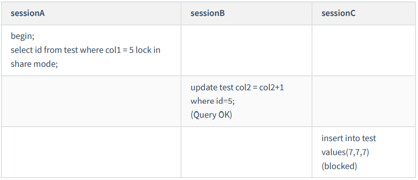

这里 session A 要给索引 col1 上 col1=5 的这一行加上读锁。

1. 根据原则 1 ，加锁单位是 next-key lock ，左开右闭，5是闭上的，因此会给 (0,5] 加上 next-key lock 。 
2. 要注意 c 是普通索引，因此仅访问 c=5 这一条记录是不能马上停下来的（可能有col1=5的其他记 录），需要向右遍历，查到c=10 才放弃。根据原则 2 ，访问到的都要加锁，因此要给 (5,10] 加 next-key lock 。 
3. 但是同时这个符合优化 2 ：等值判断，向右遍历，最后一个值不满足 col1=5 这个等值条件，因此退化成间隙锁 (5,10) 。
4. 根据原则 2 ， 只有访问到的对象才会加锁，这个查询使用覆盖索引，并不需要访问主键索引，所以主键索引上没有加任何锁，这就是为什么 session B 的 update 语句可以执行完成。

但 session C 要插入一个 (7,7,7) 的记录，就会被 session A 的间隙锁 (5,10) 锁住 这个例子说明，锁是加在索引上的。

执行 for update 时，系统会认为你接下来要更新数据，因此会顺便给主键索引上满足条件的行加上行锁。

如果你要用 lock in share mode来给行加读锁避免数据被更新的话，就必须得绕过覆盖索引的优化，因为覆盖索引不会访问主键索引，不会给主键索引上加锁

**案例三：主键索引范围查询锁**

上面两个例子是等值查询的，这个例子是关于范围查询的，也就是说下面的语句

```mysql
select * from test where id=10 for update
select * from tets where id>=10 and id<11 for update;
```

这两条查语句肯定是等价的，但是它们的加锁规则不太一样


1. 开始执行的时候，要找到第一个 id=10 的行，因此本该是 next-key lock(5,10] 。 根据优化 1 ，主键 id 上的等值条件，退化成行锁，只加了 id=10 这一行的行锁。 
2. 它是范围查询， 范围查找就往后继续找，找到 id=15 这一行停下来，不满足条件，因此需要加 next-key lock(10,15] 。

session A 这时候锁的范围就是主键索引上，行锁 id=10 和 next-key lock(10,15] 。**首次 session A 定位查找 id=10 的行的时候，是当做等值查询来判断的，而向右扫描到 id=15 的时候，用的是范围查询判断。**

**案例四：非唯一索引范围查询锁**

与案例三不同的是，案例四中查询语句的 where 部分用的是字段 c ，它是普通索引

这两条查语句肯定是等价的，但是它们的加锁规则不太一样

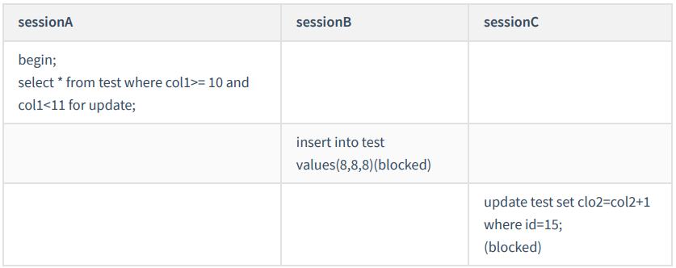

在第一次用 col1=10 定位记录的时候，索引 c 上加了 (5,10] 这个 next-key lock 后，由于索引 col1 是非唯 一索引，没有优化规则，也就是说不会蜕变为行锁，因此最终 sesion A 加的锁是，索引 c 上的 (5,10] 和 (10,15] 这两个 next-keylock 。

这里需要扫描到 col1=15 才停止扫描，是合理的，因为 InnoDB 要扫到 col1=15 ，才知道不需要继续往后找了。

**案例五：唯一索引范围查询锁 bug**

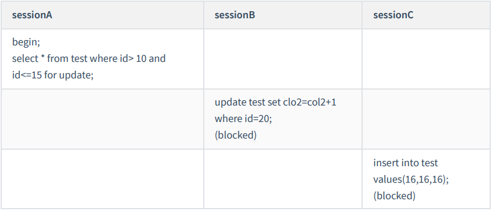

session A 是一个范围查询，按照原则 1 的话，应该是索引 id 上只加 (10,15] 这个 next-key lock ，并且因 为 id 是唯一键，所以循环判断到 id=15 这一行就应该停止了。

但是实现上， InnoDB 会往前扫描到第一个不满足条件的行为止，也就是 id=20 。而且由于这是个范围扫描，因此索引 id 上的 (15,20] 这个 next-key lock 也会被锁上。照理说，这里锁住 id=20 这一行的行为，其实是没有必要的。因为扫描到 id=15 ，就可以确定不用往后再找了。

**案例六：非唯一索引上存在 " " 等值 " " 的例子**

这里，我给表 t 插入一条新记录：insert into t values(30,10,30);也就是说，现在表里面有两个c=10的行

**但是它们的主键值 id 是不同的（分别是 10 和 30 ），因此这两个c=10 的记录之间，也是有间隙的。**

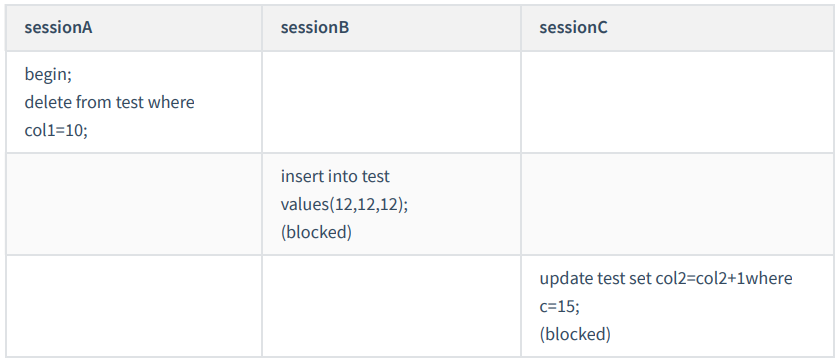

这次我们用 delete 语句来验证。注意， delete 语句加锁的逻辑，其实跟 select ... for update 是类似的， 也就是我在文章开始总结的两个 “ 原则 ” 、两个 “ 优化 ” 和一个 “bug” 。

这时， session A 在遍历的时候，先访问第一个 col1=10 的记录。同样地，根据原则 1 ，这里加的是 (col1=5,id=5) 到 (col1=10,id=10) 这个 next-key lock 。

由于c是普通索引，所以继续向右查找，直到碰到 (col1=15,id=15) 这一行循环才结束。根据优化 2 ，这是 一个等值查询，向右查找到了不满足条件的行，所以会退化成 (col1=10,id=10) 到 (col1=15,id=15) 的间隙锁。

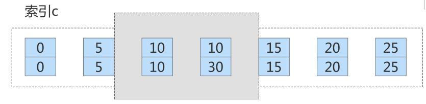

这个 delete 语句在索引 c 上的加锁范围，就是上面图中蓝色区域覆盖的部分。这个蓝色区域左右两边都 是虚线，表示开区间，即 (col1=5,id=5) 和 (col1=15,id=15) 这两行上都没有锁

**案例七： limit 语句加锁**

例子 6 也有一个对照案例，场景如下所示：


session A 的 delete 语句加了 limit 2 。你知道表 t 里 c=10 的记录其实只有两条，因此加不加 limit 2 ，删除的效果都是一样的。但是加锁效果却不一样

这是因为，案例七里的 delete 语句明确加了 limit 2 的限制，因此在遍历到 (col1=10, id=30) 这一行之后， 满足条件的语句已经有两条，循环就结束了。因此，索引 col1 上的加锁范围就变成了从（ col1=5,id=5) 到（ col1=10,id=30) 这个前开后闭区间，如下图所示：


这个例子对我们实践的指导意义就是， 在删除数据的时候尽量加 limit 。

这样不仅可以控制删除数据的条数，让操作更安全，还可以减小加锁的范围。

**案例八：一个死锁的例子**


1. session A 启动事务后执行查询语句加 lock in share mode ，在索引 col1 上加了 next-keylock(5,10] 和 间隙锁 (10,15) （索引向右遍历退化为间隙锁）； 
2. session B 的 update 语句也要在索引 c 上加 next-key lock(5,10] ，进入锁等待； 实际上分成了两步， 先是加 (5,10) 的间隙锁，加锁成功；然后加 col1=10 的行锁，因为sessionA上已经给这行加上了读 锁，此时申请死锁时会被阻塞 
3. 然后 session A 要再插入 (8,8,8) 这一行，被 session B 的间隙锁锁住。由于出现了死锁， InnoDB 让 session B 回滚

**案例九：order by索引排序的间隙锁1**

如下面一条语句

```mysql
begin;
select * from test where id>9 and id<12 order by id desc for update;
```

下图为这个表的索引id的示意图。


1. 首先这个查询语句的语义是 order by id desc ，要拿到满足条件的所有行，优化器必须先找到 “ 第 一个 id<12 的值 ” 。 
2. 这个过程是通过索引树的搜索过程得到的，在引擎内部，其实是要找到 id=12 的这个值，只是最终 没找到，但找到了 (10,15) 这个间隙。（ id=15 不满足条件，所以 next-key lock 退化为了间隙锁 (10, 15) 。）
3. 然后向左遍历，在遍历过程中，就不是等值查询了，会扫描到 id=5 这一行，又因为区间是左开右 闭的，所以会加一个next-key lock (0,5] 。 也就是说，在执行过程中，通过树搜索的方式定位记录 的时候，用的是 “ 等值查询 ” 的方法。

**案例十：order by索引排序的间隙锁2**

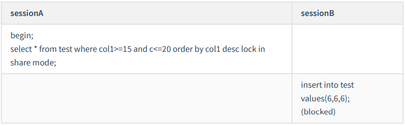

1. 由于是 order by col1 desc ，第一个要定位的是索引 col1 上 “ 最右边的 ”col1=20 的行。这是一个非唯一索引的等值查询：

   左开右闭区间，首先加上 next-key lock (15,20] 。 向右遍历，col1=25不满足条件，退化为间隙锁 所以会 加上间隙锁(20,25) 和 next-key lock (15,20] 。

2. 在索引 col1 上向左遍历，要扫描到 col1=10 才停下来。同时又因为左开右闭区间，所以 next-key lock 会加到 (5,10] ，这正是阻塞session B 的 insert 语句的原因。

3. 在扫描过程中， col1=20 、 col1=15 、 col1=10 这三行都存在值，由于是 select * ，所以会在主键 id 上加三个行锁。 因此， session A 的 select 语句锁的范围就是：

   1. 索引 col1 上 (5, 25) ；
   2. 主键索引上 id=15 、 20 两个行锁。

**案例十一：update修改数据的例子-先插入后删除**

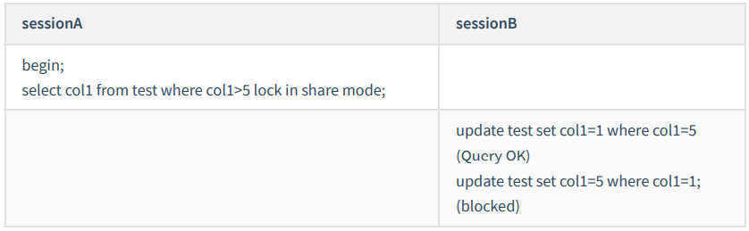

注意：根据 col1>5 查到的第一个记录是 col1=10 ，因此不会加 (0,5] 这个 next-key lock 。

session A 的加锁范围是索引 col1 上的 (5,10] 、 (10,15] 、 (15,20] 、 (20,25] 和(25,supremum] 。

之后 session B 的第一个 update 语句，要把 col1=5 改成 col1=1 ，你可以理解为两步：

1. 插入 (col1=1, id=5) 这个记录；
2. 删除 (col1=5, id=5) 这个记录。

通过这个操作， session A 的加锁范围变成了图 7 所示的样子:


好，接下来 session B 要执行 update t set col1 = 5 where col1 = 1 这个语句了，一样地可以拆成两步：

1. 插入 (col1=5, id=5) 这个记录；
2. 删除 (col1=1, id=5) 这个记录。 第一步试图在已经加了间隙锁的 (1,10) 中插入数据，所以就被堵住了。
