[toc]


# 第09章_性能分析工具的使用

**<font color=red size=5>解决问题：数据库查询慢</font>**

在数据库调优中，我们的目标是 `响应时间更快, 吞吐量更大` 。利用宏观的监控工具和微观的日志分析可以帮我们快速找到调优的思路和方式。

## 1. 数据库服务器的优化步骤

当我们遇到数据库调优问题的时候，该如何思考呢？这里把思考的流程整理成下面这张图。

整个流程划分成了 `观察（Show status）` 和 `行动（Action）` 两个部分。字母 S 的部分代表观察（会使 用相应的分析工具），字母 A 代表的部分是行动（对应分析可以采取的行动）。


观察数据库整体的运行状态，以及通过性能分析工具可以让我们了解执行慢的SQL都有哪些，查看具体的SQL执行计划，甚至是SQL执行中的每一步的成本代价，这样才能定位问题所在，找到了问题，再采取相应的行动。

**详细解释一下这张图：**

- 首先在S1部分，我们需要观察服务器的状态是否存在周期性的波动。如果**<font color=orange>存在周期性波动</font>**，有可能是周期性节点的原因，比如双十一、促销活动等。这样我们可以通过A1这一步骤解决，也就是加缓存，或者更改缓存失效策略。
-  如果缓存策略没有解决，或者不是周期性波动的原因，我们就需要进一步分析查询延迟和卡顿的原因。接下来进入 S2这步，开启慢查询，它慢可以帮我们定位执行慢的SQL语句。通过设置 **<font color=orange>long_query_time</font>**参数**<font color=orange>定义 "慢" 的阈值</font>**，如果**<font color=orange>SQL执行时间超过了 long_query_time，则会认为是慢查询</font>**。当收集上来这些慢查询之后，就可以通过分析工具对慢查询日志进行分析。
-  在S3这一步骤中，我们就知道了执行慢的SQL，这样就可以针对性地**<font color=orange>用EXPLAIN查看对应SQL语句的执行计划</font>**，或者使用**<font color=orange>show profile查看SQL中每一个步骤的时间成本</font>**。这样我们就可以了解SQL查询慢是因为执行时间长，还是等待时间长。
-  如果是SQL等待时间长，进入A2步骤。在这一步骤中，我们可以**<font color=orange>调优服务器的参数</font>**，比如适当增加数据库缓冲池等。如果是SQL执行时间长，就进入A3步骤，这一步需要考虑是索引设计的问题还是查询关联的数据表过多？或是因为数据表的字段设计问题导致了这一现象。然后在这些维度上进行对应的调整。
-  如果A2和A3都不能解决问题，我们需要考虑数据库自身的SQL查询性能是否已经达到了瓶颈，如果确认没有达到性能瓶颈，就需要重新检查，重复以上的步骤。如果已经达到了**<font color=orange>性能瓶颈</font>**，进入A4阶段，需要考虑**<font color=orange>增加服务器</font>**，采用**<font color=orange>读写分离</font>**的架构，或者考虑对数据库进行**<font color=orange>分库分表</font>**，比如垂直分库、垂直分表和水平分表等。 

以上就是数据库调优的流程思路。如果我们发现执行SQL时存在不规则延迟或卡顿的时候，就可以采用分析工具 帮我们定位有问题的SQL，这三种分析工具你可以理解是SQL调优的三个步骤：**<font color=orange>慢查询、EXPLAIN和SHOW PROFILING</font>**。

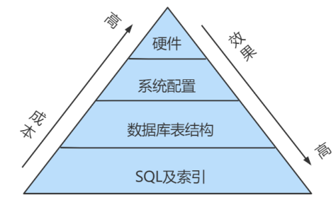

## 2. 查看系统性能参数

在MySQL中，可以使用 `SHOW STATUS` 语句查询一些MySQL数据库服务器的`性能参数、执行频率`。

SHOW STATUS语句语法如下：

```mysql
SHOW [GLOBAL|SESSION] STATUS LIKE '参数';
```

一些常用的性能参数如下：

* Connections：连接MySQL服务器的次数。 
* Uptime：MySQL服务器的上线时间。 
* Slow_queries：慢查询的次数。 
* Innodb_rows_read：Select查询返回的行数 
* Innodb_rows_inserted：执行INSERT操作插入的行数 
* Innodb_rows_updated：执行UPDATE操作更新的 行数 
* Innodb_rows_deleted：执行DELETE操作删除的行数 
* Com_select：查询操作的次数。 
* Com_insert：插入操作的次数。对于批量插入的 INSERT 操作，只累加一次。 
* Com_update：更新操作 的次数。 
* Com_delete：删除操作的次数。

若查询MySQL服务器的连接次数，则可以执行如下语句:

```mysql
SHOW STATUS LIKE 'Connections';
```

若查询服务器工作时间，则可以执行如下语句:

```mysql
SHOW STATUS LIKE 'Uptime';
```

若查询MySQL服务器的慢查询次数，则可以执行如下语句:

```mysql
SHOW STATUS LIKE 'Slow_queries';
```

慢查询次数参数可以结合慢查询日志找出慢查询语句，然后针对慢查询语句进行`表结构优化`或者`查询语句优化`。

再比如，如下的指令可以查看相关的指令情况：

```mysql
SHOW STATUS LIKE 'Innodb_rows_%';
```


查询行读取次数：

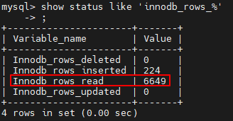


查询employees表（107条记录）后：


再次查询行读取次数（6756=6649+107）：

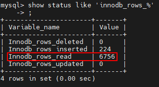


## 3. 统计SQL的查询成本: last_query_cost

一条SQL查询语句在执行前需要查询执行计划，如果存在多种执行计划的话，MySQL会计算每个执行计划所需要的成本，从中选择**<font color=red>成本最小</font>**的一个作为最终执行的执行计划。

如果我们想要查看某条SQL语句的查询成本，可以在执行完这条SQL语句之后，通过查看当前会话中的**<font color=red>last_query_cost</font>**变量值来得到当前查询的成本。它通常也是我们**<font color=red>评价一个查询的执行效率</font>**的一个常用指标。这个查询成本对应的是**<font color=red>SQL 语句所需要读取的读页的数量</font>**。

我们依然使用第8章的 student_info 表为例：

```mysql
CREATE TABLE `student_info` (
    `id` INT(11) NOT NULL AUTO_INCREMENT,
    `student_id` INT NOT NULL ,
    `name` VARCHAR(20) DEFAULT NULL,
    `course_id` INT NOT NULL ,
    `class_id` INT(11) DEFAULT NULL,
    `create_time` DATETIME DEFAULT CURRENT_TIMESTAMP ON UPDATE CURRENT_TIMESTAMP,
    PRIMARY KEY (`id`)
) ENGINE=INNODB AUTO_INCREMENT=1 DEFAULT CHARSET=utf8;
```

如果我们想要查询 id=900001 的记录，然后看下查询成本，我们可以直接在聚簇索引上进行查找：

```mysql
SELECT student_id, class_id, NAME, create_time FROM student_info WHERE id = 900001;
```

运行结果（1 条记录，运行时间为 0.042s ）

然后再看下查询优化器的成本，实际上我们只需要检索一个页即可：

```mysql
mysql> SHOW STATUS LIKE 'last_query_cost';
+-----------------+----------+
| Variable_name   |   Value  |
+-----------------+----------+
| Last_query_cost | 1.000000 |
+-----------------+----------+
```

如果我们想要查询 id 在 900001 到 9000100 之间的学生记录呢？

```mysql
SELECT student_id, class_id, NAME, create_time FROM student_info WHERE id BETWEEN 900001 AND 900100;
```

运行结果（100 条记录，运行时间为 0.046s ）： 

然后再看下查询优化器的成本，这时我们大概需要进行 20 个页的查询。

```mysql
mysql> SHOW STATUS LIKE 'last_query_cost';
+-----------------+-----------+
| Variable_name   |   Value   |
+-----------------+-----------+
| Last_query_cost | 21.134453 |
+-----------------+-----------+
```

你能看到页的数量是刚才的 20 倍，但是查询的效率并没有明显的变化，实际上这两个 SQL 查询的时间 基本上一样，就是因为采用了顺序读取的方式将页面一次性加载到缓冲池中，然后再进行查找。虽然 页 数量（last_query_cost）增加了不少 ，但是通过缓冲池的机制，并 没有增加多少查询时间 。 

**使用场景：**它对于比较开销是非常有用的，特别是我们有好几种查询方式可选的时候。

> SQL查询时一个动态的过程，从页加载的角度来看，我们可以得到以下两点结论：
>
> 1. **<font color=red>位置决定效率</font>**。如果页就在数据库 `缓冲池` 中，那么效率是最高的，否则还需要从 `内存` 或者 `磁盘` 中进行读取，当然针对单个页的读取来说，如果页存在于内存中，会比在磁盘中读取效率高很多。
> 2. **<font color=red>批量决定效率</font>**。如果我们从磁盘中对单一页进行随机读，那么效率是很低的(差不多10ms)，而采用顺序读取的方式，批量对页进行读取，平均一页的读取效率就会提升很多，甚至要快于单个页面在内存中的随机读取。
>
> 所以说，遇到I/O并不用担心，方法找对了，效率还是很高的。我们首先要考虑数据存放的位置，如果是进程使用的数据就要尽量放到`缓冲池`中，其次我们可以充分利用磁盘的吞吐能力，一次性批量读取数据，这样单个页的读取效率也就得到了提升。

## 4. 定位执行慢的 SQL：慢查询日志

MySQL慢查询日志用来记录在MySQL中**<font color=orange>响应时间超过阀值</font>**的语句，具体指运行时间超过**<font color=orange>long_query_time</font>**的SQL会被记录到慢查询日志中。Iong_query_time的默认值为<font color=orange>**10s**</font>，意思是运行10s以上（不含10）的语句，认为是超出了我们的最大忍耐时间值。

它的主要作用是，帮助我们发现那些执行时间特别长的SQL查询，并且有针对性地进行优化，从而提高系统的整体效率。当数据库服务器发生阻塞、运行变慢时，检查慢查询日志从中找到慢查询SQL，对解决问题很有帮助。比如一条SQL执行超过5秒，我们就算慢SQL，希望能收集超过5秒的SQL，结合explain进行全面分析。

 默认情况下，MySQL数据库<font color=orange>**未开启慢查询日志**</font>，需要手动设置这个参数。<font color=orange>**如果不是调优需要的话，不建议开启**</font>，因为开启慢查询日志会带来一定的性能影响。

 慢查询日志支持将日志记录写入文件。

### 4.1 开启慢查询日志参数

**1. 开启 slow_query_log**

在使用前，我们需要先查下慢查询是否已经开启，使用下面这条命令即可：

```mysql
mysql > show variables like '%slow_query_log';
```

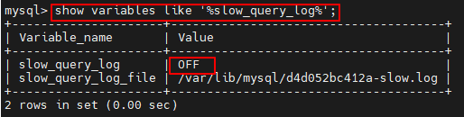

我们可以看到 `slow_query_log=OFF`，我们可以把慢查询日志打开，注意设置变量值的时候需要使用 global，否则会报错：

```mysql
mysql > set global slow_query_log='ON';
```

然后我们再来查看下慢查询日志是否开启，以及慢查询日志文件的位置：

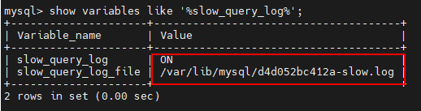

你能看到这时慢查询分析已经开启，同时文件保存在 `/var/lib/mysql/d4d052bc412a-slow.log` 文件 中。

**2. 修改 long_query_time 阈值**

接下来我们来看下慢查询的时间阈值设置，使用如下命令：

```mysql
mysql > show variables like '%long_query_time%';
```

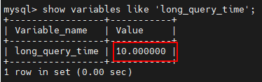

这里如果我们想把时间缩短，比如设置为 1 秒，可以这样设置：

```mysql
#测试发现：设置global的方式对当前session的long_query_time失效。对新连接的客户端有效。所以可以一并
执行下述语句
mysql > set global long_query_time = 1;
mysql> show global variables like '%long_query_time%';

mysql> set long_query_time=1;
mysql> show variables like '%long_query_time%';
```

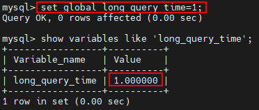

**补充：配置文件中一并设置参数**

如下的方式相较于前面的命令行方式，可以看做是永久设置的方式。

修改 `my.cnf` 文件，[mysqld] 下增加或修改参数 `long_query_time、slow_query_log` 和 `slow_query_log_file` 后，然后重启 MySQL 服务器。

```properties
[mysqld]
slow_query_log=ON  # 开启慢查询日志开关
slow_query_log_file=/var/lib/mysql/atguigu-low.log  # 慢查询日志的目录和文件名信息
long_query_time=3  # 设置慢查询的阈值为3秒，超出此设定值的SQL即被记录到慢查询日志
log_output=FILE
```

如果不指定存储路径，慢查询日志默认存储到MySQL数据库的数据文件夹下。如果不指定文件名，默认文件名为hostname_slow.log。

### 4.2 查看慢查询数目

查询当前系统中有多少条慢查询记录

```mysql
SHOW GLOBAL STATUS LIKE '%Slow_queries%';
```

### 4.3 案例演示

**步骤1. 建表**

```mysql
CREATE TABLE `student` (
    `id` INT(11) NOT NULL AUTO_INCREMENT,
    `stuno` INT NOT NULL ,
    `name` VARCHAR(20) DEFAULT NULL,
    `age` INT(3) DEFAULT NULL,
    `classId` INT(11) DEFAULT NULL,
    PRIMARY KEY (`id`)
) ENGINE=INNODB AUTO_INCREMENT=1 DEFAULT CHARSET=utf8;
```

**步骤2：设置参数 log_bin_trust_function_creators**

创建函数，假如报错：

```mysql
This function has none of DETERMINISTIC......
```

* 命令开启：允许创建函数设置：

```mysql
set global log_bin_trust_function_creators=1; # 不加global只是当前窗口有效。
```

**步骤3：创建函数**

随机产生字符串：（同上一章）

```mysql
DELIMITER //
CREATE FUNCTION rand_string(n INT)
	RETURNS VARCHAR(255) #该函数会返回一个字符串
BEGIN
	DECLARE chars_str VARCHAR(100) DEFAULT
'abcdefghijklmnopqrstuvwxyzABCDEFJHIJKLMNOPQRSTUVWXYZ';
	DECLARE return_str VARCHAR(255) DEFAULT '';
    DECLARE i INT DEFAULT 0;
    WHILE i < n DO
    	SET return_str =CONCAT(return_str,SUBSTRING(chars_str,FLOOR(1+RAND()*52),1));
    	SET i = i + 1;
    END WHILE;
    RETURN return_str;
END //
DELIMITER ;

# 测试
SELECT rand_string(10);
```

产生随机数值：（同上一章）

```mysql
DELIMITER //
CREATE FUNCTION rand_num (from_num INT ,to_num INT) RETURNS INT(11)
BEGIN
    DECLARE i INT DEFAULT 0;
    SET i = FLOOR(from_num +RAND()*(to_num - from_num+1)) ;
    RETURN i;
END //
DELIMITER ;

#测试：
SELECT rand_num(10,100);
```

**步骤4：创建存储过程**

```mysql
DELIMITER //
CREATE PROCEDURE insert_stu1( START INT , max_num INT )
BEGIN
DECLARE i INT DEFAULT 0;
    SET autocommit = 0; #设置手动提交事务
    REPEAT #循环
    SET i = i + 1; #赋值
    INSERT INTO student (stuno, NAME ,age ,classId ) VALUES
    ((START+i),rand_string(6),rand_num(10,100),rand_num(10,1000));
    UNTIL i = max_num
    END REPEAT;
    COMMIT; #提交事务
END //
DELIMITER ;
```

**步骤5：调用存储过程**

```mysql
#调用刚刚写好的函数, 4000000条记录,从100001号开始

CALL insert_stu1(100001,4000000);
```

### 4.4 测试及分析

**1. 测试**

```mysql
mysql> SELECT * FROM student WHERE stuno = 3455655;
+---------+---------+--------+------+---------+
|   id    |  stuno  |  name  | age  | classId |
+---------+---------+--------+------+---------+
| 3523633 | 3455655 | oQmLUr |  19  |    39   |
+---------+---------+--------+------+---------+
1 row in set (2.09 sec)

mysql> SELECT * FROM student WHERE name = 'oQmLUr';
+---------+---------+--------+------+---------+
|   id    |  stuno  |  name  |  age | classId |
+---------+---------+--------+------+---------+
| 1154002 | 1243200 | OQMlUR | 266  |   28    |
| 1405708 | 1437740 | OQMlUR | 245  |   439   |
| 1748070 | 1680092 | OQMlUR | 240  |   414   |
| 2119892 | 2051914 | oQmLUr | 17   |   32    |
| 2893154 | 2825176 | OQMlUR | 245  |   435   |
| 3523633 | 3455655 | oQmLUr | 19   |   39    |
+---------+---------+--------+------+---------+
6 rows in set (2.39 sec)
```

从上面的结果可以看出来，查询学生编号为“3455655”的学生信息花费时间为2.09秒。查询学生姓名为 “oQmLUr”的学生信息花费时间为2.39秒。已经达到了秒的数量级，说明目前查询效率是比较低的，下面 的小节我们分析一下原因。

**2. 分析**

```mysql
show status like 'slow_queries';
```

> [!NOTE]
>
> 补充说明： 
>
> 除了上述变量，控制慢直询日志的还有一个系统变量：min_examined_row_limit。这个变量的意思是，查询**<font color=orange>扫描过的最少记录数</font>**。这个变量和查询执行时间，共同组成了判别一个查询是否是慢查询的条件。如果查扫描过的记录数大于等于这个变量的值，并且查询执行时间超过long_query_time的值，那么这个查询就被记录到慢查询日志中；反之则不被记录到慢查询日志中。
>
> 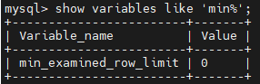
>
>  这个值默认是0，与long_query_time=10合在一起，表示只要查询的执行时间超过10秒，哪怕一个记录也没扫描过，都要被记录到慢查询日志中。也可以根据需要，通过修改"my.ini"文件，来修改查询时长，或者通过SET指令，用SQL语句修改"min_examined_row_limit"的值。

### 4.5 慢查询日志分析工具：mysqldumpslow

在生产环境中，如果要手工分析日志，查找、分析SQL，显然是个体力活，MySQL提供了日志分析工具 `mysqldumpslow` 。

查看mysqldumpslow的帮助信息

```properties
mysqldumpslow --help
# docker容器内没装可以在宿主机装
apt-get install -y mysql-client 
#然后docker cp 容器id:日志路径 宿主机路径  拷贝到宿主机上分析
```

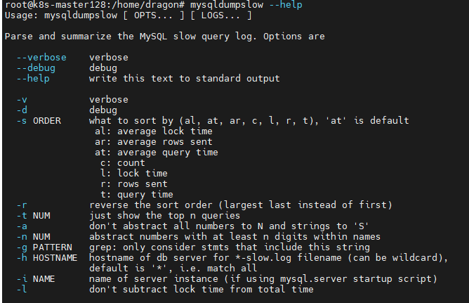

mysqldumpslow 命令的具体参数如下：

* -a: 不将数字抽象成N，字符串抽象成S
* -s: 是表示按照何种方式排序（降序）：
  * c: 访问次数 
  * l: 锁定时间 
  * r: 返回记录 
  * t: 查询时间 
  * al:平均锁定时间 
  * ar:平均返回记录数 
  * at:平均查询时间 （默认方式） 
  * ac:平均查询次数
* -t: 即为返回前面多少条的数据；
* -g: 后边搭配一个正则匹配模式，大小写不敏感的；

举例：按照查询耗时降序排序，**<font color=orange>查看前五条最耗时的 SQL 语句</font>**：

```properties
mysqldumpslow -s t -t 5 /var/lib/mysql/atguigu01-slow.log
```

```properties
[root@bogon ~]# mysqldumpslow -s t -t 5 /var/lib/mysql/atguigu01-slow.log  #下面S N是因为没加-a参数，将数字抽象成了N，字符串抽象成S

Reading mysql slow query log from /var/lib/mysql/atguigu01-slow.log
Count: 1 Time=2.39s (2s) Lock=0.00s (0s) Rows=13.0 (13), root[root]@localhost
SELECT * FROM student WHERE name = 'S'

Count: 1 Time=2.09s (2s) Lock=0.00s (0s) Rows=2.0 (2), root[root]@localhost
SELECT * FROM student WHERE stuno = N

Died at /usr/bin/mysqldumpslow line 162, <> chunk 2.
```

下面long_query_time设为0.1s ，并将慢查询日志从容器拷到宿主机分析:

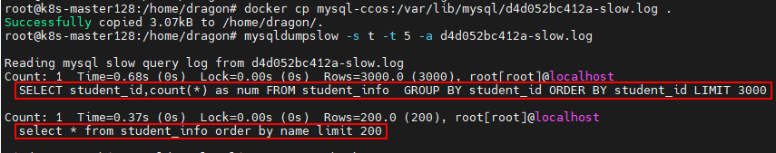

**工作常用参考：**

```properties
#得到返回记录集最多的10个SQL
mysqldumpslow -s r -t 10 /var/lib/mysql/atguigu-slow.log

#得到访问次数最多的10个SQL
mysqldumpslow -s c -t 10 /var/lib/mysql/atguigu-slow.log

#得到按照时间排序的前10条里面含有左连接的查询语句
mysqldumpslow -s t -t 10 -g "left join" /var/lib/mysql/atguigu-slow.log

#另外建议在使用这些命令时结合 | 和more 使用 ，否则有可能出现爆屏情况
mysqldumpslow -s r -t 10 /var/lib/mysql/atguigu-slow.log | more
```

### 4.6 关闭慢查询日志

MySQL服务器停止慢查询日志功能有两种方法：

**方式1：永久性方式**

```properties
[mysqld]
slow_query_log=OFF
```

或者，把slow_query_log一项注释掉 或 删除

```properties
[mysqld]
#slow_query_log =OFF
```

重启MySQL服务，执行如下语句查询慢日志功能。

```mysql
SHOW VARIABLES LIKE '%slow%'; #查询慢查询日志所在目录
SHOW VARIABLES LIKE '%long_query_time%'; #查询超时时长
```

**方式2：临时性方式**

使用SET语句来设置。 

（1）停止MySQL慢查询日志功能，具体SQL语句如下。

```mysql
SET GLOBAL slow_query_log=off;
```

（2）**重启MySQL服务**，使用SHOW语句查询慢查询日志功能信息，具体SQL语句如下。

```mysql
SHOW VARIABLES LIKE '%slow%';
#以及
SHOW VARIABLES LIKE '%long_query_time%';
```

### 4.7 删除慢查询日志

使用SHOW语句显示慢查询日志信息，具体SQL语句如下。

```mysql
SHOW VARIABLES LIKE `slow_query_log%`;
```

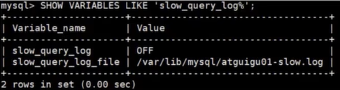

从执行结果可以看出，慢查询日志的目录默认为MySQL的数据目录，在该目录下 **<font color=orange>手动删除慢查询日志文件</font>** 即可。

使用命令 `mysqladmin flush-logs` 来重新生成查询日志文件，具体命令如下，执行完毕会在数据目录下重新生成慢查询日志文件。

```properties
mysqladmin -uroot -p flush-logs slow
```

> 提示
>
> 慢查询日志都是使用mysqladmin flush-logs命令来删除重建的。使用时一定要注意，一旦执行了这个命令，慢查询日志都只存在新的日志文件中，如果需要旧的查询日志，就必须事先备份。

## 5. 查看 SQL 执行成本：SHOW PROFILE

show profile 在《逻辑架构》章节中讲过，这里作为复习。

show profile 是 MySQL 提供的可以用来分析当前会话中 SQL 都做了什么、执行的资源消耗工具的情况，可用于 sql 调优的测量。`默认情况下处于关闭状态`，并保存最近15次的运行结果。

我们可以在会话级别开启这个功能。

```mysql
mysql > show variables like 'profiling';
```

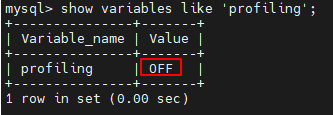

通过设置 profiling='ON' 来开启 show profile:

```mysql
mysql > set profiling = 'ON';
```


然后执行相关的查询语句。接着看下当前会话都有哪些 profiles，使用下面这条命令：

```mysql
mysql > show profiles;
```

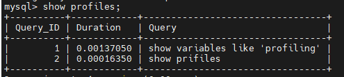

你能看到当前会话一共有 2 个查询。如果我们想要查看最近一次查询的开销，可以使用：

```mysql
mysql > show profile;
```

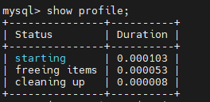

```mysql
mysql> show profile cpu,block io for query 2
```


**show profile的常用查询参数： **

① ALL：显示所有的开销信息。 

② BLOCK IO：显示块IO开销。 

③ CONTEXT SWITCHES：上下文切换开销。 

④ CPU：显示CPU开销信息。 

⑤ IPC：显示发送和接收开销信息。

⑥ MEMORY：显示内存开销信 息。 

⑦ PAGE FAULTS：显示页面错误开销信息。 

⑧ SOURCE：显示和Source_function，Source_file， Source_line相关的开销信息。 

⑨ SWAPS：显示交换次数开销信息。

**<font color=red>日常开发需注意的结论</font>：**

① `converting HEAP to MyISAM`: 查询结果太大，内存不够，数据往磁盘上搬了。 

② `Creating tmp table`：创建临时表。先拷贝数据到临时表，用完后再删除临时表。 

③ `Copying to tmp table on disk`：把内存中临时表复制到磁盘上，警惕！ 

④ `locked`。 

如果在show profile诊断结果中出现了以上4条结果中的任何一条，则sql语句需要优化。

**注意：**

不过SHOW PROFILE命令将被启用，我们可以从 information_schema 中的 profiling 数据表进行查看。

## 6. 分析查询语句：EXPLAIN

### 6.1 概述

**<font color=orange>定位了查询慢的SQL之后，就可以使用EXPLAIN或DESCRIBE工具做针对性的分析</font>**，二者的使用方法和分析结果是一样的。MySQL中有专门负责优化SELECT语句的优化器模块，其主要功能是通过计算分析系统中收集到的统计信息，为端请求的Query提供它认为最优的**<font color=orange>执行计划</font>**（但未必是DBA认为是最优的，这部分最耗费时间）。这个执行计划展示了接下来具体执行查询的方式，比如多表连接的顺序是什么，对于每个表采用什么访问方法来执行查询等等。MySQL提供了 **<font color=orange>EXPLAIN</font>**语句来帮助查看某个查询语句的具体执行计划，看懂EXPLAIN语句的各个输出项，可以有针对性地提升直询语句的性能。

**1. 能做什么？**

* 表的读取顺序
* 数据读取操作的操作类型
* 哪些索引可以使用
* 哪些索引被实际使用
* 表之间的引用
* 每张表有多少行被优化器查询

**2. 官网介绍**

https://dev.mysql.com/doc/refman/5.7/en/explain-output.html 

https://dev.mysql.com/doc/refman/8.0/en/explain-output.html

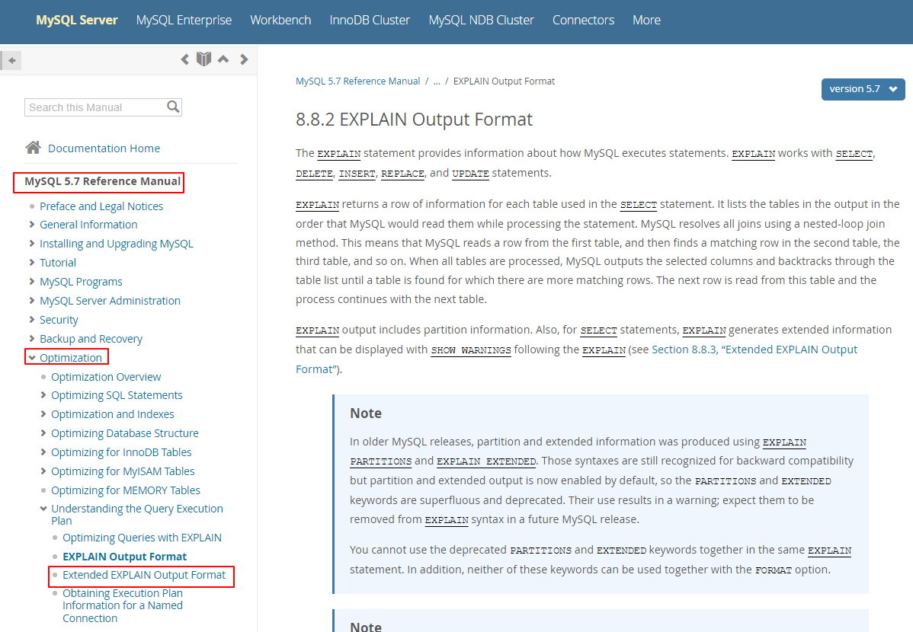

**3. 版本情况**

* MySQL 5.6.3以前只能 **<font color=orange>EXPLAIN SELECT</font>** ；MYSQL 5.6.3以后就可以 **<font color=orange>EXPLAIN SELECT，UPDATE， DELETE</font>** 
* 在5.7以前的版本中，想要显示 partitions 需要使用 explain partitions 命令；想要显示 filtered 需要使用 explain extended 命令。在5.7版本后，默认explain直接显示partitions和 filtered中的信息。

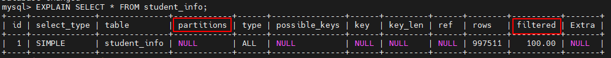

### 6.2 基本语法

EXPLAIN 或 DESCRIBE语句的语法形式如下：

```mysql
EXPLAIN SELECT select_options
或者
DESCRIBE SELECT select_options
```

查看某个查询的执行计划，可以在具体查询语句前加 EXPLAIN ：

```mysql
mysql> EXPLAIN SELECT 1;
```

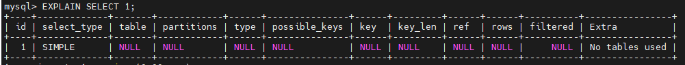

EXPLAIN 语句输出列：

|                    列名                     |                             描述                             |
| :-----------------------------------------: | :----------------------------------------------------------: |
|      **<font color=orange>id</font>**       | 在一个大的查询语句中每个SELECT关键字都对应一个**<font color=orange>唯一id</font>** |
|  **<font color=orange>select_type</font>**  |                  SELECT关键字对应的查询类型                  |
|     **<font color=orange>table</font>**     |                             表名                             |
|  **<font color=orange>partitions</font>**   |                        匹配的分区信息                        |
|     **<font color=orange>type</font>**      |                      针对表单的访问方法                      |
| **<font color=orange>possible_keys</font>** |                        可能用到的索引                        |
|      **<font color=orange>key</font>**      |                       实际上使用的索引                       |
|    **<font color=orange>key_len</font>**    |                     实际上使用的索引长度                     |
|      **<font color=orange>ref</font>**      |     当使用索引列等值查询时，与索引列进行值匹配的对象信息     |
|     **<font color=orange>rows</font>**      |                    预估需要读取的记录条数                    |
|   **<font color=orange>filtered</font>**    |         某个表经过搜索条件过滤后剩余记录条数的百分比         |
|     **<font color=orange>Extra</font>**     |                           额外信息                           |

### 6.3 数据准备

**1. 建表**

```mysql
CREATE TABLE s1 (
    id INT AUTO_INCREMENT,
    key1 VARCHAR(100),
    key2 INT,
    key3 VARCHAR(100),
    key_part1 VARCHAR(100),
    key_part2 VARCHAR(100),
    key_part3 VARCHAR(100),
    common_field VARCHAR(100),
    PRIMARY KEY (id),
    INDEX idx_key1 (key1),
    UNIQUE INDEX idx_key2 (key2),
    INDEX idx_key3 (key3),
    INDEX idx_key_part(key_part1, key_part2, key_part3)
) ENGINE=INNODB CHARSET=utf8;
```

```mysql
CREATE TABLE s2 (
    id INT AUTO_INCREMENT,
    key1 VARCHAR(100),
    key2 INT,
    key3 VARCHAR(100),
    key_part1 VARCHAR(100),
    key_part2 VARCHAR(100),
    key_part3 VARCHAR(100),
    common_field VARCHAR(100),
    PRIMARY KEY (id),
    INDEX idx_key1 (key1),
    UNIQUE INDEX idx_key2 (key2),
    INDEX idx_key3 (key3),
    INDEX idx_key_part(key_part1, key_part2, key_part3)
) ENGINE=INNODB CHARSET=utf8;
```

**2. 设置参数 log_bin_trust_function_creators**

创建函数，假如报错，需开启如下命令：允许创建函数设置：

```mysql
set global log_bin_trust_function_creators=1; # 不加global只是当前窗口有效。
```

**3. 创建存储函数**

```mysql
DELIMITER //
CREATE FUNCTION rand_string1(n INT)
	RETURNS VARCHAR(255) #该函数会返回一个字符串
BEGIN
	DECLARE chars_str VARCHAR(100) DEFAULT
'abcdefghijklmnopqrstuvwxyzABCDEFJHIJKLMNOPQRSTUVWXYZ';
    DECLARE return_str VARCHAR(255) DEFAULT '';
    DECLARE i INT DEFAULT 0;
    WHILE i < n DO
        SET return_str =CONCAT(return_str,SUBSTRING(chars_str,FLOOR(1+RAND()*52),1));
        SET i = i + 1;
    END WHILE;
    RETURN return_str;
END //
DELIMITER ;
```

**4. 创建存储过程**

创建往s1表中插入数据的存储过程：

```mysql
DELIMITER //
CREATE PROCEDURE insert_s1 (IN min_num INT (10),IN max_num INT (10))
BEGIN
    DECLARE i INT DEFAULT 0;
    SET autocommit = 0;
    REPEAT
    SET i = i + 1;
    INSERT INTO s1 VALUES(
        (min_num + i),
        rand_string1(6),
        (min_num + 30 * i + 5),
        rand_string1(6),
        rand_string1(10),
        rand_string1(5),
        rand_string1(10),
        rand_string1(10));
    UNTIL i = max_num
    END REPEAT;
    COMMIT;
END //
DELIMITER ;
```

创建往s2表中插入数据的存储过程：

```mysql
DELIMITER //
CREATE PROCEDURE insert_s2 (IN min_num INT (10),IN max_num INT (10))
BEGIN
    DECLARE i INT DEFAULT 0;
    SET autocommit = 0;
    REPEAT
    SET i = i + 1;
    INSERT INTO s2 VALUES(
        (min_num + i),
        rand_string1(6),
        (min_num + 30 * i + 5),
        rand_string1(6),
        rand_string1(10),
        rand_string1(5),
        rand_string1(10),
        rand_string1(10));
    UNTIL i = max_num
    END REPEAT;
    COMMIT;
END //
DELIMITER ;
```

**5. 调用存储过程**

s1表数据的添加：加入1万条记录：

```mysql
CALL insert_s1(10001,10000);
```

s2表数据的添加：加入1万条记录：

```mysql
CALL insert_s2(10001,10000);
```

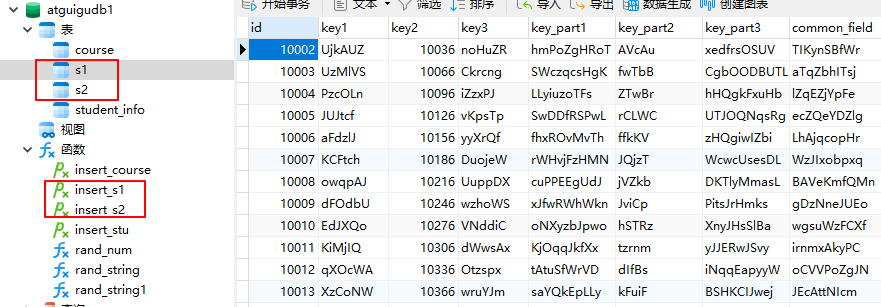

### 6.4 EXPLAIN各列作用

为了让大家有比较好的体验，我们调整了下 `EXPLAIN` 输出列的顺序。

#### 1. table

不论我们的查询语句有多复杂，里面包含了多少张表 ，到最后也是需要对每个表进行单表访问的，所以MySQL规定EXPLAIN语句输出的每条记录都对应着某个单表的访问方法，该条记录的table列代表着该表的表名（有时不是真实的表名字，可能是简称）。

```mysql
mysql > EXPLAIN SELECT * FROM s1;
```

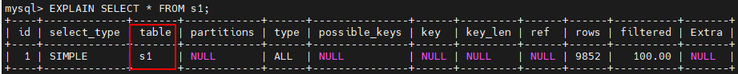

这个查询语句只涉及对s1表的单表查询，所以 `EXPLAIN` 输出中只有一条记录，其中的table列的值为s1，表明这条记录是用来说明对s1表的单表访问方法的。

下边我们看一个连接查询的执行计划

```mysql
mysql > EXPLAIN SELECT * FROM s1 INNER JOIN s2; # s1：驱动表   s2:被驱动表
```

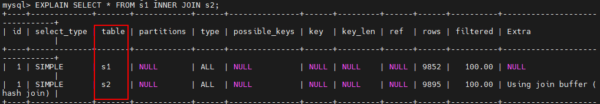

可以看出这个连接查询的执行计划中有两条记录，这两条记录的table列分别是s1和s2，这两条记录用来分别说明对s1表和s2表的访问方法是什么。

#### 2. id

我们写的查询语句一般都以 SELECT 关键字开头，比较简单的查询语句里只有一个 SELECT 关键字，比 如下边这个查询语句：

```mysql
SELECT * FROM s1 WHERE key1 = 'a';
```

稍微复杂一点的连接查询中也只有一个 SELECT 关键字，比如：

```mysql
SELECT * FROM s1 INNER JOIN s2
ON s1.key1 = s2.key1
WHERE s1.common_field = 'a';
```

但是下边两种情况下在一条查询语句中会出现多个SELECT关键字：

- 包含子查询的情况

```mysql
SELECT * FROM s1
WHERE key1 IN (SELECT key3 FROM s2);
```

- 包UNION语句的情况

```mysql
SELECT * FROM s1 UNION SELECT * FROM s2;
```

查询语句中每个SELECT关键字对应一个唯一id，该id值就是EXPLAIN语句的第一个列，比如下面这个查询中只有一个SELECT关键字，所以EXPLAIN结果中也只有一条id列为1的记录：

```mysql
EXPLAIN SELECT * FROM s1 WHERE key1='a';
```

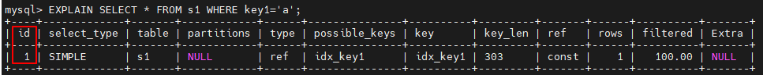

对于连接查询来说，一个SELECT关键字后边的FROM字句中可以跟随多个表，所以在连接查询的执行计划中，每个表都会对应一条记录，但是这些记录的id值都是相同的，比如：

```mysql
mysql> EXPLAIN SELECT * FROM s1 INNER JOIN s2;
```

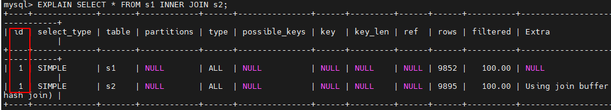

可以看到，上述连接查询中参与连接的s1和s2表分别对应一条记录，但是这两条记录对应的`id`都是1。这里需要大家记住的是，**<font color=orange>在连接查询的执行计划中，每个表都会对应一条记录，这些记录的id列的值是相同的，出现在前边的表表示驱动表，出现在后面的表表示被驱动表</font>**。所以从上边的EXPLAIN输出中我们可以看到，查询优化器准备让s1表作为驱动表，让s2表作为被驱动表来执行查询。

对于包含子查询的查询语句来说，就可能涉及多个`SELECT`关键字，所以在包含子查询的查询语句的执行计划中，每个`SELECT`关键字都会对应一个唯一的id值，比如这样：

```mysql
mysql> EXPLAIN SELECT * FROM s1 WHERE key1 IN (SELECT key1 FROM s2) OR key3 = 'a';
```

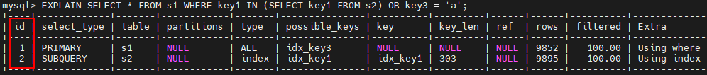

从输出结果中可以看到，s1表在外层查询中，外层查询有一个独立的**<font color=orange>SELECT</font>**关键字，所以第一条记录的id 值就是1，s2表在子查询中，子查询有一个独立的SELECT关键字，所以第二条记录的id值就是2。

 需要特别注意，**<font color=orange>查询优化器可能对涉及子查询的查询语句进行重写，从而转换为连接查询</font>**。所以若想知道查询优化器对某个包含子查询的语句是否进行了重写，直接查看执行计划即可，例如：

```mysql
# 查询优化器可能对涉及子查询的查询语句进行重写，转变为多表查询的操作。  
mysql> EXPLAIN SELECT * FROM s1 WHERE key1 IN (SELECT key2 FROM s2 WHERE common_field = 'a');
```

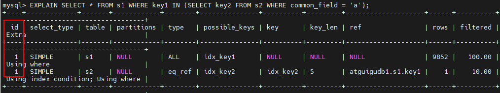

可以看到，虽然我们的查询语句是一个子查询，但是执行计划中s1和s2表对应的记录的`id`值全部是1，这就表明`查询优化器将子查询转换为了连接查询`。

对于包含`UNION`子句的查询语句来说，每个`SELECT`关键字对应一个`id`值也是没错的，不过需要注意：

```mysql
# Union去重
mysql> EXPLAIN SELECT * FROM s1 UNION SELECT * FROM s2;
```

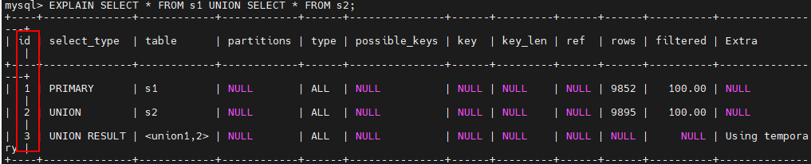

这个语句执行计划的第三条记录是什么？为何id值是NULL，而且table列也很奇怪？ **<font color=orange>UNION</font>** ! 它会把多个查询 的结果集合并起来并对结果集中的记录**<font color=orange>进行去重</font>**，怎么去重呢？ MySQL使用的是内部的临时表。正如上边查询计划中所示，UNION子句是为了把id为1的查询和id为2的查询的结果集合并起来并去重，所以在内部创建了一个 名为**<font color=orange><union, 2＞</font>** 的临时表（就是执行计划第三条记录的table列的名称），id为NULL表明这个临时表是为了合并两个查询的结果集而创建的。 

跟UNION对比起来，**<font color=orange>UNION ALL</font>**就不需要为最终的结果集进行去重，只是单纯把多个查询的结果集中的记录合并成一个并返回给用户，所以也就不需要使用临时表。在包含UNION ALL子句的查询的执行计划中，没有那个id为NULL的记录，如下所示：

```mysql
mysql> EXPLAIN SELECT * FROM s1 UNION ALL SELECT * FROM s2;
```

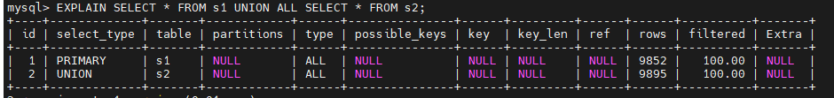

**小结:**

* **<font color=orange>id如果相同，可以认为是一组，从上往下顺序执行</font>** 
* **<font color=orange>在所有组中，id值越大，优先级越高，越先执行</font>** 
* **<font color=orange>关注点：id号每个号码，表示一趟独立的查询, 一个sql的查询趟数越少越好</font>**

#### 3. select_type

一条大的查询语句中可以包含若干个SELECT关键字，**<font color=orange>每个SELECT关键字代表一个小的查询语句</font>**，而每个 SELECT关键字的FROM子句中都可以包含若干张表（这些表用来做连接查询），<font color=orange>**每一张表都对应执行计划输出中的一条记录**</font>，对于在同一个SELECT关键字中的表来说，它们的id值是相同的。

 MySQL为每一个SELECT关键字代表的小查询都定义了一个称之为select_type的属性，意思是我们只要知道了某个小查询的select_type属性，就知道了这个<font color=orange>**小查询在整个大查询中扮演什么角色**</font>，官方规定的select_type取值如下：

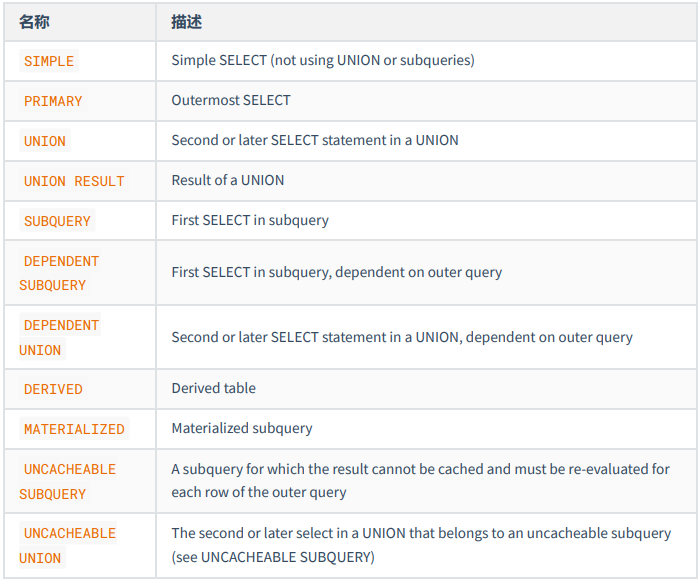

具体分析如下：

* SIMPLE

  查询语句中不包含`UNION`或者子查询的查询都算作是`SIMPLE`类型，比方说下边这个单表查询`select_type`的值就是`SIMPLE`:

  ```mysql
  mysql> EXPLAIN SELECT * FROM s1;
  ```

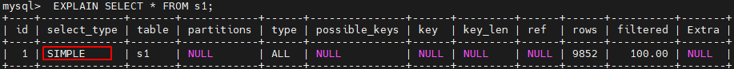

​        当然，连接查询也算是 SIMPLE 类型，比如：

```mysql
mysql> EXPLAIN SELECT * FROM s1 INNER JOIN s2;
```

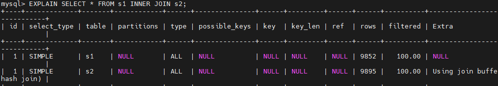

* PRIMARY

  对于包含`UNION、UNION ALL`或者子查询的大查询来说，它是由几个小查询组成的，其中最左边的那个查询的`select_type`的值就是`PRIMARY`,比方说：

  ```mysql
  mysql> EXPLAIN SELECT * FROM s1 UNION SELECT * FROM s2;
  ```

  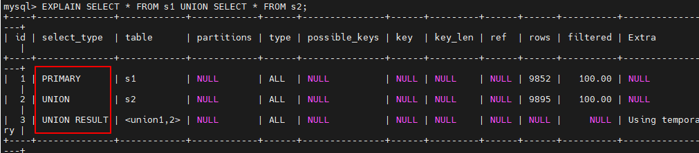

  从结果中可以看到，最左边的小查询`SELECT * FROM s1`对应的是执行计划中的第一条记录，它的`select_type`的值就是`PRIMARY`。

* UNION

  对于包含`UNION`或者`UNION ALL`的大查询来说，它是由几个小查询组成的，其中除了最左边的那个小查询意外，其余的小查询的`select_type`值就是UNION，可以对比上一个例子的效果。

* UNION RESULT

  MySQL 选择使用临时表来完成`UNION`查询的去重工作，针对该临时表的查询的`select_type`就是`UNION RESULT`, 例子上边有。

* SUBQUERY

  如果包含子查询的查询语句不能够转为对应的`semi-join`的形式，并且该子查询是**不相关子查询**，并且查询优化器决定采用将该子查询物化的方案来执行该子查询时，该子查询的第一个`SELECT`关键字代表的那个查询的`select_type`就是`SUBQUERY`，比如下边这个查询：

  ```mysql
  mysql> EXPLAIN SELECT * FROM s1 WHERE key1 IN (SELECT key1 FROM s2) OR key3 = 'a';
  ```

  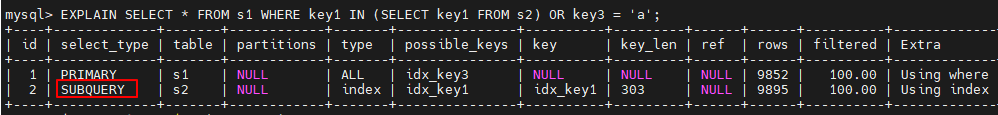

* DEPENDENT SUBQUERY

  如果包含子查询的查询语句不能够转为对应的`semi-join`的形式，并且该子查询是**相关子查询**，则该子查询的第一个`SELECT`关键字代表的那个查询的`select_type`就是`DEPENDENT SUBQUERY`，示例：

  ```mysql
  mysql> EXPLAIN SELECT * FROM s1 WHERE key1 IN (SELECT key1 FROM s2 WHERE s1.key2 = s2.key2) OR key3 = 'a';
  ```

  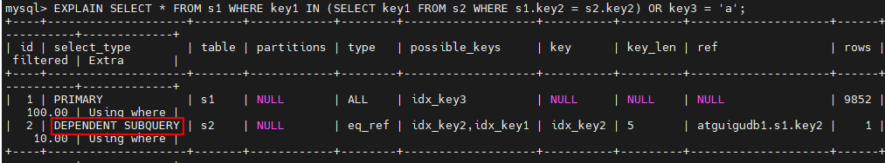

* DEPENDENT UNION

  在包含UNION或UNION ALL的大查询中，若各个小查询都依赖外层查询，那除了最左边的那个小查询外，其余小查询的`select_type`就是`DEPENDENT UNION`

  ```mysql
  mysql> EXPLAIN SELECT * FROM s1 WHERE key1 IN (SELECT key1 FROM s2 WHERE key1 = 'a' UNION SELECT key1 FROM s1 WHERE key1 = 'b');
  ```

  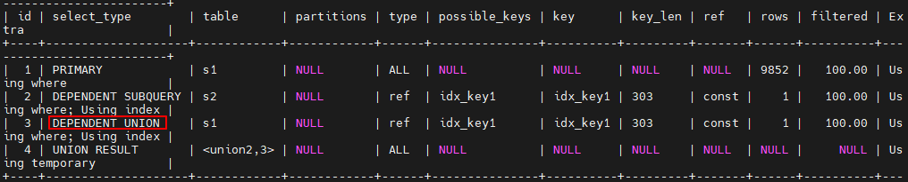

* DERIVED

  对于包含派生表的查询，该派生表的子查询的`select_type`就是`DERIVED`

  ```mysql
  mysql> EXPLAIN SELECT * FROM (SELECT key1, count(*) as c FROM s1 GROUP BY key1) AS derived_s1 where c > 1;
  ```

  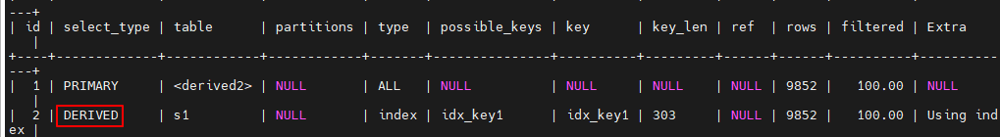

  从执行计划中可以看出，id为2的记录就代表子查询的执行方式，它的select_type是DERIVED, 说明该子查询是以物化的方式执行的。id为1的记录代表外层查询，大家注意看它的table列显示的是derived2，表示该查询时针对将派生表物化之后的表进行查询的。

* MATERIALIZED

  当查询优化器在执行包含子查询的语句时，选择将子查询物化之后的外层查询进行连接查询时，该子查询对应的`select_type`属性就是`MATERIALIZED`，比如下边这个查询：

  ```mysql
  mysql> EXPLAIN SELECT * FROM s1 WHERE key1 IN (SELECT key1 FROM s2);
  ```

  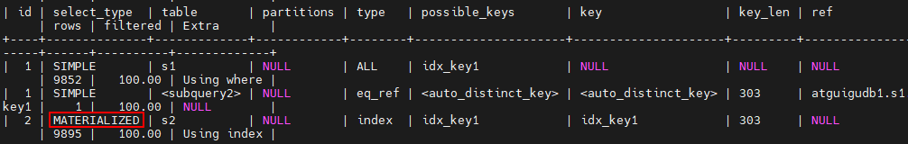

* UNCACHEABLE SUBQUERY

  不常用。

* UNCACHEABLE UNION

  不常用。

####  4. partitions (可略)

* 代表分区表中的命中情况，非分区表，该项为`NULL`。一般情况下我们的额查询语句的执行计划的`partitions`列的值为`NULL`。
* <a>https://dev.mysql.com/doc/refman/5.7/en/alter-table-partition-operations.html</a>
* 如果想详细了解，可以如下方式测试。创建分区表：

```mysql
-- 创建分区表，
-- 按照id分区，id<100 p0分区，其他p1分区
CREATE TABLE user_partitions (id INT auto_increment,
NAME VARCHAR(12),PRIMARY KEY(id))
PARTITION BY RANGE(id)(
PARTITION p0 VALUES less than(100),
PARTITION p1 VALUES less than MAXVALUE
);
```

```mysql
DESC SELECT * FROM user_partitions WHERE id>200;
```

查询id大于200（200>100，p1分区）的记录，查看执行计划，partitions是p1，符合我们的分区规则

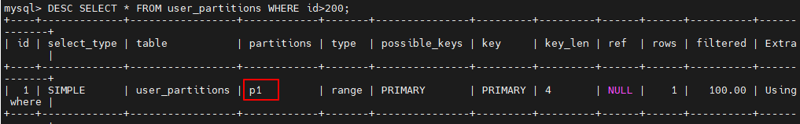

#### 5. type （重要）

执行计划的一条记录就代表着MySQL对某个表的 <font color=orange>**执行查询时的访问方法**</font> , 又称“访问类型”，其中的 `type` 列就表明了这个访问方法是啥，是较为重要的一个指标。比如，看到`type`列的值是`ref`，表明`MySQL`即将使用`ref`访问方法来执行对`s1`表的查询。

完整的访问方法如下： <font color=orange>**system ， const ， eq_ref ， ref ， fulltext ， ref_or_null ， index_merge ， unique_subquery ， index_subquery ， range ， index ， ALL**</font> 。

* <font color=orange>**system**</font>

  当表中<font color=orange>**只有一条记录**</font>并且该表使用的存储引擎的统计数据是精确的，比如MyISAM、Memory，那么对该表的访问方法就是`system`，它是**<font color=orange>性能最高的级别</font>**。比方说我们新建一个`MyISAM`表，并为其插入一条记录：

  ```mysql
  mysql> CREATE TABLE t(i int) Engine=MyISAM;
  Query OK, 0 rows affected (0.05 sec)
  
  mysql> INSERT INTO t VALUES(1);
  Query OK, 1 row affected (0.01 sec)
  ```

  然后我们看一下查询这个表的执行计划：

  ```mysql
  mysql> EXPLAIN SELECT * FROM t;  
  ```

  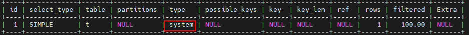

  可以看到`type`列的值就是`system`了，

  > 测试，可以把表改成使用InnoDB存储引擎，试试看执行计划的`type`列是什么。ALL

* <font color=orange>**const**</font>

  根据主键或者唯一二级索引列与常数进行等值匹配时，对单表的访问方法就是`const`, 比如：

  ```mysql
  mysql> EXPLAIN SELECT * FROM s1 WHERE id = 10005;
  ```

  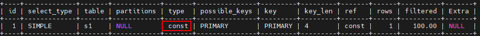

* `eq_ref`

  在连接查询时，如果被驱动表是通过主键或者唯一二级索引列等值匹配的方式进行访问的（如果该主键或者唯一二级索引是联合索引的话，所有的索引列都必须进行等值比较）。则对该被驱动表的访问方法就是`eq_ref`，比方说：

  ```mysql
  mysql> EXPLAIN SELECT * FROM s1 INNER JOIN s2 ON s1.id = s2.id;
  ```

  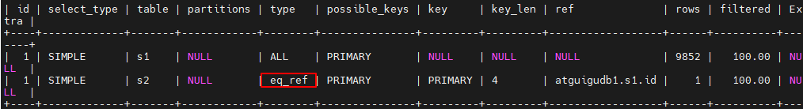

  从执行计划的结果中可以看出，MySQL打算将s2作为驱动表，s1作为被驱动表，重点关注s1的访问 方法是 `eq_ref` ，表明在访问s1表的时候可以 `通过主键的等值匹配` 来进行访问。

* `ref`

  当通过普通的二级索引列与常量进行等值匹配时来查询某个表，那么对该表的访问方法就可能是`ref`，比方说下边这个查询：

  ```mysql
  mysql> EXPLAIN SELECT * FROM s1 WHERE key1 = 'a';
  ```

  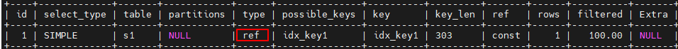

* `fulltext`

  全文索引

* `ref_or_null`

  当对普通二级索引进行等值匹配查询，该索引列的值也可以是`NULL`值时，那么对该表的访问方法就可能是`ref_or_null`，比如说：

  ```mysql
  mysql> EXPLAIN SELECT * FROM s1 WHERE key1 = 'a' OR key1 IS NULL;
  ```

  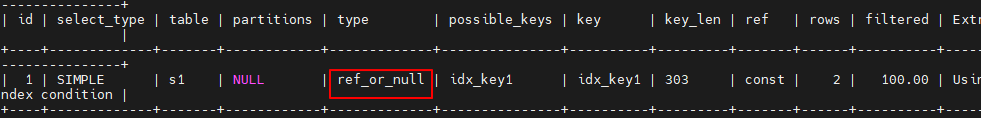

* `index_merge`

  一般情况下对于某个表的查询只能使用到一个索引，但单表访问方法时在某些场景下可以使用`Interseation、union、Sort-Union`这三种索引合并的方式来执行查询。我们看一下执行计划中是怎么体现MySQL使用索引合并的方式来对某个表执行查询的：

  ```mysql
  mysql> EXPLAIN SELECT * FROM s1 WHERE key1 = 'a' OR key3 = 'a';
  ```

  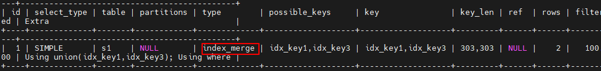

  从执行计划的 `type` 列的值是 `index_merge` 就可以看出，MySQL 打算使用索引合并的方式来执行 对 s1 表的查询。

* `unique_subquery`

  类似于两表连接中被驱动表的`eq_ref`访问方法，`unique_subquery`是针对在一些包含`IN`子查询的查询语句中，如果查询优化器决定将`IN`子查询转换为`EXISTS`子查询，而且子查询可以使用到主键进行等值匹配的话，那么该子查询执行计划的`type`列的值就是`unique_subquery`，比如下边的这个查询语句：

  ```mysql
  mysql> EXPLAIN SELECT * FROM s1 WHERE key2 IN (SELECT id FROM s2 where s1.key1 = s2.key1) OR key3 = 'a';
  ```

  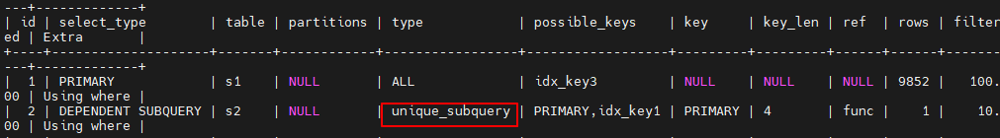

+ `index_subquery`

  `index_subquery` 与 `unique_subquery` 类似，只不过访问子查询中的表时使用的是普通的索引，比如这样：

  ```mysql
  mysql> EXPLAIN SELECT * FROM s1 WHERE common_field IN (SELECT key3 FROM s2 where s1.key1 = s2.key1) OR key3 = 'a';
  ```


* `range`

  ```mysql
  mysql> EXPLAIN SELECT * FROM s1 WHERE key1 IN ('a', 'b', 'c');
  ```

  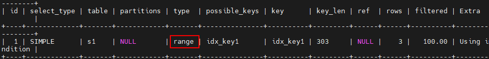

  或者：

  ```mysql
  mysql> EXPLAIN SELECT * FROM s1 WHERE key1 > 'a' AND key1 < 'b';
  ```

  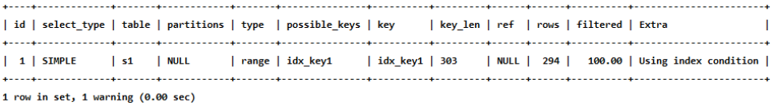

* `index`

  当我们可以使用索引覆盖，但需要扫描全部的索引记录时，该表的访问方法就是`index`，比如这样：

  ```mysql
  mysql> EXPLAIN SELECT key_part2 FROM s1 WHERE key_part3 = 'a';
  ```

  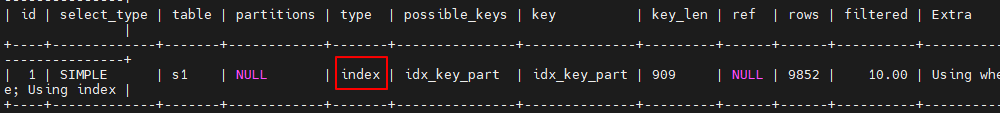

  上述查询中的所有列表中只有key_part2 一个列，而且搜索条件中也只有 key_part3 一个列，这两个列又恰好包含在idx_key_part这个索引中，可是搜索条件key_part3不能直接使用该索引进行`ref`和`range`方式的访问，只能扫描整个`idx_key_part`索引的记录，所以查询计划的`type`列的值就是`index`。

  > 再一次强调，对于使用InnoDB存储引擎的表来说，二级索引的记录只包含索引列和主键列的值，而聚簇索引中包含用户定义的全部列以及一些隐藏列，所以扫描二级索引的代价比直接全表扫描，也就是扫描聚簇索引的代价更低一些。

* `ALL`

  最熟悉的全表扫描，效率最差，直接看例子：

  ```mysql
  mysql> EXPLAIN SELECT * FROM s1;
  ```

  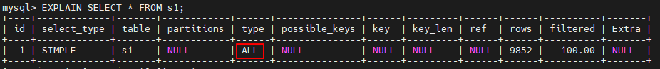

**小结: **

**<font color=red>结果值从最好到最坏依次是：</font> **

**<font color=red>system > const > eq_ref > ref</font>** > fulltext > ref_or_null > index_merge > unique_subquery > index_subquery > range > index > ALL 

**其中比较重要的几个提取出来（见上图中的粗体）。SQL 性能优化的目标：<font color=red>至少要达到 range 级别，要求是 ref 级别，最好是 const级别</font>。（阿里巴巴 开发手册要求）**

####  6. possible_keys和key

在EXPLAIN语句输出的执行计划中，<font color=orange>**possible_keys**</font>列表示在某个查询语句中，对某个列执行单表查询时<font color=orange>**可能用到的索引有哪些**</font>。一般查询涉及到的字段上若存在索引，则该索引将被列出，但不一定被查询使用。<font color=orange>**key**</font>列表示<font color=orange>**实际用到的索引有哪些**</font>，如果为NULL，则没有使用索引。比方说下面这个查询：

```mysql
mysql> EXPLAIN SELECT * FROM s1 WHERE key1 > 'z' AND key3 = 'a';
```

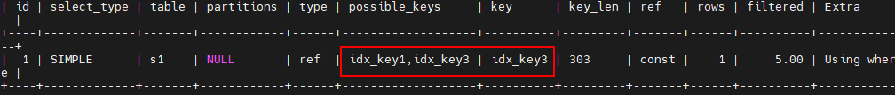

上述执行计划的`possible_keys`列的值是`idx_key1, idx_key3`，表示该查询可能使用到`idx_key1, idx_key3`两个索引，然后`key`列的值是`idx_key3`，表示经过查询优化器计算使用不同索引的成本后，最后决定采用`idx_key3`。

#### 7. key_len （重要）

实际使用到的索引长度 (字节数)

帮你检查<font color=orange>**是否充分的利用了索引，值越大越好，主要针对于联合索引**</font>，有一定的参考意义。

```mysql
mysql> EXPLAIN SELECT * FROM s1 WHERE id = 10005;
```

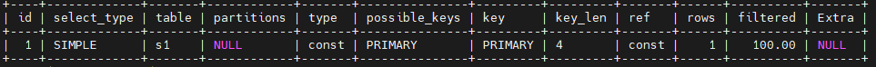

> int 占用 4 个字节

```mysql
mysql> EXPLAIN SELECT * FROM s1 WHERE key2 = 10126;
```

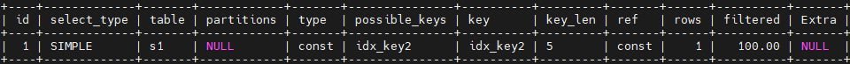

> key2上有一个唯一性约束，是否为NULL占用一个字节，那么就是5个字节

```mysql
mysql> EXPLAIN SELECT * FROM s1 WHERE key1 = 'a';
```


> key1 VARCHAR(100) 一个字符占3个字节，100*3，是否为NULL占用一个字节，varchar的长度信息占两个字节。

```mysql
mysql> EXPLAIN SELECT * FROM s1 WHERE key_part1 = 'a' AND key_part2 = 'b';
```


> 联合索引中可以比较，key_len=606的好于key_len=303

**练习： **

key_len的长度计算公式：

```mysql
varchar(10)变长字段且允许NULL = 10 * ( character set：utf8=3,gbk=2,latin1=1)+1(NULL)+2(变长字段)

varchar(10)变长字段且不允许NULL = 10 * ( character set：utf8=3,gbk=2,latin1=1)+2(变长字段)

char(10)固定字段且允许NULL = 10 * ( character set：utf8=3,gbk=2,latin1=1)+1(NULL)

char(10)固定字段且不允许NULL = 10 * ( character set：utf8=3,gbk=2,latin1=1)
```

#### 8. ref

当使用索引列等值查询时，与索引列进行等值匹配的对象信息。

```mysql
mysql> EXPLAIN SELECT * FROM s1 WHERE key1 = 'a'; 
```


可以看到`ref`列的值是`const`，表明在使用`idx_key1`索引执行查询时，与`key1`列作等值匹配的对象是一个常数（'a'），当然有时候更复杂一点:

```mysql
mysql> EXPLAIN SELECT * FROM s1 INNER JOIN s2 ON s1.id = s2.id;
```


```mysql
mysql> EXPLAIN SELECT * FROM s1 INNER JOIN s2 ON s2.key1 = UPPER(s1.key1);
```


#### 9. rows (重要)

预估的需要读取的记录条数，`值越小越好`（IO次数越少）。

```mysql
mysql> EXPLAIN SELECT * FROM s1 WHERE key1 > 'z';
```


#### 10. filtered

某个表经过搜索条件过滤后剩余记录条数的百分比

如果使用的是索引执行的单表扫描，那么计算时需要估计出满足除使用到对应索引的搜索条件外的其他搜索条件的记录有多少条。

```mysql
mysql> EXPLAIN SELECT * FROM s1 WHERE key1 > 'z' AND common_field = 'a';
```


对于单表查询来说，这个filtered的值没有什么意义，我们`更关注在连接查询中驱动表对应的执行计划记录的filtered值`，它决定了被驱动表要执行的次数 (即: rows * filtered)

```mysql
mysql> EXPLAIN SELECT * FROM s1 INNER JOIN s2 ON s1.key1 = s2.key1 WHERE s1.common_field = 'a';
```


从执行计划中可以看出来，查询优化器打算把`s1`作为驱动表，`s2`当做被驱动表。我们可以看到驱动表`s1`表的执行计划的`rows`列为`9852`，filtered列为`10.00`，这意味着驱动表`s1`的扇出值就是`9852 x 10.00% = 985.2`，这说明还要对被驱动表执行大约`985`次查询。

#### 11. Extra （重要）

顾名思义，`Extra`列是用来说明一些额外信息的，包含不适合在其他列中显示但十分重要的额外信息。可以通过它们来<font color=orange>**更准确的理解MySQL如何执行给定的查询语句**</font>。MySQL提供的额外信息有好几十个，下面挑选比较重要的进行介绍。

* `No tables used`

  当查询语句没有`FROM`子句时将会提示该额外信息，比如：

  ```mysql
  mysql> EXPLAIN SELECT 1;
  ```

  

* `Impossible WHERE`

  当查询语句的`WHERE`子句永远为`FALSE`时将会提示该额外信息

  ```mysql
  mysql> EXPLAIN SELECT * FROM s1 WHERE 1 != 1;
  ```

  

* `Using where`

  不用读取表中的信息，仅通过索引就可获得所需数据，这发生在对表的全部请求列都是同一索引的部分时，表示mysql服务器将在存储引擎检索行后再进行过滤，表明使用了WHERE过滤。

  当使用全表扫面来执行对某个表的查询，且该语句的WHERE子句中有针对该表的搜索条件时，在Extra列中会提示上述额外信息，如下边这个查询：

  ```mysql
  mysql> EXPLAIN SELECT * FROM s1 WHERE common_field = 'a';
  ```

  

  当使用索引访问来执行对某个表的查询，并且该语句的WHERE子句中有除了该索引包含的列之外的其他搜索 条件时，在Extra列中也会提示上述额外信息。比如下边这个查询虽然使用idx_key1索引执行查询，但搜索条件中除了包含key1的搜索条件key1= 'a'，还包含common.field的搜索条件，所以Extra列会显 示Using where 的提示：

  ```mysql
  mysql> EXPLAIN SELECT * FROM s1 WHERE key1 = 'a' AND common_field = 'a';
  ```

  

* `No matching min/max row`

  当查询列表处有`MIN`或者`MAX`聚合函数，但是并没有符合`WHERE`子句中的搜索条件的记录时。

  ```mysql
  mysql> EXPLAIN SELECT MIN(key1) FROM s1 WHERE key1 = 'abcdefg';
  ```

  

* `Using index`

  当我们的查询列表以及搜索条件中只包含属于某个索引的列，也就是在可以使用覆盖索引的情况下，在`Extra`列将会提示该额外信息。比方说下边这个查询中只需要用到`idx_key1`而不需要回表操作:

  ```mysql
  mysql> EXPLAIN SELECT key1 FROM s1 WHERE key1 = 'a';
  ```

  

* `Using index condition`

  有些搜索条件中虽然出现了索引列，但却不能使用到索引，比如下边这个查询：

  ```mysql
  SELECT * FROM s1 WHERE key1 > 'z' AND key1 LIKE '%a';
  ```

  其中的key1 > 'z'，可以使用到索引，但是key1 LIKE '%a' 却无法使用到索引，在以前版本的MySQL中， 是按照下边步骤来执行这个查询的： 

  - 先根据key1 > 'z' 这个条件，从二级索引idx_key1中获取到对应的二级索引记录。 
  - 根据上一步骤得到的二级索引记录中的主键值进行回表，找到完整的用户记录再检测该记录是否符合key1 LIKE '%a' 这个条件，将符合条件的记录加入到最后的结果集.。

  虽然key1 LIKE '%a'  不能组成范围区间参与range访问方法的执行，但这个条件毕竟只涉及到了 key1列，所以MySQL把上边的步骤改进了一下： 

  - 先根据key1 > 'z' 这个条件，定位到二级索引idx_key1中对应的二级索引记录 。
  - 对于指定的二级索引记录，先不着急回表，而是先检测一下该记录是否满足key1 LIKE '%a' 这个条件， 如果不满足，则该二级索引记录没必要回表；若满足则执行回表操作。

  我们说回表操作其实是一个随机IO，比较耗时，所以上述修改虽然只改进了一点点，但是可以省去好多回表 操作的成本。MySQL把这个改进称为**<font color=orange>索引条件下推</font>**（Index Condition Pushdown）。

  如果在查询语句的执行过程中将要使用索引条件下推这个特性，在Extra列中将会显示Using index condition ,比如这样：

  ```mysql
  mysql> EXPLAIN SELECT * FROM s1 WHERE key1 > 'z' AND key1 LIKE '%b';
  ```

  

* `Using join buffer (Block Nested Loop)`

  在连接查询执行过程中，当被驱动表不能有效的利用索引加快访问速度，MySQL一般会为其分配一块名叫`join buffer`的内存块来加快查询速度，也就是我们所讲的`基于块的嵌套循环算法`。

  ```mysql
  mysql> EXPLAIN SELECT * FROM s1 INNER JOIN s2 ON s1.common_field = s2.common_field;
  ```

  

* `Not exists`

  当我们使用左(外)连接时，如果`WHERE`子句中包含要求被驱动表的某个列等于`NULL`值的搜索条件，而且那个列是不允许存储`NULL`值的，那么在该表的执行计划的Extra列就会提示这个信息：

  ```mysql
  mysql> EXPLAIN SELECT * FROM s1 LEFT JOIN s2 ON s1.key1 = s2.key1 WHERE s2.id IS NULL;
  ```

  

* `Using intersect(...) 、 Using union(...) 和 Using sort_union(...)`

  如果执行计划的`Extra`列出现了`Using intersect(...)`提示，说明准备使用`Intersect`索引合并的方式执行查询，括号中的`...`表示需要进行索引合并的索引名称；

  如果出现`Using union(...)`提示，说明准备使用`Union`索引合并的方式执行查询;

  如果出现`Using sort_union(...)`提示，说明准备使用`Sort-Union`索引合并的方式执行查询。

  ```mysql
  mysql> EXPLAIN SELECT * FROM s1 WHERE key1 = 'a' OR key3 = 'a';
  ```

  

* `Zero limit`

  当我们的`LIMIT`子句的参数为`0`时，表示压根不打算从表中读取任何记录，将会提示该额外信息

  ```mysql
  mysql> EXPLAIN SELECT * FROM s1 LIMIT 0;
  ```

  

* `Using filesort`

  有一些情况下对结果集中的记录进行排序是可以使用到索引的。

  ```mysql
  mysql> EXPLAIN SELECT * FROM s1 ORDER BY key1 LIMIT 10;
  ```

  

  

  ```mysql
  mysql> EXPLAIN SELECT * FROM s1 ORDER BY common_field LIMIT 10;
  ```

  

  需要注意的是，如果查询中需要使用`filesort`的方式进行排序的记录非常多，那么这个过程是很耗费性能的，我们最好想办法`将使用文件排序的执行方式改为索引进行排序`。

* `Using temporary`

  

  ```mysql
  mysql> EXPLAIN SELECT DISTINCT common_field FROM s1;
  ```

  

  再比如：

  ```mysql
  mysql> EXPLAIN SELECT common_field, COUNT(*) AS amount FROM s1 GROUP BY common_field;
  ```

  

  执行计划中出现`Using temporary`并不是一个好的征兆，因为建立与维护临时表要付出很大的成本的，所以我们`最好能使用索引来替代掉使用临时表`，比方说下边这个包含`GROUP BY`子句的查询就不需要使用临时表：

  ```mysql
  mysql> EXPLAIN SELECT key1, COUNT(*) AS amount FROM s1 GROUP BY key1;
  ```

  

  从 `Extra` 的 `Using index` 的提示里我们可以看出，上述查询只需要扫描 `idx_key1` 索引就可以搞 定了，不再需要临时表了。

* 其他

  其它特殊情况这里省略。

#### 12. 小结

* EXPLAIN不考虑各种Cache 
* EXPLAIN不能显示MySQL在执行查询时所作的优化工作 
* EXPLAIN不会告诉你关于触发器、存储过程的信息或用户自定义函数对查询的影响情况 
* 部分统计信息是估算的，并非精确值

## 7. EXPLAIN的进一步使用

### 7.1 EXPLAIN四种输出格式

这里谈谈EXPLAIN的输出格式。EXPLAIN可以输出四种格式： `传统格式` ，`JSON格式` ， `TREE格式` 以及 `可视化输出` 。用户可以根据需要选择适用于自己的格式。

#### 1. 传统格式

传统格式简单明了，输出是一个表格形式，概要说明查询计划。

```mysql
mysql> EXPLAIN SELECT s1.key1, s2.key1 FROM s1 LEFT JOIN s2 ON s1.key1 = s2.key1 WHERE s2.common_field IS NOT NULL;
```


#### 2. JSON格式

第1种格式中介绍的`EXPLAIN`语句输出中缺少了一个衡量执行好坏的重要属性 —— `成本`。而JSON格式是四种格式里面输出`信息最详尽`的格式，里面包含了执行的成本信息。

* JSON格式：在EXPLAIN单词和真正的查询语句中间加上 FORMAT=JSON 。

```mysql
EXPLAIN FORMAT=JSON SELECT ....
```

* EXPLAIN的Column与JSON的对应关系：(来源于MySQL 5.7文档)


这样我们就可以得到一个json格式的执行计划，里面包含该计划花费的成本。比如这样：

```mysql
mysql> EXPLAIN FORMAT=JSON SELECT * FROM s1 INNER JOIN s2 ON s1.key1 = s2.key2 WHERE s1.common_field = 'a'\G
```

```mysql
EXPLAIN: {
  "query_block": {
    "select_id": 1, # 整个查询语句只有一个SELECT关键字，该关键字对应的id为1
    "cost_info": {
      "query_cost": "1354.27" #整个查询的执行成本预计1354.27
    },
    "nested_loop": [
        #以下是参与嵌套循环连接算法的各个表信息
      {
        "table": {
          "table_name": "s1", # s1驱动表
          "access_type": "ALL", #访问方法为ALL，即全表扫描
          "possible_keys": [  #可能使用的索引
            "idx_key1"
          ],
          "rows_examined_per_scan": 9852, #查询一次s1表大概要扫描9852条记录
          "rows_produced_per_join": 985, #驱动表s1的扇出为985
          "filtered": "10.00",  # condition filtering代表的百分比
          "cost_info": {
            "read_cost": "910.93",
            "eval_cost": "98.52",
            "prefix_cost": "1009.45", #单次读取s1表总成本
            "data_read_per_join": "1M" #读取的数据量
          }, 
          "used_columns": [  #执行查询中涉及到的列
            "id",
            "key1",
            "key2",
            "key3",
            "key_part1",
            "key_part2",
            "key_part3",
            "common_field"
          ],
        #对s1表访问时针对单表查询的条件
          "attached_condition": "((`atguigudb1`.`s1`.`common_field` = 'a') and (`atguigudb1`.`s1`.`key1` is not null))"
        }
      },
      {
        "table": {
          "table_name": "s2", # s2被驱动表
          "access_type": "eq_ref", # 访问方法为eq_ref
          "possible_keys": [  #可能使用的索引
            "idx_key2"
          ],
          "key": "idx_key2",  #实际使用的索引
          "used_key_parts": [ #使用到的索引
            "key2"
          ],
          "key_length": "5", # key_len
          "ref": [       # 与key2列进行等值匹配的对象
            "atguigudb1.s1.key1"
          ],
          "rows_examined_per_scan": 1, # 查询一次s2表大致需要扫描1条记录
          "rows_produced_per_join": 985, #被驱动表s2的扇出为985
          "filtered": "100.00", # condition filtering代表的百分比
           #s2表使用索引进行查询的搜索条件
          "index_condition": "(cast(`atguigudb1`.`s1`.`key1` as double) = cast(`atguigudb1`.`s2`.`key2` as double))",
          "cost_info": {
            "read_cost": "246.30",
            "eval_cost": "98.52",
            "prefix_cost": "1354.27",  # 单次查询s1多次查询s2的总成本
            "data_read_per_join": "1M"
          },
          "used_columns": [ #执行查询中涉及到的列
            "id",
            "key1",
            "key2",
            "key3",
            "key_part1",
            "key_part2",
            "key_part3",
            "common_field"
          ]
        }
      }
    ]
  }
}

```

我们使用 # 后边跟随注释的形式为大家解释了 `EXPLAIN FORMAT=JSON` 语句的输出内容，但是大家可能 有疑问 "`cost_info`" 里边的成本看着怪怪的，它们是怎么计算出来的？先看 s1 表的 "`cost_info`" 部 分：

```
"cost_info": {
    "read_cost": "1840.84",
    "eval_cost": "193.76",
    "prefix_cost": "2034.60",
    "data_read_per_join": "1M"
}
```

* `read_cost` 是由下边这两部分组成的：

  * IO 成本
  * 检测 rows × (1 - filter) 条记录的 CPU 成本

  > 小贴士： rows和filter都是我们前边介绍执行计划的输出列，在JSON格式的执行计划中，rows 相当于rows_examined_per_scan，filtered名称不变。

+ `eval_cost` 是这样计算的：

  检测 rows × filter 条记录的成本。

+ `prefix_cost` 就是单独查询 s1 表的成本，也就是：

  `read_cost + eval_cost`

+ `data_read_per_join` 表示在此次查询中需要读取的数据量。

对于 `s2` 表的 "`cost_info`" 部分是这样的：

```
"cost_info": {
    "read_cost": "968.80",
    "eval_cost": "193.76",
    "prefix_cost": "3197.16",
    "data_read_per_join": "1M"
}
```

由于 `s2` 表是被驱动表，所以可能被读取多次，这里的`read_cost` 和 `eval_cost` 是访问多次 `s2` 表后累加起来的值，大家主要关注里边儿的 `prefix_cost` 的值代表的是整个连接查询预计的成本，也就是单次查询 `s1` 表和多次查询 `s2` 表后的成本的和，也就是：

```
968.80 + 193.76 + 2034.60 = 3197.16
```

#### 3. TREE格式

TREE格式是8.0.16版本之后引入的新格式，主要根据查询的 `各个部分之间的关系` 和 `各部分的执行顺序` 来描述如何查询。

```mysql
mysql> EXPLAIN FORMAT=tree SELECT * FROM s1 INNER JOIN s2 ON s1.key1 = s2.key2 WHERE
s1.common_field = 'a'\G
*************************** 1. row ***************************
EXPLAIN: -> Nested loop inner join (cost=1360.08 rows=990)
-> Filter: ((s1.common_field = 'a') and (s1.key1 is not null)) (cost=1013.75
rows=990)
-> Table scan on s1 (cost=1013.75 rows=9895)
-> Single-row index lookup on s2 using idx_key2 (key2=s1.key1), with index
condition: (cast(s1.key1 as double) = cast(s2.key2 as double)) (cost=0.25 rows=1)
1 row in set, 1 warning (0.00 sec)
```

#### 4. 可视化输出

可视化输出，可以通过MySQL Workbench可视化查看MySQL的执行计划。通过点击Workbench的放大镜图标，即可生成可视化的查询计划。 


上图按从左到右的连接顺序显示表。红色框表示 `全表扫描` ，而绿色框表示使用 `索引查找` 。对于每个表， 显示使用的索引。还要注意的是，每个表格的框上方是每个表访问所发现的行数的估计值以及访问该表的成本。

### 7.2 SHOW WARNINGS的使用

在我们使用`EXPLAIN`语句查看了某个查询的执行计划后，紧接着还可以使用`SHOW WARNINGS`语句查看与这个查询的执行计划有关的一些扩展信息，比如这样：

```mysql
mysql> EXPLAIN SELECT s1.key1, s2.key1 FROM s1 LEFT JOIN s2 ON s1.key1 = s2.key1 WHERE s2.common_field IS NOT NULL;
```


```mysql
mysql> SHOW WARNINGS\G
*************************** 1. row ***************************
    Level: Note
     Code: 1003
Message: /* select#1 */ select `atguigu`.`s1`.`key1` AS `key1`,`atguigu`.`s2`.`key1`
AS `key1` from `atguigu`.`s1` join `atguigu`.`s2` where ((`atguigu`.`s1`.`key1` =
`atguigu`.`s2`.`key1`) and (`atguigu`.`s2`.`common_field` is not null))
1 row in set (0.00 sec)
```

大家可以看到`SHOW WARNINGS`展示出来的信息有三个字段，分别是`Level、Code、Message`。我们最常见的就是Code为1003的信息，当Code值为1003时，`Message`字段展示的信息类似于查询优化器将我们的查询语句重写后的语句。比如我们上边的查询本来是一个左(外)连接查询，但是有一个s2.common_field IS NOT NULL的条件，这就会导致查询优化器把左(外)连接查询优化为内连接查询，从`SHOW WARNINGS`的`Message`字段也可以看出来，原本的LEFE JOIN已经变成了JOIN。

但是大家一定要注意，我们说`Message`字段展示的信息类似于查询优化器将我们的查询语句`重写后的语句`，并不是等价于，也就是说`Message`字段展示的信息并不是标准的查询语句，在很多情况下并不能直接拿到黑框框中运行，它只能作为帮助我们理解MySQL将如何执行查询语句的一个参考依据而已。

## 8. 分析优化器执行计划：trace

**<font color=orange>OPTIMIZER_TRACE</font>**是MySQL 5.6引入的一项跟踪功能，它可以跟踪优化器做出的各种决策（比如访问表的方法、 各种开销计算、各种转换等），并将跟踪结果记录到 INFORMATION_SCHEMA. OPTIMIZER_TRACE表中。 

此功能默认关闭。开启trace, 并设置格式为 JSON，同时设置trace最大能够使用的内存大小，避免解析过程中因 为默认内存过小而不能够完整展示:

```mysql
SET optimizer_trace="enabled=on",end_markers_in_json=on;
set optimizer_trace_max_mem_size=1000000;
```

开启后，可分析如下语句： 

* SELECT 
* INSERT 
* REPLACE
* UPDATE 
* DELETE 
* EXPLAIN 
* SET 
* DECLARE 
* CASE 
* IF 
* RETURN 
* CALL

测试：执行如下SQL语句

```mysql
select * from student where id < 10;
```

最后， 查询 information_schema.optimizer_trace 就可以知道MySQL是如何执行SQL的 ：

```mysql
select * from information_schema.optimizer_trace\G
```

```mysql
*************************** 1. row ***************************
//第1部分：查询语句
QUERY: select * from student where id < 10
//第2部分：QUERY字段对应语句的跟踪信息
TRACE: {
"steps": [
{
    "join_preparation": { //预备工作
        "select#": 1,
        "steps": [
            {
            "expanded_query": "/* select#1 */ select `student`.`id` AS
            `id`,`student`.`stuno` AS `stuno`,`student`.`name` AS `name`,`student`.`age` AS
            `age`,`student`.`classId` AS `classId` from `student` where (`student`.`id` < 10)"
            }
        ] /* steps */
    } /* join_preparation */
},
{
    "join_optimization": { //进行优化
    "select#": 1,
    "steps": [
        {
        "condition_processing": { //条件处理
        "condition": "WHERE",
        "original_condition": "(`student`.`id` < 10)",
        "steps": [
        {
            "transformation": "equality_propagation",
            "resulting_condition": "(`student`.`id` < 10)"
        },
        {
            "transformation": "constant_propagation",
            "resulting_condition": "(`student`.`id` < 10)"
        },
        {
            "transformation": "trivial_condition_removal",
            "resulting_condition": "(`student`.`id` < 10)"
        }
        ] /* steps */
    } /* condition_processing */
    },
    {
        "substitute_generated_columns": { //替换生成的列
        } /* substitute_generated_columns */
    },
    {
        "table_dependencies": [ //表的依赖关系
        {
            "table": "`student`",
            "row_may_be_null": false,
            "map_bit": 0,
            "depends_on_map_bits": [
            ] /* depends_on_map_bits */
        }
    ] /* table_dependencies */
    },
    {
    "ref_optimizer_key_uses": [ //使用键
        ] /* ref_optimizer_key_uses */
        },
    {
        "rows_estimation": [ //行判断
        {
            "table": "`student`",
            "range_analysis": {
                "table_scan": {
                    "rows": 3973767,
                    "cost": 408558
            } /* table_scan */, //扫描表
            "potential_range_indexes": [ //潜在的范围索引
                {
                    "index": "PRIMARY",
                    "usable": true,
                    "key_parts": [
                    "id"
                    ] /* key_parts */
                }
            ] /* potential_range_indexes */,
        "setup_range_conditions": [ //设置范围条件
        ] /* setup_range_conditions */,
        "group_index_range": {
            "chosen": false,
            "cause": "not_group_by_or_distinct"
        } /* group_index_range */,
            "skip_scan_range": {
                "potential_skip_scan_indexes": [
                    {
                        "index": "PRIMARY",
                        "usable": false,
                        "cause": "query_references_nonkey_column"
                    }
                ] /* potential_skip_scan_indexes */
            } /* skip_scan_range */,
        "analyzing_range_alternatives": { //分析范围选项
            "range_scan_alternatives": [
                {
                "index": "PRIMARY",
                    "ranges": [
                        "id < 10"
                    ] /* ranges */,
                "index_dives_for_eq_ranges": true,
                "rowid_ordered": true,
                "using_mrr": false,
                "index_only": false,
                "rows": 9,
                "cost": 1.91986,
                "chosen": true
                }
            ] /* range_scan_alternatives */,
        "analyzing_roworder_intersect": {
            "usable": false,
            "cause": "too_few_roworder_scans"
        	} /* analyzing_roworder_intersect */
        } /* analyzing_range_alternatives */,
        "chosen_range_access_summary": { //选择范围访问摘要
            "range_access_plan": {
                "type": "range_scan",
                "index": "PRIMARY",
                "rows": 9,
                "ranges": [
                "id < 10"
                ] /* ranges */
                } /* range_access_plan */,
                "rows_for_plan": 9,
                "cost_for_plan": 1.91986,
                "chosen": true
                } /* chosen_range_access_summary */
                } /* range_analysis */
            }
        ] /* rows_estimation */
    },
    {
    "considered_execution_plans": [ //考虑执行计划
    {
    "plan_prefix": [
    ] /* plan_prefix */,
        "table": "`student`",
        "best_access_path": { //最佳访问路径
        "considered_access_paths": [
        {
            "rows_to_scan": 9,
            "access_type": "range",
            "range_details": {
            "used_index": "PRIMARY"
        } /* range_details */,
        "resulting_rows": 9,
        "cost": 2.81986,
        "chosen": true
    }
    ] /* considered_access_paths */
    } /* best_access_path */,
        "condition_filtering_pct": 100, //行过滤百分比
        "rows_for_plan": 9,
        "cost_for_plan": 2.81986,
        "chosen": true
    }
    ] /* considered_execution_plans */
    },
    {
        "attaching_conditions_to_tables": { //将条件附加到表上
        "original_condition": "(`student`.`id` < 10)",
        "attached_conditions_computation": [
        ] /* attached_conditions_computation */,
        "attached_conditions_summary": [ //附加条件概要
    {
        "table": "`student`",
        "attached": "(`student`.`id` < 10)"
    }
    ] /* attached_conditions_summary */
    } /* attaching_conditions_to_tables */
    },
    {
    "finalizing_table_conditions": [
    {
        "table": "`student`",
        "original_table_condition": "(`student`.`id` < 10)",
        "final_table_condition ": "(`student`.`id` < 10)"
    }
    ] /* finalizing_table_conditions */
    },
    {
    "refine_plan": [ //精简计划
    {
    	"table": "`student`"
    }
    ] /* refine_plan */
    }
    ] /* steps */
    } /* join_optimization */
},
	{
        "join_execution": { //执行
            "select#": 1,
            "steps": [
            ] /* steps */
        	} /* join_execution */
        }
    ] /* steps */
}
//第3部分：跟踪信息过长时，被截断的跟踪信息的字节数。
MISSING_BYTES_BEYOND_MAX_MEM_SIZE: 0 //丢失的超出最大容量的字节
//第4部分：执行跟踪语句的用户是否有查看对象的权限。当不具有权限时，该列信息为1且TRACE字段为空，一般在
调用带有SQL SECURITY DEFINER的视图或者是存储过程的情况下，会出现此问题。
INSUFFICIENT_PRIVILEGES: 0 //缺失权限
1 row in set (0.00 sec)
```

## 9. MySQL监控分析视图-sys schema

关于MySQL的性能监控和问题诊断，我们一般都从performance_schema中去获取想要的数据，在MySQL5.7.7版本 中新增sys schema,它将performance_schema和information_schema中的数据以更容易理解的方式总结归纳为"视图”，其目的就是为了**<font color=orange>降低查询performance_schema的复杂度</font>**，让DBA能够快速的定位问题。下面看看这些库中都有哪些监控表和视图，掌握了这些，在我们开发和运维的过程中就起到了事半功倍的效果。

### 9.1 Sys schema视图摘要

1. **主机相关**：以host_summary开头，主要汇总了IO延迟的信息。 
2. **Innodb相关**：以innodb开头，汇总了innodb buffer信息和事务等待innodb锁的信息。 
3. **I/o相关**：以io开头，汇总了等待I/O、I/O使用量情况。 
4. **内存使用情况**：以memory开头，从主机、线程、事件等角度展示内存的使用情况 
5. **连接与会话信息**：processlist和session相关视图，总结了会话相关信息。 
6. **表相关**：以schema_table开头的视图，展示了表的统计信息。 
7. **索引信息**：统计了索引的使用情况，包含冗余索引和未使用的索引情况。 
8. **语句相关**：以statement开头，包含执行全表扫描、使用临时表、排序等的语句信息。 
9. **用户相关**：以user开头的视图，统计了用户使用的文件I/O、执行语句统计信息。 
10. **等待事件相关信息**：以wait开头，展示等待事件的延迟情况。

### 9.2 Sys schema视图使用场景

索引情况

```mysql
#1. 查询冗余索引
select * from sys.schema_redundant_indexes;
#2. 查询未使用过的索引
select * from sys.schema_unused_indexes;
#3. 查询索引的使用情况
select index_name,rows_selected,rows_inserted,rows_updated,rows_deleted
from sys.schema_index_statistics where table_schema='dbname';
```

表相关

```mysql
# 1. 查询表的访问量
select table_schema,table_name,sum(io_read_requests+io_write_requests) as io from
sys.schema_table_statistics group by table_schema,table_name order by io desc;
# 2. 查询占用bufferpool较多的表
select object_schema,object_name,allocated,data
from sys.innodb_buffer_stats_by_table order by allocated limit 10;
# 3. 查看表的全表扫描情况
select * from sys.statements_with_full_table_scans where db='dbname';
```

语句相关

```mysql
#1. 监控SQL执行的频率
select db,exec_count,query from sys.statement_analysis
order by exec_count desc;
#2. 监控使用了排序的SQL
select db,exec_count,first_seen,last_seen,query
from sys.statements_with_sorting limit 1;
#3. 监控使用了临时表或者磁盘临时表的SQL
select db,exec_count,tmp_tables,tmp_disk_tables,query
from sys.statement_analysis where tmp_tables>0 or tmp_disk_tables >0
order by (tmp_tables+tmp_disk_tables) desc;
```

IO相关

```mysql
#1. 查看消耗磁盘IO的文件
select file,avg_read,avg_write,avg_read+avg_write as avg_io
from sys.io_global_by_file_by_bytes order by avg_read limit 10;
```

Innodb 相关

```mysql
#1. 行锁阻塞情况
select * from sys.innodb_lock_waits;
```

> [!WARNING]
>
> 风险提示：
>
> 通过sys库去查询时，MySQL会**<font color=orange>消耗大量资源</font>**去收集相关信息，严重的可能会导致业务请求被阻塞，从而引起故障。**<font color=orange>建议生产上不要频繁查询sys或者performance_schema、information_schema来完成监控、巡检等工作</font>**。

## 10. 小结

查询是数据库中最频繁的操作，提高查询速度可以有效地提高MySQL数据库的性能。通过对查询语句的分析可以了解查询语句的执行情况，找出查询语句执行的瓶颈，从而优化查询语句。