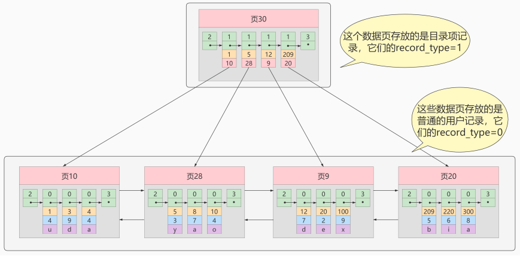
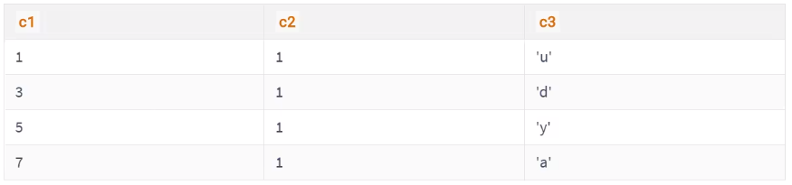
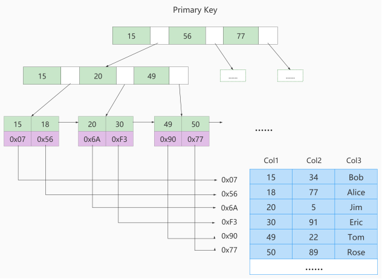
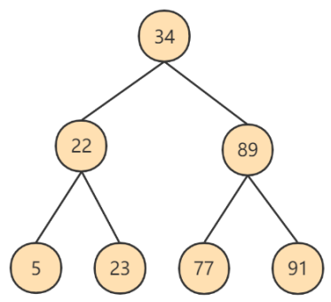
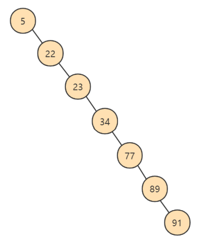
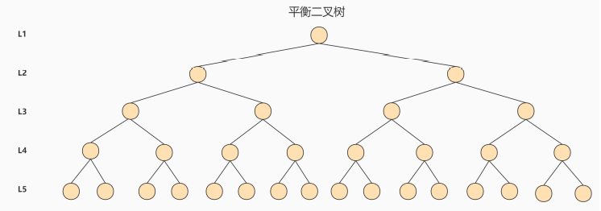
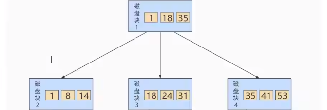

[TOC]

索引数据结构可视化(插入、删除动画演示)：https://www.cs.usfca.edu/~galles/visualization/about.html

# 第06章_索引的数据结构

## 1. 为什么使用索引

索引是存储引擎中用于快速查找数据记录的一种数据结构，类似教科书的目录，先通过目录找到文章的页码，再定位到具体的文章。MySQL进行数据查找时，首先查看查询条件是否命中某条索引，**<font color=red>是则通过索引查找相关数据，否则进行全表扫描</font>**。


如上图所示，数据库未建索引的情况下，数据`分布在硬盘不同的位置上面`，读取数据时，摆臂需要前后摆动查询数据，非常耗时。如果`数据顺序摆放`，也需要从1到6行按顺序读取，这样就相当于进行了6次IO操作，`依旧非常耗时`。如果我们不借助任何索引结构辅助快速定位数据的话，查找 Col 2 = 89 这条记录，就要逐行查找比较：从Col 2 = 34 开始比较，发现不是，继续下一行。我们当前的表只有不到10行数据，但若表很大的话（`上千万条数据`)，则要做`很多次硬盘I/0`才能找到。现在要查找 Col 2 = 89 这条记录，CPU必须先去磁盘查找这条记录，找到之后加载到内存，再对数据进行处理。这个过程**<font color=red>最耗时的就是磁盘I/O</font>**（涉及到磁盘的旋转时间（速度较快），磁头的寻道时间(速度慢、费时)）

假设对数据使用 `二叉树` 进行存储，如下所示：


对字段 Col 2 添加索引，就相当于在硬盘上为 Col 2 维护了一个索引的数据结构，即这个 `二叉搜索树`。二叉搜索树的每个结点存储的是 `(K, V) 结构`，key 是 Col 2，value 是该 key 所在行的文件指针（地址）。比如：该二叉搜索树的根节点就是：`(34, 0x07)`。现在对 Col 2 添加了索引，这时再去查找 Col 2 = 89 这条记录的时候会先去查找该二叉搜索树（二叉树的遍历查找）。读 34 到内存，89 > 34，继续右侧数据；读 89 到内存，89==89；找到数据返回。找到之后根据当前结点的 value 地址快速定位到具体数据。可以发现，只需要 `查找两次` 就可以定位到记录的地址。

从上面的例子可以看出，<font color=red>**建立索引的目的是为了 减少磁盘I/O的次数，加快查询速率**</font>。

## 2. 索引及其优缺点

### 2.1 索引概述

MySQL官方对索引的定义为：**<font color=blue>帮助MySQL高效获取数据的数据结构</font>**。

**索引的本质**：索引是数据结构。你可以简单理解为“排好序的快速查找数据结构”，满足特定查找算法。 这些数据结构以某种方式指向数据， 这样就可以在这些数据结构的基础上实现 `高级查找算法` 。

`索引是在存储引擎中实现的`，因此每种存储引擎的索引不一定完全相同，并且每种存储引擎不一定支持所有索引类型。同时，存储引擎可以定义每个表的 `最大索引数`和 `最大索引长度`。所有存储引擎支持每个表至少16个索引，总索引长度至少为256字节。有些存储引擎支持更多的索引数和更大的索引长度。

### 2.2 优点

（1）降低 **<font color=blue>数据库的IO成本</font>** ，这是创建索引最主要的原因。 

（2）通过创建唯一索引，可以保证数据库表中每一行 **数据的唯一性** 。 

（3）在实现数据的 参考完整性方面，可以 **加速表和表之间的连接** 。换句话说，对于有依赖关系的子表和父表联合查询时， 可以提高查询速度。 

（4）在使用分组和排序子句进行数据查询时，可以显著 **减少查询中分组和排序的时间** ，降低了CPU的消耗。

### 2.3 缺点 

增加索引也有许多不利的方面，主要表现在如下几个方面： 

（1）创建索引和维护索引要 **耗费时间** ，并且随着数据量的增加而会增加。 

（2）索引需要占用 **磁盘空间** ，除了数据表占数据空间之 外，每一个索引还要占一定的物理空间， 存储在磁盘上 ，如果有大量的索引，索引文件就可能比数据文件更快达到最大文件尺寸。 

（3）虽然索引大大提高了查询速度，但却会 **降低更新表的速度** 。当对表中的数据进行增加、删除和修改时，需要进行索引的维护。 

因此，选择使用索引时，要综合考虑索引的优点和缺点。

> 提示：
>
> 索引可以提高查询的速度，但会影响插入记录的速度。因此，<font color=red>**最好的办法是先删除表中的索引，然后插入数据，插入完成后再创建索**</font>引。

## 3. InnoDB中索引的推演

### 3.1 索引之前的查找

先来看一个精确匹配的例子：

```mysql
SELECT [列名列表] FROM 表名 WHERE 列名 = xxx;
```

#### 1. 在一个页中的查找

假设目前表中的记录比较少，所有的记录都可以被存放到一个页中，在查找记录的时候可以根据搜索条件的不同分为两种情况：

* 以主键为搜索条件

  可以在页目录中使用 `二分法` 快速定位到对应的槽，然后再遍历该槽分组中的记录即可快速找到指定记录。

* 以其他列作为搜索条件

  因为在数据页中并没有对非主键列建立所谓的页目录，所以无法通过二分法快速定位相应的槽。这种情况下只能从 `最小记录` 开始 `依次遍历单链表中的每条记录`， 然后对比每条记录是否符合搜索条件（**低效查找**）。

#### 2. 在很多页中查找

在很多页中查找记录的活动可以分为两个步骤：

1. 定位到记录所在的页。
2. 从所在的页内中查找相应的记录。

在没有索引的情况下，不论是根据主键列或者其他列的值进行查找，由于无法快速定位到记录所在页，只能从第一个页沿着双向链表 一直往下找，在每个页中根据上面的查找方式去查找指定的记录。因为要遍历所有数据页，所以这种方式 非常耗时 。

为解决上述问题， 索引应运而生。

### 3.2 设计索引

建表：

```mysql
mysql> CREATE TABLE index_demo(
-> c1 INT,
-> c2 INT,
-> c3 CHAR(1),
-> PRIMARY KEY(c1)
-> ) ROW_FORMAT = Compact;
```

这个新建的 **index_demo** 表中有2个INT类型的列，1个CHAR(1)类型的列，设置c1列为主键， 并使用 **Compact** 行格式来存储记录，下面是index_demo表行格式简化示意图：


我们只在示意图里展示记录的这几个部分：

* record_type ：记录的类型， 0 普通记录、 2 最小记 录、 3 最大记录、 1 目录项记录。 
* next_record ：下一条记录相对本条记录的地址偏移量。 
* 各个列的值 ：这里只记录在 index_demo 表中的三个列，分别是 c1 、 c2 和 c3 。 
* 其他信息 ：除了上述3种信息以外的所有信息，包括其他隐藏列的值以及记录的额外信息。

将其他信息项暂时去掉并竖放，然后插入一些记录到数据页，效果如下：


#### 1. 一个简单的索引设计方案

在根据某个搜索条件查找一些记录时为何要遍历所有数据页呢？因为各个页中的记录没有规律，不知道搜索条件匹配到哪些页中的记录，所以必须遍历所有数据页。为快速定位到需要查找的记录在哪些数据页，可以为数据页建立目录 ，且必须满足：

* **<font color=red>有序：下一个数据页中用户记录的主键值必须大于上一个页中用户记录的主键值。</font>**

  假设：每个数据页最多能存放3条记录（实际上一个数据页非常大，可以存放下好多记录）。

  ```mysql
  INSERT INTO index_demo VALUES(1, 4, 'u'), (3, 9, 'd'), (5, 3, 'y');
  ```

​       那么这些记录按照主键值的大小串联成一个单向链表，如图所示：


​      可以看出来， index_demo 表中的3条记录都被插入到了编号为10的数据页中了，此时再来插入一条记录：

```mysql
INSERT INTO index_demo VALUES(4, 4, 'a');
```

因为 **页10** 最多只能放3条记录，所以必须再分配一个新页：


注意：新分配的 **数据页编号可能并不是连续的**，页与页间通过 **链表** 连接。另外，**页10**中用户记录最大的主键值是5，而**页28**中有一条记录的主键值是4，因为5>4，不符合下一个数据页中用户记录的主键值必须大于上一个页中用户记录的主键值的要求，所以在插入主键值为4的记录时需要进行一次**<font color=orange>页分裂</font>**：把主键值为5的记录移动到页28中，然后再把主键值为4的记录插入到页10中：


* **<font color=red>给所有的页建立一个目录项(索引)。</font>**

由于数据页的 **<font color=orange>编号可能不连续</font>** ，所以在向 index_demo 表中插入多条记录后，可能是这样的效果：


我们需要给它们做个 **目录**，每个页对应一个目录项，每个目录项包括下边两个部分：

1） **key** ：页的用户记录中最小主键值

2）**page_on** ：页号


只需把几个目录项在物理存储器上连续存储（比如：数组），就可实现根据主键值快速查找某条记录的功能。比如：查找主键值为 20 的记录，查找过程分两步：

1. 先从目录项中根据 二分法 快速确定主键值为 20 的记录在那个数据页中？ 目录项3（因为 12 < 20 < 209 ），它对应页9 。 
2. 再在页9 中定位具体的记录。

至此，针对数据页做的简易目录就完成了，<font color=red>**该目录有一个别名**</font>，称为 **<font color=red>索引</font>** 。

#### 2. InnoDB中的索引方案

##### ① 迭代1次：目录项记录的页

InnoDB通过 **record_type** 属性区分一条记录是普通的 **用户记录** 还是 **目录项记录** ，该字段取值：

* 0：普通用户记录
* 1：目录项记录
* 2：最小记录
* 3：最大记录

把前边使用到的目录项放到数据页中的样子就是这样：



从图中可以看出，新分配了一个编号为30的页来专门存储目录项记录。这里再次强调 **目录项记录** 和普通的 **用户记录** 的不同点：

* **目录项记录** 的 record_type 值是1，而 **普通用户记录** 的 record_type 值是0。 
* 目录项记录只有 **主键值和页的编号** 两个列，而普通的用户记录的列是用户自己定义的，可能包含 **很多列**（表中一条完整数据） ，另外还有InnoDB自己添加的隐藏列。 
* 了解：记录头信息里还有一个叫 **min_rec_mask** 的属性，只有在存储 **目录项记录** 的页中的主键值最小的 **目录项记录** 的 **min_rec_mask** 值为 **1** ，其他别的记录的 **min_rec_mask** 值都是 **0** 。

**相同点**：两者用的是一样的数据页，都会为主键值生成 **Page Directory （页目录）**，从而在按照主键值进行查找时可以使用 **二分法** 来加快查询速度。

以查找主键为 20 的记录为例，根据某个主键值去查找记录的步骤可大致分成如下两步：

1. 先到存储 目录项记录 的页，也就是页30中通过 二分法 快速定位到对应目录项，因为 12 < 20 < 209 ，所以定位到对应的记录所在的页就是页9。 
2. 再到存储用户记录的页9中根据 **<font color=red>二分法</font>** 快速定位到主键值为 20 的用户记录。

##### ② 迭代2次：多个目录项纪录的页


从图中可以看出，插入一条主键值为320的用户记录之后需要两个新的数据页：

* 为存储该用户记录而新生成了 页31 。 
* 原先存储目录项记录的 页30的容量已满 （假设只能存储4条目录项记录），所以必须新建一个页32来存放 页31 对应的目录项。

因为存储目录项记录的页不止一个，所以如果想根据主键值查找一条用户记录大致需要3个步骤，以查找主键值为 20 的记录为例：

1. 确定目录项记录页 ：现在的存储目录项记录的页有两个，即 页30 和 页32 ，因为页30表示的目录项的主键值的 范围是 [1, 320) ，页32表示的目录项的主键值大于等于 320 ，所以主键值为 20 的记录对应的目录项记录在 页30 中。 
2. 通过目录项记录页确定用户记录所在页（数据页）。 
3. 在数据页中定位具体的记录。

##### ③ 迭代3次：目录项记录页的目录页

如果表中的数据非常多则会`产生很多存储目录项记录的页`，怎么根据主键值快速定位一个存储目录项记录的页呢？那就为这些存储目录项记录的页再生成一个`更高级的目录`，就像是一个多级目录一样，`大目录里嵌套小目录`，小目录里才是实际的数据，所以现在各个页的示意图如下：


如图，生成了一个存储更高级目录项的 页33 ，这个页中的两条记录分别代表页30和页32，如果用 户记录的主键值在 [1, 320) 之间，则到页30中查找更详细的目录项记录，如果主键值 不小于320 的 话，就到页32中查找更详细的目录项记录。

可以用下边这个图来描述它：


这个数据结构，就是 B+树 。

问题：<font color=red>**页与页之间为什么用双向链表连接**？</font>

为了支持从大到小和从小到大两种排序方式，反向排序直接反向加载页即可。


##### ④ B+Tree

一个B+树的节点可以分成好多层，规定最下边的那层，也就是存放用户记录的为第 0 层， 之后依次往上加。之前做了一个非常极端的假设：存放用户记录的页 最多存放3条记录 ，存放目录项 记录的页 最多存放4条记录 。其实真实环境中一个页(**<font color=red>16KB</font>**)存放的记录数量是非常大的，假设所有存放用户记录 的叶子节点代表的数据页可以存放 100条用户记录 ，存放目录项记录的内节点代表的数据页可以存 放 1000条目录项记录 ，那么：

* 如果B+树只有1层，也就是只有1个用于存放用户记录的节点，最多能存放 100 条记录。
* 如果B+树有2层，最多能存放 1000×100=10,0000 条记录。 
* 如果B+树有3层，最多能存放 1000×1000×100=1,0000,0000 条记录。 
* 如果B+树有4层，最多能存放 1000×1000×1000×100=1000,0000,0000 条记录。相当多的记录！

你的表里能存放 **100000000000** 条记录吗？所以一般情况下，用到的 **<font color=red>B+树不会超过4层</font>** ，通过主键值去查找某条记录最多只需要做4个页面内的查找（查找3个目录项页和一个用户记录页），又因为在每个页面内有所谓的 **Page Directory** （页目录），所以在页面内也可以通过 **二分法** 快速定位。

### 3.3 常见索引概念

按照物理实现方式，索引可以分为 2 种：聚簇（聚集）和非聚簇（非聚集）索引。非聚集索引也称为“二级索引”或“辅助索引”。

#### 1. 聚簇索引(基于主键构建)

聚簇索引并不是一种单独的索引类型，而是**一种数据存储方式**（所有的用户记录都存储在了叶子结点），也就是所谓的 **<font color=red>索引即数据，数据即索引</font>**。

> 术语"聚簇"表示当前数据行和相邻的键值聚簇的存储在一起

**特点：**

* 使用记录主键值的大小进行记录和页的排序，包括三个方面的含义： 

  * `页内` 的记录是按照主键的大小顺序排成一个 `单向链表` 。 
  * 各个存放 `用户记录的页` 也是根据页中用户记录的主键大小顺序排成一个 `双向链表` 。 
  * 存放 `目录项记录的页` 分为不同的层次，在同一层次中的页也是根据页中目录项记录的主键大小顺序排成一个 `双向链表` 。 

* B+树的 叶子节点 存储完整的用户记录。 

  所谓完整的用户记录，就是指这个记录中存储了所有列的值（包括隐藏列）。

我们把具有这两种特性的B+树称为聚簇索引，所有完整的用户记录都存放在这个`聚簇索引`的叶子节点。这种聚簇索引并不需要我们在MySQL语句中显式的使用INDEX 语句去创建， **<font color=red>InnDB 存储引擎会自动创建聚簇索引。</font>**

**优点：**

* **<font color=red>数据访问更快</font>** ，因为聚簇索引将索引和数据保存在同一个B+树中，因此从聚簇索引中获取数据比非聚簇索引更快 
* 聚簇索引对于主键的 **<font color=red>排序查找</font>** 和 **<font color=red>范围查找</font>** 速度非常快 
* 按照聚簇索引排列顺序，查询显示一定范围数据的时候，由于数据都是紧密相连，数据库不用从多 个数据块中提取数据，所以 **<font color=red>节省大量IO操作</font>** 。

**缺点：**

* **<font color=red>插入速度严重依赖于插入顺序</font>** ，按照主键的顺序插入是最快的方式，否则将会出现**页分裂**，严重影响性能。因此，对于InnoDB表，一般都会定义一个**<font color=red>自增的ID列为主键</font>**
* **<font color=red>更新主键的代价高</font>** ，因为将会导致被更新的行移动。因此，对于InnoDB表，一般定义**<font color=red>主键为不可更新</font>**
* **<font color=red>二级索引访问需要两次索引查找</font>** ，第一次找到主键值，第二次根据主键值找到行数据


注意：<font color=oran>**自增主键，假设已插入主键1~5的数据，然后删掉主键4-5，再插入1条记录其主键是多少？**</font>

- 不重启：主键为6
- 重启：主键为4

原因：自增主键由一个AUTO_INCREMENT的变量<font color=oran>**保存在内存中，没有做持久化**</font>，重启后会重新计算表中主键的最大值。


**限制：**

- MySQL只有InnoDB支持聚簇索引，MyISAM不支持
- 每个MySQL表只能有一个聚簇索引，一般情况下就是该表的主键
- **<font color=red>若没定义主键，InnoDB会选择非空的唯一索引替代。若没有这样的索引，会隐式定义一个主键作为聚簇索引</font>**
- 为充分利用聚簇索引特性，**<font color=red>主键尽量选择有序id</font>**，无序id如UUID、MD5、Hash、字符串等无法保证数据顺序增长

#### 2. 二级索引（辅助索引、非聚簇索引,不是根据主键构建的索引）

如果我们想以别的列作为搜索条件该怎么办？肯定不能是从头到尾沿着链表依次遍历记录一遍。

答案：可以`多建几颗B+树`，**<font color=red>存主键和其他列（作为排序）,根据排序的列找到主键，再通过主键定位到具体的数据</font>**。比如用`c2`列的大小作为数据页、页中记录的排序规则，再建一课B+树，效果如下图所示：


**概念：回表 **

根据这个以c2列大小排序的B+树只能确定要查找记录的主键值，如果想查找到完整的用户记录，**<font color=red>仍需要到 聚簇索引 中再查一遍</font>**，该过程称为<font color=red>**回表** </font>，也就是根据c2列的值查询一条完整的用户记录**<font color=red>需要使用到 2 棵B+树</font>**！

**问题**：可以直接把完整的用户记录放到叶子节点吗，省去回表？

**回答**：浪费存储空间。


这种按照`非主键列`建立的B+树需要一次回表操作才可以定位到完整的用户记录，所以这种B+树被称为**<font color=red>二级索引</font>**（辅助索引）。由于使用的是c2列的大小作为B+树的排序规则，所以也称这个B+树为c2列建立的索引。

非聚簇索引的存在不影响数据在聚簇索引中的组织，所以一张表可以有多个非聚簇索引。


**<font color=red>聚簇索引与非聚簇索引的区别</font>**：

前者根据主键排序；后者根据其他列（非主键排序），查找时需要根据其他列找到主键，然后再用主键到聚簇索引中找到真实数据。


小结：聚簇索引与非聚簇索引的原理不同，在使用上也有区别：

1. 聚簇索引的`叶子节点`存储数据记录`, 非聚簇索引的叶子节点存储的是`数据位置。非聚簇索引不会影响数据表的物理存储顺序。
2. **<font color=red>一个表只能有一个聚簇索引</font>**，但**<font color=red>可有多个非聚簇索引</font>**，也就是多个索引目录提供数据检索。
3. 使用聚簇索引的时候，数据的`查询效率高`，但如果对数据进行插入，删除，更新等操作，效率会比非聚簇索引低。

#### 3.联合索引(属于非聚簇索引)

同时以多个列的大小作为排序规则，建立索引，比如让B+树按照 c2和c3列 的大小进行排序： 

* 先把各个记录和页按照c2列进行排序。 
* 在记录的c2列相同的情况下，采用c3列进行排序 

为c2和c3建立的索引的示意图如下：


注意以下几点：

* 每条目录项都有c2、c3、页号这三个部分组成；各条记录先按照c2列的值排序，若c2列相同，再按照c3列的值排序
* B+树叶子节点处的用户记录由c2、c3和主键c1列组成

注意一点，以c2和c3列的大小为排序规则建立的B+树称为 联合索引 ，本质上也是一个二级索引。它与分别为c2和c3列分别建立索引不同： 

* 建立 联合索引 只会建立如上图一样的1棵B+树。 
* 为c2和c3列分别建立索引会分别以c2和c3列的大小为排序规则建立2棵B+树。

### 3.4 InnoDB的B+树索引的注意事项

#### 1. 根页面位置万年不动

前面介绍B+树时，为了方便理解，是从下往上的，先画存储用户记录的叶子节点（数据项），再往上抽取目录项，而实际上**<font color=red>B+树的形成是从上往下</font>**的：

* 每当为某个表创建一个B+树索引（聚簇索引非人为创建，默认就有）时，都会为该索引创建一个 `根结点` 页面。最开始表中没有数据时，每个B+树索引对应的 `根结点` 中既没有用户记录，也没有目录项记录。
* 随后向表中插入用户记录时，先把用户记录存储到这个`根节点` 中。
* 当根节点中的可用 `空间用完时` 继续插入记录，此时会将根节点中的所有记录复制到一个新分配的页，比如 `页a` 中，然后对这个新页进行 `页分裂` 操作，得到另一个新页，比如`页b` 。这时新插入的记录根据键值（也就是聚簇索引中的主键值，二级索引中对应的索引列的值）的大小就会被分配到 `页a` 或者 `页b` 中，而 `根节点` 便升级为存储目录项记录的页。

这个过程特别注意的是：一个B+树索引的**<font color=red>根节点自诞生之日起，便不会再移动</font>**。这样只要对某个表建立一个索引，那么它的根节点的页号便会被记录到某个地方。然后凡是 `InnoDB` 存储引擎需要用到这个索引的时候，都会从这个固定的地址取出根节点的页号，从而来访问这个索引。

#### 2. 内节点中目录项记录的唯一性

B+树索引的内节点中目录项记录的内容是 `索引列 + 页号` 的搭配，但是这个搭配对于二级索引来说有点不严谨。以 index_demo 表为例，假设这个表中的数据是这样的：



如果二级索引中目录项记录的内容只是 `索引列 + 页号` 的搭配的话，那么为 `c2` 列建立索引后的B+树长这样：


如果想新插入一行记录，其中 `c1` 、`c2` 、`c3` 的值分别是: `9`、`1`、`c`, 那么在修改这个为 c2 列建立的二级索引对应的 B+ 树时便碰到了个大问题：由于 `页3` 中存储的目录项记录是由 `c2列 + 页号` 的值构成的，`页3` 中的两条目录项记录对应的 c2 列的值都是1，而`新插入的这条记录` 的 c2 列的值也是 `1`，那这条新插入的记录到底应该放在 `页4` 中，还是放在 `页5` 中？

为了让新插入记录找到自己在那个页面，需要**保证在B+树的同一层页节点的目录项记录除页号这个字段以外是唯一的**。所以对于二级索引的内节点的目录项记录的内容实际上是由三个部分构成的：

* 索引列的值
* 主键值
* 页号

也就是把`主键值`也添加到二级索引内节点中的目录项记录，这样就能保住 B+ 树每一层节点中各条目录项记录除页号这个字段外是唯一的，所以为c2建立二级索引后的示意图实际上应该是这样子的：


这样再插入记录`(9, 1, 'c')` 时，由于 `页3` 中存储的目录项记录是由 `c2列 + 主键 + 页号` 的值构成的，可以先把新纪录的 `c2` 列的值和 `页3` 中各目录项记录的 `c2` 列的值作比较，如果 `c2` 列的值相同的话，可以接着比较主键值，因为B+树同一层中不同目录项记录的 `c2列 + 主键`的值肯定是不一样的，所以最后肯定能定位唯一的一条目录项记录，在本例中最后确定新纪录应该被插入到 `页5` 中。

#### 3. 一个页面最少存储 2 条记录

一个B+树只需要很少的层级就可以轻松存储数亿条记录，查询速度相当不错！这是因为B+树本质上就是一个大的多层级目录，每经过一个目录时都会过滤掉许多无效的子目录，直到最后访问到存储真实数据的目录。那如果一个大的目录中只存放一个子目录是个啥效果呢？那就是目录层级非常非常多，而且最后的那个存放真实数据的目录中只存放一条数据。所以 **InnoDB 的一个数据页至少可以存放两条记录**。

## 4. MyISAM中的索引方案

B树索引使用存储引擎如表所示：

| 索引 / 存储引擎 | MyISAM | InnoDB | Memory |
| --------------- | ------ | ------ | ------ |
| B-Tree索引      | 支持   | 支持   | 支持   |

即使多个存储引擎支持同一种类型的索引，但是他们的实现原理也是不同的。Innodb和MyISAM默认的索 引是Btree索引；而Memory默认的索引是Hash索引。

MyISAM引擎使用 B+Tree 作为索引结构，叶子节点的data域存放的是 数据记录的地址 。

### 4.1 MyISAM索引的原理

**<font color=orange>InnoDB中索引即数据</font>**，聚簇索引的B+树叶子节点包含所有完整的用户记录；MylSAM索引虽然也使用树形结构，但却<font color=orange>**将索引和数据分开存储**</font>：

-  将表中的记录<font color=orange>按照插入顺序</font>单独存储在<font color=orange>**数据文件**</font>中。该文件不划分若干个数据页，有多少记录就往里面添加多少记录。由于在插入时未刻意按主键大小排序，故无法在这些数据上使用二分法进行查找。 
- 使用MylSAM存储引擎的表会把索引信息单独存储到另一个**<font color=orange>索引文件</font>**中。MylSAM会单独为表的主键创建一个索引, 不过在索引的叶子节点中存储的不是完整的用户记录，而是 <font color=orange>主健值+数据记录地址</font> 的组合。



这里设表一共有三列，以Col1为主键，上图是MylSAM表的主索引(Primary key)示意。可以看出<font color=orange>**MylSAM的索引文件仅仅保存数据记录的地址**</font>。在MylSAM中，主键索引和二级索引(Secondary key)在结构上无任何区别，只是主键索引要求key是唯一的，而二级索弓I的key可以重复。如果我们在Col2上建立一个二级索引，则此索引的结构如下图所示：


同样也是一棵B+Tree, data域保存数据记录的地址.因此，MylSAM中索引检索的算法为：首先按照B+Tree搜索算法搜索索引，如果指定的Key存在，则取出其data域的值，然后以data域的值为地址，读取相应数据记录。

### 4.2 MyISAM 与 InnoDB对比

**MyISAM的索引方式都是“非聚簇”的，与InnoDB包含1个聚簇索引是不同的。小结两种引擎中索引的区别：**

① 在InnoDB存储引擎中，我们只需要根据主键值对 聚簇索引 进行一次查找就能找到对应的记录，而在 MyISAM 中却需要进行一次 回表 操作，意味着MyISAM中建立的索引相当于全部都是 二级索引 。

 ② InnoDB的数据文件本身就是索引文件，而MyISAM索引文件和数据文件是 分离的 ，索引文件仅保存数 据记录的地址。

 ③ InnoDB的非聚簇索引data域存储相应记录 主键的值 ，而MyISAM索引记录的是 地址 。换句话说， InnoDB的所有非聚簇索引都引用主键作为data域。

 ④ MyISAM的回表操作是十分 快速 的，因为是拿着地址偏移量直接到文件中取数据的，反观InnoDB是通 过获取主键之后再去聚簇索引里找记录，虽然说也不慢，但还是比不上直接用地址去访问。 

⑤ InnoDB要求表 必须有主键 （ MyISAM可以没有 ）。如果没有显式指定，则MySQL系统会自动选择一个 可以非空且唯一标识数据记录的列作为主键。如果不存在这种列，则MySQL自动为InnoDB表生成一个隐 含字段作为主键，这个字段长度为6个字节，类型为长整型。


**小结：** 

了解不同存储引擎的索引实现方式对于正确使用和优化索引都很有帮助。例如：

举例1：知道了InnoDB的索引实现后，很容易明白**<font color=orange>为什么不建议使用过长的字段作为主键</font>**，因为所有二级索引都引用主键索引，过长的主键索引会令二级索引变得过大。

举例2：用非单调的字段作为主键在InnoDB中不是个好主意，因为InnoDB数据文件本身是一棵B+Tree，非单调的主键会造成在插入新记录时，数据文件为了维持B+Tree的特性而频繁的分裂调整，十分低效，而<font color=orange>**使用自增字段作为主键**</font>是一个很好的选择。


## 5. 索引的代价

索引是个好东西，可不能乱建，它在空间和时间上都会有消耗：

* 空间上的代价

  每建立一个索引都要为它建立一棵B+树，每一棵B+树的每一个节点都是一个数据页，一个页默认会 占用 **<font color=red>16KB</font>** 的存储空间，一棵很大的B+树由许多数据页组成，那就是很大的一片存储空间。

* 时间上的代价

  每次对表中的数据进行 **<font color=red>增、删、改</font>** 操作时，都需要去修改各个B+树索引。而且B+树每层节点都是按照索引列的值 **<font color=red>从小到大的顺序排序</font>** 而组成了 **<font color=red>双向链表></font>** 。不论是用户记录还是目录项记录，都是按照索引列的值从小到大的顺序形成一个单向链表，而增、删、改操作可能会对节点和记录的排序造成破坏，所以存储引擎需 要额外的时间进行一些 **<font color=red>记录移位 ， 页面分裂 、 页面回收</font>** 等操作来维护好节点和记录的排序。如果建了许多索引，每个索引对应的B+树都要进行相关的维护操作，会给性能拖后腿。

> 一个表上索引建的越多，就会占用越多的存储空间，在增删改记录的时候性能就越差。为了能建立又好又少的索引，我们得学学这些索引在哪些条件下起作用的。

## 6. MySQL数据结构选择的合理性

从MySQL的角度讲，不得不考虑一个现实问题就是磁盘IO。如果能让索引的数据结构尽量减少硬盘的I/O操作，所消耗的时间就越小。可以说，**<font color=orange>磁盘I/O操作次数对索引的使用效率至关重要</font>**。

 查找都是索引操作，一般来说索引非常大，尤其是关系型数据库，当数据量比较大的时候，索引的大小有可能高达几个G甚至更多，为了减少索引在内存的占用，**<font color=orange>数据库索引是存储在外部磁盘上的</font>**。当利用索引查询的时候， **<font color=orange>不可能把整个索引全部加载到内存，只能逐一加载</font>**，那么**<font color=orange>MySQL衡量查询效率的标准就是磁盘IO次数</font>**。


**<font color=red>为什么选择B+树而非其他数据结构作为索引？</font>**

目标：尽可能减少磁盘IO次数，磁盘IO比内存访问耗时得多。

- Hash: 
  - 不支持范围查询
  - 数据无序
  - 无法处理联合索引
  - 产生哈希碰撞时，需要遍历链表或红黑树，非常耗时，无法处理重复值多的列，比如年龄、性别


- 二叉搜索树：

  - 不平衡退化为链表，查询时间复杂度由$O(logn)$变为$O(n)$


- AVL树：

  - 每个节点只有2个子节点，树的高度较大，导致IO次数大


- B树：

  - 相比AVL树高度更小，每个节点的子节点数量更多
  - 非叶子节点既保存索引，也保存数据记录 ，造成查询效率不稳定，有时访问非叶子节点就可找到数据，有时得访问叶子节点才能找到数据。而B+树只有叶子节点才存放数据
  - B+树查询效率更高，比B树更矮胖，树高更小，磁盘IO次数更少


### 6.1 全表查询

全表扫描

### 6.2 Hash查询

Hash本身是一个函数，又被称为散列函数，它可以幅提升检索数据的效率。Hash算法是通过某种确定性的算法（比如MD5、SHA1、SHA2、SHA3） 将输入转变为输出。**<font color=orange>相同的输入永运可以得到相同的输出</font>**，假设输入内容有微小偏差，在输出中通常会有不同的结果。举例：如果想要睑证两个文件是否相同，不需要把两份文件直接拿来比对，只需要获取文件Hash值，然后在本地同样对文件进行Hash函数运算，最后通过比较这两个Hash值，就可以知道这两个文件是否相同。

**加快查找速度的数据结构，常见的有两类：**

(1) 树，例如平衡二叉搜索树，查询/插入/修改/删除的平均时间复杂度都是 `O(log2N)`;

(2)哈希，例如HashMap，查询/插入/修改/删除的平均时间复杂度都是 `O(1)`; (key, value)


采用Hash进行检索效率非常高，基本上一次检索就可以找到数据，而B+树需要自顶向下依次查找，多次访问节点才能找到数据，中间需要多次I/0操作，**<font color=orange>从效率来说Hash比B+树更快</font>**。在哈希的方式下，一个元素k处于h(k)中，即利用哈希函数h，根据关键字k计算出槽的位置。函数h将关键字域映 射到哈希表T[O...mr]的槽位上。


上图中哈希函数h有可能将两个不同的关键字映射到相同的位置，这叫做 碰撞 ，在数据库中一般采用 链 接法 来解决。在链接法中，将散列到同一槽位的元素放在一个链表中，如下图所示：


实验：体会数组和hash表的查找方面的效率区别

```mysql
// 算法复杂度为 O(n)
@Test
public void test1(){
    int[] arr = new int[100000];
    for(int i = 0;i < arr.length;i++){
        arr[i] = i + 1;
    }
    long start = System.currentTimeMillis();
    for(int j = 1; j<=100000;j++){
        int temp = j;
        for(int i = 0;i < arr.length;i++){
            if(temp == arr[i]){
                break;
            }
        }
    }
    long end = System.currentTimeMillis();
    System.out.println("time： " + (end - start)); //time： 823
}
```

```mysql
// 算法复杂度为 O(1)
@Test
public void test2(){
    HashSet<Integer> set = new HashSet<>(100000);
    for(int i = 0;i < 100000;i++){
    	set.add(i + 1);
    }
    long start = System.currentTimeMillis();
    for(int j = 1; j<=100000;j++) {
        int temp = j;
        boolean contains = set.contains(temp);
    }
    long end = System.currentTimeMillis();
    System.out.println("time： " + (end - start)); //time： 5
}
```

**Hash结构效率高，那为什么索引结构要设计成树型呢？**

原因1： Hash索引仅能满足 (=)  (<>)  和 IN 查询。如果进行<font color=orange>**范围查询**</font>，时间复杂度会退化为 O(n)；而树型的"有序"特性，依然能够保持O(logN)的高效率。 

原因2: Hash索引还有一个缺陷，数据存储是<font color=orange>**无序**</font>的，在ORDER BY情况下，使用Hash索引需要对数据重新排序。 

原因3:对于联合索引的情况，Hash值是将联合索引健合并后一起来计算的，无法对单独的一个键或者几个索引键进行查询。

原因4:对于等值查询来说，通常Hash索引的效率更高，不过也存在一种情况，就是<font color=orange>**索引列的重复值如果很多，效率就会很低**</font>。这是因为遇到Hash冲突时，需要遍历桶中的行指针来进行比较，找到查询的关键字，非常耗时。所以，Hash索引通常不会用到重复值多的列上，比如列为性别、年龄的情况等。

**Hash索引适用存储引擎如表所示：**

| 索引 / 存储引擎 | MyISAM | InnoDB | Memory |
| --------------- | ------ | ------ | ------ |
| HASH索引        | 不支持 | 不支持 | 支持   |

**Hash索引的适用性：**

Hash索引存在着很多限制，相比之下在数据库中B+树索引的使用面更广，不过也有一些场景采用Hash索引效率更高，比如在键值型(Key-Value)数据库中，<font color=orange>**Redis存储的核心就足Hash表**</font>。 MySQL中的Memory存储引擎支持Hash存储，如果需要用到查询的临时表时，就可以选择Memory存储引 擎，把某个字段设置为Hash索引，比如字符串类型的字段，进行Hash计算之后长度可以缩短到几个字节。当字 段的重复度低，而且经常需要进行<font color=orange>**等值查询**</font>时，Hash索引是个不错的选择。 另外，InnoDB本身不支持Hash索引，但提供<font color=orange>**自适应Hash索引**</font>(Adaptive Hash Index) 。什么情况下才会使用自适应Hash索引呢？如果某个数据经常被访问，当满足一定条件时，就会将这个数据页的地址存放到 Hash表中。下次查询时，可以直接找到这个页面的所在位置，这样让B+树也具备了 Hash索引的优点。


采用自适应 Hash 索引目的是方便根据 SQL 的查询条件加速定位到叶子节点，特别是当 B+ 树比较深的时 候，通过自适应 Hash 索引可以明显提高数据的检索效率。可以通过 innodb_adaptive_hash_index 变量来查看是否开启了自适应 Hash，比如：

```mysql
mysql> show variables like '%adaptive_hash_index';
```

### 6.3 二叉搜索树

利用二叉树作为索引结构，磁盘的IO次数和索引树的高度是相关的。

**1. 二叉搜索树的特点**

* 一个节点最多两个子节点
* 左子节点 < 本节点<右子节点 

**2. 查找规则**

二叉搜索树搜索和插入节点的规则一样，假设搜索插入的值为key：

- 若key>根节点：在右子树中进行查找
- 若key<根节点：在左子树中进行查找
- 若key=根节点：找到

举例，数列（34，22，89，5，23，77，91）创造出的二叉搜索树如下：



特殊情况，<font color=orange>**二叉树不平衡退化为链表，查找时间复杂度**由</font>$O(logn)$<font color=orange>**变为**</font>$O(n)$：



为提高查询效率，需要减少磁盘IO数（降低树的高度） ，把 原来“瘦高”的树结构变“矮胖”，树每层的分叉越多越好。

### 6.4 AVL树

为解决二叉树退化为链表的问题，平衡二叉搜索树（AVL）在二叉搜索树的基础上加了如下约束：平衡因子（右子树的高-左子树的高）绝对值不超过1，且每棵子树也都是AVL树，若不平衡则通过旋转（LL、RR、LR、RL）使其重新平衡。常见的二叉平衡树包括：AVL、红黑树、数堆、伸展树。AVL树的搜索时间复杂度为$O(log n)$。



每访问一次节点就需要进行一次磁盘 I/O ，对于上面的树来说，需要进行 5次 I/O 操作。虽然AVL查询效率比较稳定，但由于只有2个子节点，树的高度还是很大，造成频繁IO，影响整体查询效率。针对同样的数据，如果把二叉树改成 M 叉树 （M>2）呢？当 M=3 时，同样的 31 个节点可以由下面 的三叉树来进行存储：


可以看到此时树的高度降低了，当数据量 为N 以及树的分叉树为 M 时，M叉树的高度会远小于二叉树的高度 (M > 2)， 树从“瘦高” 变 “矮胖”。

### 6.5 B-Tree

B 树的英文是 Balance Tree，也就是 `多路平衡查找树`，简写为 B-Tree，它的高度远小于平衡二叉树的高度，它的结构如下图所示：


B树作为多路平衡查找树，它的每个节点最多可包含M个子节点，<font color=orange>**M称为B树的阶**</font>。每个磁盘块中包括<font color=orange>**关键字**</font>和<font color=orange>**子节点的指针**</font>。如果一个磁盘块中包括x个关键字，那么指针数就是x+1。对于一个100阶的B树来说，如果有3层最多可存储100万的索引数据。对于大量的索引数据来说，采用B树的结构是非常适合的，因为书的高度远小于二叉树。

一个 M 阶的 B 树（M>2）有以下的特性：

1. 根节点的儿子数的范围是 [2,M]。 
2. 每个中间节点包含 k-1 个关键字和 k 个孩子，孩子的数量 = 关键字的数量 +1，k 的取值范围为 [ceil(M/2), M]。 
3. 叶子节点包括 k-1 个关键字（叶子节点没有孩子），k 的取值范围为 [ceil(M/2), M]。 
4. 假设中间节点节点的关键字为：Key[1], Key[2], …, Key[k-1]，且关键字按照升序排序，即 Key[i]<Key[i+1]。此时 k-1 个关键字相当于划分了 k 个范围，也就是对应着 k 个指针，即为：P[1], P[2], …, P[k]，其中 P[1] 指向关键字小于 Key[1] 的子树，P[i] 指向关键字属于 (Key[i-1], Key[i]) 的子树，P[k] 指向关键字大于 Key[k-1] 的子树。
5. 所有叶子节点位于同一层。

上面那张图所表示的 B 树就是一棵 3 阶的 B 树。我们可以看下磁盘块 2，里面的关键字为（8，12），它 有 3 个孩子 (3，5)，(9，10) 和 (13，15)，你能看到 (3，5) 小于 8，(9，10) 在 8 和 12 之间，而 (13，15) 大于 12，刚好符合刚才给出的特征。

如何用 B 树进行查找？假设待查找的关键字是 9 ，那么步骤可以分为以下几步：

1. 与根节点的关键字 (17，35）进行比较，9 小于 17 得到指针 P1； 
2. 按照指针 P1 找到磁盘块 2，关键字为（8，12），因为 9 在 8 和 12 之间，得到指针 P2； 
3. 按照指针 P2 找到磁盘块 6，关键字为（9，10），找到了关键字 9。

在 B 树的搜索过程中，比较的次数并不少，但如果把数据读取出来然后在内存中进行比较，这个时间就是可以忽略不计的。而读取磁盘块本身需要进行 I/O 操作，消耗的时间比在内存中进行 比较所需要的时间要多，是数据查找用时的重要因素。 B 树相比于平衡二叉树来说磁盘 I/O 操作要少 ， 在数据查询中比平衡二叉树效率要高。所以 只要树的高度足够低，IO次数足够少，就可以提高查询性能 。

<font color='orange'>**小结**</font>：

1. B树在插入和删除节点时如果导致树不平衡，就通过自动调整节点的位置来保持树的自平衡
2. 关键字集合分布在整棵树中，导致叶子节点和非叶子节点都存放数据，搜索有可能在非叶子节点结束。
3. 搜索性能等价于在关键字全集内做一次二分查找。


**再举例1：**


### 6.6 B+Tree

B+树是一种基于B树进行改造的多路搜索树，主流DBMS都支持B+树索引，比如MySQL，相比于B树，<font color=orange>**B+树更适合文件索引系统**</font>。

* MySQL官网说明：


**B+ 树和 B 树的差异在于以下几点：**

1. 有 k 个孩子的节点就有 k 个关键字。也就是孩子数量 = 关键字数，而 B 树中，孩子数量 = 关键字数 +1。
2. 非叶子节点的关键字也会同时存在在子节点中，并且是在子节点中所有关键字的最大（或最 小）。 
3. 非叶子节点仅用于索引，不保存数据记录，跟记录有关的信息都放在叶子节点中。而 B 树中， 非 叶子节点既保存索引，也保存数据记录 。 
4. 所有关键字都在叶子节点出现，叶子节点构成一个有序链表，而且叶子节点本身按照关键字的大 小从小到大顺序链接。

下图是一个B+树，阶数3，根节点中的关键字1、18、35分别是子节点（1，8，14），（18，24，31）和（35，41，53）中的最小值。每层父节点的关键字都会出现在下一层的子节点的关键字中，因此叶子节点中包括了所有的关键字信息，并且每一个叶子节点都有一个指向下一个节点的指针，这样就形成了一个链表。




比如想要查找关键字16，B+树会自顶向下逐层查找：

1. 与根节点的关键字（1，18，35）进行比较，16在1和18之间，得到指针P1（指向磁盘块2）
2. 找到磁盘块2，关键字为（1，8，14），因为16大于14，所以得到指针P3(指向磁盘块7)
3. 找到磁盘块7，关键字为（14，16，17），然后找到关键字16对应的完整数据。

整个过程共进行3次I/O操作，看起来B+树和B树的查询过程差不多，但B+树和B树的差异在于：B+树的中间节点不存储数据，这样的好处是：

- <font color=orange>**B+树查询效率更加稳定**</font>。因为B+树每次只有访问到叶子节点才能找到对应的数据，而B树中非叶子节点也会存储数据，这样就会造成查询效率不稳定，有时访问到了非叶子节点就能找到关键字，而有时需要访问叶子节点才能找到关键字。
- <font color=orange>**B+树的查询效率更高**</font>。因为B+树比B树更矮胖（非叶子节点不用存完整数据，每个数据页能存的条数更多，阶数更大，深度更低），查询所需的磁盘IO次数更少。
- 除了单个关键字的查询，<font color=orange>**在范围查询上，B+树的效率也比B树更高**</font>。因为所有的关键字都出现在B+树的叶子节点中，叶子节点之间会有指针，数据又是递增的，这使范围查找可以通过指针连接查找，而在B树中则需要通过中序遍历才能完成查询范围的查找，效率低很多。

> B 树和 B+ 树都可以作为索引的数据结构，在 MySQL 中采用的是 B+ 树。 但B树和B+树各有自己的应用场景，不能说B+树完全比B树好，反之亦然。


**思考题：为了减少IO，索引树会一次性加载吗？**

1、数据库索引是存储在磁盘上的，如果数据量很大，必然导致索引的大小也很大，超过几个G

2、当利用索引查询时，不可能将全部几个G的索引都加载进内存，能做的只能是：<font color=orange>**逐一加载每一个磁盘页**</font>，因为磁盘页对应着索引树的节点。

**思考题：B+树的存储能力如何？为何说一般查找行记录，最多只需1~3次磁盘IO**

InnoDB存储引擎中页大小为16KB，一般表的主键类型为INT（4个字节）或BIGINT（8个字节），指针类型一般4或8个字节，也就是说一个页（B+树中的一个节点）中大概存储16KB/（8B+8B)=1K个键值（为方便计算，这里的K取$10^3$，也就是说一个深度为3的B+树索引可以维护$10^9$=10亿条记录（这里假定一个数据页也存储了$10^3$​条记录数据）。

实际情况中每个节点可能不能填满，因此在数据库中，B+树的高度一般都在2~4层。MySQL的InnoDB存储引擎在设计时是将根节点常驻内存的，也就是查找某一键值的行记录时最多需要1-3次磁盘IO。

**思考题：为什么说B+树比B-树更适合实际应用中操作系统的文件索引和数据库索引？**

1、B+树的磁盘读写代价更低 ：B+树的内部结点并没有指向关键字具体信息的指针，因此其内部结点相对B树更小。如果把所有同一内部结点的关健字存放在同一盘块中，那么盘块所能容纳的关键字数量也越多。一次性读入内存中需要查找的关键字也越多，相对来说IO读写次数也就降低了。 

2、B+树的宣询效率更加稳定：由于非终结点并不是最终指向文件内容的结点，而只是叶子结点中关键字的索引。所以任何关键字的查找必须走一条从根结点到叶子结点的路。所有关键字查询的路径长度相同，导致每一个数据的查询效率相当。

**思考题：Hash 索引与 B+ 树索引的区别**

1、Hash索引<font color=orange>**不能进行范围查询**</font>，而B+树可以。因为Hash索引指向的数据是无序的，而B+树的叶子节点是个有序的链表。

2、Hash索引<font color=orange>**不支持联合索引的最左侧原则**</font>（即联合索引的部分索引无法使用），而B+树可以。对于联合索引来说，Hash索引在计算Hash值的时候是将索引键合并后再一起计算Hash值，所以不会针对每个索引单独计算Hash值。因此如果用到联合索引的一个或者几个索引时，联合索引无法被利用。 

3、Hash索引<font color=orange>**不支持ORDER BY排序**</font>，因为Hash索引指向的数据是无序的，因此无法起到排序优化的作用，而B+树索引数据是有序的，可以起到对该字段0RDER BY排序优化的作用。同理，也无法用Hash 索引进行<font color=orange>**模糊查询**</font>，而B+树使用LIKE进行模糊查询时，LIKE后面后模糊查询（比如%结尾）就可以起到优化作用。 

4、<font color=orange>**InnoDB不支持哈希索引**</font>

**思考题：Hash 索引与 B+ 树索引是在建索引的时候手动指定的吗？**

<font color=red>**InnoDB和MylSAM存储引擎，都默认采用B+树索引**</font>，无法使用Hash索引。InnoDB提供 的自适应Hash是不需要手动指定的，如果是Memory/Heap和NDB存储引擎，可以选择Hash索引。

### 6.7 R树

R-Tree在MySQL很少使用，仅支持 geometry数据类型 ，支持该类型的存储引擎只有myisam、bdb、 innodb、ndb、archive几种。举个R树在现实领域中能够解决的例子：查找20英里以内所有的餐厅。如果 没有R树你会怎么解决？一般情况下我们会把餐厅的坐标(x,y)分为两个字段存放在数据库中，一个字段记 录经度，另一个字段记录纬度。这样的话我们就需要遍历所有的餐厅获取其位置信息，然后计算是否满 足要求。如果一个地区有100家餐厅的话，我们就要进行100次位置计算操作了，如果应用到谷歌、百度 地图这种超大数据库中，这种方法便必定不可行了。R树就很好的 解决了这种高维空间搜索问题 。它把B 树的思想很好的扩展到了多维空间，采用了B树分割空间的思想，并在添加、删除操作时采用合并、分解 结点的方法，保证树的平衡性。因此，R树就是一棵用来 存储高维数据的平衡树 。相对于B-Tree，R-Tree 的优势在于范围查找。

| 索引 / 存储引擎 | MyISAM | InnoDB | Memory |
| --------------- | ------ | ------ | ------ |
| R-Tree索引      | 支持   | 支持   | 不支持 |

### 6.8 小结

使用索引可以帮助我们从海量数据中快速定位到想要的查找到的数据，不过索引也存在一些不足，比如占用存储空间、降低数据库写操作的性能，如果多个索引还会增减索引选择的时间。当使用索引时，需要平衡索引的利（<font color=orange>**提升查询效率**</font>）和弊（<font color=orange>**维护索引所需的代价**</font>）。在实际工作中，需要基于需求和数据本身的分布情况来确定是否使用索引，尽管索引不是万能的，但<font color=orange>**数据量大的时候不使用索引是不可想象的**</font>，毕竟索引可以提升数据检索的效率。