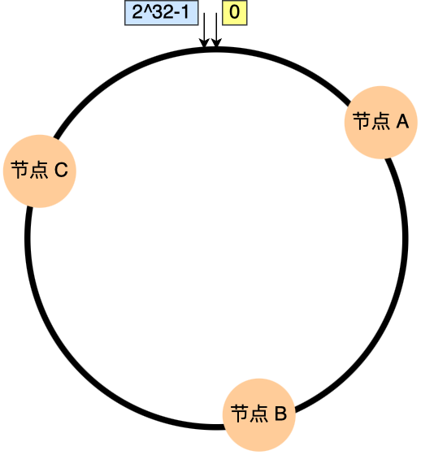

[toc]


# 1.负载均衡

参考：

https://www.xiaolincoding.com/os/8_network_system/hash.html

https://javaguide.cn/high-performance/load-balancing.html

## 1.1 问题背景

由于单机并发量和数据量有限，大多数网站都不只一台服务器提供服务，一般采用多台服务器构成集群来对外提供服务。那么多节点下，如何分配客户端的请求？该问题即负载均衡问题。负载均衡问题算法包括：随机法、轮询法（权重）、最快响应时间法、哈希法、一致性哈希、最小连接、最少活跃法等。


最简单的方式，引入一个中间的负载均衡层，让它将外界的请求「轮流」的转发给内部的集群。比如集群有 3 个节点，外界请求有 3 个，那么每个节点都会处理 1 个请求，达到了分配请求的目的。


考虑到每个节点的硬件配置有所区别，可以引入权重值，将硬件配置更好的节点的权重值设高，然后根据各个节点的权重值，按照一定比重分配在不同的节点上，让硬件配置更好的节点承担更多的请求，这种算法叫做加权轮询。

加权轮询算法使用场景是建立在每个节点存储的数据都是相同的前提。所以，每次读数据的请求，访问任意一个节点都能得到结果。但是，加权轮询算法是无法应对「分布式系统（数据分片的系统）」的，因为<font color=red>**分布式系统中，每个节点存储的数据是不同的**</font>。当我们想提高系统的容量，就会将数据水平切分到不同的节点来存储，也就是将数据分布到了不同的节点。比如<font color=red>**一个分布式 KV（key-valu） 缓存系统，某个 key 应该到哪个或者哪些节点上获得，应该是确定的，不是说任意访问一个节点都可以得到缓存结果的。**</font>

因此，需要一个能应对分布式系统的负载均衡算法。

## 1.2 一致性哈希

参考：https://www.xiaolincoding.com/os/8_network_system/hash.html

**一致性哈希是什么，使用场景，解决了什么问题？**


### 1.1.1 普通哈希算法的问题？

最简单的哈希算法就是取模运算，比如分布式系统中有 3 个节点，如果客户端要获取指定 key 的数据，可以基于 `hash(key) % 3` 公式对数据进行映射定位到节点。但有一个致命问题，<font color=red>**如果节点数量发生变化（扩缩容），必须迁移改变了映射关系的数据**</font>，否则会出现查询不到数据的问题。

举个例子，假设有一个由 A、B、C 三个节点组成分布式 KV 缓存系统，基于计算公式 `hash(key) % 3` 将数据进行了映射，每个节点存储了不同的数据：


现在有 3 个查询 key 的请求，分别查询 key-01，key-02，key-03 的数据，这三个 key 分别经过 hash() 函数计算后的值为 hash( key-01) = 6、hash( key-02) = 7、hash(key-03) = 8，然后再对这些值进行取模运算。通过这样的哈希算法，每个 key 都可以定位到对应的节点。


当 3 个节点不能满足业务需求时，增加一个节点，节点数量从 3 变为 4，意味取模哈希函数中基数的变化，这样会导致**大部分映射关系改变**，如下图：


比如，之前的 hash(key-01) % `3` = 0，变成了 hash(key-01) % `4` = 2，查询 key-01 数据时，寻址到了节点 C，而 key-01 的数据是存储在节点 A 上的，不是在节点 C，所以会查询不到数据。

同样，对分布式系统进行缩容，比如移除一个节点，也会因为取模哈希函数中基数变化，出现查询不到数据的问题。

要解决该问题，就需要我们进行**迁移数据**，比如节点的数量从 3 变化为 4 时，要基于新的计算公式 hash(key) % 4 ，重新对数据和节点做映射。假设总数据条数为 M，哈希算法在面对节点数量变化时，**最坏情况下所有数据都需要迁移，所以它的数据迁移规模是 O(M)**，这样数据的迁移成本太高了。所以，需要一个算法，来<font color=red>**避免分布式系统在扩容或者缩容时，发生过多的数据迁移**</font>。

### 1.1.2 一致性哈希

#### 1.1.2.1 算法原理

一致性哈希很好地解决了分布式系统在扩缩容时发生过多数据迁移的问题。

一致哈希算法也用了取模运算，但与哈希算法不同的是，哈希算法是对节点的数量进行取模运算，而**一致哈希算法是对 2^32 进行取模运算，是一个固定的值**。可以把一致哈希算法是对 2^32 进行取模运算的结果值组织成一个圆环，就像钟表一样，钟表的圆可以理解成由 60 个点组成的圆，而此处我们把这个圆想象成由 2^32 个点组成的圆，这个圆环被称为**哈希环**，如下图：


一致性哈希要进行两步映射：

- 对 key 进行哈希计算（对2^32 取模），确定此 key 在环上的位置；
- 从该位置沿着**顺时针方向走**，遇到的第一节点就是存储 key 的节点。


举个例子，有 3 个节点经过哈希计算，映射到了如下图的位置：



接着，对要查询的 key-01 进行哈希计算，确定此 key-01 映射在哈希环的位置，然后从这个位置往顺时针的方向找到第一个节点，就是存储该 key-01 数据的节点。比如，下图中的 key-01 映射的位置，往顺时针的方向找到第一个节点就是节点 A。


#### 1.2.2.2 如何避免扩缩容时数据迁移

知道了一致哈希寻址的方式，下面来看，如果增加一个节点或者减少一个节点会发生大量的数据迁移吗？

- 扩容

假设节点数量从 3 增加到了 4，新的节点 D 经过哈希计算后映射到了下图中的位置：


可以看到，key-01、key-03 都不受影响，只有 key-02 需要被迁移节点 D。

- 缩容

假设节点数量从 3 减少到了 2，比如将节点 A 移除：


可以看到，key-02 和 key-03 不会受到影响，只有 key-01 需要被迁移节点 B。


结论：<font color=red>**在一致哈希算法中，如果增加或者移除一个节点，仅影响该节点在哈希环上顺时针相邻的后继节点，其它数据也不会受到影响**</font>。

#### 1.2.2.3 通过虚拟节点提高均衡度（问题）

上面这些图中 3 个节点映射在哈希环还是比较分散的，所以看起来请求都会「均衡」到每个节点。但是**一致性哈希算法并不保证节点能够在哈希环上分布均匀**，这样就会带来一个问题，会有大量的请求集中在一个节点上。比如，下图中 3 个节点的映射位置都在哈希环的右半边：


这时有一半以上的数据的寻址都会找节点 A，也就是访问请求主要集中的节点 A 上，这违背了负载均衡的初衷。

另外，在这种节点分布不均匀的情况下，进行容灾与扩容时，哈希环上的相邻节点容易受到过大影响，容易发生雪崩式的连锁反应。

比如，上图中如果节点 A 被移除了，当节点 A 宕机后，根据一致性哈希算法的规则，其上数据应该全部迁移到相邻的节点 B 上，这样，节点 B 的数据量、访问量都会迅速增加很多倍，一旦新增的压力超过了节点 B 的处理能力上限，就会导致节点 B 崩溃，进而形成雪崩式的连锁反应。所以，<font color=red>**一致性哈希算法虽然减少了数据迁移量，但是存在节点分布不均匀的问题**</font>。

## 

要想解决上述问题，就要有大量的节点，节点数越多，哈希环上的节点分布的就越均匀。但问题是，实际中没有那么多节点。所以这个时候就加入**虚拟节点**，也就是对一个真实节点做多个副本。具体做法是，**不再将真实节点映射到哈希环上，而是将虚拟节点映射到哈希环上，并将虚拟节点映射到实际节点，所以这里有「两层」映射关系。**

比如对每个节点分别设置 3 个虚拟节点：

- 对节点 A 加上编号来作为虚拟节点：A-01、A-02、A-03
- 对节点 B 加上编号来作为虚拟节点：B-01、B-02、B-03
- 对节点 C 加上编号来作为虚拟节点：C-01、C-02、C-03

引入虚拟节点后，原本哈希环上只有 3 个节点的情况，就会变成有 9 个虚拟节点映射到哈希环上，哈希环上的节点数量多了 3 倍。


可以看到，**节点数量多了后，节点在哈希环上的分布就相对均匀了**。这时候，如果有访问请求寻址到「A-01」这个虚拟节点，接着再通过「A-01」虚拟节点找到真实节点 A，这样请求就能访问到真实节点 A 了。上面为了方便理解，每个真实节点仅包含 3 个虚拟节点，这样能起到的均衡效果其实很有限。而在实际的工程中，虚拟节点的数量会大很多，比如 Nginx 的一致性哈希算法，每个权重为 1 的真实节点就含有160 个虚拟节点。另外，虚拟节点除了会提高节点的均衡度，还会提高系统的稳定性。**当节点变化时，会有不同的节点共同分担系统的变化，因此稳定性更高**。比如，当某个节点被移除时，对应该节点的多个虚拟节点均会移除，而这些虚拟节点按顺时针方向的下一个虚拟节点，可能会对应不同的真实节点，即这些不同的真实节点共同分担了节点变化导致的压力。而且，有了虚拟节点后，还可以为硬件配置更好的节点增加权重，比如对权重更高的节点增加更多的虚拟机节点即可。因此，**带虚拟节点的一致性哈希方法不仅适合硬件配置不同的节点的场景，而且适合节点规模会发生变化的场景**。

## 1.3 总结

不同负载均衡算法适用的业务场景不同。

- 轮询：只适用于每个节点的数据都是相同的场景，访问任意节点都能请求到数据。<font color=red>**不适用分布式系统**</font>，因为分布式系统意味着数据水平切分到了不同的节点上，访问数据的时候，一定要寻址存储该数据的节点。
- 哈希: 虽然能建立数据和节点的映射关系，但是每次在节点数量发生变化的时候，最坏情况下所有数据都需要迁移，这样太麻烦了，所以不适用节点数量变化的场景。

为了减少迁移的数据量，就出现了一致性哈希算法。

- 一致性哈希:  将「存储节点」和「数据」都映射到一个首尾相连的哈希环上，如果增加或者移除一个节点，仅影响该节点在哈希环上顺时针相邻的后继节点，其它数据也不会受到影响。

但是一致性哈希算法不能够均匀的分布节点，会出现大量请求都集中在一个节点的情况，在这种情况下进行容灾与扩容时，容易出现雪崩的连锁反应。

为了解决一致性哈希算法不能够均匀的分布节点的问题，就需要引入虚拟节点，对一个真实节点做多个副本。不再将真实节点映射到哈希环上，而是将虚拟节点映射到哈希环上，并将虚拟节点映射到实际节点，所以这里有「两层」映射关系。

引入虚拟节点后，可以会提高节点的均衡度，还会提高系统的稳定性。所以，带虚拟节点的一致性哈希方法不仅适合硬件配置不同的节点的场景，而且适合节点规模会发生变化的场景。


# 2.分布式ID生成方案

## 2.1 雪花算法

### 2.1.1 原理

雪花算法 (Snowflake) 是由Twitter开源的分布式ID生成算法，以划分命名空间的方式将 64-bit位分割成多个部分，每个部分代表不同的含义。而 Java中64bit的整数是Long类型，所以在 Java 中 SnowFlake 算法生成的 ID 就是 long 来存储的。

- **第1位**占用1bit，其值始终是0，可看做是符号位不使用。
- **第2位**开始的41位是时间戳，41-bit位可表示2^41个数，每个数代表毫秒，那么雪花算法可用的时间年限是`(1L<<41)/(1000L360024*365)`=69 年的时间。
- **中间的10-bit位**可表示机器数，即2^10 = 1024台机器，但是一般情况下我们不会部署这么台机器。如果我们对IDC（互联网数据中心）有需求，还可以将 10-bit 分 5-bit 给 IDC，分5-bit给工作机器。这样就可以表示32个IDC，每个IDC下可以有32台机器，具体的划分可以根据自身需求定义。
- **最后12-bit位**是自增序列，可表示2^12 = 4096个数。

这样的划分之后相当于**在一毫秒一个数据中心的一台机器上可产生4096个有序的不重复的ID**。但是我们 IDC 和机器数肯定不止一个，所以毫秒内能生成的有序ID数是翻倍的。


Snowflake 的Twitter官方原版是用Scala写的，对Scala语言有研究的同学可以去阅读下，以下是 Java 版本的写法。

```java
package com.jajian.demo.distribute;

/**
 * Twitter_Snowflake<br>
 * SnowFlake的结构如下(每部分用-分开):<br>
 * 0 - 0000000000 0000000000 0000000000 0000000000 0 - 00000 - 00000 - 000000000000 <br>
 * 1位标识，由于long基本类型在Java中是带符号的，最高位是符号位，正数是0，负数是1，所以id一般是正数，最高位是0<br>
 * 41位时间截(毫秒级)，注意，41位时间截不是存储当前时间的时间截，而是存储时间截的差值（当前时间截 - 开始时间截)
 * 得到的值），这里的的开始时间截，一般是我们的id生成器开始使用的时间，由我们程序来指定的（如下下面程序IdWorker类的startTime属性）。41位的时间截，可以使用69年，年T = (1L << 41) / (1000L * 60 * 60 * 24 * 365) = 69<br>
 * 10位的数据机器位，可以部署在1024个节点，包括5位datacenterId和5位workerId<br>
 * 12位序列，毫秒内的计数，12位的计数顺序号支持每个节点每毫秒(同一机器，同一时间截)产生4096个ID序号<br>
 * 加起来刚好64位，为一个Long型。<br>
 * SnowFlake的优点是，整体上按照时间自增排序，并且整个分布式系统内不会产生ID碰撞(由数据中心ID和机器ID作区分)，并且效率较高，经测试，SnowFlake每秒能够产生26万ID左右。
 */
public class SnowflakeDistributeId {


    // ==============================Fields===========================================
    /**
     * 开始时间截 (2015-01-01)
     */
    private final long twepoch = 1420041600000L;

    /**
     * 机器id所占的位数
     */
    private final long workerIdBits = 5L;

    /**
     * 数据标识id所占的位数
     */
    private final long datacenterIdBits = 5L;

    /**
     * 支持的最大机器id，结果是31 (这个移位算法可以很快的计算出几位二进制数所能表示的最大十进制数)
     */
    private final long maxWorkerId = -1L ^ (-1L << workerIdBits);

    /**
     * 支持的最大数据标识id，结果是31
     */
    private final long maxDatacenterId = -1L ^ (-1L << datacenterIdBits);

    /**
     * 序列在id中占的位数
     */
    private final long sequenceBits = 12L;

    /**
     * 机器ID向左移12位
     */
    private final long workerIdShift = sequenceBits;

    /**
     * 数据标识id向左移17位(12+5)
     */
    private final long datacenterIdShift = sequenceBits + workerIdBits;

    /**
     * 时间截向左移22位(5+5+12)
     */
    private final long timestampLeftShift = sequenceBits + workerIdBits + datacenterIdBits;

    /**
     * 生成序列的掩码，这里为4095 (0b111111111111=0xfff=4095)
     */
    private final long sequenceMask = -1L ^ (-1L << sequenceBits);

    /**
     * 工作机器ID(0~31)
     */
    private long workerId;

    /**
     * 数据中心ID(0~31)
     */
    private long datacenterId;

    /**
     * 毫秒内序列(0~4095)
     */
    private long sequence = 0L;

    /**
     * 上次生成ID的时间截
     */
    private long lastTimestamp = -1L;

    //==============================Constructors=====================================

    /**
     * 构造函数
     *
     * @param workerId     工作ID (0~31)
     * @param datacenterId 数据中心ID (0~31)
     */
    public SnowflakeDistributeId(long workerId, long datacenterId) {
        if (workerId > maxWorkerId || workerId < 0) {
            throw new IllegalArgumentException(String.format("worker Id can't be greater than %d or less than 0", maxWorkerId));
        }
        if (datacenterId > maxDatacenterId || datacenterId < 0) {
            throw new IllegalArgumentException(String.format("datacenter Id can't be greater than %d or less than 0", maxDatacenterId));
        }
        this.workerId = workerId;
        this.datacenterId = datacenterId;
    }

    // ==============================Methods==========================================

    /**
     * 获得下一个ID (该方法是线程安全的)
     *
     * @return SnowflakeId
     */
    public synchronized long nextId() {
        long timestamp = timeGen();

        //如果当前时间小于上一次ID生成的时间戳，说明系统时钟回退过这个时候应当抛出异常
        if (timestamp < lastTimestamp) {
            throw new RuntimeException(
                    String.format("Clock moved backwards.  Refusing to generate id for %d milliseconds", lastTimestamp - timestamp));
        }

        //如果是同一时间生成的，则进行毫秒内序列
        if (lastTimestamp == timestamp) {
            sequence = (sequence + 1) & sequenceMask;
            //毫秒内序列溢出
            if (sequence == 0) {
                //阻塞到下一个毫秒,获得新的时间戳
                timestamp = tilNextMillis(lastTimestamp);
            }
        }
        //时间戳改变，毫秒内序列重置
        else {
            sequence = 0L;
        }

        //上次生成ID的时间截
        lastTimestamp = timestamp;

        //移位并通过或运算拼到一起组成64位的ID
        return ((timestamp - twepoch) << timestampLeftShift) //
                | (datacenterId << datacenterIdShift) //
                | (workerId << workerIdShift) //
                | sequence;
    }

    /**
     * 阻塞到下一个毫秒，直到获得新的时间戳
     *
     * @param lastTimestamp 上次生成ID的时间截
     * @return 当前时间戳
     */
    protected long tilNextMillis(long lastTimestamp) {
        long timestamp = timeGen();
        while (timestamp <= lastTimestamp) {
            timestamp = timeGen();
        }
        return timestamp;
    }

    /**
     * 返回以毫秒为单位的当前时间
     *
     * @return 当前时间(毫秒)
     */
    protected long timeGen() {
        return System.currentTimeMillis();
    }
}
```

测试的代码如下:

```java
public static void main(String[] args) {
    SnowflakeDistributeId idWorker = new SnowflakeDistributeId(0, 0);
    for (int i = 0; i < 1000; i++) {
        long id = idWorker.nextId();
//      System.out.println(Long.toBinaryString(id));
        System.out.println(id);
    }
}
```


**雪花算法提供了一个很好的设计思想，雪花算法生成的ID是趋势递增，不依赖数据库等第三方系统，以服务的方式部署，稳定性更高，生成ID的性能也是非常高的，而且可以根据自身业务特性分配bit位，非常灵活**。

但是雪花算法强**依赖机器时钟**，如果机器上时钟回拨，会导致发号重复或者服务会处于不可用状态。如果恰巧回退前生成过一些ID，而时间回退后，生成的ID就有可能重复。官方对于此并没有给出解决方案，而是简单的抛错处理，这样会造成在时间被追回之前的这段时间服务不可用。

很多其他类雪花算法也是在此思想上的设计然后改进规避它的缺陷，后面介绍的`百度 UidGenerator` 和 `美团分布式ID生成系统 Leaf` 中snowflake模式都是在 snowflake 的基础上演进出来的


### 2.1.2 ID重复问题

尽管雪花算法在理论上能生成全局唯一ID，但在实际应用中可能出现ID重复问题：

1. **系统时钟回拨**：如果服务器的时间突然回拨，可能导致生成的时间戳变小，从而生成重复的ID。
2. **机器ID配置错误**：如果在不同的服务器上配置了相同的机器ID，那么这些服务器生成的ID就可能出现重复。
3. **并发量超出设计范围**：如果同一台机器在同一毫秒内的并发请求超过了4096次，那么序列号就会耗尽，从而导致ID重复。

**三、解决方案**

1. **系统时钟同步**：确保所有服务器的系统时钟是同步的，并且精确到毫秒。可以使用NTP（Network Time Protocol）等协议来同步系统时钟。
2. **合理分配机器ID**：为每个服务器分配唯一的机器ID，并确保这些ID不会发生冲突。可以使用配置文件、[数据库](https://cloud.baidu.com/solution/database.html)或者服务发现等方式来管理和分配机器ID。
3. **优化并发处理**：如果服务器的并发量非常高，可以考虑优化系统的并发处理能力，比如使用连接池、异步处理等方式来降低同一毫秒内的请求量。
4. **引入容错机制**：在生成ID时，可以增加一些容错机制来避免ID重复。例如，当检测到系统时钟回拨时，可以暂停生成ID，直到系统时钟恢复正常；当检测到即将生成重复的ID时，可以调整时间戳或序列号来避免重复。