[toc]


**并发编程**


# 第4章-共享模型之管程


## 4.4 变量的线程安全分析


成员变量和静态变量：

- 没有共享，线程安全
- 被共享了
  - 只有读操作：线程安全
  - 有读写操作：线程不安全


局部变量及其引用对象

- 局部变量：线程安全
- 局部变量引用的对象：未必线程安全
  - 该对象未逃离方法的作用域：线程安全
  - 该对象逃离方法的作用域：非线程安全


### 4.4.1 局部变脸线程安全分析

案例1：局部变量

由于i在方法内部，**==存放在虚拟机栈的局部变量表中，线程私有，故线程安全==**。

```java
public static void test(){
    int i=10;
    i++;
}
```


```java
@Slf4j
public class TestThread {
    public static void main(String[] args) throws Exception {
        for(int i=0;i<1000;i++){
            test();
        
    }

    public static void test() throws InterruptedException {
        ArrayList<Integer> list = new ArrayList<>();
        Thread t1=new Thread(()->{
            list.add(1);
        },"t1");

        Thread t2=new Thread(()->{
            list.add(2);
        },"t2");

        t1.start();
        t2.start();
        t1.join();  // 等t1 t2都完成
        t2.join();  
        System.out.println(JSON.toJSON(list));
    }
}
```

会出现 【null,1】  【null,2】【2】【1】等非线程安全的情况：


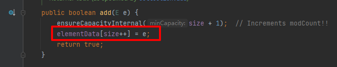

原因：ArrayList是非线程安全的

异常情况【null,1】  或【null,2】:

线程t1先进来拿到elementData，此时size=0，线程t1开始扩容；在t1扩容期间线程t2也进来了，由于t1扩容未完成，t2拿到的是旧elementData，size=0也要扩容，便new了一个数组并将elementData指向它，相当于t1 new的数组以及赋值被抛弃，等t1执行完赋值操作，size++，t2获取到size值为1，并将2放入数组下标为1的位置，于是出现了【null, 2】的情况


异常情况【1】或【2】：

线程t1和t2同时执行扩容、赋值，且同时完成，最后只取一个


## 4.5 常见线程安全类


- String、Integer： 不可变类，内部状态不可改变
- StringBuffer
- Random
- HashTable（HashMap的线程安全类）、Vector（List的线程安全类）：加了synchronized
- java.util.concurrent包下的类

注意：

- ==多个线程调用它们同一个实例的某个方法是线程安全的，但多个方法组合在一起未必是线程安全的（原子）==，例如：hashtable的get和put方法都是原子的，但组合在一起非原子，若两个线程同时进来拿到"key"对应的值都是null，那么会put两次。

```java
Hashtable<String ,String > table=new Hashtable<>();
if(table.get("key")!=null){
    table.put("key","value");
}
```


- ·····加了final也未必是线程安全的

  ```java
  final Date d=new Date();  // 只保证引用d不可变，Date里面的属性可变
  ```

  


### 4.6 线程安全示例分析

模拟卖票：

```java
@Slf4j
public class TestThread {
    public static void main(String[] args) throws Exception {
       // 模拟多人抢票
        TicketWindow window=new TicketWindow(1000); // 总共1000张票
        // 所有抢票线程的集合
        List<Thread> list=new ArrayList<>();
        List<Integer> sellList=new Vector<>(); // 线程安全

        for(int i=0;i<2000;i++){ // 模拟2000个人同时抢1000张票
            Thread thread=new Thread(()->{ 
                // sellList.add线程安全（统计卖票数）     window.sell不安全
                sellList.add(window.sell(new Random().nextInt(5)+1)); //记录卖票数量
            });
            thread.start();
            list.add(thread);
        }
        // 等待所有抢票线程完成
        for (Thread thread:list){
            thread.join();
        }
        // 余票+卖票=1000则线程安全
        log.info("余票：{}，卖票：{}",window.getCount(),sellList.stream().mapToInt(i-> i).sum());
    }
}
@AllArgsConstructor
@Data
class TicketWindow {
    private int count;
    public int sell(int amount) {  // 卖票 线程不安全
        if (count>=amount){  
            count -=amount;
            return amount;
        }else{
            return 0;
        }
    }
}
```

sell方法不安全，count是线程共享的，可能线程A卖完票但没来得急将减掉后的库存值写回共享内存，其他线程就获取了旧库存继续卖票

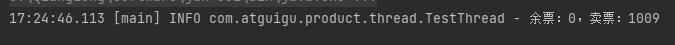


改进：将sell加锁即可保证线程安全

```java
@AllArgsConstructor
@Data
class TicketWindow {
    private int count;
    public synchronized int sell(int amount) {  // 卖票 线程不安全
        if (count>=amount){
            count -=amount;
            return amount;
        }else{
            return 0;
        }
    }
}
```


案例2：转账

```java
@Slf4j
public class TestThread {
    public static void main(String[] args) throws Exception {
       // 模拟转账
        Account a=new Account(1000);
        Account b=new Account(1000);

        Thread t1=new Thread(()->{
            for(int i=0;i<1000;i++){ // 转账1000次
                a.transfer(b,new Random().nextInt(5)+1);
            }
        },"t1");

        Thread t2=new Thread(()->{
            for(int i=0;i<1000;i++){ // 转账1000次
                b.transfer(a,new Random().nextInt(100)+1);
            }
        },"t2");

        t1.start();
        t2.start();
        t1.join();
        t2.join();

        log.info("转账后账户a+账户b总金额：{}",a.getMoney()+b.getMoney());
    }
}
@AllArgsConstructor
@Data
class Account {
    private int money;
    public void transfer(Account target,int amount) {  // 模拟转账
        if (money>=amount){
            setMoney(money-amount);
            target.setMoney(target.getMoney()+amount);
        }
    }
}
```

Account.transfer是非线程安全的，money和target都不安全，转完之后两个账户总和不为2000


解决：给Account类加锁，**==单纯给transfer方法加锁不行，锁的是this对象，而传入的target也是共享变量==**

```java
class Account {
    private int money;
    public void transfer(Account target,int amount) {  // 模拟转账
        synchronized (Account.class){
            if (money>=amount){
                setMoney(money-amount);
                target.setMoney(target.getMoney()+amount);
            }
        }
    }
}
```


## 4.7 synchronized底层原理


### 4.7.1 对象头

参见jvm中对象的内存布局。

1. 对象组成：对象头`(Mark Word、Klass Pointer)、`实例数据`、`对象填充


2.对象头：包括Mark Word和Klass Word

- Mark Word: 对象运行时数据，包括哈希码（hashcode）、GC分代年龄、是否启用偏向锁（biased_lock，1是0否）、加锁状态（01未锁定或可偏向，00轻量级锁定，10重量级锁定，11GC标记）。不同状态存储的内容有所不同：

  | 存储内容                                                     | 标志位 | 状态           |
  | ------------------------------------------------------------ | ------ | -------------- |
  | 对象哈希码（hashcode）、GC分代年龄(age)、是否启用偏向锁（biased_lock=0为否） | 01     | 正常（未锁定） |
  | 偏向线程id（thread）、时间戳（epoch）、GC分代年龄(age)、是否启用偏向锁（biased_lock=1为是） | 01     | 可偏向         |
  | 指向锁记录的指针（ptr_to_lock_record）                       | 00     | 轻量级锁定     |
  | 指向重量级锁的指针（ptr_to_lock_record）                     | 10     | 重量级锁定     |
  | 空，无需记录信息                                             | 11     | GC标记         |

  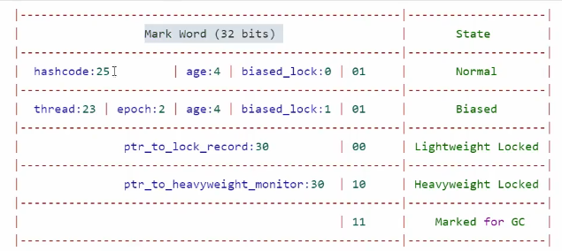

- Klass Pointer: 类型指针，用来确定该对象属于哪种类型（比如String、Object...）

### 4.7.2 Monitor

Monitor 被翻译为监视器或管程。每个 Java 对象都可关联一个 Monitor 对象（操作系统层面的，与java对象区分开）：MarkWord中记录Monitor对象的指针地址（**==synchronized 是重量级锁，Mark Word状态标志位为10，ptr_to_lock_record指针指向Monitor对象==**） 。

工作流程：

* 开始时 Monitor 中 Owner 为 null
* 当 Thread-2 执行 synchronized(obj) 就会将 Monitor 的所有者 Owner 置为 Thread-2，Monitor 中只能有一个 Owner，**obj 对象Mark Word 的ptr_to_lock_record指向 Monitor**，**同时把obj原来的 MarkWord 存入线程栈中的锁记录中，方便还原**
  
* 在 Thread-2 上锁的过程中，如果Thread-3、Thread-4、Thread-5 也执行 synchronized(obj)，就会进入 阻塞队列EntryList （双向链表）
* Thread-2 执行完同步代码块的内容，设置 Owner 为空，**把线程栈的锁记录中的对象头的值设置回 MarkWord**；接着唤醒 EntryList 中等待的线程来竞争锁，竞争是**非公平的**
* WaitSet 中的 Thread-0，Thread-1是以前获得过锁，但条件不满足进入 WAITING 状态的线程（wait-notify 机制）


注意：

* synchronized 必须是进入同一个对象的 Monitor 才有上述的效果
* 不加 synchronized 的对象不会关联监视器，不遵从以上规则


### 4.7.3 从字节码层面解读synchronized

```java
public class SynchronizedTest {
    static final Object lock=new Object();
    static int counter=0;
    public static void main(String[] args){
        synchronized (lock){
            counter++;
        }
    }
}
```


```java
 0 getstatic #2 <SynchronizedTest.lock : Ljava/lang/Object;> // 拿到lock对象的引用
 3 dup     // 将lock引用复制一份
 4 astore_1  // 将lock引用存储到局部变量表下标1的位置（方便解锁）
 5 monitorenter   // synchronized : 将lock对象的MarkWord（ptr_to_lock_record指针）指向 Monitor对象，使用c实现
 6 getstatic #3 <SynchronizedTest.counter : I>  // 获取类静态变量counter（放入操作数栈）
 9 iconst_1           // 获取常数1（放入操作数栈）
10 iadd               // counter+1
11 putstatic #3 <SynchronizedTest.counter : I>  //将counter+1结果从操作数栈弹出并存回主内存（静态变量counter）
14 aload_1   // 从当前线程的虚拟机栈（局部变量表）中获取原来的MarkWord(之前存了一份)
15 monitorexit   // 还原obj的MarkWork，唤醒EntryList
16 goto 24 (+8)    // 同步代码块里的异常处理
19 astore_2    // 将异常对象存储在局部变量表下标2的位置
20 aload_1  // 从当前线程的虚拟机栈（局部变量表）中获取原来的MarkWord
21 monitorexit  // 还原obj的MarkWork，唤醒EntryList
22 aload_2  // 加载异常对象到操作数栈
23 athrow  // 抛出异常
24 return
   
```

synchronized： **==考虑了同步代码块正常执行和出现异常的场景，都能正常解锁。==**

## 4.8 synchronized原理进阶

### 4.8.1 轻量级锁

轻量级锁使用场景：一个对象有多个线程访问，但访问时间错开（没有竞争），可以使用轻量级锁来优化。

轻量级锁对使用者是透明的（不可见），语法仍是synchronized。

假设有两个方法同步块，利用同一个对象加锁：

```java
static final Object obj = new Object();
public static void method1() {
    synchronized( obj ) {
        // 同步块 A
        method2();
    }
}
public static void method2() {
    synchronized( obj ) {
    	// 同步块 B
    }
}
```

可重入锁：线程可以进入任何一个它已经拥有的锁所同步着的代码块，可重入锁最大的作用是**避免死锁**

轻量级锁在没有竞争时（锁重入时），每次重入仍然需要执行 CAS 操作，Java 6 才引入的偏向锁来优化


* 创建锁记录（Lock Record）对象，每个线程的**栈帧**都会包含一个锁记录结构，存储锁定对象的 Mark Word和对象指针

  

* 让锁记录中 Object reference 指向锁住的对象，并将Object的 Mark Word 值存入锁记录（没加锁前为01正常状态，MarkWord内容为hashcode之类，存入锁记录为了后续还原），然后尝试用 CAS （原子操作）替换 Object 的 Mark Word（加锁后锁状态为00轻量级锁，MarkWord内容变为指向锁记录的指针）

  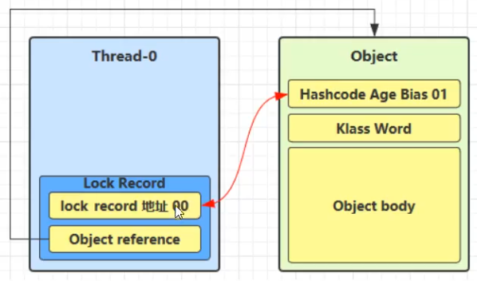

* 如果 CAS 替换成功，对象头中存储了锁记录地址和状态 00（轻量级锁） ，表示由该线程给对象加锁
  

* 如果 CAS 失败，有两种情况：

  * 如果是其它线程已经持有了该 Object 的轻量级锁，这时表明有竞争，进入锁膨胀过程
  * 如果是线程自己执行了 synchronized 锁重入，就添加一条 Lock Record 作为重入的计数


- 接着进入method2，再创建一个method2的栈帧（内含锁记录），与method1类似也要做CAS操作，不同的是由于是同一个线程锁重入，锁记录中Mark Word为null (其他栈帧存了不重复存储)

  

* 当退出 synchronized 代码块（解锁时），如果有取值为 null（method2执行完毕） 的锁记录，表示有重入，这时重置锁记录，表示重入计数减 1

  

* 当退出 synchronized 代码块（解锁时），如果锁记录的值不为 null（method1执行完毕），这时使用 CAS **将 Mark Word 的值恢复给对象头**（还原为hashcode等的正常状态）

  * 成功，则解锁成功
  * 失败，说明轻量级锁进行了锁膨胀或已经升级为重量级锁，进入重量级锁解锁流程


***

### 4.8.2 锁膨胀

**==如果在尝试加轻量级锁的过程中，CAS 操作无法成功，可能是其它线程为此对象加上了轻量级锁（有竞争），这时需要进行锁膨胀，将轻量级锁变为重量级锁==**

```java
static Object obj = new Object();
public static void method1() {
    synchronized( obj ) {
        // 同步块 
    }
}
```

* 当 Thread-1 进行轻量级加锁时，Thread-0 已经对该对象加了轻量级锁

  

* Thread-1 加轻量级锁失败，进入锁膨胀（让解锁操进入重量级锁操作，轻量级锁没有阻塞，重量级锁才有）流程：

  * 为 Object 对象申请 Monitor 锁，让Object指向重量级锁地址

  * **通过 Object 对象头获取到持锁线程**，将 Monitor 的 Owner 置为 Thread-0，然后Thread-1进入 Monitor 的阻塞队列 EntryList


  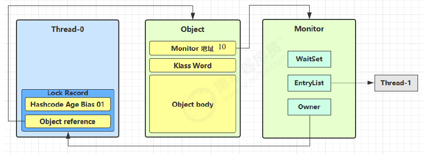

* 当 Thread-0 退出同步块解锁时，使用 CAS 将 Mark Word 的值恢复给对象头失败，这时进入重量级解锁流程，即按照 Monitor 地址找到 Monitor 对象，设置 Owner 为 null，唤醒 EntryList 中 BLOCKED 线程

------

### 4.8.3 自旋优化

重量级锁竞争时，还可使用自旋（即让当前线程先不进入阻塞队列，而是进行几次循环）进行优化，若自旋成功（自旋过程中持锁线程已退出同步块，释放了锁），当前线程就可避免阻塞（阻塞要上下文切换，耗费性能）。

注意：

* 自旋占用 CPU 时间，单核 CPU 自旋就是浪费时间，因为同一时刻只能运行一个线程，多核 CPU 自旋才能发挥优势
* 自旋失败的线程会进入阻塞状态

优点：不会进入阻塞状态，**减少线程上下文切换的消耗**

缺点：当自旋的线程越来越多时，会不断的消耗 CPU 资源

* 自旋成功的情况：
      

* 自旋失败的情况：

  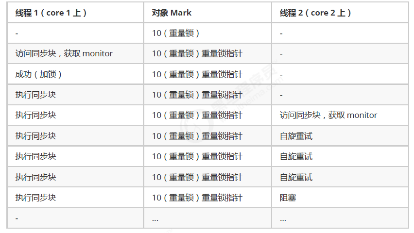

说明：

* 在 Java 6 之后自旋锁是自适应的，比如对象上一次自旋操作成功，那么认为此次自旋成功可能性较高，就多自旋几次；反之，就少自旋甚至不自旋，比较智能
* Java 7 之后不能控制是否开启自旋功能，由 JVM 控制

```java
//手写自旋锁
public class SpinLock {
    // 泛型装的是Thread，原子引用线程
    AtomicReference<Thread> atomicReference = new AtomicReference<>();

    public void lock() {
        Thread thread = Thread.currentThread();
        System.out.println(thread.getName() + " come in");

        //开始自旋，期望值为null，更新值是当前线程
        while (!atomicReference.compareAndSet(null, thread)) {
            Thread.sleep(1000);
            System.out.println(thread.getName() + " 正在自旋");
        }
        System.out.println(thread.getName() + " 自旋成功");
    }

    public void unlock() {
        Thread thread = Thread.currentThread();

        //线程使用完锁把引用变为null
		atomicReference.compareAndSet(thread, null);
        System.out.println(thread.getName() + " invoke unlock");
    }

    public static void main(String[] args) throws InterruptedException {
        SpinLock lock = new SpinLock();
        new Thread(() -> {
            //占有锁
            lock.lock();
            Thread.sleep(10000); 

            //释放锁
            lock.unlock();
        },"t1").start();

        // 让main线程暂停1秒，使得t1线程先执行
        Thread.sleep(1000);

        new Thread(() -> {
            lock.lock();
            lock.unlock();
        },"t2").start();
    }
}
```


***

### 4.8.4 偏向锁

#### 4.8.4.1 概念

轻量级锁在没有竞争时（就自己这个线程），每次重入仍要执行CAS操作，有一定性能损耗，可采用偏向锁进行优化。

偏向锁的思想是偏向于让第一个获取锁对象的线程，这个线程之后重新获取该锁不再需要同步操作：

* 当锁对象第一次被线程获得的时候进入偏向状态，标记为 101，同时**使用 CAS 操作将线程 ID 记录到 Mark Word**。之后重入发现这个线程 ID 是自己的就表示没有竞争，不用重新CAS。

* 当有另外一个线程去尝试获取这个锁对象时，偏向状态就宣告结束，此时撤销偏向（Revoke Bias）后恢复到未锁定或轻量级锁状态

```java
static final Object obj = new Object();
public static void m1() {
    synchronized( obj ) {
        // 同步块 A
        m2();
    }
}
public static void m2() {
    synchronized( obj ) {
    	// 同步块 B
        m3();
    }
}
public static void m3() {
    synchronized( obj ) {
    	// 同步块 C
    }
}
```


#### 4.8.4.2 偏向状态


一个对象创建时：

* 如果开启了偏向锁（==默认开启==），那么对象创建后，MarkWord 值为 0x05 即最后 3 位为 101，thread、epoch、age 都为 0

* 偏向锁是默认是延迟的，不会在程序启动时立即生效，如果想避免延迟，可以加 VM 参数 

  `-XX:BiasedLockingStartupDelay=0` 来禁用延迟。JDK 8 延迟 4s 开启偏向锁原因：在刚开始执行代码时，会有好多线程来抢锁，如果开偏向锁效率反而降低

* 当一个对象已经计算过 hashCode，就再也无法进入偏向状态了

* 添加 VM 参数 ==-XX:-UseBiasedLocking 禁用偏向锁==


撤销偏向锁的状态：

* 调用对象的 hashCode：偏向锁的对象 MarkWord 中存储的是线程 id，调用 hashCode 导致偏向锁被撤销（原因： **==在偏向锁状态存储线程id耗费54bit，没地方存31 bit的hashcode==**）
* 当有其它线程使用偏向锁对象时，会将偏向锁升级为轻量级锁
* 调用 wait/notify，需要申请 Monitor，升级为重量级锁

**批量撤销**：如果对象被多个线程访问，但没有竞争，这时偏向了线程 T1 的对象仍有机会重新偏向 T2，重偏向会重置对象的 Thread ID

* 批量重偏向：当撤销偏向锁阈值超过 20 次后，JVM 会觉得是不是偏向错了，于是在给这些对象加锁时重新偏向至加锁线程

* 批量撤销：当撤销偏向锁阈值超过 40 次后，JVM 会觉得自己确实偏向错了，根本就不该偏向，于是整个类的所有对象都会变为不可偏向的，新建的对象也是不可偏向的


**==说明：偏向锁测试前提是没有线程竞争==**

测试1：对象创建后默认开启了偏向锁（101）

```java
@Slf4j
public class TestThread {
    public static void main(String[] args) throws InterruptedException {
       Account account=new Account();
       //打印对象头
       log.info(ClassLayout.parseInstance(account).toPrintable());
    }
}
@AllArgsConstructor
@Data
class Account {
}
```

依赖（对应jdk1.8）：

```xml
<dependency>
    <groupId>org.openjdk.jol</groupId>
    <artifactId>jol-core</artifactId>
    <version>0.8</version>  
</dependency>
```


测试2：加锁前中后都打印对象头

```java
@Slf4j
public class TestThread {
    public static void main(String[] args) throws InterruptedException {
       Account account=new Account();
       log.info(ClassLayout.parseInstance(account).toPrintable());
       synchronized (account){
           log.info(ClassLayout.parseInstance(account).toPrintable());
       }
        log.info(ClassLayout.parseInstance(account).toPrintable());
    }
}
@AllArgsConstructor
@Data
class Account {
}
```

可以看出一直是偏向锁状态，且加锁及解锁后对象头中的线程id不变


测试3：禁用偏向锁， VM 参数 ==-XX:-UseBiasedLocking 

可以看出从正常无锁状态->  轻量级锁->  正常无锁状态


优先级：偏向锁-> 轻量级锁-> 重量级锁

- 开启了偏向锁，使用偏向锁
- 其他线程用了锁对象会撤销偏向锁变成轻量级锁
- 轻量级锁加了但又线程竞争，会膨胀为重量级锁


测试4：调用对象的 hashCode禁用偏向锁

正常状态->  轻量级锁-> 正常状态

```java
@Slf4j
public class TestThread {
    public static void main(String[] args) throws InterruptedException {
       Account account=new Account();
       account.hashCode(); // 调hashCode()禁用偏向锁
       log.info(ClassLayout.parseInstance(account).toPrintable());
       synchronized (account){
           log.info(ClassLayout.parseInstance(account).toPrintable());
       }
        log.info(ClassLayout.parseInstance(account).toPrintable());
    }
}
@AllArgsConstructor
@Data
class Account {
}
```


测试5：当有其它线程使用偏向锁对象时，会将偏向锁升级为轻量级锁

```java
@Slf4j
public class TestThread {
    public static void main(String[] args) throws InterruptedException {
       Account account=new Account();
       new Thread(()->{
           log.info(ClassLayout.parseInstance(account).toPrintable());
           synchronized (account){
               log.info(ClassLayout.parseInstance(account).toPrintable());
           }
           log.info(ClassLayout.parseInstance(account).toPrintable());
           synchronized (TestThread.class){
               TestThread.class.notify(); // 执行完上面的代码唤醒t1线程
           }
       },"t1").start();
       
        new Thread(()->{
            // t2先等待t1执行完，偏向锁必须在没有线程竞争的条件下测试
            synchronized (TestThread.class){
                try {
                    TestThread.class.wait();
                } catch (InterruptedException e) {
                    throw new RuntimeException(e);
                }
            }
            log.info(ClassLayout.parseInstance(account).toPrintable());
            synchronized (account){
                log.info(ClassLayout.parseInstance(account).toPrintable());
            }
            log.info(ClassLayout.parseInstance(account).toPrintable());
        },"t2").start();
    }
}
@AllArgsConstructor
@Data
class Account {
}
```

输出(截取)：t1首先获取到偏向锁（状态变化：101-> 101-> 101），t1执行完后t2访问锁对象account，偏向锁失效，加的轻量级锁（状态101->000->001）

```bash
23:40:01.162 [t1] 00000101 00000000 00000000 00000000
23:40:01.166 [t1] 00000101 01000000 01101000 11110010
23:40:01.167 [t1] 00000101 01000000 01101000 11110010
23:40:01.168 [t2] 00000101 01000000 01101000 11110010
23:40:01.169 [t2] 10000000 11110011 01001111 01011011
23:40:01.170 [t2] 00000001 00000000 00000000 00000000
```

***

#### 4.8.4.3 批量重偏向

如果对象虽然被多个线程访问，但没有竞争，这时偏向了线程t1的对象仍有机会重新偏向t2, 重偏向会重置对象的Thread ID。

当**==撤销偏向锁的阈值超过20次==**后，jvm会觉得，我是不是偏向错了，于是会在给这些对象加锁时重新偏向至加锁线程。

```java
package com.atguigu.product.thread;
import com.alibaba.fastjson.JSON;
import lombok.AllArgsConstructor;
import lombok.Data;
import lombok.extern.slf4j.Slf4j;
import org.openjdk.jol.info.ClassLayout;

import java.security.acl.LastOwnerException;
import java.util.*;
/**
 * @Author qiang.long
 * @Date 2024/04/07
 * @Description 统筹 线程
 **/
@Slf4j
public class TestThread {
    public static void main(String[] args) throws InterruptedException {
        Vector<Account> list=new Vector<>(); // 线程安全
       new Thread(()->{
           for(int i=0;i<30;i++){
               Account account=new Account();
               list.add(account);
               synchronized (account){
                   log.info(i+" "+ClassLayout.parseInstance(account).toPrintable());
               }
           }
           synchronized (list){
               list.notify(); // 执行完上面的代码唤醒t1线程
           }

       },"t1").start();

        new Thread(()->{
            // t2先等待t1执行完，偏向锁必须在没有线程竞争的条件下测试
            synchronized (list){
                try {
                    list.wait();
                } catch (InterruptedException e) {
                    throw new RuntimeException(e);
                }
            }
            for(int i=0;i<30;i++){
                Account account=list.get(i); // 从list取出
                log.info(i+" "+ClassLayout.parseInstance(account).toPrintable());
                synchronized (account){  // 原来account偏向t1，现在撤销
                    log.info(i+" "+ClassLayout.parseInstance(account).toPrintable());
                }
                log.info(i+" "+ClassLayout.parseInstance(account).toPrintable());
            }
        },"t2").start();
    }
}
@AllArgsConstructor
@Data
class Account {
}
```

t1一直是加偏向锁，且线程ID为Thread-1

t1运行完后，线程t2从list中获取对象，由于之前account偏向Thread-1，现在进入线程t2偏向锁撤销，在撤销了19次后（0~18状态都是：偏向锁101->轻量级锁000->正常001），从第20次（19）开始状态变为101-> 101->101 ，account重偏向到Thread-2


#### 4.8.4.4 批量撤销

当撤销偏向锁阈值超过40次后，jvm会觉得，自己确实偏向错了。于是整个类的所有对象都会变为不可偏向，新建的对象也是不可偏向的。


### 4.8.5 锁消除

锁消除是指对于被检测出不可能存在竞争的共享数据的锁进行消除，这是 JVM **即时编译器的优化**

锁消除主要是通过**逃逸分析**来支持，如果堆上的共享数据不可能逃逸出去被其它线程访问到，那么就可以把它们当成私有数据对待，也就可以将它们的锁进行消除（同步消除：JVM 逃逸分析）


测试：分别运行方法a和方法b 20次，统计平均耗时，比较加锁和不加锁的性能差异。


结果：

- 从第一幅图可以看出，加锁和不加锁运行时间相差不大，原因是**==JIT会对反复运行的代码进行优化，当发现方法b中加锁没有必要时，就会自动去掉synchronized==**
- ==-XX:-EliminateLocks 禁用自动锁消除==，从第二幅图可以看出，禁用之后加锁代码运行时间明显长于未加锁代码


## 4.9 wait/notify

### 4.9.1 原理

**<font color=blue size=5>*原理之wait/notify</font>**


- Owner线程发现条件不满足，调用wait方法，即可进入WaitSet变为WAITTING状态（区分开EntryList和WaitSet，前者存放想要获得锁在排队的线程 后者存放已经获得锁但放弃了锁的线程）
- BLOCKED和WAITTING线程都处于阻塞状态，不占用CPU时间片
- BLOCKED线程会在Owner线程释放锁时唤醒
- WAITTING线程会在Owner线程调用notify或notifyAll时唤醒，但唤醒后并不意味着立即获得锁，仍需进入EntryList重新竞争

### 4.9.2 API

**<font color=blue size=5>API</font>**

- obj.wait()让进入object监视器的线程到WaitSet等待
- obj.notify()在object上正在WaitSet等待的线程中挑一个唤醒
- obj.notifyAll()让在object上正在WaitSet等待的线程全部唤醒
- obj.wait(long timeout)，有限等待，单位ms，过期自动苏醒，不用其他线程调用notify唤醒；若在休眠期内被其他线程调用notify/notifyAll唤醒，则不会受timeout限制（提前苏醒）

它们都是线程之间协作的手段，**==都属于Object方法，必须获得对象的锁，才能调用这几个方法==**。


```java
@Slf4j
public class TestThread {
    public static void main(String[] args) throws InterruptedException {
        Object object=new Object();
        object.wait(); // 必须获取到object的锁才能调wait/notify/notifyAll方法，否则报错
    }
}
```

**==必须获取到object的锁才能调wait/notify/notifyAll方法，否则报错==**

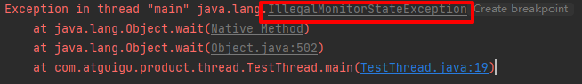

测试：wait/notify/notifyAll

```java
@Slf4j
public class TestThread {
    public static void main(String[] args) throws InterruptedException {
        Object object=new Object();
        new Thread(()->{
            log.info("执行...");
            synchronized (object){
                try {
                    object.wait(); // t1释放锁到object的WaitSet中休息
                } catch (InterruptedException e) {
                    throw new RuntimeException(e);
                }
            }
            log.info("其他代码");
        },"t1").start();

        new Thread(()->{
            log.info("执行...");
            synchronized (object){
                try {
                    object.wait(); // t2释放锁到object的WaitSet中休息
                } catch (InterruptedException e) {
                    throw new RuntimeException(e);
                }
            }
            log.info("其他代码");
        },"t2").start();

        Thread.sleep(2000);  // main线程sleep 2s确保t1 t2都到WaitSet中休息去了
        synchronized (object){
            log.info("main线程获取到锁");
            object.notify(); // 随机唤醒object WaitSet中的一个线程
            // object.notifyAll(); // 唤醒object WaitSet中的所有线程
        }
    }
}
```

t1 t2线程获取到object的Monitor所有权后调用wait方法释放所有权进入WaitSet休息，之后主线程调用notify或notifyAll唤醒。

notify()随机唤醒WaitSet中的一个线程


notifyAll()唤醒WaitSet中的所有线程

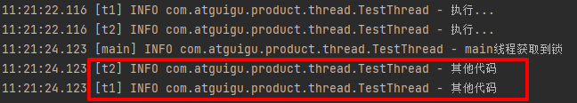


测试：有限期等待

```java
@Slf4j
public class TestThread {
    public static void main(String[] args) throws InterruptedException {
        Object object=new Object();
        new Thread(()->{
            log.info("执行...");
            synchronized (object){
                try {
                    object.wait(2000); // 有限等待，2s后自动苏醒
                } catch (InterruptedException e) {
                    throw new RuntimeException(e);
                }
            }
            log.info("其他代码");
        },"t1").start();
    }
}
```

t1线程过了2s后自动唤醒


测试：提前唤醒wait(timeout)的线程

```java
@Slf4j
public class TestThread {
    public static void main(String[] args) throws InterruptedException {
        Object object=new Object();
        new Thread(()->{
            log.info("执行...");
            synchronized (object){
                try {
                    object.wait(2000); // 有限等待，2s后自动苏醒
                } catch (InterruptedException e) {
                    throw new RuntimeException(e);
                }
            }
            log.info("其他代码");
        },"t1").start();
        Thread.sleep(1000);  // 提前唤醒t1
        synchronized (object){
            object.notify(); // 唤醒t1
        }
    }
}
```

本来t1线程休息2s, 但main线程在休息1s后就调用notify将其唤醒

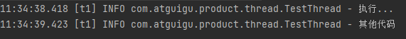


### 4.9.3 sleep 和wait的区别

**<font color=blue size=5>sleep (long n)和wait(long n)的区别</font>**

- sleepS是Thread的方法，而wait是Object的方法

- sleep不需要配合synchronized使用，而wait需要和synchronized一起使用（必须要获取到锁，才能调wait）

- sleep不会释放对象锁，wait释放对象锁

- 调用之后线程状态都是TIMED_WAITING

  

## 4.10 设计模式

### 4.10.1 同步模式-保护性暂停

即Guaraded Supension，用在一个线程等待零一个线程的执行结果

- 有一个结果需要从一个线程传递到另一个线程，让他们关联同一个GuaradedObject
- 如果有结果不断从一个线程到另一个线程，则改用消息队列（见生产者/消费者），此时不能用GuaradedObject
- JDK中，join、Future的实现采用的就是此模式
- 因为要等待另一方的结果，因此归类到同类模式

如下图所示，t1线程等待并获取t2线程的结果（GuaradedObject中response属性用来传递中间结果）


保护性暂停模拟：

- 创建GuardedObject类，get（）方法等待并获取结果response，complete方法将结果赋给response并唤醒所有WaitSet中的线程。
- main方法中创建两个线程，t1等待t2的计算结果，t2调用caculate方法进行计算并将计算结果赋值给guardedObject.response，然后唤醒所有线程
- t1线程在t2线程结束后就可获取计算结果

**==保护性暂停模式相较于join的好处==**：

- join必须等待另一个线程结束，而保护性暂停被等待的线程还能继续干别的事，比如t2线程在guardedObject.complete(caculate());后还能继续执行别的代码

```java
@Slf4j
public class TestThread {
    public static void main(String[] args) throws InterruptedException {
        GuardedObject guardedObject=new GuardedObject();
        new Thread(()->{
            try {
                long sum=(long)guardedObject.get(); // 等待获取结果
                log.info("计算结果:{}",sum);
            } catch (InterruptedException e) {
                throw new RuntimeException(e);
            }
        },"t1").start();

        new Thread(()->{
            log.info("开始计算");
            guardedObject.complete(caculate());  // 将计算结果赋值给guardedObject.response并唤醒所有线程
        },"t2").start();
    }
    public static Long caculate(){
        long sum=0;
        for(long i=0;i<100000;i++){
            for(long j=0;j<100000;j++){
                sum +=i+j;
            }
        }
        return sum;
    }
}

class GuardedObject{
    private Object response;
    public Object get() throws InterruptedException {
        // response为空一直等待
        while (response==null){
            synchronized (this){
                this.wait();
            }
        }
        return response;
    }
    public void complete(Object response){
        synchronized (this){
            // 给response赋值并唤醒所有GuardedObject上WaitSet中的所有线程
            this.response=response;
            this.notifyAll();
        }

    }
}
```


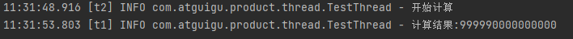

### 4.10.2 join(保护性暂停应用)

join应用的就是保护性暂停模式

```java
// 无限期等待
public final void join() throws InterruptedException {
        join(0);
    }
// 有限期等待
public final synchronized void join(long millis)
    throws InterruptedException {
        long base = System.currentTimeMillis();
        long now = 0;

        if (millis < 0) {
            throw new IllegalArgumentException("timeout value is negative");
        }
        // 无限期等待
        if (millis == 0) {
            while (isAlive()) {
                wait(0);
            }
        } else { // 有限期等待
            while (isAlive()) { // 当前线程还存活
                long delay = millis - now;
                if (delay <= 0) {  // 等待时间到，退出循环
                    break;
                }
                wait(delay);
                now = System.currentTimeMillis() - base;  // 记录经历的时间
            }
        }
    }
```


### 4.10.3 保护性暂停拓展- 解耦等待和生产-分析

图中Futures好比居民楼的信箱（每个信箱有房间编号），左侧t0，t2， t4好比等待邮件的居民，右侧t1, t3, t5 好比邮递员。在多个类之间使用GuradedObject对象作为参数传递不是很方便，因此设计一个用来解耦的中间类，这样不仅能解耦【结果等待者】和【结果生产者】，还能同时支持多个任务的管理。

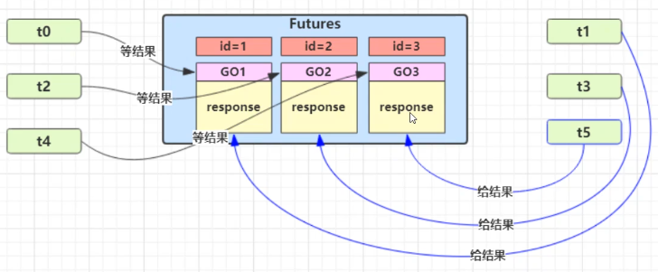


实现：MailBoxes模拟邮箱（很多个），3个线程收信，3个线程送信。注意**==保护性暂停模式需要生产者和消费者数量相同（一一对应）。==**

```java
@Slf4j
public class TestThread {
    public static void main(String[] args) throws InterruptedException {
        // 模拟3个人收信
        for (int i=0;i<3;i++){
            new People().start();
        }
        // 2s后开始送信
        Thread.sleep(2000);
        // 模拟3个邮递员送信
        for(int id:MailBoxes.getIds()){
            new Postman(id,"Mail"+id).start();
        }
    }
}

/**
 * 居民类
 **/
@Slf4j
class People extends Thread{
    @Override
    public void run(){
        // 收信
        GuardedObject guardedObject=MailBoxes.createGuardedObject(); // 创建好邮箱
        log.info("开始收信，id:{}",guardedObject.getId());
        try {
            Object mail=guardedObject.get(5000); // 最多等5s
            log.info("收到信，id:{},内容：{}",guardedObject.getId(),mail);
        } catch (InterruptedException e) {
            throw new RuntimeException(e);
        }
    }
}

/**
 * 邮件类(模拟送信)
 **/
@Slf4j
@AllArgsConstructor
@Data
class Postman extends Thread{
    private int mailId; // 邮件对应的邮箱id
    private String mail; // 邮件内容
    @Override
    public void run(){
        GuardedObject guardedObject=MailBoxes.getGuardedObject(mailId); //通过邮箱id获取GuardedObject
        log.info("开始送信，id:{},内容：{}",guardedObject.getId(),mail);
        guardedObject.complete(mail); // 填充邮箱内容
    }
}

/**
 * 邮箱类
 **/
class MailBoxes{
    // key=id value=GuardedObject
    private static Map<Integer,GuardedObject> boxes=new Hashtable<>(); // 线程安全
    private static int id=1;
    /**
     * 产生唯一id (由MailBoxes控制，防止重复)
     **/
    private static synchronized int generateId(){
        return id++;
    }
    /**
     * 创建GuardedObject对象并加入boxes (Hashtable线程安全，不用加synchronized)
     **/
    public static GuardedObject createGuardedObject(){
        GuardedObject guardedObject=new GuardedObject(generateId());
        boxes.put(guardedObject.getId(),guardedObject);
        return guardedObject;
    }
    /**
     * 获取键集
     **/
    public static Set<Integer> getIds(){
        return boxes.keySet();
    }
    /**
     * 通过id获取并移除GuardedObject（一次性的，用完了就没用了，否则boxes只进不出）
     **/
    public static GuardedObject getGuardedObject(int id){
        return boxes.remove(id);
    }
}

@Data
class GuardedObject{
    // 标识GuardedObject
    private int id;
    private Object response;
    public GuardedObject(int id) {
        this.id = id;
    }
    /**
     * 有限期等待
     **/
    public Object get(long timeout) throws InterruptedException {
        // response为空一直等待
        long now=System.currentTimeMillis(); // 当前时刻
        long passedTime=0; // 经历时长
        while (response==null){
            if(passedTime>=timeout){
                break;
            }
            synchronized (this){
                this.wait(timeout-passedTime); // 防止虚假唤醒（调了notifyAll但给response赋null）
            }
            passedTime +=System.currentTimeMillis()-now; // 累加
            now=System.currentTimeMillis();
        }
        return response;
    }
    public void complete(Object response){
        synchronized (this){
            // 给response赋值并唤醒所有response上WaitSet中的所有线程
            this.response=response;
            this.notifyAll();
        }
    }
}
```


### 4.10.4 异步模式-生产者/消费者

- 与保护性暂停模式中的GuardedObject不同，**==不需要产生结果和消费结果的线程一一对应==**
- 消费者队列可用来平衡生产和消费的线程资源
- 生产者仅负责产生结果是数据，不关系数据如何处理，而消费者专心处理结果数据
- **==消息队列是有容量限制的，满时不会再加数据，空时不会再消耗数据==**
- **==JDK中各种阻塞队列采用的就是该模式==**

如下图：t1, t2,  t3为生产者线程， t4为消费者线程

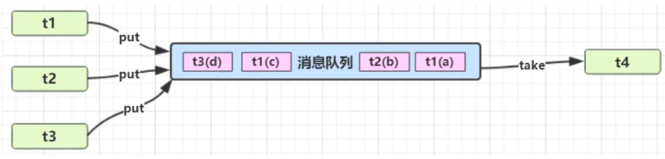

模拟实现：

```java
@Slf4j
public class TestThread {
    public static void main(String[] args) throws InterruptedException {
        // 创建消息队列
        MessageQueue messageQueue=new MessageQueue(new LinkedList<>(),2);
        // 创建3个生产者线程
        for(int i=0;i<3;i++){
            int id=i;
            new Thread(()->{
                try {
                    messageQueue.put(new Message(id,"Message"+id));
                } catch (InterruptedException e) {
                    throw new RuntimeException(e);
                }
            },"生产者"+i).start();
        }

        // 1个消费者线程
        new Thread(()->{
            while (true){ // 不断消费
                try {
                    Thread.sleep(2000); // 隔2s消费
                    messageQueue.take();
                } catch (InterruptedException e) {
                    throw new RuntimeException(e);
                }
            }
        },"消费者").start();
    }
}


/**
 * 消息队列类: 线程间通信 （区别于RabbitMQ进程间通信）
 **/
@Slf4j
@AllArgsConstructor
@Data
class MessageQueue{
    private LinkedList<Message> list=new LinkedList<>(); // 消息队列集合（头取尾塞）
    private int capacity; // 消息队列容量
    // 存消息
    public void put(Message message) throws InterruptedException {
        synchronized (list){
            // 检查队列：满了不再放消息
            while (list.size()>=capacity){
                log.info("消息队列已满，生产者线程等待...");
                list.wait();
            }
            list.add(message); // 尾塞消息
            log.info("已生产消息：{}",message);
            list.notifyAll(); // 唤醒等待线程
        }
    }

    // 取消息
    public Message take() throws InterruptedException {
        synchronized (list){
            // 检查消息队列：为空等待
            while (list.isEmpty()){
                log.info("消息队列为空，消费者线程等待...");
                list.wait();
            }
            Message message= list.remove(); // 从头部取出消息返回
            log.info("已消费消息：{}",message);
            list.notifyAll(); // 唤醒等待线程
            return message;
        }
    }
}

/**
 * 消息类: 只读（线程安全）
 **/
@AllArgsConstructor
@Getter
final class Message{
    private int id; // 消息id
    private Object value; // 消息内容
    @Override
    public String toString(){
        return "Message{id="+id+", value="+value+"}";
    }
}
```

创建3个生产者线程生产消息，1个消费者线程每隔2s消费1个消息，消息队列容量2，队列满了生产者线程等待，队列为空消费者线程等待。

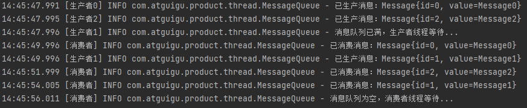

## 4.11 park/ unpark

**<font color=blue size=5>语法</font>**

- park用于暂停当前线程，进入**==WAITTING无限等待状态==**
- 其他线程调用unpark恢复暂停的线程，让其继续运行
- **==<font color=red size=3>unpark在park之后调用也生效，特别注意</font>==**

```java
// 暂停当前线程
LockSupport.park();

// 恢复某个线程的运行
LockSupport.unpark(暂停线程对象);
```

示例：

```java
@Slf4j
public class TestThread {
    public static void main(String[] args) throws InterruptedException {
        Thread t1=new Thread(()->{
            log.info("start...");
            try {
                Thread.sleep(1000);
                log.info("park...");
                LockSupport.park();  // 暂停t1线程
                log.info("resume...");
            } catch (InterruptedException e) {
                throw new RuntimeException(e);
            }
        },"t1");
        t1.start();

        Thread.sleep(2000);
        log.info(JSON.toJSONString(t1.getState())); // 打印park后t1线程状态
        log.info("unpark...");
        LockSupport.unpark(t1); // 恢复t1线程运行
    }
}
```

t1线程启动1s后调用park方法暂停（此后t1线程处于WAITTING无限等待状态），main线程在2s后调用unpark恢复t1线程运行。

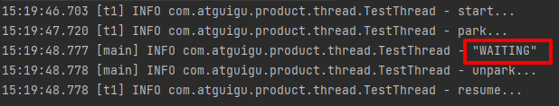

main线程先unpark(t1)，t1线程后park也能恢复其运行

```java
@Slf4j
public class TestThread {
    public static void main(String[] args) throws InterruptedException {
        Thread t1=new Thread(()->{
            log.info("start...");
            try {
                Thread.sleep(2000);
                log.info("park...");
                LockSupport.park();  // 暂停t1线程
                log.info("resume...");
            } catch (InterruptedException e) {
                throw new RuntimeException(e);
            }
        },"t1");
        t1.start();

        Thread.sleep(1000);
        log.info(JSON.toJSONString(t1.getState())); // 打印park后t1线程状态
        log.info("unpark...");
        LockSupport.unpark(t1); // 恢复t1线程运行
    }
}
```


**<font color=blue size=5>特点</font>**

与Object的wait & notify相比

- wait, notify, notifyAll必须配合 Object Monitor一起使用， 即获取到对象锁后才能调
- park & unpark 是**==以线程为单位来【阻塞】和【唤醒】线程==**，而notify只能随机唤醒一个线程, notifyAll是唤醒所有等待的线程，不那么精确
- **==park & unpark 可以先unpark，而wait & nofify不能先notify==**


**<font color=blue size=5>原理之park & unpark</font>**

每个线程都有自己的一个Parker对象，由三部分组成**_counter, _cond**和**_mutex**，打个比喻：

- 线程好比一个旅人，Parker是它随身携带的背包，条件变量（**_cond**）是背包中的帐篷，_counter是背包中的备用干粮（0耗尽 1充足）
- 调用park就是看旅人（线程）是否需要停下来休息
  - 若备用干粮耗尽，则进帐篷休息
  - 若备用干粮充足，则继续前进

- 调用unpark，相当于令干粮充足
  - 若此时线程还在休息，就唤醒它继续前进
  - 若此时线程还在运行，则下次它调用park时，仅消耗掉备用干粮，不停留继续前进
    - 因为背包空间有限，多次调用unpark仅补充一份备用干粮


------

情况1：先park后unpark

1. 当前线程调用Unsafe.park()方法
2. 检查**_counter**，本情况为0，此时获得**_mutex**互斥锁
3. 线程进入**_cond**条件变量阻塞
4. 设置**_counter**=0


1. 调用Unsafe.unpark(Thread_0)方法, 设置**_counter**=1
2. 唤醒**_cond**条件变量中的Thread_0
3. Thread_0恢复运行
4. 设置**_counter**=1

------

情况2：先unpark后park

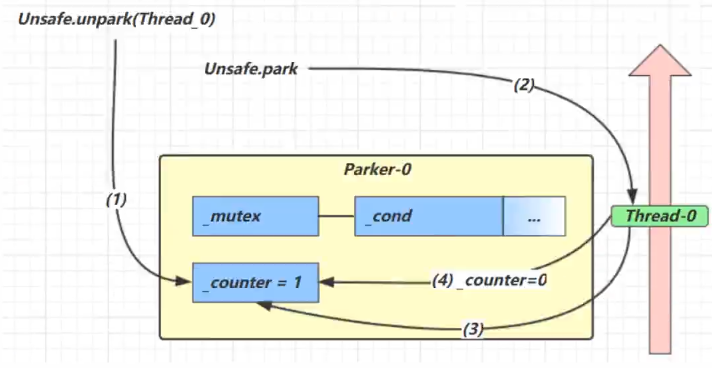

1. 调用Unsafe.unpark(Thread_0)方法, 设置**_counter**=1
2. 当前线程调用Unsafe.park()方法
3. 检查**_counter**，本情况为1，此时线程无需阻塞，继续运行
4. 设置**_counter**=0

## 4.12 重新理解线程状态转换


假设有线程Thread t

### 4.12.1 NEW  --> RUNNABLE

**<font color=blue size=5>情况1 </font>**

- NEW状态还**==未与操作系统关联==**，调用t.start()方法后进入RUNNABLE

### 4.12.2 RUNNABLE <--> WAITING

**<font color=blue size=5>情况2-1 </font>**

线程调用synchronized(obj)获取对象锁后

- 调用obj.wait()方法后，t线程从RUNNABLE--> WAITING
- 其他线程里（获取了obj对象锁）调用obj.notify()/obj.notifyAll()；或t.interrupt()时
  - 竞争锁成功，t线程从WAITING--> RUNNABLE
  - **==竞争锁失败，t线程从WAITING--> BLOCKED==**


测试：竞争锁成功/失败后的状态

```java
@Slf4j
public class TestThread {
    final static Object object=new Object();
    public static void main(String[] args) throws InterruptedException {
        Thread t1=new Thread(()->{
            synchronized (object){
                try {
                    log.info("调用wait，开始等待...");
                    object.wait();
                    log.info("被唤醒，继续执行...");
                    caculate();
                } catch (InterruptedException e) {
                    throw new RuntimeException(e);
                }
            }
        },"t1");

        Thread t2=new Thread(()->{
            synchronized (object){
                try {
                    log.info("调用wait，开始等待...");
                    object.wait();
                    log.info("被唤醒，继续执行...");
                    caculate();
                } catch (InterruptedException e) {
                    throw new RuntimeException(e);
                }
            }
        },"t2");
        t1.start();
        t2.start();

        Thread.sleep(2000);
        synchronized (object){
            log.info("调用notifyAll唤醒所有");
            object.notifyAll(); // 唤醒所有
        }
        log.info("线程t1的状态：{}",JSON.toJSONString(t1.getState()));
        log.info("线程t2的状态：{}",JSON.toJSONString(t2.getState()));
    }
    /**
     * 耗时8s
     **/
    public static void caculate(){
        long sum=0;
        for(long i=0;i<200000;i++){
            for(long j=0;j<100000;j++){
                sum +=i+j;
            }
        }
    }
}
```

t1、t2线程都调用wait()进入WaitSet休息，2s后main线程调用notifyAll()将它们唤醒，t2线程竞争锁成功，变为RUNABLE状态，t1进入BLOCKED状态。等t2线程运行完释放锁（TERMINATED）, t1线程拿到锁进入RUNNABLE状态，运行结束进入TERMINATED状态。

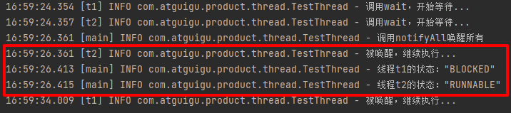

------

**<font color=blue size=5>情况2-2 </font>**

- 当前线程调用t.join()方法时，当前线程从RUNNABLE -->  WAITTING 
  - 注意是当前线程在t线程对象的监视器上等待
- t线程运行结束，或调用了当前线程的interrupt()方法，当前线程从WAITTING --> RUNNABLE

------

**<font color=blue size=5>情况2-3 </font>**

- 当前线程调用LockSupport.park()方法时，当前线程从RUNNABLE -->  WAITTING 
- 其他线程调用LockSupport.unpark(目标线程)，或调用目标线程的interrupt()方法，会让目标线程从WAITTING --> RUNNABLE

### 4.12.3 RUNNABLE <--> TIMED_WAITING

**<font color=blue size=5>情况3-1 </font>**

t线程用synchronized(obj) 获取对象锁后

- 调用obj.wait(long n)方法时，t线程从RUNNABLE--> TIMED_WAITING
- t线程等待时间超过了n毫秒，或调用obj.notify()，obj.notifyAll()， t.interrupt()时
  - 竞争锁成功，t线程从TIMED_WAITING--> RUNNABLE
  - 竞争锁成功，t线程从TIMED_WAITING--> BLOCKED

------

**<font color=blue size=5>情况3-2 </font>**

- 当前线程调用t.join(long n)方法时，当前线程从RUNNABLE--> TIMED_WAITING

  - 注意是当前线程在t线程的对象锁的监视器上等待

- 当前线程等待时间超过了n毫秒，或t线程运行结束，或调用了当前线程的interrupt()方法时，当前线程从TIMED_WAITING--> RUNNABLE

  

------

**<font color=blue size=5>情况3-3 </font>**

- 当前线程调用Thread.sleep(long n)，当前线程从RUNNABLE--> TIMED_WAITING
- 当前线程等待时间超过了n毫秒，当前线程从TIMED_WAITING--> RUNNABLE

------

**<font color=blue size=5>情况3-4 </font>**

- 当前线程调用 LockSupport.parkNanos(long nanos) 或 LockSupport.parkUntil(long millis) 时，当前线程从RUNNABLE--> TIMED_WAITING
- 调用LockSupport.unpark(目标线程) 或调用了线程的interrupt() , 或是等待超时，会让目标线程从TIMED_WAITING--> RUNNABLE

### 4.12.4 RUNNABLE <--> BLOCKED

**<font color=blue size=5>情况4 </font>**

- t线程用synchronized(obj) 获取了对象锁时如果竞争失败，从 RUNNABLE--> BLOCKED
- 持obj 锁线程的同步代码块执行完毕，会唤醒该对象锁上所有BLOCKED的线程重新竞争，如果其中t线程竞争成功，从BLOCKED--> RUNNABLE，其他失败的线程仍然BLOCKED

### 4.12.5 RUNNABLE --> TERMINATED

**<font color=blue size=5>情况5 </font>**

当前线程所有代码（run）运行完毕，进入TERMINATED


## 4.13 多把锁


**<font color=blue size=5>多把不相干的锁</font>**

情景：一间大屋子有2个功能：睡觉、学习， 互不干扰

现在小南要学习，小女要睡觉，但只有一间屋子（一个对象锁）的话，并发度很低。

解决办法时准备多个房间（多个对象锁）


改进前：锁住BigRoom大对象，只有一间房间没法同时睡觉和学习（二者互不干扰）

```java
@Slf4j
class BigRoom{
    public void sleep() throws InterruptedException {
        synchronized (this){
            log.info("sleep 2 hours");
            Thread.sleep(2000);
        }
    }
    public void study() throws InterruptedException {
        synchronized (this){
            log.info("study 1 hours");
            Thread.sleep(1000);
        }
    }
}
```


改进后: 准备2个房间，睡觉锁bedRoom，学习锁studyRoom，力度更细

```java
@Slf4j
class BigRoom{
    private final Object bedRoom=new Object();
    private final Object studyRoom=new Object();
    public void sleep() throws InterruptedException {
        synchronized (bedRoom){
            log.info("sleep 2 hours");
            Thread.sleep(2000);
        }
    }
    public void study() throws InterruptedException {
        synchronized (studyRoom){
            log.info("study 1 hours");
            Thread.sleep(1000);
        }
    }
}
```


将锁粒度细分

- 好处：可以增强并发度
- 坏处：如果一个线程同时获得多把锁，容易发生死锁


## 4.14 活跃性

### 4.14.1 死锁

**<font color=blue size=5>死锁 </font>**

一个线程同时获取多把锁，就容易发生死锁：

- t1线程获得A的对象锁，接下来想要获取B的对象锁
- t2线程获得B的对象锁，接下来想要获取A的对象锁


```java
@Slf4j
public class TestThread {
    final static Object a = new Object();
    final static Object b = new Object();
    public static void main(String[] args) throws InterruptedException {
        new Thread(()->{
            synchronized (a){
                log.info("获得了a锁");
                try {
                    Thread.sleep(1000);
                } catch (InterruptedException e) {
                    throw new RuntimeException(e);
                }
                log.info("等待获取b锁...");
                synchronized (b){
                    log.info("获得了b锁");
                }
            }
        },"t1").start();


        new Thread(()->{
            synchronized (b){
                log.info("获得了b锁");
                try {
                    Thread.sleep(1000);
                } catch (InterruptedException e) {
                    throw new RuntimeException(e);
                }
                log.info("等待获取a锁...");
                synchronized (a){
                    log.info("获得了a锁");
                }
            }
        },"t2").start();
    }
}
```

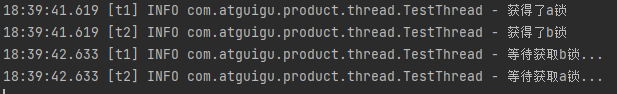


**<font color=blue size=5>定位死锁 </font>**

- 检测死锁可以使用jconsole工具，或者使用jps定位进程id，再用jstack定位死锁

------

方法1：jps + jstack


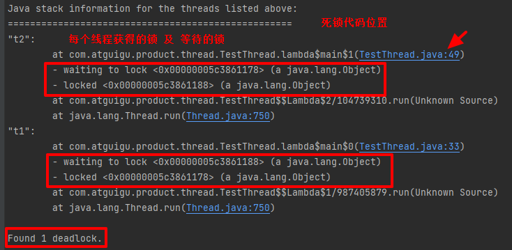

------

方法2： jconsole

连接到当前进程

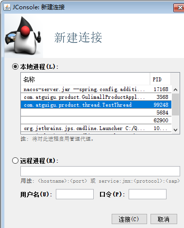

检测死锁;


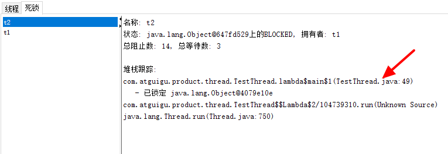


**<font color=blue size=5>哲学家就餐问题 </font>**

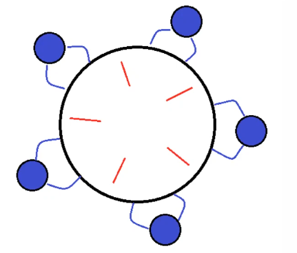

有5位哲学家，围坐在圆桌旁

- 他们只做两件事：思考和吃饭。思考一会吃口饭，吃完饭接着思考
- 吃饭时每人要用两根筷子，桌上共有5根筷子，每位哲学家左右手边各有一根筷子
- 如果筷子被身边的人拿着，自己就得等待

5个哲学家相当于5个线程，筷子为共享资源

代码模拟：

```java
@Slf4j
public class TestThread {
    public static void main(String[] args) throws InterruptedException {
        ChopStick c1=new ChopStick("1");
        ChopStick c2=new ChopStick("2");
        ChopStick c3=new ChopStick("3");
        ChopStick c4=new ChopStick("4");
        ChopStick c5=new ChopStick("5");

        Philosopher p1=new Philosopher("苏格拉底",c1,c2);
        Philosopher p2=new Philosopher("柏拉图",c2,c3);
        Philosopher p3=new Philosopher("亚里士多德",c3,c4);
        Philosopher p4=new Philosopher("米开朗琪罗",c4,c5);
        Philosopher p5=new Philosopher("孟德斯鸠",c5,c1);

        p1.start();
        p2.start();
        p3.start();
        p4.start();
        p5.start();

    }
}

/**
 * 筷子类
 **/
@Data
@AllArgsConstructor
class ChopStick{
    String name;
    @Override
    public String toString(){
        return "筷子{"+name+"}";
    }
}
/**
 * 哲学家类
 **/
@Slf4j
class Philosopher extends Thread{
    ChopStick left; // 左边的筷子
    ChopStick right; // 右边的筷子
    public Philosopher(String name,ChopStick left,ChopStick right){
        super(name); // 线程取名
        this.left=left;
        this.right=right;
    }
    @Override
    public void run(){
        while (true){
            synchronized (left){ // 尝试获取左边筷子
                synchronized (right){ // 尝试获取右边筷子
                    try {
                        eat(); // 吃饭
                    } catch (InterruptedException e) {
                        throw new RuntimeException(e);
                    }
                }
            }
        }
    }

    public void eat() throws InterruptedException {
        log.info("eating......");
        Thread.sleep(1000);
    }
}
```

出现死锁：


### 4.14.2 活锁

活锁出现在两个线程互相改变对方的结束条件，最后谁也无法结束，例如：

示例：

```java
@Slf4j
public class TestThread {
    static volatile int count=10;  // 共享变量
    static final Object lock=new Object();
    public static void main(String[] args) throws InterruptedException {
        new Thread(()->{
            while (count>0){
                try {
                    Thread.sleep(200);
                    count--;
                    log.info("count:{}",count);

                } catch (InterruptedException e) {
                    throw new RuntimeException(e);
                }
            }
        },"t1").start();

        new Thread(()->{
            while (count<20){
                try {
                    Thread.sleep(200);
                    count++;
                    log.info("count:{}",count);
                } catch (InterruptedException e) {
                    throw new RuntimeException(e);
                }
            }
        },"t2").start();

    }
}
```


t1 t2线程互相改变对方结束条件，使得永远无法结束


### 4.14.3 饥饿

定义：一个线程由于优先级太低，始终得不到CPU调度执行，也无法结束。

饥饿情况不易演示，读写锁时会涉及饥饿问题


顺序加锁可解决死锁问题：假设线程都按a->b的顺序获取锁，就不会发生死锁

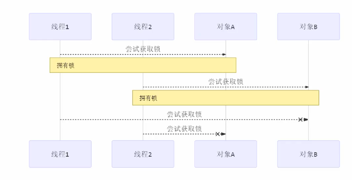

哲学家就餐问题：将p5中获取锁的顺序由c5, c1变为c1, c5就能避免死锁。但是又会产生饥饿问题，某些线程永远无法得到锁。

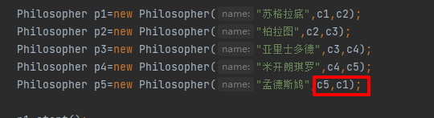


## 4.15 ReentrantLock

可重入锁，相对于synchronized它具备如下特点

- 可中断
- 可设置超时时间
- 可设置为公平锁（**==ReentrantLock默认是不公平的==**）：可防止线程饥饿
- 支持多个条件变量

与synchronized一样，都支持可重入。

### 4.15.1 基本语法

```java
ReentrantLock lock=new ReentrantLock();
reentrantLock.lcok();
try{
	// 临界区
}finally{
    // 释放锁
    reentrantLock.unlcok();
}
```

### 4.15.2 可重入

- 可重入指同一个线程如果首次获得了这把锁，那么因为它是这把锁的拥有者，因此有权再次获得这把锁
- 如果是不可重入锁，那么第二次获得锁时，自己也会被锁挡住


```java
@Slf4j
public class TestThread {
    private static ReentrantLock lock=new ReentrantLock();
    public static void main(String[] args) throws InterruptedException {
        lock.lock();
        try {
            log.info("enter main...");
            m1();
        }finally {
            lock.unlock();
        }
    }

    public static void m1(){
        lock.lock();
        try {
            log.info("enter m1...");
            m2();
        }finally {
            lock.unlock();
        }
    }

    public static void m2(){
        lock.lock();
        try {
            log.info("enter m2...");
        }finally {
            lock.unlock();
        }
    }
}
```


main调m1, m1调m2 ,每个方法里都获取了锁但不会被锁住


### 4.15.3 可打断

- ==**lock.lockInterruptibly()获取可打断的锁，其他线程调用等待线程的interrupt方法打断它，防止无限等待**==。lock.lock()获取的锁不可打断。这也是一种破除死锁的方式
- 是一种**==被动终止方式==**

```java
@Slf4j
public class TestThread {
    private static ReentrantLock lock=new ReentrantLock();
    public static void main(String[] args) throws InterruptedException {
        Thread t1=new Thread(()->{
            // 如果没有竞争那么此线程就会获得lock对象锁
            // 如果有竞争就进入阻塞队列，可以被其他线程用interrupt方法打断
            try {
                log.info("尝试获取锁");
                lock.lockInterruptibly();  // 可打断的锁
                log.info("获取到了锁");
            }catch (InterruptedException e){
                e.printStackTrace();
                log.info("没获取到锁，返回");
            }finally {
                lock.unlock();
            }
        },"t1");

        lock.lock(); // main线程先获取锁
        t1.start(); // t1获取不到
        log.info("打断t1线程");
        t1.interrupt(); // 打断t1, 防止无限等待
    }
}
```


### 4.15.4 锁超时

- **==主动终止（防死锁）的方式==**

- ==**使用lock.tryLock()尝试获取锁，返回一个bnoolean值**==，若该值为false，可主动结束线程

- **==*lock*.tryLock(1, TimeUnit.*SECONDS*) ： 等待1s还获取不到锁，就....==**

  

```java
@Slf4j
public class TestThread {
    private static ReentrantLock lock=new ReentrantLock();
    public static void main(String[] args) throws InterruptedException {
        Thread t1=new Thread(()->{
            log.info("尝试获取锁");
            if(!lock.tryLock()){ // 获取不到锁返回
                log.info("获取不到锁");
                return;  
            }else{
                log.info("获取到了锁");
            }
        },"t1");

        lock.lock(); // main线程先获取锁

        t1.start(); // t1获取不到
        log.info("获取到了锁");
    }
}
```

t1线程获取不到锁也能正常返回

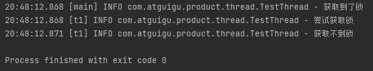


### 4.15.5  ReentrantLock解决哲学家就餐死锁问题

关键：

- 筷子类: 继承ReentrantLock 作为锁
- left.tryLock()  ，right.tryLock()尝试获取锁，没拿到锁直接结束

```java
@Slf4j
public class TestThread {
    public static void main(String[] args) throws InterruptedException {
        ChopStick c1=new ChopStick("1");
        ChopStick c2=new ChopStick("2");
        ChopStick c3=new ChopStick("3");
        ChopStick c4=new ChopStick("4");
        ChopStick c5=new ChopStick("5");

        Philosopher p1=new Philosopher("苏格拉底",c1,c2);
        Philosopher p2=new Philosopher("柏拉图",c2,c3);
        Philosopher p3=new Philosopher("亚里士多德",c3,c4);
        Philosopher p4=new Philosopher("米开朗琪罗",c4,c5);
        Philosopher p5=new Philosopher("孟德斯鸠",c5,c1);

        p1.start();
        p2.start();
        p3.start();
        p4.start();
        p5.start();

    }
}

/**
 * 筷子类: 继承ReentrantLock 作为锁
 **/
@Data
@AllArgsConstructor
class ChopStick extends ReentrantLock{
    String name;
    @Override
    public String toString(){
        return "筷子{"+name+"}";
    }
}
/**
 * 哲学家类
 **/
@Slf4j
class Philosopher extends Thread{
    ChopStick left; // 左边的筷子
    ChopStick right; // 右边的筷子
    public Philosopher(String name,ChopStick left,ChopStick right){
        super(name); // 线程取名
        this.left=left;
        this.right=right;
    }
    @Override
    public void run(){
        while (true){
            if(left.tryLock()){ // 尝试获取左筷子，是一把锁,没获取到直接结束
                try {
                    if(right.tryLock()){ // 尝试获取左筷子，另一把锁
                        try {
                            eat();
                        } catch (InterruptedException e) {
                            throw new RuntimeException(e);} finally{
                            right.unlock();
                        }
                    }
                }finally {
                    left.unlock(); 
                }
            }
        }
    }

    public void eat() throws InterruptedException {
        log.info("eating......");
        Thread.sleep(1000);
    }
}
```

### 4.15.6 公平锁

**==ReentrantLock默认是不公平的==**

源码：构造方法传入fair设置是否为公平锁


```java
ReentrantLock lock=new ReentrantLock(true);  //设置为公平锁
```

==**公平锁：先入先得；非公平锁：一拥而上争抢。公平锁用于解决线程饥饿问题**==

==**公平锁一般没有必要，会降低并发度，后面分析原理时讲解**==


### 4.15.7 条件变量

synchronized中也有条件变量，就是我们讲原理时的那个休息室，当条件不满足时进入WaitSet等待

ReentrantLock的条件变量比synchronized强大之处在于它支持多个条件变量，就好比：

- synchronized是那些不满足条件的线程一直在一间休息室等消息
- ReentrantLock支持多间休息室，有专门等烟的休息室、专门等早餐的休息室，唤醒时也按照休息室唤醒


使用流程

- await前需要获得锁
- await执行后会释放锁，进入conditionObject等待
- await的线程被唤醒（或打断、或超时）去重新竞争lock锁
- 竞争lock锁成功后，从await后继续执行


**==语法：==**

```java
ReentrantLock ROOM=new ReentrantLock();

Condition condition1=ROOM.newCondition(); // 条件变量1（休息室1）
Condition condition2=ROOM.newCondition(); // 条件变量2（休息室2）

new Thread(()->{
            ROOM.lock();
            try {
                    condition1.await();  // 到休息室1等待
                    log.info("可以开始干活了");
                }
            }finally {
                ROOM.unlock();
            }
        },"小南").start();

new Thread(()->{
            ROOM.lock();
            try {
                    condition2.await();  // 到休息室2等待
                    log.info("可以开始干活了");
                }
            }finally {
                ROOM.unlock();
            }
        },"小女").start();


// 其他线程唤醒上面的线程
ROOM.lock();  // 其他线程先获取到锁
try {
        condition1.signal(); // 随机叫1个休息室1中的线程
        // condition1.signalAll(); // 叫醒休息室1中所有线程
    }finally {
        ROOM.unlock();
    }

```


测试：多个条件变量

```java
@Slf4j
public class TestThread {
    static final Object room=new Object();
    static boolean hasCigarette=false;  //是否有烟
    static boolean hasTakeout=false;  //是否有外卖
    static ReentrantLock ROOM=new ReentrantLock();
    static Condition waitCigaretteSet=ROOM.newCondition();  // 等烟的休息室
    static Condition waitTakeoutSet=ROOM.newCondition();  // 等外卖的休息室
    public static void main(String[] args) throws InterruptedException {
        // 等烟线程
        new Thread(()->{
            ROOM.lock();
            try {
                log.info("有烟没？[{}]",hasCigarette);
                while (!hasCigarette){
                    log.info("没烟，先歇会！");
                    try {
                        waitCigaretteSet.await();  // 到等烟休息室等待
                    }catch (InterruptedException e){
                        e.printStackTrace();
                    }
                }
                log.info("可以开始干活了");
            }finally {
                ROOM.unlock();
            }
        },"小南").start();

        // 等外卖线程
        new Thread(()->{
            ROOM.lock();
            try {
                log.info("有外卖没？[{}]",hasTakeout);
                while (!hasTakeout){
                    log.info("没外卖，先歇会！");
                    try {
                        waitTakeoutSet.await();  // 到等外卖休息室等待
                    }catch (InterruptedException e){
                        e.printStackTrace();
                    }
                }
                log.info("可以开始干活了");
            }finally {
                ROOM.unlock();
            }
        },"小女").start();


        Thread.sleep(2000);
        // 送烟
        new Thread(()->{
            ROOM.lock();
            try {
                hasCigarette=true;
                log.info("烟到了");
                waitCigaretteSet.signal(); // 随机叫醒1个等烟休息室线程
            }finally {
                ROOM.unlock();
            }
        },"送烟的").start();

        // 送外卖
        new Thread(()->{
            ROOM.lock();
            try {
                hasTakeout=true;
                log.info("外卖到了");
                waitTakeoutSet.signal(); // 随机叫醒1个外卖休息室等待的线程
            }finally {
                ROOM.unlock();
            }
        },"送外卖的").start();
    }
}

```


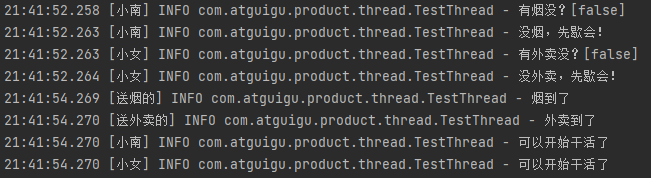


## 4.16 固定模式-顺序控制

### 4.16.1 固定运行顺序

比如，先2后1 打印

**<font color=blue size=5>wait notify模版</font>**

```java
@Slf4j
public class TestThread {
    static final Object lock=new Object(); // 锁对象
    static boolean hasRun=false;  // t2线程是否运行过
    public static void main(String[] args) throws InterruptedException {
        new Thread(()->{
            synchronized (lock){
                while (!hasRun){  // 没有运行t2就释放锁
                    try {
                        lock.wait();  // 等待
                    } catch (InterruptedException e) {
                        e.printStackTrace();
                    }
                }
                log.info("1");
            }
        },"t1").start();

        new Thread(()->{
            synchronized (lock){
                log.info("2");
                hasRun=true;
                lock.notify();  // 打印2后唤醒t1
            }
        },"t2").start();

    }
}
```


**<font color=blue size=5>park unpark模版</font>**

更为简单

```java
@Slf4j
public class TestThread {
    public static void main(String[] args) throws InterruptedException {
        Thread t1= new Thread(()->{
            LockSupport.park(); // 先park，等t2打印完2后唤醒
            log.info("1");
        },"t1");

        Thread t2= new Thread(()->{
            log.info("2");
            LockSupport.unpark(t1);  // 打印2后唤醒t1
        },"t2");

        t1.start();
        t2.start();
    }
}
```


### 4.16.2 交替输出

线程1输出a 5次，线程2输出b 5次，线程3输出c 5次。现要求输出abcabcabcabcabc

**<font color=blue size=5>wait notify模版</font>**

```java
@Slf4j
public class TestThread {
    public static void main(String[] args) throws InterruptedException {
        WaitNotify waitNotify=new WaitNotify(1,5);
        new Thread(()->{
            try {
                waitNotify.print("a",1,2);
            } catch (InterruptedException e) {
                throw new RuntimeException(e);
            }
        }).start();

        new Thread(()->{
            try {
                waitNotify.print("b",2,3);
            } catch (InterruptedException e) {
                throw new RuntimeException(e);
            }
        }).start();

        new Thread(()->{
            try {
                waitNotify.print("c",3,1);
            } catch (InterruptedException e) {
                throw new RuntimeException(e);
            }
        }).start();
    }
}
@AllArgsConstructor
class  WaitNotify{
    // 等待标记
    private int flag; 
    // 循环次数
    private int loopNumber;
    /**
     打印内容    打印标记   下一标记
       a           1        2
       b           2        3
       c           3        1
     **/
    public void print(String str,int waitFlag, int nextFlag) throws InterruptedException {
        for(int i=0;i<loopNumber;i++){
            synchronized (this){
                while (flag!=waitFlag){
                    this.wait();
                }
                System.out.print(str);
                flag=nextFlag;
                this.notifyAll();
            }
        }
    }
}
```

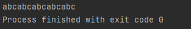


**<font color=blue size=5>await signal模版</font>**


```java
@Slf4j
public class TestThread {
    public static void main(String[] args) throws InterruptedException {
       AwaitSignal awaitSignal=new AwaitSignal(5);
       Condition a=awaitSignal.newCondition();  // a休息室
       Condition b=awaitSignal.newCondition();  // b休息室
       Condition c=awaitSignal.newCondition();  // c休息室

        new Thread(()->{
            awaitSignal.print("a",a,b); // 打印a,打印完了叫醒b
        }).start();

        new Thread(()->{
            awaitSignal.print("b",b,c); // 打印b,打印完了叫醒c
        }).start();

        new Thread(()->{
            awaitSignal.print("c",c,a); // 打印c,打印完了叫醒a
        }).start();

        Thread.sleep(1000);
        awaitSignal.lock();
        try {
            log.info("主线程唤醒a线程，开始打印...");
            a.signal();
        }finally {
            awaitSignal.unlock();
        }
    }
}
@AllArgsConstructor
class AwaitSignal extends ReentrantLock{
    private int loopNumber;
    /**
     * @param str  打印内容
     * @param current 进入哪间休息室等待
     * @param next    下一间休息室
     **/
    public void print(String str,Condition current, Condition next){
        for(int i=0;i<loopNumber;i++){
            lock();
            try {
                current.await();
                System.out.print(str);
                next.signal();
            } catch (InterruptedException e) {
                throw new RuntimeException(e);
            } finally {
                unlock();
            }
        }
    }
}
```


**<font color=blue size=5>park unpark模版</font>**

最简单:

```java
@Slf4j
public class TestThread {
    static Thread t1;
    static Thread t2;
    static Thread t3;

    public static void main(String[] args) throws InterruptedException {
        ParkUnpark parkUnpark=new ParkUnpark(5);
        t1=new Thread(()->{
            parkUnpark.print("a",t2);
        });
        t2=new Thread(()->{
            parkUnpark.print("b",t3);
        });
        t3=new Thread(()->{
            parkUnpark.print("c",t1);
        });

        t1.start();
        t2.start();
        t3.start();

        Thread.sleep(1000);
        LockSupport.unpark(t1); // main线程唤醒t1线程开始打印
    }
}
@AllArgsConstructor
class ParkUnpark{
    private int loopNumber;
    /**
     * @param str  打印内容
     * @param next  唤醒的下一线程
     **/
    public void print(String str,Thread next){
        for(int i=0;i<loopNumber;i++){
            LockSupport.park();
            System.out.print(str);
            LockSupport.unpark(next); // 唤醒下一线程
        }
    }
}
```


## 4.17 本章小结

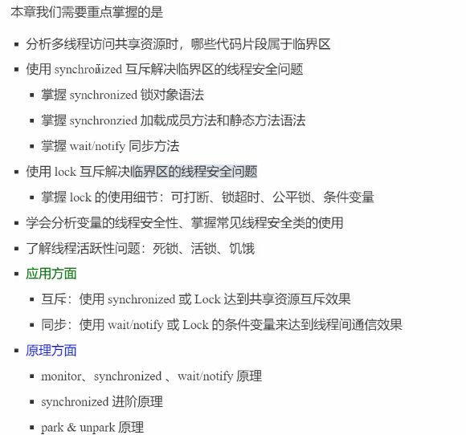


