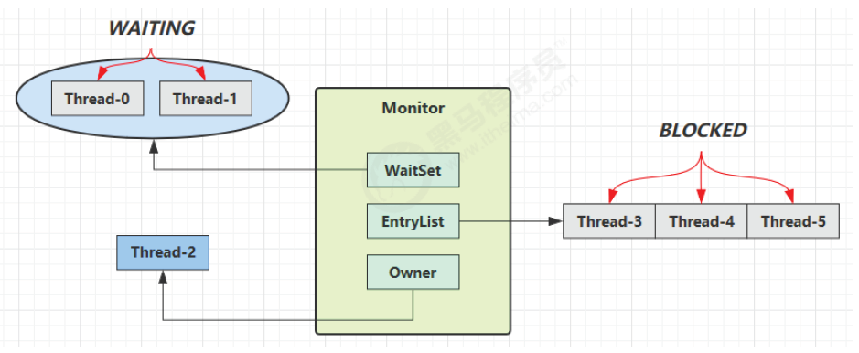

[toc]


**并发编程**

参考：

- 黑马并发编程：https://www.bilibili.com/video/BV16J411h7Rd/?spm_id_from=333.337.search-card.all.click&vd_source=5379a6806380b9446ccbd384a2377827，大部分参考这个，但感觉JUC容器类讲的不是很好，ThreadLocal没有，这部分建议参考尚硅谷
- 尚硅谷-JUC并发编程：https://www.bilibili.com/video/BV1ar4y1x727?p=144&spm_id_from=pageDriver&vd_source=5379a6806380b9446ccbd384a2377827  JUC容器类讲的很好
- Java 并发编程实战，英文原版java conncurrency in practice


# 第4章-共享模型之管程


## 4.4 变量的线程安全分析

成员变量和静态变量：

- 没有共享，线程安全
- 被共享了
  - 只有读操作：线程安全
  - 有读写操作：线程不安全


局部变量及其引用对象

- 局部变量：线程安全
- 局部变量引用的对象：未必线程安全
  - 该对象未逃离方法的作用域：线程安全
  - 该对象逃离方法的作用域：非线程安全


### 4.4.1 局部变量线程安全分析

案例1：局部变量

由于i在方法内部，**==存放在虚拟机栈的局部变量表中，线程私有，故线程安全==**。

```java
public static void test(){
    int i=10;
    i++;
}
```


```java
@Slf4j
public class TestThread {
    public static void main(String[] args) throws Exception {
        for(int i=0;i<1000;i++){
            test();  
    }

    public static void test() throws InterruptedException {
        ArrayList<Integer> list = new ArrayList<>();
        Thread t1=new Thread(()->{
            list.add(1);
        },"t1");

        Thread t2=new Thread(()->{
            list.add(2);
        },"t2");

        t1.start();
        t2.start();
        t1.join();  // 等t1 t2都完成
        t2.join();  
        System.out.println(JSON.toJSON(list));
    }
}
```

会出现 【null,1】  【null,2】【2】【1】等非线程安全的情况：


原因：ArrayList是非线程安全的,elementData和size都是共享变量

异常情况【null,1】  或【null,2】:

线程t1先进来拿到elementData，此时size=0，线程t1开始扩容（创建一个新数组，并将原数组中的元素复制到新数组，最后将新数组赋给elementData），扩容完成此时时间片刚好用完了（没执行elementData[size++]=e操作）；在t1扩容期间线程t2也进来了，由于t1扩容未完成，t2拿到的是旧elementData，size=0也要扩容，便new了一个数组并将elementData指向它，同时执行elementData[size++]=e赋值操作，但未将数据写回主内存（size写了，但elementData没写）；之后线程t1分到时间片后继续执行，获取到的size=1, 并执行赋值操作；最后t2先将数据写回主内存，接着t1写回主内存，于是t2的数据被覆盖，出现【null, 1】的情况


异常情况【1】或【2】：

线程t1和t2同时拿到size=0，之后t1时间片用完了，t2执行扩容、赋值操作，并elementData和size写回主内存，此后t1重新拿到时间片，由于size还是之前拿到的0，且无需扩容，并在下标0上执行赋值操作，将t2的写入覆盖。


ArrayList线程安全分析：


1. 扩容（ensureCapacityInternal函数）导致线程不安全：当计数minCapacity大于数组elementData长度时，开始扩容进入grow(minCapaticy)逻辑：数组长度变为原来的1.5倍，然后调Arrays.*copyOf*进行数据迁移（其中elementData为元数组，newCapacity为新长度），而copyOf函数底层是调System.arraycopy,且新new数组copy，将原数组中的元素赋值到新数组copy中。


2. size++导致的线程不安全


## 4.5 常见线程安全类

- String、Integer： 不可变类，内部状态不可改变
- StringBuffer
- Random
- HashTable（HashMap的线程安全类）、Vector（List的线程安全类）：加了synchronized
- java.util.concurrent包下的类

注意：

- ==多个线程调用它们同一个实例的某个方法是线程安全的，但多个方法组合在一起未必是线程安全的（原子）==，例如：hashtable的get和put方法都是原子的，但组合在一起非原子，若两个线程同时进来拿到"key"对应的值都是null，那么会put两次。

```java
Hashtable<String ,String > table=new Hashtable<>();
if(table.get("key")!=null){
    table.put("key","value");
}
```


- ·····加了final也未必是线程安全的

  ```java
  final Date d=new Date();  // 只保证引用d不可变，Date里面的属性可变
  ```

  


### 4.6 线程安全示例分析

模拟卖票：

```java
@Slf4j
public class TestThread {
    public static void main(String[] args) throws Exception {
       // 模拟多人抢票
        TicketWindow window=new TicketWindow(1000); // 总共1000张票
        // 所有抢票线程的集合
        List<Thread> list=new ArrayList<>();
        List<Integer> sellList=new Vector<>(); // 线程安全

        for(int i=0;i<2000;i++){ // 模拟2000个人同时抢1000张票
            Thread thread=new Thread(()->{ 
                // sellList.add线程安全（统计卖票数）     window.sell不安全
                sellList.add(window.sell(new Random().nextInt(5)+1)); //记录卖票数量
            });
            thread.start();
            list.add(thread);
        }
        // 等待所有抢票线程完成
        for (Thread thread:list){
            thread.join();
        }
        // 余票+卖票=1000则线程安全
        log.info("余票：{}，卖票：{}",window.getCount(),sellList.stream().mapToInt(i-> i).sum());
    }
}
@AllArgsConstructor
@Data
class TicketWindow {
    private int count;
    public int sell(int amount) {  // 卖票 线程不安全
        if (count>=amount){  
            count -=amount;
            return amount;
        }else{
            return 0;
        }
    }
}
```

sell方法不安全，count是线程共享的，可能线程A卖完票但没来得急将减掉后的库存值写回共享内存，其他线程就获取了旧库存继续卖票


改进：将sell加锁即可保证线程安全

```java
@AllArgsConstructor
@Data
class TicketWindow {
    private int count;
    public synchronized int sell(int amount) {  // 卖票 线程安全
        if (count>=amount){
            count -=amount;
            return amount;
        }else{
            return 0;
        }
    }
}
```


案例2：转账

```java
@Slf4j
public class TestThread {
    public static void main(String[] args) throws Exception {
       // 模拟转账
        Account a=new Account(1000);
        Account b=new Account(1000);

        Thread t1=new Thread(()->{
            for(int i=0;i<1000;i++){ // 转账1000次
                a.transfer(b,new Random().nextInt(5)+1);
            }
        },"t1");

        Thread t2=new Thread(()->{
            for(int i=0;i<1000;i++){ // 转账1000次
                b.transfer(a,new Random().nextInt(100)+1);
            }
        },"t2");

        t1.start();
        t2.start();
        t1.join();
        t2.join();

        log.info("转账后账户a+账户b总金额：{}",a.getMoney()+b.getMoney());
    }
}
@AllArgsConstructor
@Data
class Account {
    private int money;
    public void transfer(Account target,int amount) {  // 模拟转账
        if (money>=amount){
            setMoney(money-amount);
            target.setMoney(target.getMoney()+amount);
        }
    }
}
```

Account.transfer是非线程安全的，money和target都不安全，转完之后两个账户总和不为2000


解决：给Account类加锁，**==单纯给transfer方法加锁不行，锁的是this对象，而传入的target也是共享变量==**

```java
class Account {
    private int money;
    public void transfer(Account target,int amount) {  // 模拟转账
        synchronized (Account.class){
            if (money>=amount){
                setMoney(money-amount);
                target.setMoney(target.getMoney()+amount);
            }
        }
    }
}
```


## 4.7 synchronized底层原理

### 4.7.1 对象头

参见jvm中对象的内存布局。

1. 对象组成：对象头`(Mark Word、Klass Pointer)、`实例数据`、`对象填充


2.对象头：包括Mark Word和Klass Word

- Mark Word: 对象运行时数据，包括哈希码（hashcode）、GC分代年龄、是否启用偏向锁（biased_lock，1是0否）、加锁状态（01未锁定或可偏向，00轻量级锁定，10重量级锁定，11GC标记）。不同状态存储的内容有所不同：

  | 存储内容                                                     | 标志位 | 状态           |
  | ------------------------------------------------------------ | ------ | -------------- |
  | 对象哈希码（hashcode）、GC分代年龄(age)、是否启用偏向锁（biased_lock=0为否） | 01     | 正常（未锁定） |
  | 偏向线程id（thread）、时间戳（epoch）、GC分代年龄(age)、是否启用偏向锁（biased_lock=1为是） | 01     | 可偏向         |
  | 指向锁记录的指针（ptr_to_lock_record）                       | 00     | 轻量级锁定     |
  | 指向重量级锁的指针（ptr_to_lock_record）                     | 10     | 重量级锁定     |
  | 空，无需记录信息                                             | 11     | GC标记         |

  

- Klass Pointer: 类型指针，用来确定该对象属于哪种类型（比如String、Object...）

### 4.7.2 Monitor

Monitor 被翻译为监视器或管程。每个 Java 对象都可关联一个 Monitor 对象（操作系统层面的，与java对象区分开）：MarkWord中记录Monitor对象的指针地址（**==synchronized 是重量级锁，Mark Word状态标志位为10，ptr_to_lock_record指针指向Monitor对象==**） 。

工作流程：

* 开始时 Monitor 中 Owner 为 null
* Thread-2 执行 synchronized(obj) 将 Monitor 的所有者 Owner 置为 Thread-2，Monitor 中只能有一个 Owner，**obj 对象Mark Word 的ptr_to_lock_record指向 Monitor**，**同时把obj原来的 MarkWord 存入线程栈中的锁记录中，方便还原**
  
* 在 Thread-2 上锁的过程中，如果Thread-3、Thread-4、Thread-5 也执行 synchronized(obj)，就会进入阻塞队列EntryList （双向链表）
* Thread-2 执行完同步代码块的内容，设置 Owner 为空，**把线程栈的锁记录中的对象头的值设置回 MarkWord**；接着唤醒 EntryList 中等待的线程来竞争锁，竞争是**非公平的**
* WaitSet 中的 Thread-0，Thread-1是以前获得过锁，但条件不满足进入 WAITING 状态的线程（wait-notify 机制）



注意：

* synchronized 必须是进入同一个对象的 Monitor 才有上述的效果
* 不加 synchronized 的对象不会关联监视器，不遵从以上规则

### 4.7.3 从字节码层面解读synchronized

```java
public class SynchronizedTest {
    static final Object lock=new Object();
    static int counter=0;
    public static void main(String[] args){
        synchronized (lock){
            counter++;
        }
    }
}
```


```java
 0 getstatic #2 <SynchronizedTest.lock : Ljava/lang/Object;> // 拿到lock对象的引用
 3 dup     // 将lock引用复制一份
 4 astore_1  // 将lock引用存储到局部变量表下标1的位置（方便解锁）
 5 monitorenter   // synchronized : 将lock对象的MarkWord（ptr_to_lock_record指针）指向 Monitor对象，使用c实现
 6 getstatic #3 <SynchronizedTest.counter : I>  // 获取类静态变量counter（放入操作数栈）
 9 iconst_1           // 获取常数1（放入操作数栈）
10 iadd               // counter+1
11 putstatic #3 <SynchronizedTest.counter : I>  //将counter+1结果从操作数栈弹出并存回主内存（静态变量counter）
14 aload_1   // 从当前线程的虚拟机栈（局部变量表）中获取原来的MarkWord(之前存了一份)
15 monitorexit   // 还原obj的MarkWord，唤醒EntryList
16 goto 24 (+8)    // 同步代码块里的异常处理
19 astore_2    // 将异常对象存储在局部变量表下标2的位置
20 aload_1  // 从当前线程的虚拟机栈（局部变量表）中获取原来的MarkWord
21 monitorexit  // 还原obj的MarkWork，唤醒EntryList
22 aload_2  // 加载异常对象到操作数栈
23 athrow  // 抛出异常
24 return
   
```

synchronized： **==考虑了同步代码块正常执行和出现异常的场景，都能正常解锁。==**

## 4.8 synchronized原理进阶

### 4.8.1 轻量级锁

轻量级锁使用场景：一个对象有多个线程访问，但访问时间错开（没有竞争），可以使用轻量级锁来优化。

轻量级锁对使用者是透明的（不可见，用户无感知，重量级和轻量级的切换由JVM控制），语法仍是synchronized。

假设有两个方法同步块，利用同一个对象加锁：

```java
static final Object obj = new Object();
public static void method1() {
    synchronized( obj ) {
        // 同步块 A
        method2();
    }
}
public static void method2() {
    synchronized( obj ) {
    	// 同步块 B
    }
}
```

可重入锁：线程可以进入任何一个它已经拥有的锁所同步着的代码块，可重入锁最大的作用是**避免死锁**

轻量级锁在没有竞争时（锁重入时），每次重入仍然需要执行 CAS 操作，Java 6 才引入偏向锁来优化

* 创建锁记录（Lock Record）对象，每个线程的**栈帧**都会包含一个锁记录结构，存储锁定对象的 Mark Word和对象指针

  

* 让锁记录中 Object reference 指向锁住的对象，并将Object的 Mark Word 值存入锁记录（没加锁前为01正常状态，Mark Word内容为hashcode之类，存入锁记录为了后续还原），然后尝试用 CAS （原子操作）替换 Object 的 Mark Word（加锁后锁状态为00轻量级锁，Mark Word内容变为指向锁记录的指针）

  

* 如果 CAS 替换成功，对象头中存储了锁记录地址和状态 00（轻量级锁） ，表示由该线程给对象加锁
  

* 如果 CAS 失败，有两种情况：

  * 如果是其它线程已经持有了该 Object 的轻量级锁，这时表明有竞争，进入锁膨胀过程
  * 如果是线程自己执行了 synchronized 锁重入，就添加一条 Lock Record 作为重入的计数


- 接着进入method2，再创建一个method2的栈帧（内含锁记录），与method1类似也要做CAS操作，不同的是由于是同一个线程锁重入，锁记录中Mark Word为null (其他栈帧存了不重复存储)

  

* 当退出 synchronized 代码块（解锁时），如果有取值为 null（method2执行完毕） 的锁记录，表示有重入，这时重置锁记录，表示重入计数减 1

  

* 当退出 synchronized 代码块（解锁时），如果锁记录的值不为 null（method1执行完毕），这时使用 CAS **将 Mark Word 的值恢复给对象头**（还原为hashcode等的正常状态）

  * 成功，则解锁成功
  * 失败，说明轻量级锁进行了锁膨胀或已经升级为重量级锁，进入重量级锁解锁流程


***

### 4.8.2 锁膨胀

**==如果在尝试加轻量级锁的过程中，CAS 操作失败（可能其它线程为此对象加了轻量级锁，有竞争），当前线程会进行等待（即自旋，等待其他线程释放锁），若等待超过最大次数或等待时间过长，会进入锁膨胀，将轻量级锁升级为重量级锁==**

```java
static Object obj = new Object();
public static void method1() {
    synchronized( obj ) {
        // 同步块 
    }
}
```

* 当 Thread-1 进行轻量级加锁时，Thread-0 已经对该对象加了轻量级锁

  

* Thread-1 加轻量级锁失败，进入锁膨胀（让解锁操进入重量级锁操作，轻量级锁没有阻塞，重量级锁才有）流程：

  * 为 Object 对象申请 Monitor 锁，让Object指向重量级锁地址

  * **通过 Object 对象头获取到持锁线程**，将 Monitor 的 Owner 置为 Thread-0，然后Thread-1进入 Monitor 的阻塞队列 EntryList


  

* 当 Thread-0 退出同步块解锁时，使用 CAS 将 Mark Word 的值恢复给对象头失败，这时进入重量级解锁流程，即按照 Monitor 地址找到 Monitor 对象，设置 Owner 为 null，唤醒 EntryList 中 BLOCKED 线程

------

### 4.8.3 自旋优化

重量级锁竞争时，还可使用自旋（即让**==当前线程先不进入阻塞队列，而是进行几次循环，等待锁释放==**）进行优化，若自旋成功（自旋过程中持锁线程已退出同步块，释放了锁），当前线程就可避免阻塞（阻塞要上下文切换，耗费性能）。

注意：

* 自旋占用 CPU 时间，单核 CPU 自旋就是浪费时间，因为同一时刻只能运行一个线程，多核 CPU 自旋才能发挥优势
* 自旋失败的线程会进入阻塞状态

优点：不会进入阻塞状态，**减少线程上下文切换的消耗**

缺点：当自旋的线程越来越多时，会不断的消耗 CPU 资源

* 自旋成功的情况：
  
  ​    
  
* 自旋失败的情况：

  

说明：

* 在 Java 6 之后自旋锁是自适应的，比如对象上一次自旋操作成功，那么认为此次自旋成功可能性较高，就多自旋几次；反之，就少自旋甚至不自旋，比较智能
* Java 7 之后不能控制是否开启自旋功能，由 JVM 控制

```java
//手写自旋锁
public class SpinLock {
    // 泛型装的是Thread，原子引用线程
    AtomicReference<Thread> atomicReference = new AtomicReference<>();

    public void lock() {
        Thread thread = Thread.currentThread();
        System.out.println(thread.getName() + " come in");

        //开始自旋，旧值为null，更新值是当前线程
        while (!atomicReference.compareAndSet(null, thread)) {
            Thread.sleep(1000);
            System.out.println(thread.getName() + " 正在自旋");
        }
        System.out.println(thread.getName() + " 自旋成功");
    }

    public void unlock() {
        Thread thread = Thread.currentThread();

        //线程使用完锁把引用变为null
		atomicReference.compareAndSet(thread, null);
        System.out.println(thread.getName() + " invoke unlock");
    }

    public static void main(String[] args) throws InterruptedException {
        SpinLock lock = new SpinLock();
        new Thread(() -> {
            //占有锁
            lock.lock();
            Thread.sleep(10000); 

            //释放锁
            lock.unlock();
        },"t1").start();

        // 让main线程暂停1秒，使得t1线程先执行
        Thread.sleep(1000);

        new Thread(() -> {
            lock.lock();
            lock.unlock();
        },"t2").start();
    }
}
```


***

### 4.8.4 偏向锁

#### 4.8.4.1 概念

轻量级锁在没有竞争时（就自己这个线程），每次重入仍要执行CAS操作，有一定性能损耗，可采用偏向锁进行优化。

偏向锁的思想是偏向于让第一个获取锁对象的线程，这个线程之后重新获取该锁不再需要同步操作：

* 当锁对象第一次被线程获得的时候进入偏向状态，标记为 101，同时**使用 CAS 操作将线程 ID 记录到 Mark Word**。之后重入发现这个线程 ID 是自己的就表示没有竞争，不用重新CAS。

* 当有另外一个线程去尝试获取这个锁对象时，偏向状态就宣告结束，此时撤销偏向（Revoke Bias）后恢复到未锁定或轻量级锁状态

```java
static final Object obj = new Object();
public static void m1() {
    synchronized( obj ) {
        // 同步块 A
        m2();
    }
}
public static void m2() {
    synchronized( obj ) {
    	// 同步块 B
        m3();
    }
}
public static void m3() {
    synchronized( obj ) {
    	// 同步块 C
    }
}
```


#### 4.8.4.2 偏向状态


一个对象创建时：

* 如果开启了偏向锁（==默认开启==），那么对象创建后，MarkWord 值为 0x05 即最后 3 位为 101，thread、epoch、age 都为 0

* 偏向锁是默认是延迟的，不会在程序启动时立即生效，如果想避免延迟，可以加 VM 参数 

  `-XX:BiasedLockingStartupDelay=0` 来禁用延迟。JDK 8 延迟 4s 开启偏向锁原因：在刚开始执行代码时，会有好多线程来抢锁，如果开偏向锁效率反而降低

* 当一个对象已经计算过 hashCode，就再也无法进入偏向状态了

* 添加 VM 参数 ==-XX:-UseBiasedLocking 禁用偏向锁==


撤销偏向锁的状态：

* 调用对象的 hashCode：偏向锁的对象 MarkWord 中存储的是线程 id，调用 hashCode 导致偏向锁被撤销（原因： **==在偏向锁状态存储线程id耗费54bit，没地方存31 bit的hashcode==**）
* 当有其它线程使用偏向锁对象时，会将偏向锁升级为轻量级锁
* 调用 wait/notify，需要申请 Monitor，升级为重量级锁

**批量撤销**：如果对象被多个线程访问，但没有竞争，这时偏向了线程 T1 的对象仍有机会重新偏向 T2，重偏向会重置对象的 Thread ID

* 批量重偏向：当撤销偏向锁阈值超过 20 次后，JVM 会觉得是不是偏向错了，于是在给这些对象加锁时重新偏向至加锁线程

* 批量撤销：当撤销偏向锁阈值超过 40 次后，JVM 会觉得自己确实偏向错了，根本就不该偏向，于是整个类的所有对象都会变为不可偏向的，新建的对象也是不可偏向的


**==说明：偏向锁测试前提是没有线程竞争==**

测试1：对象创建后默认开启了偏向锁（101）

```java
@Slf4j
public class TestThread {
    public static void main(String[] args) throws InterruptedException {
       Account account=new Account();
       //打印对象头
       log.info(ClassLayout.parseInstance(account).toPrintable());
    }
}
@AllArgsConstructor
@Data
class Account {
}
```

依赖（对应jdk1.8）：

```xml
<dependency>
    <groupId>org.openjdk.jol</groupId>
    <artifactId>jol-core</artifactId>
    <version>0.8</version>  
</dependency>
```


测试2：加锁前中后都打印对象头

```java
@Slf4j
public class TestThread {
    public static void main(String[] args) throws InterruptedException {
       Account account=new Account();
       log.info(ClassLayout.parseInstance(account).toPrintable());
       synchronized (account){
           log.info(ClassLayout.parseInstance(account).toPrintable());
       }
        log.info(ClassLayout.parseInstance(account).toPrintable());
    }
}
@AllArgsConstructor
@Data
class Account {
}
```

可以看出一直是偏向锁状态，且加锁及解锁后对象头中的线程id不变


测试3：禁用偏向锁， VM 参数 ==-XX:-UseBiasedLocking 

可以看出从正常无锁状态->  轻量级锁->  正常无锁状态


优先级：**==偏向锁-> 轻量级锁-> 重量级锁==**

- 开启了偏向锁，使用偏向锁
- 其他线程用了锁对象会撤销偏向锁变成轻量级锁
- 轻量级锁加了但有线程竞争，会膨胀为重量级锁


测试4：调用对象的 hashCode禁用偏向锁

正常状态->  轻量级锁-> 正常状态

```java
@Slf4j
public class TestThread {
    public static void main(String[] args) throws InterruptedException {
       Account account=new Account();
       account.hashCode(); // 调hashCode()禁用偏向锁
       log.info(ClassLayout.parseInstance(account).toPrintable());
       synchronized (account){
           log.info(ClassLayout.parseInstance(account).toPrintable());
       }
        log.info(ClassLayout.parseInstance(account).toPrintable());
    }
}
@AllArgsConstructor
@Data
class Account {
}
```


测试5：当有其它线程使用偏向锁对象时，会将偏向锁升级为轻量级锁

```java
@Slf4j
public class TestThread {
    public static void main(String[] args) throws InterruptedException {
       Account account=new Account();
       new Thread(()->{
           log.info(ClassLayout.parseInstance(account).toPrintable());
           synchronized (account){
               log.info(ClassLayout.parseInstance(account).toPrintable());
           }
           log.info(ClassLayout.parseInstance(account).toPrintable());
           synchronized (TestThread.class){
               TestThread.class.notify(); // 执行完上面的代码唤醒t1线程
           }
       },"t1").start();
       
        new Thread(()->{
            // t2先等待t1执行完，偏向锁必须在没有线程竞争的条件下测试
            synchronized (TestThread.class){
                try {
                    TestThread.class.wait();
                } catch (InterruptedException e) {
                    throw new RuntimeException(e);
                }
            }
            log.info(ClassLayout.parseInstance(account).toPrintable());
            synchronized (account){
                log.info(ClassLayout.parseInstance(account).toPrintable());
            }
            log.info(ClassLayout.parseInstance(account).toPrintable());
        },"t2").start();
    }
}
@AllArgsConstructor
@Data
class Account {
}
```

输出(截取)：t1首先获取到偏向锁（状态变化：101-> 101-> 101），t1执行完后t2访问锁对象account，偏向锁失效，加的轻量级锁（状态101->000->001）

```bash
23:40:01.162 [t1] 00000101 00000000 00000000 00000000
23:40:01.166 [t1] 00000101 01000000 01101000 11110010
23:40:01.167 [t1] 00000101 01000000 01101000 11110010
23:40:01.168 [t2] 00000101 01000000 01101000 11110010
23:40:01.169 [t2] 10000000 11110011 01001111 01011011
23:40:01.170 [t2] 00000001 00000000 00000000 00000000
```

***

#### 4.8.4.3 批量重偏向

如果对象虽然被多个线程访问，但没有竞争，这时偏向了线程t1的对象仍有机会重新偏向t2, 重偏向会重置对象的Thread ID。

当**==撤销偏向锁的阈值超过20次==**后，jvm会觉得，我是不是偏向错了，于是会在给这些对象加锁时重新偏向至加锁线程。

```java
package com.atguigu.product.thread;
import com.alibaba.fastjson.JSON;
import lombok.AllArgsConstructor;
import lombok.Data;
import lombok.extern.slf4j.Slf4j;
import org.openjdk.jol.info.ClassLayout;

import java.security.acl.LastOwnerException;
import java.util.*;
/**
 * @Author qiang.long
 * @Date 2024/04/07
 * @Description 统筹 线程
 **/
@Slf4j
public class TestThread {
    public static void main(String[] args) throws InterruptedException {
        Vector<Account> list=new Vector<>(); // 线程安全
       new Thread(()->{
           for(int i=0;i<30;i++){
               Account account=new Account();
               list.add(account);
               synchronized (account){
                   log.info(i+" "+ClassLayout.parseInstance(account).toPrintable());
               }
           }
           synchronized (list){
               list.notify(); // 执行完上面的代码唤醒t2线程
           }

       },"t1").start();

        new Thread(()->{
            // t2先等待t1执行完，偏向锁必须在没有线程竞争的条件下测试
            synchronized (list){
                try {
                    list.wait();
                } catch (InterruptedException e) {
                    throw new RuntimeException(e);
                }
            }
            for(int i=0;i<30;i++){
                Account account=list.get(i); // 从list取出
                log.info(i+" "+ClassLayout.parseInstance(account).toPrintable());
                synchronized (account){  // 原来account偏向t1，现在撤销
                    log.info(i+" "+ClassLayout.parseInstance(account).toPrintable());
                }
                log.info(i+" "+ClassLayout.parseInstance(account).toPrintable());
            }
        },"t2").start();
    }
}
@AllArgsConstructor
@Data
class Account {
}
```

t1一直是加偏向锁，且线程ID为Thread-1

t1运行完后，线程t2从list中获取对象，由于之前account偏向Thread-1，现在进入线程t2偏向锁撤销，在撤销了19次后（0~18状态都是：偏向锁101->轻量级锁000->正常001），从第20次（19）开始状态变为101-> 101->101 ，account重偏向到Thread-2


#### 4.8.4.4 批量撤销

当撤销偏向锁阈值超过40次后，jvm会觉得，自己确实偏向错了。于是整个类的所有对象都会变为不可偏向，新建的对象也是不可偏向的。


### 4.8.5 锁消除

锁消除是指对于被检测出不可能存在竞争的共享数据的锁进行消除，这是 JVM **即时编译器的优化**

锁消除主要是通过**逃逸分析**来支持，如果堆上的共享数据不可能逃逸出去被其它线程访问到，那么就可以把它们当成私有数据对待，也就可以将它们的锁进行消除（同步消除：JVM 逃逸分析）


测试：分别运行方法a和方法b 20次，统计平均耗时，比较加锁和不加锁的性能差异。


结果：

- 从第一幅图可以看出，加锁和不加锁运行时间相差不大，原因是**==JIT会对反复运行的代码进行优化，当发现方法b中加锁没有必要时，就会自动去掉synchronized==**
- ==-XX:-EliminateLocks 禁用自动锁消除==，从第二幅图可以看出，禁用之后加锁代码运行时间明显长于未加锁代码


## 4.9 wait/notify

### 4.9.1 原理

**<font color=blue size=5>原理之wait/notify</font>**


- Owner线程发现条件不满足，调用wait方法，即可进入WaitSet变为WAITTING状态（区分开EntryList和WaitSet，前者存放想要获得锁在排队的线程 后者存放已经获得锁但放弃了锁的线程）
- BLOCKED和WAITTING线程都处于阻塞状态，不占用CPU时间片
- BLOCKED线程会在Owner线程释放锁时唤醒
- WAITTING线程会在Owner线程调用notify或notifyAll时唤醒，但唤醒后并不意味着立即获得锁，仍需进入EntryList重新竞争

### 4.9.2 API

**<font color=blue size=5>API</font>**

- obj.wait()让进入object监视器的线程到WaitSet等待
- obj.notify()在object上正在WaitSet等待的线程中挑一个唤醒
- obj.notifyAll()让在object上正在WaitSet等待的线程全部唤醒
- obj.wait(long timeout)，有限等待，单位ms，过期自动苏醒，不用其他线程调用notify唤醒；若在休眠期内被其他线程调用notify/notifyAll唤醒，则不会受timeout限制（提前苏醒）

它们都是线程之间协作的手段，**==都属于Object方法，必须获得对象的锁，才能调用这几个方法==**。


```java
@Slf4j
public class TestThread {
    public static void main(String[] args) throws InterruptedException {
        Object object=new Object();
        object.wait(); // 必须获取到object的锁才能调wait/notify/notifyAll方法，否则报错
    }
}
```

**==必须获取到object的锁才能调wait/notify/notifyAll方法，否则报错==**


测试：wait/notify/notifyAll

```java
@Slf4j
public class TestThread {
    public static void main(String[] args) throws InterruptedException {
        Object object=new Object();
        new Thread(()->{
            log.info("执行...");
            synchronized (object){
                try {
                    object.wait(); // t1释放锁到object的WaitSet中休息
                } catch (InterruptedException e) {
                    throw new RuntimeException(e);
                }
            }
            log.info("其他代码");
        },"t1").start();

        new Thread(()->{
            log.info("执行...");
            synchronized (object){
                try {
                    object.wait(); // t2释放锁到object的WaitSet中休息
                } catch (InterruptedException e) {
                    throw new RuntimeException(e);
                }
            }
            log.info("其他代码");
        },"t2").start();

        Thread.sleep(2000);  // main线程sleep 2s确保t1 t2都到WaitSet中休息去了
        synchronized (object){
            log.info("main线程获取到锁");
            object.notify(); // 随机唤醒object WaitSet中的一个线程
            // object.notifyAll(); // 唤醒object WaitSet中的所有线程
        }
    }
}
```

t1 t2线程获取到object的Monitor所有权后调用wait方法释放所有权进入WaitSet休息，之后主线程调用notify或notifyAll唤醒。

notify()随机唤醒WaitSet中的一个线程


notifyAll()唤醒WaitSet中的所有线程


测试：有限期等待

```java
@Slf4j
public class TestThread {
    public static void main(String[] args) throws InterruptedException {
        Object object=new Object();
        new Thread(()->{
            log.info("执行...");
            synchronized (object){
                try {
                    object.wait(2000); // 有限等待，2s后自动苏醒
                } catch (InterruptedException e) {
                    throw new RuntimeException(e);
                }
                
            }
            log.info("其他代码");
        },"t1").start();
    }
}
```

t1线程过了2s后自动唤醒


测试：提前唤醒wait(timeout)的线程

```java
@Slf4j
public class TestThread {
    public static void main(String[] args) throws InterruptedException {
        Object object=new Object();
        new Thread(()->{
            log.info("执行...");
            synchronized (object){
                try {
                    object.wait(2000); // 有限等待，2s后自动苏醒
                } catch (InterruptedException e) {
                    throw new RuntimeException(e);
                }
            }
            log.info("其他代码");
        },"t1").start();
        Thread.sleep(1000);  // 提前唤醒t1
        synchronized (object){
            object.notify(); // 唤醒t1
        }
    }
}
```

本来t1线程休息2s, 但main线程在休息1s后就调用notify将其唤醒


### 4.9.3 sleep 和wait的区别

**<font color=blue size=5>sleep (long n)和wait(long n)的区别</font>**

- sleep是Thread的方法，而wait是Object的方法

- sleep不需要配合synchronized使用，而wait需要和synchronized一起使用（必须要获取到锁，才能调wait）

- sleep不会释放对象锁，wait释放对象锁

- 调用之后线程状态都是TIMED_WAITING

  

## 4.10 设计模式

### 4.10.1 同步模式-保护性暂停

即Guaraded Supension，用在一个线程等待另一个线程的执行结果

- 有一个结果需要从一个线程传递到另一个线程，让他们关联同一个GuaradedObject
- 如果有结果不断从一个线程到另一个线程，则改用消息队列（见生产者/消费者），此时不能用GuaradedObject
- JDK中，join、Future的实现采用的就是此模式
- 因为要等待另一方的结果，因此归类到同类模式

如下图所示，t1线程等待并获取t2线程的结果（GuaradedObject中response属性用来传递中间结果）


保护性暂停模拟：

- 创建GuardedObject类，get（）方法等待并获取结果response，complete方法将结果赋给response并唤醒所有WaitSet中的线程。
- main方法中创建两个线程，t1等待t2的计算结果，t2调用caculate方法进行计算并将计算结果赋值给guardedObject.response，然后唤醒所有线程
- t1线程在t2线程结束后就可获取计算结果

**==保护性暂停模式相较于join的好处==**：

- join必须等待另一个线程结束，而保护性暂停被等待的线程还能继续干别的事，比如t2线程在guardedObject.complete(caculate());后还能继续执行别的代码

```java
@Slf4j
public class TestThread {
    public static void main(String[] args) throws InterruptedException {
        GuardedObject guardedObject=new GuardedObject();
        new Thread(()->{
            try {
                long sum=(long)guardedObject.get(); // 等待获取结果
                log.info("计算结果:{}",sum);
            } catch (InterruptedException e) {
                throw new RuntimeException(e);
            }
        },"t1").start();

        new Thread(()->{
            log.info("开始计算");
            guardedObject.complete(caculate());  // 将计算结果赋值给guardedObject.response并唤醒所有线程
        },"t2").start();
    }
    public static Long caculate(){
        long sum=0;
        for(long i=0;i<100000;i++){
            for(long j=0;j<100000;j++){
                sum +=i+j;
            }
        }
        return sum;
    }
}

class GuardedObject{
    private Object response;
    public Object get() throws InterruptedException {
        // response为空一直等待
        while (response==null){
            synchronized (this){
                this.wait();
            }
        }
        return response;
    }
    public void complete(Object response){
        synchronized (this){
            // 给response赋值并唤醒所有GuardedObject上WaitSet中的所有线程
            this.response=response;
            this.notifyAll();
        }
    }
}
```


### 4.10.2 join(保护性暂停应用)

join应用的就是保护性暂停模式

```java
// 无限期等待
public final void join() throws InterruptedException {
        join(0);
    }
// 有限期等待
public final synchronized void join(long millis)
    throws InterruptedException {
        long base = System.currentTimeMillis();
        long now = 0;

        if (millis < 0) {
            throw new IllegalArgumentException("timeout value is negative");
        }
        // 无限期等待
        if (millis == 0) {
            while (isAlive()) {
                wait(0);
            }
        } else { // 有限期等待
            while (isAlive()) { // 当前线程还存活
                long delay = millis - now;
                if (delay <= 0) {  // 等待时间到，退出循环
                    break;
                }
                wait(delay);
                now = System.currentTimeMillis() - base;  // 记录经历的时间
            }
        }
    }
```


### 4.10.3 保护性暂停拓展- 解耦等待和生产-分析

图中Futures好比居民楼的信箱（每个信箱有房间编号），左侧t0，t2， t4好比等待邮件的居民，右侧t1, t3, t5 好比邮递员。在多个类之间使用GuradedObject对象作为参数传递不是很方便，因此设计一个用来解耦的中间类，这样不仅能解耦【结果等待者】和【结果生产者】，还能同时支持多个任务的管理。


实现：MailBoxes模拟邮箱（很多个），3个线程收信，3个线程送信。注意**==保护性暂停模式需要生产者和消费者数量相同（一一对应）。==**

```java
@Slf4j
public class TestThread {
    public static void main(String[] args) throws InterruptedException {
        // 模拟3个人收信
        for (int i=0;i<3;i++){
            new People().start();
        }
        // 2s后开始送信
        Thread.sleep(2000);
        // 模拟3个邮递员送信
        for(int id:MailBoxes.getIds()){
            new Postman(id,"Mail"+id).start();
        }
    }
}

/**
 * 居民类
 **/
@Slf4j
class People extends Thread{
    @Override
    public void run(){
        // 收信
        GuardedObject guardedObject=MailBoxes.createGuardedObject(); // 创建好邮箱
        log.info("开始收信，id:{}",guardedObject.getId());
        try {
            Object mail=guardedObject.get(5000); // 最多等5s
            log.info("收到信，id:{},内容：{}",guardedObject.getId(),mail);
        } catch (InterruptedException e) {
            throw new RuntimeException(e);
        }
    }
}

/**
 * 邮件类(模拟送信)
 **/
@Slf4j
@AllArgsConstructor
@Data
class Postman extends Thread{
    private int mailId; // 邮件对应的邮箱id
    private String mail; // 邮件内容
    @Override
    public void run(){
        GuardedObject guardedObject=MailBoxes.getGuardedObject(mailId); //通过邮箱id获取GuardedObject
        log.info("开始送信，id:{},内容：{}",guardedObject.getId(),mail);
        guardedObject.complete(mail); // 填充邮箱内容
    }
}

/**
 * 邮箱类
 **/
class MailBoxes{
    // key=id value=GuardedObject
    private static Map<Integer,GuardedObject> boxes=new Hashtable<>(); // 线程安全
    private static int id=1;
    /**
     * 产生唯一id (由MailBoxes控制，防止重复)
     **/
    private static synchronized int generateId(){
        return id++;
    }
    /**
     * 创建GuardedObject对象并加入boxes (Hashtable线程安全，不用加synchronized)
     **/
    public static GuardedObject createGuardedObject(){
        GuardedObject guardedObject=new GuardedObject(generateId());
        boxes.put(guardedObject.getId(),guardedObject);
        return guardedObject;
    }
    /**
     * 获取键集
     **/
    public static Set<Integer> getIds(){
        return boxes.keySet();
    }
    /**
     * 通过id获取并移除GuardedObject（一次性的，用完了就没用了，否则boxes只进不出）
     **/
    public static GuardedObject getGuardedObject(int id){
        return boxes.remove(id);
    }
}

@Data
class GuardedObject{
    // 标识GuardedObject
    private int id;
    private Object response;
    public GuardedObject(int id) {
        this.id = id;
    }
    /**
     * 有限期等待
     **/
    public Object get(long timeout) throws InterruptedException {
        // response为空一直等待
        long now=System.currentTimeMillis(); // 当前时刻
        long passedTime=0; // 经历时长
        while (response==null){
            if(passedTime>=timeout){
                break;
            }
            synchronized (this){
                this.wait(timeout-passedTime); // 防止虚假唤醒（调了notifyAll但给response赋null）
            }
            passedTime +=System.currentTimeMillis()-now; // 累加
            now=System.currentTimeMillis();
        }
        return response;
    }
    public void complete(Object response){
        synchronized (this){
            // 给response赋值并唤醒所有response上WaitSet中的所有线程
            this.response=response;
            this.notifyAll();
        }
    }
}
```


### 4.10.4 异步模式-生产者/消费者

- 与保护性暂停模式中的GuardedObject不同，**==不需要产生结果和消费结果的线程一一对应==**
- 消费者队列可用来平衡生产和消费的线程资源
- 生产者仅负责产生结果数据，不关心数据如何处理，而消费者专心处理结果数据
- **==消息队列是有容量限制的，满时不会再加数据，空时不会再消耗数据==**
- **==JDK中各种阻塞队列采用的就是该模式==**

如下图：t1, t2,  t3为生产者线程， t4为消费者线程


模拟实现：

```java
@Slf4j
public class TestThread {
    public static void main(String[] args) throws InterruptedException {
        // 创建消息队列
        MessageQueue messageQueue=new MessageQueue(new LinkedList<>(),2);
        // 创建3个生产者线程
        for(int i=0;i<3;i++){
            int id=i;
            new Thread(()->{
                try {
                    messageQueue.put(new Message(id,"Message"+id));
                } catch (InterruptedException e) {
                    throw new RuntimeException(e);
                }
            },"生产者"+i).start();
        }

        // 1个消费者线程
        new Thread(()->{
            while (true){ // 不断消费
                try {
                    Thread.sleep(2000); // 隔2s消费
                    messageQueue.take();
                } catch (InterruptedException e) {
                    throw new RuntimeException(e);
                }
            }
        },"消费者").start();
    }
}


/**
 * 消息队列类: 线程间通信 （区别于RabbitMQ进程间通信）
 **/
@Slf4j
@AllArgsConstructor
@Data
class MessageQueue{
    private LinkedList<Message> list=new LinkedList<>(); // 消息队列集合（头取尾塞）
    private int capacity; // 消息队列容量
    // 存消息
    public void put(Message message) throws InterruptedException {
        synchronized (list){
            // 检查队列：满了不再放消息
            while (list.size()>=capacity){
                log.info("消息队列已满，生产者线程等待...");
                list.wait();
            }
            list.add(message); // 尾塞消息
            log.info("已生产消息：{}",message);
            list.notifyAll(); // 唤醒等待线程
        }
    }

    // 取消息
    public Message take() throws InterruptedException {
        synchronized (list){
            // 检查消息队列：为空等待
            while (list.isEmpty()){
                log.info("消息队列为空，消费者线程等待...");
                list.wait();
            }
            Message message= list.remove(); // 从头部取出消息返回
            log.info("已消费消息：{}",message);
            list.notifyAll(); // 唤醒等待线程
            return message;
        }
    }
}

/**
 * 消息类: 只读（线程安全）
 **/
@AllArgsConstructor
@Getter
final class Message{
    private int id; // 消息id
    private Object value; // 消息内容
    @Override
    public String toString(){
        return "Message{id="+id+", value="+value+"}";
    }
}
```

创建3个生产者线程生产消息，1个消费者线程每隔2s消费1个消息，消息队列容量2，队列满了生产者线程等待，队列为空消费者线程等待。


## 4.11 park/ unpark

**<font color=blue size=5>语法</font>**

- park用于暂停当前线程，进入**==WAITTING无限等待状态==**
- 其他线程调用unpark恢复暂停的线程，让其继续运行
- **==<font color=red size=3>unpark在park之后调用也生效，特别注意</font>==**

```java
// 暂停当前线程
LockSupport.park();

// 恢复某个线程的运行
LockSupport.unpark(暂停线程对象);
```

示例：

```java
@Slf4j
public class TestThread {
    public static void main(String[] args) throws InterruptedException {
        Thread t1=new Thread(()->{
            log.info("start...");
            try {
                Thread.sleep(1000);
                log.info("park...");
                LockSupport.park();  // 暂停t1线程
                log.info("resume...");
            } catch (InterruptedException e) {
                throw new RuntimeException(e);
            }
        },"t1");
        t1.start();

        Thread.sleep(2000);
        log.info(JSON.toJSONString(t1.getState())); // 打印park后t1线程状态
        log.info("unpark...");
        LockSupport.unpark(t1); // 恢复t1线程运行
    }
}
```

t1线程启动1s后调用park方法暂停（此后t1线程处于WAITTING无限等待状态），main线程在2s后调用unpark恢复t1线程运行。


main线程先unpark(t1)，t1线程后park也能恢复其运行

```java
@Slf4j
public class TestThread {
    public static void main(String[] args) throws InterruptedException {
        Thread t1=new Thread(()->{
            log.info("start...");
            try {
                Thread.sleep(2000);
                log.info("park...");
                LockSupport.park();  // 暂停t1线程
                log.info("resume...");
            } catch (InterruptedException e) {
                throw new RuntimeException(e);
            }
        },"t1");
        t1.start();

        Thread.sleep(1000);
        log.info(JSON.toJSONString(t1.getState())); // 打印park后t1线程状态
        log.info("unpark...");
        LockSupport.unpark(t1); // 恢复t1线程运行
    }
}
```


**<font color=blue size=5>特点</font>**

与Object的wait & notify相比

- wait, notify, notifyAll必须配合 Object Monitor一起使用， 即获取到对象锁后才能调
- park & unpark 是**==以线程为单位来【阻塞】和【唤醒】线程==**，而notify只能随机唤醒一个线程, notifyAll是唤醒所有等待的线程，不那么精确
- **==park & unpark 可以先unpark，而wait & nofify不能先notify==**


**<font color=blue size=5>原理之park & unpark</font>**

每个线程都有自己的一个Parker对象，由三部分组成**_counter, _cond**和**_mutex**，打个比喻：

- 线程好比一个旅人，Parker是它随身携带的背包，条件变量（**_cond**）是背包中的帐篷，_counter是背包中的备用干粮（0耗尽 1充足）
- 调用park就是看旅人（线程）是否需要停下来休息
  - 若备用干粮耗尽，则进帐篷休息
  - 若备用干粮充足，则继续前进

- 调用unpark，相当于令干粮充足
  - 若此时线程还在休息，就唤醒它继续前进
  - 若此时线程还在运行，则下次它调用park时，仅消耗掉备用干粮，不停留继续前进
    - 因为背包空间有限，多次调用unpark仅补充一份备用干粮


------

情况1：先park后unpark

1. 当前线程调用Unsafe.park()方法
2. 检查**_counter**，本情况为0，此时获得**_mutex**互斥锁
3. 线程进入**_cond**条件变量阻塞
4. 设置**_counter**=0


1. 调用Unsafe.unpark(Thread_0)方法, 设置**_counter**=1
2. 唤醒**_cond**条件变量中的Thread_0
3. Thread_0恢复运行
4. 设置**_counter**=1

------

情况2：先unpark后park


1. 调用Unsafe.unpark(Thread_0)方法, 设置**_counter**=1
2. 当前线程调用Unsafe.park()方法
3. 检查**_counter**，本情况为1，此时线程无需阻塞，继续运行
4. 设置**_counter**=0

## 4.12 重新理解线程状态转换


假设有线程Thread t

### 4.12.1 NEW  --> RUNNABLE

**<font color=blue size=5>情况1 </font>**

- NEW状态还**==未与操作系统关联==**，调用t.start()方法后进入RUNNABLE

### 4.12.2 RUNNABLE <--> WAITING

**<font color=blue size=5>情况2-1 </font>**

线程调用synchronized(obj)获取对象锁后

- 调用obj.wait()方法后，t线程从RUNNABLE--> WAITING
- 其他线程里（获取了obj对象锁）调用obj.notify()/obj.notifyAll()；或t.interrupt()时
  - 竞争锁成功，t线程从WAITING--> RUNNABLE
  - **==竞争锁失败，t线程从WAITING--> BLOCKED==**


测试：竞争锁成功/失败后的状态

```java
@Slf4j
public class TestThread {
    final static Object object=new Object();
    public static void main(String[] args) throws InterruptedException {
        Thread t1=new Thread(()->{
            synchronized (object){
                try {
                    log.info("调用wait，开始等待...");
                    object.wait();
                    log.info("被唤醒，继续执行...");
                    caculate();
                } catch (InterruptedException e) {
                    throw new RuntimeException(e);
                }
            }
        },"t1");

        Thread t2=new Thread(()->{
            synchronized (object){
                try {
                    log.info("调用wait，开始等待...");
                    object.wait();
                    log.info("被唤醒，继续执行...");
                    caculate();
                } catch (InterruptedException e) {
                    throw new RuntimeException(e);
                }
            }
        },"t2");
        t1.start();
        t2.start();

        Thread.sleep(2000);
        synchronized (object){
            log.info("调用notifyAll唤醒所有");
            object.notifyAll(); // 唤醒所有
        }
        log.info("线程t1的状态：{}",JSON.toJSONString(t1.getState()));
        log.info("线程t2的状态：{}",JSON.toJSONString(t2.getState()));
    }
    /**
     * 耗时8s
     **/
    public static void caculate(){
        long sum=0;
        for(long i=0;i<200000;i++){
            for(long j=0;j<100000;j++){
                sum +=i+j;
            }
        }
    }
}
```

t1、t2线程都调用wait()进入WaitSet休息，2s后main线程调用notifyAll()将它们唤醒，t2线程竞争锁成功，变为RUNABLE状态，t1进入BLOCKED状态。等t2线程运行完释放锁（TERMINATED）, t1线程拿到锁进入RUNNABLE状态，运行结束进入TERMINATED状态。


------

**<font color=blue size=5>情况2-2 </font>**

- 当前线程调用t.join()方法时，当前线程从RUNNABLE -->  WAITTING 
  - 注意是当前线程在t线程锁对象的监视器上等待
- t线程运行结束，或调用了当前线程的interrupt()方法，当前线程从WAITTING --> RUNNABLE

------

**<font color=blue size=5>情况2-3 </font>**

- 当前线程调用LockSupport.park()方法时，当前线程从RUNNABLE -->  WAITTING 
- 其他线程调用LockSupport.unpark(目标线程)，或调用目标线程的interrupt()方法，会让目标线程从WAITTING --> RUNNABLE

### 4.12.3 RUNNABLE <--> TIMED_WAITING

**<font color=blue size=5>情况3-1 </font>**

t线程用synchronized(obj) 获取对象锁后

- 调用obj.wait(long n)方法时，t线程从RUNNABLE--> TIMED_WAITING
- t线程等待时间超过了n毫秒，或调用obj.notify()，obj.notifyAll()， t.interrupt()时
  - 竞争锁成功，t线程从TIMED_WAITING--> RUNNABLE
  - 竞争锁成功，t线程从TIMED_WAITING--> BLOCKED

------

**<font color=blue size=5>情况3-2 </font>**

- 当前线程调用t.join(long n)方法时，当前线程从RUNNABLE--> TIMED_WAITING

  - 注意是当前线程在t线程的对象锁的监视器上等待

- 当前线程等待时间超过了n毫秒，或t线程运行结束，或调用了当前线程的interrupt()方法时，当前线程从TIMED_WAITING--> RUNNABLE

  

------

**<font color=blue size=5>情况3-3 </font>**

- 当前线程调用Thread.sleep(long n)，当前线程从RUNNABLE--> TIMED_WAITING
- 当前线程等待时间超过了n毫秒，当前线程从TIMED_WAITING--> RUNNABLE

------

**<font color=blue size=5>情况3-4 </font>**

- 当前线程调用 LockSupport.parkNanos(long nanos) 或 LockSupport.parkUntil(long millis) 时，当前线程从RUNNABLE--> TIMED_WAITING
- 调用LockSupport.unpark(目标线程) 或调用了线程的interrupt() , 或是等待超时，会让目标线程从TIMED_WAITING--> RUNNABLE

### 4.12.4 RUNNABLE <--> BLOCKED

**<font color=blue size=5>情况4 </font>**

- t线程用synchronized(obj) 获取了对象锁时如果竞争失败，从 RUNNABLE--> BLOCKED
- 持obj 锁线程的同步代码块执行完毕，会唤醒该对象锁上所有BLOCKED的线程重新竞争，如果其中t线程竞争成功，从BLOCKED--> RUNNABLE，其他失败的线程仍然BLOCKED

### 4.12.5 RUNNABLE --> TERMINATED

**<font color=blue size=5>情况5 </font>**

当前线程所有代码（run）运行完毕，进入TERMINATED


## 4.13 多把锁


**<font color=blue size=5>多把不相干的锁</font>**

情景：一间大屋子有2个功能：睡觉、学习， 互不干扰

现在小南要学习，小女要睡觉，但只有一间屋子（一个对象锁）的话，并发度很低。

解决办法时准备多个房间（多个对象锁）


改进前：锁住BigRoom大对象，只有一间房间没法同时睡觉和学习（二者互不干扰）

```java
@Slf4j
class BigRoom{
    public void sleep() throws InterruptedException {
        synchronized (this){
            log.info("sleep 2 hours");
            Thread.sleep(2000);
        }
    }
    public void study() throws InterruptedException {
        synchronized (this){
            log.info("study 1 hours");
            Thread.sleep(1000);
        }
    }
}
```


改进后: 准备2个房间，睡觉锁bedRoom，学习锁studyRoom，力度更细

```java
@Slf4j
class BigRoom{
    private final Object bedRoom=new Object();
    private final Object studyRoom=new Object();
    public void sleep() throws InterruptedException {
        synchronized (bedRoom){
            log.info("sleep 2 hours");
            Thread.sleep(2000);
        }
    }
    public void study() throws InterruptedException {
        synchronized (studyRoom){
            log.info("study 1 hours");
            Thread.sleep(1000);
        }
    }
}
```


将锁粒度细分

- 好处：可以增强并发度
- 坏处：如果一个线程同时获得多把锁，容易发生死锁


## 4.14 活跃性

### 4.14.1 死锁

**<font color=blue size=5>死锁 </font>**

一个线程同时获取多把锁，就容易发生死锁：

- t1线程获得A的对象锁，接下来想要获取B的对象锁
- t2线程获得B的对象锁，接下来想要获取A的对象锁

```java
@Slf4j
public class TestThread {
    final static Object a = new Object();
    final static Object b = new Object();
    public static void main(String[] args) throws InterruptedException {
        new Thread(()->{
            synchronized (a){
                log.info("获得了a锁");
                try {
                    Thread.sleep(1000);
                } catch (InterruptedException e) {
                    throw new RuntimeException(e);
                }
                log.info("等待获取b锁...");
                synchronized (b){
                    log.info("获得了b锁");
                }
            }
        },"t1").start();


        new Thread(()->{
            synchronized (b){
                log.info("获得了b锁");
                try {
                    Thread.sleep(1000);
                } catch (InterruptedException e) {
                    throw new RuntimeException(e);
                }
                log.info("等待获取a锁...");
                synchronized (a){
                    log.info("获得了a锁");
                }
            }
        },"t2").start();
    }
}
```


**<font color=blue size=5>定位死锁 </font>**

- 检测死锁可以使用jconsole工具，或者使用jps定位进程id，再用jstack定位死锁

------

方法1：jps + jstack


------

方法2： jconsole

连接到当前进程


检测死锁;


**<font color=blue size=5>哲学家就餐问题 </font>**


有5位哲学家，围坐在圆桌旁

- 他们只做两件事：思考和吃饭。思考一会吃口饭，吃完饭接着思考
- 吃饭时每人要用两根筷子，桌上共有5根筷子，每位哲学家左右手边各有一根筷子
- 如果筷子被身边的人拿着，自己就得等待

5个哲学家相当于5个线程，筷子为共享资源

代码模拟：

```java
@Slf4j
public class TestThread {
    public static void main(String[] args) throws InterruptedException {
        ChopStick c1=new ChopStick("1");
        ChopStick c2=new ChopStick("2");
        ChopStick c3=new ChopStick("3");
        ChopStick c4=new ChopStick("4");
        ChopStick c5=new ChopStick("5");

        Philosopher p1=new Philosopher("苏格拉底",c1,c2);
        Philosopher p2=new Philosopher("柏拉图",c2,c3);
        Philosopher p3=new Philosopher("亚里士多德",c3,c4);
        Philosopher p4=new Philosopher("米开朗琪罗",c4,c5);
        Philosopher p5=new Philosopher("孟德斯鸠",c5,c1);

        p1.start();
        p2.start();
        p3.start();
        p4.start();
        p5.start();

    }
}

/**
 * 筷子类
 **/
@Data
@AllArgsConstructor
class ChopStick{
    String name;
    @Override
    public String toString(){
        return "筷子{"+name+"}";
    }
}
/**
 * 哲学家类
 **/
@Slf4j
class Philosopher extends Thread{
    ChopStick left; // 左边的筷子
    ChopStick right; // 右边的筷子
    public Philosopher(String name,ChopStick left,ChopStick right){
        super(name); // 线程取名
        this.left=left;
        this.right=right;
    }
    @Override
    public void run(){
        while (true){
            synchronized (left){ // 尝试获取左边筷子
                synchronized (right){ // 尝试获取右边筷子
                    try {
                        eat(); // 吃饭
                    } catch (InterruptedException e) {
                        throw new RuntimeException(e);
                    }
                }
            }
        }
    }

    public void eat() throws InterruptedException {
        log.info("eating......");
        Thread.sleep(1000);
    }
}
```

出现死锁：


### 4.14.2 活锁

活锁出现在两个线程互相改变对方的结束条件，最后谁也无法结束，例如：

示例：

```java
@Slf4j
public class TestThread {
    static volatile int count=10;  // 共享变量
    static final Object lock=new Object();
    public static void main(String[] args) throws InterruptedException {
        new Thread(()->{
            while (count>0){
                try {
                    Thread.sleep(200);
                    count--;
                    log.info("count:{}",count);

                } catch (InterruptedException e) {
                    throw new RuntimeException(e);
                }
            }
        },"t1").start();

        new Thread(()->{
            while (count<20){
                try {
                    Thread.sleep(200);
                    count++;
                    log.info("count:{}",count);
                } catch (InterruptedException e) {
                    throw new RuntimeException(e);
                }
            }
        },"t2").start();

    }
}
```


t1 t2线程互相改变对方结束条件，使得永远无法结束


### 4.14.3 饥饿

定义：一个线程由于优先级太低，始终得不到CPU调度执行，也无法结束。

饥饿情况不易演示，读写锁时会涉及饥饿问题

顺序加锁可解决死锁问题：假设线程都按a->b的顺序获取锁，就不会发生死锁


哲学家就餐问题：将p5中获取锁的顺序由c5, c1变为c1, c5就能避免死锁。但是又会产生饥饿问题，某些线程永远无法得到锁。


## 4.15 ReentrantLock

可重入锁，相对于synchronized它具备如下特点

- 可中断
- 可设置超时时间
- 可设置为公平锁（**==ReentrantLock默认是不公平的==**），防止线程饥饿
- 支持多个条件变量

与synchronized一样，都支持可重入。

### 4.15.1 基本语法

```java
ReentrantLock reentrantLock=new ReentrantLock();
reentrantLock.lock();
try{
	// 临界区
}finally{
    // 释放锁
    reentrantLock.unlcok();
}
```

### 4.15.2 可重入

- 可重入指同一个线程如果首次获得了这把锁，那么因为它是这把锁的拥有者，因此有权再次获得这把锁
- 如果是不可重入锁，那么第二次获得锁时，自己也会被锁挡住

```java
@Slf4j
public class TestThread {
    private static ReentrantLock lock=new ReentrantLock();
    public static void main(String[] args) throws InterruptedException {
        lock.lock();
        try {
            log.info("enter main...");
            m1();
        }finally {
            lock.unlock();
        }
    }

    public static void m1(){
        lock.lock();
        try {
            log.info("enter m1...");
            m2();
        }finally {
            lock.unlock();
        }
    }

    public static void m2(){
        lock.lock();
        try {
            log.info("enter m2...");
        }finally {
            lock.unlock();
        }
    }
}
```


main调m1, m1调m2 ,每个方法里都获取了锁但不会被锁住


### 4.15.3 可打断

- ==**lock.lockInterruptibly()获取可打断的锁，其他线程调用等待线程的interrupt方法打断它，防止无限等待**==。lock.lock()获取的锁不可打断。这也是一种破除死锁的方式
- 是一种**==被动终止方式==**

```java
@Slf4j
public class TestThread {
    private static ReentrantLock lock=new ReentrantLock();
    public static void main(String[] args) throws InterruptedException {
        Thread t1=new Thread(()->{
            // 如果没有竞争那么此线程就会获得lock对象锁
            // 如果有竞争就进入阻塞队列，可以被其他线程用interrupt方法打断
            try {
                log.info("尝试获取锁");
                lock.lockInterruptibly();  // 可打断的锁
                log.info("获取到了锁");
            }catch (InterruptedException e){
                e.printStackTrace();
                log.info("没获取到锁，返回");
            }finally {
                lock.unlock();
            }
        },"t1");

        lock.lock(); // main线程先获取锁
        t1.start(); // t1获取不到
        log.info("打断t1线程");
        t1.interrupt(); // 打断t1, 防止无限等待
    }
}
```


### 4.15.4 锁超时

- **==主动终止（防死锁）的方式==**

- ==**使用lock.tryLock()尝试获取锁，返回一个bnoolean值**==，若该值为false，可主动结束线程

- **==*lock*.tryLock(1, TimeUnit.*SECONDS*) ： 等待1s还获取不到锁，就....==**

  

```java
@Slf4j
public class TestThread {
    private static ReentrantLock lock=new ReentrantLock();
    public static void main(String[] args) throws InterruptedException {
        Thread t1=new Thread(()->{
            log.info("尝试获取锁");
            if(!lock.tryLock()){ // 获取不到锁返回
                log.info("获取不到锁");
                return;  
            }else{
                log.info("获取到了锁");
            }
        },"t1");

        lock.lock(); // main线程先获取锁

        t1.start(); // t1获取不到
        log.info("获取到了锁");
    }
}
```

t1线程获取不到锁也能正常返回


### 4.15.5  ReentrantLock解决哲学家就餐死锁问题

关键：

- 筷子类: 继承ReentrantLock 作为锁
- left.tryLock()  ，right.tryLock()尝试获取锁，没拿到锁直接结束

```java
@Slf4j
public class TestThread {
    public static void main(String[] args) throws InterruptedException {
        ChopStick c1=new ChopStick("1");
        ChopStick c2=new ChopStick("2");
        ChopStick c3=new ChopStick("3");
        ChopStick c4=new ChopStick("4");
        ChopStick c5=new ChopStick("5");

        Philosopher p1=new Philosopher("苏格拉底",c1,c2);
        Philosopher p2=new Philosopher("柏拉图",c2,c3);
        Philosopher p3=new Philosopher("亚里士多德",c3,c4);
        Philosopher p4=new Philosopher("米开朗琪罗",c4,c5);
        Philosopher p5=new Philosopher("孟德斯鸠",c5,c1);

        p1.start();
        p2.start();
        p3.start();
        p4.start();
        p5.start();

    }
}

/**
 * 筷子类: 继承ReentrantLock 作为锁
 **/
@Data
@AllArgsConstructor
class ChopStick extends ReentrantLock{
    String name;
    @Override
    public String toString(){
        return "筷子{"+name+"}";
    }
}
/**
 * 哲学家类
 **/
@Slf4j
class Philosopher extends Thread{
    ChopStick left; // 左边的筷子
    ChopStick right; // 右边的筷子
    public Philosopher(String name,ChopStick left,ChopStick right){
        super(name); // 线程取名
        this.left=left;
        this.right=right;
    }
    @Override
    public void run(){
        while (true){
            if(left.tryLock()){ // 尝试获取左筷子，是一把锁,没获取到直接结束
                try {
                    if(right.tryLock()){ // 尝试获取左筷子，另一把锁
                        try {
                            eat();
                        } catch (InterruptedException e) {
                            throw new RuntimeException(e);} finally{
                            right.unlock();
                        }
                    }
                }finally {
                    left.unlock(); 
                }
            }
        }
    }

    public void eat() throws InterruptedException {
        log.info("eating......");
        Thread.sleep(1000);
    }
}
```

### 4.15.6 公平锁

**==ReentrantLock默认是不公平的==**

源码：构造方法传入fair设置是否为公平锁


```java
ReentrantLock lock=new ReentrantLock(true);  //设置为公平锁
```

==**公平锁：先入先得；非公平锁：一拥而上争抢。公平锁用于解决线程饥饿问题**==

==**公平锁一般没有必要，会降低并发度，后面分析原理时讲解**==

### 4.15.7 条件变量(await signal)

synchronized中也有条件变量，就是我们讲原理时的那个休息室，当条件不满足时进入WaitSet等待

ReentrantLock的条件变量比synchronized强大之处在于它支持多个条件变量，就好比：

- synchronized是那些不满足条件的线程一直在一间休息室等消息
- ReentrantLock支持多间休息室，有专门等烟的休息室、专门等早餐的休息室，唤醒时也按照休息室唤醒


使用流程

- await前需要获得锁
- await执行后会释放锁，进入conditionObject等待
- await的线程被唤醒（或打断、或超时）去重新竞争lock锁
- 竞争lock锁成功后，从await后继续执行


**==语法：==**

```java
ReentrantLock ROOM=new ReentrantLock();

Condition condition1=ROOM.newCondition(); // 条件变量1（休息室1）
Condition condition2=ROOM.newCondition(); // 条件变量2（休息室2）

new Thread(()->{
            ROOM.lock();
            try {
                    condition1.await();  // 到休息室1等待
                    log.info("可以开始干活了");
                }
            }finally {
                ROOM.unlock();
            }
        },"小南").start();

new Thread(()->{
            ROOM.lock();
            try {
                    condition2.await();  // 到休息室2等待
                    log.info("可以开始干活了");
                }
            }finally {
                ROOM.unlock();
            }
        },"小女").start();


// 其他线程唤醒上面的线程
ROOM.lock();  // 其他线程先获取到锁
try {
        condition1.signal(); // 随机叫1个休息室1中的线程
        // condition1.signalAll(); // 叫醒休息室61中所有线程
    }finally {
        ROOM.unlock();
    }

```


测试：多个条件变量

```java
@Slf4j
public class TestThread {
    static final Object room=new Object();
    static boolean hasCigarette=false;  //是否有烟
    static boolean hasTakeout=false;  //是否有外卖
    static ReentrantLock ROOM=new ReentrantLock();
    static Condition waitCigaretteSet=ROOM.newCondition();  // 等烟的休息室
    static Condition waitTakeoutSet=ROOM.newCondition();  // 等外卖的休息室
    public static void main(String[] args) throws InterruptedException {
        // 等烟线程
        new Thread(()->{
            ROOM.lock();
            try {
                log.info("有烟没？[{}]",hasCigarette);
                while (!hasCigarette){
                    log.info("没烟，先歇会！");
                    try {
                        waitCigaretteSet.await();  // 到等烟休息室等待
                    }catch (InterruptedException e){
                        e.printStackTrace();
                    }
                }
                log.info("可以开始干活了");
            }finally {
                ROOM.unlock();
            }
        },"小南").start();

        // 等外卖线程
        new Thread(()->{
            ROOM.lock();
            try {
                log.info("有外卖没？[{}]",hasTakeout);
                while (!hasTakeout){
                    log.info("没外卖，先歇会！");
                    try {
                        waitTakeoutSet.await();  // 到等外卖休息室等待
                    }catch (InterruptedException e){
                        e.printStackTrace();
                    }
                }
                log.info("可以开始干活了");
            }finally {
                ROOM.unlock();
            }
        },"小女").start();


        Thread.sleep(2000);
        // 送烟
        new Thread(()->{
            ROOM.lock();
            try {
                hasCigarette=true;
                log.info("烟到了");
                waitCigaretteSet.signal(); // 随机叫醒1个等烟休息室线程
            }finally {
                ROOM.unlock();
            }
        },"送烟的").start();

        // 送外卖
        new Thread(()->{
            ROOM.lock();
            try {
                hasTakeout=true;
                log.info("外卖到了");
                waitTakeoutSet.signal(); // 随机叫醒1个外卖休息室等待的线程
            }finally {
                ROOM.unlock();
            }
        },"送外卖的").start();
    }
}

```


## 4.16 固定模式-顺序控制

### 4.16.1 固定运行顺序

比如，先2后1 打印

**<font color=blue size=5>wait notify模版</font>**

```java
@Slf4j
public class TestThread {
    static final Object lock=new Object(); // 锁对象
    static boolean hasRun=false;  // t2线程是否运行过
    public static void main(String[] args) throws InterruptedException {
        new Thread(()->{
            synchronized (lock){
                while (!hasRun){  // 没有运行t2就释放锁
                    try {
                        lock.wait();  // 等待
                    } catch (InterruptedException e) {
                        e.printStackTrace();
                    }
                }
                log.info("1");
            }
        },"t1").start();

        new Thread(()->{
            synchronized (lock){
                log.info("2");
                hasRun=true;
                lock.notify();  // 打印2后唤醒t1
            }
        },"t2").start();
    }
}
```


**<font color=blue size=5>park unpark模版</font>**

更为简单

```java
@Slf4j
public class TestThread {
    public static void main(String[] args) throws InterruptedException {
        Thread t1= new Thread(()->{
            LockSupport.park(); // 先park，等t2打印完2后唤醒
            log.info("1");
        },"t1");

        Thread t2= new Thread(()->{
            log.info("2");
            LockSupport.unpark(t1);  // 打印2后唤醒t1
        },"t2");

        t1.start();
        t2.start();
    }
}
```


### 4.16.2 交替输出

线程1输出a 5次，线程2输出b 5次，线程3输出c 5次。现要求输出abcabcabcabcabc

**<font color=blue size=5>wait notify模版</font>**

```java
@Slf4j
public class TestThread {
    public static void main(String[] args) throws InterruptedException {
        WaitNotify waitNotify=new WaitNotify(1,5);
        new Thread(()->{
            try {
                waitNotify.print("a",1,2);
            } catch (InterruptedException e) {
                throw new RuntimeException(e);
            }
        }).start();

        new Thread(()->{
            try {
                waitNotify.print("b",2,3);
            } catch (InterruptedException e) {
                throw new RuntimeException(e);
            }
        }).start();

        new Thread(()->{
            try {
                waitNotify.print("c",3,1);
            } catch (InterruptedException e) {
                throw new RuntimeException(e);
            }
        }).start();
    }
}
@AllArgsConstructor
class  WaitNotify{
    // 等待标记
    private int flag; 
    // 循环次数
    private int loopNumber;
    /**
     打印内容    打印标记   下一标记
       a           1        2
       b           2        3
       c           3        1
     **/
    public void print(String str,int waitFlag, int nextFlag) throws InterruptedException {
        for(int i=0;i<loopNumber;i++){
            synchronized (this){
                while (flag!=waitFlag){
                    this.wait();
                }
                System.out.print(str);
                flag=nextFlag;
                this.notifyAll();
            }
        }
    }
}
```


**<font color=blue size=5>await signal模版</font>**


```java
@Slf4j
public class TestThread {
    public static void main(String[] args) throws InterruptedException {
       AwaitSignal awaitSignal=new AwaitSignal(5);
       Condition a=awaitSignal.newCondition();  // a休息室
       Condition b=awaitSignal.newCondition();  // b休息室
       Condition c=awaitSignal.newCondition();  // c休息室

        new Thread(()->{
            awaitSignal.print("a",a,b); // 打印a,打印完了叫醒b
        }).start();

        new Thread(()->{
            awaitSignal.print("b",b,c); // 打印b,打印完了叫醒c
        }).start();

        new Thread(()->{
            awaitSignal.print("c",c,a); // 打印c,打印完了叫醒a
        }).start();

        Thread.sleep(1000);
        awaitSignal.lock();
        try {
            log.info("主线程唤醒a线程，开始打印...");
            a.signal();
        }finally {
            awaitSignal.unlock();
        }
    }
}
@AllArgsConstructor
class AwaitSignal extends ReentrantLock{
    private int loopNumber;
    /**
     * @param str  打印内容
     * @param current 进入哪间休息室等待
     * @param next    下一间休息室
     **/
    public void print(String str,Condition current, Condition next){
        for(int i=0;i<loopNumber;i++){
            lock();
            try {
                current.await();
                System.out.print(str);
                next.signal();
            } catch (InterruptedException e) {
                throw new RuntimeException(e);
            } finally {
                unlock();
            }
        }
    }
}
```


**<font color=blue size=5>park unpark模版</font>**

最简单:

```java
@Slf4j
public class TestThread {
    static Thread t1;
    static Thread t2;
    static Thread t3;

    public static void main(String[] args) throws InterruptedException {
        ParkUnpark parkUnpark=new ParkUnpark(5);
        t1=new Thread(()->{
            parkUnpark.print("a",t2);
        });
        t2=new Thread(()->{
            parkUnpark.print("b",t3);
        });
        t3=new Thread(()->{
            parkUnpark.print("c",t1);
        });

        t1.start();
        t2.start();
        t3.start();

        Thread.sleep(1000);
        LockSupport.unpark(t1); // main线程唤醒t1线程开始打印
    }
}
@AllArgsConstructor
class ParkUnpark{
    private int loopNumber;
    /**
     * @param str  打印内容
     * @param next  唤醒的下一线程
     **/
    public void print(String str,Thread next){
        for(int i=0;i<loopNumber;i++){
            LockSupport.park();
            System.out.print(str);
            LockSupport.unpark(next); // 唤醒下一线程
        }
    }
}
```


## 4.17 本章小结


------


# 第五章 共享模型之内存

**<font color=blue size=5>本章内容</font>**

上一章讲的Monitor主要关注的是访问共享变量时，保证临界区代码的原子性

这章进一步学习共享变量在多线程间的**==【可见性】==**问题与多条指令执行时的**==【有序性】==**问题


## 5.1 Java内存模型

JMM即Java Memory Model，它定义了**==主存、工作内存==**等抽象概念，底层对应着CPU寄存器、缓存、硬件内存、CPU指令优化等。

JMM体现在：

- 原子性：一个或多个操作在整个过程中，不会被其他的线程或者操作所打断，这些操作是一个整体，要么都执行，要么都不执行。保证指令不会受到上下文切换的影响，如synchronized
- 可见性：当一个线程修改了共享变量的值，这个新值对于其他线程来说可以立即知道。保证指令不会受CPU缓存的影响
- 有序性：程序执行的顺序按照代码的先后顺序执行的。保证指令不会受CPU指令并行优化的影响

**<font color=blue size=5>JMM和JVM是两个不同概念</font>**

根据 JMM 的设计，系统存在一个主内存（Main Memory），Java 中所有变量都存储在主存中，对于所有线程都是共享的；每条线程都有自己的工作内存（Working Memory），工作内存中保存的是主存中某些**变量的拷贝**，线程对所有变量的操作都是先对变量进行拷贝，然后在工作内存中进行，不能直接操作主内存中的变量；线程之间无法相互直接访问，线程间的通信（传递）必须通过主内存来完成


主内存和工作内存：

* 主内存：计算机的内存，也就是经常提到的 8G 内存，16G 内存，存储所有共享变量的值
* 工作内存：存储该线程使用到的共享变量在主内存的的值的副本拷贝

**JVM 和 JMM 之间的关系**：**==JMM 中的主内存、工作内存与 JVM 中的 Java 堆、栈、方法区等并不是同一个层次的内存划分，这两者基本上是没有关系的==** JVM主要描述Java虚拟机内部的结构以及各个结构之间的关系，**==JMM是一种抽象概念，实际并不存在==**。

## 5.2 可见性

**<font color=blue size=5>退不出循环</font>**

main线程将run改为false，但t退不出循环。原因：因为**==t频繁从主内存中读取run的值，JIT编译器会将run的值缓存到自己工作内存的高速缓存中==**，减少对主存中run的访问，提高效率。main改完了

```java
public class TestThread {
    static boolean run=true;
    public static void main(String[] args) throws InterruptedException {
        new Thread(()->{
            while (run){
            }
        },"t").start();
        Thread.sleep(1000);
        run=false;  // 设置run为false，但t退不出循环
    }
}
```


**<font color=blue size=5>解决办法</font>**

- volatile: 声明变量是易变的。它用来**==修饰成员变量和静态成员变量==**（修饰方法内成员变量会报错），必须到主存中获取它的值，**==线程操作volatile变量都是直接操作主存。====volatile仅用在一个写线程，多个读线程的情况==**
- synchronized : 同时保证可见性和原子性，但是重量级操作，性能较低。volatile只保证可见性。
- 死循环中加入System.out.println(); 也能正常退出，后续查查原因。

使用volatile

```java
public class TestThread {
    static volatile boolean run=true;  // volatile声明变量run是易变的
    public static void main(String[] args) throws InterruptedException {
        new Thread(()->{
            while (run){
            }
        },"t").start();
        Thread.sleep(1000);
        run=false;  // 设置run为false，t退出循环
    }
}
```

使用synchronized

```java
public class TestThread {
    static boolean run=true;  
    final static Object lock=new Object();
    public static void main(String[] args) throws InterruptedException {
        new Thread(()->{
            while (run){
                synchronized (lock){
                    if(!run){
                        break;
                    }
                }
            }
        },"t").start();
        Thread.sleep(1000);
        synchronized (lock){
            run=false;  // 设置run为false，t退出循环
        }
    }
}
```


## 5.3 可见性 vs 原子性

前面例子体现的是可见性，它保证在多个线程之间，一个线程对volatile变量的修改对其他线程可见，但volatile不能保证原子性，**==仅用在一个写线程，多个读线程的情况==**

上例从字节码角度理解：


## 5.4 两阶段终止模式

在一个线程t1中如何优雅地终止线程t1？此处的【优雅】指给t2一个料理后事的机会

**<font color=blue size=5>错误思路</font>**

- 使用线程对象stop()的方法终止线程
  - stop方法会真正杀死线程，如果这时线程锁住了共享资源，那么当它被杀死后就再也没有机会释放锁，其他线程将永远无法获取锁
- 使用System.exit(int) 方法停止线程
  - 目的是停止一个线程，但这种做法会让整个程序都停止


之前的实现方式：弊端是在sleep期间被打断会清除打断标记，若忘记重置打断标记current.interrupt();会导致无法正常退出while循环

```java
@Slf4j
class TwoPhaseTermination{
    private Thread monitorThread; // 监控线程
    public void start(){
        monitorThread = new Thread(()->{
            while (true){
                Thread current=Thread.currentThread();
                // 是否被打断
                if (current.isInterrupted()){
                    log.info("料理后事");
                    break;
                }
                try {
                    Thread.sleep(1000);
                    log.info("执行监控记录");
                }catch (InterruptedException e){
                    // sleep时打断会清除打断标记，因此需要重置打断标记
                    current.interrupt();
                }
            }
        },"monitor");
        monitorThread.start();
    }

    // 停止监控线程
    public void stop(){
        monitorThread.interrupt();
    }
}
```


使用volatile改进：

```java
@Slf4j
class TwoPhaseTermination{
    private Thread monitorThread; // 监控线程
    private volatile boolean stop=false; // 打断标记
    public void start(){
        monitorThread = new Thread(()->{
            while (true){
                Thread current=Thread.currentThread();
                // 被打断
                if (stop){
                    log.info("料理后事");
                    break;
                }
                
                try {
                    Thread.sleep(1000);
                    log.info("执行监控记录");
                }catch (InterruptedException e){}
            }
        },"monitor");
        monitorThread.start();
    }

    // 停止监控线程
    public void stop(){
        stop=true;
    }
}
```

测试代码：

```java
@Slf4j
public class TestThread {
    public static void main(String[] args) throws InterruptedException {
        TwoPhaseTermination twoPhaseTermination=new TwoPhaseTermination();
        twoPhaseTermination.start();
        Thread.sleep(3500);
        log.info("停止监控");
        twoPhaseTermination.stop();
    }
}
```


## 5.5 同步模式-Balking

**==Balking(犹豫)模式用在一个线程发现另一个线程或本线程已经做了某件相同的事，那么本线程就无需在做了，直接结束返回==**

上面两阶段终止模式的代码中若多次调用twoPhaseTermination.start()会重复创建监控线程，这是没有必要的。

```java
public class TestThread {
    public static void main(String[] args) throws InterruptedException {
        TwoPhaseTermination twoPhaseTermination=new TwoPhaseTermination();
        twoPhaseTermination.start();  // 多次执行start方法
        twoPhaseTermination.start();
        Thread.sleep(3500);
        log.info("停止监控");
        twoPhaseTermination.stop();
    }
}
```


使用synchronized解决上述问题：加一个starting标记，代表是否执行过start方法，同时使用synchronized进行同步。注意：**==不能仅用volatile关键字声明starting，因为它没法控制同一时刻只进一个线程，而starting=true; 是在后面赋值的，一开始多个线程进来starting都是false，无法控制只创建一个线程。==**

```java
@Slf4j
class TwoPhaseTermination{
    private Thread monitorThread; // 监控线程
    private volatile boolean stop=false; // 打断标记
    private boolean starting=false; // 是否执行过start方法
    public void start(){
        synchronized (this){
            if(starting){ // 执行过start直接返回
                return;
            }
            starting=true;
        }

        monitorThread = new Thread(()->{
            while (true){
                Thread current=Thread.currentThread();
                // 被打断
                if (stop){
                    log.info("料理后事");
                    break;
                }

                try {
                    Thread.sleep(1000);
                    log.info("执行监控记录");
                }catch (InterruptedException e){}
            }
        });
        monitorThread.start();
    }

    // 停止监控线程
    public void stop(){
        stop=true;
    }
}
```


## 5.6 synchronized实现单例模式

```java
public final class Singleton {  // 加final：防止有子类破坏单例

    private volatile static Singleton uniqueInstance;
    public  static Singleton getUniqueInstance() {
       //先判断对象是否已经实例过，没有实例化过才进入加锁代码
        if (uniqueInstance == null) {
            //类对象加锁
            synchronized (Singleton.class) {
                if (uniqueInstance == null) {
                    uniqueInstance = new Singleton();
                }
            }
        }
        return uniqueInstance;
    }
}
```

## 5.7 有序性

### 5.7.1 指令重排问题

==JVM在不影响正确性的前提下，可以调整语句的执行顺序==：

```java
static int i;
static int j;

// 在某个线程内执行如下赋值操作
i=...;
j=...;
```

由于先执行i还是先执行j，对最终结果不会产生影响，所以上面代码真正执行时，既可以是：

```java
i=...;
j=...;
```

也可以是

```java
j=...;
i=...;
```

**==这种特性称为【指令重排】，多线程下【指令重排】会影响正确性。==** 


下面从CPU执行指令 的原理来解释指令重排的必要性


### 5.7.2 指令优化重排序

现代处理器每条执行的CPU指令都可分为5个阶段：**取指令-> 指令译码-> 执行指令 -> 内存访问 -> 数据写回**   


**==在不改变程序结果的前提下，==**这些指令的各阶段可以通过重排序和组合来实现指令并行。

```java
// 可以重排序
int a=10;  // 指令1
int b=20;  // 指令1
System.out.println(a+b);

// 不能重排序
int a=10; // 指令1
int b=a-5; // 指令2
```


支持流水线的处理器

现代CPU支持多级指令流水线，例如同时执行 **取指令-> 指令译码-> 执行指令 -> 内存访问 -> 数据写回** 的处理器，就可以称之为 **五级指令流水线**。这时CPU可以在一个时钟 周期内，同时运行5条指令的不同阶段（相当于一条执行时间最长的复杂指令），IPC=1，本质上，流水线技术并不能缩短单条指令的执行时间，但它变相提高了指令的吞吐率。


```java
int num=0;
boolean ready=false;
public void actor1(R r){
    if(ready){
        r.r1=num+num;
    }else {
        r.r1=1;
    }
}
public void actor2(R r){
    num=2;
    ready=true;
}
```

线程1执行方法actor1，线程2执行actor2，R.r结果的可能情况？

- 线程1先执行，ready=false  结果1
- 线程2先执行num=2, 再执行线程1，进else，结果1
- 线程2先执行，结果4
- 线程2先执行，**==发生指令重排==**，先ready=true, 切换到线程1，结果r.r1=0，最后切换到线程2执行num=2


### 5.7.3 volitale禁止指令重排序

将ready加上volatile修饰即可禁止指令重排序

```java
final class Concurrency{
    int num=0;
    volatile boolean ready=false;  // 加volatile
    public void actor1(R r){
        if(ready){
            r.r1=num+num;
        }else {
            r.r1=1;
        }
    }
    public void actor2(R r){
        num=2;
        ready=true;  // ready上加volatile可以防止它之前的代码重排序，写屏障
    }
}
```

### 5.7.4 volatile原理

volatile禁止指令重排的底层

原理是内存屏障，Memory Barrier

- ==**对volatile变量的写指令后会加入写屏障**==
- ==**对volatile变量的读指令前会加入读屏障**==


#### 5.7.4.1 保证可见性

- **==写屏障（sfence）保证在该屏障之前的对共享变量的改动都同步到主存中==**

```java
volatile boolean ready=false;

public void actor2(R r){
        num=2;
        ready=true;  
       ------写屏障-----
        // num=2;不会在写屏障后
}
```


- ==**读屏障(lfence)保证在该屏障之后，对共享变量的读取加载的都是主存中最新数据**==

```java
volatile boolean ready=false;  

    public void actor1(R r){
        // r.r1=num+num;不会出现在屏障之前
        ----读屏障---
        if(ready){     
            r.r1=num+num;
        }else {
            r.r1=1;
        }
    }
```

#### 5.7.4.2 保证有序性

- **==写屏障会确保指令重排时，不会将写屏障之前的代码排在写屏障之后==**

- **==读屏障会确保指令重排时，不会将读屏障之后的代码排在读屏障之前==**

  


==注意：**volatile不保证原子性**==

- ==**写屏障仅仅保证之后的读能读到最新的结果，但不能保证读跑到它前面去**==

- ==有序性的保证**只能保证本线程内相关代码不被重排序**==

  

#### 5.7.4.3 double-checked locking 问题

```java
final class Singleton {
    private static Singleton INSTANCE = null;
    public Singleton getSingleton() {
        if (INSTANCE == null) { // 这行代码不受synchronized保护，出问题
            synchronized (Singleton.class) {
                if (INSTANCE == null) {
                    INSTANCE = new Singleton();
                }
            }
        }
        return INSTANCE;
    }
}
```


字节码：

```java

 0 getstatic #2 <com/atguigu/product/thread/Singleton.INSTANCE : Lcom/atguigu/product/thread/Singleton;>
 3 ifnonnull 37 (+34)
 6 ldc #3 <com/atguigu/product/thread/Singleton>
 8 dup
 9 astore_1
10 monitorenter
11 getstatic #2 <com/atguigu/product/thread/Singleton.INSTANCE : Lcom/atguigu/product/thread/Singleton;>
14 ifnonnull 27 (+13)  // 不为空跳到字节码27行
    
// 集中看17-~24
17 new #3 <com/atguigu/product/thread/Singleton> // 为空new Singleton对象
20 dup
21 invokespecial #4 <com/atguigu/product/thread/Singleton.<init> : ()V>
24 putstatic #2 <com/atguigu/product/thread/Singleton.INSTANCE : Lcom/atguigu/product/thread/Singleton;>
    
    
27 aload_1
28 monitorexit
29 goto 37 (+8)
32 astore_2
33 aload_1
34 monitorexit
35 aload_2
36 athrow
37 getstatic #2 <com/atguigu/product/thread/Singleton.INSTANCE : Lcom/atguigu/product/thread/Singleton;>
40 areturn

```

关键看17~24行字节码：

- 17：  创建对象，将对象引用入栈    // new Singleton
-  20:   将对象引用复制一份
- 21： 调用构造方法初始化
- 24： 将引用赋值给INSTANCE（到主存）

jvm可能会进行优化：先执行24（引用赋值）再执行21（初始化），若线程t1 t2按如下时间顺序执行：

t1执行完17、20、24，还未初始化INSTANCE，然后t2就开始执行，INSTANCE不为空，**==拿到未初始化的单例直接使用。==**


#### 5.7.4.4 double-checked locking 问题解决

在INSTANCE加上volatile修饰即可。

```java
final class Singleton {
    private volatile static Singleton INSTANCE = null;
    public Singleton getSingleton() {
        if (INSTANCE == null) { // 这行代码不受synchronized保护，出问题
            synchronized (Singleton.class) {
                if (INSTANCE == null) {
                    INSTANCE = new Singleton();
                }
            }
        }
        return INSTANCE;
    }
}
```

原因：初始化操作不会跑到写屏障后面

```java
// ---------------------------> INSTANCE读屏障，往下
0 getstatic #2 <com/atguigu/product/thread/Singleton.INSTANCE : Lcom/atguigu/product/thread/Singleton;>
 3 ifnonnull 37 (+34)
 6 ldc #3 <com/atguigu/product/thread/Singleton>
 8 dup
 9 astore_1
10 monitorenter
11 getstatic #2 <com/atguigu/product/thread/Singleton.INSTANCE : Lcom/atguigu/product/thread/Singleton;>
14 ifnonnull 27 (+13)
    
    
17 new #3 <com/atguigu/product/thread/Singleton>
20 dup
21 invokespecial #4 <com/atguigu/product/thread/Singleton.<init> : ()V>
24 putstatic #2 <com/atguigu/product/thread/Singleton.INSTANCE : Lcom/atguigu/product/thread/Singleton;>
//  -------------------------> INSTANCE写屏障， 往上    
    
27 aload_1
28 monitorexit
29 goto 37 (+8)
32 astore_2
33 aload_1
34 monitorexit
35 aload_2
36 athrow
37 getstatic #2 <com/atguigu/product/thread/Singleton.INSTANCE : Lcom/atguigu/product/thread/Singleton;>
40 areturn

```


### 5.7.5 happens-before原则

happens-before规定了对共享变量的写操作对其他线程的读操作可见，它是可见性与有序性的一套规则总结。

- （1）线程解锁m之前对变量的写，对于接下来对m加锁的其他线程对该变量的读可见

  假设t1先执行，那么t2执行时拿到的x一定是10

```java
static int x;
public static void main(String[] args) {
     Object m=new Object();
     new Thread(()->{
         synchronized (m){
             x=10;
         }
     },"t1").start();

    new Thread(()->{
        synchronized (m){
            System.out.print(x); 
        }
    },"t2").start();
}
```


- （2）线程对volatile变量的写，接下来其他线程对该变量的读可见

  t1对x的写先执行， 对t2对x的读一定可见

  ```java
  static int x;
  public static void main(String[] args) {
       new Thread(()->{
           x=10;       
       },"t1").start();
  
      new Thread(()->{ 
          System.out.print(x);  
      },"t2").start();
  
  }
  ```

- （3）线程start前对变量的写，对该线程开始后对变量的读可见

  t2启动之后拿到的x一定是10

```java
static int x;
x=10;
new Thread(()->{ 
        System.out.print(x);  
    },"t2").start();
```


- （4）线程结束前对变量的写，对其他线程得知它结束后的读可见（比如其他线程调用t1.isAlive() 或 t1.join() 等待它结束）

调完t1.join();后拿到的x一定是10

```java
static int x;

Thread t1=new Thread(()->{
         x=10;       
     },"t1");

t1.join();
System.out.print(x);  
```


- （5）线程t1打断t2 （interrupt) 前对变量的写，对于其他线程得知t2被打断后对变量的读可见（通过t2.interrupted或t2.isInterrupted）

t1打断t2后（打断前赋值x=10），main线程和t1线程获取到的x值都是10

```java
static int x;
public static void main(String[] args) {
    Thread t2=new Thread(()->{
        while (true){
            if(Thread.currentThread().isInterrupted()){
                System.out.print(x);
                break;
            }
        }
    },"t2");

    new Thread(()->{
        try {
            Thread.sleep(1000);
        } catch (InterruptedException e) {
            throw new RuntimeException(e);
        }
        x=10;
        t2.interrupt();
    },"t1").start();

    while (!t2.isInterrupted()){
        Thread.yield();
    }

    System.out.print(x);

}
```


- 对变量默认值（0，false, null）的写，对其他线程对该变量的读可见
- 具有传递性，如果x hb -> y 并且 y hb -> z ，配合volatile的防止指令重排，有下面的例子

若先执行t1, 那么由于volatile的写屏障，y对t2也是可见的。x读到20,y一定读到10

```java
volatile static int x;
static int y;

new Thread(()->{
         y=10;
         x=20;
     },"t1").start();

new Thread(()->{
     // x=20对t2可见，同时y=10也对t2可见
        System.out.print(x);  
    },"t2").start();
```


## 5.8 习题-线程安全单例


实现2：


```java
// 问题1：枚举单例是如何限制实例个数的？  反编译后 INSTANCE就是枚举类里的一个静态成员变量
// 问题2： 创建时是否有并发问题？ 无

enum Singleton{
	INSTANCE;
}
```


问题1：枚举单例是如何限制实例个数的？  反编译后 INSTANCE就是枚举类里的一个静态成员变量


实现4：

```java
public final class Singleton {
    // 问题1：为什么要加volatile? 防止获取到未初始化的单例对象（指令重排序）
    private volatile static Singleton INSTANCE = null;
    
    // 问题2： 对比实现3，这样的优势？   锁的粒度更小，不为null直接返回，性能更好
    public Singleton getSingleton() {
        if (INSTANCE == null) { // 这行代码不受synchronized保护，出问题
            synchronized (Singleton.class) {
                if (INSTANCE == null) {
                    INSTANCE = new Singleton();
                }
            }
        }
        return INSTANCE;
    }
}
```


实现5：

```java
public final class Singleton{
    private Singleton(){}
    // 问题1： 属于懒汉式还是饿汉式？  懒汉式
    
    private static class LazyHolder{
        static final Singleton INSTANCE=new Singleton();
    }
    // 问题2： 在创建时是否有并发问题？ 无
    public static Singleton getInstance(){
        return LazyHolder.INSTANCE;
    }
}
```


# 第六章  共享模型-无锁并发


**<font color=blue size=5>本章内容</font>**

- CAS与volatile
- 原子整数
- 原子引用
- 原子累加器
- Unsafe


## 6.1 问题提出


取钱：启动1000个线程，每个线程取款10，若初始余额为10000，则最终余额为0。如何保证线程安全？

方法1：withdraw方法synchronized加锁 

```java
public class TestThread {
    public static void main(String[] args) {
        Account account=new AccountUnsafe(10000);
        Account.demo(account);
    }
}

@AllArgsConstructor
class AccountUnsafe implements Account{
    private Integer balance;
    @Override
    public Integer getBalance() {
        return balance;
    }
    @Override
    public synchronized void withdraw(Integer amount) {
        balance -=amount;
    }
}


interface Account{
    // 获取余额
    Integer getBalance();
    // 取款
    void withdraw(Integer amount);

    /**
     * 启动1000个线程，每个线程取款10
     * 若初始余额为10000，则最终余额为0
     **/
    static void demo(Account account){
        List<Thread> threads=new ArrayList<>();
        for(int i=0;i<1000;i++){
            threads.add(new Thread(()->{
                account.withdraw(10);
            }));
        }
        long start=System.nanoTime();
        threads.forEach(Thread::start);
        threads.forEach(t->{
            try {
                t.join();
            } catch (InterruptedException e) {
                e.printStackTrace();
            }
        });
        long end=System.nanoTime();
        System.out.println(account.getBalance()+" cost: "+(end-start)/1000_000+ "ms");
    }
}
```


**<font color=blue size=5>本章学习CAS无锁实现线程安全</font>**

方法2：Atomic   CAS无锁实现线程安全

```java
class AccountCas implements Account{
    private AtomicInteger balance;

    public AccountCas(Integer balance){
        this.balance=new AtomicInteger(balance);
    }

    @Override
    public Integer getBalance() {
        return balance.get();
    }
    @Override
    public void withdraw(Integer amount) {
        while (true){
            int pre=balance.get();  // 获取余额最新值
            // 工作内存扣钱
            int next=pre-amount;
            // 同步到主存 (比较并设置)  该操作即CAS
            if(balance.compareAndSet(pre,next)){ // 修改成功会返回true 
                break;
            }
        }
    }
}
```


## 6.2 CAS与volatile

前面AtomicInteger没加锁也能解决线程安全问题，其**==关键是compareAndSet 方法，同步到主存 (比较并设置)，  该操作即CAS（原子操作）==**，成功返回true.

```java
public void withdraw(Integer amount) {
    while (true){
        int pre=balance.get();  // 获取余额最新值
        // 工作内存扣钱
        int next=pre-amount;
        // 同步到主存 (比较并设置)  该操作即CAS
        if(balance.compareAndSet(pre,next)){ // 修改成功会返回true 
            break;
        }
    }
}
```

图示说明：线程1从主存中获取到余额为100，在本地工作内存中减10，接着执行CAS操作，将100和主存中的余额对比，发现**==主存中的余额已经被别的线程修改为90了，与第一次从主存中读取的不一致，于是该CAS操作失败==**，重新进入while循环获取最新余额（从主存中），在90的基础上减10得80，再执行CAS操作，若发现主存中值与第pre值（本地工作内存）一致，则更新主存。


注意

**==CAS底层是lock cmpxchg指令（x86架构），在单核CPU和多核CPU下都能保证【比较-交换】的原子性==**

- 在多核状态下，某个核**==执行到带lock的指令时，CPU会让总线锁住==**，当这个核把此指令执行完毕再开启总线。这个过程中不会被线程的调度机制打断，保证了多个线程对内存操作的准确性，是原子的。

## 6.3 CAS原理深入

**==CAS必须借助volatile==**才能读取到共享变量的最新值来实现【比较更新】的效果，**==每次读都是获取主存中的最新值。==**


**<font color=blue size=5>为什么无锁效率高</font>**

- 无锁情况下，即使重试失败，线程始终在高速运行，没有停歇，而synchronized会让线程在没有获得锁的时候，发生上下文切换，进入阻塞。打个比喻：
  - 线程就好像高速跑道上的赛车，高速运行时，速度超快，一旦发生上下文切换，就好比赛车要减速、熄火，等被唤醒又得重新打火、启动、加速...恢复到高速运行状态，代价较大
- 但无锁情况下，因为线程要保持运行，需要额外的CPU支持，CPU在这好比高速跑道，没有额外的跑道，线程想要高速运行也无从谈起，虽然不会进入阻塞，但由于没有分到时间片，仍然会进入可运行状态，**==还是会导致上下文切换==**

一句话总结：**==CPU核心数够的情况下，CAS不会发生上下文切换，synchronized会。==**


**<font color=blue size=5>CAS的特点</font>**

**==CAS适合线程数少、多核CPU场景==**

- **==CAS基于乐观锁设计思想==**：最乐观的情况，不怕别的线程来修改共享变量，就算改了也没关系，我吃亏点再重试
- **==synchronized基于悲观锁设计思想==**：总是防着其他线程修改共享变量，我上了锁你们都别想改，我改完释放锁你们才有机会
- CAS体现的是无锁并发、无阻塞并发
  - 因为没使用synchronized，所以**==线程不会陷入阻塞==**，这是提升效率的因素之一
  - 但如果竞争激烈，必然频繁重试，反而效率受到影响


## 6.4 CAS工具类-原子整数

juc并发包提供了

- AtomicBoolean
- AtomicInteger
- AtomicLong

以AtomicInteger为例：

基本运算

```java
// 以下都是原子操作
AtomicInteger i=new AtomicInteger(0);
System.out.println(i.incrementAndGet()); // ++i   1
System.out.println(i.getAndIncrement());  // i++  1
System.out.println(i.get());     // 获取i的值  2

System.out.println(i.decrementAndGet()); // --i  1
System.out.println(i.getAndDecrement()); // i--  1

// 单次增加/减少n
System.out.println(i.getAndAdd(5)); // 获取再增加5  0
System.out.println(i.addAndGet(5)); // 增加5再获取  10

i.addAndGet(-5);  // 相当于 减5再获取
```


**==使用getAndAdd改造6.1节，替代while循环：==**

```java
class AccountCas implements Account{
    private AtomicInteger balance;
    ...
        
    @Override
    public void withdraw(Integer amount) {
        balance.getAndAdd(-1*amount);
    }
}
```


复杂运算：

```java
// 以下都是原子操作
AtomicInteger i=new AtomicInteger(5);
i.getAndUpdate(t-> 5*t+t/3);  // 先获取后更新，里面接收lambda表达式，t为获取到的旧值  26

i.updateAndGet(t-> 2*t-1);  // 先更新再获取
```


自己使用while循环+cas 实现updateAndGet：

IntUnaryOperator：接收一个整形参数的lambda表达式

```java
public static void updateAndGet(AtomicInteger i, IntUnaryOperator operator){
    while (true){
        int pre=i.get();  // 获取最新值
        int next=operator.applyAsInt(pre); // 更新值
        if(i.compareAndSet(pre,next)){
            break;
        }
    }
}
```


## 6.5 CAS工具类-原子引用

juc下原子引用类型：

- AtomicReference
- AtomicMarkableReference
- AtomicStampedReference

使用AtomicReference改造6.1节

```java
public class TestThread {
    public static void main(String[] args) {
        Account account=new AccountCas(new BigDecimal("10000")); 
        Account.demo(account);
    }

}

class AccountCas implements Account{
    private AtomicReference<BigDecimal> balance;  // BigDecimal小数

    public AccountCas(BigDecimal balance){
        this.balance=new AtomicReference(balance);
    }

    @Override
    public BigDecimal getBalance() {
        return balance.get();
    }
    @Override
    public void withdraw(BigDecimal amount) {
        while (true){
            BigDecimal pre=balance.get();
            BigDecimal next=pre.subtract(amount);
            if(balance.compareAndSet(pre,next)){
                break;
            }
        }
    }
}

interface Account{
    // 获取余额
    BigDecimal getBalance();
    // 取款
    void withdraw(BigDecimal amount);

    /**
     * 启动1000个线程，每个线程取款10
     * 若初始余额为10000，则最终余额为0
     **/
    static void demo(Account account){
        List<Thread> threads=new ArrayList<>();
        
        for(int i=0;i<1000;i++){
            threads.add(new Thread(()->{
                account.withdraw(BigDecimal.TEN);
            }));
        }
        long start=System.nanoTime();
        threads.forEach(Thread::start);
        threads.forEach(t->{
            try {
                t.join();
            } catch (InterruptedException e) {
                e.printStackTrace();
            }
        });
        long end=System.nanoTime();
        System.out.println(account.getBalance()+" cost: "+(end-start)/1000_000+ "ms");
    }
}
```


### 6.5.1 原子引用ABA问题

**==ABA问题：共享内存中数据为A，其他线程将其修改为B，最后再修改回A，当前线程无法判断主内存是否被其他线程修改的过==**，只能判断共享变量的最初A值和主存中是否相同。

```java
static AtomicReference<String> atomicReference=new AtomicReference<>("A");
public static void main(String[] args) throws InterruptedException {
    change();
    Thread.sleep(1000);
    log.info("A->C, {}",atomicReference.compareAndSet(atomicReference.get(),"C"));
    System.out.println(atomicReference.get());

}
public static void change() throws InterruptedException {
    Thread t2=new Thread(()->{
        log.info("A->B, {}",atomicReference.compareAndSet(atomicReference.get(),"B"));
    },"t2");
    t2.start();
    t2.join();

    new Thread(()->{
        log.info("B->A, {}",atomicReference.compareAndSet(atomicReference.get(),"A"));
    },"t3").start();
}
```

t2将atomicReference从A改为B，t3将atomicReference从B改回A，最后main线程还能将A改成C成功


```java
static AtomicReference<String> atomicReference=new AtomicReference<>("A");
public static void main(String[] args) throws InterruptedException {
    log.info("A->C, {}",atomicReference.compareAndSet("B","C"));
}
```

再结合下图，充分说明**==compareAndSet能否成功取决于第一个参数和主存中的数据是否相同，相同则可修改成功。而无法判断是否被其他数据修改过（ABA问题）==**


### 6.5.2 AtomicStampedReference

要解决ABA问题，可以添加一个版本号，使用AtomicStampedReference：**==AtomicStampedReference的compareAndSet不仅比较值，还比较版本号==**

每次改动版本号都加1

```java
static AtomicStampedReference<String> atomicReference=new AtomicStampedReference<>("A",0); // 初始版本号0
public static void main(String[] args) throws InterruptedException {
    String pre=atomicReference.getReference();  // 获取之前的值
    int stamp=atomicReference.getStamp();  // 获取之前的版本号  0
    change();
    Thread.sleep(1000);
    log.info("A->C, {}",atomicReference.compareAndSet(pre,"C",stamp,4)); // 失败，版本号被其他线程改了
    // 打印当前值和版本号
    log.info("value:{}, version:{}",atomicReference.getReference(),atomicReference.getStamp());
}

public static void change() throws InterruptedException {
    Thread t2=new Thread(()->{
        // 版本号加1
        log.info("A->B, {}",atomicReference.compareAndSet(atomicReference.getReference(),"B",atomicReference.getStamp(),atomicReference.getStamp()+1));
    },"t2");
    t2.start();
    t2.join();

    new Thread(()->{
        // 版本号加1
        log.info("B->A, {}",atomicReference.compareAndSet(atomicReference.getReference(),"A",atomicReference.getStamp(),atomicReference.getStamp()+1));
    },"t3").start();
}
```


### 6.5.3 AtomicMarkableReference

**==AtomicStampedReference==**可以给原子引用加版本号，追踪原子引用整个变化过程，如：A-> B -> A- >C，通过AtomicStampedReference可以知道引用变量中途被更改了几次。但有些时候，并**==不关心变量更改次数，只关心是否被更改过==**，这时就可用AtomicMarkableReference。


垃圾袋已满-> 换新垃圾袋

垃圾袋未满-> 继续使用


```java
@Slf4j
public class TestThread {
    public static void main(String[] args) throws InterruptedException {
        GarbageBag garbageBag=new GarbageBag("装满了垃圾");
        // 第2个参数标记垃圾袋是否已满
        AtomicMarkableReference<GarbageBag> atomicMarkableReference=new AtomicMarkableReference<>(garbageBag,true);
        log.info("start...");
        GarbageBag pre=atomicMarkableReference.getReference();
        log.info(pre.toString());

        new Thread(()->{
            log.info("start...");
            garbageBag.setDesc("空垃圾袋");
            atomicMarkableReference.compareAndSet(garbageBag,garbageBag,true,false);
            log.info(garbageBag.toString());
        },"保洁阿姨").start();

        Thread.sleep(1000);
        log.info("想换一只新垃圾袋吗？");
        boolean success=atomicMarkableReference.compareAndSet(pre,new GarbageBag("空垃圾袋"),true,false);  // 保洁阿姨已经换了，失败
        log.info("换了么？{}",success);
        log.info(atomicMarkableReference.getReference().toString());
    }
}

@Data
@AllArgsConstructor
class GarbageBag{
    String desc;
    @Override
    public String toString(){
        return super.toString()+" "+desc;
    }
}
```


## 6.6 CAS工具类-原子数组

**==原子引用只能修改引用，不能修改引用里的内容==**。要修改引用里的内容，使用原子数组。juc下提供：

- AtomicIntegerArray
- AtomicLongArray
- AtomicReferenceArray


示例：使用原子数组实现线程安全

**==注意下面函数式接口的使用：==**

- Supplier<T>： 没有参数要返回结果  ()-> 结果，T为返回结果类型
- Function<T,R>： 一个参数返回结果   (t)-> 结果， T为参数类型，R为结果类型
- BiFunction<T1,T2, R>： 2个参数返回结果 （t1,t2）-> 结果，T1 T2为参数类型，R 为结果类型
- Consumer<T>：  一个参数，不返回结果  （t）-> void， T 为参数类型
- BiConsumer<T1, T2>： 两个参数，不返回结果  (t1,t2)-> void， T1 T2为参数类型

```java
@Slf4j
public class TestThread {
    public static void main(String[] args) throws InterruptedException {
        // 线程不安全
        demo(()->new int[10], // 提供一个数组
                arr->arr.length,  // 获取数组长度
                (arr,index)->arr[index]++,  // 数组自增， index下标
                arr->System.out.println(Arrays.toString(arr)) // 打印
                );
        // 线程安全：使用原子数组
        demo(()->new AtomicIntegerArray(10), // 创建一个原子数组
                arr-> arr.length(),  // 获取长度
                (arr,index)-> arr.getAndIncrement(index), // 数组元素自增
                arr-> System.out.println(arr)
                );
    }
    /**
 
     * @description:
     * @param: 
     * @param arraySupplier: Supplier 没有参数但要返回结果  ()-> 结果
     * @param lengthFun：  Function 一个参数返回结果   (t)-> 结果 ； BiFunction 两个参数返回结果 （t1,t2）-> 结果
     * @param putConsumer： BiConsumer 消费者，两个参数，不返回结果  (t1,t2)-> void
     * @param printConsumer: Consumer 一个参数，不返回结果  （t）-> void
     * @return: void
     **/
    public static <T> void demo(Supplier<T> arraySupplier,
                                Function<T,Integer> lengthFun,
                                BiConsumer<T,Integer> putConsumer,
                                Consumer<T> printConsumer){
        List<Thread> threads=new ArrayList<>();
        T array=arraySupplier.get();
        int length=lengthFun.apply(array); // Function用apply
        for( int i=0;i<length;i++){
            // 每个线程对数组做10000次操作
            threads.add(new Thread(()->{
                for(int j=0;j<10000;j++)
                putConsumer.accept(array,j%length); // 自增均匀分摊在每个下标上 理论上数组每个元素都是10000
            }));
        }
        threads.forEach(Thread::start);
        threads.forEach(t->{
            try {
                t.join();
            } catch (InterruptedException e) {
                e.printStackTrace();
            }
        }); // 等所有线程结束
        printConsumer.accept(array); // Consumer用accept
    }
}

```


可以看出，**==使用普通数组存在线程安全问题==**，对数组元素进行自增，理论上最后每个下标元素都是10000，但结果不是。而**==使用原子数组可以避免线程安全问题==**：


## 6.7 CAS工具类-字段更新器

利用字段更新器，可以针对对象的某个域（Field）进行原子操作（**==保证对象成员变量的安全性==**），**==要更新的字段必须使用volatile修饰==**，否则会出现异常，juc下：

- AtomicReferenceFieldUpdater : 域（字段）
- AtomicIntegerFieldUpdater
- AtomicLongFieldUpdater


示例：使用AtomicReferenceFieldUpdater更新Student的name字段

```java
@Slf4j
public class TestThread {
    public static void main(String[] args) throws InterruptedException {
        Student student=new Student();
        // 新建更新器，传入： （1）对象类型 （2） 字段类型 （3）字段名
        AtomicReferenceFieldUpdater updater=AtomicReferenceFieldUpdater.newUpdater(Student.class,String.class,"name");
        // 第二个参数若被其他线程改了（传入值得和主存一致），更新失败
        updater.compareAndSet(student,null,"张三"); // 修改的对象  属性的原始值  期待更新值
        log.info(student.toString());
    }
}

class Student{
    volatile String name;  // 必须使用volatile修饰
    @Override
    public String toString(){
        return "Student{ name="+name+" }";
    }
}
```

name不用volatile修饰会报异常


字段name更新成功:


## 6.8 CAS工具类-原子累加器

对一个数字做累加操作

- LongAdder


```java
@Slf4j
public class TestThread {
    public static void main(String[] args) throws InterruptedException {
        // 方案1：使用AtomicLong实现累加
        demo(()->new AtomicLong(0),
                adder->adder.getAndIncrement());
        // 方案2：使用LongAdder实现累加
        demo(()->new LongAdder(),
                adder-> adder.increment());
    }

    /**
     * @description:
     * @param:
     * @param adderSupplier 提供累加器对象
     * @param action   执行累加操作
     * @return: void
     **/
    public static <T> void demo(Supplier<T> adderSupplier, Consumer<T> action){
        T adder=adderSupplier.get();
        List<Thread> threads=new ArrayList<>();
        // 4 个线程 ，每个累加50万次
        for(int i=0;i<4;i++){
            threads.add(new Thread(()->{
                for(int j=0;j<500000;j++){
                    action.accept(adder);
                }
            }));
        }
        long start=System.nanoTime();
        threads.forEach(Thread::start);
        threads.forEach(t->{
            try {
                t.join();
            } catch (InterruptedException e) {
                throw new RuntimeException(e);
            }
        });
        long end=System.nanoTime();
        log.info("res: {} ,cost: {}",adder,(end-start)/1000_000);
    }
}
```

上述两种方案都是线程安全的，（1）AtomicLong （2）LongAdder，但由下面的结果可以看出**==LongAdder性能明显更好：==**


**<font color=blue size=5>原因</font>**

在有竞争时，**==LongAdder设置多个累加单元==**，Thread-0累加Cell[0]，而Thread-1累加Cell[1]......最后将结果汇总。这样它们在累加时操作不同的Cell变量，因此**==减少了CAS重试失败次数==**，从而提高性能。


**<font color=blue size=5>源码之LongAdder</font>**

LongAdder有几个关键域


```java
// 累加单元数组，懒惰初始化
transient volatile Cell[] cells;
// 基础值，如果没有竞争，则用Cas累加这个域
transient volatile long base;
// 在cells创建或扩容时，置为1，表示加锁
transient volatile int cellsBusy;
```


**==伪共享==**


**<font color=blue size=5>cas实现锁：实际不要这么干</font>**

```java
public static void main(String[] args) throws InterruptedException {
        LockCas lockCas=new LockCas();
        new Thread(()->{
            log.info("begin...");
            lockCas.lock();
            try {
                log.info("lock...");
                Thread.sleep(1000);
            } catch (InterruptedException e) {
                throw new RuntimeException(e);
            }finally {
                lockCas.unlock();
            }
        }).start();


        new Thread(()->{
            log.info("begin...");
            lockCas.lock();
            try {
                log.info("lock...");
            }finally {
                lockCas.unlock();
            }
        }).start();

    }


// CAS实现锁

@Slf4j
class LockCas{
    // 状态标志： 0 没加锁  1 加锁
    private AtomicInteger state=new AtomicInteger(0);

    public void lock(){
        while (true){
            if(state.compareAndSet(0,1)){
                break;
            }
        }
    }
    public void unlock(){
        log.info("unlock...");
        state.set(0);
    }
}
```


## 6.9 Unsafe

### 6.9.1 概述

**==Unsafe提供了非常底层的操作内存、线程的方法，Unsafe对象不能直接调用，只能通过反射获得==**。这里的Unsafe不是指线程不安全，而是不建议手动使用它，比较底层容易出问题。

示例：先用 反射获取Unsafe对象，然后使用它进行更新Teacher对象域

```java
@Slf4j
public class TestThread {
    public static void main(String[] args) throws InterruptedException, NoSuchFieldException, IllegalAccessException {
        // 通过反射获取Unsafe对象（这里的Unsafe不是指线程方面的不安全，而是不建议我们直接操作内存，比较底层）
        Field theUnsafe= Unsafe.class.getDeclaredField("theUnsafe");
        theUnsafe.setAccessible(true);
        Unsafe unsafe=(Unsafe) theUnsafe.get(null);
        System.out.println(unsafe);

        // 1. 获取域的偏移地址
        long idOffset=unsafe.objectFieldOffset(Teacher.class.getDeclaredField("id"));
        long nameOffset=unsafe.objectFieldOffset(Teacher.class.getDeclaredField("name"));

        Teacher teacher=new Teacher();
        // 2.执行cas操作
        unsafe.compareAndSwapInt(teacher,idOffset,0,1); // 后两个参数：旧值  新值
        unsafe.compareAndSwapObject(teacher,nameOffset,null,"张三");

        // 3.验证
        System.out.println(teacher);
    }
}

@Data
class Teacher{
    volatile int id;
    volatile String name;
}
```


### 6.9.2 使用Unsafe自定义原子整数

使用Unsafe实现原子整数类AtomicInteger

```java
class MyAtomicInteger implements Account{
    private volatile int value; // 域
    private static final long valueOffset; // 偏移量
    static final Unsafe UNSAFE;  //  Unsafe对象
    static {
        UNSAFE=UnsafeAccessor.getUnsafe();
        try {
      valueOffset=UNSAFE.objectFieldOffset(MyAtomicInteger.class.getDeclaredField("value"));

        } catch (NoSuchFieldException e) {
            throw new RuntimeException(e);
        }
    }

    // 获取值
    public int getValue(){
        return value;
    }

    // 原子减法
    public void decrement(int amount){
        while(true){
            int pre=this.value;  // 之前值
            int next=pre-amount;
            if(UNSAFE.compareAndSwapInt(this,valueOffset,pre,next)){ // 更新
                break;
            }

        }
    }
    public MyAtomicInteger(int value) {
        this.value = value;
    }
    @Override
    public Integer getBalance() {
        return getValue();
    }
    @Override
    public void withdraw(Integer amount) {
        decrement(amount);
    }
}

/**
 * 通过反射获取 Unsafe对象
 **/
class UnsafeAccessor{
    private static final Unsafe unsafe;
    static {
        try {
            Field theUnsafe=Unsafe.class.getDeclaredField("theUnsafe");
            theUnsafe.setAccessible(true);
            unsafe=(Unsafe) theUnsafe.get(null);
        }catch (NoSuchFieldException | IllegalAccessException e){
            throw new Error(e);
        }
    }

    public static Unsafe getUnsafe(){
        return unsafe;
    }
}
```

测试类

```java
@Slf4j
public class TestThread {
    public static void main(String[] args) throws InterruptedException, NoSuchFieldException, IllegalAccessException {
        Account.demo(new MyAtomicInteger(10000));
    }
}

interface Account{
    // 获取余额
    Integer getBalance();
    // 取款
    void withdraw(Integer amount);

    /**
     * 启动1000个线程，每个线程取款10
     * 若初始余额为10000，则最终余额为0
     **/
    static void demo(Account account){
        List<Thread> threads=new ArrayList<>();
        for(int i=0;i<1000;i++){
            threads.add(new Thread(()->{
                account.withdraw(10);
            }));
        }
        long start=System.nanoTime();
        threads.forEach(Thread::start);
        threads.forEach(t->{
            try {
                t.join();
            } catch (InterruptedException e) {
                e.printStackTrace();
            }
        });
        long end=System.nanoTime();
        System.out.println(account.getBalance()+" cost: "+(end-start)/1000_000+ "ms");
    }
}
```


# 第七章 共享模型-不可变


**<font color=blue size=5>本章内容</font>**

- 不可变类的使用
- 不可变类的设计
- 无状态类的设计


## 7.1 日期转换问题

由于SimpleDateFormat不是线程安全的, 下面代码运行出错

```java
@Slf4j
public class TestThread {
    public static void main(String[] args) {
        SimpleDateFormat sdf=new SimpleDateFormat("yyyy-mm-dd");
        for(int i=0;i<10;i++){
            new Thread(()->{
                try {
                    log.info("{}",sdf.parse("1951-04-21"));
                } catch (ParseException e) {
                    throw new RuntimeException(e);
                }
            }).start();
        }
    }
}
```


解决办法：

- sdf.parse方法加锁synchronized: 但性能有损耗
- 使用不可变类DateTimeFormatter


```java
public static void main(String[] args) {
        DateTimeFormatter sdf=DateTimeFormatter.ofPattern("yyyy-mm-dd"); // 不可变类保证线程安全
        for(int i=0;i<10;i++){
            new Thread(()->{
                TemporalAccessor temporalAccessor=sdf.parse("1951-04-21");
                log.info("{}",temporalAccessor);
            }).start();
        }
    }
```


## 7.2 不可变类的设计

另一个大家更为熟悉的String类也是不可变的，以它为例，说明不可变类设计的要素：

```java
public final class String
    implements java.io.Serializable, Comparable<String>, CharSequence {
    /** The value is used for character storage. */
    private final char value[]; // 数组引用不能改变

    /** Cache the hash code for the string */
    private int hash; // Default to 0  私有的，且不提供set方法，因此也是安全的
    
    // ...

}
```


==**该类、类中所有属性都是final修饰**==

- ==**属性用final修饰保证了该属性是只读不能改的**==
- ==**类用final修饰保证了该类中方法不能被覆盖，防止子类无意间破坏不可变性**==


**<font color=blue size=5>保护性拷贝</font>**

```java
public String substring(int beginIndex, int endIndex) {
        if (beginIndex < 0) {
            throw new StringIndexOutOfBoundsException(beginIndex);
        }
        if (endIndex > value.length) {
            throw new StringIndexOutOfBoundsException(endIndex);
        }
        int subLen = endIndex - beginIndex;
        if (subLen < 0) {
            throw new StringIndexOutOfBoundsException(subLen);
        }
        return ((beginIndex == 0) && (endIndex == value.length)) ? this
                : new String(value, beginIndex, subLen);
    }
```


以substring为例，内部调用String的构造方法新建一个字符串，该构造方法创建字符串时，会生成新的char[] value，对内容进行赋值。这种**==通过创建副本对象来避免共享的手段称为【保护性拷贝】==**。但这种方式的**==缺点是String对象创建较频繁==。**

****


## 7.3 享元模式-定义与体现

**==解决保护性拷贝中频繁创建对象的问题==**

### 7.3.1 定义

23种设计模式之一

英文名称：Flyweight pattern。当需要重用数量有限的同一类对象时

A flyweight is an object that minimizes memory usage by sharing as much data as possible with other similar objects

### 7.3.2 体现

#### 7.3.2.1 包装类

在JDK中Boolean, , Integer, Long, Character 等包装类提供了valueOf方法，例如**==Long的valueOf会缓存-128~127之间的Long对象，在这个范围之间会重用对象，大于这个范围，才会新建Long对象==**

```java
public static Long valueOf(long l) {
    final int offset = 128;
    if (l >= -128 && l <= 127) { // will cache
        return LongCache.cache[(int)l + offset];    // l在-128~127，直接从缓存中取;不在才创建对象
    }
    return new Long(l);
}
```


缓存数组


**==注意：==**

- Byte, Short，Long缓存范围都是 -128~127
- Character 缓存范围是0~127
- Integer默认范围是 -128~127，最小值不能变，最大值可通过调整虚拟机参数 -Djava.lang.Integer.IntegerCache.high改变
- Boolean缓存了TRUE和FALSE


很重要：

```java
Long l1=100l;
Long l2=100l;
l1==l2   ->true  // 不创建对象

Long l1=256l;
Long l2=256l; 
l1==l2   -> false  // 创建对象
```


#### 7.3.2.2 String字符串


#### 7.3.2.3 BigDecimal BigInteger


### 7.3.3 享元模式DIY

例如：一个线上商城应用，QPS达到数千，如果每次都重新创建和关闭数据库连接池，性能会受到极大影响，这时预先创建一批连接，放入连接池。一次请求到达之后，从连接池获取连接，使用完毕后再还回连接池，这样既节约了连接的创建和关闭时间，也实现了连接的可重用，不至于让庞大的连接数压垮数据库。


```java
@Slf4j
public class TestThread {
    public static void main(String[] args) {
        Pool pool=new Pool(2);
        for(int i=0;i<5;i++){
            new Thread(()->{
                Connection connection=null;
                try {
                    connection= pool.borrow();
                    Thread.sleep(1000);
                } catch (InterruptedException e) {
                    throw new RuntimeException(e);
                }
                pool.free(connection);
            }).start();
        }

    }

}

@Slf4j
class Pool {
    // 连接池大小
    private final int poolSize;
    // 连接对象数组
    private Connection[] connections;
    // 连接状态数组 0空闲 1繁忙
    private AtomicIntegerArray states;
    public Pool(int poolSize) {
        this.poolSize = poolSize;
        this.connections = new Connection[poolSize];
        this.states = new AtomicIntegerArray(new int[poolSize]);
        for (int i=0;i<poolSize;i++){
            connections[i]=new MockConnection("connection"+(i+1));
        }
    }

    // 5. 借连接
    public Connection borrow() throws InterruptedException {
        while (true){
            for(int i=0;i<poolSize;i++){
                if(states.get(i)==0){ // 找空闲的
                    if(states.compareAndSet(i,0,1)){ // 置为繁忙
                        log.info("borrow connection: {}",connections[i]);
                        return connections[i];
                    }
                }
            }
            // 没有空闲连接，进入等待
            synchronized (this){
                log.info("wait...");
                wait();
            }
        }
    }

    // 归还连接
    public void free(Connection con){
        for(int i=0;i<poolSize;i++){
            if(connections[i]==con){
                states.set(i,0);
                synchronized (this){  // 空闲唤醒
                    log.info("free connection: {}",con);
                    notifyAll();
                }
                break;
            }
        }
    }

}

@AllArgsConstructor
class MockConnection implements Connection{
    private String name;
    @Override
    public String toString() {
        return "MockConnection{" +
                "name='" + name + '\'' +
                '}';
    }
    
    
    // 后面不用看
    @Override
    public Statement createStatement() throws SQLException {
        return null;
    }
    @Override
    public PreparedStatement prepareStatement(String sql) throws SQLException {
        return null;
    }
    @Override
    public CallableStatement prepareCall(String sql) throws SQLException {
        return null;
    }
    @Override
    public String nativeSQL(String sql) throws SQLException {
        return null;
    }
    @Override
    public void setAutoCommit(boolean autoCommit) throws SQLException {
    }
    @Override
    public boolean getAutoCommit() throws SQLException {
        return false;
    }
    @Override
    public void commit() throws SQLException {
    }
    @Override
    public void rollback() throws SQLException {
    }
    @Override
    public void close() throws SQLException {
    }
    @Override
    public boolean isClosed() throws SQLException {
        return false;
    }
    @Override
    public DatabaseMetaData getMetaData() throws SQLException {
        return null;
    }
    @Override
    public void setReadOnly(boolean readOnly) throws SQLException {
    }
    @Override
    public boolean isReadOnly() throws SQLException {
        return false;
    }
    @Override
    public void setCatalog(String catalog) throws SQLException {
    }
    @Override
    public String getCatalog() throws SQLException {
        return null;
    }
    @Override
    public void setTransactionIsolation(int level) throws SQLException {
    }
    @Override
    public int getTransactionIsolation() throws SQLException {
        return 0;
    }
    @Override
    public SQLWarning getWarnings() throws SQLException {
        return null;
    }
    @Override
    public void clearWarnings() throws SQLException {
    }
    @Override
    public Statement createStatement(int resultSetType, int resultSetConcurrency) throws SQLException {
        return null;
    }
    @Override
    public PreparedStatement prepareStatement(String sql, int resultSetType, int resultSetConcurrency) throws SQLException {
        return null;
    }
    @Override
    public CallableStatement prepareCall(String sql, int resultSetType, int resultSetConcurrency) throws SQLException {
        return null;
    }
    @Override
    public Map<String, Class<?>> getTypeMap() throws SQLException {
        return null;
    }
    @Override
    public void setTypeMap(Map<String, Class<?>> map) throws SQLException {
    }
    @Override
    public void setHoldability(int holdability) throws SQLException {
    }
    @Override
    public int getHoldability() throws SQLException {
        return 0;
    }
    @Override
    public Savepoint setSavepoint() throws SQLException {
        return null;
    }
    @Override
    public Savepoint setSavepoint(String name) throws SQLException {
        return null;
    }
    @Override
    public void rollback(Savepoint savepoint) throws SQLException {
    }
    @Override
    public void releaseSavepoint(Savepoint savepoint) throws SQLException {
    }
    @Override
    public Statement createStatement(int resultSetType, int resultSetConcurrency, int resultSetHoldability) throws SQLException {
        return null;
    }
    @Override
    public PreparedStatement prepareStatement(String sql, int resultSetType, int resultSetConcurrency, int resultSetHoldability) throws SQLException {
        return null;
    }
    @Override
    public CallableStatement prepareCall(String sql, int resultSetType, int resultSetConcurrency, int resultSetHoldability) throws SQLException {
        return null;
    }
    @Override
    public PreparedStatement prepareStatement(String sql, int autoGeneratedKeys) throws SQLException {
        return null;
    }
    @Override
    public PreparedStatement prepareStatement(String sql, int[] columnIndexes) throws SQLException {
        return null;
    }
    @Override
    public PreparedStatement prepareStatement(String sql, String[] columnNames) throws SQLException {
        return null;
    }
    @Override
    public Clob createClob() throws SQLException {
        return null;
    }
    @Override
    public Blob createBlob() throws SQLException {
        return null;
    }
    @Override
    public NClob createNClob() throws SQLException {
        return null;
    }
    @Override
    public SQLXML createSQLXML() throws SQLException {
        return null;
    }
    @Override
    public boolean isValid(int timeout) throws SQLException {
        return false;
    }
    @Override
    public void setClientInfo(String name, String value) throws SQLClientInfoException {
    }
    @Override
    public void setClientInfo(Properties properties) throws SQLClientInfoException {
    }
    @Override
    public String getClientInfo(String name) throws SQLException {
        return null;
    }
    @Override
    public Properties getClientInfo() throws SQLException {
        return null;
    }
    @Override
    public Array createArrayOf(String typeName, Object[] elements) throws SQLException {
        return null;
    }
    @Override
    public Struct createStruct(String typeName, Object[] attributes) throws SQLException {
        return null;
    }
    @Override
    public void setSchema(String schema) throws SQLException {
    }
    @Override
    public String getSchema() throws SQLException {
        return null;
    }
    @Override
    public void abort(Executor executor) throws SQLException {
    }
    @Override
    public void setNetworkTimeout(Executor executor, int milliseconds) throws SQLException {
    }
    @Override
    public int getNetworkTimeout() throws SQLException {
        return 0;
    }
    @Override
    public <T> T unwrap(Class<T> iface) throws SQLException {
        return null;
    }
    @Override
    public boolean isWrapperFor(Class<?> iface) throws SQLException {
        return false;
    }
}
```


以上实现没考虑：

- 连接的动态增长与收缩
- 连接保活（可用性检测）
- 等待超时处理
- 分布式hash

对于关系型数据库，有比较成熟的连接池实现，比如c3p0, druid等

对于更通用的对象池，可以考虑使用apache commons pool， 例如redis 连接池可以参考jedis中关于连接池的实现

## 7.4 final原理

**<font color=blue size=5>设置final变量</font>**

理解了volatile原理，再对比final就比较简单了

```java
public class TestFinal{
    final int a=20;
}
```

字节码：发现final变量的赋值会通过putdield指令完成，在这条**==指令之后也会加入写屏障==**，保证其他线程读到它的值时不会出现为0的情况

```java
 0 aload_0
 1 invokespecial #1 <java/lang/Object.<init> : ()V>
 4 aload_0
 5 bipush 20
 7 putfield #2 <com/atguigu/product/thread/TestFinal.a : I>
     <----------------- 写屏障
10 return
```


**<font color=blue size=5>获取final变量</font>**


```java
class TestFinal{
    final static int A=10;
    final static int B=Short.MAX_VALUE;
    final int a=20;
    final int b=Integer.MAX_VALUE;
    final void test1(){
    }

}

class UseFinal{
    public void test(){
        System.out.println(TestFinal.A);
        System.out.println(TestFinal.B);
        System.out.println(new TestFinal().a);
        System.out.println(new TestFinal().b);
        new TestFinal().test1();
    }
}

class UseFinal2{
    public void test(){
        System.out.println(TestFinal.A);
    }
}
```

UseFinal.test方法的字节码：

final修饰的变量读取时直接push到栈里，而不是从主存中读取


将A取消final 后：直接从主存中读


# 第八章 并发工具

**<font color=blue size=5>本章内容</font>**

- 线程池
- JUC
- 第三方并发工具类：如disruptor, guava

## 8.1 自定义线程池

体现**==享元模式思想，不是自己不断创建线程，而是复用==**，减少上下文切换。

线程池-消费者，阻塞队列-生产者，线程池不断获取阻塞队列中的任务进行消费。


```java
public static void main(String[] args){
        System.out.println(test());
    }

public static int test(){
    try {
        return 2;
    }finally {
        System.out.println(10);
    }
}
```

注意：这种是先finally的再return


自定义简易线程池：

```java
@Slf4j
public class TestPool {
    public static void main(String[] args) throws InterruptedException {
        ThreadPool threadPool=new ThreadPool(5,2,1,TimeUnit.SECONDS,((queue, task) -> {
            // 拒绝策略
            // 1）死等
            queue.put(task);
            // 2)带超时返回
            //queue.put(task,500,TimeUnit.MILLISECONDS);
            // 3) 放弃任务执行
            //log.info("放弃任务{}",task);
            // 4) 抛出异常
            //throw new RuntimeException("任务在执行失败"+task);
            // 5) 让调用者自己执行任务
            //task.run();  // main线程执行
        }));
        // 提交5个任务给线程池
        for(int i=0;i<8;i++){
            int j=i;
            threadPool.execute(()->{
                log.info("{}",j);
                try {
                    Thread.sleep(2000);
                } catch (InterruptedException e) {
                    throw new RuntimeException(e);
                }
            });
        }
    }
}

/**
 * 线程池
 **/
@Slf4j
class ThreadPool{
    // 任务阻塞队列
    private BlockingQueue<Runnable> taskQueue;
    // 线程集合
    private HashSet<Worker> workers=new HashSet<>();
    // 核心线程数
    private int coreSize;

    // 最大线程数
    //private int maxSize;
    // 超时时间
    private long timeout;
    //单位
    private TimeUnit timeUnit;
    // 拒绝策略
    private RejectPolicy<Runnable> rejectPolicy;
    public ThreadPool(int queueCapacity, int coreSize, long timeout, TimeUnit timeUnit,RejectPolicy<Runnable> rejectPolicy) {
        this.taskQueue = new BlockingQueue<>(queueCapacity);
        this.coreSize = coreSize;
        this.timeout = timeout;
        this.timeUnit = timeUnit;
        this.rejectPolicy=rejectPolicy;
    }

    // 执行任务
    public void execute(Runnable task) throws InterruptedException {
        synchronized (workers){
            // 任务数没有超过核心线程数就可以提交给workers执行任务
            // 任务数超过核心线程数  -> 进阻塞队列
            if(workers.size()<coreSize){
                Worker worker=new Worker(task);
                log.info("新增worker: {}, task={}",worker,task);
                workers.add(worker);
                worker.start();
            }
            else{
                //taskQueue.put(task);
                // 拒绝策略
                // 1）死等
                // 2)带超时返回
                // 3) 放弃任务执行
                // 4) 抛出异常
                // 5) 让调用者自己执行任务
                taskQueue.tryput(task,rejectPolicy); // 使用拒绝策略处理

            }
        }
    }

    class Worker extends Thread{
        private Runnable task;
        public Worker(Runnable task){
            this.task=task;
        }
        @Override
        public void run(){
            // （1） task不为空 ，执行任务
            // (2)  task执行完毕，接着从任务队列里获取任务执行
            while (task!=null||(task=taskQueue.poll(timeout,timeUnit))!=null){
                try {
                    log.info("正在执行{}...",task);
                    task.run();
                }finally {
                    task=null;
                }
            }
            // 退出循环，移除worker
            synchronized (workers){
                log.info("worker被移除:{}",this);
                workers.remove(this);
            }
        }
    }
}

/**
 * 阻塞队列
 **/
@Slf4j
class BlockingQueue<T>{
    // 1. 任务队列
    private Deque<T> deque=new ArrayDeque<>();
    // 2. 锁
    private ReentrantLock lock=new ReentrantLock();
    // 3. 队列已满休息室
    Condition fullWaitSet=lock.newCondition();
    // 4. 队列为空休息室
    Condition emptyWaitSet=lock.newCondition();
    // 5. 队列容量
    private int capacity;
    public BlockingQueue(int capacity){
        this.capacity=capacity;
    }
    // 添加任务
    public void put(T t) throws InterruptedException {
        lock.lock();
        try {
            while (deque.size()==capacity){
                log.info("等待加入队列");
                fullWaitSet.await();
            }
            log.info("加入任务队列:{}",t);
            deque.addLast(t);
            emptyWaitSet.signalAll();
        }finally {
            lock.unlock();
        }
    }


    // 添加任务(带超时时间)
    public boolean put(T t,long timeout,TimeUnit unit) throws InterruptedException {
        lock.lock();
        try {
            long nanos=unit.toNanos(timeout);
            while (deque.size()==capacity){
                log.info("等待加入队列");
                if(nanos<=0){
                    log.info("超时返回");
                    return false;
                }
                nanos=fullWaitSet.awaitNanos(timeout);
            }
            log.info("加入任务队列:{}",t);
            deque.addLast(t);
            emptyWaitSet.signalAll();
            return true;
        }finally {
            lock.unlock();
        }
    }


    // 消费任务
    public T remove() {
        lock.lock();
        try {
            while (deque.isEmpty()){
                try {
                    emptyWaitSet.await();
                }catch (InterruptedException e){
                    e.printStackTrace();
                }
            }
            T t=deque.removeFirst();
            fullWaitSet.signalAll();
            return t;
        }finally {
            lock.unlock();
        }
    }

    // 消费任务(带超时限制的等待)
    public T poll(long timeout, TimeUnit unit) {
        lock.lock();
        try {
            long nanos=unit.toNanos(timeout); // 统一转为ns
            while (deque.isEmpty()){
                if(nanos<=0){
                    return null; // 超时还没有直接返回null
                }
                // 返回的是剩余时间
                try {
                    nanos=emptyWaitSet.awaitNanos(nanos);
                }catch (InterruptedException e){
                    e.printStackTrace();
                }
            }
            T t=deque.removeFirst();
            fullWaitSet.signalAll();
            return t;
        }finally {
            lock.unlock();
        }
    }

    public int size(){
        lock.lock();
        try {
            return deque.size();
        }finally {
            lock.unlock();
        }
    }
    public void tryput(T task, RejectPolicy<T> rejectPolicy) throws InterruptedException {
        lock.lock();
        try {
            // 队列已满
            if(deque.size()==capacity){
                rejectPolicy.reject(this,task); // 使用拒绝策略  策略模式
            }else{ // 有空闲
                log.info("加入任务队列:{}",task);
                deque.addLast(task);
                emptyWaitSet.signalAll();
            }
        }finally {
            lock.unlock();
        }
    }
}

/**
 * 拒绝策略 
 **/
@FunctionalInterface
interface RejectPolicy<T>{
    void reject(BlockingQueue<T> queue,T task) throws InterruptedException;
}
```


## 8.2  ThreadPoolExecutor


### 8.2.1 线程池状态

ThreadPoolExecutor使用int的高3位来表示线程池状态，低29位表示线程数量

| 状态名     | 高3 位 | 接收新任务 | 处理阻塞队列任务 | 说明                                                         |
| ---------- | ------ | ---------- | ---------------- | ------------------------------------------------------------ |
| RUNNING    | 111    | Y          | Y                | 线程池被创建后初始状态就是RUNNING,准备接收任务或正在处理任务 |
| SHUTDOWN   | 000    | N          | Y                | 触发：调用了线程池shutdown方法。不会接收新任务，但会处理阻塞队列剩余任务 |
| STOP       | 001    | N          | N                | 暴力中断：会中断正在执行的任务，并抛弃阻塞队列任务           |
| TIDYING    | 010    | -          | -                | 任务全执行完毕，活动线程为0即将进入终结                      |
| TERMINATED | 011    | -          | -                | 终结状态                                                     |


这些信息存储再一个原子变量ctl中，目的是将线程池状态与线程个数合二为一，这样可以用一次cas原子操作进行赋值

```java
// c为旧值， ctlOf返回结果为新值
ctl.compareAndSet(c, ctlOf(targetState, workerCountOf(c)));

// rs为高3位代表线程池状态， wc为低29为代表线程个数， ctlOf合并它们
private static int ctlOf(int rs, int wc){
    return rs | wc;
}
```

### 8.2.2 构造方法（线程池参数）

```java
public ThreadPoolExecutor(int corePoolSize,  // 核心线程数
                              int maximumPoolSize, // 最大线程数
                              long keepAliveTime, // 超时时间
                              TimeUnit unit, // 单位
                              BlockingQueue<Runnable> workQueue, // 阻塞队列
                              ThreadFactory threadFactory, // 线程工厂
                              RejectedExecutionHandler handler) // 拒绝策略
```

7大参数：

- corePoolSize: 核心线程数，线程池创建好后就准备就绪，等待接受异步任务去执行（相当于new 了很多Thread但没有start, 当系统给线程池提交任务后就会start）。一直在，除非设置了allowCoreThreadTimeOut
- maximumPoolSize: 最大线程数量，控制资源并发数
-  keepAliveTime: 存活时间，非核心线程的最大等待时间，若还没有任务来执行就释放
- unit: 存活时间的单位
- workQueue： 阻塞队列。如果任务很多就会将多的任务放到队列，等待线程空闲再取出执行。**一定根据压测设置合适的大小，否则容易撑爆内存。**
- threadFactory: 线程的创建工厂，可以为线程创建时起名字
-  handler: 拒绝策略，如果队列满了，按照指定的拒绝策略执行任务

示例：

```java
new ThreadPoolExecutor(10,10,1,TimeUnit.SECONDS,
                       new LinkedBlockingQueue<>(20),
                       Executors.defaultThreadFactory(),
                       new ThreadPoolExecutor.AbortPolicy());
```


### 8.2.3 运行流程

==**运行流程：**==

1. 线程池创建好后，准备好corePoolSize数量的核心线程（new 出Thread但未start），准备接收任务
2. 新的任务进来，用corePoolSize准备好的线程执行。

（1）若corePoolSize满了，就将新任务放入阻塞队列，空闲的核心线程会去阻塞队列获取任务执行；

（2）若阻塞队列满了，就直接开新线程执行，最多能开maximumPoolSize-corePoolSize个非核心线程。这些非核心线程会在超过keepAliveTime后（还没有新任务）自动销毁 ，最终保持corePoolSize大小。

（3）若线程总数达到maximumPoolSize还有任务，则执行拒绝策略

3. 所有的线程创建都由指定的factory负责。


面试题：

**==一个线程池，核心线程数7，最大线程数20，阻塞队列50，100并发进来怎么分配？==**

解答：

7立即执行

50进入队列

再开13个非核心线程进行执行

剩下30个使用拒绝策略（默认直接丢弃，如果不想丢弃，使用CallerRunsPolicy，相当于同步调用）


若核心线程数为0，任务进来怎么处理？

解答：先进阻塞队列，同时创建非核心线程处理。

### 8.2.4 拒绝策略

jdk提供了4种拒绝策略

| 拒绝策略            | 说明                                                         |
| ------------------- | ------------------------------------------------------------ |
| DiscardOldestPolicy | 丢弃最老的任务                                               |
| CallerRunsPolicy    | 不为任务启动新线程，而是直接调用任务的run方法，相当于同步调用 |
| **==AbortPolicy==** | 新来的任务直接丢弃，抛异常 **==（默认拒绝策略）==**          |
| DiscardPolicy       | 新来的任务直接丢弃，不抛异常                                 |


其他框架：

- Dubbo：在抛出RejectedExecutionException异常之前会记录日志，并dump线程栈信息，方便定位问题
- Netty：创建一个新线程来执行任务
- ActiveMQ： 带超时等待（60s）尝试放入队列，类似之前自定义的拒绝策略
- PinPoint: 使用一个拒绝策略链，逐一尝试策略链种的每种策略


### 8.2.5 newFixedThreadPool

```java
public static ExecutorService newFixedThreadPool(int nThreads) {
        return new ThreadPoolExecutor(nThreads, nThreads,
                                      0L, TimeUnit.MILLISECONDS,
                                      new LinkedBlockingQueue<Runnable>());
    }

// 创建
Executors.newFixedThreadPool(5);
```

特点：

- 核心线程数等于最大线程数，没有非核心线程，因此也不用超时时间
- 阻塞队列无限大，可以存无限任务


适用场景：

任务量已知，相对耗时的任务


**<font color=blue size=5>自定义线程池名字-线程工厂</font>**

```java
ExecutorService executorService=Executors.newFixedThreadPool(5, new ThreadFactory() {
            private AtomicInteger t=new AtomicInteger(1);
            @Override
            public Thread newThread(Runnable r) {
                return new Thread(r,"myPool+1"+t.getAndIncrement()); // 自定义线程名
            }
        });
```


### 8.2.6  newCachedThreadPool

```java
public static ExecutorService newCachedThreadPool() {
        return new ThreadPoolExecutor(0, Integer.MAX_VALUE,
                                      60L, TimeUnit.SECONDS,
                                      new SynchronousQueue<Runnable>());
    }
```

特点：

- 没有核心线程，全部是非核心线程且数量Integer.MAX_VALUE
- 超时时间60s(超时回收)
- 队列采用SynchronousQueue实现，没有容量，**==没有线程来取任务是放不进去的（一手交钱一手交货）==**


适用场景：

任务数比较密集，但每个任务执行时间较短的情况


### 8.2.7 newSingleThreadExecutor

```java
public static ExecutorService newSingleThreadExecutor() {
        return new FinalizableDelegatedExecutorService
            (new ThreadPoolExecutor(1, 1,
                                    0L, TimeUnit.MILLISECONDS,
                                    new LinkedBlockingQueue<Runnable>()));
    }
```

特点：

- 核心线程和最大线程都是1
- 阻塞队列无限大


newSingleThreadExecutor和自己创建单个Thread的区别：

自己创建的单个Thread任务执行失败了会直接结束，没有任何补救措施，而**==线程池newSingleThreadExecutor还会新建一个线程，维持线程池种线程数量为1，接着会用新创建的线程去执行任务==**，保证池正常工作。


```java
ExecutorService executorService=Executors.newSingleThreadExecutor();
executorService.execute(()->{
    log.info("task1: {}",10/0);  // 异常结束，但会再创建一个线程保证正常工作
});

executorService.execute(()->{
    log.info("task2: {}",10/2);
});
```


newSingleThreadExecutor和new  newFixedThreadPool(1)的区别：newSingleThreadExecutor不对外提供修改接口

### 8.2.8 提交任务

ExecutorService下：

```java
// 执行任务
void execute(Runnable command);  

// 提交任务task， Future接收任务执行结果
<T> Future<T> submit(Callable<T> task);

// 提交tasks中所有任务, List<Future<T>>接收返回值
<T> List<Future<T>> invokeAll(Collection<? extends Callable<T>> tasks)
        throws InterruptedException;

// 提交tasks中所有任务，带超时时间
<T> List<Future<T>> invokeAll(Collection<? extends Callable<T>> tasks,
                                  long timeout, TimeUnit unit)
        throws InterruptedException;

// 提交tasks中所有任务, 最先完成的任务执行后其他任务取消，返回最先执行完毕任务的结果
<T> T invokeAny(Collection<? extends Callable<T>> tasks)
        throws InterruptedException, ExecutionException;

// 只执行一个，带超时时间
<T> T invokeAny(Collection<? extends Callable<T>> tasks,
                    long timeout, TimeUnit unit)
        throws InterruptedException, ExecutionException, TimeoutException;

```


submit示例:

```java
ExecutorService executorService=Executors.newSingleThreadExecutor();
Future<Integer> future=executorService.submit(()->{
    return 1;
});
log.info("res:{}",future.get()); // 获取返回结果
```


invokeAll示例：

```java
ExecutorService executorService=Executors.newFixedThreadPool(3);
List<Future<Integer>> futures= executorService.invokeAll(Arrays.asList(
        ()->{
            log.info("task1...");
            Thread.sleep(1000);
            return 1;
        }, // 任务1
        ()->{
            log.info("task2...");
            Thread.sleep(1000);
            return 2; // 任务2
        }
));

futures.forEach(t-> {
    try {
        log.info("{}",t.get());
    } catch (Exception e) {
        throw new RuntimeException(e);
    }
});
```


invokeAny示例：

```java
ExecutorService executorService=Executors.newFixedThreadPool(3);
        Integer res= executorService.invokeAny(Arrays.asList(
                ()->{
                    log.info("task1...");
                    Thread.sleep(2000);
                    return 1;
                }, // 任务1
                ()->{
                    log.info("task2...");
                    Thread.sleep(1000);
                    return 2; // 任务2
                }
        ));

        log.info("{}",res);
```

提交2个任务，执行一个（任务2耗时更短）


### 8.2.9 关闭线程池

**<font color=blue size=5>shutdown</font>**

调用ExecutorService中的shutdown方法：线程池状态变为SHUTDOWN，**==不会接收新任务，但已提交的任务（包括正在执行和阻塞队列中的）会执行完==**，不会阻塞调用线程的执行。

```java
void shutdown();
```


**<font color=blue size=5>shutdownNow</font>**

**==暴力中断==**：线程状态成STOP， 不会接收新任务，**==会将队列中的任务返回，并用interrupt的方式中断正在执行的任务。==**

```java
List<Runnable> shutdownNow();
```


其他方法

```java
// 不在RUNNING状态的线程池，此方法返回true
boolean isShutdown();

// 线程池状态是否是TERMINATED
boolean isTerminated();

// 调用shutdown后，由于调用线程不会等待所有任务运行结束，因此如果它想要线程池TERMINATED后做些事情，可以利用此方法等待
boolean awaitTermination(long timeout, TimeUnit unit)
    throws InterruptedException;
```


示例：

```java
public static void main(String[] args) {
        ExecutorService executorService=Executors.newFixedThreadPool(3);
        Future<Integer> future1= executorService.submit(
                ()->{
                    log.info("task1 running...");
                    Thread.sleep(2000);
                    log.info("task1 finish...");
                    return 1;
                }
        );

        Future<Integer> future2= executorService.submit(
                ()->{
                    log.info("task2 running...");
                    Thread.sleep(1000);
                    log.info("task2 finish...");
                    return 2;
                }
        );

        executorService.shutdown();
        log.info("other...");
    }
```

shutdown后还会继续执行已提交的任务，且不阻塞调用线程


shutdownNow暴力结束，中断所有已提交的线程立即返回：


### 8.2.10 任务调度线程池

在 【任务调度线程池】 功能加入之前， 可以用java.util.Timer实现定时功能，Timer的优点在于简单易用，但由于所有任务都是由同一个线程来调度，因此所有任务都是串行执行的，同一时间只有一个任务在执行，前一个任务的延迟或异常都将影响都之后的任务。


## 8.3 异步模式-工作线程

让有限的工作线程来轮流异步处理无线多的任务。也可将其归类为分工模式，它的典型实现就是线程池，体现了经典设计模式中的享元模式。

注意：**==不同类型的任务应该使用不同的线程池，这样能够避免饥饿，从而提升效率==**。

例如，一个餐馆的工人既要招呼客人（任务类型A）又要到后厨做菜（任务类型B），必然导致效率低下，而分为服务员（线程池A）和厨师（线程池B）显然更合理。


**饥饿**

固定大小的线程池会有饥饿现象

- 两个工人是同一线程池中的两个线程
- 他们要做的事是：为客人点餐和后厨做菜，这是两个阶段的工作
  - 客人点餐：必须先点完餐，等菜做好，上菜，在此期间处理点餐的工人必须等待
  - 后厨做菜：没啥说的，做就是了
- 比如工人A处理了点餐任务，接下来它要等着工人B把菜做好，然后上菜，他俩也配合的蛮好
- 但现在同时来了两个客人，这时工人A和工人B都去处理点餐了，没人做饭，饥饿


```java
@Slf4j
public class TestPool {
    public static void main(String[] args) {
        ExecutorService executorService=Executors.newFixedThreadPool(2);
        executorService.execute(()->{
            log.info("处理点餐...");
            Future<String> future=executorService.submit(()->{
                log.info("做菜");
                return "烤鸡翅";
            });
            try {
                log.info("上菜:{}",future.get());
            } catch (Exception e) {
                throw new RuntimeException(e);
            }
        });

        executorService.execute(()->{
            log.info("处理点餐...");
            Future<String> future=executorService.submit(()->{
                log.info("做菜");
                return "地三鲜";
            });
            try {
                log.info("上菜:{}",future.get());
            } catch (Exception e) {
                throw new RuntimeException(e);
            }
        });
    }
}
```

由于线程数量不足，都卡在点餐状态，没人做菜。这就是饥饿现象，非死锁：


将线程数调为3，正常：


**==饥饿解决：不同任务用不同的线程池==**

```java
@Slf4j
public class TestPool {
    public static void main(String[] args) {
        ExecutorService waiterPool=Executors.newFixedThreadPool(1); // 点餐线程池
        ExecutorService cookPool=Executors.newFixedThreadPool(1);  // 做菜线程池

        waiterPool.execute(()->{
            log.info("处理点餐...");
            Future<String> future=cookPool.submit(()->{
                log.info("做菜");
                return "烤鸡翅";
            });
            try {
                log.info("上菜:{}",future.get());
            } catch (Exception e) {
                throw new RuntimeException(e);
            }
        });

        waiterPool.execute(()->{
            log.info("处理点餐...");
            Future<String> future=cookPool.submit(()->{
                log.info("做菜");
                return "地三鲜";
            });
            try {
                log.info("上菜:{}",future.get());
            } catch (Exception e) {
                throw new RuntimeException(e);
            }
        });
    }
}
```

问题解决：


## 8.4 线程数量确定原则

- ==**线程数量过小会导致程序不能充分地利用系统资源，容易导致饥饿**==
- ==**过大会导致频繁的上下文切换，占用更多内存**==


### 8.4.1 CPU密集型运算

通常采用   **==cpu核数+1==**   能够实现最优的CPU利用率， +1是保证当线程由于页缺失故障（操作系统）或其他原因导致暂停时，额外的这个线程能够顶上，保证CPU时钟周期不被浪费。


### 8.4.2 IO密集型运算

CPU不总是处于繁忙状态，例如，当执行计算业务时，会使用CPU资源，但执行IO操做、远程RPC调用、或者数据库操作时，CPU就闲置下来了，此时可以参照以下公式提高利用率：

**==线程数= 核数* 期望CPU利用率 * 总时间（CPU计算时间 +等待时间) /CPU计算时间==**

例如：4核CPU ，计算时间是50% ，其他等待时间50%，期望CPU利用率100%， 套用公式：

4* 100%* 2=8 


## 8.5 正确处理线程池异常

除了使用try catch， 还可借助Future的get方法，当没有异常时得到任务结果，出现异常会得到异常信息。

```java
public static void main(String[] args) throws ExecutionException, InterruptedException {
        ExecutorService pool=Executors.newFixedThreadPool(2);
        Future<Integer> future=pool.submit(()->{
            int i=1/0;
            return i;
        });
        log.info("res:{}",future.get());
    }
```


## 8.7 Tomcat线程池

Tomcat哪里用到了线程池呢？


不同线程干不同的活

- LimitLatch用来限流，可控制最大连接数，类似JUC中的Semaphore
- Acceptor只负责【接收新的socket连接】
- Poller只负责监听socket channel是否有【可读的IO事件】
- 一旦可读，封装一个任务对象（socketProcessor), 提交给Executor线程池处理
- Executor线程池中的工作线程最终负责【处理请求】


Tomcat线程池扩展了ThreadPoolExecutor，行为稍有不同

- 如果总线程数达到maximumPoolSize
  - 这时不会立刻抛RejectExecutionException异常
  - 而是再次尝试将任务放入队列，如果还失败，才抛RejectExecutionException异常


### 8.7.1 Tomcat线程池配置

Connector配置

acceptorThreadCount、pollerThreadCount一般不用改

| 配置项              | 默认值 | 说明                                 |
| ------------------- | ------ | ------------------------------------ |
| acceptorThreadCount | 1      | acceptor线程数量                     |
| pollerThreadCount   | 1      | poller线程数量                       |
| minSpareThreads     | 10     | 核心线程数，即corePoolSize           |
| maxThreads          | 200    | 最大线程数，即maximumPoolSize        |
| executor            | -      | executor名称，用来引用下面的Executor |


executor线程配置

| 配置项                  | 默认              | 说明                              |
| ----------------------- | ----------------- | --------------------------------- |
| threadPriority          | 5                 | 线程优先级                        |
| daemon                  | true              | 是否守护线程                      |
| minSpareThreads         | 25                | 核心线程数，即corePoolSize        |
| maxThreads              | 200               | 最大线程数，即maximumPoolSize     |
| maxIdleTime             | 60000             | 线程生存时间，单位ms，默认值1分钟 |
| maxQueueSize            | Integer.MAX_VALUE | 队列长度                          |
| prestartminSpareThreads | false             | 核心线程是否在服务器启动时启动    |


## 8.8 Fork/Join

### 8.8.1 概念

- Fork/Join是JDK 1.7加入的新的线程池实现，它体现的是一种分治思想，适用于能够进行任务拆分的cpu密集型运算。
- 所谓任务拆分，即将一个大任务拆分为算法上相同的小任务，直至不可再分能够直接求解。根递归相关的一些计算，如归并排序、斐波那契数列，都可用分治思想进行求解。
- Fork/Join在分治的基础上加入了多线程，可以把每个任务的分解和合并交给不同线程来完成，进一步提高运算效率
- Fork/Join默认会创建与CPU核心数相同的线程池

### 8.8.2 使用

提交给Fork/Join线程池的任务需要继承RecursiveTask(有返回值)或RecursiveAction(无返回值)，例如下面定义了一个对1~n之间的整数求和的任务

示例： 1-5间整数求和 ，任务分解

```java
@Slf4j
public class TestPool {
    public static void main(String[] args) throws ExecutionException, InterruptedException {
        ForkJoinPool pool=new ForkJoinPool(4); // 不传线程数默认等于CPU核心数
        Integer res=pool.invoke(new MyTask(5));  // 对1-5间整数求和 ，调compute方法
        log.info("res:{}",res);
    }
}

// 1-n间整数求和
@Slf4j
@AllArgsConstructor
class MyTask extends RecursiveTask<Integer>{

    private int n;
    /**
     * 任务拆分
     **/
    @Override
    protected Integer compute() {
        // 终止条件
        if(n==1){
            log.info("join() {}",1);
            return 1;
        }
        MyTask t1=new MyTask(n-1);
        t1.fork(); // 让一个线程去执行此任务
        log.info("fork() {} + {}",n,t1);
        int res=n+t1.join(); // 获取任务结果
        log.info("join() {} + {} = {}",n,t1,res);
        return res;
    }
}

```


# 第九章 J.U.C工具类


## 9.1 AQS原理

全称AbstractQueuedSynchronizer, 是阻塞式锁和相关同步器工具的框架

特点：

- 用state属性表示资源的状态（独占式和共享模式），子类需要定义如何维护这个状态，控制如何获取和释放锁
  - getState: 获取state状态
  - setState: 设置state状态
  - compareAndSetState: cas机制设置state状态
  - 独占模式是只有一个线程能够访问资源，共享模式可以允许多个线程访问资源
- 提供基于FIFO的等待队列，类似于Monitor的EntryList
- 条件变量实现等待、唤醒机制，支持多个条件变量，类似于Monitor的WaitSet


子类主要实现下列方法（默认抛UnsupportOperationException）

- tryAcquire
- tryRelease
- tryAcquireShared


获取锁：

```java
// 如果获取锁失败
if(!tryAcquire(arg)){
    // 入队，可以选择阻塞当前线程  park unpark
}else{
    // setState 将状态修改为 已获得锁
}
```

释放锁：

```java
// 如果释放锁成功
if(tryRelease(arg)){
    // 让阻塞线程恢复运行
}
```


自定义锁MyLock

- MyLock实现Lock接口：实现lock、unlock等方法

- MyLock中定义独占锁（同步器类）Mysync--继承自AbstractQueuedSynchronizer，Mysync重写tryAcquire、tryRelease、isHeldExclusively等方法

  以下是自定义不可重入锁：

```java

/**
 * 自定义锁  不可重入
 **/
class MyLock implements Lock {
    private Mysync mysync=new Mysync();

    /**
     * 独占锁,同步器类
     **/
    class Mysync extends AbstractQueuedSynchronizer{
        /**
         * 尝试获取锁
         **/
        @Override
        protected boolean tryAcquire(int arg) {
            if(compareAndSetState(0,1)){ // 将状态设为加锁，compareAndSetState防止其他线程也在加锁
                // 加锁成功，设置owner为当前线程
                setExclusiveOwnerThread(Thread.currentThread());
                return true;
            }
            return false;
        }

        /**
         * 尝试释放锁
         **/
        @Override
        protected boolean tryRelease(int arg) {
            setExclusiveOwnerThread(null); // state是volatile，将它放前面防止指令重排序
            setState(0); // 已经获得了锁，不用担心并发
            return true;
        }

        @Override
        protected int tryAcquireShared(int arg) {
            throw new UnsupportedOperationException();
        }
        /**
         * 是否持有锁
         **/
        @Override
        protected boolean isHeldExclusively() {
            return getState()==1;
        }

        public Condition newCondition(){
            return new ConditionObject();
        }

    }

    /**
     * 加锁：失败进队列等待
     **/
    @Override
    public void lock() {
        mysync.acquire(1); // 它会调用tryAcquire,成功直接结束，失败将当前线程插入队列
    }
    /**
     * 加锁：可打断
     **/
    @Override
    public void lockInterruptibly() throws InterruptedException {
        mysync.acquireInterruptibly(1);
    }
    /**
     * 尝试加锁：只试一次，失败返回
     **/
    @Override
    public boolean tryLock() {
        return mysync.tryAcquire(1);
    }
    /**
     * 尝试加锁（带超时时间）
     **/
    @Override
    public boolean tryLock(long time, TimeUnit unit) throws InterruptedException {
        return mysync.tryAcquireNanos(1,unit.toNanos(time));
    }
    /**
     * 解锁
     **/
    @Override
    public void unlock() {
        mysync.release(1);
    }
    /**
     * 创建条件变量
     **/
    @Override
    public Condition newCondition() {
        return mysync.newCondition();
    }
}

```

测试：

```java
@Slf4j
public class TestPool {
    public static void main(String[] args)  {
        MyLock lock=new MyLock();
        new Thread(()->{
            lock.lock();
            try {
                log.info("locking...");
                lock.lock(); // 不可重入锁，再次加锁失败
                Thread.sleep(2000);
            } catch (InterruptedException e) {
                throw new RuntimeException(e);
            } finally {
                log.info("unlocking...");
                lock.unlock();
            }
        },"t1").start();


        new Thread(()->{
            lock.lock();
            try {
                log.info("locking...");
            } finally {
                log.info("unlocking...");
                lock.unlock();
            }
        },"t2").start();
    }
}
```

线程t2必须等t1释放锁后才能获得锁，晚2s执行：


由于MyLock是不可重入锁，所以t1重中重复调用lock()，只有第一次能成功，后面的都阻塞等待 ：


## 9.2 ReentrantLock原理

里面维护了一个同步器Sync，它继承AbstractQueuedSynchronizer和ReentrantLock（实现Lock接口）。Sync有两个实现：公平锁（FairSync）和非公平锁（NonFairSync）


### 9.2.1 非公平锁实现原理

由于非公平锁用的较多，先看非公平锁。

非公平锁的加锁实现：如果cas加锁成功，则将Owner设为当前线程；否则调用acquire(1)


acquire方法：先调用tryAcquire方法尝试加锁，若加锁成功直接退出；加锁失败则调addWaiter(Node.*EXCLUSIVE*)将当前线程加入阻塞队列，然后调acquireQueued


NonFairSync继承AbstractQueuedSynchronizer（AQS）

没有竞争时：


第一个竞争出现时：


Thead-1执行了：

1. CAS尝试将state由0改为1，结果失败

2. 进入tryAcquire逻辑，这时state已经是1，结果仍然失败

3. 接下来进入addWaiter逻辑，构造Node队列

   - 图中黄色三角表示Node的waitStatus状态，其中0为默认正常状态

   - Node的创建时懒惰的

   - 其中**==第一个Node被称为Dummy（哑元）或哨兵，用来占位，并不关联线程==**

     

addWaiter方法（加入阻塞队列）：当尾节点tail不为null(哑节点)时，将新节点node的前驱设为原来的tail ,  原来tail的后继设为node, 新tail设为node


当前线程进入acquireQueued逻辑：

1. acquireQueued会在第一个死循环中不断尝试获得锁，失败后进入park阻塞
2. 如果自己是紧邻head（排第二位），那么再次tryAcquire尝试获取锁，当然这时state仍为1，失败
3. 进入shouldParkAfterFailedAcquire逻辑，将前驱node，即head的waitStatus改为-1，这次返回false


4. shouldParkAfterFailedAcquire执行完毕回到acquireQueued，再次tryAcquire尝试获取锁，这时state还是1，失败
5. 当再次进入shouldParkAfterFailedAcquire时，这时因为其前驱node的waitStatus已经是-1，返回true
6. 进入parkAndCheckInterrupt，Thread-1 park（灰色表示）


再次有多个线程经历上述竞争失败，变成这个样子(三角形中的-1代表该节点对应的线程执行完后有责任唤醒它的后继节点)：


acquireQueued方法：node.predecessor()获取node的前驱节点。acquireQueued方法只有当线程获取到锁才会返回，否则一直在阻塞队列等待，等unpark后重新竞争锁。


Thread-0释放锁，进入tryRealease流程，如果成功：

- 设置为null
- state=0


当前队列不为null，并且head的waitStatus=-1，进入unparkSuccessor流程（唤醒后继节点）

找到队列中离head最近的一个Node(没取消的），unpark恢复其运行，本例中为Thread-1 

解锁unlock调用release方法:


回到Thread-1 的acquireQueued流程


如果加锁成功（没有竞争），会设置

- exclusiveOwnerThread为Thrad-1， state=1

- head指向刚刚Thread-1所在的Node，该Node清空Thread

- 原本的head因为从链表断开，可被垃圾回收

  

如果这时有其他线程竞争（非公平的体现），例如Thread-4来了


如果不巧又被Thread-4占了先，则

- Thread-4被设置为exclusiveOwnerThread， state=1

- Thread-1再次进入acquireQueued流程，获取锁失败，重新进入park阻塞

  

### 9.2.2 可重入原理

判断是否发生重入：已经获得锁且线程是当前线程

发生锁重入后：状态标志位c自增

```java
abstract static class Sync extends AbstractQueuedSynchronizer {
    // ...
final boolean nonfairTryAcquire(int acquires) {
        final Thread current = Thread.currentThread();
        int c = getState();
        if (c == 0) {
            if (compareAndSetState(0, acquires)) {
                setExclusiveOwnerThread(current);
                return true;
            }
        }
        // 如果已经获得了锁 ，且线程还是当前线程，表示发生了锁重入 
        else if (current == getExclusiveOwnerThread()) {  // 当前线程等于Owner线程
            int nextc = c + acquires; // acquires是1，即 状态标志位自增  c++
            if (nextc < 0) // overflow
                throw new Error("Maximum lock count exceeded");
            setState(nextc);
            return true;
        }
        return false;
    }
    
// 释放锁
protected final boolean tryRelease(int releases) {
        // 状态标志位自减
        int c = getState() - releases;
        if (Thread.currentThread() != getExclusiveOwnerThread())
            throw new IllegalMonitorStateException();
        boolean free = false;
        // 支持锁重入，只有state减为0才释放成功
        if (c == 0) {
            free = true;
            setExclusiveOwnerThread(null);
        }
        setState(c);
        return free;
    }
    
}
```

对应释放锁（tryRelease）：每调一次tryRelease，状态标志位减1，只有减为0时才释放锁。


### 9.2.3 可打断原理

#### 9.2.3.1 不可打断原理

默认情况下是不可打断的，在此模式下，即使它被其他线程打断，仍会驻留在AQS队列中，获得锁后才能继续运行（是继续运行！只是打断标记被设为true）。获得到锁，acquireQueued方法中interrupted置为true并退出for循环和acquireQueued方法，回到acquire方法，此时if块为真，调用selfInterrupt（）再产生一次中断---此时才能响应其他线程的打断。（即**==若线程在AQS队列中被其他线程打断无法立即响应，需要获取到锁后退出阻塞循环才能响应）==**


```java
public abstract class AbstractQueuedSynchronizer
    extends AbstractOwnableSynchronizer
    implements java.io.Serializable {
    // ...
private final boolean parkAndCheckInterrupt() {
        // 如果打断标记是true， 则park会失效
        LockSupport.park(this);
        // interrupted 会消除打断标记,下次还能park住
        return Thread.interrupted();
    }

final boolean acquireQueued(final Node node, int arg) {
        boolean failed = true;
        try {
            boolean interrupted = false;
            for (;;) {
                final Node p = node.predecessor();
                if (p == head && tryAcquire(arg)) {  // 获取到了锁
                    setHead(node);
                    p.next = null; // help GC
                    failed = false;
                    // 还是需要获得锁后，才能返回打断状态
                    return interrupted;
                }
                if (shouldParkAfterFailedAcquire(p, node) &&
                    parkAndCheckInterrupt())
                    // 如果是因为interrupt被唤醒，打断状态为true，重新进入for循环
                    interrupted = true;
            }
        } finally {
            if (failed)
                cancelAcquire(node);
        }
    }
}


public final void acquire(int arg) {
        if (!tryAcquire(arg) &&
            acquireQueued(addWaiter(Node.EXCLUSIVE), arg)) // 获取到锁acquireQueued返回true才能响应其他线程的打断
            // 重新产生一次中断
            selfInterrupt();
    }
```


对比

可打断模式：在AQS队列中被去它线程打断能够立即响应，不会再次进入for循环等待获取锁才能退出。

```java
 public final void acquireInterruptibly(int arg)
            throws InterruptedException {
        if (Thread.interrupted())
            throw new InterruptedException();
        // 没有获得锁
        if (!tryAcquire(arg))
            doAcquireInterruptibly(arg);
    }

// 可打断获取锁的流程
private void doAcquireInterruptibly(int arg)
        throws InterruptedException {
        final Node node = addWaiter(Node.EXCLUSIVE);
        boolean failed = true;
        try {
            for (;;) {
                final Node p = node.predecessor();
                if (p == head && tryAcquire(arg)) {
                    setHead(node);
                    p.next = null; // help GC
                    failed = false;
                    return;
                }
                if (shouldParkAfterFailedAcquire(p, node) &&
                    parkAndCheckInterrupt())
                    // 关键区别 
                    // park过程中如果被interrupt直接抛异常，不会再次进入for循环
                    throw new InterruptedException();
            }
        } finally {
            if (failed)
                cancelAcquire(node);
        }
    }
```


### 9.2.4 公平锁实现原理

主要区别在tryAcquire方法：

非公平锁：

```java
final boolean nonfairTryAcquire(int acquires) {
    final Thread current = Thread.currentThread();
    int c = getState();
    if (c == 0) {
        if (compareAndSetState(0, acquires)) {
            setExclusiveOwnerThread(current);
            return true;
        }
    }
    else if (current == getExclusiveOwnerThread()) {
        int nextc = c + acquires;
        if (nextc < 0) // overflow
            throw new Error("Maximum lock count exceeded");
        setState(nextc);
        return true;
    }
    return false;
}
```

公平锁：

```java

protected final boolean tryAcquire(int acquires) {
            final Thread current = Thread.currentThread();
            int c = getState();
            if (c == 0) {
                // hasQueuedPredecessors先检查队列中是否有前驱节点，没有（即队列为空）才竞争
                if (!hasQueuedPredecessors() &&
                    compareAndSetState(0, acquires)) {
                    setExclusiveOwnerThread(current);
                    return true;
                }
            }
            else if (current == getExclusiveOwnerThread()) {
                int nextc = c + acquires;
                if (nextc < 0)
                    throw new Error("Maximum lock count exceeded");
                setState(nextc);
                return true;
            }
            return false;
        }


public final boolean hasQueuedPredecessors() {
        Node t = tail; 
        Node h = head;
        Node s;
        // h!=t表示队列中有Node
        // (s = h.next) == null表示哑元的后继为null ，s.thread != Thread.currentThread()表示线程不是当前线程
        return h != t &&
            ((s = h.next) == null || s.thread != Thread.currentThread());
    }

```


### 9.2.5 条件变量实现原理

每个条件变量对应一个等待队列，其实现类是ConditionObject

**<font color=blue size=5>await流程</font>**

开始Thread-0持有锁，调用await，进入ConditionObject的addConditionWaiter流程创建新的Node状态为-2（Node.CONDITION），关联Thread-0，加入等待队列尾部


```java
public final void await() throws InterruptedException {
    if (Thread.interrupted())
        throw new InterruptedException();
    Node node = addConditionWaiter(); // 构建wait双向链表
    int savedState = fullyRelease(node);
    int interruptMode = 0;
    while (!isOnSyncQueue(node)) {
        LockSupport.park(this);
        if ((interruptMode = checkInterruptWhileWaiting(node)) != 0)
            break;
    }
    if (acquireQueued(node, savedState) && interruptMode != THROW_IE)
        interruptMode = REINTERRUPT;
    if (node.nextWaiter != null) // clean up if cancelled
        unlinkCancelledWaiters();
    if (interruptMode != 0)
        reportInterruptAfterWait(interruptMode);
}


private Node addConditionWaiter() {
            Node t = lastWaiter;
            // If lastWaiter is cancelled, clean out.
            if (t != null && t.waitStatus != Node.CONDITION) {
                unlinkCancelledWaiters();
                t = lastWaiter;
            }
            Node node = new Node(Thread.currentThread(), Node.CONDITION);
            if (t == null)
                firstWaiter = node;
            else
                t.nextWaiter = node;
            lastWaiter = node;
            return node;
        }


final int fullyRelease(Node node) {
        boolean failed = true;
        try {
            int savedState = getState();
            if (release(savedState)) {
                failed = false;
                return savedState;
            } else {
                throw new IllegalMonitorStateException();
            }
        } finally {
            if (failed)
                node.waitStatus = Node.CANCELLED;
        }
    }
```


接下来进入AQS的fullyRelease流程，释放同步器上的锁


unpark AQS队列中的下一个节点，竞争锁，假设没有其他竞争线程，那么Thread-1竞争成功


park阻塞Thread-0


**<font color=blue size=5>signal流程</font>**

假设Thread-1要唤醒Thread-0


```java
public final void signal() {
    if (!isHeldExclusively())
        throw new IllegalMonitorStateException();
    Node first = firstWaiter;
    if (first != null)
        doSignal(first);
}


private void doSignal(Node first) {
    do {
        if ( (firstWaiter = first.nextWaiter) == null)
            lastWaiter = null;
        first.nextWaiter = null;
    } while (!transferForSignal(first) &&
             (first = firstWaiter) != null);
}
```

 进入ConditionObject的doSignal流程，取得等待队列中的第一个Node，即Thread-0所在Node


执行transferForSignal流程，将该Node加入AQS队列尾部，将Thread-0的waitStatus改为0，Thread-3的waitStatus改为-1


Thread-1释放锁，进入unlock流程


## 9.3 读写锁ReentrantReadWriteLock

### 9.3.1 ReentrantReadWriteLock使用

当读操作远远高于写操作时，使用读写锁让读-读并发，提高性能。

类似于数据库中的 select  ... from  ... lock in share mode

提供一个数据容器类内部分别使用读锁保护数据的read（）方法，写锁保护数据的write()方法

- 读+读：相当于无锁
- 读+写：互斥，必须一方释放了锁另一方才能获取
- 写+写：互斥


读+读：不互斥，无锁 

```java
@Slf4j
public class TestPool {
    public static void main(String[] args)  {
        ReentrantReadWriteLock reentrantReadWriteLock=new ReentrantReadWriteLock();
        ReentrantReadWriteLock.ReadLock readLock=reentrantReadWriteLock.readLock();
        ReentrantReadWriteLock.WriteLock writeLock=reentrantReadWriteLock.writeLock();
        new Thread(()->{
            readLock.lock();
            try {
                log.info("reading...");
                Thread.sleep(2000);
            } catch (InterruptedException e) {
                throw new RuntimeException(e);
            } finally {
                log.info("unlocking...");
                readLock.unlock();
            }
        },"t1").start();
        
        new Thread(()->{
            readLock.lock();
            try {
                log.info("reading...");
                Thread.sleep(2000);
            } catch (InterruptedException e) {
                throw new RuntimeException(e);
            } finally {
                log.info("unlocking...");
                readLock.unlock();
            }
        },"t2").start();
    }
}
```


读+写：互斥

```java
@Slf4j
public class TestPool {
    public static void main(String[] args)  {
        ReentrantReadWriteLock reentrantReadWriteLock=new ReentrantReadWriteLock();
        ReentrantReadWriteLock.ReadLock readLock=reentrantReadWriteLock.readLock();
        ReentrantReadWriteLock.WriteLock writeLock=reentrantReadWriteLock.writeLock();
        new Thread(()->{
            readLock.lock();
            try {
                log.info("reading...");
                Thread.sleep(2000);
            } catch (InterruptedException e) {
                throw new RuntimeException(e);
            } finally {
                log.info("unlocking...");
                readLock.unlock();
            }
        },"t1").start();

        new Thread(()->{
            writeLock.lock();
            try {
                log.info("writing...");
                Thread.sleep(2000);
            } catch (InterruptedException e) {
                throw new RuntimeException(e);
            } finally {
                log.info("unlocking...");
                writeLock.unlock();
            }
        },"t2").start();
    }
}
```

t1释放了t2才能拿到锁：


写+写：互斥

```java
@Slf4j
public class TestPool {
    public static void main(String[] args)  {
        ReentrantReadWriteLock reentrantReadWriteLock=new ReentrantReadWriteLock();
        ReentrantReadWriteLock.ReadLock readLock=reentrantReadWriteLock.readLock();
        ReentrantReadWriteLock.WriteLock writeLock=reentrantReadWriteLock.writeLock();
        new Thread(()->{
            writeLock.lock();
            try {
                log.info("writing...");
                Thread.sleep(2000);
            } catch (InterruptedException e) {
                throw new RuntimeException(e);
            } finally {
                log.info("unlocking...");
                writeLock.unlock();
            }
        },"t1").start();

        new Thread(()->{
            writeLock.lock();
            try {
                log.info("writing...");
                Thread.sleep(2000);
            } catch (InterruptedException e) {
                throw new RuntimeException(e);
            } finally {
                log.info("unlocking...");
                writeLock.unlock();
            }
        },"t2").start();
    }
}
```


### 9.3.2 读写锁注意事项

- **==读锁不支持条件变量，写锁支持==**

- 重入升级不支持：持有读锁的情况下去获取写锁，会导致写锁永久等待

  ```java
  r.lock();
  try{
      w.lock();  //获取了读锁再获取写锁，写锁永久等待
      ...
  }finally{
      r.unlock();
  }
  ```

  

- 重入降级支持：持有写锁的情况下去获取读锁


### 9.3.3 读写锁应用-缓存

缓存更新策略：

先清缓存再更新数据库：可能导致永久不一致


先更新数据库再清缓存：可能出现短暂不一致


**==正确姿势：先更新数据库再清缓存==**

若要避免短暂不一致；加锁


读写锁实现缓存：缓存中有直接返回，没有查数据库写入缓存再返回

```java
@Slf4j
@Service
public class TestReentrantReadWriteLock {
    private Map<String,Object> map=new HashMap<>();
    private ReentrantReadWriteLock reentrantReadWriteLock=new ReentrantReadWriteLock();
    @Resource
    private NodeInfoService nodeInfoService;
    public Object query(String nodeIp){
        // 加读锁
        reentrantReadWriteLock.readLock().lock();
        NodeInfo nodeInfo=null;
        try {
            nodeInfo=(NodeInfo) map.get(nodeIp);
            if(nodeInfo!=null){
                return nodeInfo;
            }
        }finally {
            reentrantReadWriteLock.readLock().unlock();
        }

        // 加写锁
        reentrantReadWriteLock.writeLock().lock();
        try {
            if(map.get(nodeIp)==null){ // 二次检查
                nodeInfo=nodeInfoService.getOne(new QueryWrapper<NodeInfo>().eq("node_ip",nodeIp));
                map.put(nodeIp,nodeInfo);
                return nodeInfo;
            }
            return map.get(nodeIp);
        }finally {
            reentrantReadWriteLock.writeLock().unlock();
        }
    }

    public void update(NodeInfo nodeInfo){
        reentrantReadWriteLock.writeLock().lock();
        try {
            // 先更新数据库
            nodeInfoService.updateById(nodeInfo);
            // 清缓存
            map.clear();
        }finally {
            reentrantReadWriteLock.writeLock().unlock();

        }
    }
}
```

上述实现的不足：


### 9.3.4 读写锁原理

**==读写锁用的同一个Sync同步器==**，因此等待队列、state等也是同一个


以**<font color=blue size=5>t1 w.lock t2 r.lock</font>**为例

1） t1成功上锁，流程与ReentrantLock加锁相比没有特殊之处，不同是**==写锁状态占了state的低16位，而写锁占了state的高16位==**


```java
protected final boolean tryAcquire(int acquires) {          
    Thread current = Thread.currentThread();
    int c = getState();
    int w = exclusiveCount(c); // 低16位（写锁）
    if (c != 0) { // 其他线程加了锁（读锁或写锁）
        // (Note: if c != 0 and w == 0 then shared count != 0)
        if (w == 0 || current != getExclusiveOwnerThread()) // 加的读锁或者  加写锁，但不是当前线程加的
            return false;
        if (w + exclusiveCount(acquires) > MAX_COUNT)  // 加的写锁（超过最大范围）
            throw new Error("Maximum lock count exceeded");
        // Reentrant acquire
        setState(c + acquires);、
            
        return true;
    }
    
    // 没被其他线程加锁
    if (writerShouldBlock() ||
        !compareAndSetState(c, c + acquires))
        return false;
    setExclusiveOwnerThread(current);
    return true;
}
```


2）t2执行r.lock，这时进入读锁的sync.acquireShared(1）流程，首先会进入tryAcquireShared流程。如果有写锁占据，那么tryAcquireShared返回-1表示失败

tryAcquireShared返回值

- -1表示失败
- 0表示成功，但后继节点不会继续唤醒
- 正数表示成功，而且数值是还有几个后继节点需要唤醒，读写锁返回1


```java
public void lock() {
    sync.acquireShared(1);
}

public final void acquireShared(int arg) {
    if (tryAcquireShared(arg) < 0)
        doAcquireShared(arg);
}

protected final int tryAcquireShared(int unused) {
    Thread current = Thread.currentThread();
    int c = getState();
    if (exclusiveCount(c) != 0 &&  // 低16位（写锁）不为0，即加了写锁
        getExclusiveOwnerThread() != current) // 同一线程可先加写锁后降级为读锁，不同线程不能
        return -1;  // 加锁失败
    int r = sharedCount(c);
    if (!readerShouldBlock() &&
        r < MAX_COUNT &&
        compareAndSetState(c, c + SHARED_UNIT)) {
        if (r == 0) {
            firstReader = current;
            firstReaderHoldCount = 1;
        } else if (firstReader == current) {
            firstReaderHoldCount++;
        } else {
            HoldCounter rh = cachedHoldCounter;
            if (rh == null || rh.tid != getThreadId(current))
                cachedHoldCounter = rh = readHolds.get();
            else if (rh.count == 0)
                readHolds.set(rh);
            rh.count++;
        }
        return 1;
    }
    return fullTryAcquireShared(current);
}


private void doAcquireShared(int arg) {
    final Node node = addWaiter(Node.SHARED);  // 设置为SHARED模式
    boolean failed = true;
    try {
        boolean interrupted = false;
        for (;;) {
            final Node p = node.predecessor(); // 找前驱节点
            if (p == head) {
                int r = tryAcquireShared(arg);
                if (r >= 0) {
                    setHeadAndPropagate(node, r);
                    p.next = null; // help GC
                    if (interrupted)
                        selfInterrupt();
                    failed = false;
                    return;
                }
            }
            if (shouldParkAfterFailedAcquire(p, node) &&
                parkAndCheckInterrupt())
                interrupted = true;
        }
    } finally {
        if (failed)
            cancelAcquire(node);
    }
}
```


3） 这时会进入sync.doAcquireShared(1）流程，首先也是调用addWaiter添加节点，不同之处在于节点被设置为Node.SHARED模式而非Node.EXCLUSIVE模式，注意此时t2仍处于活跃状态


4）t2会看看自己的节点是不是老二，如果是，还会再次调用tryAcquireShared（1）来尝试获取锁

5）如果失败，在doAcquireShared内for(;;)循环一次，把前驱节点 的waitStatus改为-1，再for循环一次尝试tryAcquireShared（1）如果还不成功，就在parkAndCheckInterrupt（）处park


**<font color=blue size=5>t3 r.lock t4 w.lock</font>**

这种情况下，假设又有t3加读锁和t4加写锁，这期间t1仍然持有锁，就变成下面的样子：


**<font color=blue size=5>t1 w.unlock</font>**

这时会走到写锁的sync.release(1)流程，调用sync.tryRelease(1)成功，变成下面的样子


```java
public final boolean release(int arg) {
    if (tryRelease(arg)) {
        Node h = head;
        if (h != null && h.waitStatus != 0)
            unparkSuccessor(h);
        return true;
    }
    return false;
}

protected final boolean tryRelease(int releases) {
    if (!isHeldExclusively())
        throw new IllegalMonitorStateException();
    int nextc = getState() - releases;
    boolean free = exclusiveCount(nextc) == 0;
    if (free)
        setExclusiveOwnerThread(null);
    setState(nextc);
    return free;
}
```

接下来执行唤醒流程unparkSuccessor,即让老二恢复运行，这时t2在doAcquireShared内parkAndCheckInterrupt()处恢复运行

这回再来一次for(;;)执行tryAcquireShared成功让读锁计数加1


这时t2已经恢复运行，接下来t2调用setHeadAndPropagate(node,1)，它原本所在节点被置为头节点


事情还没完，在setHeadAndPropagate方法内还会检查下一个节点是否是shared，如果是则调用doReleaseShared()将head的状态从-1改为0并唤醒老二，这时t3在doAcquireShared内parkAndCheckInterrupt()处恢复运行


这回再来一次for(;;)执行tryAcquireShared成功则让读锁计数加1


这时t3已经恢复运行，接下来t3调用setHeadAndPropagate(node,1)，它原本所在节点被置为头节点


下一个节点不是shared了，因此不会继续唤醒t4所在节点


**<font color=blue size=5>t2 r.unlock t3 r.unlock</font>**

t2进入sync.releaseShared(1)中，调用tryRelease(1)让计数器减1，但由于计数还不为0


t3进入sync.releaseShared(1)中，调用tryReleaseShared(1)让计数器减1，这回计数为0，进入doReleaseShared()将头节点从-1改为0并唤醒老二，即：


之后t4在acquireQueued中parkAndCheckInterrupt处恢复运行，再次for(;;)这次自己是老二，并且没有其他竞争，tryAcquire(1)成功，修改头节点，流程结束


### 9.3.5 StampedLock

该类自JDK 8加入，是为了**==进一步优化读性能（ReentrantReadWriteLock的读锁虽然可以并发，但性能还是没有不加锁好）==**，它的特点是在使用读锁、写锁时都必须配合【戳】使用

加解读锁

```java
long stamp=lock.readLock();  // 加读锁返回戳
lock.unlockRead(stamp);  // 解锁传入戳
```

加解写锁

```java
long stamp=lock.writeLock();  // 加写锁返回戳
lock.unlockWrite(stamp);  // 解锁传入戳
```


**==乐观读：StampedLock支持tryOptimisticRead()方法（乐观读）==**，读取完毕后需要做一次 戳校验  ，如果校验通过，表示这期间确实没有写操作，数据可以安全使用，如果校验没通过，需要重新获取读锁，保证数据安全。

```java
long stamp=lock.tryOptimisticRead();  // 没有加任何锁
// 验戳
if(!lock.validate(stamp)){  // 若没有写操作不会进入if块
// 锁升级
}
```


提供一个数据容器类 内部分别使用读锁保护数据的read()方法，写锁保护数据的write()方法


StampedLock的缺点：

- ==**不支持条件变量**==
- ==**不支持可重入**==


使用示例：

```java
@Slf4j
class DataContainerStamped{
    private int data;
    private final StampedLock lock=new StampedLock();

    public DataContainerStamped(int data){
        this.data=data;
    }
    public int read(int readTime) throws InterruptedException {
        long stamp=lock.tryOptimisticRead(); // 乐观读锁进行优化
        log.info("optimistic read locking...{}",stamp);
        Thread.sleep(readTime*1000);
        if(lock.validate(stamp)){ // 校验戳: 没有写操作返回true
            log.info("read finish...{}",stamp);
            return data;
        }
        // 有写操作，进行锁升级：乐观读锁->  读锁
        log.info("updating to read lock... {} ",stamp);
        try {
            stamp=lock.readLock(); // 加读锁，返回戳
            log.info("read lock {}",stamp);
            Thread.sleep(readTime*1000);
            log.info("read finish...{}",stamp);
            return data;
        }finally {
            log.info("read unlock {}",stamp);
            lock.unlockRead(stamp); // 解读锁
        }
    }
    public void write(int newData){
        long stamp=lock.writeLock(); // 加写锁
        log.info("write lock {}",stamp);
        try {
            Thread.sleep(2000);
            this.data=newData;
        }catch (InterruptedException e){
            e.printStackTrace();
        } finally {
            log.info("write unlock {}",stamp);
            lock.unlock(stamp); // 解写锁
        }
    }
}
```

（1）测试读+读

```java
@Slf4j
public class TestPool {
    public static void main(String[] args) throws InterruptedException {
        DataContainerStamped dataContainerStamped=new DataContainerStamped(1);
        new Thread(()->{
            try {
                dataContainerStamped.read(1);
            } catch (InterruptedException e) {
                throw new RuntimeException(e);
            }
        },"t1").start();

        Thread.sleep(500);

        new Thread(()->{
            try {
                dataContainerStamped.read(0);
            } catch (InterruptedException e) {
                throw new RuntimeException(e);
            }
        },"t2").start();
    }
}
```

加的乐观读锁，t1线程先运行，0.5s后运行t2线程。**==t1睡眠期间不会阻塞t2(不需要t1先释放)==**


（2）测试 读+写

```java
@Slf4j
public class TestPool {
    public static void main(String[] args) throws InterruptedException {
        DataContainerStamped dataContainerStamped=new DataContainerStamped(1);
        new Thread(()->{
            try {
                dataContainerStamped.read(1);
            } catch (InterruptedException e) {
                throw new RuntimeException(e);
            }
        },"t1").start();

        Thread.sleep(500);

        new Thread(()->{
               dataContainerStamped.write(0);
        },"t2").start();
    }
}
```

由于t2线程有写操作，因此t1线程醒来后验戳失败（256变384），于是将乐观读锁升级为读锁，且再次期间由于t2未释放锁(不支持可重入)，t1需等t2释放后才能获取到锁。


## 9.4 Semaphone信号量

### 9.4.1 使用示例

信号量：用来限制能同时访问共享资源的线程数量上限。**==锁非独占==**

使用示例：

```java
@Slf4j
public class TestPool {
    public static void main(String[] args) throws InterruptedException {
       // 1. 创建Semaphore对象
        Semaphore semaphore=new Semaphore(3); // 最大线程数3

        // 2.  10个线程
        for(int i=0;i<6;i++){
            new Thread(()->{
                try {
                    semaphore.acquire();  // 获取许可，信号量-1
                    log.info("running...");
                    Thread.sleep(1000);
                } catch (InterruptedException e) {
                    throw new RuntimeException(e);
                }finally {
                    semaphore.release(); // 释放许可， 信号量+1
                }
                log.info("end...");
            }).start();
        }
    }
}
```

同时访问的线程数量上限设为3，开6个线程，必须等前3个运行完才能运行后3个


### 9.4.2 应用

- 用Semaphore限流，在访问高峰期，让请求线程阻塞，高峰期过去再释放许可，当然它只适合限制单机线程数量，并且仅是限制线程数，而不是限制资源数（例如连接数，对比Tomcat LimitLatch的实现）
- 用Semaphore实现简单连接池，对比【享元模式】下的实现（用wait notify），性能和可读性显然更好，注意下面的实现中线程数和数据库连接数是相等的

将7.3.3节中的代码用Semaphore改造：

```java
@Slf4j
class Pool {
    // 连接池大小
    private final int poolSize;
    // 连接对象数组
    private Connection[] connections;
    // 连接状态数组 0空闲 1繁忙
    private AtomicIntegerArray states;
    private Semaphore semaphore;
    public Pool(int poolSize) {
        this.poolSize = poolSize;
        semaphore=new Semaphore(poolSize); // 许可数和资源数一致
        this.connections = new Connection[poolSize];
        this.states = new AtomicIntegerArray(new int[poolSize]);
        for (int i=0;i<poolSize;i++){
            connections[i]=new MockConnection("connection"+(i+1));
        }
    }

    // 5. 借连接
    public Connection borrow() throws InterruptedException {
        semaphore.acquire(); // 获取许可，许可用完了等待
        for(int i=0;i<poolSize;i++){
            if(states.get(i)==0){ // 找空闲的
                if(states.compareAndSet(i,0,1)){ // 置为繁忙
                    log.info("borrow connection: {}",connections[i]);
                    return connections[i];
                }
            }
        }
        return null;
    }

    // 归还连接
    public void free(Connection con){
        for(int i=0;i<poolSize;i++){
            if(connections[i]==con){
                states.set(i,0);
                semaphore.release(); // 释放许可
                break;
            }
        }
    }
}
```


### 9.4.3 Semaphore原理

Semaphore有点像停车场，permits（许可数量）就好比停车位数量，当线程获得了permit就像获得了停车位，然后停车场显示空余车位-1

刚开始，permits (state)为3，这时5个线程来获取资源


假设其中Thread-1， Thread-2, Thread-4 cas竞争成功，state减成0，而Thread-0和Thread-3竞争失败，进入AQS队列park阻塞


 这时Thread-4释放了permits，状态如下：


接下来Thread-0竞争成功，permits再次设为0，设置自己为head节点，断开原来的head节点，unpark接下来的Thread-3节点，但由于permits是0，因此Thread-3在尝试失败后再次进入park状态


构造方法：

```java
// 构造方法
public Semaphore(int permits) {
    sync = new NonfairSync(permits);
}

NonfairSync(int permits) {
    super(permits);
}

// 将许可数量赋给state(状态标志位)
Sync(int permits) {
    setState(permits);
}

```


加锁：

```java
public final void acquireSharedInterruptibly(int arg)
        throws InterruptedException {
    if (Thread.interrupted())
        throw new InterruptedException();
    if (tryAcquireShared(arg) < 0)
        doAcquireSharedInterruptibly(arg);
}


final int nonfairTryAcquireShared(int acquires) {
    for (;;) {
        int available = getState(); // 获取许可证数量
        int remaining = available - acquires; // 剩余许可数量
        if (remaining < 0 ||
            compareAndSetState(available, remaining)) // 更新
            return remaining;
    }
}

// 获取许可证失败后
private void doAcquireSharedInterruptibly(int arg)
    throws InterruptedException {
    final Node node = addWaiter(Node.SHARED); // 加入阻塞队列
    boolean failed = true;
    try {
        for (;;) {
            final Node p = node.predecessor();
            if (p == head) {
                int r = tryAcquireShared(arg);
                if (r >= 0) {
                    setHeadAndPropagate(node, r);
                    p.next = null; // help GC
                    failed = false;
                    return;
                }
            }
            if (shouldParkAfterFailedAcquire(p, node) &&
                parkAndCheckInterrupt())
                throw new InterruptedException();
        }
    } finally {
        if (failed)
            cancelAcquire(node);
    }
}
```


释放锁：

```java
public final boolean releaseShared(int arg) {
    if (tryReleaseShared(arg)) {
        doReleaseShared();
        return true;
    }
    return false;
}

protected final boolean tryReleaseShared(int releases) {
    for (;;) {
        int current = getState();
        int next = current + releases;  // 释放许可后 增
        if (next < current) // overflow
            throw new Error("Maximum permit count exceeded");
        if (compareAndSetState(current, next))
            return true;
    }
}

private void doReleaseShared() {
    for (;;) {
        Node h = head;
        if (h != null && h != tail) {
            int ws = h.waitStatus;
            if (ws == Node.SIGNAL) { // -1
                if (!compareAndSetWaitStatus(h, Node.SIGNAL, 0))
                    continue;            // loop to recheck cases
                unparkSuccessor(h);
            }
            else if (ws == 0 &&
                     !compareAndSetWaitStatus(h, 0, Node.PROPAGATE))
                continue;                // loop on failed CAS
        }
        if (h == head)                   // loop if head changed
            break;
    }
}
```


## 9.5 CountdownLatch倒计时

### 9.5.1 使用示例

用来进行线程同步协作，等待所有线程完成倒计时。

其中构造参数用来初始化等待计数值，await()用来等待计数归零，countDown()用来让计数减1


```java
protected int tryAcquireShared(int acquires) {
    return (getState() == 0) ? 1 : -1;  // 等于0就获得锁
}

protected boolean tryReleaseShared(int releases) {
    // Decrement count; signal when transition to zero
    for (;;) {
        int c = getState();
        if (c == 0)
            return false;
        int nextc = c-1;
        if (compareAndSetState(c, nextc))
            return nextc == 0;
    }
}
```


使用示例：

```java
@Slf4j
public class TestPool {
    public static void main(String[] args) throws InterruptedException {
        CountDownLatch countDownLatch=new CountDownLatch(3);
        new Thread(()->{
            log.info("begin...");
            try {
                Thread.sleep(1000);
            } catch (InterruptedException e) {
                throw new RuntimeException(e);
            }
            countDownLatch.countDown(); // 计数减1
            log.info("end...");
        }).start();

        new Thread(()->{
            log.info("begin...");
            try {
                Thread.sleep(2000);
            } catch (InterruptedException e) {
                throw new RuntimeException(e);
            }
            countDownLatch.countDown(); // 计数减1
            log.info("end...");
        }).start();

        new Thread(()->{
            log.info("begin...");
            try {
                Thread.sleep(3000);
            } catch (InterruptedException e) {
                throw new RuntimeException(e);
            }
            countDownLatch.countDown(); // 计数减1
            log.info("end...");
        }).start();

        log.info("waiting...");
        countDownLatch.await();  // main线程等待， countDownLatch计数减为0时等待结束
        log.info("wait end...");
    }
}
```

初始计数值为3，main线程中开3个线程，调countDownLatch.countDown()方法计数减1，main线程调countDownLatch.await()等待，当计数减为0时，main线程等待结束


### 9.5.2 CountdownLatch结合线程池

CountdownLatch和join的区别：都可实现等待某些线程结束。但是join()方法较底层，且在**==使用线程池的场景下==**，不能手动结束某个线程，也无法准确定位某个线程并调用join()方法，此时CountdownLatch更为方便。

```java
@Slf4j
public class TestPool {
    public static void main(String[] args) throws InterruptedException {
        ExecutorService service=Executors.newFixedThreadPool(4);
        CountDownLatch countDownLatch=new CountDownLatch(3);

        // 提交任务1
        service.submit(()->{
            log.info("begin...");
            try {
                Thread.sleep(1000);
            } catch (InterruptedException e) {
                throw new RuntimeException(e);
            }
            countDownLatch.countDown(); // 计数减1
            log.info("end...");
        });

        // 提交任务2
        service.submit(()->{
            log.info("begin...");
            try {
                Thread.sleep(2000);
            } catch (InterruptedException e) {
                throw new RuntimeException(e);
            }
            countDownLatch.countDown(); // 计数减1
            log.info("end...");
        });

        // 提交任务3
        service.submit(()->{
            log.info("begin...");
            try {
                Thread.sleep(3000);
            } catch (InterruptedException e) {
                throw new RuntimeException(e);
            }
            countDownLatch.countDown(); // 计数减1
            log.info("end...");
        });


        // 任务4：等待前3个任务结束
        service.submit(()->{
            log.info("waiting...");
            try {
                countDownLatch.await();  // 等待， countDownLatch计数减为0时等待结束
            } catch (InterruptedException e) {
                throw new RuntimeException(e);
            }
            log.info("wait end...");
        });
    }
}
```


小游戏：加载到100%,游戏开始

```java
@Slf4j
public class TestPool {
    public static void main(String[] args) throws InterruptedException {
        ExecutorService service=Executors.newFixedThreadPool(10);
        CountDownLatch countDownLatch=new CountDownLatch(10);
        Random r=new Random();
        String[] all=new String[10];
        for(int j=0;j<10;j++){
            int k=j;
            service.submit(()->{
                for(int i=0;i<=100;i++){  // 进入从0增长到100%
                    try {
                        Thread.sleep(r.nextInt(100));
                    } catch (InterruptedException e) {
                        throw new RuntimeException(e);
                    }
                    all[k]=i+"%";
                    System.out.print("\r"+ Arrays.toString(all));
                }

                countDownLatch.countDown(); //进度达到100%， 计数减1
            });
        }

        countDownLatch.await();
        System.out.println("\n游戏开始");
        service.shutdown();
    }
}
```


**==应用：等待几个任务执行完成，比如Resttemplate远程获取订单信息、商品信息、会员信息，必须等它们都完成后才进行后续操作，此时就可用CountDownLatch (CompletableFuture也可，这里用CountDownLatch ）==**

```java
@Slf4j
@Service
public class TestPool {
    @Resource
    private static RestTemplate restTemplate;
    public static void main(String[] args) throws InterruptedException {
        ExecutorService service=Executors.newFixedThreadPool(4);
        CountDownLatch countDownLatch=new CountDownLatch(3); // 设置初始计数
        // 查订单信息
        service.submit(()->{
            Map<String ,Object> response=restTemplate.getForObject("http://localhost:8080/order/{1}",Map.class);
            log.info("end order:{}",response);
            countDownLatch.countDown();  // 计数器减1
        });
        // 查商品信息
        service.submit(()->{
            Map<String ,Object> response=restTemplate.getForObject("http://localhost:8080/product/{1}",Map.class);
            log.info("product order:{}",response);
            countDownLatch.countDown();  // 计数器减1
        });
        // 查会员信息
        service.submit(()->{
            Map<String ,Object> response=restTemplate.getForObject("http://localhost:8080/member/{1}",Map.class);
            log.info("member order:{}",response);
            countDownLatch.countDown();  // 计数器减1
        });
         
        countDownLatch.await();  // 等待上述3个任务完成
        log.info("执行后续操作...");
        service.shutdown();
    }
}
```


## 9.6 Future获取任务执行结果

上面的程序无法获取任务执行结果，使用Future改进：

```java
@Slf4j
@Service
public class TestPool {
    @Resource
    private static RestTemplate restTemplate;
    public static void main(String[] args) throws InterruptedException, ExecutionException {
        ExecutorService service=Executors.newFixedThreadPool(4);
        // 查订单信息
        Future<Map<String ,Object>> future1=service.submit(()->{
            Map<String ,Object> response=restTemplate.getForObject("http://localhost:8080/order/{1}",Map.class);
            log.info("end order:{}",response);
            return response;
        });
        // 查商品信息
        Future<Map<String ,Object>> future2=service.submit(()->{
            Map<String ,Object> response=restTemplate.getForObject("http://localhost:8080/product/{1}",Map.class);
            log.info("product order:{}",response);
            return response;
        });
        // 查会员信息
        Future<Map<String ,Object>> future3=service.submit(()->{
            Map<String ,Object> response=restTemplate.getForObject("http://localhost:8080/member/{1}",Map.class);
            log.info("member order:{}",response);
            return response;
        });

        future1.get(); // 获取结果
        future2.get();
        future3.get();
    }
}
```


## 9.7 CyclicBarrier

CountDownLatch 中的计数无法手动重置，没有提供相关API，假设要实现任务1、2、3重复执行3便，那么得创建3次CountDownLatch 对象。针对该问题，CyclicBarrier是更好的解决方案。


CyclicBarrier：循环栅栏，用来进行线程协作，等待线程满足某个计数。构造时设置【计数个数】，每个线程执行到某个需要”同步“的时刻调用await()方法进行等待，当等待的线程数满足【计数个数】时，继续执行

```java
@Slf4j
public class TestPool {
    public static void main(String[] args) throws InterruptedException, ExecutionException {
        ExecutorService service=Executors.newFixedThreadPool(2);
        CyclicBarrier barrier=new CyclicBarrier(2); // 创建CyclicBarrier对象，计数器置初值

        service.submit(()->{
            log.info("task1 begin...");
            try {
                Thread.sleep(1000);
                barrier.await();  // 和CountDownLatch的countDown（）方法类似，让计数器减1，但计数器不为0，就不会往下运行（阻塞）
                log.info("task1 end...");

            } catch (Exception e) {
                throw new RuntimeException(e);
            }
        });

        service.submit(()->{
            log.info("task2 begin...");
            try {
                Thread.sleep(2000);
                barrier.await();
                log.info("task2 end...");

            } catch (Exception e) {
                throw new RuntimeException(e);
            }
        });
    }
}
```


循环3次：CyclicBarrier对象只需创建1次

```java
@Slf4j
public class TestPool {
    public static void main(String[] args) {
        ExecutorService service=Executors.newFixedThreadPool(2);
        CyclicBarrier barrier=new CyclicBarrier(2,()->{
            log.info("task1, task2 finish...");
        }); // 创建CyclicBarrier对象，计数器置初值

        for(int i=0;i<3;i++){ // 循环3次
            service.submit(()->{
                log.info("task1 begin...");
                try {
                    Thread.sleep(1000);
                    barrier.await();  // 和CountDownLatch的countDown（）方法类似，让计数器减1，但计数器不为0，就不会往下运行（阻塞）
                } catch (Exception e) {
                    throw new RuntimeException(e);
                }
            });

            service.submit(()->{
                log.info("task2 begin...");
                try {
                    Thread.sleep(2000);
                    barrier.await();
                } catch (Exception e) {
                    throw new RuntimeException(e);
                }
            });
        }
        service.shutdown();
    }
}
```


**==注意：线程数和CyclicBarrier计数要保持一致==**

想象如下场景：上面程序中线程池中线程数量为3，CyclicBarrier计数为2，那么同时有3个线程执行，设为task1 task2 task1, 两个task1先执行完，将计数减到0。


## 9.8 线程安全集合类

### 9.8.1 概述


线程安全集合类可分为三类：

- 遗留的线程安全集合：如HashTable（Map的线程安全实现） ,  Vector（List的线程安全实现），里面用synchronized实现，并发性能较低，不太推荐使用。
- 使用Collections修饰的线程安全集合, 它们底层也是用synchronized修饰，并发性能较差：如
  - Collections.synchronizedCollection
  - Collections.synchronizedList
  - Collections.synchronizedMap
  - Collections.synchronizedSet
  - Collections.synchronizedNavigableMap
  - Collections.synchronizedNavigableSet
  - Collections.synchronizedSortedMap
  - Collections.synchronizedSortedSet
- java.util.concurrent.*


HashTable的put方法：


Collections.synchronizedMap：


重点介绍**==java.util.concurrent.*下的线程安全集合类（推荐使用)==**。可以发现它们的规律，里面都包含三类关键词：Blocking、CopyOnWrite、Concurrent

- Blocking大部分基于锁，并提供用来阻塞的方法
- CopyOnWrite之类容器修改开销相对较重
- **==Concurrent类型的容器：性能较高，建议使用==**
  - 内部很多操作使用cas优化，一般可以提供较高吞吐量
  - 弱一致性**==（缺点）==**
    - 遍历时弱一致性，例如，当利用迭代器遍历时，如果容器发生修改，迭代器仍然可以继续进行遍历，这时内容是旧的
    - 求大小弱一致性， size操作未必是100%准确
    - 读取弱一致性


遍历时如果发生了修改，对于非安全容器来讲，使用fail-fast机制也就是让遍历立刻失败，抛出ConcurrentModificationException，不再继续遍历


### 9.8.2 案例

错误示例：

- 首先生成数据：26*200，26个字母，每个字母200次，打乱存储在26个文件中
- 接着统计每个字母出现的次数：使用26个线程同时读取26个文件，并用一个公共的map<String ,Integer>存放字母及出现的次数。理论上都是200。


1. 使用HashMap作为公共map

```java
@Slf4j
public class TestPool {
    public static void main(String[] args) throws FileNotFoundException {
        //generateData(); // 生成文件
        
        demo(()->{
            HashMap<String ,Integer> map=new HashMap<>();
            return map;
        },(map,list)->{
            for(String s:list){
                map.put(s,map.getOrDefault(s,0)+1);
            }
        });
    }

    /**
     * 生成数据：26*200：26个字母，每个字母200次，打乱存储在26个文件中
     **/
    public static void generateData() {
        final String ALPHA="abcdefghijklmnopqrstuvwxyz";
        int length=ALPHA.length();
        int count=200;
        List<String> list=new ArrayList<>(length*count);
        for(int i=0;i<length;i++){
            char ch=ALPHA.charAt(i);
            for(int j=0;j<count;j++){
                list.add(String.valueOf(ch));
            }
        }
        Collections.shuffle(list);
        for(int i=0;i<26;i++){
            try(PrintWriter out=new PrintWriter(new OutputStreamWriter(new FileOutputStream((i+1)+".txt")))){
                String collect=list.subList(i*count,(i+1)*count).stream().collect(Collectors.joining("\n"));
                out.print(collect);
            }catch (IOException e){

            }
        }
    }


    /**
     * @description: 统计单词数量
     * @param supplier
     * @param consumer
     **/
    public static <V> void demo(Supplier<Map<String,V>> supplier, BiConsumer<Map<String,V>,List<String>> consumer){
        Map<String ,V> counterMap=supplier.get();
        List<Thread> threads=new ArrayList<>();
        for(int i=1;i<=26;i++){
            int idx=i;
            Thread thread=new Thread(()->{
                try {
                    List<String> words=readFromFile(idx); // 读取单个文件
                    consumer.accept(counterMap,words); // 统计单次数量
                } catch (FileNotFoundException e) {
                    throw new RuntimeException(e);
                }
            });
            threads.add(thread);
        }
        threads.forEach(Thread::start);
        threads.forEach(t->{
            try {
                t.join();
            } catch (InterruptedException e) {
                throw new RuntimeException(e);
            }
        });

        System.out.println(counterMap);
    }
    /**
     * 读取单个文件
     **/
    public static List<String> readFromFile(int index) throws FileNotFoundException {
        List<String> list=new ArrayList<>();
        Scanner scanner=new Scanner(new File(index+".txt"));
        for(int i=0;i<200;i++){
            list.add(scanner.nextLine());
        }
        return list;
    }
}
```

由于HashMap线程不安全，最后次数并非200


2. 使用ConcurrentHashMap

```java
public static void main(String[] args) throws FileNotFoundException {
    //generateData(); // 生成文件

    demo(()->{
        ConcurrentHashMap<String ,Integer> map=new ConcurrentHashMap<>();
        return map;
    },(map,list)->{
        for(String s:list){
            // get 、put组合线程不安全
            map.put(s,map.getOrDefault(s,0)+1);
        }
    });
}
```

**==ConcurrentHashMap虽然是线程安全的，但仅针对单个操作，如get、put，组合起来就不一定线程安全==**，因此也不是200


3.  给不安全的操作加锁synchronized

```java
public static void main(String[] args) throws FileNotFoundException {
        //generateData(); // 生成文件

        demo(()->{
            ConcurrentHashMap<String ,Integer> map=new ConcurrentHashMap<>();
            return map;
        },(map,list)->{
            for(String s:list){
                synchronized (map){
                    map.put(s,map.getOrDefault(s,0)+1);
                }
            }
        });
    }
```

虽然可以达到目的，但synchronized并发性能太低


4. **==正确用法:ConcurrentHashMap.computeIfAbsent结合原子累加器LongAdder==**

```java
public static void main(String[] args) throws FileNotFoundException {
        //generateData(); // 生成文件
        demo(()->{
            ConcurrentHashMap<String ,LongAdder> map=new ConcurrentHashMap<>();
            return map;
        },(map,list)->{
            for(String s:list){
                // computeIfAbsent：如果缺少一个key，则计算生成一个value,然后将key value放入map
                // 如果键s不存在，则生成一个原子累加器LongAdder放入map;否则复用原来的累加器
                LongAdder value=map.computeIfAbsent(s,key->new LongAdder());
                // 执行+1
                value.increment();   // 线程安全，cas
            }
        });
    }
```


## 9.9 ConcurrentHashMap原理

### 9.9.1 JDK7 HashMap并发死链

 JDK7中哈希冲突发生后加载链表头，JDK8加在链表尾，有所区别：i插入，jdk7插在头（如下图），jdk8插在尾


超过扩容阈值0.75时数组扩容，扩容演示：

**==原来hash对8取模，扩容后对16取模，下标改变==**


测试代码：

- 注意要在JDK7下运行，否则扩容机制和hash的计算方法都变了
- 以下测试代码是精心设计的，不要随便改动


**<font color=blue size=5>死链复现</font>**

调试工具idea

在HashMap源码590行家断点

```java
int newCapacity = newTable.length;
```

断点处增加条件，目的是让HashMap在扩容为32时，并且线程为Thread-0或Thread-1时停下来

```java
newTable.length==32&&
    (
    	Thread.currentThread().getName().equals("Thread-0")||
        Thread.currentThread().getName().equals("Thread-1")
	)
```


**==断点暂停方式选择Thread==**，否则在调试Thread-0时， Thread-1无法恢复运行


启动debug： Thread-0 ,this右键 view as-> Object


重复view as Object: 可以看出链表： 1->35->16


接下来进入扩容流程（将50插入）：

在HashMap源码594行加断点

```java
Entry<K,V> next = e.next;
                if (rehash) { // 594
```

这是为了观察e节点和next节点的状态，Thread-0单步执行到594行，在594行处再添加一个断点，条件：

```java
Thread.currentThread().getName().equals("Thread-0")
```

这时可以在Variables面板观察到e和next变量，使用view as-> Object查看节点状态

```java
e    (1)->(35)->(16)->null
next (35)->(16)->null
```


由下图可以看出还没进行扩容，切换Thread-1，恢复运行（点箭头），Thread-1会全部运行完，Thread-0还是停在断点594行：


点击之后可以看到控制台输出新的内容：Thread-1扩容已完成


切换回Thread-0,:

```java
(35)->(1)->null // hash%32==1
```


此时Thread-0还停在594行处，Variables变量的状态已经变为：

```java
e (1)->null
next (35)-(1)->null
```


为什么呢，因为Thread-1扩容时链表也是后加入的元素放入链表头，因此Thread-1虽然结果正确，但它结束后Thread-0还要继续运行，接下来就可以单步调试观察死链的产生了，下一轮循环到594，将e搬迁到newTable链表头：


## 9.10 LinkedBlockingQueue原理


# 10.AQS源码解读

## 10.1 为什么AQS是JUC的基石？

AbstractQueuedSynchronizer是juc下ReentrantLock、ReentrantReadWriteLock、Semaphore等线程安全容器类的基类，抽象了获取锁（acquire、tryAcquire、tryAcquireShared）、释放锁（release、tryRelease） 、isHeldExclusively等方法 ，体现模板方法的设计模式，具体juc容器类都是通过在里面注入Sync对象（继承AbstractQueuedSynchronizer）来进行锁的操作。


锁：面向用户，定义了程序员和锁交互使用的API，隐藏了实现细节，包括juc下ReentrantLock、ReentrantReadWriteLock、Semaphore等锁，调lock、unlock就完了。

同步器(AbstractQueuedSynchronizer)：面向锁的实现者，用以统一规范并简化锁的实现，将其抽象出来屏蔽了同步状态管理、同步队列的管理和维护、阻塞线程排队和通知、唤醒机制等，是juc一切锁和同步组件的基石。


以ReentrantLock为例：ReentrantLock通过操纵同步器Sync来实现加解锁，而Sync有公平锁（FairSync）和非公平锁（NonfairSync）两种实现。Sync继承自抽象队列同步器AbstractQueuedSynchronizer。

```java
public class ReentrantLock implements Lock, java.io.Serializable {
    private static final long serialVersionUID = 7373984872572414699L;
    private final Sync sync; // 注入Sync对象实现锁的操作细节

    abstract static class Sync extends AbstractQueuedSynchronizer {
        private static final long serialVersionUID = -5179523762034025860L;
        abstract void lock();

        final boolean nonfairTryAcquire(int acquires) {
         // ...
        }

        protected final boolean tryRelease(int releases) {
           // ..
        }
        
        //...
    }
}
```


AbstractQueuedSynchronizer


AbstractQueuedSynchronizer中的内部类Node：


```java
public abstract class AbstractQueuedSynchronizer
    extends AbstractOwnableSynchronizer
    implements java.io.Serializable {

    private static final long serialVersionUID = 7373984972572414691L;

   
    protected AbstractQueuedSynchronizer() { }

    // 内部类Node: 线程所在节点
    static final class Node {
        // 共享模式
        static final Node SHARED = new Node();
       // 独占模式
        static final Node EXCLUSIVE = null;

        // 取消排队
        static final int CANCELLED =  1;
        // 做好准备唤醒后继节点
        static final int SIGNAL    = -1;
        /** waitStatus value to indicate thread is waiting on condition */
        static final int CONDITION = -2;
        /**
         * waitStatus value to indicate the next acquireShared should
         * unconditionally propagate
         */
        static final int PROPAGATE = -3;

        // 节点状态
        volatile int waitStatus;
		// 前驱节点
        volatile Node prev;
		// 后继节点
        volatile Node next;
        // 节点所在线程
        volatile Thread thread;
        // 模式：独占、共享
        Node nextWaiter;
     
        
        final boolean isShared() {
            return nextWaiter == SHARED;
        }
      
        final Node predecessor() throws NullPointerException {
            Node p = prev;
            if (p == null)
                throw new NullPointerException();
            else
                return p;
        }

        Node() {    // Used to establish initial head or SHARED marker
        }

        Node(Thread thread, Node mode) {     // 根据线程和模式创建节点
            this.nextWaiter = mode;
            this.thread = thread;
        }

        Node(Thread thread, int waitStatus) { // Used by Condition
            this.waitStatus = waitStatus;
            this.thread = thread;
        }
    }

    // 头节点
    private transient volatile Node head;
    // 尾节点
    private transient volatile Node tail;
    // 锁状态位：0未锁 1已加锁 n>1锁重入
    private volatile int state;
    // 获取state状态值
    protected final int getState() {
        return state;
    }

    protected final void setState(int newState) {
        state = newState;
    }

    // CAS设置锁状态标志位
    protected final boolean compareAndSetState(int expect, int update) {
        // See below for intrinsics setup to support this
        return unsafe.compareAndSwapInt(this, stateOffset, expect, update);
    }

   
    static final long spinForTimeoutThreshold = 1000L;

    // 初始化队列（第1个节点进阻塞队列），只调用一次
    private Node enq(final Node node) {
        for (;;) {
            Node t = tail;
            if (t == null) { // Must initialize
                if (compareAndSetHead(new Node()))
                    tail = head;
            } else {
                node.prev = t;
                if (compareAndSetTail(t, node)) {
                    t.next = node;
                    return t;
                }
            }
        }
    }

   
    private Node addWaiter(Node mode) {
        Node node = new Node(Thread.currentThread(), mode);
        // Try the fast path of enq; backup to full enq on failure
        Node pred = tail;
        if (pred != null) {
            node.prev = pred;
            if (compareAndSetTail(pred, node)) {
                pred.next = node;
                return node;
            }
        }
        enq(node);
        return node;
    }

    
    private void setHead(Node node) {
        head = node;
        node.thread = null;
        node.prev = null;
    }

    
    private void unparkSuccessor(Node node) {
        
        int ws = node.waitStatus;
        if (ws < 0)
            compareAndSetWaitStatus(node, ws, 0);

       
        Node s = node.next;
        if (s == null || s.waitStatus > 0) {
            s = null;
            for (Node t = tail; t != null && t != node; t = t.prev)
                if (t.waitStatus <= 0)
                    s = t;
        }
        if (s != null)
            LockSupport.unpark(s.thread);
    }

   
    private void doReleaseShared() {
      
        for (;;) {
            Node h = head;
            if (h != null && h != tail) {
                int ws = h.waitStatus;
                if (ws == Node.SIGNAL) {
                    if (!compareAndSetWaitStatus(h, Node.SIGNAL, 0))
                        continue;            // loop to recheck cases
                    unparkSuccessor(h);
                }
                else if (ws == 0 &&
                         !compareAndSetWaitStatus(h, 0, Node.PROPAGATE))
                    continue;                // loop on failed CAS
            }
            if (h == head)                   // loop if head changed
                break;
        }
    }

    
    private void setHeadAndPropagate(Node node, int propagate) {
        Node h = head; // Record old head for check below
        setHead(node);
       
        if (propagate > 0 || h == null || h.waitStatus < 0 ||
            (h = head) == null || h.waitStatus < 0) {
            Node s = node.next;
            if (s == null || s.isShared())
                doReleaseShared();
        }
    }

  
    private void cancelAcquire(Node node) {
        if (node == null)
            return;

        node.thread = null;

        Node pred = node.prev;
        while (pred.waitStatus > 0)
            node.prev = pred = pred.prev;

       
        Node predNext = pred.next;

     
        node.waitStatus = Node.CANCELLED;

        
        if (node == tail && compareAndSetTail(node, pred)) {
            compareAndSetNext(pred, predNext, null);
        } else {
          
            int ws;
            if (pred != head &&
                ((ws = pred.waitStatus) == Node.SIGNAL ||
                 (ws <= 0 && compareAndSetWaitStatus(pred, ws, Node.SIGNAL))) &&
                pred.thread != null) {
                Node next = node.next;
                if (next != null && next.waitStatus <= 0)
                    compareAndSetNext(pred, predNext, next);
            } else {
                unparkSuccessor(node);
            }

            node.next = node; // help GC
        }
    }

   
    private static boolean shouldParkAfterFailedAcquire(Node pred, Node node) {
        int ws = pred.waitStatus;
        if (ws == Node.SIGNAL)
            return true;
        if (ws > 0) {
            do {
                node.prev = pred = pred.prev;
            } while (pred.waitStatus > 0);
            pred.next = node;
        } else {
            compareAndSetWaitStatus(pred, ws, Node.SIGNAL);
        }
        return false;
    }

    
    static void selfInterrupt() {
        Thread.currentThread().interrupt();
    }

   
    private final boolean parkAndCheckInterrupt() {
        LockSupport.park(this);
        return Thread.interrupted();
    }

    
    final boolean acquireQueued(final Node node, int arg) {
        boolean failed = true;
        try {
            boolean interrupted = false;
            for (;;) {
                final Node p = node.predecessor();
                if (p == head && tryAcquire(arg)) {
                    setHead(node);
                    p.next = null; // help GC
                    failed = false;
                    return interrupted;
                }
                if (shouldParkAfterFailedAcquire(p, node) &&
                    parkAndCheckInterrupt())
                    interrupted = true;
            }
        } finally {
            if (failed)
                cancelAcquire(node);
        }
    }

    private void doAcquireInterruptibly(int arg)
        throws InterruptedException {
        final Node node = addWaiter(Node.EXCLUSIVE);
        boolean failed = true;
        try {
            for (;;) {
                final Node p = node.predecessor();
                if (p == head && tryAcquire(arg)) {
                    setHead(node);
                    p.next = null; // help GC
                    failed = false;
                    return;
                }
                if (shouldParkAfterFailedAcquire(p, node) &&
                    parkAndCheckInterrupt())
                    throw new InterruptedException();
            }
        } finally {
            if (failed)
                cancelAcquire(node);
        }
    }

   
    private boolean doAcquireNanos(int arg, long nanosTimeout)
            throws InterruptedException {
        if (nanosTimeout <= 0L)
            return false;
        final long deadline = System.nanoTime() + nanosTimeout;
        final Node node = addWaiter(Node.EXCLUSIVE);
        boolean failed = true;
        try {
            for (;;) {
                final Node p = node.predecessor();
                if (p == head && tryAcquire(arg)) {
                    setHead(node);
                    p.next = null; // help GC
                    failed = false;
                    return true;
                }
                nanosTimeout = deadline - System.nanoTime();
                if (nanosTimeout <= 0L)
                    return false;
                if (shouldParkAfterFailedAcquire(p, node) &&
                    nanosTimeout > spinForTimeoutThreshold)
                    LockSupport.parkNanos(this, nanosTimeout);
                if (Thread.interrupted())
                    throw new InterruptedException();
            }
        } finally {
            if (failed)
                cancelAcquire(node);
        }
    }

   
    private void doAcquireShared(int arg) {
        final Node node = addWaiter(Node.SHARED);
        boolean failed = true;
        try {
            boolean interrupted = false;
            for (;;) {
                final Node p = node.predecessor();
                if (p == head) {
                    int r = tryAcquireShared(arg);
                    if (r >= 0) {
                        setHeadAndPropagate(node, r);
                        p.next = null; // help GC
                        if (interrupted)
                            selfInterrupt();
                        failed = false;
                        return;
                    }
                }
                if (shouldParkAfterFailedAcquire(p, node) &&
                    parkAndCheckInterrupt())
                    interrupted = true;
            }
        } finally {
            if (failed)
                cancelAcquire(node);
        }
    }

    
    private void doAcquireSharedInterruptibly(int arg)
        throws InterruptedException {
        final Node node = addWaiter(Node.SHARED);
        boolean failed = true;
        try {
            for (;;) {
                final Node p = node.predecessor();
                if (p == head) {
                    int r = tryAcquireShared(arg);
                    if (r >= 0) {
                        setHeadAndPropagate(node, r);
                        p.next = null; // help GC
                        failed = false;
                        return;
                    }
                }
                if (shouldParkAfterFailedAcquire(p, node) &&
                    parkAndCheckInterrupt())
                    throw new InterruptedException();
            }
        } finally {
            if (failed)
                cancelAcquire(node);
        }
    }

    
    private boolean doAcquireSharedNanos(int arg, long nanosTimeout)
            throws InterruptedException {
        if (nanosTimeout <= 0L)
            return false;
        final long deadline = System.nanoTime() + nanosTimeout;
        final Node node = addWaiter(Node.SHARED);
        boolean failed = true;
        try {
            for (;;) {
                final Node p = node.predecessor();
                if (p == head) {
                    int r = tryAcquireShared(arg);
                    if (r >= 0) {
                        setHeadAndPropagate(node, r);
                        p.next = null; // help GC
                        failed = false;
                        return true;
                    }
                }
                nanosTimeout = deadline - System.nanoTime();
                if (nanosTimeout <= 0L)
                    return false;
                if (shouldParkAfterFailedAcquire(p, node) &&
                    nanosTimeout > spinForTimeoutThreshold)
                    LockSupport.parkNanos(this, nanosTimeout);
                if (Thread.interrupted())
                    throw new InterruptedException();
            }
        } finally {
            if (failed)
                cancelAcquire(node);
        }
    }

   
    protected boolean tryAcquire(int arg) {
        throw new UnsupportedOperationException();
    }

    
    protected boolean tryRelease(int arg) {
        throw new UnsupportedOperationException();
    }

    
    protected int tryAcquireShared(int arg) {
        throw new UnsupportedOperationException();
    }

    
    protected boolean tryReleaseShared(int arg) {
        throw new UnsupportedOperationException();
    }

    
    protected boolean isHeldExclusively() {
        throw new UnsupportedOperationException();
    }

    
    public final void acquire(int arg) {
        if (!tryAcquire(arg) &&
            acquireQueued(addWaiter(Node.EXCLUSIVE), arg))
            selfInterrupt();
    }

   
    public final void acquireInterruptibly(int arg)
            throws InterruptedException {
        if (Thread.interrupted())
            throw new InterruptedException();
        if (!tryAcquire(arg))
            doAcquireInterruptibly(arg);
    }

    
    public final boolean tryAcquireNanos(int arg, long nanosTimeout)
            throws InterruptedException {
        if (Thread.interrupted())
            throw new InterruptedException();
        return tryAcquire(arg) ||
            doAcquireNanos(arg, nanosTimeout);
    }

    
    public final boolean release(int arg) {
        if (tryRelease(arg)) {
            Node h = head;
            if (h != null && h.waitStatus != 0)
                unparkSuccessor(h);
            return true;
        }
        return false;
    }

    public final void acquireShared(int arg) {
        if (tryAcquireShared(arg) < 0)
            doAcquireShared(arg);
    }

   
    public final void acquireSharedInterruptibly(int arg)
            throws InterruptedException {
        if (Thread.interrupted())
            throw new InterruptedException();
        if (tryAcquireShared(arg) < 0)
            doAcquireSharedInterruptibly(arg);
    }

    
    public final boolean tryAcquireSharedNanos(int arg, long nanosTimeout)
            throws InterruptedException {
        if (Thread.interrupted())
            throw new InterruptedException();
        return tryAcquireShared(arg) >= 0 ||
            doAcquireSharedNanos(arg, nanosTimeout);
    }

   
    public final boolean releaseShared(int arg) {
        if (tryReleaseShared(arg)) {
            doReleaseShared();
            return true;
        }
        return false;
    }

   
    public final boolean hasQueuedThreads() {
        return head != tail;
    }

    
    public final boolean hasContended() {
        return head != null;
    }

   
    public final Thread getFirstQueuedThread() {
        // handle only fast path, else relay
        return (head == tail) ? null : fullGetFirstQueuedThread();
    }

    
    private Thread fullGetFirstQueuedThread() {
        Node h, s;
        Thread st;
        if (((h = head) != null && (s = h.next) != null &&
             s.prev == head && (st = s.thread) != null) ||
            ((h = head) != null && (s = h.next) != null &&
             s.prev == head && (st = s.thread) != null))
            return st;

        Node t = tail;
        Thread firstThread = null;
        while (t != null && t != head) {
            Thread tt = t.thread;
            if (tt != null)
                firstThread = tt;
            t = t.prev;
        }
        return firstThread;
    }

    public final boolean isQueued(Thread thread) {
        if (thread == null)
            throw new NullPointerException();
        for (Node p = tail; p != null; p = p.prev)
            if (p.thread == thread)
                return true;
        return false;
    }

   
    final boolean apparentlyFirstQueuedIsExclusive() {
        Node h, s;
        return (h = head) != null &&
            (s = h.next)  != null &&
            !s.isShared()         &&
            s.thread != null;
    }

    
    public final boolean hasQueuedPredecessors() {
        Node h = head;
        Node s;
        return h != t &&
            ((s = h.next) == null || s.thread != Thread.currentThread());
    }


    
    public final int getQueueLength() {
        int n = 0;
        for (Node p = tail; p != null; p = p.prev) {
            if (p.thread != null)
                ++n;
        }
        return n;
    }

   
    public final Collection<Thread> getQueuedThreads() {
        ArrayList<Thread> list = new ArrayList<Thread>();
        for (Node p = tail; p != null; p = p.prev) {
            Thread t = p.thread;
            if (t != null)
                list.add(t);
        }
        return list;
    }

    
    public final Collection<Thread> getExclusiveQueuedThreads() {
        ArrayList<Thread> list = new ArrayList<Thread>();
        for (Node p = tail; p != null; p = p.prev) {
            if (!p.isShared()) {
                Thread t = p.thread;
                if (t != null)
                    list.add(t);
            }
        }
        return list;
    }

   
    public final Collection<Thread> getSharedQueuedThreads() {
        ArrayList<Thread> list = new ArrayList<Thread>();
        for (Node p = tail; p != null; p = p.prev) {
            if (p.isShared()) {
                Thread t = p.thread;
                if (t != null)
                    list.add(t);
            }
        }
        return list;
    }

    
    public String toString() {
        int s = getState();
        String q  = hasQueuedThreads() ? "non" : "";
        return super.toString() +
            "[State = " + s + ", " + q + "empty queue]";
    }


    
    final boolean isOnSyncQueue(Node node) {
        if (node.waitStatus == Node.CONDITION || node.prev == null)
            return false;
        if (node.next != null) // If has successor, it must be on queue
            return true;
        
        return findNodeFromTail(node);
    }

    
    private boolean findNodeFromTail(Node node) {
        Node t = tail;
        for (;;) {
            if (t == node)
                return true;
            if (t == null)
                return false;
            t = t.prev;
        }
    }

   
    final boolean transferForSignal(Node node) {
       
        if (!compareAndSetWaitStatus(node, Node.CONDITION, 0))
            return false;

        
        Node p = enq(node);
        int ws = p.waitStatus;
        if (ws > 0 || !compareAndSetWaitStatus(p, ws, Node.SIGNAL))
            LockSupport.unpark(node.thread);
        return true;
    }

    
    final boolean transferAfterCancelledWait(Node node) {
        if (compareAndSetWaitStatus(node, Node.CONDITION, 0)) {
            enq(node);
            return true;
        }
        
        while (!isOnSyncQueue(node))
            Thread.yield();
        return false;
    }

    
    final int fullyRelease(Node node) {
        boolean failed = true;
        try {
            int savedState = getState();
            if (release(savedState)) {
                failed = false;
                return savedState;
            } else {
                throw new IllegalMonitorStateException();
            }
        } finally {
            if (failed)
                node.waitStatus = Node.CANCELLED;
        }
    }

    
    public final boolean owns(ConditionObject condition) {
        return condition.isOwnedBy(this);
    }

    
    public final boolean hasWaiters(ConditionObject condition) {
        if (!owns(condition))
            throw new IllegalArgumentException("Not owner");
        return condition.hasWaiters();
    }

    
    public final int getWaitQueueLength(ConditionObject condition) {
        if (!owns(condition))
            throw new IllegalArgumentException("Not owner");
        return condition.getWaitQueueLength();
    }

    
    public final Collection<Thread> getWaitingThreads(ConditionObject condition) {
        if (!owns(condition))
            throw new IllegalArgumentException("Not owner");
        return condition.getWaitingThreads();
    }

   
    public class ConditionObject implements Condition, java.io.Serializable {
        private static final long serialVersionUID = 1173984872572414699L;
       
        private transient Node firstWaiter;
       
        private transient Node lastWaiter;

       
        public ConditionObject() { }

       
        private Node addConditionWaiter() {
            Node t = lastWaiter;
            
            if (t != null && t.waitStatus != Node.CONDITION) {
                unlinkCancelledWaiters();
                t = lastWaiter;
            }
            Node node = new Node(Thread.currentThread(), Node.CONDITION);
            if (t == null)
                firstWaiter = node;
            else
                t.nextWaiter = node;
            lastWaiter = node;
            return node;
        }

       
        private void doSignal(Node first) {
            do {
                if ( (firstWaiter = first.nextWaiter) == null)
                    lastWaiter = null;
                first.nextWaiter = null;
            } while (!transferForSignal(first) &&
                     (first = firstWaiter) != null);
        }

       
        private void doSignalAll(Node first) {
            lastWaiter = firstWaiter = null;
            do {
                Node next = first.nextWaiter;
                first.nextWaiter = null;
                transferForSignal(first);
                first = next;
            } while (first != null);
        }

       
        private void unlinkCancelledWaiters() {
            Node t = firstWaiter;
            Node trail = null;
            while (t != null) {
                Node next = t.nextWaiter;
                if (t.waitStatus != Node.CONDITION) {
                    t.nextWaiter = null;
                    if (trail == null)
                        firstWaiter = next;
                    else
                        trail.nextWaiter = next;
                    if (next == null)
                        lastWaiter = trail;
                }
                else
                    trail = t;
                t = next;
            }
        }

       
        public final void signal() {
            if (!isHeldExclusively())
                throw new IllegalMonitorStateException();
            Node first = firstWaiter;
            if (first != null)
                doSignal(first);
        }

       
        public final void signalAll() {
            if (!isHeldExclusively())
                throw new IllegalMonitorStateException();
            Node first = firstWaiter;
            if (first != null)
                doSignalAll(first);
        }

        
        public final void awaitUninterruptibly() {
            Node node = addConditionWaiter();
            int savedState = fullyRelease(node);
            boolean interrupted = false;
            while (!isOnSyncQueue(node)) {
                LockSupport.park(this);
                if (Thread.interrupted())
                    interrupted = true;
            }
            if (acquireQueued(node, savedState) || interrupted)
                selfInterrupt();
        }

       

       
        private static final int REINTERRUPT =  1;
       
        private static final int THROW_IE    = -1;

        
        private int checkInterruptWhileWaiting(Node node) {
            return Thread.interrupted() ?
                (transferAfterCancelledWait(node) ? THROW_IE : REINTERRUPT) :
                0;
        }

        
        private void reportInterruptAfterWait(int interruptMode)
            throws InterruptedException {
            if (interruptMode == THROW_IE)
                throw new InterruptedException();
            else if (interruptMode == REINTERRUPT)
                selfInterrupt();
        }

        
        public final void await() throws InterruptedException {
            if (Thread.interrupted())
                throw new InterruptedException();
            Node node = addConditionWaiter();
            int savedState = fullyRelease(node);
            int interruptMode = 0;
            while (!isOnSyncQueue(node)) {
                LockSupport.park(this);
                if ((interruptMode = checkInterruptWhileWaiting(node)) != 0)
                    break;
            }
            if (acquireQueued(node, savedState) && interruptMode != THROW_IE)
                interruptMode = REINTERRUPT;
            if (node.nextWaiter != null) // clean up if cancelled
                unlinkCancelledWaiters();
            if (interruptMode != 0)
                reportInterruptAfterWait(interruptMode);
        }

        
        public final long awaitNanos(long nanosTimeout)
                throws InterruptedException {
            if (Thread.interrupted())
                throw new InterruptedException();
            Node node = addConditionWaiter();
            int savedState = fullyRelease(node);
            final long deadline = System.nanoTime() + nanosTimeout;
            int interruptMode = 0;
            while (!isOnSyncQueue(node)) {
                if (nanosTimeout <= 0L) {
                    transferAfterCancelledWait(node);
                    break;
                }
                if (nanosTimeout >= spinForTimeoutThreshold)
                    LockSupport.parkNanos(this, nanosTimeout);
                if ((interruptMode = checkInterruptWhileWaiting(node)) != 0)
                    break;
                nanosTimeout = deadline - System.nanoTime();
            }
            if (acquireQueued(node, savedState) && interruptMode != THROW_IE)
                interruptMode = REINTERRUPT;
            if (node.nextWaiter != null)
                unlinkCancelledWaiters();
            if (interruptMode != 0)
                reportInterruptAfterWait(interruptMode);
            return deadline - System.nanoTime();
        }

       
        public final boolean awaitUntil(Date deadline)
                throws InterruptedException {
            long abstime = deadline.getTime();
            if (Thread.interrupted())
                throw new InterruptedException();
            Node node = addConditionWaiter();
            int savedState = fullyRelease(node);
            boolean timedout = false;
            int interruptMode = 0;
            while (!isOnSyncQueue(node)) {
                if (System.currentTimeMillis() > abstime) {
                    timedout = transferAfterCancelledWait(node);
                    break;
                }
                LockSupport.parkUntil(this, abstime);
                if ((interruptMode = checkInterruptWhileWaiting(node)) != 0)
                    break;
            }
            if (acquireQueued(node, savedState) && interruptMode != THROW_IE)
                interruptMode = REINTERRUPT;
            if (node.nextWaiter != null)
                unlinkCancelledWaiters();
            if (interruptMode != 0)
                reportInterruptAfterWait(interruptMode);
            return !timedout;
        }

        
        public final boolean await(long time, TimeUnit unit)
                throws InterruptedException {
            long nanosTimeout = unit.toNanos(time);
            if (Thread.interrupted())
                throw new InterruptedException();
            Node node = addConditionWaiter();
            int savedState = fullyRelease(node);
            final long deadline = System.nanoTime() + nanosTimeout;
            boolean timedout = false;
            int interruptMode = 0;
            while (!isOnSyncQueue(node)) {
                if (nanosTimeout <= 0L) {
                    timedout = transferAfterCancelledWait(node);
                    break;
                }
                if (nanosTimeout >= spinForTimeoutThreshold)
                    LockSupport.parkNanos(this, nanosTimeout);
                if ((interruptMode = checkInterruptWhileWaiting(node)) != 0)
                    break;
                nanosTimeout = deadline - System.nanoTime();
            }
            if (acquireQueued(node, savedState) && interruptMode != THROW_IE)
                interruptMode = REINTERRUPT;
            if (node.nextWaiter != null)
                unlinkCancelledWaiters();
            if (interruptMode != 0)
                reportInterruptAfterWait(interruptMode);
            return !timedout;
        }

       
        final boolean isOwnedBy(AbstractQueuedSynchronizer sync) {
            return sync == AbstractQueuedSynchronizer.this;
        }

        
        protected final boolean hasWaiters() {
            if (!isHeldExclusively())
                throw new IllegalMonitorStateException();
            for (Node w = firstWaiter; w != null; w = w.nextWaiter) {
                if (w.waitStatus == Node.CONDITION)
                    return true;
            }
            return false;
        }

        
        protected final int getWaitQueueLength() {
            if (!isHeldExclusively())
                throw new IllegalMonitorStateException();
            int n = 0;
            for (Node w = firstWaiter; w != null; w = w.nextWaiter) {
                if (w.waitStatus == Node.CONDITION)
                    ++n;
            }
            return n;
        }

        
        protected final Collection<Thread> getWaitingThreads() {
            if (!isHeldExclusively())
                throw new IllegalMonitorStateException();
            ArrayList<Thread> list = new ArrayList<Thread>();
            for (Node w = firstWaiter; w != null; w = w.nextWaiter) {
                if (w.waitStatus == Node.CONDITION) {
                    Thread t = w.thread;
                    if (t != null)
                        list.add(t);
                }
            }
            return list;
        }
    }

    
    private static final Unsafe unsafe = Unsafe.getUnsafe();
    private static final long stateOffset;
    private static final long headOffset;
    private static final long tailOffset;
    private static final long waitStatusOffset;
    private static final long nextOffset;

    static {
        try {
            stateOffset = unsafe.objectFieldOffset
                (AbstractQueuedSynchronizer.class.getDeclaredField("state"));
            headOffset = unsafe.objectFieldOffset
                (AbstractQueuedSynchronizer.class.getDeclaredField("head"));
            tailOffset = unsafe.objectFieldOffset
                (AbstractQueuedSynchronizer.class.getDeclaredField("tail"));
            waitStatusOffset = unsafe.objectFieldOffset
                (Node.class.getDeclaredField("waitStatus"));
            nextOffset = unsafe.objectFieldOffset
                (Node.class.getDeclaredField("next"));

        } catch (Exception ex) { throw new Error(ex); }
    }

    
    private final boolean compareAndSetHead(Node update) {
        return unsafe.compareAndSwapObject(this, headOffset, null, update);
    }

    
    private final boolean compareAndSetTail(Node expect, Node update) {
        return unsafe.compareAndSwapObject(this, tailOffset, expect, update);
    }

    
    private static final boolean compareAndSetWaitStatus(Node node,
                                                         int expect,
                                                         int update) {
        return unsafe.compareAndSwapInt(node, waitStatusOffset,
                                        expect, update);
    }

    
    private static final boolean compareAndSetNext(Node node,
                                                   Node expect,
                                                   Node update) {
        return unsafe.compareAndSwapObject(node, nextOffset, expect, update);
    }
}

```


**==<font color=red size=5>下面以ReentrantLock为例分析其源码</font>==**

ReentrantLock通过操纵同步器Sync来实现加解锁，而Sync有公平锁（FairSync）和非公平锁（NonfairSync）两种实现。Sync继承自抽象队列同步器AbstractQueuedSynchronizer。

```java
package java.util.concurrent.locks;
import java.util.concurrent.TimeUnit;
import java.util.Collection;

public class ReentrantLock implements Lock, java.io.Serializable {
    private static final long serialVersionUID = 7373984872572414699L;
    
    private final Sync sync;
   
    // 加锁
    public void lock() {
        sync.lock();
    }
    // 解锁
     public void unlock() {
        sync.release(1);
    }
    // 非公平锁（默认）
     public ReentrantLock() {
        sync = new NonfairSync();
    }
	// 公平锁
    public ReentrantLock(boolean fair) {
        sync = fair ? new FairSync() : new NonfairSync();
    }
    
    

    /* 同步器
    **/
    abstract static class Sync extends AbstractQueuedSynchronizer {
        private static final long serialVersionUID = -5179523762034025860L;

        abstract void lock();

      
        final boolean nonfairTryAcquire(int acquires) {
           // ....
        }

        protected final boolean tryRelease(int releases) {
           // ...
        }

        protected final boolean isHeldExclusively() {
            return getExclusiveOwnerThread() == Thread.currentThread();
        }

        final ConditionObject newCondition() {
            return new ConditionObject();
        }


        final Thread getOwner() {
            return getState() == 0 ? null : getExclusiveOwnerThread();
        }

        final int getHoldCount() {
            return isHeldExclusively() ? getState() : 0;
        }

        final boolean isLocked() {
            return getState() != 0;
        }

        
        private void readObject(java.io.ObjectInputStream s)
            //...
        }
    }

    /* 非公平锁
    **/
    static final class NonfairSync extends Sync {

        final void lock() {
            if (compareAndSetState(0, 1))
                setExclusiveOwnerThread(Thread.currentThread());
            else
                acquire(1);
        }

        protected final boolean tryAcquire(int acquires) {
            return nonfairTryAcquire(acquires);
        }
    }

   /* 公平锁
    **/
    static final class FairSync extends Sync {

        final void lock() {
            acquire(1);
        }

    
        protected final boolean tryAcquire(int acquires) {
            //...
        }
    }

    
    public boolean tryLock() {
        return sync.nonfairTryAcquire(1);
    }

    public boolean tryLock(long timeout, TimeUnit unit)
            throws InterruptedException {
        return sync.tryAcquireNanos(1, unit.toNanos(timeout));
    }

   
    public Condition newCondition() {
        return sync.newCondition();
    }

	
    // ...

   
   
}

```


## 10.2  构造方法（公平非公平）

默认非公平锁


唯一区别：lock()方法的**==抢锁子方法tryAcquire中公平锁多了一个限制条件!hasQueuedPredecessors()==**，即公平锁要满足独队列里没有排队的线程才去抢，否则规规矩矩按顺序来；而非公平锁无此要求，锁释放了队列里的线程就一拥而上进行争抢。


公平锁：讲究先来先到，在获取锁时若等待队列中有线程在等待，就乖乖到队尾排队，没有才直接拿锁。

非公平锁：不管是否有等待队列，如果可以获取锁则立即占有。也就是说队列中第一个排队线程苏醒后未必能拿到锁，还是需要进行竞争，后来线程可以插队夺锁。


**==<font color=red size=5>后续以非公平锁进行源码讲解</font>==**

## 10.3  加锁lock

ReentrantLock里的lock方法调同步器sync.lock()，sync又分为公平和非公平锁实现，最终都会调到acquire方法（在AbstractQueuedSynchronizer中实现）。接下来围绕acquie方法中的tryAcquire、addWaiter、acquireQueued三个方法进行讲解。

```java
final void lock() {
    if (compareAndSetState(0, 1)) // 第1个线程抢占（上来就抢，能成功就不排队），CAS操作将state从0改为1，1表示锁被占用
        setExclusiveOwnerThread(Thread.currentThread());  // 设置Owner为当前线程
    else    // 第2个及后续线程抢占（进队列排队）
        acquire(1);
}
```


acquire： 

- tryAcquire尝试抢锁
- tryAcquire抢锁失败则调addWaiter：当前线程所在节点进阻塞队列排队；
- addWaiter返回当前节点后调acquireQueued方法：将当前节点的前驱节点的waitStatus属性置为-1，表示前驱节点有责任唤醒当前节点，并且调用LockSupport.park（）方法让当前线程进入WAITING状态，使其稳稳停在队列中直至被其他线程唤醒

```java
public final void acquire(int arg) {
        if (!tryAcquire(arg) &&
            acquireQueued(addWaiter(Node.EXCLUSIVE), arg))
            selfInterrupt();
    }
```


举例：

```java
@Slf4j
public class TestPool {
    public static void main(String[] args){
        ReentrantLock reentrantLock=new ReentrantLock(); // 非公平锁
        // A B C 三个顾客去银行办理业务，A先到， 此时窗口空无一人，他优先获得办理窗口的机会，办理业务

        // A耗时最长，估计长期占有窗口
        new Thread(()->{
            reentrantLock.lock();
            try {
                log.info("-----come in A");
                TimeUnit.MINUTES.sleep(20);
            }catch (InterruptedException e){
                e.printStackTrace();
            }finally {
                reentrantLock.unlock();
            }
        },"A").start();

        // B是第2个顾客，看到窗口被A占用只能去候客区排队，进入AQS队列，等待A办理完成释放锁后进行抢占
        new Thread(()->{
            reentrantLock.lock();
            try {
                log.info("-----come in B");
            }finally {
                reentrantLock.unlock();
            }
        },"B").start();

        // C是第3个顾客，看到窗口被A占用只能去候客区排队，进入AQS队列，等A办理完成尝试抢占，C前面是B，FIFO
        new Thread(()->{
            reentrantLock.lock();
            try {
                log.info("-----come in C");
            }finally {
                reentrantLock.unlock();
            }
        },"C").start();

    }
}
```


AbstractQueuedSynchronizer中的内部类Node


1.线程A上来，此时空无一人，没有其他线程争抢，使用CAS将state状态位置1（表示加锁），方法中直接走if逻辑，不用进acquire方法。


2.接着线程B上来，发现窗口已经被线程B占用，拿不到锁，lock走acquire方法：

- 先调用tryAcquire（非公平锁具体实现为nonfairTryAcquire方法）尝试加锁：由于锁状态位state=1，且占锁线程不是当前线程，加锁失败返回false。
- tryAcquire尝试加锁失败后调用addWaiter进入阻塞队列排队：传入参数为Node.EXCLUSIVE，即独占模式。由于尾节点tail为null，进入enq方法
  - t为null，创建一个**==哨兵节点==**（Node的所有属性为null）用来占位
  - 第二次进入循环，t不为null，将当前节点node的pre指针指向原来的尾节点（tail），然后将tail设置为node，最后将原来tail节点的next指针指向node


- tryAcquire返回插入队列 的节点，即节点B，接着调用acquireQueued方法

  - node为队首节点B，尝试抢锁，如果这时锁被其他线程释放并占锁成功，那么会将node设为占位节点，并将原来的占位节点GC回收
  - 若B抢锁失败：进入第2个if逻辑shouldParkAfterFailedAcquire
    - 由于Node中的waitStatus为默认值（int的默认值0）,进入else逻辑，将**==前驱节点的waitStatus设为Node.SIGNAL（值为-1）==**并返回false。
  - 第2次进入acquireQueued的for循环，首节点再抢锁，失败继续进入第二个if逻辑，由于waitStatus为Node.SIGNAL，返回true。然后继续下一方法==**<font color=red>parkAndCheckInterrupt，该方法会调用LockSupport.park（）让当前线程进入WAITING状态，使当前线程稳稳停在阻塞队列中</font>**==直到被其他线程唤醒。

  

  说明：**==<font color=red>waitStatus=-1表示当前节点有责任唤醒它的后继节点</font>==**

  

  

3. 接着线程C上来，发现窗口已经被线程A占用，拿不到锁，lock走acquire方法：

- 先调用tryAcquire（非公平锁具体实现为nonfairTryAcquire方法）尝试加锁失败返回false。

- tryAcquire尝试加锁失败后调用addWaiter进入阻塞队列排队：传入参数为Node.EXCLUSIVE，即独占模式。由于尾节点tail不为null（pred = tail， pred!=null），进入if逻辑
  - 将当前节点node的pre指针指向原来的尾节点（tail），然后将tail设置为node，最后将原来tail节点的next指针指向node


- tryAcquire返回插入队列 的节点，即节点C，接着调用acquireQueued方法
  - node非队首节点，进入第2个if逻辑shouldParkAfterFailedAcquire
    - 由于Node中的waitStatus为默认值（int的默认值0）,进入else逻辑，将前驱节点B的waitStatus设为Node.SIGNAL（值为-1）并返回false。
  - 第2次进入acquireQueued的for循环，首节点再抢锁，失败继续进入第二个if逻辑，由于waitStatus为Node.SIGNAL，返回true。然后继续下一方法==**<font color=red>parkAndCheckInterrupt，该方法会调用LockSupport.park（）让当前线程进入WAITING状态，使当前线程稳稳停在阻塞队列中</font>**==直到被其他线程唤醒。


**==<font color=red size=6>到此为止：B C线程都已进入阻塞队列并在队列中挂起，静等线程A执行完释放锁</font>==**


### 10.3.1 tryAcquire（尝试抢占锁）

- 首先获取锁状态位state，若为0表示未被其他线程占用，先CAS尝试加锁(改state并设置Owner为当前线程)，加锁成功返回true
- 若state=1且占锁线程为当前线程，则表示发生锁重入，此时锁计数+1, 返回true，加锁成功
- 其他情况（state=1且占锁线程不是当前线程）返回false，加锁失败

```java
protected final boolean tryAcquire(int acquires) {
    return nonfairTryAcquire(acquires);
}

final boolean nonfairTryAcquire(int acquires) {
    final Thread current = Thread.currentThread();
    int c = getState(); // 获取锁状态位： 1加锁 0未锁
    if (c == 0) {  // 锁未被其他线程占用，可以加锁
        if (compareAndSetState(0, acquires)) {  // 当前线程加锁成功
            setExclusiveOwnerThread(current);
            return true;
        }
    }
    else if (current == getExclusiveOwnerThread()) { // 锁重入：占锁线程就是当前线程
        int nextc = c + acquires;  // 锁计数+1
        if (nextc < 0) // overflow
            throw new Error("Maximum lock count exceeded");
        setState(nextc); // 将state作为重入计数
        return true;
    }
    return false;
}
```


### 10.3.2 addWaiter（抢锁失败进入阻塞队列）

tryAcquire抢锁失败则调addWaiter进入队列排队

- 若等待队列为空，tail为null，进入enq方法（该方法仅执行一次，即队列初始化加第一个节点时）
  - t为null，创建一个**==哨兵节点==**（Node的所有属性为null）用来占位
  - 第二次进入循环，t不为null，将当前节点node的pre指针指向原来的尾节点（tail），然后将tail设置为node，最后将原来tail节点的next指针指向node
- 等待队列不为空（向队列中添加第2、3、...节点），tail不为null，直接进入if逻辑

第一个节点入队：


后续节点入队：


```java
private Node addWaiter(Node mode) {
    Node node = new Node(Thread.currentThread(), mode); // 根据线程和模式创建Node
    Node pred = tail;
    if (pred != null) {   // 尾指针不为null(队列有节点)
        node.prev = pred;
        if (compareAndSetTail(pred, node)) {
            pred.next = node;
            return node;
        }
    }
    enq(node);  //入队（队列刚开始没节点，该方法只调一次用于初始化队列）
    return node;
}
```


```java
// 入队（一般只调一次，即队列初始化）
private Node enq(final Node node) {
        for (;;) {  // 无限循环
            Node t = tail;
            if (t == null) { // 等待队列初始化：队列中没节点，创建一个哨兵节点（Node的所有属性为null）占位 ，只会执行一次
                if (compareAndSetHead(new Node()))
                    tail = head;
            } else { // 队列已完成初始化（或有其他节点）
                node.prev = t;
                if (compareAndSetTail(t, node)) {
                    t.next = node;
                    return t;
                }
            }
        }
    }
```


### 10.3.3 acquireQueued（在阻塞队列中停稳park）

**==功能：将当前节点的前驱节点的waitStatus置为-1, 并且当前节点所在线程调用park进入阻塞，使其稳稳停在阻塞队列中。==**

入队之后addWaiter返回入队的节点node给acquireQueued

正常流程

- 若node为队首节点，则会尝试抢锁，如果这时锁被其他线程释放并占锁成功，那么会将node设为占位节点，并将原来的占位节点GC回收
- 若node非队首节点或队首节点但抢锁失败：进入第2个if逻辑shouldParkAfterFailedAcquire
  - 由于Node中的waitStatus为默认值（int的默认值0）,进入else逻辑，将前驱节点的waitStatus设为Node.SIGNAL（值为-1）并返回false。
- 第2次进入acquireQueued的for循环，首节点再抢锁，失败继续进入第二个if逻辑，由于waitStatus为Node.SIGNAL，返回true。然后继续下一方法==**<font color=red>parkAndCheckInterrupt，该方法会调用LockSupport.park（）让当前线程进入WAITING状态，使当前线程稳稳停在阻塞队列中</font>**==直到被其他线程唤醒。

说明：**==<font color=red>waitStatus=-1表示当前节点有责任唤醒它的后继节点</font>==**


异常流程：被打断则取消排队


```java
final boolean acquireQueued(final Node node, int arg) {
    boolean failed = true;
    try {
        boolean interrupted = false; // 打断标记
        for (;;) {
            final Node p = node.predecessor();  // 前驱节点
            if (p == head && tryAcquire(arg)) {  // 队列中的第1个节点：会尝试抢锁，若成功将第1个节点设为占位节点，原来的占位节点称为垃圾被回收
                setHead(node);
                p.next = null; // help GC
                failed = false;
                return interrupted;
            }
            // 不是第1个节点或第1个节点抢锁失败
            if (shouldParkAfterFailedAcquire(p, node) &&  
                parkAndCheckInterrupt())
                interrupted = true;  
        }
    } finally {
        if (failed) // 被打断，取消排队
            cancelAcquire(node);
    }
}
```


```java
// 将waitStatus设为-1(有责任唤醒下一节点)
private static boolean shouldParkAfterFailedAcquire(Node pred, Node node) {
        int ws = pred.waitStatus设为-1(有责任唤醒下一节点);
        if (ws == Node.SIGNAL)  //ws值为-1
            return true;
        if (ws > 0) {
            do {
                node.prev = pred = pred.prev;
            } while (pred.waitStatus > 0);
            pred.next = node;
        } else {
            compareAndSetWaitStatus(pred, ws, Node.SIGNAL);
        }
        return false;
    }
```


```java
 // 当前线程调用park在阻塞队列中稳稳停住
private final boolean parkAndCheckInterrupt() {
        LockSupport.park(this);
        return Thread.interrupted();
    }
```


```java

// 取消排队
private void cancelAcquire(Node node) {
        if (node == null)
            return;

        node.thread = null;

        
        Node pred = node.prev;
        while (pred.waitStatus > 0)
            node.prev = pred = pred.prev;

     
        Node predNext = pred.next;

       
        node.waitStatus = Node.CANCELLED;

        
        if (node == tail && compareAndSetTail(node, pred)) {
            compareAndSetNext(pred, predNext, null);
        } else {
            int ws;
            if (pred != head &&
                ((ws = pred.waitStatus) == Node.SIGNAL ||
                 (ws <= 0 && compareAndSetWaitStatus(pred, ws, Node.SIGNAL))) &&
                pred.thread != null) {
                Node next = node.next;
                if (next != null && next.waitStatus <= 0)
                    compareAndSetNext(pred, predNext, next);
            } else {
                unparkSuccessor(node);
            }

            node.next = node; // help GC
        }
    }
```


## 10.4 释放锁unlock

ReentrantLock里的unlock方法调同步器sync.release()：先调tryRelease尝试释放锁


```java
public void unlock() {
    sync.release(1);
}

public final boolean release(int arg) {
    if (tryRelease(arg)) { //当前线程释放锁成功
        Node h = head;
        if (h != null && h.waitStatus != 0)
            unparkSuccessor(h); // 唤醒后继节点
        return true;
    }
    return false;
}

// 尝试解锁
protected final boolean tryRelease(int releases) {
    int c = getState() - releases; // state-1(包含锁重入情况)
    if (Thread.currentThread() != getExclusiveOwnerThread()) //占锁线程非当前线程，无法解锁
        throw new IllegalMonitorStateException();
    boolean free = false;
    if (c == 0) {  // state减到0释放锁成功
        free = true;
        setExclusiveOwnerThread(null); //将Owner设为null
    }
    setState(c); // 锁状态标志位设为0
    return free;
}

// 唤醒后继节点
private void unparkSuccessor(Node node) {
    /*
     * If status is negative (i.e., possibly needing signal) try
     * to clear in anticipation of signalling.  It is OK if this
     * fails or if status is changed by waiting thread.
     */
    int ws = node.waitStatus;
    if (ws < 0)
        compareAndSetWaitStatus(node, ws, 0);

    /*
     * Thread to unpark is held in successor, which is normally
     * just the next node.  But if cancelled or apparently null,
     * traverse backwards from tail to find the actual
     * non-cancelled successor.
     */
    Node s = node.next;
    if (s == null || s.waitStatus > 0) {
        s = null;
        for (Node t = tail; t != null && t != node; t = t.prev)
            if (t.waitStatus <= 0)
                s = t;
    }
    if (s != null)
        LockSupport.unpark(s.thread); //  unpark唤醒线程
}
```


```java
package java.util.concurrent.locks;
import java.util.concurrent.TimeUnit;
import java.util.Collection;

public class ReentrantLock implements Lock, java.io.Serializable {
    private static final long serialVersionUID = 7373984872572414699L;
    /** Synchronizer providing all implementation mechanics */
    private final Sync sync;

   
    abstract static class Sync extends AbstractQueuedSynchronizer {
        private static final long serialVersionUID = -5179523762034025860L;

        abstract void lock();

      
        final boolean nonfairTryAcquire(int acquires) {
            final Thread current = Thread.currentThread();
            int c = getState();
            if (c == 0) {
                if (compareAndSetState(0, acquires)) {
                    setExclusiveOwnerThread(current);
                    return true;
                }
            }
            else if (current == getExclusiveOwnerThread()) {
                int nextc = c + acquires;
                if (nextc < 0) // overflow
                    throw new Error("Maximum lock count exceeded");
                setState(nextc);
                return true;
            }
            return false;
        }

        protected final boolean tryRelease(int releases) {
            int c = getState() - releases;
            if (Thread.currentThread() != getExclusiveOwnerThread())
                throw new IllegalMonitorStateException();
            boolean free = false;
            if (c == 0) {
                free = true;
                setExclusiveOwnerThread(null);
            }
            setState(c);
            return free;
        }

        protected final boolean isHeldExclusively() {
            return getExclusiveOwnerThread() == Thread.currentThread();
        }

        final ConditionObject newCondition() {
            return new ConditionObject();
        }


        final Thread getOwner() {
            return getState() == 0 ? null : getExclusiveOwnerThread();
        }

        final int getHoldCount() {
            return isHeldExclusively() ? getState() : 0;
        }

        final boolean isLocked() {
            return getState() != 0;
        }

        
        private void readObject(java.io.ObjectInputStream s)
            throws java.io.IOException, ClassNotFoundException {
            s.defaultReadObject();
            setState(0); // reset to unlocked state
        }
    }

    
    static final class NonfairSync extends Sync {
        private static final long serialVersionUID = 7316153563782823691L;

        final void lock() {
            if (compareAndSetState(0, 1))
                setExclusiveOwnerThread(Thread.currentThread());
            else
                acquire(1);
        }

        protected final boolean tryAcquire(int acquires) {
            return nonfairTryAcquire(acquires);
        }
    }

   
    static final class FairSync extends Sync {
        private static final long serialVersionUID = -3000897897090466540L;

        final void lock() {
            acquire(1);
        }

    
        protected final boolean tryAcquire(int acquires) {
            final Thread current = Thread.currentThread();
            int c = getState();
            if (c == 0) {
                if (!hasQueuedPredecessors() &&
                    compareAndSetState(0, acquires)) {
                    setExclusiveOwnerThread(current);
                    return true;
                }
            }
            else if (current == getExclusiveOwnerThread()) {
                int nextc = c + acquires;
                if (nextc < 0)
                    throw new Error("Maximum lock count exceeded");
                setState(nextc);
                return true;
            }
            return false;
        }
    }

   
    public ReentrantLock() {
        sync = new NonfairSync();
    }

    
    public ReentrantLock(boolean fair) {
        sync = fair ? new FairSync() : new NonfairSync();
    }

    
    public void lock() {
        sync.lock();
    }

    public void lockInterruptibly() throws InterruptedException {
        sync.acquireInterruptibly(1);
    }

  
    public boolean tryLock() {
        return sync.nonfairTryAcquire(1);
    }

    public boolean tryLock(long timeout, TimeUnit unit)
            throws InterruptedException {
        return sync.tryAcquireNanos(1, unit.toNanos(timeout));
    }

    
    public void unlock() {
        sync.release(1);
    }

   
    public Condition newCondition() {
        return sync.newCondition();
    }

   
    public int getHoldCount() {
        return sync.getHoldCount();
    }

    
    public boolean isHeldByCurrentThread() {
        return sync.isHeldExclusively();
    }

   
    public boolean isLocked() {
        return sync.isLocked();
    }

    
    public final boolean isFair() {
        return sync instanceof FairSync;
    }

    
    protected Thread getOwner() {
        return sync.getOwner();
    }

    public final boolean hasQueuedThreads() {
        return sync.hasQueuedThreads();
    }

    
    public final boolean hasQueuedThread(Thread thread) {
        return sync.isQueued(thread);
    }

  
    public final int getQueueLength() {
        return sync.getQueueLength();
    }

  
    protected Collection<Thread> getQueuedThreads() {
        return sync.getQueuedThreads();
    }

   
    public boolean hasWaiters(Condition condition) {
        if (condition == null)
            throw new NullPointerException();
        if (!(condition instanceof AbstractQueuedSynchronizer.ConditionObject))
            throw new IllegalArgumentException("not owner");
        return sync.hasWaiters((AbstractQueuedSynchronizer.ConditionObject)condition);
    }

   
    public int getWaitQueueLength(Condition condition) {
        if (condition == null)
            throw new NullPointerException();
        if (!(condition instanceof AbstractQueuedSynchronizer.ConditionObject))
            throw new IllegalArgumentException("not owner");
        return sync.getWaitQueueLength((AbstractQueuedSynchronizer.ConditionObject)condition);
    }

   
    protected Collection<Thread> getWaitingThreads(Condition condition) {
        if (condition == null)
            throw new NullPointerException();
        if (!(condition instanceof AbstractQueuedSynchronizer.ConditionObject))
            throw new IllegalArgumentException("not owner");
        return sync.getWaitingThreads((AbstractQueuedSynchronizer.ConditionObject)condition);
    }

 
    public String toString() {
        Thread o = sync.getOwner();
        return super.toString() + ((o == null) ?
                                   "[Unlocked]" :
                                   "[Locked by thread " + o.getName() + "]");
    }
}

```


# 11. JUC集合源码分析

## 11.1 ConcurrentHashMap

参考视频：

https://www.bilibili.com/video/BV1Ev4y1K7yM/?p=3&spm_id_from=pageDriver&vd_source=5379a6806380b9446ccbd384a2377827

https://www.bilibili.com/video/BV1KS4y1Z7X1?p=23&vd_source=5379a6806380b9446ccbd384a2377827（较详细）

### 11.1.1 存储结构

JDK1.8 :数组+链表+红黑树

数组：元素为**==Node，它继承Map.Entry<K,V>，即键值对==**


**==当发生hash冲突时（使用key计算hash值，根据hash值再计算数组下标）：使用链表解决，但查询复杂度为O(n)。为了加快查询速度，当链表长度到一定值时，改为红黑树，查询复杂度为O（log n)==**


```java
static class Node<K,V> implements Map.Entry<K,V> {
        final int hash;
        final K key;
        volatile V val;
        volatile Node<K,V> next;

        Node(int hash, K key, V val, Node<K,V> next) {
            this.hash = hash;
            this.key = key;
            this.val = val;
            this.next = next;
        }

        public final K getKey()       { return key; }
        public final V getValue()     { return val; }
        public final int hashCode()   { return key.hashCode() ^ val.hashCode(); }
        public final String toString(){ return key + "=" + val; }
        public final V setValue(V value) {
            throw new UnsupportedOperationException();
        }

        public final boolean equals(Object o) {
            Object k, v, u; Map.Entry<?,?> e;
            return ((o instanceof Map.Entry) &&
                    (k = (e = (Map.Entry<?,?>)o).getKey()) != null &&
                    (v = e.getValue()) != null &&
                    (k == key || k.equals(key)) &&
                    (v == (u = val) || v.equals(u)));
        }

        /**
         * Virtualized support for map.get(); overridden in subclasses.
         */
        Node<K,V> find(int h, Object k) {
            Node<K,V> e = this;
            if (k != null) {
                do {
                    K ek;
                    if (e.hash == h &&
                        ((ek = e.key) == k || (ek != null && k.equals(ek))))
                        return e;
                } while ((e = e.next) != null);
            }
            return null;
        }
    }
```


### 11.1.2 正确理解安全性

实现线程安全的关键：

**==cas+ synchronized加锁，参见put方法==**


### 11.1.3 put方法

根据 key 计算出 hashcode ,进一步使用散列算法计算数组下标位置i:

1. 数组为空: 初始化数组
2. 数组已初始化且下标i处元素为null： 利用 CAS+自旋写入数据。
3. 如果当前位置的 `hashcode == MOVED == -1`,则需要进行扩容。
4. 上述都不满足，则利用 synchronized 锁写入数据，分链表和红黑树两种情况：锁加在链表头或者红黑树起始节点


```java
final V putVal(K key, V value, boolean onlyIfAbsent) {
        if (key == null || value == null) throw new NullPointerException();
        // 基于key计算除hash值
        int hash = spread(key.hashCode()); 
        // 声明一个标识，暂时不管
        int binCount = 0;
        // 死循环，tab为当前ConcurrentHashMap的数组table
        for (Node<K,V>[] tab = table;;) {
            // tab-数组  n-数组长度  i-数组要存储的索引位置
            // f-当前索引位置的数据
            Node<K,V> f; int n, i, fh;
            // 1. 空数组
            if (tab == null || (n = tab.length) == 0)
                tab = initTable();  // 初始化数组
            // 2. 数组已初始化且数组i下标上没有存储数据，使用CAs将数据插入map中：直接改数组下标值
            else if ((f = tabAt(tab, i = (n - 1) & hash)) == null) {
                if (casTabAt(tab, i, null,
                             new Node<K,V>(hash, key, value, null)))
                    break;                   // no lock when adding to empty bin
            }
            // 3. 扩容
            else if ((fh = f.hash) == MOVED)
                tab = helpTransfer(tab, f);
            // 4.都不满足，则利用 synchronized 锁写入数据
            else {
                V oldVal = null;
                // 加锁开始
                synchronized (f) {  // 给链表头节点加锁
                    if (tabAt(tab, i) == f) { // 再检查一下数组下标i处的元素是不是f，防止加锁过程中其他线程修改
                        if (fh >= 0) {  // 链表类型： 插入链表
                            binCount = 1;
                            for (Node<K,V> e = f;; ++binCount) {
                                K ek;
                                if (e.hash == hash &&
                                    ((ek = e.key) == key ||
                                     (ek != null && key.equals(ek)))) {
                                    oldVal = e.val;
                                    if (!onlyIfAbsent)
                                        e.val = value;
                                    break;
                                }
                                Node<K,V> pred = e;
                                if ((e = e.next) == null) {
                                    pred.next = new Node<K,V>(hash, key,
                                                              value, null);
                                    break;
                                }
                            }
                        }
                        else if (f instanceof TreeBin) { // 红黑树类型： 插入红黑树
                            Node<K,V> p;
                            binCount = 2;
                            if ((p = ((TreeBin<K,V>)f).putTreeVal(hash, key,
                                                           value)) != null) {
                                oldVal = p.val;
                                if (!onlyIfAbsent)
                                    p.val = value;
                            }
                        }
                    }
                }
                 // 加锁结束
                if (binCount != 0) {
                    if (binCount >= TREEIFY_THRESHOLD)
                        treeifyBin(tab, i);
                    if (oldVal != null)
                        return oldVal;
                    break;
                }
            }
        }
        addCount(1L, binCount);
        return null;
    }
```

