[TOC]

# 1.Git

下载：https://git-scm.com/download/win

## 1.1配置用户名邮箱

配置完每次提交代码就会带上作者信息

```bash
#配置用户名
 git config --global user.name "qiang.long"
 #配置邮箱
 git config --global user.email "Long_Q@outlook.com"
```


## 1.2配置gitlab免密连接

gitlab搜索

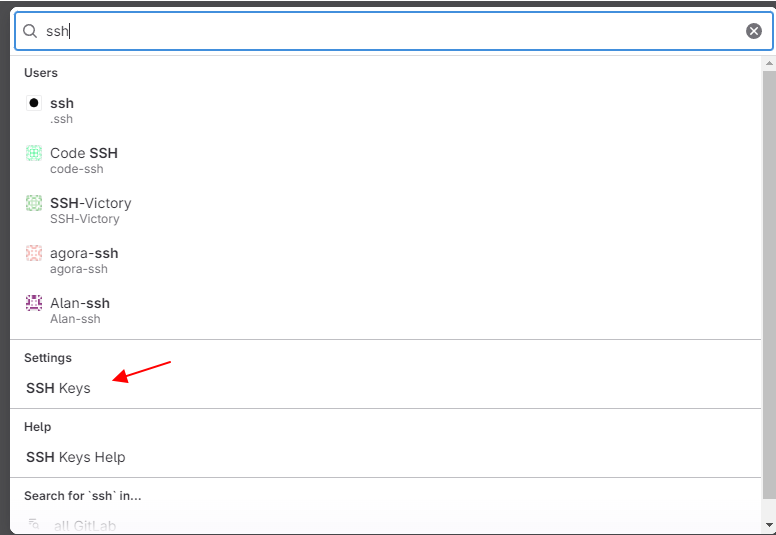

add new key

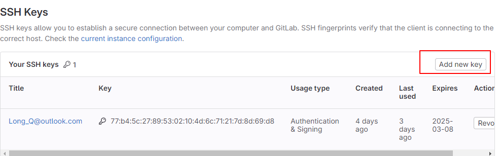

生成密钥：

```bash
ssh-keygen -t rsa -C "Long_Q@outlook.com"   #填注册邮箱，3次回车
```

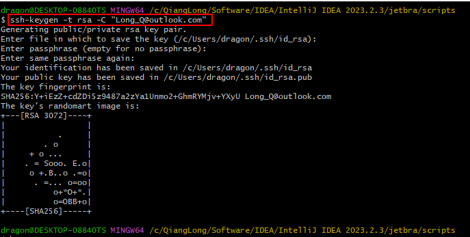

生成的密钥保存在：

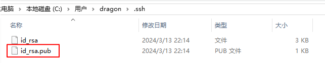


打开将其复制到gitlab:

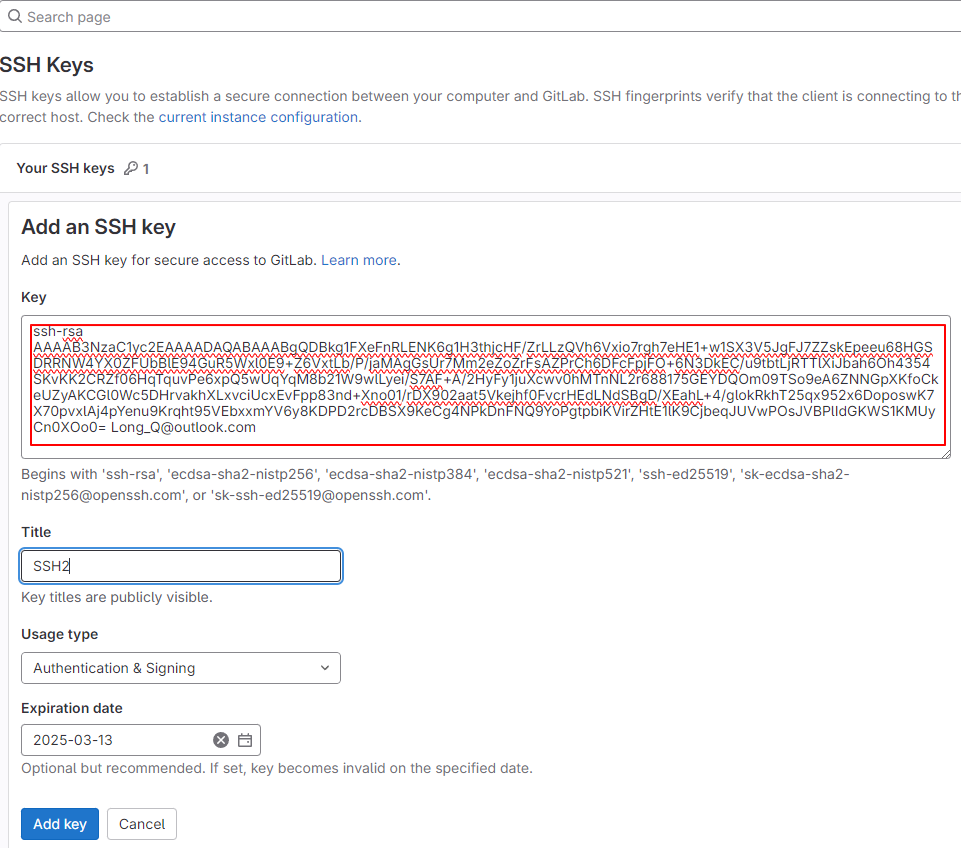

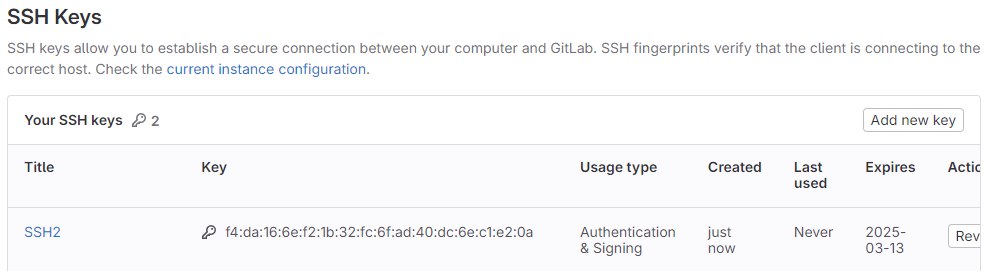

# 2.GitLab

短信验证没有中国地区：https://blog.csdn.net/qq_42831621/article/details/135990384

# 3.IDEA

## 3.1 破解

https://www.alipan.com/s/JpZdBhbGC4h

## 3.2 调整VM参数加快启动加载速度

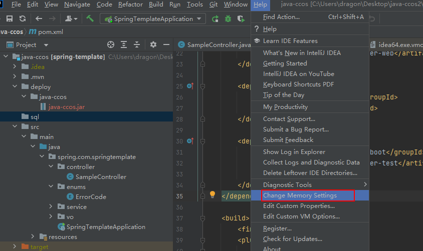

## 3.3导入配置

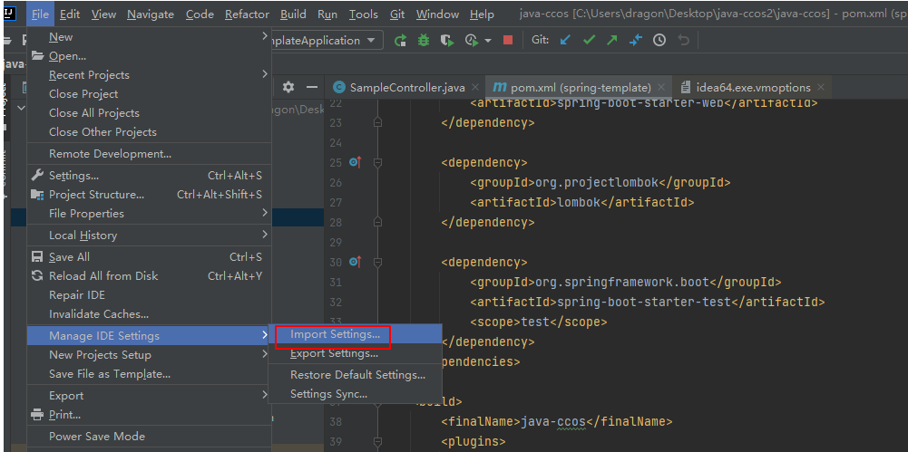

## 3.4 配置maven和jdk

maven: 配置阿里云仓库，否则依赖下载很慢

```xml
<?xml version="1.0" encoding="UTF-8"?>
 
<settings xmlns="http://maven.apache.org/SETTINGS/1.2.0"
          xmlns:xsi="http://www.w3.org/2001/XMLSchema-instance"
          xsi:schemaLocation="http://maven.apache.org/SETTINGS/1.2.0 https://maven.apache.org/xsd/settings-1.2.0.xsd">
<localRepository>C:\Users\dragon\.m2\repository</localRepository>
  <pluginGroups>
  </pluginGroups>
  <proxies>
  </proxies>
  <servers>
  </servers>
  <mirrors>
    <mirror>
        <id>aliyun-maven-mirror</id>
        <mirrorOf>centeral</mirrorOf>
        <name>阿里云公共仓库</name>
        <url>https://maven.aliyun.com/repository/public</url>
    </mirror>
     <mirror>
        <id>alimaven</id>
        <name>aliyun?maven</name>
        <url>http://maven.aliyun.com/nexus/content/groups/public/</url>
        <mirrorOf>central</mirrorOf>
    </mirror>
  </mirrors>
  <profiles>
  </profiles>
</settings>
```


下载jdk ：https://www.oracle.com/java/technologies/downloads/archive/

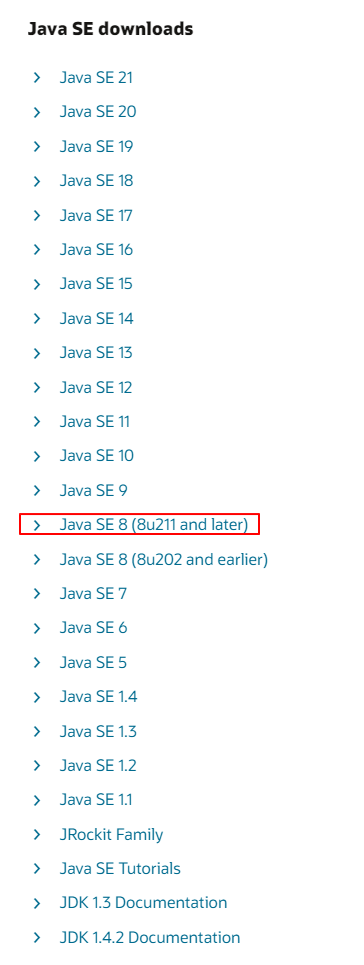

选择jdk8-351版本: 有些可能没有集成jvisualvm

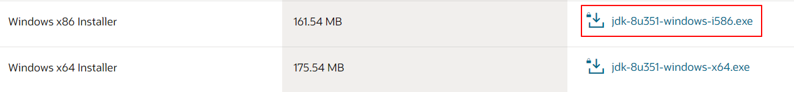

配置环境变量：

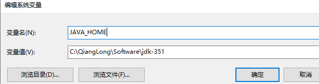

Path添加：

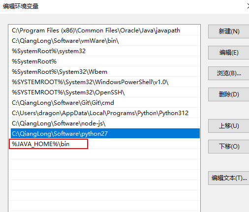

IDEA设置JDK:

添加本地jdk

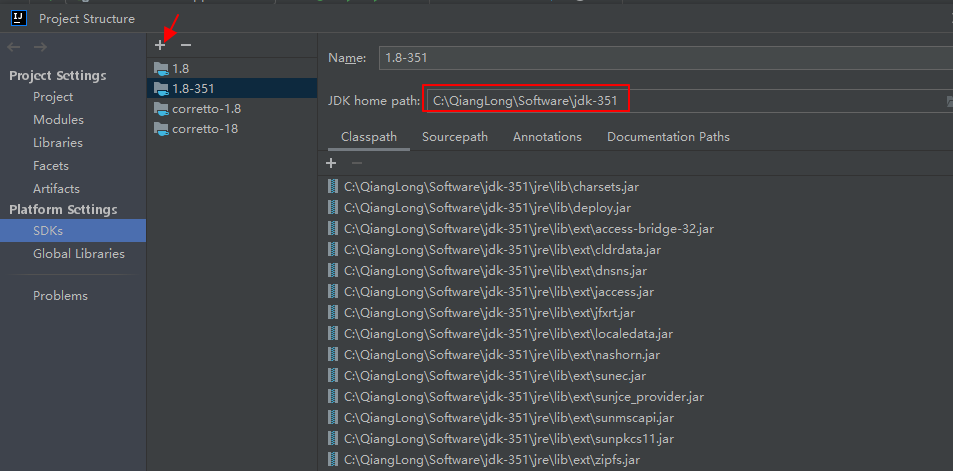


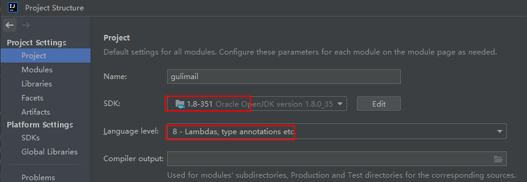

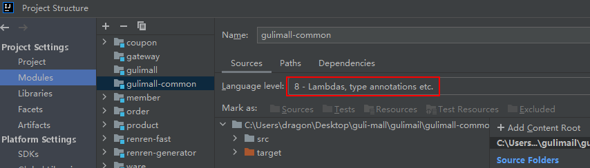


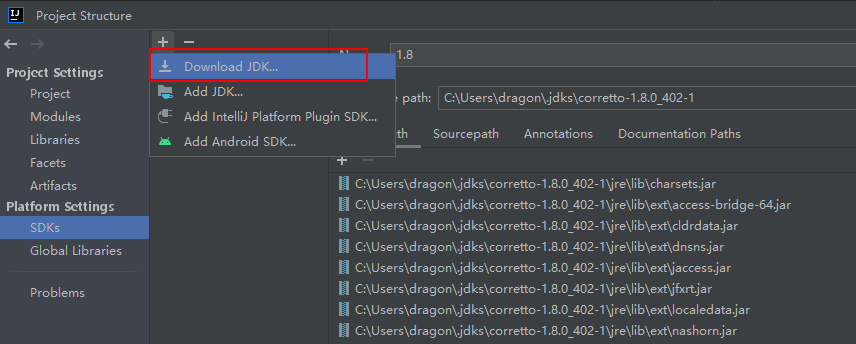

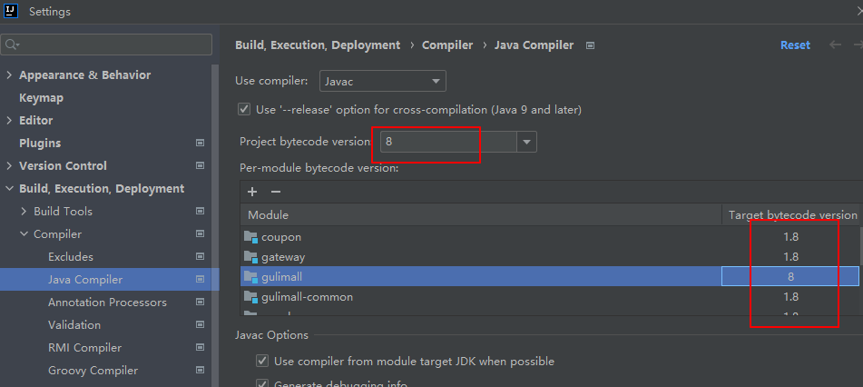


这个爆红得lifecyclle -> install

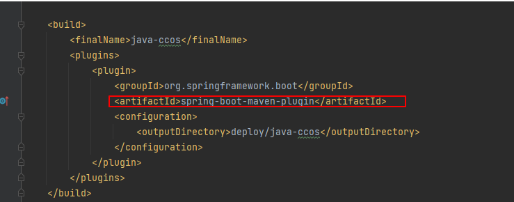


设置mvn终端可用：上面做完了还无法保证terminal 中可以使用mvn

https://blog.csdn.net/Fourier_1024/article/details/129813986

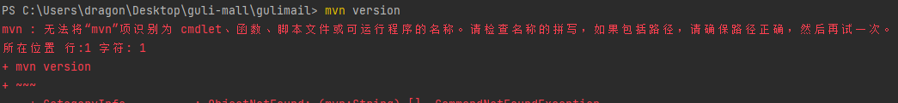

此时需要将mvn的路径加到环境变量中（mvn调的mvn.cmd，使用idea插件安装的maven在plugins路径下）,且有一个问题-环境变量无法识别空格，为了不重装idea，选择创建软链接：

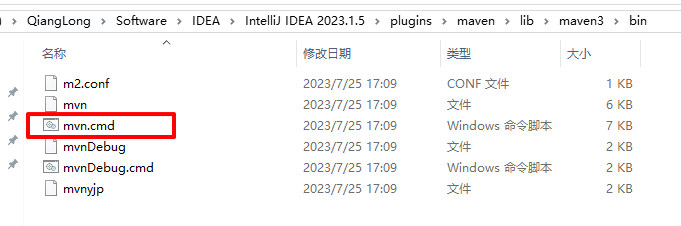

IDEA下创建idea-softlink文件夹，在该路径下cmd:

```bash
mklink /J idea "C:\QiangLong\Software\IDEA\IntelliJ IDEA 2023.1.5\plugins\maven\lib\maven3\bin"
```

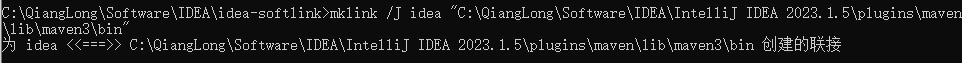


环境变量加上：

```bash
C:\QiangLong\Software\IDEA\idea-softlink\idea
```

**==试了没啥用，手动安装maven，不用默认的。==**

https://archive.apache.org/dist/maven/maven-3/3.8.1/binaries/

确定cmd下mvn -v没问题但idea还不行，改下面的（**==很大原因出在这==**）然后重启idea：

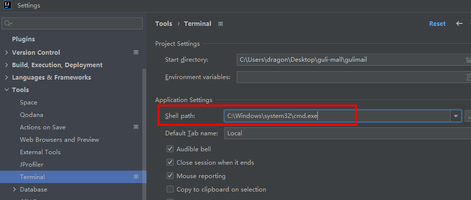


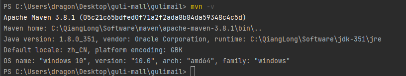

## 3.5 修改远程项目提交地址

前提配了git ssh key

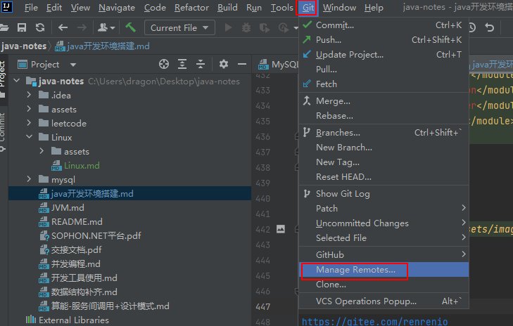

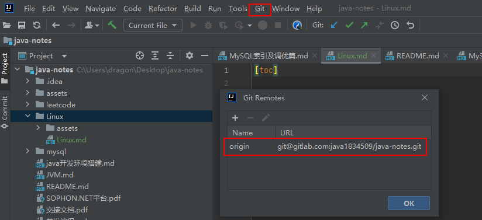


# 4.Typora

## 4.1设置图片相对路径

文件-> 偏好设置

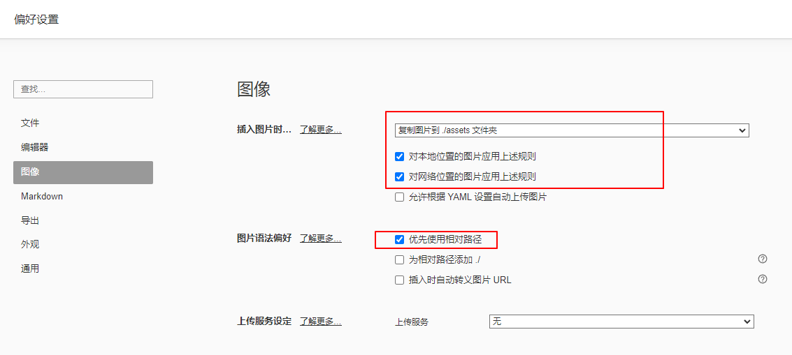

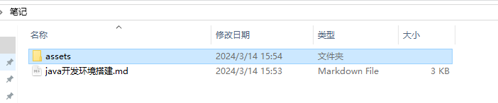

所有图片都存放在assets路径下，这样将md文件和assets文件夹同时移到其他电脑就不会出现图片加载失败的问题。

## 4.1 自动保存

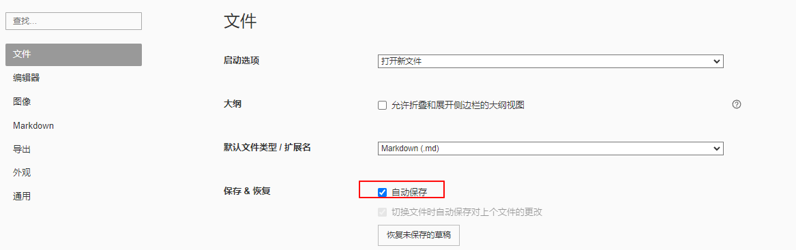

# 5.Navicat

安装包和破解文件：https://www.alipan.com/s/mKT4Em4uPZd

Applied Path：选择安装目录

然后点Patch


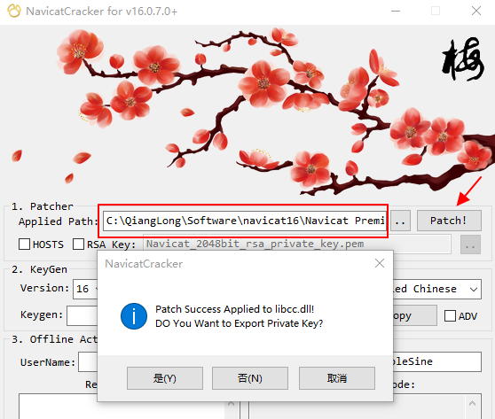

generate生成Keygen并将其复制到navicat注册页面，填上许可证


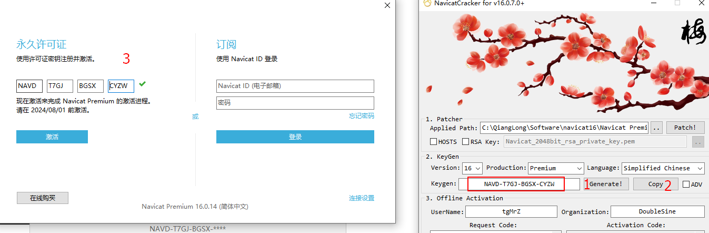

**<font color=red>确保是断网状态</font>**（否则不会出现手动激活按钮），点激活，手动激活：

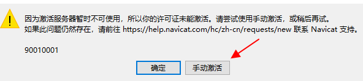

将请求码复制到NavicatCracker然后点generate Activation code，然后将生成的激活码复制过去点击激活

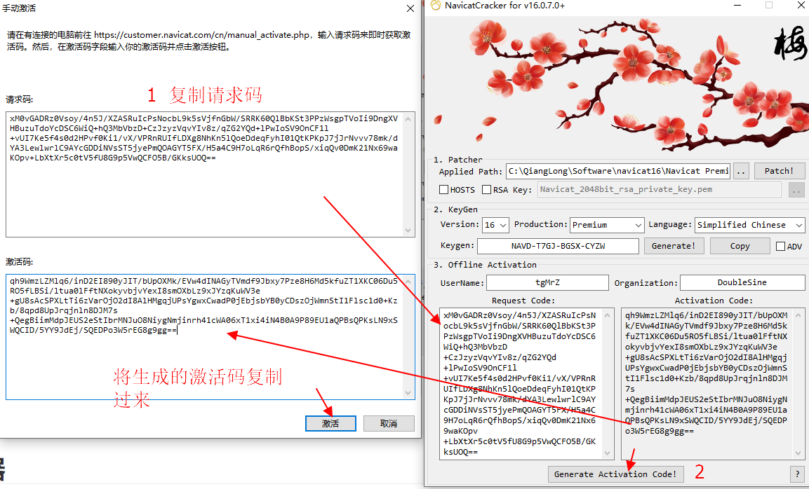


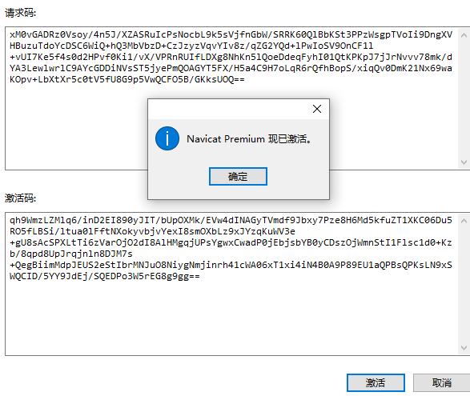

# 6.服务器

## 6.1安装Docker

k8s-offine离线包

修改docker路径

```bash
docker info |grep Dir  #查看默认路径，一般为/var/lib/docker
systemctl stop docker 
vi /etc/docker/daemon.json   #修改配置文件  加上如下内容
"data-root": "/docker"   #/docker替换为实际docker存储路径
systemctl start docker #重启生效
```

## 6.2安装JDK

```bash
apt install default-jdk   # 安装jdk 
apt install openjdk-<version>-jdk  # 安装指定版本jdk，例如apt install openjdk-18-jdk
java -version  #查看jdk版本
```

## 6.3 Supervisor纳管微服务

```bash
apt install supervisor   # 安装supervisor
#配置jdk路径
vi /etc/supervisor/supervisord.conf
```

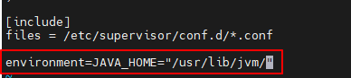


```bash
#配置生效
supervisorctl reread
supervisorctl update
```

supervisor纳管java微服务：

```bash
/etc/supervisor/conf.d中增加配置文件：java-ccos.conf  （示例）
[program:java-ccos]
command=/usr/bin/java -Dconfig.file=/data/java-ccos/application.yml -Dlogback.configurationFile=/data/java-ccos/logback-spring.xml -Dlog.dir=/data/java-ccos/logs -Xms2048m -Xmx2048m -jar /data/java-ccos/java-ccos.jar
directory=/data/java-ccos
autostart=true
autorestart=true
stderr_logfile=/data/supervisor/java-ccos.err.log
stdout_logfile=/data/supervisor/java-ccos.out.log
```

建好对应的文件夹并预置文件：

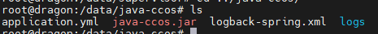

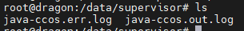

```

```

## 6.4 mysql 容器

```bash
docker pull mysql
docker run -d --restart=always --name mysql-ccos -e MYSQL_ROOT_PASSWORD="181181@Lq" -p 4006:3306 mysql:latest  #起mysql容器并设置root密码 端口映射(-p 宿主机端口:容器端口) 开机自启
docker update --restart=always 容器ID #已启动的容器设置开机自启
#可选（挂载） 宿主机路径：容器路径，-> 直接在宿主机查看容器内的文件
docker run -d --restart=always --name mysql-ccos 
-v /mdata/mysql/log:/var/log/mysql   #日志
-v /mdata/mysql/data:/var/lib/mysql  #mysql数据
-v /mdata/mysql/conf:/etc/mysql 　   #配置
-e MYSQL_ROOT_PASSWORD="181181@Lq" -p 4006:3306 mysql:latest 

#在宿主机改了配置文件。重启容器生效
docker restart <ontainer-id>
#也可直接更新
docker update mysql-ccos --restart=always
```

## 6.5 redis容器

```bash
docker pull redis
# 先在宿主机上创建/data/dockerData/redis等文件夹和文件
docker run --name redis -p 6379:6379 -v /data/dockerData/redis/data/:/data/ -v /data/dockerData/redis/conf/redis.conf:/etc/redis/redis.conf -d redis redis-server /etc/redis/redis.conf   #redis-server /etc/redis/redis.conf 以容器内的这个配置文件启动 （没设密码）
#测试
docker exec -it redis redis-cli #客户端模式
```

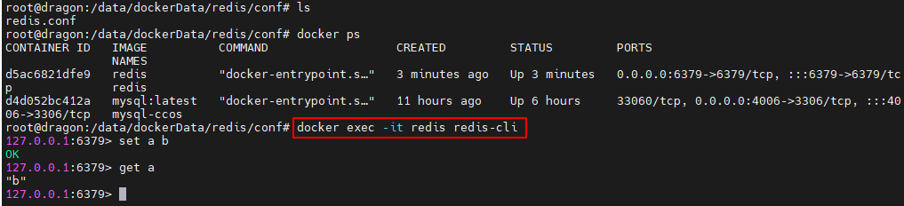

```bash
# 做完上面这些还没有持久化， 数据存在内存中，redis重启后就会消失
#redis.conf配置参考 https://redis.io/docs/management/config/
#持久化配置 
vi /data/dockerData/redis/conf/redis.conf
#添加
appendonly yes
#保存重启生效
docker restart redis
```

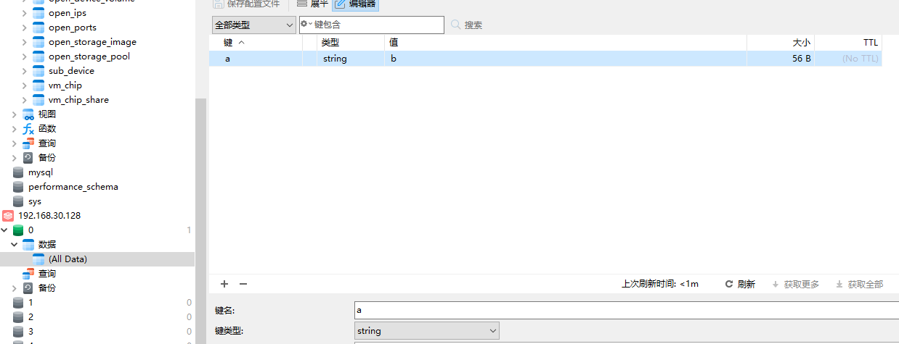


配置文件参考：点一个最新版进去就行

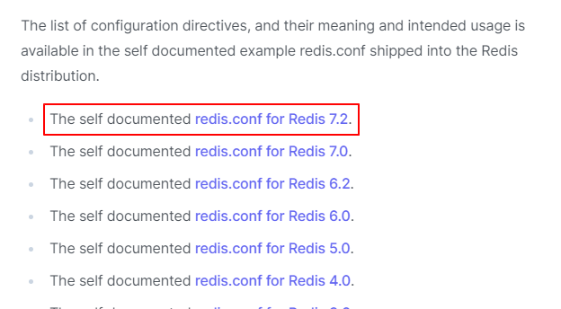

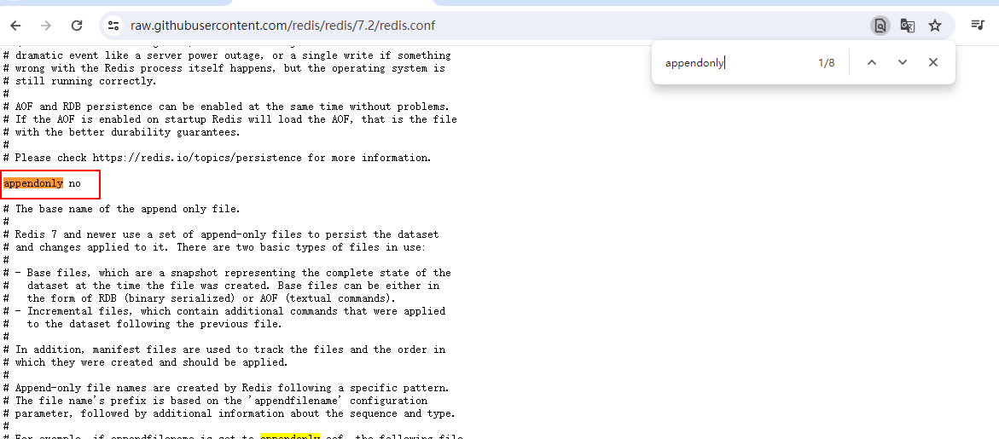


# 7.springboot项目模板

https://gitlab.com/java1834509/java-ccos  master分支


# 8.谷粒商城

## 8.1 idea插件

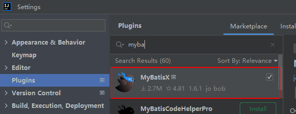

## 8.2 vsCode

安装插件

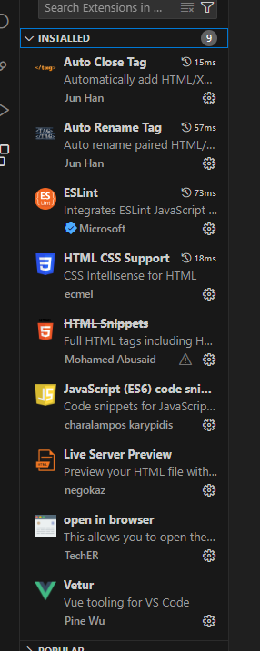

## 8.3 spring initializr替换阿里源

由于springboot 3.0以上版本不支持java 8,spring initializr中java版本只有17和21可选，此时需将spring initializr源替换为：

```bash
https://start.aliyun.com/
```

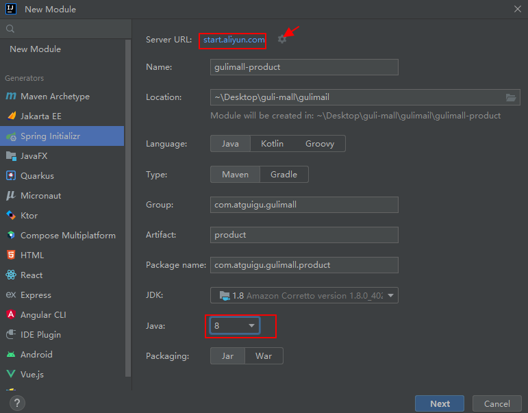

## 8.4 模块框架搭建

空项目，new module

商品服务：

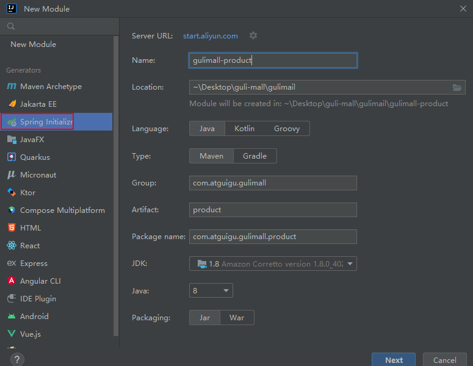

勾选如下两个依赖：

- web -> spring web : 表示web服务
- spring cloud routing -> openFeign : 使用openFeign进行服务间的调用

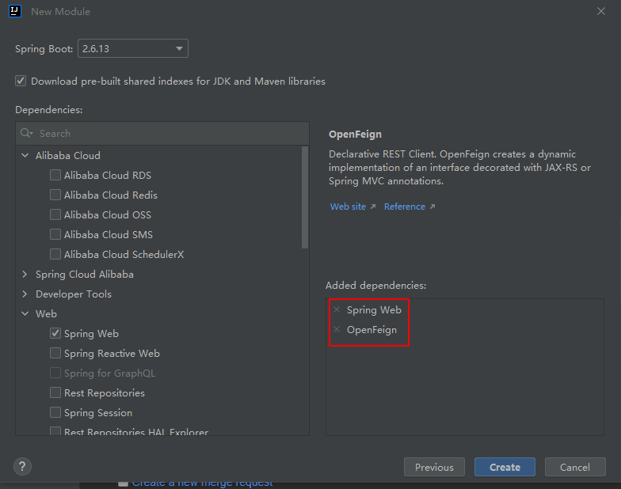

按照上面创建其他模块：

1） web、openfeign

2）每个服务： 包名 com.atguigu.gulimall.xxx(product/order/ware/coupon/member)

3）模块名：product、xxxx

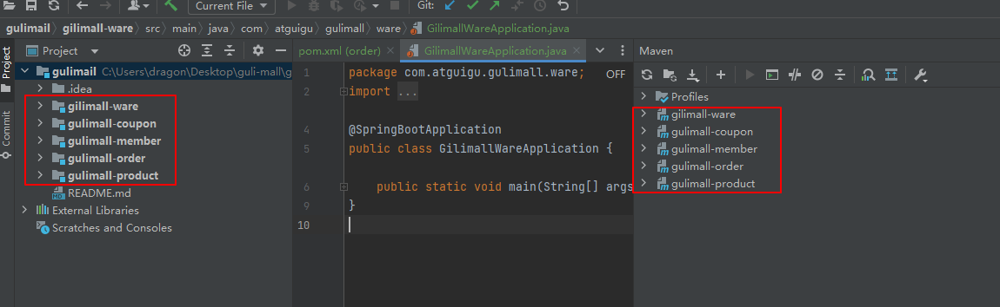

聚合所有微服务：

将任一模块pom.xml复制大项目路径下，修改：

```xml
<?xml version="1.0" encoding="UTF-8"?>
<project xmlns="http://maven.apache.org/POM/4.0.0" xmlns:xsi="http://www.w3.org/2001/XMLSchema-instance"
         xsi:schemaLocation="http://maven.apache.org/POM/4.0.0 https://maven.apache.org/xsd/maven-4.0.0.xsd">
    <modelVersion>4.0.0</modelVersion>
    <groupId>com.atguigu.gulimall</groupId>
    <artifactId>gulimall</artifactId>
    <version>0.0.1-SNAPSHOT</version>
    <name>gilimall</name>
    <description>谷粒商城-聚合服务</description>
    <packaging>pom</packaging>  <!--类型：pom-->
    <!--聚合各模块-->
    <modules>
        <module>gulimall-product</module>
        <module>gulimall-order</module>
        <module>gulimall-coupon</module>
        <module>gulimall-member</module>
        <module>gilimall-ware</module>
    </modules>
</project>
```

maven reload：

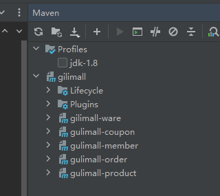


## 8.5 脚手架

https://gitee.com/renrenio

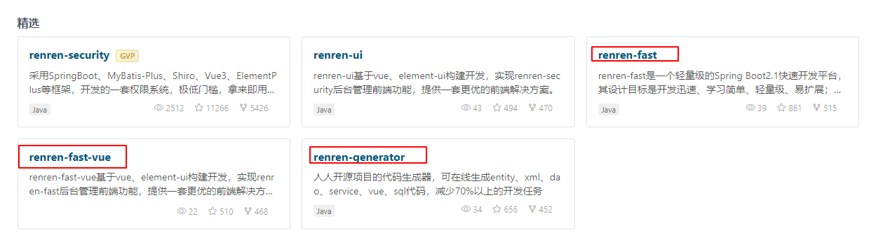

问题1：

```
parent.relativePath' of POM io.renren:renren-fast:3.0.0 (D:\Code\gulimall\renren-fast\pom.xml) 
points at com.atguigu.gulimall:gulimall instead of org.springframework.boot:spring-boot-starter-parent, 
please verify your project structure
```

https://www.cnblogs.com/mihutao/p/15701130.html
