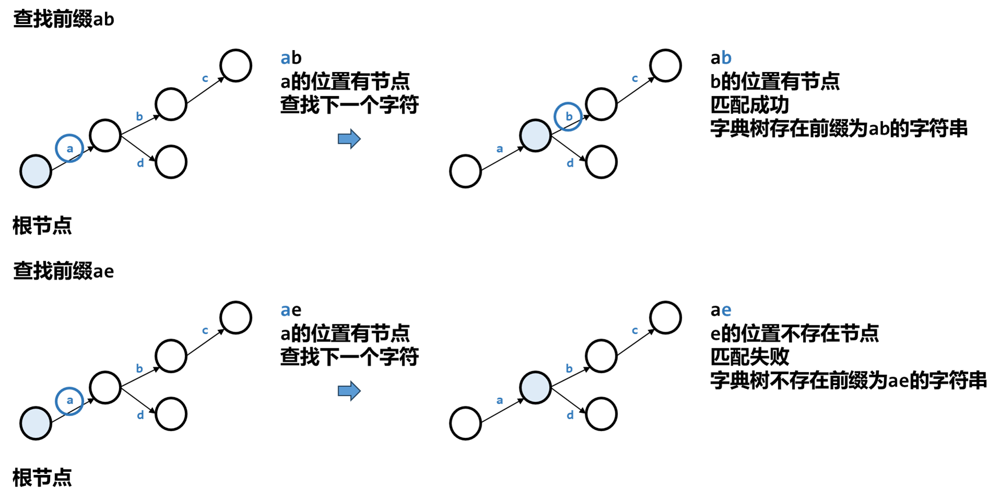
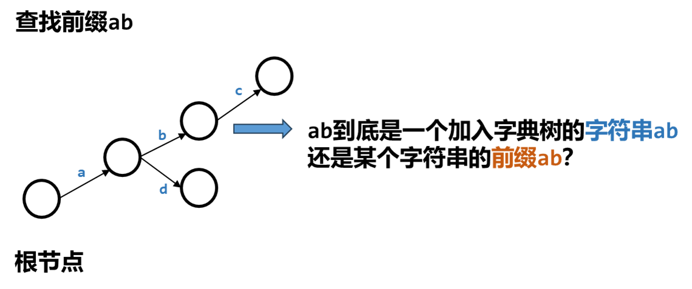
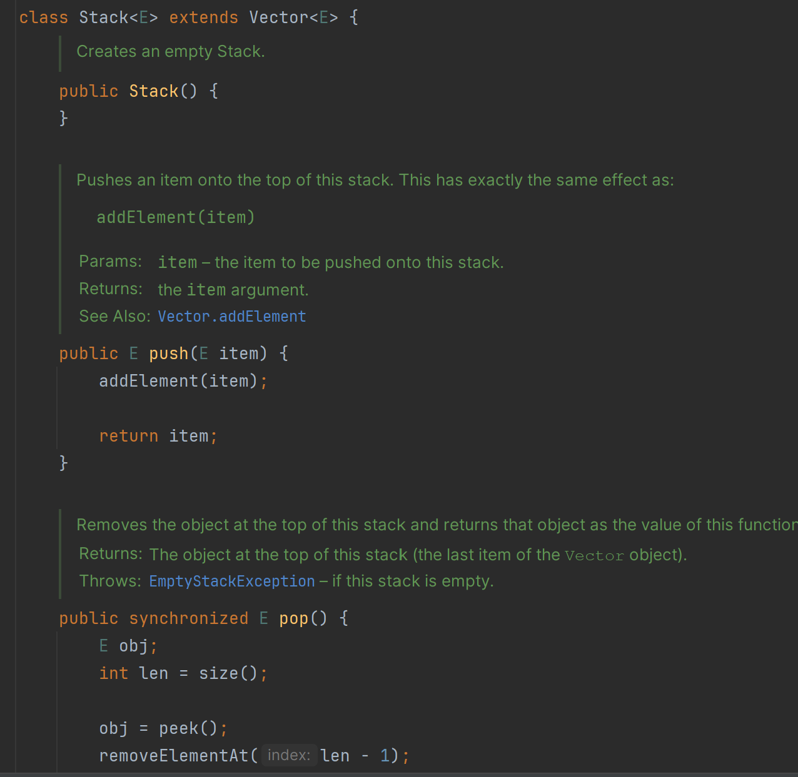

[TOC]


# 1.平衡二叉树（AVL）

## 1.1 定义

AVL树是一种特殊的**<font color=blue size=4>二叉搜索树</font>**，每个节点的左右子树树高相差不超过1。


**<font color=red size=5>平衡因子</font>：<font color=blue size=4>右子树树高-左子树树高。</font>**-1左偏重，+1右偏重


## 1.2 重新平衡

AVL树中插入或删除一个元素后，若树变得不平衡，可通过执行旋转操作重新平衡，包括：LL RR LR RL

- **LL旋转**：LL型不平衡发生在节点A的如下情况，A有一个-2的平衡因子，而左子节点B有一个-1或0的平衡因子，如图所26-2 a所示，这种情况可执行一个A上的右旋操作来修复，如图26-2 b所示。


- **RR旋转**：RR型不平衡发生在节点A的如下情况，A有一个+2的平衡因子，而右子节点B有一个+1或0的平衡因子，如图所26-3 a所示，这种情况可执行一个A上的左旋操作来修复，如图26-3 b所示。


- **LR旋转**：LR型不平衡发生在节点A的如下情况，A有一个-2的平衡因子，而左子节点B有一个+1的平衡因子，如图所26-4 a所示，假设B的右子节点为C。这种情况可执行两次旋转来修复：首先在B上左旋转，然后在A上右旋转，如图26-4 b所示。


- **RL旋转**：RL型不平衡发生在节点A的如下情况，A有一个+2的平衡因子，而右子节点B有一个-1的平衡因子，如图所26-5 a所示，假设B的左子节点为C。这种情况可执行两次旋转来修复：首先在B上右旋转，然后在A上左旋转，如图26-5 b所示。


## 1.3 AVL类设计


## 1.4 实现（关键点）


### 1.4.1 插入节点（insert）

复用二叉搜索树的插入方法，然后执行再平衡。

```java
@Override 
  public boolean insert(E e) {
    boolean successful = super.insert(e);
    if (!successful)
      return false; 
    else {
      balancePath(e); // 再平衡
    }

    return true; 
  }
```


### 1.4.2 再平衡


```java
private void balancePath(E e) {
    java.util.ArrayList<TreeNode<E>> path = path(e); // 从根节点到节点e的路径
    for (int i = path.size() - 1; i >= 0; i--) {
      // 自下而上更新节点的高度
      AVLTreeNode<E> A = (AVLTreeNode<E>)(path.get(i));
      updateHeight(A);
      AVLTreeNode<E> parentOfA = (A == root) ? null :
        (AVLTreeNode<E>)(path.get(i - 1));  // A节点的父节点

      switch (balanceFactor(A)) {   // 求节点A的平衡因子
        // 再平衡以A节点为顶点的树
        case -2: 
          if (balanceFactor((AVLTreeNode<E>)A.left) <= 0) {
            balanceLL(A, parentOfA); // LL 旋转
          }
          else {
            balanceLR(A, parentOfA); // LR 旋转
          }
          break;
        case +2:
          if (balanceFactor((AVLTreeNode<E>)A.right) >= 0) {
            balanceRR(A, parentOfA); // RR 旋转
          }
          else {
            balanceRL(A, parentOfA); // RL 旋转
          }
      }
    }
  }
```


```java
// 记录从根节点到节点e的路径
public java.util.ArrayList<TreeNode<E>> path(E e) {
    java.util.ArrayList<TreeNode<E>> list =
      new java.util.ArrayList<>();
    TreeNode<E> current = root; // Start from the root

    while (current != null) {
      list.add(current); // Add the node to the list
      if (e.compareTo(current.element) < 0) {
        current = current.left;
      }
      else if (e.compareTo(current.element) > 0) {
        current = current.right;
      }
      else
        break;
    }

    return list; // Return an array list of nodes
  }
```


```java
//  更新节点的高度
private void updateHeight(AVLTreeNode<E> node) {
    if (node.left == null && node.right == null) // 叶子节点
      node.height = 0;
    else if (node.left == null) // 只有右子树
      node.height = 1 + ((AVLTreeNode<E>)(node.right)).height;
    else if (node.right == null) // 只有左子树
      node.height = 1 + ((AVLTreeNode<E>)(node.left)).height;
    else
      node.height = 1 +
        Math.max(((AVLTreeNode<E>)(node.right)).height,
        ((AVLTreeNode<E>)(node.left)).height);
  }
```


```java
// 求节点的平衡因子
private int balanceFactor(AVLTreeNode<E> node) {
    if (node.right == null) 
      return -node.height;
    else if (node.left == null) 
      return +node.height;
    else
      return ((AVLTreeNode<E>)node.right).height -
        ((AVLTreeNode<E>)node.left).height;
  }
```


旋转操作纯看图说话，以LL为例

LL旋转：看图26-2

```java
private void balanceLL(TreeNode<E> A, TreeNode<E> parentOfA) {
    TreeNode<E> B = A.left; // 将A的左子节点作为新顶点

    if (A == root) { // A是根节点则直接将B作为顶点
      root = B;
    }
    else { // 否则将B作为A的父节点的子节点
      if (parentOfA.left == A) {
        parentOfA.left = B;
      }
      else {
        parentOfA.right = B;
      }
    }

    A.left = B.right; // B的右子树作为A的左子树
    B.right = A; // A整体作为B的右子树
    // 更新A B节点的树高
    updateHeight((AVLTreeNode<E>)A); 
    updateHeight((AVLTreeNode<E>)B);
  }
```


RR旋转：

```java
private void balanceRR(TreeNode<E> A, TreeNode<E> parentOfA) {
    TreeNode<E> B = A.right; // A is right-heavy and B is right-heavy

    if (A == root) {
      root = B;
    }
    else {
      if (parentOfA.left == A) {
        parentOfA.left = B;
      }
      else {
        parentOfA.right = B;
      }
    }

    A.right = B.left; // Make T2 the right subtree of A
    B.left = A;
    updateHeight((AVLTreeNode<E>)A);
    updateHeight((AVLTreeNode<E>)B);
  }
```


LR旋转：

```java
private void balanceLR(TreeNode<E> A, TreeNode<E> parentOfA) {
    TreeNode<E> B = A.left; // A is left-heavy
    TreeNode<E> C = B.right; // B is right-heavy

    if (A == root) {
      root = C;
    }
    else {
      if (parentOfA.left == A) {
        parentOfA.left = C;
      }
      else {
        parentOfA.right = C;
      }
    }

    A.left = C.right; // Make T3 the left subtree of A
    B.right = C.left; // Make T2 the right subtree of B
    C.left = B;
    C.right = A;

    // Adjust heights
    updateHeight((AVLTreeNode<E>)A);
    updateHeight((AVLTreeNode<E>)B);
    updateHeight((AVLTreeNode<E>)C);
  }
```


RL旋转：

```java
private void balanceRL(TreeNode<E> A, TreeNode<E> parentOfA) {
    TreeNode<E> B = A.right; // A is right-heavy
    TreeNode<E> C = B.left; // B is left-heavy

    if (A == root) {
      root = C;
    }
    else {
      if (parentOfA.left == A) {
        parentOfA.left = C;
      }
      else {
        parentOfA.right = C;
      }
    }

    A.right = C.left; // Make T2 the right subtree of A
    B.left = C.right; // Make T3 the left subtree of B
    C.left = A;
    C.right = B;

    // Adjust heights
    updateHeight((AVLTreeNode<E>)A);
    updateHeight((AVLTreeNode<E>)B);
    updateHeight((AVLTreeNode<E>)C);
  }
```


### 1.4.3 删除节点


# 2.前缀树

问题引入

[实现 Trie (前缀树)](https://leetcode.cn/problems/implement-trie-prefix-tree/)

**[Trie](https://baike.baidu.com/item/字典树/9825209?fr=aladdin)** **前缀树** 或 **字典树** 是一种树形数据结构，用于高效地存储和检索字符串数据集中的键。这一数据结构有相当多的应用情景，例如自动补完和拼写检查。

请你实现 Trie 类：

- `Trie()` 初始化前缀树对象。
- `void insert(String word)` 向前缀树中插入字符串 `word` 。
- `boolean search(String word)` 如果字符串 `word` 在前缀树中，返回 `true`（即，在检索之前已经插入）；否则，返回 `false` 。
- `boolean startsWith(String prefix)` 如果之前已经插入的字符串 `word` 的前缀之一为 `prefix` ，返回 `true` ；否则，返回 `false` 。

 

**示例：**

```
输入
["Trie", "insert", "search", "search", "startsWith", "insert", "search"]
[[], ["apple"], ["apple"], ["app"], ["app"], ["app"], ["app"]]
输出
[null, null, true, false, true, null, true]

解释
Trie trie = new Trie();
trie.insert("apple");
trie.search("apple");   // 返回 True
trie.search("app");     // 返回 False
trie.startsWith("app"); // 返回 True
trie.insert("app");
trie.search("app");     // 返回 True
```

 

**提示：**

- `1 <= word.length, prefix.length <= 2000`
- `word` 和 `prefix` 仅由小写英文字母组成
- `insert`、`search` 和 `startsWith` 调用次数 **总计** 不超过 `3 * 104` 次


## 2.1 前缀树的构造

关键：**<font color=blue size=3>前缀树是每个节点都有26个子节点的26叉树，分别对应26个小写字母，通过节点是否为null标志对应的字母是否存在</font>**，从入口节点逐渐往下检索，不匹配直接返回。


每个节点都有26个子节点，分别代表a-z 26个小写字母，用长度为26的Node数组存储，Node本身不存字符，而是通过对应下标的Node是否为null判断该字符是否存在。上图中，第0层为入口节点（根节点），作为搜索的入口；第1层为所有字符串的第一个字母节点集合，图中仅画出了已有字符串的第一个字母，其实每个节点（第1层为根节点的子节点集合）都有26个子节点，但是不存在的字符对应的节点为null；第二层为已有字符串的第二个字母，后面依此类推.....


## 2.2 加入一个字符串

从root节点出发，假设当前节点为 node，当前要加入的字符为 ch：如果当前节点 node 的子节点列表中，ch 对应的下标节点为null，则新建一个节点；然后更新 node 为子节点，加入下一个字符；


## 2.3 查找一个前缀

从root节点出发，假设当前节点为 node，当前要查找的字符为 ch：如果当前节点 node 的子节点列表中，ch对应的下标位置节点为null，说明该字符不存在，退出查找；否则更新 node 为子节点，查找下一字符；




## 2.4 标志位标记完整字符串

通过以上方式可以快速找到一个前缀，但如何确定它是一个完整的字符串还是某个字符串的前缀呢？



此时可为每个节点引入一个标志 isEnd 标记，插入字符串时将最后一个字符对应的节点的标志位置为 True。

当我们查找一个完整字符串时，最后一个字符对应的节点不为null，且节点标志位为 true，则表明是一个完整的字符串。


## 2.5 前缀树实现

```java
class Trie {
    Node root; //根节点，作为搜索入口

    public Trie() {
        root=new Node();
    }
    
    public void insert(String word) {
        // 从根节点开始
        Node current=root;
        // 逐个插入每个字符
        for(int i=0;i<word.length();i++){
            int index=word.charAt(i)-'a'; // 字符对应的下标
            if(current.children[index]==null){ // 不重复插入
                current.children[index]=new Node(); // 将字符对应的节点从null置为非null
            }
            current=current.children[index]; // 转向子节点
        }
        current.isEnd=true;  // 最后一个节点的isEnd置为true，表示一个完整的字符串
    }
    
    public boolean search(String word) {
        Node lastNode=searchPrefix(word);
        return lastNode!=null&&lastNode.isEnd;  // 前缀存在且标志位为true才表示完整的字符串
    }
    
    public boolean startsWith(String prefix) {
        return searchPrefix(prefix)!=null;
    }

    public Node searchPrefix(String prefix){
        // 从根节点开始
        Node current=root;
        for(int i=0;i<prefix.length();i++){
            int index=prefix.charAt(i)-'a';
            if(current.children[index]==null){ // 字符对应下标节点不存在，直接中断搜索
                return null;
            }
            current=current.children[index];
        }
        return current;  //  前缀存在，返回最后一个字符对应的节点
    }
}

class Node{ // 字母对应的节点
    Node[] children; // 子节点 ，26个，对应26个字母
    boolean isEnd; //是否为字符串的最后一个字母

    public Node(){
        children=new Node[26]; // 预制26个null节点
        isEnd=false; // 标志位为false
    }
}
```


# 3.排序算法


## 3.1 堆排序

### 3.1.1 堆的定义

- 它是一棵完全二叉树（若只有一个子节点则子节点必偏左）
- 每个节点大于等于任意子节点（左右子节点间大小没有限制）

下图中：a是堆，b不是（但是完全二叉树），因为根（39）小于右子节点（42）。c d不是完全二叉树


### 3.1.2 堆的实现

实现堆：借用ArrayList

堆顶节点下标为0，假设当前节点下标为i，那么：

- 父节点下标为：$（i-1）/2$
- 左右子节点下标分别为：$2*i+1$  和  $2*i+2$


**添加新节点**：首先添加到ArrayList尾部，然后不断循环找到其父节点，若父节点元素值小于当前节点，则交换位置，直到当前节点为堆顶节点。

示例：假设这个堆初始化为空，在以3、5、1、19、11和22的顺序添加数字后，该堆如图所示：


现在向队中添加88，将新节点88放在树的末尾，如图23-13，互换88和19，再互换88和22：


**删除堆顶（根节点）**：将ArrayList尾节点和头节点互换，删除尾节点。接着从新的堆顶节点开始检查：若当前节点小于子节点中的最大值，则二者位置互换，然后当前节点指向最大的子节点，直到当前节点没有子节点。

示例：

删除62


重建堆：


### 3.1.3 堆排序

**<font color=red size=5>堆排序：不断将堆顶元素移除（堆顶必是最大值）</font>**

PriorityQueue用的就是堆排序。

```java
class Heap<T extends Comparable> {

    private ArrayList<T> list=new ArrayList<>();
    public Heap(){}
    public Heap(T[] nums){
        for(T o:nums){
            add(o);
        }
    }
    public int getSize(){
        return list.size();
    }
    /**
     *  添加节点
     **/
    public void add(T t){
        list.add(t);
        int index=list.size()-1;
        while(index>0){
            int parentIndex=(index-1)/2;  // 父节点
            if(list.get(index).compareTo(list.get(parentIndex))>0){
                T tem= list.get(index);
                list.set(index,list.get(parentIndex));
                list.set(parentIndex,tem);
                index=parentIndex;
            }else{
                break;
            }
        }
    }

    /**
     *  删除堆顶
     **/
    public T remove(){
        if(list.size()==0){
            return null;
        }
        T removeObject=list.get(0);
        list.set(0,list.get(list.size()-1));
        list.remove(list.size()-1);
        int currentIndex=0;
        int n=list.size();
        while(currentIndex<n){
            int leftIndex=2*currentIndex+1; // 左子节点下标
            int rightIndex=2*currentIndex+2;  // 右子节点下标
            if(leftIndex>=n){ // 无子节点（若只有一个子节点，一定靠左）
                break;
            }
            // 和最大子节点互换位置
            int maxIndex=leftIndex;
            if(rightIndex<n&&list.get(leftIndex).compareTo(list.get(rightIndex))<0){
                maxIndex=rightIndex;
            }
            if(list.get(currentIndex).compareTo(list.get(maxIndex))<0){
                T tem=list.get(maxIndex);
                list.set(maxIndex,list.get(currentIndex));
                list.set(currentIndex,tem);
                currentIndex=maxIndex;
            }else {
                break;
            }
        }
        return removeObject;
    }
    public ArrayList<T> getElement(){
        return list;
    }
}
```

测试堆及堆排序：

```java
public class HeapTest{
    public static void main(String[] args){
        Integer[] nums={3,5,1,19,11,22,88};
        Heap<Integer> heap=new Heap<>(nums); // 构造堆
        heap.getElement().forEach(System.out::println); // 打印构造的堆

        // 堆排序： 不断调用remove方法，堆顶元素必最大
        int[] sorted=new int[nums.length];
        int count=sorted.length-1;
        while (heap.getSize()>0){ // 升序排列
            sorted[count--]=heap.remove();
        }
        // 排序后打印
        for(int i=0;i<sorted.length;i++){
            System.out.print(sorted[i]+" ");
        }

    }
}
```


### 3.1.4 堆排序时间复杂度分析

设h表示包含n个元素的堆高度，由于堆是完全二叉树，故：
$$
1+2+...+2^{h-2}<n\leq1+2+...+2^{h-2}+2^{h-1}
$$
即：
$$
2^{h-1}-1<n\leq2^h-1 
$$

$$
2^{h-1}<n+1\leq2^h
$$

$$
h-1<log(n+1)\leq h
$$

$$
log(n+1)\leq h<log(n+1)+1
$$

因此堆高$h=O(log n)$

而建立堆过程中需要插入n个元素，每个元素插入时需要追踪从叶子节点到根节点的路径（$logn$步）并进行比较交换，共耗时$nlogn$；同样的，删除堆顶元素时需要追踪从根节点到叶子节点的路径并进行比较交换，耗时也是$nlogn$。因此堆排序时间复杂度为$O(nlogn)$


堆排序相较于归并排序的优点：不需要额外的数组空间，空间复杂度低于归并排序。

## 3.2 桶排序

空间换时间，可以达到O（n)的时间复杂

https://blog.csdn.net/weixin_46599489/article/details/135733212

阿里一面：**数组中的第K个最大元素（**https://leetcode.cn/problems/kth-largest-element-in-an-array/description/**）**

给定整数数组 `nums` 和整数 `k`，请返回数组中第 **`k`** 个最大的元素。

请注意，你需要找的是数组排序后的第 `k` 个最大的元素，而不是第 `k` 个不同的元素。

你必须设计并实现时间复杂度为 `O(n)` 的算法解决此问题。

**示例 1:**

```
输入:[3,2,1,5,6,4], k = 2
输出: 5
```

**示例 2:**

```
输入:[3,2,3,1,2,4,5,5,6],k = 4
输出: 4
```

**提示：**

- `1 <= k <= nums.length <= 10^5`
- `10^4 <= nums[i] <= 10^4`


由于限定时间复杂度为O(n) ，因此使用桶排序满足条件：

```java
class Solution {
    public int findKthLargest(int[] nums, int k) {
        // 桶排序
        // 数据范围在-10000~10000
        int[] buckets=new int[20001];  //值为i的数放在i+10000的下标位置，记录数量
        for(int i:nums){
            buckets[i+10000]++;
        }
        // 从右往左：找出第k大
        for(int i=20000;i>=0;i--){
            k -=buckets[i];
            if(k<=0){
                return i-10000;
            }
        }
        return -1;  // 数据符合要求不会走到这步
    }
}
```


# 4.单调栈

定义：在普通栈的基础上维持某种顺序

- 单调递增栈： 栈中元素从栈底到栈顶是递增的。
- 单调递减栈： 栈中元素从栈底到栈顶是递减的。

以下题进行讲解： [每日温度](https://leetcode.cn/problems/daily-temperatures/)

给定一个整数数组 `temperatures` ，表示每天的温度，返回一个数组 `answer` ，其中 `answer[i]` 是指对于第 `i` 天，下一个更高温度出现在几天后。如果气温在这之后都不会升高，请在该位置用 `0` 来代替。**要求时间复杂度$O(n)$**

**示例 1:**

```
输入: temperatures = [73,74,75,71,69,72,76,73]
输出: [1,1,4,2,1,1,0,0]
```

**示例 2:**

```
输入: temperatures = [30,40,50,60]
输出: [1,1,1,0]
```

**示例 3:**

```
输入: temperatures = [30,60,90]
输出: [1,1,0]
```

 

**提示：**

- `1 <= temperatures.length <= 105`
- `30 <= temperatures[i] <= 100`
- 

思路：**单调栈**

用栈存储尚未找到下一次温度更高 元素的下标

```java
class Solution {
    public int[] dailyTemperatures(int[] temperatures) {
        int n=temperatures.length;
        int[] res=new int[n];
        LinkedList<Integer> stack=new LinkedList<>(); //栈里存尚未找到下一次温度更高 元素的下标
        for(int i=0;i<n;i++){
            // 单调栈套路：while循环
            while(!stack.isEmpty()&&temperatures[i]>temperatures[stack.peek()]){
                res[stack.peek()]=i-stack.pop();  // 当前温度大于它，出栈并计算天数
            }
            stack.push(i);
        }
        return res;
    }
}
```


模拟：$temperatures = [73,74,75,71,69,72,76,73]$


使用LinkedList：


使用Stack:


注意：**<font color=red>LinkedList没加锁，比Stack快，Stack加了锁</font>**（继承自Vector，线程安全）。




