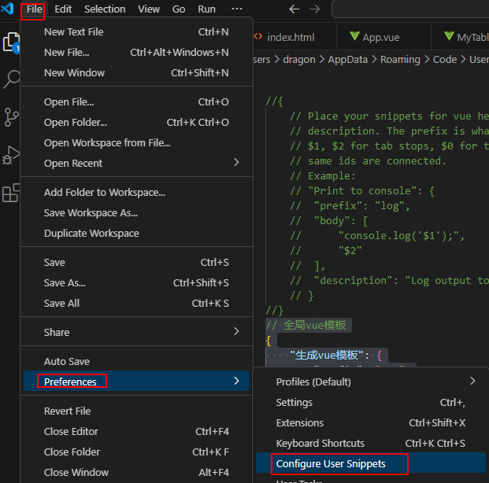

[toc]


# 1.环境搭建

## 1.1  Vue

### 1.1.1 安装

```bash
#cmd
npm install vue@2.6.10
npm install --global vue-cli
#vue脚手架webpack
npm install webpack -g #全局安装webpack
npm install -g @vue/cli-init #全局安装vue脚手架
#用webpack初始化一个vue项目
vue init webpack vue-demo  #vue-demo为appname，替换为自己的
```


按照提示运行项目：

```bash
cd vue-demo
npm run dev
```


用vscode打开

- config文件夹：配置信息，比如index.js中可以改端口号
- node_modules: 安装的依赖存放路径
- src: 代码（主要关注）
- static: 静态资源文件(图片、字体等)
- index.html:首页
- pack.json：npm依赖包的配置信息


说明：

1.main.js为主程序（入口）

重点关注router属性，路由，决定uri访问的视图


2.继续打开router路径下的index.js

该文件定义了详细的路由规则，图中为uri后缀为/则访问HelloWorld视图


3.打开components/HelloWorld.vue

可以看到和前端显示一一对应


### 1.1.2 案例

写一个新页面，要求访问http://localhost:8081/#/hello显示： 你好，hello，张三

新建一个Hello.vue


index.js添加路由：


这里别开语法检查，否则会报一堆错误 ，比如Use // eslint-disable-next-line to ignore the next line


保存后重新启动：

```bash
npm run dev
```


还有图片是因为：App.vue中除了视图还定义了图片


## 1.2Element UI

### 1.2.1 安装

官网：[组件 | Element](https://element.eleme.cn/#/zh-CN/component/installation)

```bash
npm install element-ui@2.12.0
```

### 1.2.2 案例

导入依赖：


使用案例：被选框（参照官网即可）


重新启动：


将Container布局容器的实例代码整合到App.vue中，重新运行：


效果如下：


# 2.谷粒商城前端功能案例

## 2.1 全局vue模板

```json
// 全局vue模板
{
    "生成vue模板": {
        "prefix": "vue",
        "body": [
            "<template>",
            "<div></div>",
            "</template>",
            "",
            "<script>",
            "//这里可以导入其他文件（比如：组件，工具js，第三方插件js，json文件，图片文件等等）",
            "//例如：import 《组件名称》 from '《组件路径》';",
            "",
            "export default {",
            "//import引入的组件需要注入到对象中才能使用",
            "components: {},",
			"props: {},",
            "data() {",
            "//这里存放数据",
            "return {",
            "",
            "};",
            "},",
            "//监听属性 类似于data概念",
            "computed: {},",
            "//监控data中的数据变化",
            "watch: {},",
            "//方法集合",
            "methods: {",
            "",
            "},",
            "//生命周期 - 创建完成（可以访问当前this实例）",
            "created() {",
            "",
            "},",
            "//生命周期 - 挂载完成（可以访问DOM元素）",
            "mounted() {",
            "",
            "},",
            "beforeCreate() {}, //生命周期 - 创建之前",
            "beforeMount() {}, //生命周期 - 挂载之前",
            "beforeUpdate() {}, //生命周期 - 更新之前",
            "updated() {}, //生命周期 - 更新之后",
            "beforeDestroy() {}, //生命周期 - 销毁之前",
            "destroyed() {}, //生命周期 - 销毁完成",
            "activated() {}, //如果页面有keep-alive缓存功能，这个函数会触发",
            "}",
            "</script>",
            "<style lang='scss' scoped>",
            "//@import url(); 引入公共css类",
            "</style>"
        ],
        "description": "生成vue模板"
    },
    "http-get请求": {
	"prefix": "httpget",
	"body": [
		"this.\\$http({",
		"url: this.\\$http.adornUrl(''),",
		"method: 'get',",
		"params: this.\\$http.adornParams({})",
		"}).then(({ data }) => {",
		"})"
	],
	"description": "httpGET请求"
    },
    "http-post请求": {
	"prefix": "httppost",
	"body": [
		"this.\\$http({",
		"url: this.\\$http.adornUrl(''),",
		"method: 'post',",
		"data: this.\\$http.adornData(data, false)",
		"}).then(({ data }) => { });" 
	],
	"description": "httpPOST请求"
    }
}
```



vue回车：将模板内容拷贝保存到vue.json


之后输入vue回车即可自动生成：


## 2.2 三级分类

修改全局请求地址：往网关打


### 2.2.1 登录跨域问题


网关处配置允许跨域：


```java
package com.atguigu.gateway.config;
import org.springframework.context.annotation.Bean;
import org.springframework.context.annotation.Configuration;
import org.springframework.web.cors.CorsConfiguration;
import org.springframework.web.cors.reactive.CorsWebFilter;
import org.springframework.web.cors.reactive.UrlBasedCorsConfigurationSource;
/**
 * @Author qiang.long
 * @Date 2024/08/25
 * @Description 配置允许跨域
 **/
@Configuration
public class GulimallCorsConfiguration {
    @Bean
    public CorsWebFilter corsWebFilter(){
        CorsConfiguration corsConfiguration=new CorsConfiguration();
        /**
         * 1.配置跨域
         **/
        corsConfiguration.addAllowedHeader("*"); // 任意请求头都可以跨域
        corsConfiguration.addAllowedMethod("*"); // 任意请求方式都可以跨域（GET POST等）
        corsConfiguration.addAllowedOriginPattern("*"); // 任意请求来源都可以跨域
        corsConfiguration.setAllowCredentials(true); // 允许cookie

        UrlBasedCorsConfigurationSource source=new UrlBasedCorsConfigurationSource();
        source.registerCorsConfiguration("/**",corsConfiguration); // 所有uri都能跨
        return new CorsWebFilter(source);
    }
}
```


重启网关，登录成功

### 2.2.2 分类维护（新增、删除）

前端对真实数据进行解构：


最终效果：


## 2.3 前端终结

P71前端终结，直接用写好的模板：

https://www.bilibili.com/video/BV1np4y1C7Yf?p=71&vd_source=5379a6806380b9446ccbd384a2377827

后端接口必须参照此文档编写：

https://easydoc.net/s/78237135/ZUqEdvA4/HqQGp9TI

