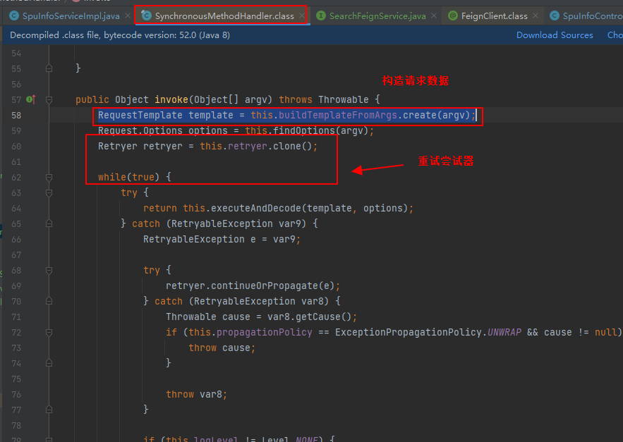
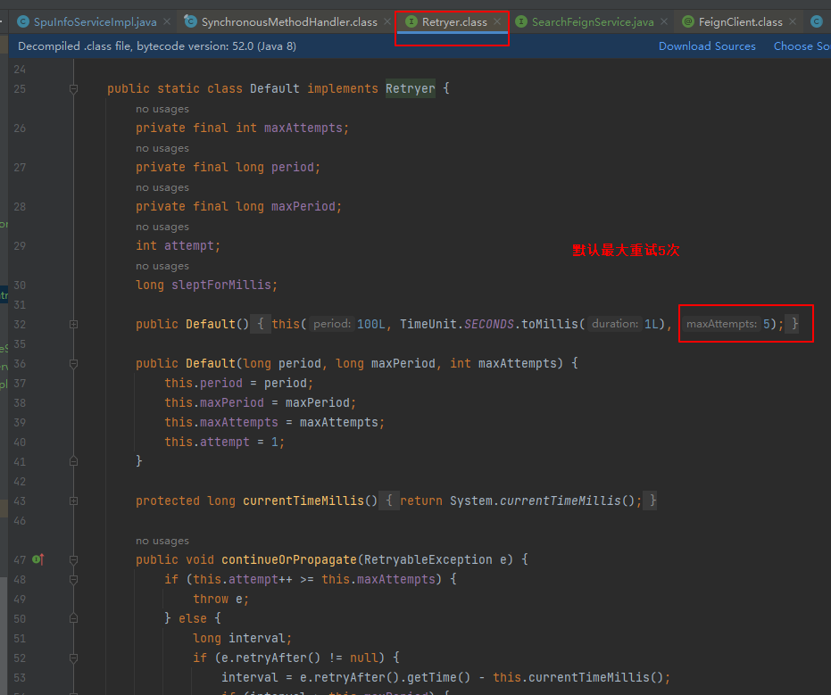

# 1.组件概述
Spring Cloud Alibaba： [Github中文文档](https://github.com/alibaba/spring-cloud-alibaba/blob/2022.x/README-zh.md)

| 功能 | Spring Cloud([链接](https://spring.io/projects/spring-cloud)) | Spring Cloud Alibaba([链接](https://sca.aliyun.com/zh-cn/)) |
| --- | --- | --- |
| 注册中心 | Eureka ([链接](https://spring.io/projects/spring-cloud-config)) | Nacos |
| 配置中心 | Spring Cloud Config([链接](https://spring.io/projects/spring-cloud-netflix)) | Nacos |
| 网关 | Spring Cloud Gateway([链接](https://spring.io/projects/spring-cloud-config)) |  |
| 负载均衡 | Ribbon([链接](https://cloud.spring.io/spring-cloud-netflix/multi/multi_spring-cloud-ribbon.html)) |  |
| 声明式HTTP客户端 | Open Feign([链接](https://spring.io/projects/spring-cloud-openfeign)) |  |
| 断路保护，熔断降级 | Hystrix(Netflix里) | Sentinel ([链接](https://sca.aliyun.com/zh-cn/docs/2022.0.0.0/user-guide/sentinel/overview)) |
| 调用链监控 | Sleuth([链接](https://spring.io/projects/spring-cloud-sleuth)) |  |
| 分布式事务 |  | Seata([链接](https://sca.aliyun.com/zh-cn/docs/2022.0.0.0/user-guide/seata/overview)) |

组件功能

- 注册中心：微服务上线后都应该将自己注册到注册中心，若B服务要调用A服务，B服务首先从注册中心获取A服务的所有实例，然后随机挑选一个调用即可。
- 配置中心：假设某服务分布在多台机器上，想批量修改其配置，逐一修改较为麻烦，若服务能从配置中心动态获取配置，则较为简单，这就是配置中心产生的缘由。


# 2.使用
配置参考：尽量参考官网，不同版本配置有些不同


## 2.1 导入spring-cloud alibaba依赖
spring boot、spring cloud和sring cloud alibaba版本必须对应：
[Springboot Spring Cloud Alibaba版本对应表](https://sca.aliyun.com/zh-cn/docs/2022.0.0.0/best-practice/spring-boot-to-spring-cloud#spring-boot-%E4%B8%8E-spring-cloud-alibaba-%E7%89%88%E6%9C%AC%E5%AF%B9%E5%BA%94%E5%85%B3%E7%B3%BB)
```xml
 <!--spring cloud alibaba-->
    <dependencyManagement>
        <dependencies>
            <dependency>
                <groupId>com.alibaba.cloud</groupId>
                <artifactId>spring-cloud-alibaba-dependencies</artifactId>
                <version>2021.0.5.0</version>
                <type>pom</type>
                <scope>import</scope>
            </dependency>
        </dependencies>
    </dependencyManagement>
```
## 2.2 注册中心Nacos Discovery
配置参考：[链接](https://github.com/alibaba/spring-cloud-alibaba/blob/2022.x/spring-cloud-alibaba-examples/nacos-example/readme.md#spring-cloud-alibaba-nacos-discovery)
（1） pom.xml导入依赖 Nacos Discovery Starter
作用：将微服务注册到注册中心，并发现微服务
```xml
<!--nacos注册中心-->
<dependency>
    <groupId>com.alibaba.cloud</groupId>
    <artifactId>spring-cloud-starter-alibaba-nacos-discovery</artifactId>
</dependency>
```
（2）启动Nacos Server服务器
下载：[链接](https://github.com/alibaba/nacos/releases)
运行前需先设置JAVA_HOME和PATH环境变量，否则闪退。
启动：nacos/bin ，windows下cmd：
```bash
startup.cmd -m standalone  # 非集群模式，start startup.cmd会报tomcat错误
```

报错：

解决：重装jdk，64位的系统尽量装64位的jdk
启动nacos后[http://localhost:8848/nacos](http://localhost:8848/nacos)无法访问：检查下面两个文件夹是否只读，取消权限限制后重新启动nacos即可访问

（3）application.yml中配置Nacos Server地址及服务名
```yaml
spring:
  # 注册中心地址（nacos服务器）
  cloud:
    nacos:
      discovery:
        server-addr: 127.0.0.1:8848
  #服务名
  application:
    name: gulimall-ware
```


（4）注解开启服务注册发现
```java
@EnableDiscoveryClient
```


(5) 测试
启动gulimall-ware服务和nacos服务器，浏览器访问[http://localhost:8848/nacos](http://localhost:8848/nacos)


## 2.3 Open Feign服务间调用
### 2.3.1 简介
 Feign 是一个声明式的 HTTP 客户端，让远程调用更加简单。它提供了 HTTP 请求的模板，通过编写简单的接口和插入注解，就可以定义好 HTTP 请求的参数、格式、地 址等信息。 Feign 整合了 Ribbon（负载均衡）和 Hystrix(服务熔断)，可以让我们不再需要显式地使用这 两个组件。 SpringCloudFeign 在 NetflixFeign 的基础上扩展了对 SpringMVC 注解的支持，在其实现下，我 们只需创建一个接口并用注解的方式来配置它，即可完成对服务提供方的接口绑定。简化了 SpringCloudRibbon 自行封装服务调用客户端的开发量  
### 2.3.2使用
前提：调用方和被调用方都能注册到注册中心

1. 引入依赖

调用方pom.xml中引入openfeign和loadbalancer依赖（针对新版openfeign，旧版内置了robbin，无需引入loadbalancer，新版弃用后不引会报错）
```xml
<dependency>
  <groupId>org.springframework.cloud</groupId>
  <artifactId>spring-cloud-starter-openfeign</artifactId>
</dependency>
<dependency>
  <groupId>org.springframework.cloud</groupId>
  <artifactId>spring-cloud-starter-loadbalancer</artifactId>
</dependency>

```

示例：gulimall-member调用gulimall-coupon服务，查出某会员的优惠券信息


2. 被调用服务gulimall-coupon中定义被调用的接口

返回优惠券信息


3. 调用方gulimall-member中编写一个OpenFeign接口

放在feign包下, 接口上加上@FeignClient注解，里面配置被远程调用的服务名
```java
// 声明要调用远程服务名
@FeignClient("gulimall-coupon")
public interface CouponFeignClient {
    // 声明要调用的远程接口url
    @GetMapping("/coupon/coupon/member/list")
    public R memberCoupons();
}

```


4. 声明远程调用哪个接口

配置调用接口的url，方法有参数照着copy，例如：
```java
// 调用gulimall
@GetMapping("/coupon/coupon/member/list")
public R memberCoupons();
```

5. 调用方主程序加上@EnableFeignClients注解

basePackages配置openfeign接口的包路径
```java
// basePackages设置openfeign接口包路径
@EnableFeignClients(basePackages = "com.atguigu.member.feign")
public class GulimallMemberApplication {
    public static void main(String[] args) {
        SpringApplication.run(GulimallMemberApplication.class, args);
    }
}

```

6. 测试

开启nacos 注册中心服务器、调用服务和被调服务


### 2.3.3 Feign源码分析






调用流程

```java
/**
     * Feign的调用流程
     * 1. 构造请求数据，将对象转为json
     * RequestTemplate template = this.buildTemplateFromArgs.create(argv);
     * 2. 发送请求执行(执行成功会解码)
     * executeAndDecode(template, options);
     * 3. 执行请求时有重试机制（默认最大重试次数为5）
     * while(true) {
     *             try {
     *                 return this.executeAndDecode(template, options);
     *             } catch (RetryableException var9) {
     *                     retryer.continueOrPropagate(e);
     *                     throw ex; // 重试器有异常会抛出去
     *                     continue;  // 没异常继续重试
     *             }
     *         }
     **/
```

## 2.4 配置中心Nacos Config

### 2.4.1使用
配置参考：[链接](https://github.com/alibaba/spring-cloud-alibaba/blob/2022.x/spring-cloud-alibaba-examples/nacos-example/readme.md#spring-cloud-alibaba-nacos-config)

1. 引入Nacos Config依赖

高版本还得导bootstrap依赖
```xml
<dependency>
    <groupId>com.alibaba.cloud</groupId>
    <artifactId>spring-cloud-starter-alibaba-nacos-config</artifactId>
</dependency>
<dependency>
    <groupId>org.springframework.cloud</groupId>
    <artifactId>spring-cloud-starter-bootstrap</artifactId>
</dependency>
```

2. resources路径下创建bootstrap.properties文件

启动时它会优先application.yml加载
name: 一般取模块名
server-addr: 填nacos配置中心地址
```yaml
spring.application.name=gulimall-member
spring.cloud.nacos.config.server-addr=127.0.0.1:8848
# 若配置文件非properties则需要显示注明文件后缀,例如yml：
spring.cloud.nacos.config.file-extension=yaml
```

3.新建application.properties配置变量
```yaml
member.user.name=zhangsan
member.user.age=30
```
4.定义获取配置的接口并设置实时刷新
使用**@RefreshScope**注解设置实时刷新
```java
@RefreshScope
@RestController
@RequestMapping("member/member")
public class MemberController {

    @Value("${member.user.name}")
    private String name;
    @Value("${member.user.age}")
    private String age;
    @RequestMapping("/properties")
    public R getProperties(){
        return R.ok().put("name",name).put("age",age);
    }
}
```
5.nacos配置管理中新增远程配置文件


dataID: 和bootstrap.properties中spring.application.name保持一致
GROUP: 默认是DEFAULT_GROUP (服务启动时可以看到所属GROUP)
配置格式：和本地配置文件属保持一致，本实验为.Properties
配置内容：将application.properties中的copy过去即可（后面修改动态刷新）
6.启动服务
可以看出加载的远程配置文件和GROUP

7.测试
获取配置：

修改远程配置文件：

再次获取配置：

### 2.4.2 配置中心细节
#### 2.4.2.1规则
（1）配置中心和本地都配置了相同的项，优先使用配置中心的
（2）配置中心没有配置，则使用本地配置文件
（3）配置集：所有配置的集合，一个配置文件就是一个配置集
（4）配置集ID：类似配置文件名，在nacos中为Data ID
（5）**任何配置都能放在在配置中心**
#### 2.4.2.2 命名空间
 **做环境隔离**，默认public。

- 应用场景1： 开发、测试、生产可以创建不同的命名空间（dev、test、prod）, 在bootstrap.properties中需指定命名空间（**写命名空间的唯一id而非名字**,下面为dev命名空间的配置示例）
```yaml
spring.cloud.nacos.config.namespace=ce09900a-9ad1-4ced-b99e-f2a0e3e28f62
```


- 应用场景2：

为每个微服务创建唯一命名空间以示区分。
#### 2.4.2.3 配置分组
默认所有配置集都属于DEFAULT_GROUP，bootstrap.properties中可以用group设置：
```yaml
spring.cloud.nacos.config.group=111
```
建议：**每个微服务创建自己的命名空间，并使用配置分组区分环境（dev、test、prod）**
示例：


#### 2.4.2.4 单个服务拆分多个配置集
配置文件根据功能分类：比如数据源相关配置 datasource.yml、框架相关配置mybatis.yml、其他配置other.yml

## 2.5 Spring Cloud Gateway
### 2.5.1 网关概述
网关作为流量的入口，常用功能包括路由转发、权限校验、限流控制等。 springcloud gateway 作为 SpringCloud 官方推出的第二代网关框架，取代了 Zuul 网关  。官方文档：[链接](https://spring.io/projects/spring-cloud-gateway)   [链接](https://docs.spring.io/spring-cloud-gateway/reference/index.html)

- 场景1：一个服务分布在多台机器上，某一个实例下线后能实时感知并将请求路由到其他正常实例上。
- 鉴权、监控等统一做到网关处


### 2.5.2 使用
#### 2.5.2.1 断言(predicate)
满足条件才路由到指定url。断言规则及使用示例：

示例：以下规则表示当请求时刻在某一阈值之后才路由到指定uri
```yaml
spring:
  cloud:
    gateway:
      routes: #路由规则：数组，用-分开，可以配多条规则
      - id: after_route  #唯一标识
        uri: https://example.org   #路由到哪个地方
        predicates: #断言，数组，只有当所有条件为真才路由到指定uri
        - After=2017-01-20T17:42:47.789-07:00[America/Denver]
```

#### 2.5.2.2 过滤（Filter）
官方文档示例写得很清楚

示例：为所有请求添加请求头，并路由到指定uri
```yaml
spring:
  cloud:
    gateway:
      routes:
      - id: add_request_header_route
        uri: https://example.org
        filters:
        - AddRequestHeader=X-Request-red, blue  # 添加请求头
```
#### 2.5.2.3 网关测试1-Query Route Predicate Factory
依赖说明：
```java

<!--nacos注册中心-->
<dependency>
    <groupId>com.alibaba.cloud</groupId>
    <artifactId>spring-cloud-starter-alibaba-nacos-discovery</artifactId>
</dependency>
<!--nacos配置中心-->
<dependency>
    <groupId>com.alibaba.cloud</groupId>
    <artifactId>spring-cloud-starter-alibaba-nacos-config</artifactId>
</dependency>
<!--高版本使用配置中心需额外引入-->
<dependency>
    <groupId>org.springframework.cloud</groupId>
    <artifactId>spring-cloud-starter-bootstrap</artifactId>
</dependency>
<!--网关一般都要引：负载均衡(路由到正确的模块或实例)-->
<dependency>
    <groupId>org.springframework.cloud</groupId>
    <artifactId>spring-cloud-starter-loadbalancer</artifactId>
</dependency>

<!--版本控制-->
<!--spring cloud alibaba-->
<dependencyManagement>
    <dependencies>
        <dependency>
            <groupId>com.alibaba.cloud</groupId>
            <artifactId>spring-cloud-alibaba-dependencies</artifactId>
            <version>2021.0.5.0</version>
            <type>pom</type>
            <scope>import</scope>
        </dependency>
    </dependencies>
</dependencyManagement>
```

新建网关模块


网关也需要注册到注册中心且通过注册中心获取其他服务的健康实例并路由到正确的uri，引入gulimall-common模块：

开启网关服务注册发现：

配置：


**排除数据源有关的配置**（没用数据库，但gulimall-common中有）：
```java
@SpringBootApplication(exclude = {DataSourceAutoConfiguration.class})
```


示例：url为baidu转到www.baodu.com，url为qq转到qq.com(对应断言规则The Query Route Predicate Factory)
```java
http://localhost:8888/?url=baidu  #
```
配置：
```java
spring:
  cloud:
    gateway:
      routes:
        - id: test-route1
          uri: https://www.baidu.com/
          predicates:
            - Query=url,baidu
        - id: test-route2
          uri: https://www.qq.com/
          predicates:
            - Query=url,qq
```


效果：


#### 2.5.2.4 网关测试2-路径重写
对应RewritePath GatewayFilter
需求：将/api/**请求（走网关）路由到renren-fast模块，例如获取验证码：
```typescript
http://localhost:8888/api/captcha.jpg?uuid=12134we （向网关发）
转为
http://localhost:8080/renren-fast/captcha.jpg?uuid=1213dn （renren-fast）

```


实现：网关模块配上路由规则
注意：使用uri: lb://renren-fast，必须引入spring-cloud-starter-loadbalancer依赖（负载均衡），否则会报503错误。
```yaml
spring:
  cloud:
    nacos:
      discovery:
        server-addr: 127.0.0.1:8848
    gateway:
      routes:
        # 路径重写
        - id: rewrite-path
          uri: lb://renren-fast  #路由到renren-fast，必须引入spring-cloud-starter-loadbalancer依赖，否则会报503错误
          predicates:
          - Path=/api/**
          filters:
          - RewritePath=/api/?(?<segment>.*), /renren-fast/$\{segment} # /api/**  -> /renren-fast/**
```
