[toc]

# 1.商品服务

## 1.1 三级分类

需求：获取如下结构数据
一级分类列表中每个一级分类包含二级子分类列表，每个二级子分类包含三级子分类列表


```java
public Map<String, List<Catalog2Vo>> getCatalogJson(){
    Map<String, List<Catalog2Vo>> map=null;  // 结果
    // 找一级分类
    List<CategoryEntity> categoryEntityList=getBaseMapper().selectList(new QueryWrapper<CategoryEntity>().eq("parent_cid",0));
    if (categoryEntityList!=null){
        // 对每一个一级分类找二级分类
        // 封装成map   key=一级分类的catId  value=List<Catalog2Vo>
        map=categoryEntityList.stream().collect(Collectors.toMap(k->{
            return k.getCatId().toString();
        },v->{
            // 找v的二级分类列表
            List<Catalog2Vo> catalog2VoList=null;
            List<CategoryEntity> category2Entities=getBaseMapper().selectList(new QueryWrapper<CategoryEntity>().eq("parent_cid",v.getCatId()));
            if (category2Entities!=null){
                // 将category2Entities封装成List<Catalog2Vo>
                // 先找3级子分类列表
                catalog2VoList=category2Entities.stream().map(l2->{
                    List<CategoryEntity> category3Entities=getBaseMapper().selectList(new QueryWrapper<CategoryEntity>().eq("parent_cid",l2.getCatId()));
                    List<Catalog2Vo.Category3Vo> category3VoList=null;
                    if (category3Entities!=null){
                        category3VoList=category3Entities.stream().map(l3->{
                            Catalog2Vo.Category3Vo catalog3Vo=new Catalog2Vo.Category3Vo(l2.getCatId().toString(),l3.getCatId().toString(),l3.getName());
                            return catalog3Vo;
                        }).collect(Collectors.toList());
                    }
                    Catalog2Vo catalog2Vo=new Catalog2Vo(l2.getParentCid().toString(),category3VoList,l2.getCatId().toString(),l2.getName());
                    return catalog2Vo;
                }).collect(Collectors.toList());
            }
            return catalog2VoList;
        }));
    }
    return map;
}
```


## 1.2  逻辑删除

参考：https://baomidou.com/guides/logic-delete/

(1) 配置全局逻辑删除规则

```yaml
mybatis-plus:
  global-config:
    db-config:
      logic-delete-value: 1 # 配置全局逻辑删除规则
      logic-not-delete-value: 0
```

(2)对数据库表中想要作为逻辑删除的字段加**@TableLogic**注解

```java
@Data
@TableName("pms_category")
public class CategoryEntity implements Serializable {
    /**
	 * 是否显示[0-不显示，1显示] ,@TableLogic逻辑删除注解,  若与全局配置相反直接用value deval注明
	 */
	@TableLogic(value = "1",delval = "0")
	private Integer showStatus;
}
```

(3)直接用BaseMapper里的deleteBatchIds

```java
@Override
public void removeMenuByIds(List<Long> asList) {
    // TODO 检查删除菜单是否被引用
    // 逻辑删除
    baseMapper.deleteBatchIds(asList);
}
```


测试：逻辑删除cat_id为988的数据后

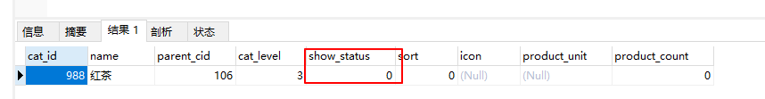


## 1.3 品牌管理-OSS对象存储

### 1.3.1 功能开通及试用

阿里云OSS：https://oss.console.aliyun.com/

帮助文档：https://help.aliyun.com/zh/oss/user-guide/

1.开通OSS服务

2.创建Bucket

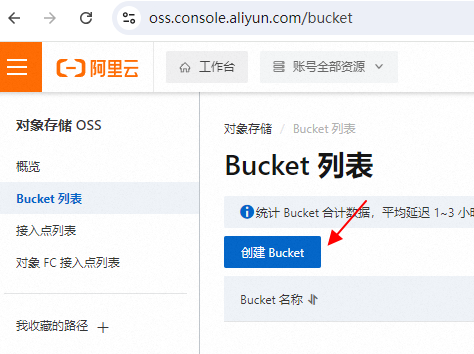

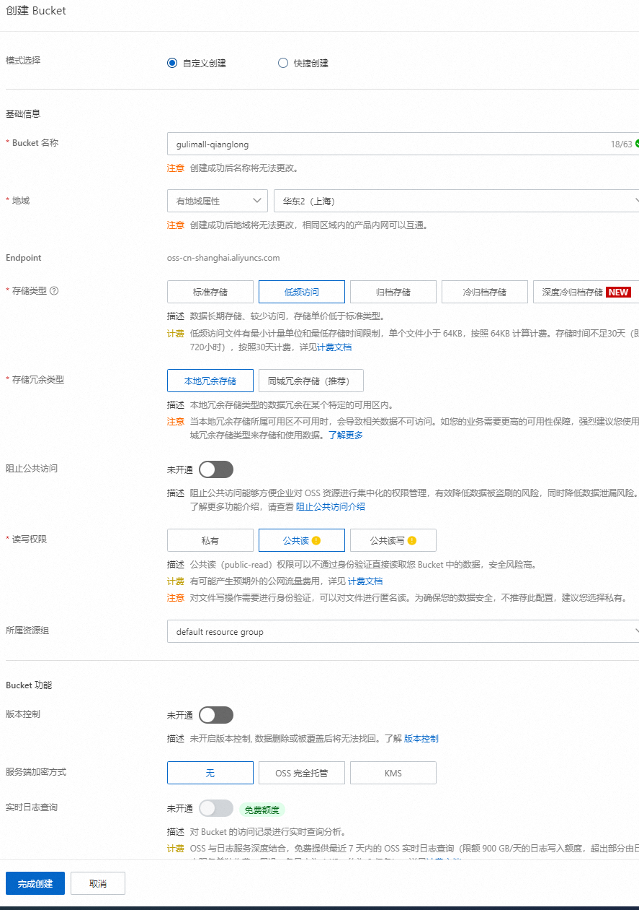

3.上传文件

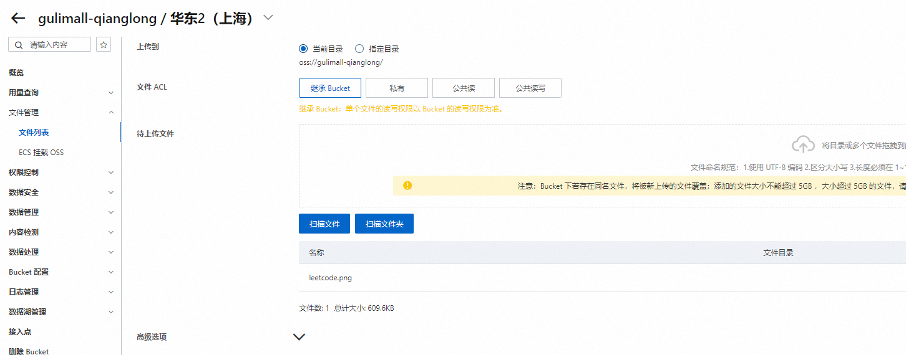

4. 使用URL直接访问

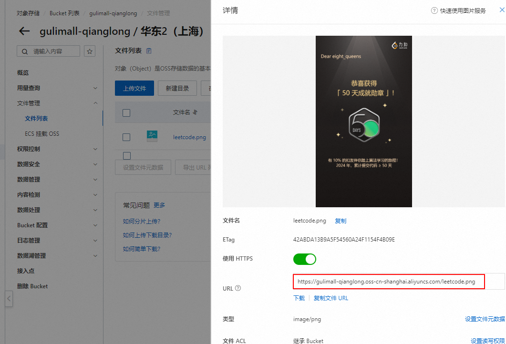


### 1.3.2 java文件上传OSS

阿里云对象存储-服务端签名后直接上传

用户向服务器请求签名（根据账号密码等信息生成策略返给用户），之后用户直接将文件上传到OSS，既减轻了服务器带宽压力，还避免了账号密码等信息泄露。

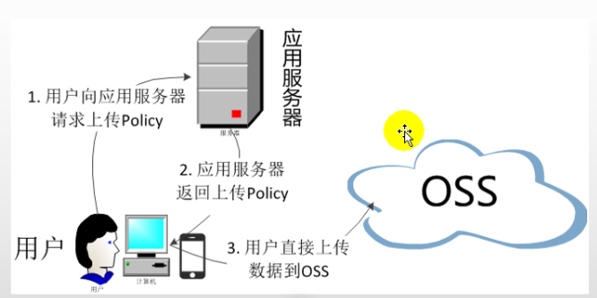

帮助文档：https://help.aliyun.com/zh/oss/user-guide/


https://help.aliyun.com/zh/oss/user-guide/simple-upload?spm=a2c4g.11186623.0.0.6c331f49lDKkP9

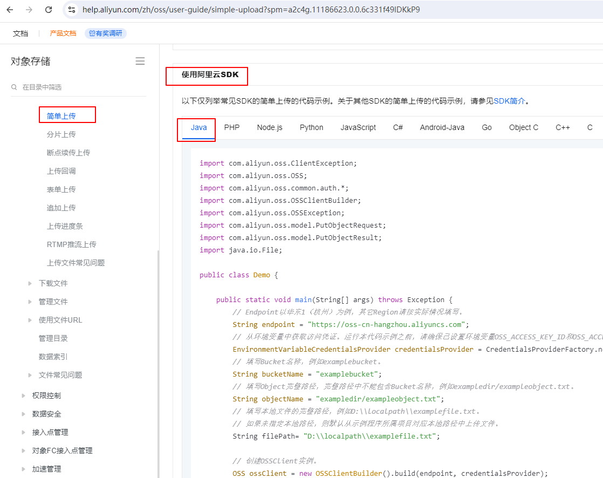


#### 1.3.2.1 引入依赖

```xml
<dependency>
    <groupId>com.aliyun.oss</groupId>
    <artifactId>aliyun-sdk-oss</artifactId>
    <version>3.17.4</version>
</dependency>
```

Java 9及以上的版本，需要添加JAXB相关依赖:

```xml
<dependency>
    <groupId>javax.xml.bind</groupId>
    <artifactId>jaxb-api</artifactId>
    <version>2.3.1</version>
</dependency>
<dependency>
    <groupId>javax.activation</groupId>
    <artifactId>activation</artifactId>
    <version>1.1.1</version>
</dependency>
<!-- no more than 2.3.3-->
<dependency>
    <groupId>org.glassfish.jaxb</groupId>
    <artifactId>jaxb-runtime</artifactId>
    <version>2.3.3</version>
</dependency>
```


#### 1.3.2.2 java上传文件流


创建子账户AccessKey

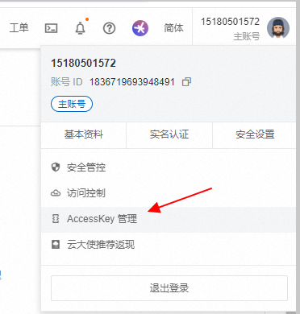

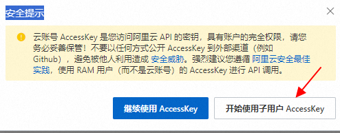


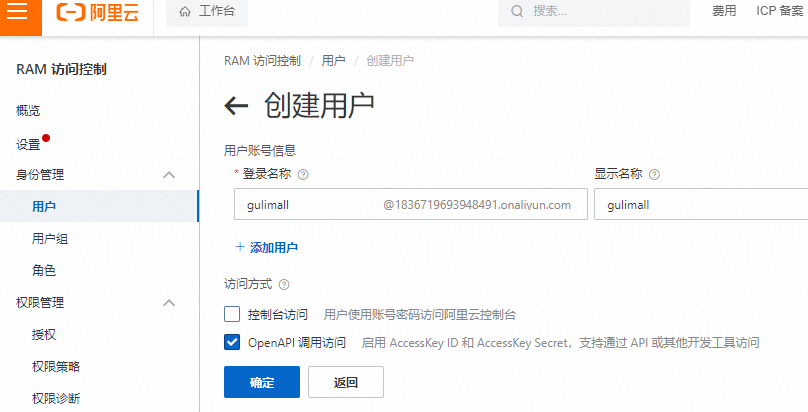


添加权限：

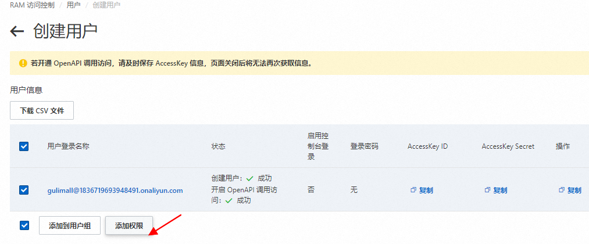


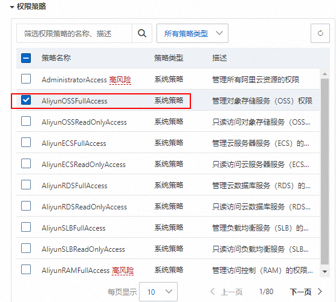


存储空间名字（bucketName）

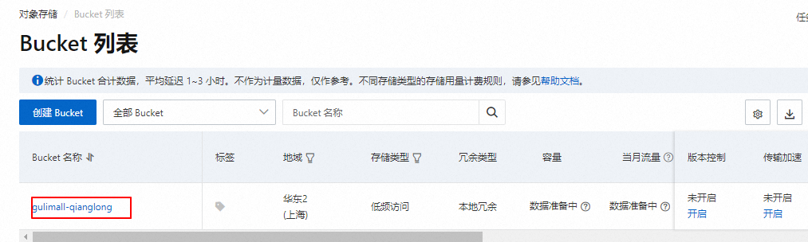

代码里accessKeyId和accessKeySecret直接复制上面刚开通的RAN访问控制里的

```java
import com.aliyun.oss.OSS;
import com.aliyun.oss.OSSClientBuilder;
import java.io.FileInputStream;
import java.io.FileNotFoundException;
import java.io.InputStream;

@SpringBootTest(classes = GulimallProductApplication.class )
public class GulimallProductApplicationTest {
    @Test
    public void upLoadOSS() throws FileNotFoundException {
        // Endpoint以上海为例，其它Region请按实际情况填写。
        String endpoint = "https://oss-cn-shanghai.aliyuncs.com";
        // 运行本代码示例之前，请确保已设置OSS_ACCESS_KEY_ID和OSS_ACCESS_KEY_SECRET
        String accessKeyId="LTAI5tFTTUWqBbq8F9zzvhVb";
        String accessKeySecret="9EvG2ZhCor8ZutCWrccFzJLDtaxDtU";
        // 创建OSSClient实例
        OSS ossClient=new OSSClientBuilder().build(endpoint,accessKeyId,accessKeySecret);
        // 上传文件流
        InputStream inputStream = new FileInputStream("C:\\Users\\dragon\\Desktop\\1.jpg");
        String bucketName = "gulimall-qianglong";
        // 上传后在OSS里的文件名
        String objectName = "1.jpg";
        ossClient.putObject(bucketName,objectName,inputStream);
        // 关闭OSSClient
        ossClient.shutdown();
        log.info("上传成功");
    }
}
```

上传成功：

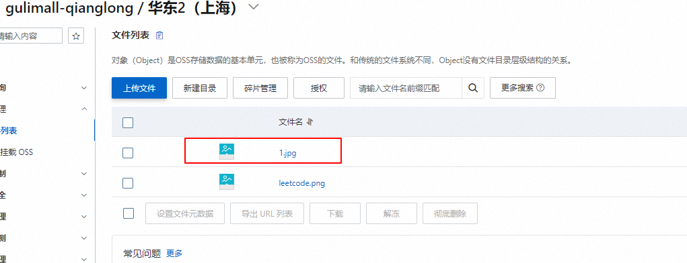


一般将配置信息写到yml里：

```yaml
alibaba:
  oss:
    endpoint: https://oss-cn-shanghai.aliyuncs.com #Endpoint按实际Region填写。
    accessKeyId: LTAI5tFTTUWqBbq8F9zzvhVb  #OSS_ACCESS_KEY_ID
    accessKeySecret: 9EvG2ZhCor8ZutCWrccFzJLDtaxDtU #OSS_ACCESS_KEY_SECRET
```


```java
@Configuration
public class OssConfig {
    @Value("${alibaba.oss.endpoint}")
    private String endpoint;
    @Value("${alibaba.oss.accessKeyId}")
    private String accessKeyId;
    @Value("${alibaba.oss.accessKeySecret}")
    private String accessKeySecret;
    @Bean
    public OSS ossClient(){
        return new OSSClientBuilder().build(endpoint,accessKeyId,accessKeySecret);
    }
}
```


```java
@SpringBootTest(classes = GulimallProductApplication.class )
public class GulimallProductApplicationTest {
    @Autowired
    OSS oss;
    
    @Test
    public void upLoadOSS() throws FileNotFoundException {
        // 上传文件流
        InputStream inputStream = new FileInputStream("C:\\Users\\dragon\\Desktop\\1.jpg");
        String bucketName = "gulimall-qianglong";
        // 要上传的文件名
        String objectName = "2.jpg";
        oss.putObject(bucketName,objectName,inputStream);
        // 关闭OSSClient
        oss.shutdown();
    }
```

#### 1.3.2.3 服务端签名后web直传

参考：https://help.aliyun.com/zh/oss/use-cases/java-1?spm=a2c4g.11186623.0.0.7c475d03UA9gSY#concept-ahk-rfz-2fb


允许跨域访问：

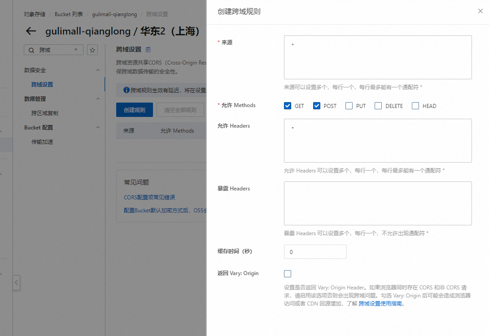


```java
@RestController
public class OssController {
    @Autowired
    OssService ossService;
    @GetMapping("/oss/policy")
    public R policy(){
        return ossService.policy();
    }
}
```


```java
package com.atguigu.gulimall.gulimallthirdparty.service.impl;
import com.aliyun.oss.OSS;
import com.aliyun.oss.common.utils.BinaryUtil;
import com.aliyun.oss.model.MatchMode;
import com.aliyun.oss.model.PolicyConditions;
import com.atguigu.common.utils.R;
import com.atguigu.gulimall.gulimallthirdparty.service.OssService;
import org.springframework.beans.factory.annotation.Autowired;
import org.springframework.beans.factory.annotation.Value;
import org.springframework.stereotype.Service;

import java.text.SimpleDateFormat;
import java.util.Date;
import java.util.LinkedHashMap;
import java.util.Map;

@Service
public class OssServiceImpl implements OssService {
    @Autowired
    OSS ossClient;
    @Value("${alibaba.oss.endpoint}")
    private String endpoint;
    @Value("${alibaba.oss.accessKeyId}")
    private String accessKeyId;
    @Value("${alibaba.oss.accessKeySecret}")
    private String accessKeySecret;
    @Value("${alibaba.oss.bucket}")
    private String bucket;
    @Override
    public R policy() {
        Map<String, String> respMap=null;
        // 文件真实访问地址 https://gulimall-qianglong.oss-cn-shanghai.aliyuncs.com/5.jpg
        // Host格式为https://bucketname.endpoint。
        String host = "https://"+bucket+"."+endpoint;
        // 设置上传回调URL，即回调服务器地址，用于处理应用服务器与OSS之间的通信。OSS会在文件上传完成后，把文件上传信息通过此回调URL发送给应用服务器。
        //String callbackUrl = "https://192.168.0.0:8888";
        // 设置上传到OSS文件的前缀，文件将上传至Bucket的根目录下:设置为按日期分类
        String format=new SimpleDateFormat("yyyy-MM-dd").format(new Date());
        String dir = format+"/";

        try {
            long expireTime = 30;
            long expireEndTime = System.currentTimeMillis() + expireTime * 1000;
            Date expiration = new Date(expireEndTime);
            // PostObject请求最大可支持的文件大小为5 GB，即CONTENT_LENGTH_RANGE为5*1024*1024*1024。
            PolicyConditions policyConds = new PolicyConditions();
            policyConds.addConditionItem(PolicyConditions.COND_CONTENT_LENGTH_RANGE, 0, 1048576000);
            policyConds.addConditionItem(MatchMode.StartWith, PolicyConditions.COND_KEY, dir);

            String postPolicy = ossClient.generatePostPolicy(expiration, policyConds);
            byte[] binaryData = postPolicy.getBytes("utf-8");
            String encodedPolicy = BinaryUtil.toBase64String(binaryData);
            String postSignature = ossClient.calculatePostSignature(postPolicy);

            respMap = new LinkedHashMap<String, String>();
            respMap.put("accessid", accessKeyId);
            respMap.put("policy", encodedPolicy);
            respMap.put("signature", postSignature);
            respMap.put("dir", dir);
            respMap.put("host", host);
            respMap.put("expire", String.valueOf(expireEndTime / 1000));
            // respMap.put("expire", formatISO8601Date(expiration));

        } catch (Exception e) {
            // Assert.fail(e.getMessage());
            System.out.println(e.getMessage());
        } finally {
            ossClient.shutdown();
        }
        return R.ok().put("data",respMap);
    }
}
```


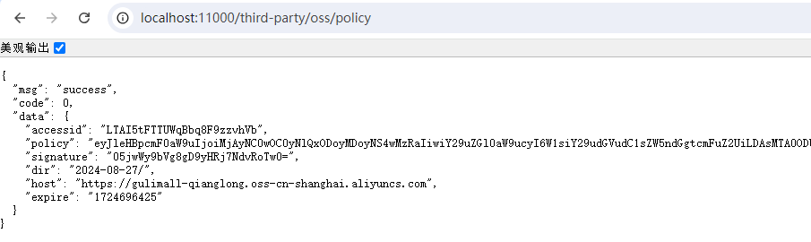


品牌管理：只有查询，无新增、删除按钮

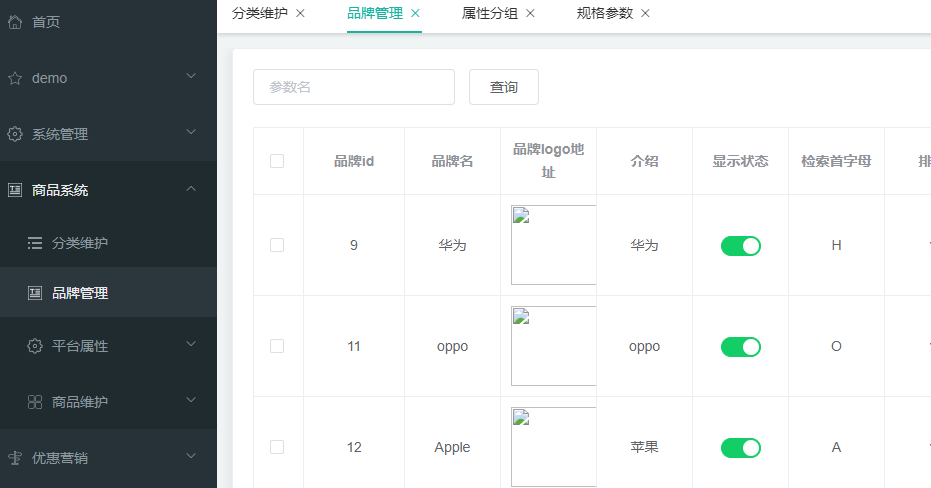

原因：前端加了权限判断

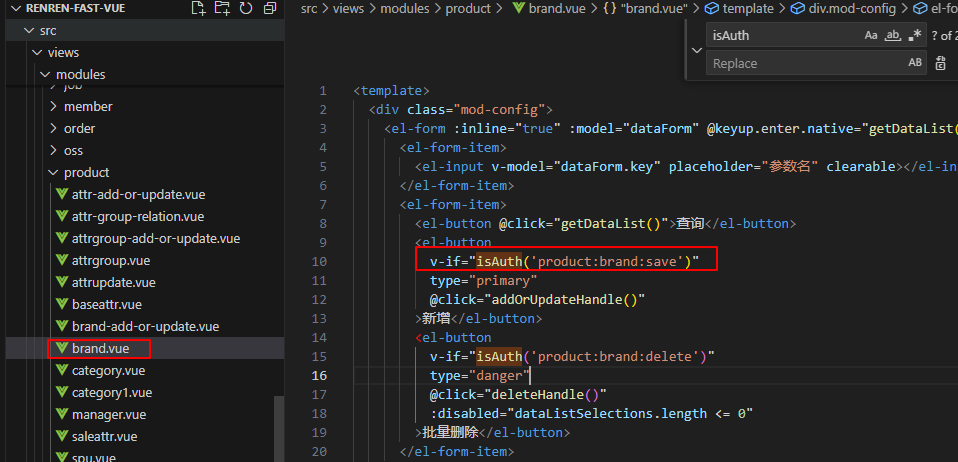

解决：该方法先全部返回true

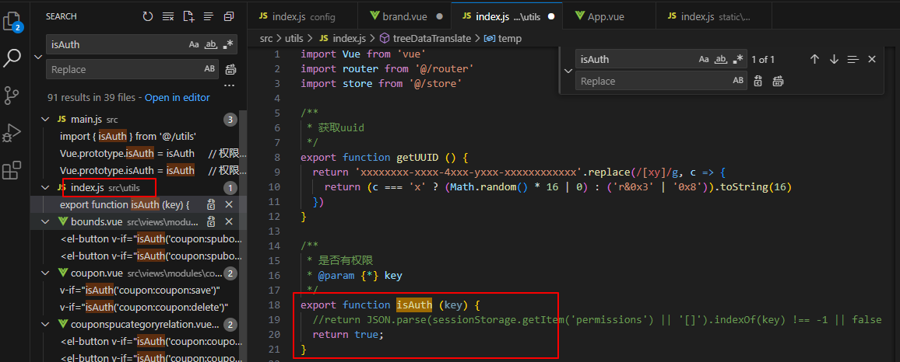

重启：

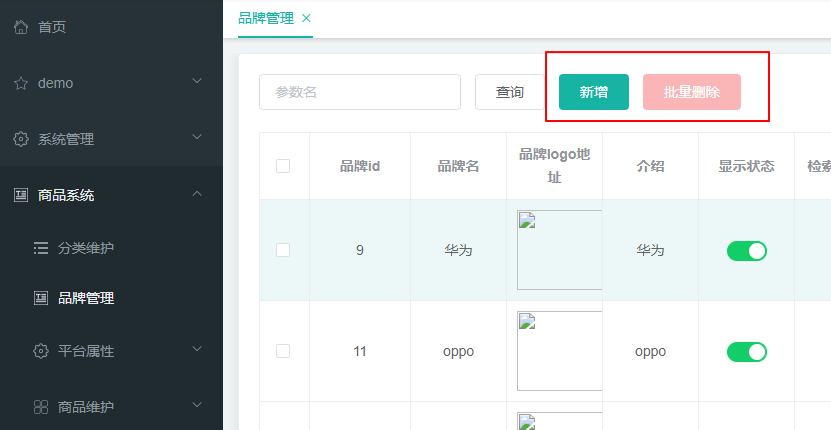


前端修改OSS相关配置：

两个

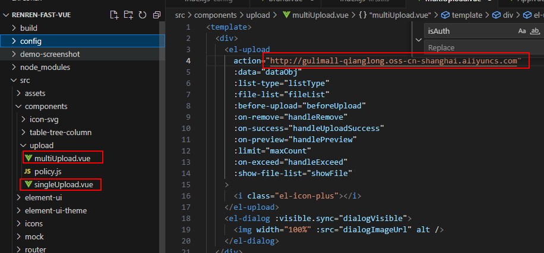


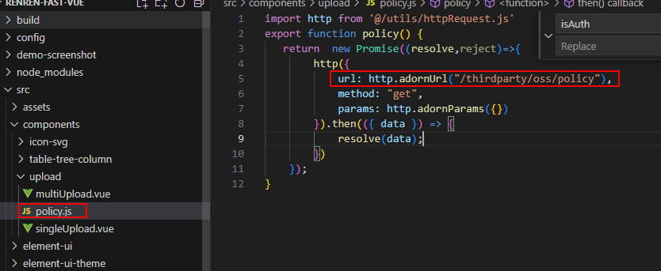


测试文件上传功能：

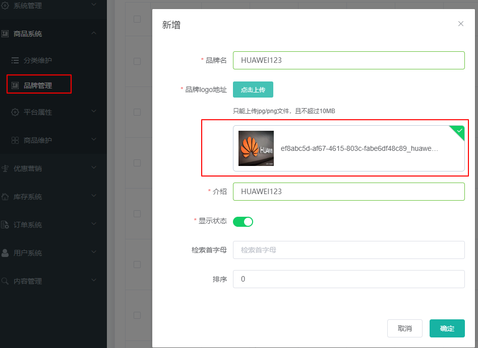

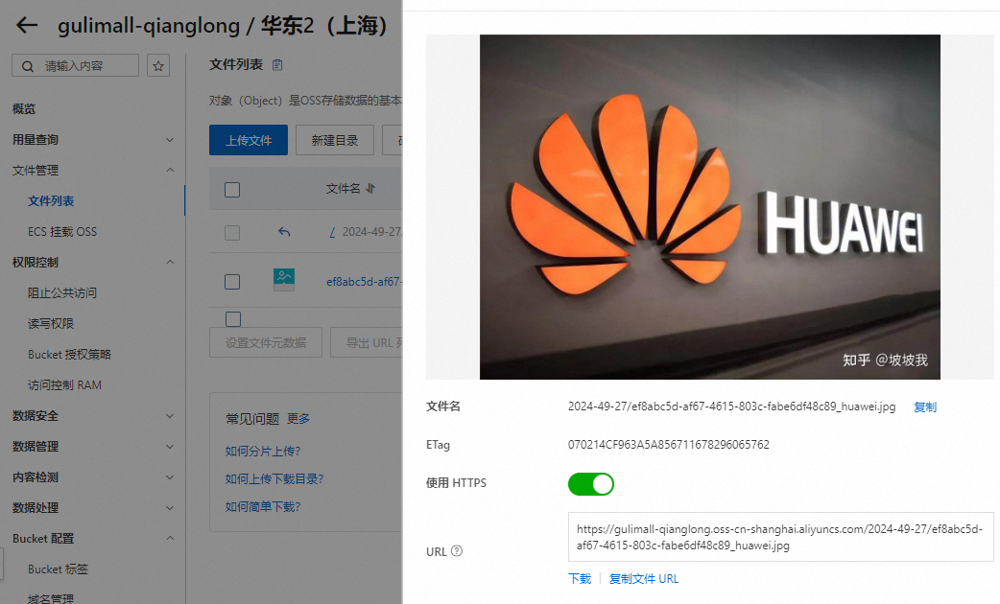

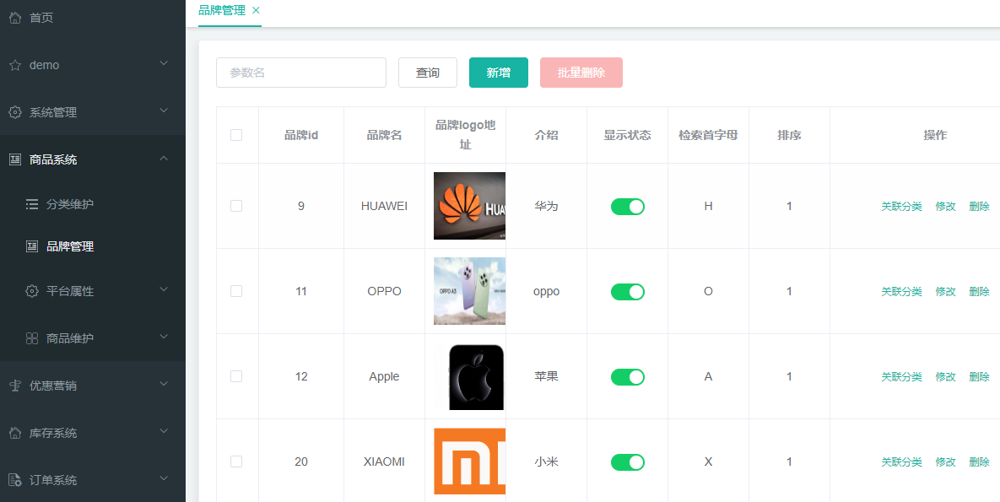

## 1.4 属性分组 

### 1.4.1 SPU与SKU

SPU（Standard Product Unit）：标准化产品单元，是商品聚合化的最小单位，是一组可复用、易检索的标准化信息集合，该集合描述了一个产品的特性。比如苹果手机的基本参数特性。对应**<font color=red>规格参数</font>**

SKU（Stock Keeping Unit）：库存进出基本计量单元。比如某款苹果手机下面有不同的分类：黑 8G+256G ，白 16G+512G。对应**<font color=red>销售属性</font>**。**<font color=red>所有SKU共享SPU的基本属性</font>**。

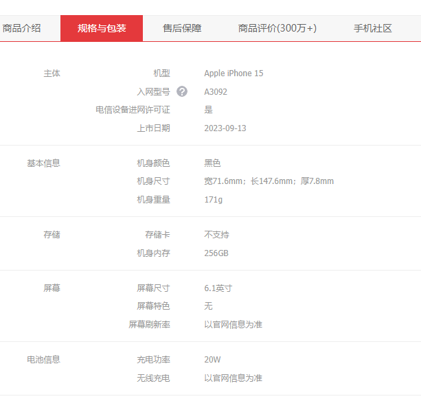


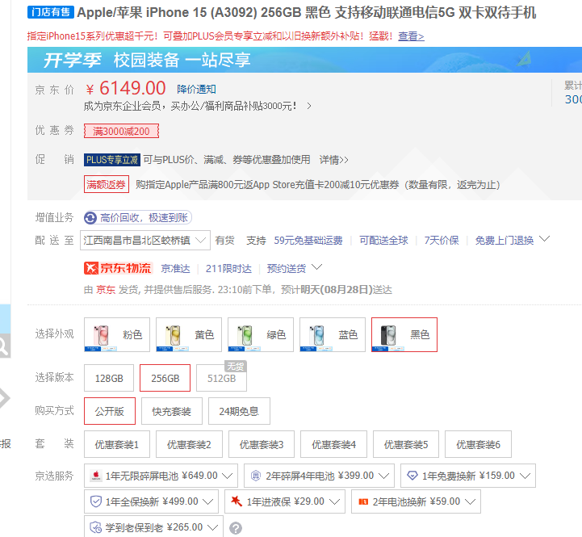


pms_attr：属性表，分为基本属性和销售属性，用catelog_id将属性与三级分类关联

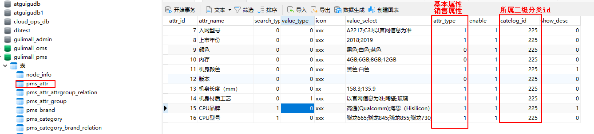


pms_attr_group:属性分组表

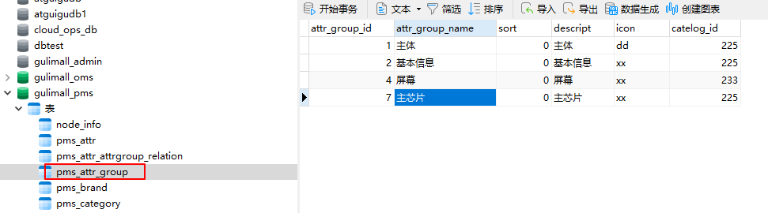

pms_attr_attrgroup_relation: 属性与属性分组关系表

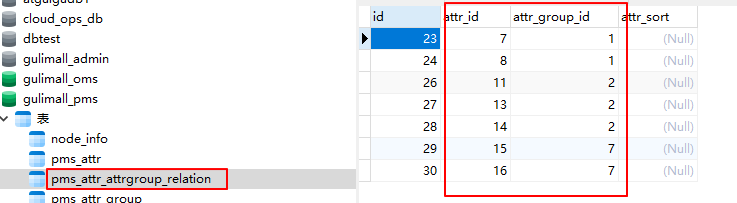


pms_spu_info： spu信息表

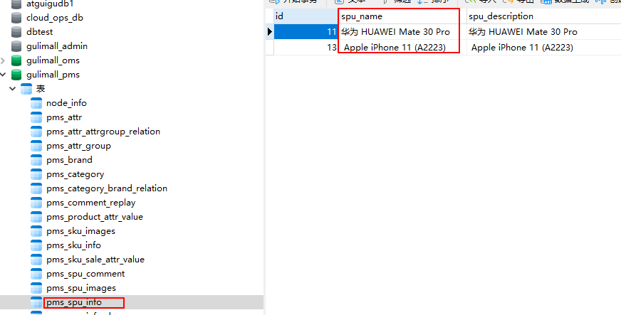


pms_sku_info: sku信息

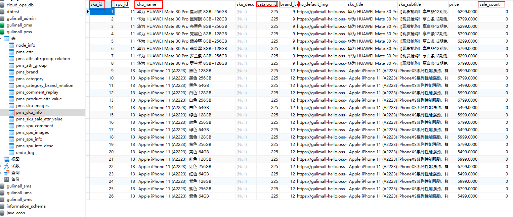


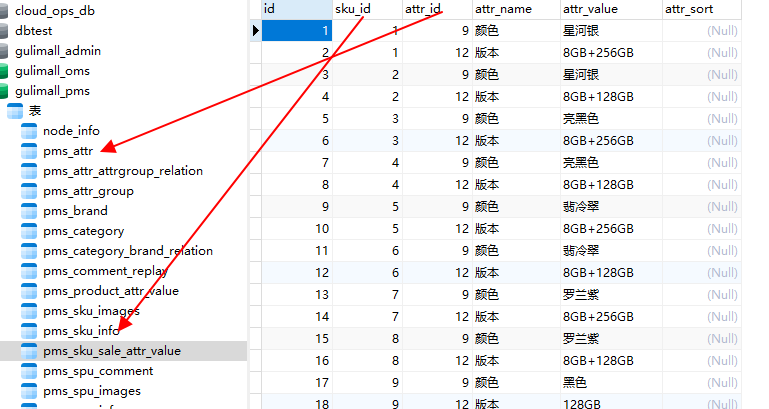


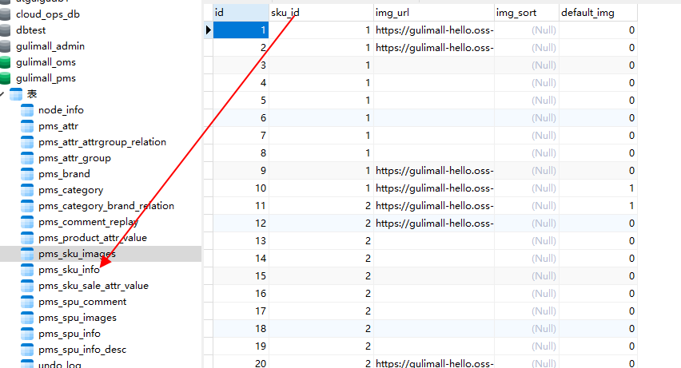


### 1.4.2 设置某个字段为空数组[]不展示

下面以children为例

```java
@Data
@TableName("pms_category")
public class CategoryEntity implements Serializable {
	......
	/**
	 * 子分类，不对应数据库中任何字段
	 * JsonInclude：  children字段不为空数组[]才显示，否则隐藏
	 */
	@JsonInclude(JsonInclude.Include.NON_EMPTY)
	@TableField(exist = false)
	private List<CategoryEntity> children;

}
```


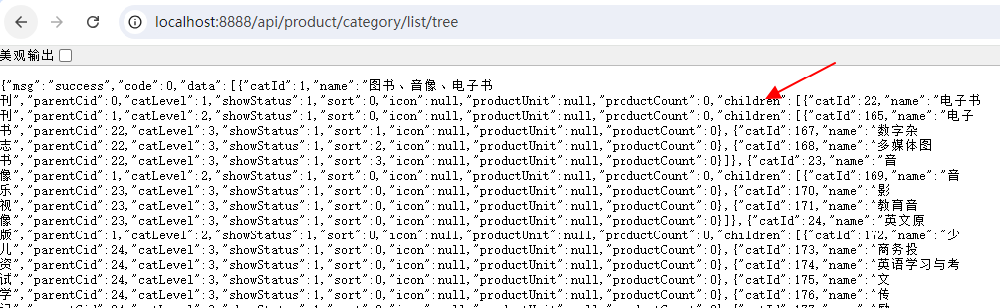


### 1.4.3 模糊查询: 属性根据分组 id或者组名检索

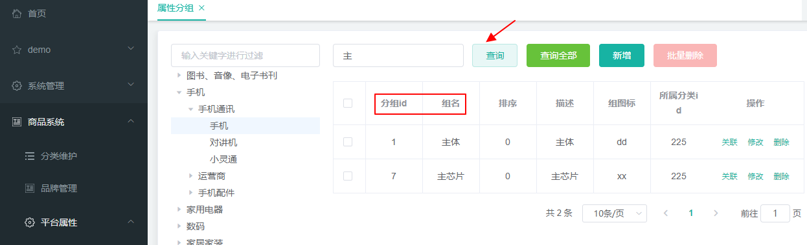

```java
@Service("attrGroupService")
public class AttrGroupServiceImpl extends ServiceImpl<AttrGroupDao, AttrGroupEntity> implements AttrGroupService {

    @Override
    public PageUtils queryPage(Map<String, Object> params) {
        IPage<AttrGroupEntity> page = this.page(
                new Query<AttrGroupEntity>().getPage(params),
                new QueryWrapper<AttrGroupEntity>()
        );
        return new PageUtils(page);
    }
    
    @Override
    public PageUtils MyQueryPage(Map<String, Object> params, Long catelogId) {
        if(catelogId==0){ // 查所有分类（数据库中没有catelogId为0的）
            return this.queryPage(params);
        }else{
            // SELECT * FROM `pms_attr_group` WHERE catelog_id=225 and (attr_group_id like='主' or  attr_group_name like '%主%');
            QueryWrapper<AttrGroupEntity> queryWrapper=new QueryWrapper<AttrGroupEntity>().eq("catelog_id",catelogId);
            String key=(String) params.get("key"); // 检索关键字
            if(!key.equals("")){
                queryWrapper.and((obj)->{
                    obj.eq("attr_group_id",key).or().like("attr_group_name",key);
                });
            }
            IPage<AttrGroupEntity> page = this.page(
                    new Query<AttrGroupEntity>().getPage(params), // 分页条件
                    queryWrapper // 查询条件
            );
            return new PageUtils(page);
        }
    }
}
```

### 1.4.4 Mybatis分页插件

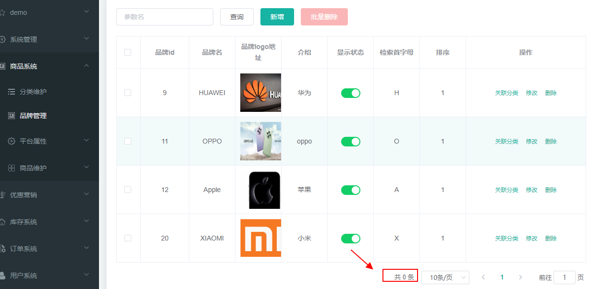

```java
/**
 * @Description MyBatis配置：开启事务 分页
 **/
@Configuration
@EnableTransactionManagement
@MapperScan("com.atguigu.product.dao")
public class MyBatisConfig {

    /**
     * 引入分页插件
     **/
    @Bean
    public PaginationInnerInterceptor paginationInnerInterceptor(){
        PaginationInnerInterceptor paginationInnerInterceptor=new PaginationInnerInterceptor();
        // 设置请求页面大于最大页后操作，true调回到首页，false继续请求，默认false
        paginationInnerInterceptor.setOverflow(true);
        //设置最大单页限制数量，默认500条，-1不受限制
        paginationInnerInterceptor.setMaxLimit((long)100);
        return paginationInnerInterceptor;
    }
}
```

引入后条数统计正确：

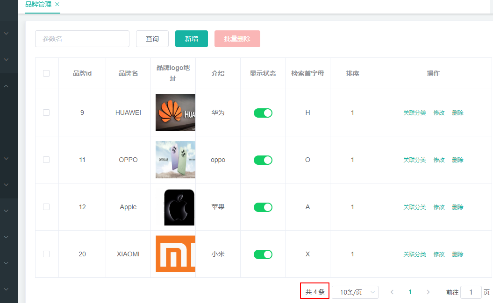


### 1.4.5 规范-DTO VO DAO等

规范：

- **<font color=red>DTO(Data Transfer Object)</font>**：数据传输对象, 和TO类似，一般用于做请求体，DTO用的较多
- **<font color=red>VO(Value Object)</font>** :值对象，一般用来接收页面传来的数据或者封装接口响应出去的数据
- **<font color=red>DAO</font>**：数据访问对象，用来访问数据库的对象

- PO:持久对象，对应数据库某个表中的一条记录，多个记录可以用PO的集合，PO不应包含任何对数据库的操作
- DO(Domain Object)：领域对象，从现实世界中抽象出来的有形的或无形的业务 实体。
- TO（Transfer Object）：数据传输对象，不同微服务之间传输的对象，互相调用
- BO（Business Object ）：业务对象

### 1.4.6 自增主键插入数据后返回主键

由于插入数据时未携带主键，需要等插入完成后到数据库查一遍才知道，但这样做耗费性能，且若其他查询字段不唯一，则无法确定。

解决办法：使用keyProperty

```java
@Mapper
public interface AttrDao extends BaseMapper<AttrEntity> {
    void insertReturnId(@Param("attrEntity") AttrEntity attrEntity);
}
```


AttrDao.xml: **<font color=red>使用keyProperty表示将自增主键赋值给实体类AttrEntity中的attrId字段</font>**。

```xml
<insert id="insertReturnId" parameterType="com.atguigu.product.entity.AttrEntity" useGeneratedKeys="true" keyProperty="attrId">
        insert into pms_attr(attr_name,search_type,value_type)
        values(#{attrEntity.attrName},#{attrEntity.searchType},#{attrEntity.valueType})
    </insert>
```


```java
 attrDao.insertReturnId(attrEntity);
 // 之后再次获取就能拿到
attrEntity.getAttrId()
 
```

### 1.4.7 批量删除

尽量减少访问数据库的次数

```java
@Mapper
public interface AttrAttrgroupRelationDao extends BaseMapper<AttrAttrgroupRelationEntity> {
    /**
     * @description: 一次批量删除
     **/
    void deleteBatch(@Param("attrAttrgroupRelationVos") List<AttrAttrGroupRelationVo>  attrAttrgroupRelationVos);
}
```

### 1.4.8 配置spring转json时间格式

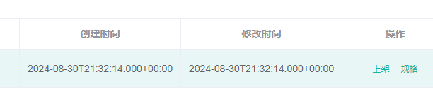

application.yml:

```yaml
spring:
  jackson:
    date-format: yyyy-MM-dd HH:mm:ss # 指定时间格式
```

配置后：

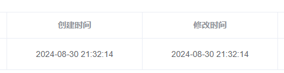


开启事务: 主程序加上@EnableTransactionManagement

```java
@EnableTransactionManagement
public class GulimallProductApplication {
    public static void main(String[] args) {
        SpringApplication.run(GulimallProductApplication.class, args);
    }
}
```


操作组所在方法加上：

```java
@Transactional
```


领取采购单：采购人员看到自己名下的采购单后，点击领取（员工系统的接口，不属于后台系统），采购单状态变为正在采购中，已经被领取的采购单不能再分配给其他人

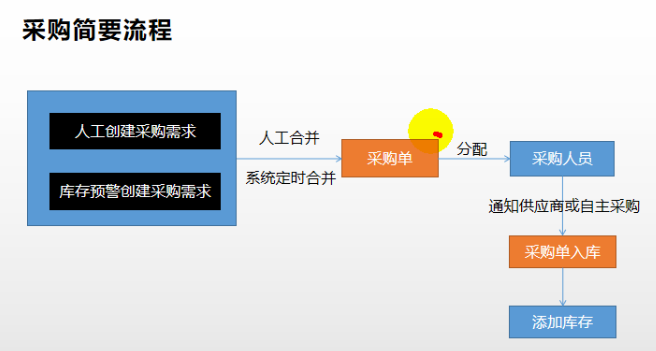

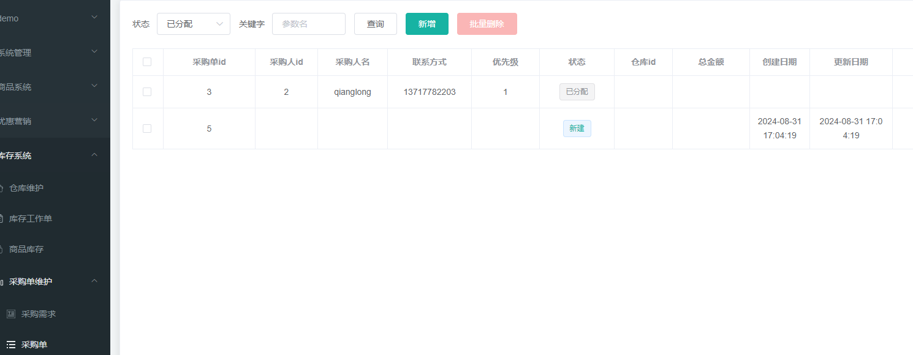

调用接口后：ware/purchase/received

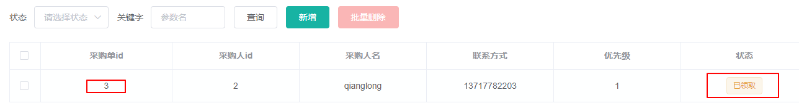


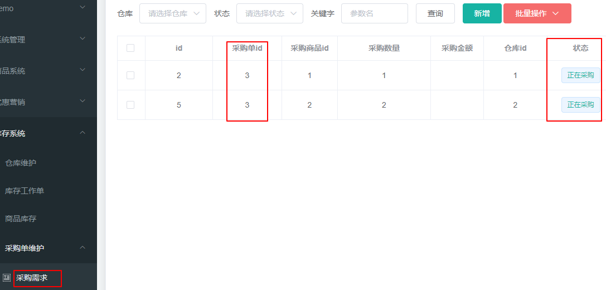
