[toc]

# 1. 简介

 https://www.elastic.co/cn/what-is/elasticsearch 

开源的 Elasticsearch 是目前全文搜索引擎的首选，它可以快速地**<font color=red>储存、搜索和分析</font>**海量数据，维基百科、Stack Overflow、Github 都采用它。

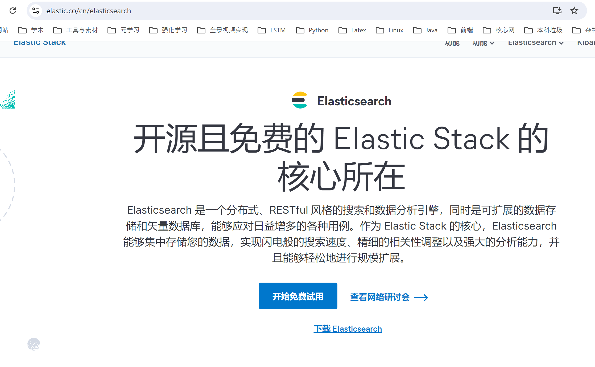

Elastic 的底层是开源库 **<font color=red>Lucene</font>**，提供了 **<font color=red>REST API</font>**的操作接口，直接调API即可(**<font color=red>天然跨平台</font>**)。

官方文档：https://www.elastic.co/guide/en/elasticsearch/reference/current/index.html (推荐)

官方中文：https://www.elastic.co/guide/cn/elasticsearch/guide/current/foreword_id.html （版本较老）

社区中文： https://es.xiaoleilu.com/index.html http://doc.codingdict.com/elasticsearch/0


# 2.基本概念

ES和MySQL类比

|       ES       |       MySQL       |
| :------------: | :---------------: |
|  Index(索引)   | Database(数据库)  |
|   Type(类型)   |     Table(表)     |
| Document(文档) |  Row（一行记录）  |
|  Column（列）  | Attribute（属性） |

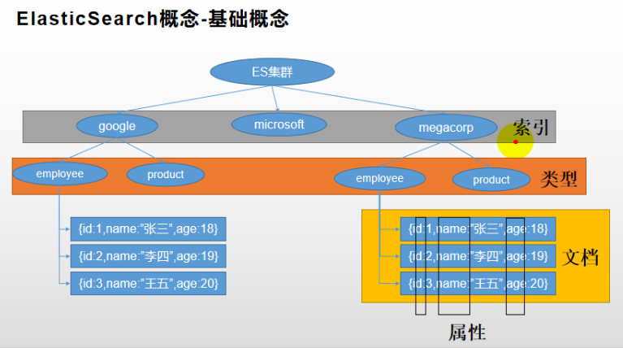

## 2.1 Index（索引)

- 动词，相当于 MySQL 中的 insert
- 名词，相当于 MySQL 中的 Database

## 2.2 Type（类型）

在 Index（索引）中，可以定义一个或多个类型。 类似于 MySQL 中的 Table；每一种类型的数据放在一起。

## 2.3 Document（文档）

保存在某个索引（Index）下，某种类型（Type）的一个数据（Document），文档是 JSON 格 式的，Document 类似 MySQL 中某个 Table 里面的行记录。

## 2.4 倒排索引机制

为什么ES检索快？----倒排索引

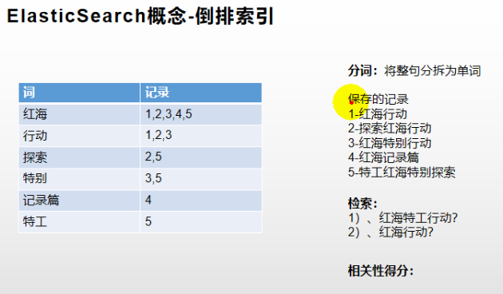

# 3.Docker安装

## 3.1 下载镜像

```bash
docker pull elasticsearch:7.4.2 #存储和检索数据
docker pull kibana:7.4.2 #可视化检索数据
```

## 3.2 创建实例

### 3.2.1 ElasticSearch

```bash
mkdir -p /mydata/elasticsearch/config #ES配置在物理机上对应的目录
mkdir -p /mydata/elasticsearch/data #ES数据在物理机上的路径
echo "http.host: 0.0.0.0" >> /mydata/elasticsearch/config/elasticsearch.yml #es可被所有机器访问
chmod -R 777 /mydata/elasticsearch/ #赋权
docker run --name elasticsearch -p 9200:9200 -p 9300:9300 -e ES_JAVA_OPTS="-Xms2048m -Xmx2048m" -v /mydata/elasticsearch/config/elasticsearch.yml:/usr/share/elasticsearch/config/elasticsearch.yml -v /mydata/elasticsearch/data:/usr/share/elasticsearch/data -v /mydata/elasticsearch/plugins:/usr/share/elasticsearch/plugins -d elasticsearch:7.4.2
```

 注意：

```bash
-e ES_JAVA_OPTS="-Xms64m -Xmx512m"
```

该参数设置 ES 的初始内存和最大内存，避免占用内存过大启动失败。

安装成功可以访问9200端口：

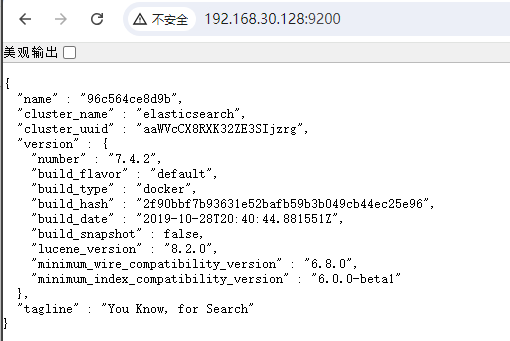


### 3.2.2 Kibana

```bash
docker run --name kibana -e ELASTICSEARCH_HOSTS=http://192.168.30.128:9200 -p 5601:5601 -d kibana:7.4.2  # http://192.168.30.128:9200   改为安装es dokcer所在服务器的地址
```

访问5601端口：

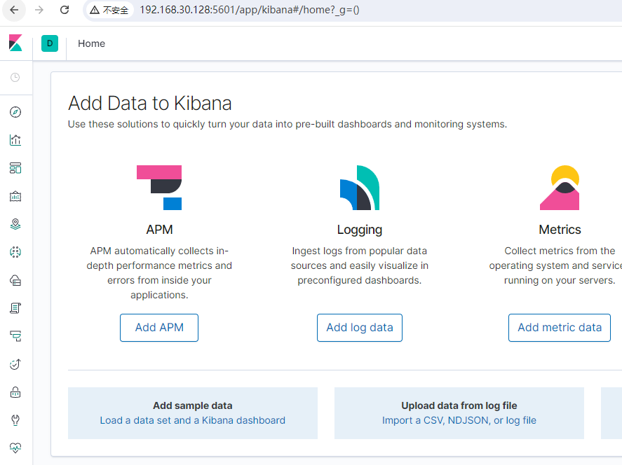

dev tools可以发请求：

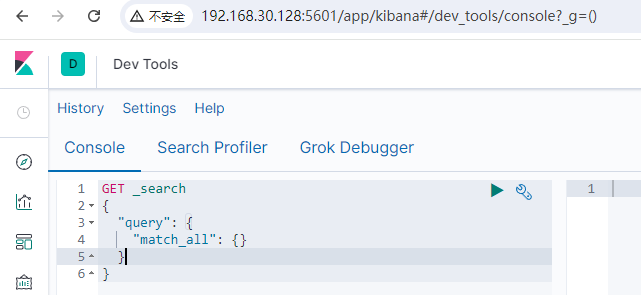

# 4.  初步检索

测试时直接用postman发REST API请求即可

## 4.1 _cat 

|                 接口功能                 |      uri      | 请求方式 |
| :--------------------------------------: | :-----------: | :------: |
|               查看所有节点               |  /_cat/nodes  |   GET    |
|             查看 es 健康状况             | /_cat/health  |   GET    |
|                查看主节点                | /_cat/master  |   GET    |
| 查看所有索引（类似MySQL show databases） | /_cat/indices |   GET    |

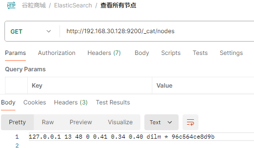

## 4.2 保存或更新文档 

保存一个文档，要先确定保存在哪个索引的哪个类型下（类比MySQL保存在哪个数据库的哪张表下），指定用哪个唯一标识 ，PUT 和 POST 都可以，例如：

PUT customer/external/1；在 customer 索引下的 external 类型下保存 1 号数据

```json
PUT customer/external/1  # 在 customer 索引下的 external 类型下保存 1 号数据（第一次新增，后面再发为更新）
{ "name": "John Doe"
}
```

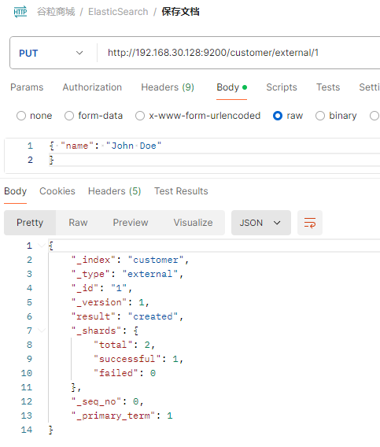

POST：

- 带 id：若没有该id的Document，第一次为新增，后续为更新。

- 不带 id：一直是新增，会自动生成 id。

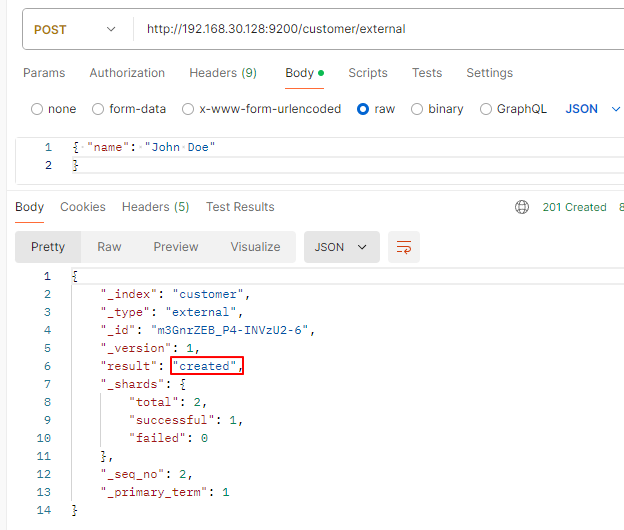

PUT:

PUT 需要指定 id，一般都用来做修改操作，不指定 id 会报错。

## 4.3 查询文档

```json
GET customer/external/1  #查询索引为customer，类型为external，1号Document的内容

# 结果
{ 
    "_index": "customer", //在哪个索引   （类比MySQL中的数据库）
    "_type": "external", //在哪个类型   (表)
    "_id": "1", //Document id （数据行号）
    "_version": 2, //版本号（新建是1，说明有改动）
    "_seq_no": 1, //并发控制字段，每次更新就会+1，用来做乐观锁
    "_primary_term": 1, //同上，主分片重新分配，如重启，就会变化
    "found": true, 
    "_source": { //真正的内容
    "name": "John Doe"
    }
}
更新携带 ?if_seq_no=0&if_primary_term=1
```

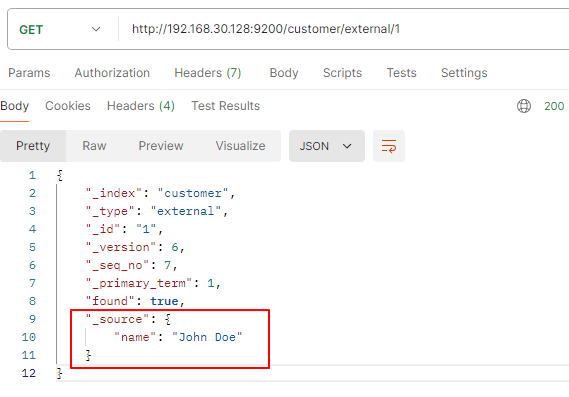

注意：**<font color=red>_seq_no 用来做并发控制，每次更新就+1，用来做乐观锁</font>**

http://192.168.30.128:9200/customer/external/1?if_seq_no=7&if_primary_term=1

两个同时修改，只会有一个成功

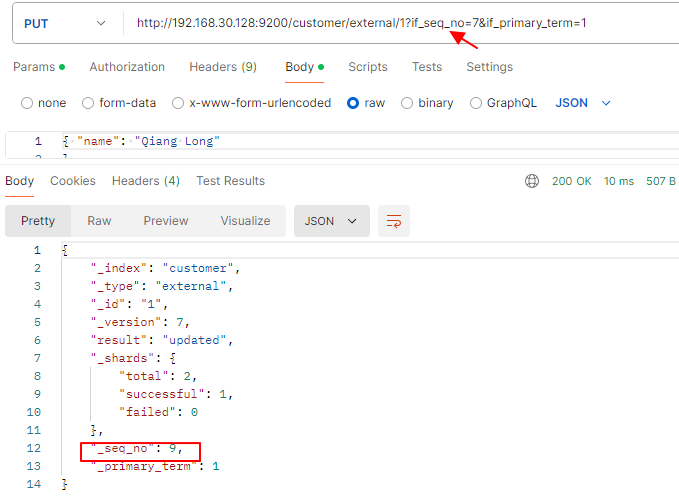


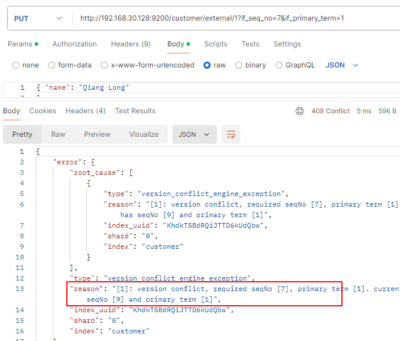

## 4.4 更新文档

- POST带_update: 会对比源文档数据，相同无操作，文档 version 不增

```json
POST customer/external/1/_update
{ 
    "doc":{ "name": "John Doew"
    }
}
```

- POST不带_update或PUT：不检查是否相同，都更新

```json
POST customer/external/1
{ "name": "John Doe2"
}
或者
PUT customer/external/1
{ "name": "John Doe"
}
```

适用场景：

大并发更新，不带 update； 大并发查询偶尔更新，带 update；对比更新，重新计算分配规

- 更新同时增加属性

```json
POST customer/external/1/_update
{ "doc": { "name": "Jane Doe", "age": 20 }
}
PUT 和 POST 不带_update 也可以
```

## 4.5删除文档

只能删除索引或者文档，不能删除类型

```json
DELETE customer/external/1   #删除Document 1
DELETE customer           #  删除索引customer
```

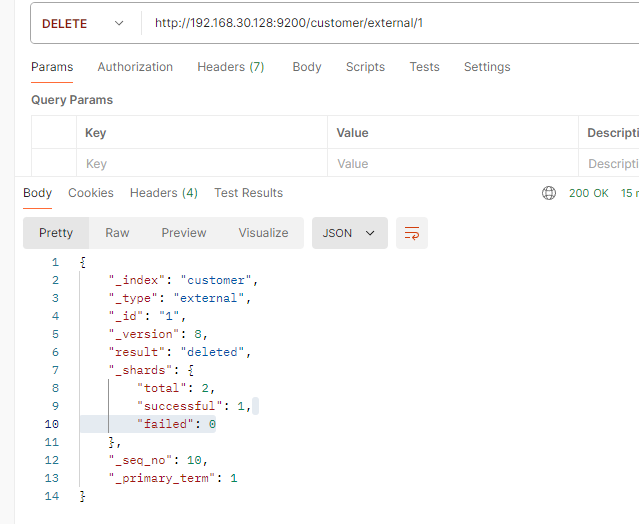

## 4.6bulk 批量 API

保存两个Document:  id分别为1和2

使用kibana代替postman

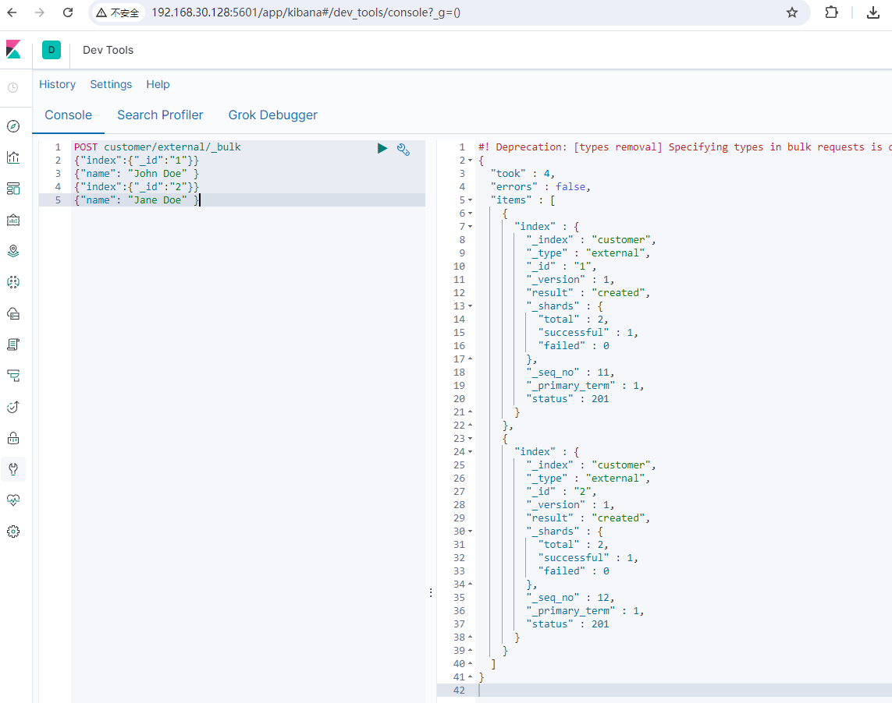

请求：

```json
POST customer/external/_bulk

{"index":{"_id":"1"}}  // Document 1
{"name": "John Doe" } 
{"index":{"_id":"2"}}  // Document 2
{"name": "Jane Doe" }
```

响应：

```json
#! Deprecation: [types removal] Specifying types in bulk requests is deprecated.
{
  "took" : 4,  // 耗时，ms
  "errors" : false,
  "items" : [
    {
      "index" : {
        "_index" : "customer",
        "_type" : "external",
        "_id" : "1",
        "_version" : 1,
        "result" : "created",
        "_shards" : {
          "total" : 2,
          "successful" : 1,
          "failed" : 0
        },
        "_seq_no" : 11,
        "_primary_term" : 1,
        "status" : 201
      }
    },
    {
      "index" : {
        "_index" : "customer",
        "_type" : "external",
        "_id" : "2",
        "_version" : 1,
        "result" : "created",
        "_shards" : {
          "total" : 2,
          "successful" : 1,
          "failed" : 0
        },
        "_seq_no" : 12,
        "_primary_term" : 1,
        "status" : 201
      }
    }
  ]
}
```


语法格式：

```json
语法格式：
{ action: { metadata }}\n
{ request body }\n

{ action: { metadata }}\n
{ request body }\n
```


```json
复杂实例：
POST /_bulk
{ "delete": { "_index": "website", "_type": "blog", "_id": "123" }}  // 删除
{ "create": { "_index": "website", "_type": "blog", "_id": "123" }}  // 创建
{ "title": "My first blog post" }  
{ "index": { "_index": "website", "_type": "blog" }}   			    // 保存
{ "title": "My second blog post" }
{ "update": { "_index": "website", "_type": "blog", "_id": "123", "_retry_on_conflict" : 3} }   														    // 更新
{ "doc" : {"title" : "My updated blog post"}}
```

bulk API 以此按顺序执行所有的 action（动作）。如果一个单个的动作因任何原因而失败， 它将继续处理它后面剩余的动作。当 bulk API 返回时，它将提供每个动作的状态（与发送 的顺序相同），所以您可以检查是否一个指定的动作是不是失败了


# 5. 进阶检索

练习

```json
#1. 分词
POST _analyze
{ 
  "analyzer": "ik_max_word", 
  "text": "我是中国人"
}

# 2.查询索引为user下的数据
GET /user/_search/

#3. 将数据存入索引product
PUT product
{
  "mappings": {
    "properties": {
      "skuId": {
        "type": "long"
      }
    }
  }
}

#4. 删除索引为product下的数据
DELETE /product 


# 5.嵌入型（nested），对应java类  atts检索
GET product/_search
{
  "query": {
    "bool": {
      "filter": {
        "nested": {
          "path": "attrs",
          "query": {
            "bool": {
              "must": [
                {
                  "term": {
                    "attrs.attrId": {
                      "value": "15"
                    }
                  }
                },
                {
                  "terms": {
                    "attrs.attrValue": [
                      "HUAWEI Kirin 980",
                      "海思（Hisilicon）"
                    ]
                  }
                }
              ]
            }
          }
        }
      }
    }
  }
}


#6. 排序检索（sort）
GET product/_search
{
  "sort": [
    {
      "skuPrice": {
        "order": "desc"
      }
    }
  ]
}

#7. 按商品价格区间检索
GET product/_search
{
  "query": {
    "bool": {
      "filter": {
        "range": {
          "skuPrice": {
            "gte": 7000,
            "lte": 9000
          }
        }
      }
    }
  }
}

#8. 分页(从第0个记录开始，查询1个)
GET product/_search
{
  "from": 0,
  "size": 1
}


#9. 高亮标题
GET /product/_search
{
  "highlight": {
    "fields": {
      "skuTitle":{}
    },  
    "pre_tags": "<b style='color:red'>",
    "post_tags": "</b>"
    
  }
}

#10. 聚合分析(按品牌、分类)  
#aggs为子聚合（基于上一次聚合的数据），为了取出品牌名和分类名
# 聚合属性(att用嵌入式聚合 )
GET /product/_search
{
  "aggs": {
    "brand_agg": {
      "terms": {
        "field": "brandId",
        "size": 10
      },
      "aggs": {
        "brand_name_agg": {
          "terms": {
            "field": "brandName",
            "size": 10
          }
        },
        "brand_img_agg": {
          "terms": {
            "field": "brandImg",
            "size": 10
          }
        }
      }
    },
    "catalog_agg": {
      "terms": {
        "field": "catalogId",
        "size": 10
      },
      "aggs": {
        "catalog_name_agg": {
          "terms": {
            "field": "catalogName",
            "size": 10
          }
        }
      }
    },
    "attr_agg": {
      "nested":{
          "path":"attrs"
        },
      "aggs": {
        "attr_id__agg": {
          "terms": {
            "field": "attrs.attrId",
            "size": 10
          },
          "aggs": {
            "attr_name_agg": {
              "terms": {
                "field": "attrs.attrName",
                "size": 10
              }
            },
            "attr_value_agg": {
              "terms": {
                "field": "attrs.attrValue",
                "size": 10
              }
            }
          }
        }
      }
    }
    
  }
}


#11. 查询索引为product下的映射
GET /product/_mapping


#12. 为索引product添加映射（前提是索引已存在）
PUT /product/_mapping
{
  "mappings": {
    "properties": {
      "skuId": {
        "type": "long"
      },
      "spuId": {
        "type": "keyword"
      },
      "skuTitle": {
        "type": "text",
        "analyzer": "ik_smart"
      },
      "skuPrice": {
        "type": "keyword"
      },
      "skuImg": {
        "type": "keyword",
        "index": false,
        "doc_values": false
      },
      "saleCount": {
        "type": "long"
      },
      "hasStock": {
        "type": "boolean"
      },
      "hotScore": {
        "type": "long"
      },
      "brandId": {
        "type": "long"
      },
      "catalogId": {
        "type": "long"
      },
      "brandName": {
        "type": "keyword",
        "index": false,
        "doc_values": false
      },
      "brandImg": {
        "type": "keyword",
        "index": false,
        "doc_values": false
      },
      "catalogName": {
        "type": "keyword",
        "index": false,
        "doc_values": false
      },
      "attrs": {
        "type": "nested",
        "properties": {
          "attrId": {
            "type": "long"
          },
          "attrName": {
            "type": "keyword",
            "index": false,
            "doc_values": false
          },
          "attrValue": {
            "type": "keyword"
          }
        }
      }
    }
  }
}


# 13. 组装查询条件DSL （商城检索服务）
#模糊匹配，过滤（按属性、分类、品牌、价格区间、库存等），排序，分页，高亮
#聚合分析
GET product/_search
{
  "query": {
    "bool": {
      "must": [
        {
          "match": {
            "skuTitle": "华为" 
          }
        }
      ],
      "filter": [
        {
        "term": {
          "catalogId": "225"
        }
      },
        {
        "terms": {
          "brandId": [
            "9",
            "12"
          ]
        }
      },
        {
        "nested": {
          "path": "attrs",
          "query": {
            "bool": {
              "must": [
                {
                  "term": {
                    "attrs.attrId": {
                      "value": "15"
                    }
                  }
                },
                {
                  "terms": {
                    "attrs.attrValue": [
                      "HUAWEI Kirin 980",
                      "海思（Hisilicon）"
                    ]
                  }
                }
              ]
            }
          }
        }
      },
        {
        "term": {
          "hasStock": "true"
        }
      },
        {
          "range": {
          "skuPrice": {
            "gte": 5000,
            "lte": 8000
          }
        }
        }
      ]
    }
  },
  "sort": [
    {
      "skuPrice": {
        "order": "desc"
      }
    }
  ],
  "from": 0,
  "size": 1,
  "highlight": {
    "fields": {
      "skuTitle":{}
    },  
    "pre_tags": "<b style='color:red'>",
    "post_tags": "</b>"
    
  },
  "aggs": {
    "brand_agg": {
      "terms": {
        "field": "brandId",
        "size": 10
      },
      "aggs": {
        "brand_name_agg": {
          "terms": {
            "field": "brandName",
            "size": 10
          }
        },
        "brand_img_agg": {
          "terms": {
            "field": "brandImg",
            "size": 10
          }
        }
      }
    },
    "catalog_agg": {
      "terms": {
        "field": "catalogId",
        "size": 10
      },
      "aggs": {
        "catalog_name_agg": {
          "terms": {
            "field": "catalogName",
            "size": 10
          }
        }
      }
    },
    "attr_agg": {
      "nested":{
          "path":"attrs"
        },
      "aggs": {
        "attr_id__agg": {
          "terms": {
            "field": "attrs.attrId",
            "size": 10
          },
          "aggs": {
            "attr_name_agg": {
              "terms": {
                "field": "attrs.attrName",
                "size": 10
              }
            },
            "attr_value_agg": {
              "terms": {
                "field": "attrs.attrValue",
                "size": 10
              }
            }
          }
        }
      }
    }
    
  }
}
```


## 5.1 Search API

见尚硅谷课件 

## 5.2 Query DSL

见尚硅谷课件 

## 5.3 Mapping

见尚硅谷课件 

## 5.4 分词 

一个 tokenizer（分词器）接收一个字符流，将之分割为独立的 tokens（词元，通常是独立 的单词），然后输出 tokens 流。 例如，whitespace tokenizer 遇到空白字符时分割文本。它会将文本 "Quick brown fox!" 分割 为 [Quick, brown, fox!]。 该 tokenizer（分词器）还负责记录各个 term（词条）的顺序或 position 位置（用于 phrase 短 语和 word proximity 词近邻查询），以及 term（词条）所代表的原始 word（单词）的 start （起始）和 end（结束）的 character offsets（字符偏移量）（用于高亮显示搜索的内容）。 Elasticsearch 提供了很多内置的分词器，可以用来构建 custom analyzers（自定义分词器）


### 5.4.1 安装分词器

要和ES版本保持一致：[https://github.com/infinilabs/analysis-ik/releases/tag/v7.4.2](https://github.com/infinilabs/analysis-ik/releases/tag/v7.4.2)

```bash
进入 物理机所在plugins 目录
cd /mydata/elasticsearch/plugins  #3.2.1节映射的
mkdir ik  
chmod -R 777 ik 
wget https://github.com/medcl/elasticsearch-analysis-ik/releases/download/v7.4.2/elasticsearch-analysis-ik-7.4.2.zip  #下载
unzip 下载的文件 #在ik中解压
#进es容器的/bin路径可以确认是否安装好了分词器
docker exec -it 90b1ea627672 bash
cd  /bin
elasticsearch-plugin list  #可列出系统的分词器，显示ik为成功

#退出容器，重启ES容器
docker restart 90b1ea627672
```


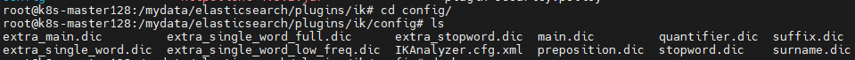


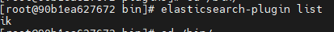

### 5.4.2 测试分词器

测试ik_smart分词器:

```json
POST _analyze
{ 
  "analyzer": "ik_smart", 
  "text": "我是中国人"
}
```

分词效果：

```json
{
  "tokens" : [
    {
      "token" : "我",
      "start_offset" : 0,
      "end_offset" : 1,
      "type" : "CN_CHAR",
      "position" : 0
    },
    {
      "token" : "是",
      "start_offset" : 1,
      "end_offset" : 2,
      "type" : "CN_CHAR",
      "position" : 1
    },
    {
      "token" : "中国人",
      "start_offset" : 2,
      "end_offset" : 5,
      "type" : "CN_WORD",
      "position" : 2
    }
  ]
}
```

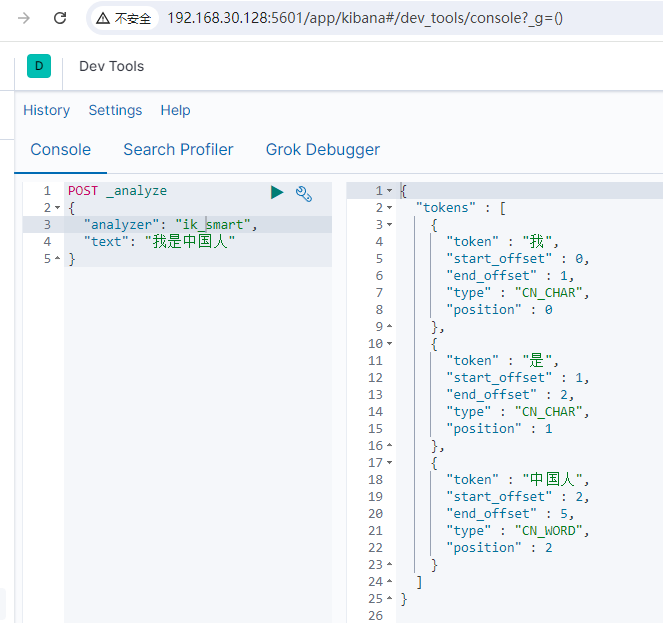

测试ik_max_word分词器:

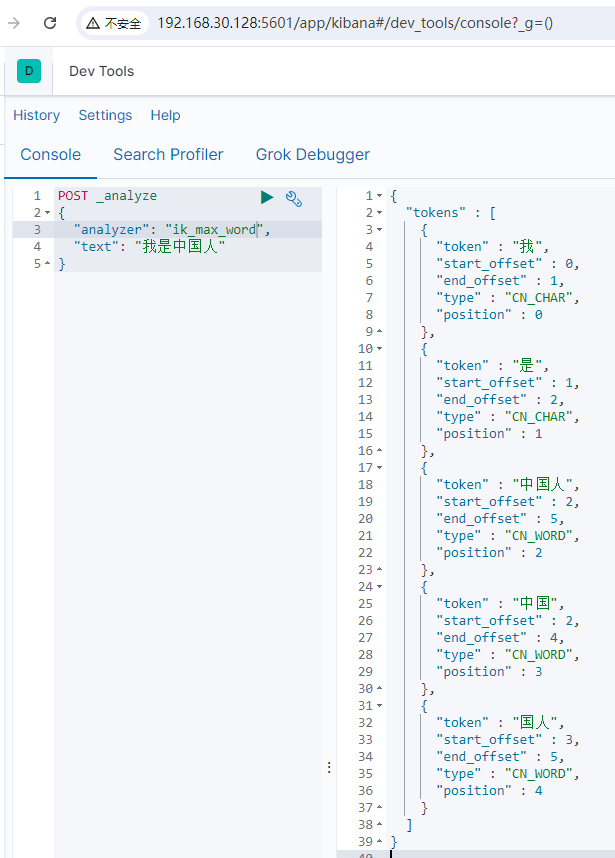

### 5.4.3 自定义词库

#### 5.4.3.1 安装nginx容器

创建nginx容器:

```bash
docker run -p 80:80 --name nginx -d  nginx:1.10
cd /mydata/
 # nginx相关全部放在/mydata/nginx
docker container cp nginx:/etc/nginx . #将容器内相关配置拷贝到宿主机/mydata/nginx下
cp -r nginx/ conf #改名conf
rm -rf nginx/* #删除原来的
mv conf/ nginx/ #移到nginx
```

最终：

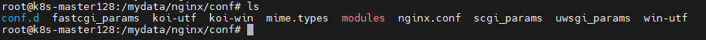

```bash
#移除原来的容器
docker stop nginx
docker rm nginx
#重新创建
docker run -p 80:80 --name nginx -v /mydata/nginx/html:/usr/share/nginx/html -v /mydata/nginx/logs:/var/log/nginx -v /mydata/nginx/conf:/etc/nginx -d nginx:1.10 
#进html路径编写测试页面
cd /mydata/nginx/html
vi index.html
#加入如下内容，保存
<h1>gulimall</h1>
```

访问80端口：


```bash
mkdir es #es相关放在/mydata/nginx/html/es下
vi fenci.txt #自定义词库，加入下面两个单词保存
尚硅谷
乔碧罗
```

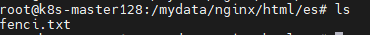

直接页面访问（乱码先不管）：http://192.168.30.128/es/fenci.txt

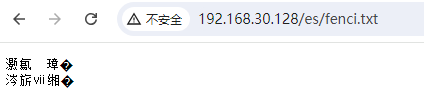

#### 5.4.3.2 修改ik分词器配置

词库位置

```bash
cd /mydata/elasticsearch/plugins/ik/config
vi IKAnalyzer.cfg.xml  #修改配置
docker restart ...  #重启es容器
```

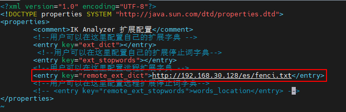

#### 5.4.3.3 测试自定义词库

可以识别"乔碧罗"

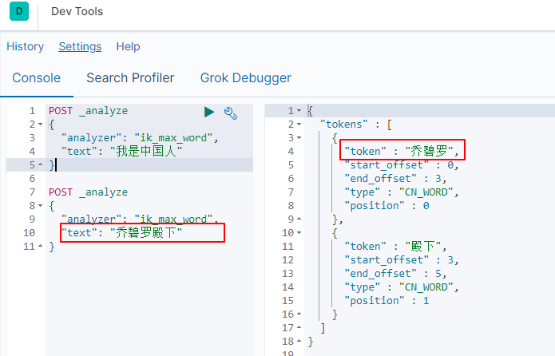


# 6. 聚合分析

聚合分析(aggregations)：对命中的数据（hits）进行分析或汇总归纳。

下图是按品牌和分类ID进行聚合，共两种品牌（华为、苹果），同时使用子聚合取出品牌名字

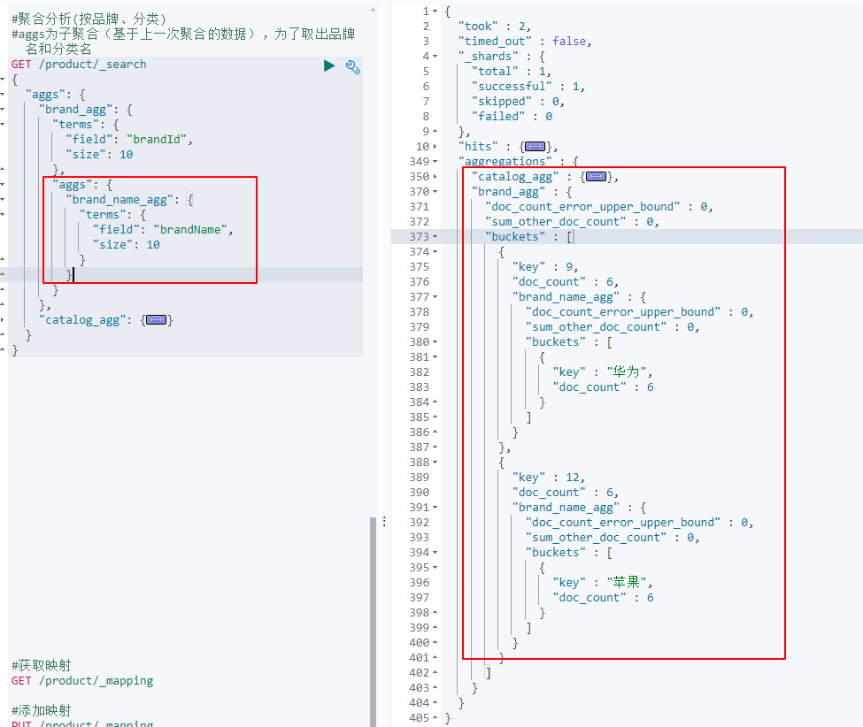


# 7. SpringBoot整合ES

Elasticsearch-Rest-Client

操作9200端口：HTTP

- RestTemplate：模拟发 HTTP 请求，ES 很多操作需要自己封装，麻烦 
- HttpClient：同上 
- **<font color=red>Elasticsearch-Rest-Client</font>**：官方 RestClient，封装了 ES 操作，API 层次分明，上手简单 最终选择 。参考文档： https://www.elastic.co/guide/en/elasticsearch/client/java-rest/current/java-rest-high.html

## 7.1 引入依赖

参考上面的官方文档即可：版本改成自己装的es版本

```xml
#版本控制，不然受spring boot管控（与es有一一对应关系）
<properties>
	<elasticsearch.version>7.4.2</elasticsearch.version>
</properties>

<dependency>
    <groupId>org.elasticsearch.client</groupId>
    <artifactId>elasticsearch-rest-high-level-client</artifactId>
    <version>7.4.2</version>
</dependency>

<dependency>
    <groupId>org.elasticsearch</groupId>
    <artifactId>elasticsearch</artifactId>
    <version>7.4.2</version>
</dependency>
<dependency>
    <groupId>org.elasticsearch.client</groupId>
    <artifactId>elasticsearch-rest-client</artifactId>
    <version>7.4.2</version>
</dependency>
```

springboot与es版本有对应关系，要用自己的版本需手动覆盖

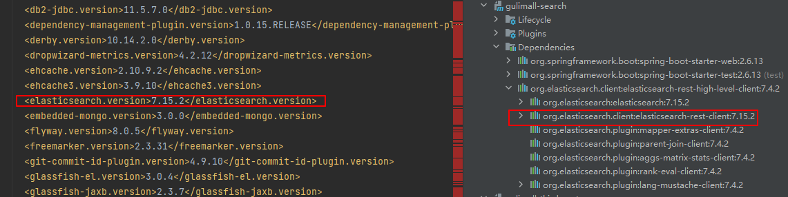


## 7.2 配置

```java
@Configuration
public class ElasticSearchConfig {
    @Bean
    public RestHighLevelClient restHighLevelClient(){
        RestHighLevelClient client = new RestHighLevelClient(
                RestClient.builder(
                        new HttpHost("192.168.30.128", 9200, "http")/*,
                        // 可以配多个（ES集群）
                        new HttpHost("localhost", 9201, "http")*/
                ));
        return client;
    }
}
```

## 7.3 测试

```java
@SpringBootTest(classes = GulimallSearchApplication.class)
public class GulimallSearchApplicationTests {
    @Autowired
    RestHighLevelClient restHighLevelClient;
    @Test
    public void contextLoads() {
        System.out.println(restHighLevelClient);
    }

}
```

一切API都可查官方文档：

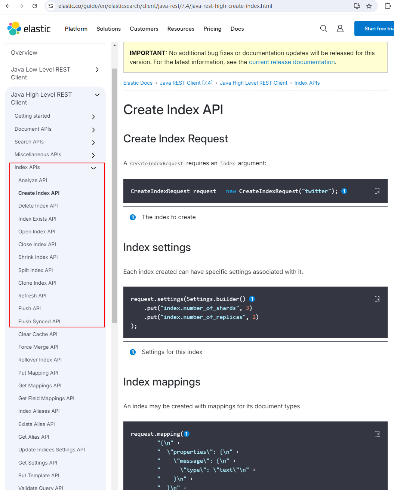

### 7.3.1 保存数据到ES

```java
@Slf4j
@SpringBootTest(classes = GulimallSearchApplication.class)
public class GulimallSearchApplicationTests {
    @Autowired
    RestHighLevelClient restHighLevelClient;
    /**
     * @description: 测试存储数据到ES
     **/
    @Test
    public void indexData() throws IOException {
        IndexRequest indexRequest=new IndexRequest("user");
        indexRequest.id("2");  // 数据所在 id
        /**
         *方式1
         indexRequest.source("userName","zhangsan","age",18,"gender","男");  // K-V键值对
         **/

        /**
         *方式2： 直接传对象json字符串
         **/
        User user=new User();
        user.setUserName("zhangsan").setAge(18).setGender("男");
        indexRequest.source(JSON.toJSONString(user), XContentType.JSON);
        IndexResponse indexResponse=restHighLevelClient.index(indexRequest, ElasticSearchConfig.COMMON_OPTIONS);
        log.info("响应数据:{}",JSON.toJSONString(indexResponse));
    }

    @Accessors(chain = true)
    @Data
    public static class User{
        private String userName;
        private Integer age;
        private String gender;
    }
}
```

查询user下的数据：

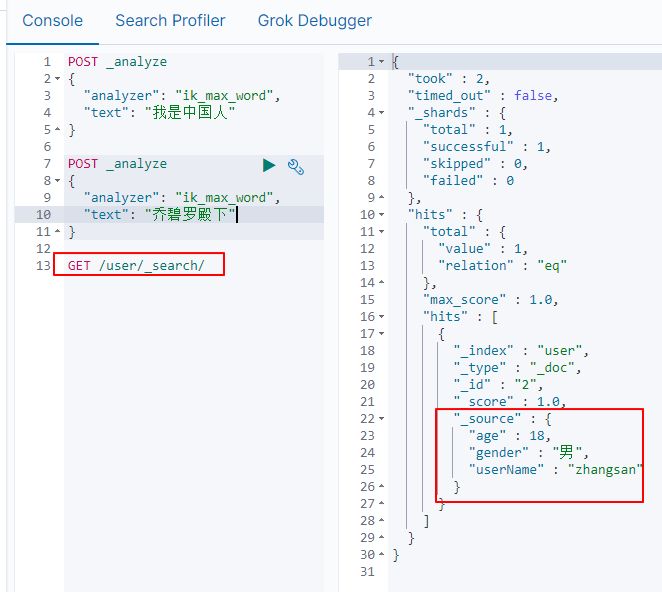

### 7.3.2 其他简单增删改

参照文档

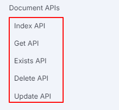

### 7.3.3 复杂检索

参考：

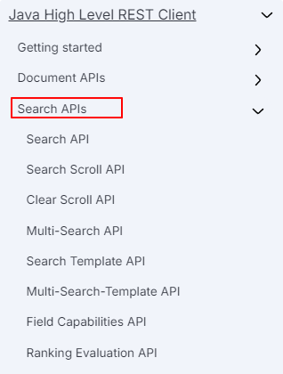


## 7.4 创建索引时指定映射

参考：https://www.elastic.co/guide/en/elasticsearch/client/java-rest/7.4/java-rest-high-create-index.html

```java
@Slf4j
@Service
public class ProductSaveServiceImpl implements ProductSaveService {
    @Autowired
    RestHighLevelClient restHighLevelClient;

    /**
     * 主程序启动默认执行：创建索引及映射
     **/
    @PostConstruct
    public void createIndexAndMapping() throws IOException {
        // 1.给es中建立索引: product,并建立映射关系 gulimall-search/src/main/resources/product-mapping.txt
        // 注意CreateIndexRequest导包，需为org.elasticsearch.client.indices.CreateIndexRequest;否则报错
        org.elasticsearch.client.indices.CreateIndexRequest request = new CreateIndexRequest(EsContant.PRODUCT_INDEX);
        request.mapping("{\n" +
                "    \"properties\": {\n" +
                "      \"skuId\": {\n" +
                "        \"type\": \"long\"\n" +
                "      },\n" +
                "      \"spuId\": {\n" +
                "        \"type\": \"keyword\"\n" +
                "      },\n" +
                "      \"skuTitle\": {\n" +
                "        \"type\": \"text\",\n" +
                "        \"analyzer\": \"ik_smart\"\n" +
                "      },\n" +
                "      \"skuPrice\": {\n" +
                "        \"type\": \"keyword\"\n" +
                "      },\n" +
                "      \"skuImg\": {\n" +
                "        \"type\": \"keyword\"\n" +
                "      },\n" +
                "      \"saleCount\": {\n" +
                "        \"type\": \"long\"\n" +
                "      },\n" +
                "      \"hasStock\": {\n" +
                "        \"type\": \"boolean\"\n" +
                "      },\n" +
                "      \"hotScore\": {\n" +
                "        \"type\": \"long\"\n" +
                "      },\n" +
                "      \"brandId\": {\n" +
                "        \"type\": \"long\"\n" +
                "      },\n" +
                "      \"catalogId\": {\n" +
                "        \"type\": \"long\"\n" +
                "      },\n" +
                "      \"brandName\": {\n" +
                "        \"type\": \"keyword\"\n" +
                "      },\n" +
                "      \"brandImg\": {\n" +
                "        \"type\": \"keyword\"\n" +
                "      },\n" +
                "      \"catalogName\": {\n" +
                "        \"type\": \"keyword\"\n" +
                "      },\n" +
                "      \"attrs\": {\n" +
                "        \"type\": \"nested\",\n" +
                "        \"properties\": {\n" +
                "          \"attrId\": {\n" +
                "            \"type\": \"long\"\n" +
                "          },\n" +
                "          \"attrName\": {\n" +
                "            \"type\": \"keyword\"\n" +
                "          },\n" +
                "          \"attrValue\": {\n" +
                "            \"type\": \"keyword\"\n" +
                "          }\n" +
                "        }\n" +
                "      }\n" +
                "    }\n" +
                "  }",XContentType.JSON);
        try {
            restHighLevelClient.indices().create(request, RequestOptions.DEFAULT);
        }catch (Exception e){
            log.error("ES初始化创建失败，mapping已存在请先删除: 发送请求 DELETE /{}",EsContant.PRODUCT_INDEX);
        }
    }
}
```


## 7.4 执行检索

以商城首页检索服务为例：

```java
@Slf4j
@Service
public class MallSearchServiceImpl implements MallSearchService {
    @Autowired
    private RestHighLevelClient restHighLevelClient;
    @Override
    public SearchResult search(SearchParam searchParam) throws IOException {
        // 去ES中查询
        SearchResult searchResult=null;
        // 1.构造DSL查询条件 ，根据 gulimall-search/src/main/resources/DSL.json
        SearchRequest searchRequest=buildSearchRequest(searchParam);
        try{
            // 2.执行检索请求
            SearchResponse searchResponse=restHighLevelClient.search(searchRequest, ElasticSearchConfig.COMMON_OPTIONS);
            // 3. 分析响应数据并封装成所需格式
            searchResult=buildSearchResult(searchResponse,searchParam);
        }catch (Exception e){
            log.error("从ES中检索数据发生异常,searchParam:{},Exception:{}",JSON.toJSONString(searchParam),JSON.toJSONString(e));
        }
        return searchResult;
    }
```


DSL查询语句：

```json
{
  "query": {
    "bool": {
      "must": [
        {
          "match": {
            "skuTitle": "华为" 
          }
        }
      ],
      "filter": [
        {
        "term": {
          "catalogId": "225"
        }
      },
        {
        "terms": {
          "brandId": [
            "9",
            "12"
          ]
        }
      },
        {
        "nested": {
          "path": "attrs",
          "query": {
            "bool": {
              "must": [
                {
                  "term": {
                    "attrs.attrId": {
                      "value": "15"
                    }
                  }
                },
                {
                  "terms": {
                    "attrs.attrValue": [
                      "HUAWEI Kirin 980",
                      "海思（Hisilicon）"
                    ]
                  }
                }
              ]
            }
          }
        }
      },
        {
        "term": {
          "hasStock": "true"
        }
      },
        {
          "range": {
          "skuPrice": {
            "gte": 5000,
            "lte": 8000
          }
        }
        }
      ]
    }
  },
  "sort": [
    {
      "skuPrice": {
        "order": "desc"
      }
    }
  ],
  "from": 0,
  "size": 1,
  "highlight": {
    "fields": {
      "skuTitle":{}
    },  
    "pre_tags": "<b style='color:red'>",
    "post_tags": "</b>"
    
  },
  "aggs": {
    "brand_agg": {
      "terms": {
        "field": "brandId",
        "size": 10
      },
      "aggs": {
        "brand_name_agg": {
          "terms": {
            "field": "brandName",
            "size": 10
          }
        },
        "brand_img_agg": {
          "terms": {
            "field": "brandImg",
            "size": 10
          }
        }
      }
    },
    "catalog_agg": {
      "terms": {
        "field": "catalogId",
        "size": 10
      },
      "aggs": {
        "catalog_name_agg": {
          "terms": {
            "field": "catalogName",
            "size": 10
          }
        }
      }
    },
    "attr_agg": {
      "nested":{
          "path":"attrs"
        },
      "aggs": {
        "attr_id__agg": {
          "terms": {
            "field": "attrs.attrId",
            "size": 10
          },
          "aggs": {
            "attr_name_agg": {
              "terms": {
                "field": "attrs.attrName",
                "size": 10
              }
            },
            "attr_value_agg": {
              "terms": {
                "field": "attrs.attrValue",
                "size": 10
              }
            }
          }
        }
      }
    }
  }
}
```


封装请求数据：

```java
 /**
     * @description: 构建检索请求
     **/
    private SearchRequest buildSearchRequest(SearchParam searchParam) {
        /**
         * 1.构建DSL语句
         **/
        SearchSourceBuilder searchSourceBuilder=new SearchSourceBuilder();
        /**
         *  1.1 模糊匹配，过滤（按属性、分类、品牌、价格区间、库存）
         **/

        // 1.1.1 构建bool-query
        // must-模糊匹配
        BoolQueryBuilder boolQueryBuilder= QueryBuilders.boolQuery();
        if(searchParam!=null&&!StringUtils.isEmpty(searchParam.getKeyword())){
            boolQueryBuilder.must(QueryBuilders.matchQuery("skuTitle",searchParam.getKeyword()));
        }

        // 1.1.2 bool -filter  按三级分类ID查
        if(searchParam.getCatalog3Id()!=null){
            boolQueryBuilder.filter(QueryBuilders.termQuery("catalogId",searchParam.getCatalog3Id()));
        }

        // 1.1.2 bool -filter  按品牌ID列表查
        if(searchParam.getBrandId()!=null&&!searchParam.getBrandId().isEmpty()){
            boolQueryBuilder.filter(QueryBuilders.termsQuery("brandId",searchParam.getBrandId()));
        }

        // 1.1.3 bool -filter  按所有指定的属性查
        if(searchParam.getAttrs()!=null&&!searchParam.getAttrs().isEmpty()){
            // attrs=1_5寸:8寸&attrs=2_16G:8G
            for (String attrStr:searchParam.getAttrs()){
                BoolQueryBuilder nestboolQueryBuilder=QueryBuilders.boolQuery();
                String[] s=attrStr.split("_");
                String attrId=s[0]; //检索用的属性Id
                String[] attrValue=s[1].split(":"); // 该属性用的值
                nestboolQueryBuilder.must(QueryBuilders.termQuery("attrs.attrId",attrId));
                nestboolQueryBuilder.must(QueryBuilders.termsQuery("attrs.attrValue",attrValue));
                // 每个属性都要加入外部大boolQueryBuilder
                //嵌入式Query  ScoreMode.None不参与评分
                NestedQueryBuilder nestedQueryBuilder =QueryBuilders.nestedQuery("attrs",nestboolQueryBuilder, ScoreMode.None);
                boolQueryBuilder.filter(nestedQueryBuilder);
            }

        }

        // 1.1.4 bool -filter  按是否有库存查
        if(searchParam.getHasStock()!=null){
            boolQueryBuilder.filter(QueryBuilders.termQuery("hasStock",searchParam.getHasStock()==1));
        }

        // 1.1.5 bool -filter  按价格区间查
        if(searchParam.getSkuPrice()!=null&&!StringUtils.isEmpty(searchParam.getSkuPrice())){
            /** 1_500/_500/500_
             * "range": {
             *             "skuPrice": {
             *               "gte": 5000,
             *               "lte": 8000
             *             }
             *           }
             **/
            RangeQueryBuilder rangeQueryBuilder= QueryBuilders.rangeQuery("skuPrice");
            String[] s=searchParam.getSkuPrice().split("_");
            if(searchParam.getSkuPrice().startsWith("_")){ // 小于等于
                rangeQueryBuilder.lte(s[0]);
            }else if(searchParam.getSkuPrice().endsWith("_")){  // 大于等于
                rangeQueryBuilder.gte(s[0]);
            }else{ // 区间
                rangeQueryBuilder.gte(s[0]).lte(s[1]);
            }
            boolQueryBuilder.filter(rangeQueryBuilder);
        }

        // 整个大boolQueryBuilder放入searchSourceBuilder
        searchSourceBuilder.query(boolQueryBuilder);

        /**
         * 1.2 排序 分页 高亮
         **/

        /**
         * 1.2.1 排序
         *
         *      * 排序条件
         *      * sort=saleCount_asc/desc  销量
         *      * sort=skuPrice_asc/desc   价格
         *      * sort=hotScore_asc/desc   热度
         *
         **/
        if(searchParam.getSort()!=null&&!StringUtils.isEmpty(searchParam.getSort())){
            String sort=searchParam.getSort();
            String[] s=sort.split("_");
            SortOrder order=s[1].equalsIgnoreCase("asc")?SortOrder.ASC:SortOrder.DESC;
            searchSourceBuilder.sort(s[0], order);
        }

        /**
         * 1.2.2 分页
         * pageNum:1  from=0 pageSize:5  [0,1,2,3,4]
         * pageNum:2  from=5 pageSize:5  [5,6,7,8,9]
         **/
        searchSourceBuilder.from((searchParam.getPageNum()-1)*EsContant.PRODUCT_PAGE_SIZE);
        searchSourceBuilder.size(EsContant.PRODUCT_PAGE_SIZE);

        /**1.2.3 高亮
         **/
        if(searchParam.getKeyword()!=null&&!StringUtils.isEmpty(searchParam.getKeyword())){
            HighlightBuilder highlightBuilder=new HighlightBuilder();
            highlightBuilder.field("skuTitle");
            highlightBuilder.preTags("<b style='color:red'>");
            highlightBuilder.postTags("</b>");
            searchSourceBuilder.highlighter(highlightBuilder);

        }


        /**
         * 1.3 聚合分析
         **/
        // 1.3.1 品牌聚合
        TermsAggregationBuilder brandAgg= AggregationBuilders.terms("brand_agg").field("brandId").size(50);
        // 品牌聚合的子聚合
        brandAgg.subAggregation(AggregationBuilders.terms("brand_name_agg").field("brandName").size(1));
        brandAgg.subAggregation(AggregationBuilders.terms("brand_img_agg").field("brandImg").size(1));
        searchSourceBuilder.aggregation(brandAgg);

        // 1.3.2 分类聚合
        TermsAggregationBuilder catalogAgg= AggregationBuilders.terms("catalog_agg").field("catalogId").size(20);
        // 分类聚合的子聚合
        catalogAgg.subAggregation(AggregationBuilders.terms("catalog_name_agg").field("catalogName").size(1));
        searchSourceBuilder.aggregation(catalogAgg);

        // 1.3.3 属性聚合
        NestedAggregationBuilder attrAgg= AggregationBuilders.nested("attr_agg","attrs");
        TermsAggregationBuilder attrIdAgg=AggregationBuilders.terms("attr_id_agg").field("attrs.attrId");
        attrIdAgg.subAggregation(AggregationBuilders.terms("attr_name_agg").field("attrs.attrName").size(1));
        attrIdAgg.subAggregation(AggregationBuilders.terms("attr_value_agg").field("attrs.attrValue").size(50));
        attrAgg.subAggregation(attrIdAgg);
        searchSourceBuilder.aggregation(attrAgg);
        // 测试：验证代码正确定，放到kibina中执行
        log.info("构建的DSL：{}",searchSourceBuilder);
        SearchRequest searchRequest=new SearchRequest(new String[]{EsContant.PRODUCT_INDEX},searchSourceBuilder);
        return searchRequest;
    }
```


解析响应数据：

```java
 /**
     * @description: 封装结果数据
     * @param:
     * @param searchResponse
     * @return: com.atguigu.search.vo.SearchResult
     **/
    private SearchResult buildSearchResult(SearchResponse searchResponse,SearchParam searchParam) {
        SearchResult result=new SearchResult();
        /**
         * 1. 所有查询到的商品信息
         **/
        SearchHits hits=searchResponse.getHits(); //获取查询命中的所有数据
        List<SkuEsModel> skuEsModels=new ArrayList<>();
        if(hits!=null&&hits.getHits().length>0){
            for(SearchHit hit: hits.getHits()){
                String sourceAsString=hit.getSourceAsString();
                SkuEsModel skuEsModel= JSON.parseObject(sourceAsString,SkuEsModel.class);
                // 设置高亮
                if(searchParam.getKeyword()!=null&&!StringUtils.isEmpty(searchParam.getKeyword())){
                    HighlightField skuTitle=hit.getHighlightFields().get("skuTitle");
                    String  s=skuTitle.getFragments()[0].string();
                    skuEsModel.setSkuTitle(s);
                }
                skuEsModels.add(skuEsModel);
            }
        }
        result.setProducts(skuEsModels);
        /**
         * 2. 所有查询到的商品涉及的属性信息
         **/
        List<SearchResult.AttrVo> attrVos=new ArrayList<>();
        ParsedNested attAgg=searchResponse.getAggregations().get("attr_agg");
        ParsedLongTerms attrIdAgg=attAgg.getAggregations().get("attr_id_agg");
        for(Terms.Bucket bucket:attrIdAgg.getBuckets()){
            SearchResult.AttrVo  attrVo=new SearchResult.AttrVo();
            // 属性Id
            long attrId=bucket.getKeyAsNumber().longValue();
            // 属性名
            String attrName=((ParsedStringTerms)bucket.getAggregations().get("attr_name_agg")).getBuckets().get(0).getKeyAsString();
            // 属性值
            List<String> attrValues=((ParsedStringTerms)bucket.getAggregations().get("attr_value_agg")).getBuckets().stream().map(item -> {
                return ((Terms.Bucket)item).getKeyAsString();
            }).collect(Collectors.toList());
            attrVo.setAttrId(attrId);
            attrVo.setAttrName(attrName);
            attrVo.setAttrValue(attrValues);
            attrVos.add(attrVo);
        }
        result.setAttrs(attrVos);


        /**
         * 3. 所有涉及到的品牌信息
         **/
        ParsedLongTerms brandAgg=searchResponse.getAggregations().get("brand_agg");
        List<SearchResult.BrandVo> brandVos=new ArrayList<>();
        List<? extends Terms.Bucket> brandBuckets=brandAgg.getBuckets();
        for(Terms.Bucket bucket: brandBuckets){
            SearchResult.BrandVo brandVo=new SearchResult.BrandVo();
            // 品牌ID
            String keyAsString=bucket.getKeyAsString();
            brandVo.setBrandId(Long.parseLong(keyAsString));
            // 拿到品牌名
            ParsedStringTerms brandNameAgg=bucket.getAggregations().get("brand_name_agg");
            brandVo.setBrandName(brandNameAgg.getBuckets().get(0).getKeyAsString());
            // 拿到品牌图片
            ParsedStringTerms brandImgAgg=bucket.getAggregations().get("brand_img_agg");
            brandVo.setBrandImg(brandImgAgg.getBuckets().get(0).getKeyAsString());
            brandVos.add(brandVo);
        }
        result.setBrands(brandVos);

        /**
         * 4. 所有涉及到的分类信息
         **/
        ParsedLongTerms catalogAgg=searchResponse.getAggregations().get("catalog_agg");
        List<SearchResult.CatalogVo> catalogVos=new ArrayList<>();
        List<? extends Terms.Bucket> catalogBuckets=catalogAgg.getBuckets();
        for(Terms.Bucket bucket: catalogBuckets){
            SearchResult.CatalogVo catalogVo=new SearchResult.CatalogVo();
            // 分类ID
            String keyAsString=bucket.getKeyAsString();
            catalogVo.setCatalogId(Long.parseLong(keyAsString));
            // 拿到分类名
            ParsedStringTerms catalogNameAgg=bucket.getAggregations().get("catalog_name_agg");
            catalogVo.setCatalogName(catalogNameAgg.getBuckets().get(0).getKeyAsString());
            catalogVos.add(catalogVo);
        }
        result.setCatalogs(catalogVos);

        /**
         * 5.分页信息-页码
         **/
        result.setPageNum(searchParam.getPageNum()); // 当前页码
        long total=hits.getTotalHits().value;
        result.setTotal(total); // 总记录数
        long totalPages=total%EsContant.PRODUCT_PAGE_SIZE==0? total/EsContant.PRODUCT_PAGE_SIZE:(total/EsContant.PRODUCT_PAGE_SIZE+1);
        result.setTotalPages((int)totalPages); // 总分页数
        List<Integer> pageNavs=new ArrayList<>();
        for(int i=1;i<=totalPages;i++){
            pageNavs.add(i);
        }
        result.setPageNavs(pageNavs);   //导航页
        return result;
    }
```

