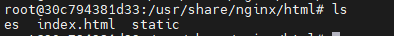
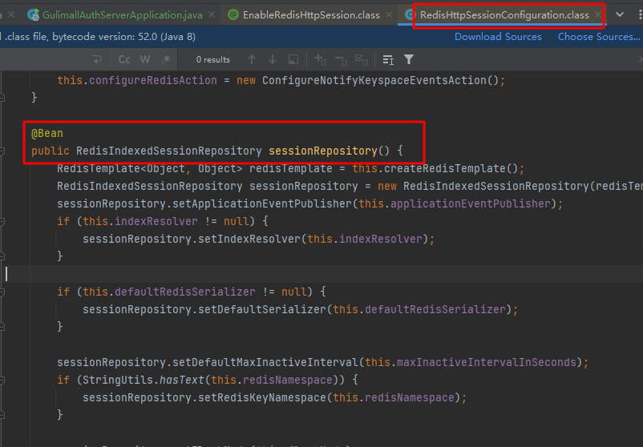

[toc]


# 1. 商品（SPU）上架-信息写入ES

主要事项：

- 封装需要存入ES的数据模型
- 将数据存入ES，方便检索

## 1.1 ES中的数据模型

商品上架时存入ES的数据模型：

```java
/**
* @Description sku上架在ES里保存的数据模型
**/
@Data
public class SkuEsModel {
    /**
     * sku Id
     **/
    private Long skuId;
    /**
     * 所属spu Id
     **/
    private Long spuId;
    /**
     * 商品标题
     **/
    private String skuTitle;
    /**
     * 商品价格
     **/
    private BigDecimal skuPrice;
    /**
     * sku图片集
     **/
    private String skuImg;
    /**
     * sku 销量
     **/
    private Long saleCount;
    /**
     * 是否有库存
     **/
    private Boolean hasStock;
    /**
     * 热度评分
     **/
    private Long hotScore;
    /**
     * 品牌Id
     **/
    private Long brandId;
    /**
     * 分类Id
     **/
    private Long catalogId;
    /**
     * 分类名
     **/
    private String catalogName;
    /**
     * 品牌名
     **/
    private String brandName;
    /**
     * 品牌图片
     **/
    private String brandImg;
    /**
     * 分类图片
     **/
    private String catalogImg;
    private List<Attr> attrs;
    @Data
    public static class Attr{
        /**
         * 属性id
         */
        private Long attrId;
        /**
         * 属性名
         */
        private String attrName;
        /**
         * 属性值
         */
        private String attrValue;
    }
}
```


## 1.2 商品服务（gulimall-product）

调gulimall-search服务将数据写入ES方便检索，同时更改spu上架状态。

com.atguigu.product.service.impl.SpuInfoServiceImpl#up

```java
 @Override
    public void up(Long spuId) {
        
        // 1.查询当前sku所有用来检索的规格属性-共一个spu
        List<ProductAttrValueEntity> productAttrValueEntities=productAttrValueService.getSearchAttrs(spuId);
        List<SkuEsModel.Attr> searchAttrs=productAttrValueEntities.stream().map(productAttrValueEntity -> {
            SkuEsModel.Attr attr=new SkuEsModel.Attr();
            BeanUtils.copyProperties(productAttrValueEntity,attr);
            return attr;
        }).collect(Collectors.toList());

        // 2.查出当前spuId对应的所有sku
        List<SkuInfoEntity> skus=skuInfoDao.selectList(new QueryWrapper<SkuInfoEntity>().eq("spu_id",spuId));
        List<Long> skuIds=new ArrayList<>();
        if(skus!=null){
            skuIds=skus.stream().map(SkuInfoEntity::getSkuId).collect(Collectors.toList());
        }

        Map<Long,Boolean> stockMap=null;
        try {
            // 3.远程调用库存系统查出是否有库存
            Result<List<SkuHasStockVo>> hasStock=wareFeignService.getSkuHasStock(skuIds);
            stockMap=hasStock.getData().stream().collect(Collectors.toMap(SkuHasStockVo::getSkuId,SkuHasStockVo::getHasStock));
        }catch (Exception e){
            log.error("远程调用库存服务出现异常，异常原因：{}",e);
        }
        Map<Long, Boolean> finalStockMap = stockMap;
       
        // 4.组装数据
        List<SkuEsModel> skuEsModels=skus.stream().map(sku->{
            SkuEsModel skuEsModel=new SkuEsModel();
            BeanUtils.copyProperties(sku,skuEsModel);
            // skuPrice ,skuImg
            skuEsModel.setSkuPrice(sku.getPrice());
            skuEsModel.setSkuImg(sku.getSkuDefaultImg());
            // hasStock , hotScore
            if(finalStockMap ==null){
                // TODO 后面再处理
                skuEsModel.setHasStock(true); // 调用远程服务出现异常直接置为有库存
            }else{
                skuEsModel.setHasStock(finalStockMap.get(sku.getSkuId()));
            }

            // 热度评分， 初始置0
            skuEsModel.setHotScore(0L);

            // 查询品牌和分类的信息
            BrandEntity brandEntity=brandDao.selectById(sku.getBrandId());
            if(brandEntity!=null){
                skuEsModel.setBrandName(brandEntity.getName());
                skuEsModel.setBrandImg(brandEntity.getLogo());
            }
            CategoryEntity category=categoryDao.selectById(sku.getCatalogId());
            if(category!=null){
                skuEsModel.setCatalogName(category.getName());
            }
            // 设置检索属性
            skuEsModel.setAttrs(searchAttrs);
            return skuEsModel;
        }).collect(Collectors.toList());
        
        // 5. 将数据发送给gulimall-search服务并保存到ES
        Result result=searchFeignService.productStartUp(skuEsModels);
        
        if(result.getCode()==0){ // 远程调用成功
            // 6. 修改spu发布状态
            SpuInfoEntity spuInfoEntity=new SpuInfoEntity();
            spuInfoEntity.setId(spuId);
            spuInfoEntity.setPublishStatus(PublishStatusEnum.UP.getCode());
            spuInfoEntity.setUpdateTime(new Date());
            getBaseMapper().updateById(spuInfoEntity);
        }else{
            // 远程调用失败
            // TODO 重复调用？ 接口幂等性 重试机制
        }
    }
```


## 1.3 检索服务（gulimall-search）

接收gulimall-product发送过来的数据并保存到ES  

/search/product/up

```java
public class ProductSaveServiceImpl implements ProductSaveService {
    @Autowired
    RestHighLevelClient restHighLevelClient;

    /**
     * 主程序启动默认执行：创建索引及映射
     **/
    @PostConstruct
    public void createIndexAndMapping() throws IOException {
        // 1.给es中建立索引: product,并建立映射关系 gulimall-search/src/main/resources/product-mapping.txt
        // 注意CreateIndexRequest导包，需为org.elasticsearch.client.indices.CreateIndexRequest;否则报错
        org.elasticsearch.client.indices.CreateIndexRequest request = new CreateIndexRequest(EsContant.PRODUCT_INDEX);
        request.mapping("{\n" +
                "    \"properties\": {\n" +
                "      \"skuId\": {\n" +
                "        \"type\": \"long\"\n" +
                "      },\n" +
                "      \"spuId\": {\n" +
                "        \"type\": \"keyword\"\n" +
                "      },\n" +
                "      \"skuTitle\": {\n" +
                "        \"type\": \"text\",\n" +
                "        \"analyzer\": \"ik_smart\"\n" +
                "      },\n" +
                "      \"skuPrice\": {\n" +
                "        \"type\": \"keyword\"\n" +
                "      },\n" +
                "      \"skuImg\": {\n" +
                "        \"type\": \"keyword\"\n" +
                "      },\n" +
                "      \"saleCount\": {\n" +
                "        \"type\": \"long\"\n" +
                "      },\n" +
                "      \"hasStock\": {\n" +
                "        \"type\": \"boolean\"\n" +
                "      },\n" +
                "      \"hotScore\": {\n" +
                "        \"type\": \"long\"\n" +
                "      },\n" +
                "      \"brandId\": {\n" +
                "        \"type\": \"long\"\n" +
                "      },\n" +
                "      \"catalogId\": {\n" +
                "        \"type\": \"long\"\n" +
                "      },\n" +
                "      \"brandName\": {\n" +
                "        \"type\": \"keyword\"\n" +
                "      },\n" +
                "      \"brandImg\": {\n" +
                "        \"type\": \"keyword\"\n" +
                "      },\n" +
                "      \"catalogName\": {\n" +
                "        \"type\": \"keyword\"\n" +
                "      },\n" +
                "      \"attrs\": {\n" +
                "        \"type\": \"nested\",\n" +
                "        \"properties\": {\n" +
                "          \"attrId\": {\n" +
                "            \"type\": \"long\"\n" +
                "          },\n" +
                "          \"attrName\": {\n" +
                "            \"type\": \"keyword\"\n" +
                "          },\n" +
                "          \"attrValue\": {\n" +
                "            \"type\": \"keyword\"\n" +
                "          }\n" +
                "        }\n" +
                "      }\n" +
                "    }\n" +
                "  }",XContentType.JSON);
        try {
            restHighLevelClient.indices().create(request, RequestOptions.DEFAULT);
        }catch (Exception e){
            log.error("ES初始化创建失败，mapping已存在请先删除: 发送请求 DELETE /{}",EsContant.PRODUCT_INDEX);
        }
    }
    
    @Override
    public boolean productStartUp(List<SkuEsModel> skuEsModels) throws IOException {
        // 保存到ES
        // 1.给es中建立索引（createIndexAndMapping方法）: product,并建立映射关系 gulimall-search/src/main/resources/product-mapping.txt

        // 2.构造批量请求
        BulkRequest bulkRequest=new BulkRequest();
        for(SkuEsModel skuEsModel:skuEsModels){
            IndexRequest indexRequest=new IndexRequest(EsContant.PRODUCT_INDEX); // 指定索引

            indexRequest.id(skuEsModel.getSkuId().toString()); // Document id设为skuId,防止不断添加数据，skuId相同则覆盖
            String s= JSON.toJSONString(skuEsModel);
            indexRequest.source(s, XContentType.JSON);
            bulkRequest.add(indexRequest);
        }

        // 2. 保存到ES 批量保存
        BulkResponse bulkResponse =restHighLevelClient.bulk(bulkRequest, ElasticSearchConfig.COMMON_OPTIONS);
        // TODO 3.上架出错处理 先用日志简单记录
        boolean error=bulkResponse.hasFailures();
        if (error){
            List<String> collect=Arrays.stream(bulkResponse.getItems()).map(BulkItemResponse::getId).collect(Collectors.toList());
            log.error("商品上架错误:{}",collect);
        }
        return !error;
    }
}

```

## 1.4 效果

SPU上架完成后：发GET请求可以从ES中查到索引为product下的数据，即保存成功。


# 2.动静分离-搭建商城首页环境

## 2.1 Thymeleaf模板引擎

分担访问压力:  页面中的静态资源直接放在nginx，网关做统一鉴权认证等服务，需要经过服务器处理的动态请求才过网关并路由到具体的微服务。


引入thymeleaf模板引擎依赖:

```xml
<!--thymeleaf模板引擎-->
<dependency>
    <groupId>org.springframework.boot</groupId>
    <artifactId>spring-boot-starter-thymeleaf</artifactId>
</dependency>
```


将资料中：首页资源的index文件夹复制到gulimall-product模块static路径下（静态资源）


再将index.html复制到resources/templates下（没有新建一个）：访问端口时默认会找index.html


配置application.yml：

```yaml
spring:
  thymeleaf:
    cache: false #关闭thymeleaf缓存，方便开发期间看到实时效果
```


之后所有和页面相关的都放web下：


重启product服务，访问10000端口即可看到首页：


## 2.2 前端获取实时一、二、三级分类数据

页面跳转和页面渲染出实时的一级分类数据：

（1）配置访问http://localhost:10000/index.html 和http://localhost:10000都跳转到index.html页面

```java
@Controller
public class IndexWebController {
    @Autowired
    CategoryService categoryService;
    /**
     * @description: 配置转发： 访问http://localhost:10000/index.html 和http://localhost:10000都跳转到index.html页面
     * @param:
     * @param model
     * @return: java.lang.String
     **/
    @GetMapping({"/","/index.html"})
    public String indexPage(Model model){
        // 1.查出所有的一级分类
        List<CategoryEntity> categoryEntities=categoryService.getLevelOneCategories();
        // 视图解析器
        model.addAttribute("categorys",categoryEntities);
        return "index";
    }
}
```

（2）前端拿到实时的一级分类数据


效果：


## 2.3 搭建域名访问环境

### 2.3.1 nginx到具体微服务

搭建域名访问环境：以管理员身份打开


效果和直接改hosts相同：


新建方案保存：其中1192.168.30.128为之前装es 容器的虚拟机


直接域名访问9200端口（开了代理必须退出）：


nginx总配置：nginx.conf文件，它包含conf.d/下的所有配置文件


conf.d/default.conf:


复制一份default.conf作为gulimall.conf:


修改gulimall.conf：加上proxy_pass配置，其中192.168.1.4为wins物理机，上面运行gulimall各个微服务；192.168.30.128为虚拟机，上面装了nginx、es等docker容器。由于之前在物理机上配了域名192.168.30.128 gulimall.com，因此数据流转发规则为：

物理机上（192.168.1.4）请求gulimall.com -> 192.168.30.128虚拟机上的nginx服务-> 根据proxy_pass规则转到http://192.168.1.4:10000（相当于又回到物理机） 。


因此直接访问gulimall.com可以访问商城首页：


### 2.3.2 nginx负载均衡到网关，网关再负载均衡到微服务（推荐）

升级：nginx先到网关，而不是直接到商品服务，由网关再路由到具体服务

#### 2.3.2.1 nginx配置

具体配置参考nginx负载均衡：https://nginx.org/en/docs/http/load_balancing.html


修改/mydata/nginx/conf/conf.d/gulimall.conf: 直接到网关组gulimall ,这样请求到nginx后就会直接转到网关组gulimall(下面nginx.conf里面配了 )，然后再由网关转给具体的服务；同时手动设置头，防止nginx自动丢弃。


修改/mydata/nginx/conf/nginx.conf ：配上网关地址组


#### 2.3.2.2 网关配置域名转发

网关配置域名转发

参考：


放到最后，否则会屏蔽其他规则：


#### 2.3.2.3 效果

所有请求都可以通过域名访问：先到nginx，再到网关，再到微服务


接口也可通过域名访问：


## 2.4 进一步优化nginx-动静分离

新建static文件夹


将所有原来微服务staic下静态数据全部上传到下面，并删掉原微服务下的静态资源：


修改index.html： 原来/index/下的全部改为/static/index/ 如下所示：


/mydata/nginx/conf/conf.d/gulimall.conf加上:  即所有请求为/static的路径都转给/usr/share/nginx/html


注意，上面的/usr/share/nginx/html为容器内路径：



重启nginx容器，然后重新访问：正常


# 3.检索服务

## 3.1 搭建页面环境

检索服务（gulimall-search）：在static文件夹下新建search文件夹，然后将静态资源传上去


index.html放到：


修改：所有herf 和src路径都加上/static，如下所示


域名规则添加：所有到search.gulimall.com的都转给nginx服务器


/mydata/nginx/conf/conf.d/gulimall.conf： 修改后重启nginx


网关配置域名转发：所有域名为search.gulimall.com的都转到gulimall-search服务


idea重新clean install 以下所有模块（可能有缓存，导致search前端页面刷不出），重启gate-way 和search服务

访问http://search.gulimall.com/  


## 3.2  检索服务

### 3.2.1 构造查询条件

可用来检索的字段：

- 检索关键字
- 三级分类Id
- 排序条件：销量、价格、热度
- 其他过滤条件：是否有货、商品价格区间、品牌、分类、属性值


```java
@Data
public class SearchParam {
    /**
     * 检索关键字
     **/
    private String keyword;
    /**
     * 三级分类Id
     **/
    private Long catalog3Id;
    /**
     * 排序条件
     * sort=saleCount_asc/desc  销量
     * sort=skuPrice_asc/desc   价格
     * sort=hotScore_asc/desc   热度
     **/
    private String sort;

    /**
     * 其他过滤条件
     * hasStock(是否有货)  skuPrice区间  brandId、catalog3Id、attrs
     * hasStock=0/1
     * skuPrice区间: 1_500/_500/500_
     **/
    /**
     * 是否有货：0无  1有
     **/
    private Integer hasStock;
    /**
     * 商品价格区间
     **/
    private String skuPrice;
    /**
     * 品牌Id :可同时选多个
     **/
    private List<String> brandId;
    /**
     * 属性 :可同时选多个
     **/
    private List<String> attrs;

    /**
     * 分页当前页码(起始号)，默认1
     **/
    private Integer pageNum=1;
}
```

### 3.2.2 编写ES-DSL查询语句

总体分为：

- 查询：query
- 排序：sort
- 分页： from ,size
- 高亮：hightlight
- 聚合：aggs


#### 3.2.2.1 查询

query:   按照商品标题、分类、品牌Id集合、属性集合、是否有库存、价格区间进行组装

#### 3.2.2.2 排序

sort: 销量、价格区间、热度 。ASC/DESC

#### 3.2.2.3 分页

#### 3.2.2.4 高亮

highlight： 对检索的skuTitle进行高亮显示

#### 3.2.2.5 聚合

aggs: 对ES中命中的数据进行汇总分析。

- brand_agg: 根据品牌ID进行聚合，需要获取品牌ID、品牌名、品牌Logo
- catalog_agg: 根据分类ID进行聚合，需要获取分类ID、分类名
- attr_agg： 根据属性进行聚合，需要获取属性ID、属性名、属性值


DSL语句如下：

```java
{
   //  1. query条件组装
  "query": {
    "bool": {
      "must": [
        {
          "match": {
            "skuTitle": "华为"  // 按照商品标题
          }
        }
      ],
      "filter": [
        {
          "term": {
            "catalogId": "225"  // 按照分类
          }
        },
        {
          "terms": {
            "brandId": [   // 按照品牌Id集合
              "9",
              "12"
            ]
          }
        },
        {               // 按照属性集合（attrs字段对应一个java类，ES中要用nested类型）
          "nested": {
            "path": "attrs",   
            "query": {
              "bool": {
                "must": [
                  {
                    "term": {
                      "attrs.attrId": {
                        "value": "15"
                      }
                    }
                  },
                  {
                    "terms": {
                      "attrs.attrValue": [
                        "HUAWEI Kirin 980",
                        "海思（Hisilicon）"
                      ]
                    }
                  }
                ]
              }
            }
          }
        },
        {
          "term": {
            "hasStock": "true"    // 按照是否有库存
          }
        },
        {
          "range": {
            "skuPrice": {        // 按照价格区间
              "gte": 5000,
              "lte": 8000
            }
          }
        }
      ]
    }
  },
    
    //  2. sort条件组装
  "sort": [                    // 排序
    {
      "skuPrice": {
        "order": "desc"
      }
    }
  ],
    //  3. 分页条件组装
  "from": 0,
  "size": 1,
     //  4. 高亮
  "highlight": {
    "fields": {
      "skuTitle": {
        
      }
    },
    "pre_tags": "<b style='color:red'>",
    "post_tags": "</b>"
  },
    
     //  5. 聚合
  "aggs": {
    "brand_agg": {
      "terms": {
        "field": "brandId",  // 5.1 根据品牌ID聚合
        "size": 10
      },
      "aggs": {
        "brand_name_agg": {  // 获取品牌名-子聚合（基于上一次聚合数据）
          "terms": {
            "field": "brandName",
            "size": 10
          }
        },
        "brand_img_agg": {  // 获取品牌logo-子聚合
          "terms": {
            "field": "brandImg",
            "size": 10
          }
        }
      }
    },
    "catalog_agg": {   // 5.2 根据分类ID聚合
      "terms": {
        "field": "catalogId",
        "size": 10
      },
      "aggs": {
        "catalog_name_agg": { 
          "terms": {
            "field": "catalogName",  // 分类名
            "size": 10
          }
        }
      }
    },
    "attr_agg": {  // 5.2 根据属性聚合（nested）
      "nested": {
        "path": "attrs"
      },
      "aggs": {
        "attr_id__agg": {
          "terms": {
            "field": "attrs.attrId", // 属性Id
            "size": 10
          },
          "aggs": {
            "attr_name_agg": {
              "terms": {
                "field": "attrs.attrName", // 属性名
                "size": 10
              }
            },
            "attr_value_agg": {
              "terms": {
                "field": "attrs.attrValue", // 属性Id
                "size": 10
              }
            }
          }
        }
      }
    }
  }
}
```

### 3.2.3 构建检索请求-  SearchRequest

将检索条件和上面的DSL json转化为java代码，构建出ES检索请求SearchRequest。

com.atguigu.search.service.impl.MallSearchServiceImpl#buildSearchRequest


### 3.2.4 执行检索请求

从ES中查询满足条件的记录


### 3.2.5 解析响应数据SearchResponse并封装成所需格式SearchResult

响应数据SearchResponse格式：


需要返回的信息SearchResult：

- 所有查询到的商品信息：直接从命中记录hits中取

- 所有涉及到的品牌信息：从聚合结果aggregations中取
- 所有涉及到的分类信息：从聚合结果aggregations中取
- 所有查询到的商品涉及的属性信息：从聚合结果aggregations中取
- 分页信息：直接从命中记录hits以及请求参数中取


### 3.2.6 效果

所有录入的商品：苹果+华为，共12件sku


搜索条件：手机（catalogId=255）+  华为(keyword=华为)


搜索条件：手机（catalogId=255）+  华为(keyword=华为) + 价格区间5000~6000（skuPrice）


搜索条件（按价格排序）: catalog3Id=225 & keyword=华为& sort=skuPrice_desc


# 4.商品详情

## 4.1 GROUP_CONCAT连接

JOIN中的group by: 非GROUP_CONCAT中的字段在GROUP BY都要有，下面为找出某一属性下所有sku_id

```mysql
SELECT 
sav.attr_id,
sav.attr_name,
sav.attr_value,
GROUP_CONCAT(DISTINCT sku.sku_id)
FROM pms_sku_sale_attr_value sav
LEFT JOIN pms_sku_info sku ON sav.sku_id=sku.sku_id 
WHERE sku.spu_id=18
GROUP BY sav.attr_id,sav.attr_name,sav.attr_value
```


## 4.2 Mybatius自定义结果集-嵌套属性

```java
@Data
public class SpuItemAttrGroupVo {
    private String groupName;
    private List<SpuBaseAttrVo> attrs;
}


@Data
public class SpuBaseAttrVo {
    private String attrName;
    private String attrValue;
}
```

嵌套属性必须封装自定义结果集或者起别名：下面为自定义结果集

```xml
<!--嵌套属性必须封装自定义结果集 -->
<resultMap id="spuItemAttrGroupVo" type="com.atguigu.product.vo.SpuItemAttrGroupVo">
    <!--将mysql查出来的attr_group_name字段赋给SpuItemAttrGroupVo类里的groupName-->
    <result property="groupName" column="attr_group_name"></result>
    <!--SpuBaseAttrVo -->
    <collection property="attrs" ofType="com.atguigu.product.vo.SpuBaseAttrVo">
        <result property="attrName" column="attr_name"></result>
        <result property="attrValue" column="attr_value"></result>
    </collection>
</resultMap>


<!-- join比子查询快（不用建临时表） -->
<select id="getAttrGroupWithAttrs" resultMap="spuItemAttrGroupVo">
    SELECT av.spu_id,ag.attr_group_id,ag.attr_group_name,aar.attr_id,attr.attr_name,av.attr_value FROM pms_attr_group ag
           LEFT JOIN pms_attr_attrgroup_relation aar ON ag.attr_group_id=aar.attr_group_id
           LEFT JOIN pms_attr attr ON aar.attr_id=attr.attr_id
           LEFT JOIN pms_product_attr_value av ON av.attr_id=attr.attr_id
    WHERE ag.catelog_id=#{catalogId} AND av.spu_id=#{spuId}
</select>
```


起别名：


## 4.3 异步任务编排

商品详情接口：/{skuId}.html     com.atguigu.product.service.impl.SkuInfoServiceImpl#item

任务2、3、4都需要等待任务1的结果（拿到spuId和catalogId），用thenAcceptAsync

任务5和其他任务无关联，可以并行执行。

总的结果需等所有任务都执行完 ，`CompletableFuture.allOf().get();`

```java
 @Override
    public SkuItemVo item(Long skuId) throws ExecutionException, InterruptedException {
        SkuItemVo skuItemVo=new SkuItemVo();
        // 任务编排：  任务1->(2/3/4) 与  任务5 并行
        CompletableFuture<SkuInfoEntity> infoFuture=CompletableFuture.supplyAsync(()->{
            // 任务1.sku基本信息 pms_sku_info
            SkuInfoEntity skuInfoEntity=getById(skuId);
            skuItemVo.setInfo(skuInfoEntity);
            return skuInfoEntity;
        },threadPoolExecutor);
        // 任务2、3、4都必须等任务1执行完再执行
        CompletableFuture<Void> descFuture=infoFuture.thenAcceptAsync(res->{
            // 任务2：spu介绍信息  pms_spu_images pms_spu_info
            SpuInfoDescEntity spuInfoDescEntity =spuInfoDescService.getById(res.getSpuId());
            skuItemVo.setDesp(spuInfoDescEntity);
        },threadPoolExecutor);
        // 其他任务依赖任务1：等1执行完再执行thenApplyAsync
        CompletableFuture<Void> saleAttrFuture=infoFuture.thenAcceptAsync(res->{
            Long spuId=res.getSpuId();
            // 任务3.spu销售属性组合  pms_attr pms_product_attr_value
            List< SkuItemSaleAttrVo> saleAttrs =skuSaleAttrValueDao.getSaleAttrs(spuId);
            skuItemVo.setSaleAttr(saleAttrs);
        },threadPoolExecutor);
        CompletableFuture<Void> baseAttrFuture=infoFuture.thenAcceptAsync(res->{
            Long catalogId=res.getCatalogId();
            Long spuId=res.getSpuId();
            // 任务4.spu规格参数 pms_product_attr_value
            List<SpuItemAttrGroupVo> attrGroupVos=attrGroupService.getAttrGroupWithAttrs(spuId,catalogId);
            skuItemVo.setGroupAttrs(attrGroupVos);
        },threadPoolExecutor);


        // 任务5.sku图片信息 pms_sku_images
        CompletableFuture<Void> skuImagesFuture=CompletableFuture.runAsync(()->{
            List<SkuImagesEntity> skuImages=skuImagesService.getImagesBySkuId(skuId);
            skuItemVo.setImages(skuImages);
        },threadPoolExecutor);
        // 等所有的都做完
        CompletableFuture.allOf(infoFuture,descFuture,saleAttrFuture,baseAttrFuture,skuImagesFuture).get();
        return skuItemVo;
    }
```


# 5.认证服务

## 5.1 SpringMVC页面跳转配置

使用SpringMVC本身的页面跳转，代替在Controller里写跳转方法：

```java
/**
 * 页面跳转配置
 **/
@Configuration
public class GulimallWebConfig implements WebMvcConfigurer {
    @Override
    public void addViewControllers(ViewControllerRegistry registry){
        registry.addViewController("/login.html").setViewName("login");
        registry.addViewController("/register.html").setViewName("register");
    }
}

```

等价于下面:

```java
@Controller
public class LoginController {
    /**
     * 登录页跳转
     **/
    @GetMapping("/login.html")
    public String loginPage(){
        return "login";
    }

    /**
     * 注册页跳转
     **/
    @GetMapping("/register.html")
    public String registerPage(){
        return "register";
    }
}
```


## 5.2 用户注册

### 5.2.1 短信验证码

#### 5.2.1.1 阿里云短信服务

参考：https://help.aliyun.com/zh/sms/developer-reference/using-the-openapi-example?spm=a2c4g.11186623.4.1.1b767f5cwSfweW&scm=20140722.H_2411226._.ID_2411226-OR_rec-V_1


开放权限：


```java
/**
 *  短信验证码配置
 **/
@Configuration
public class SmsConfig {
    @Value("${alibaba.oss.accessKeyId}")
    private String accessKeyId;
    @Value("${alibaba.oss.accessKeySecret}")
    private String accessKeySecret;
    @Bean
    public Client createClient() throws Exception {
        Config config = new Config()
                // 配置 AccessKey ID
                .setAccessKeyId(accessKeyId)
                // 配置 AccessKey Secret
                .setAccessKeySecret(accessKeySecret);

        // 配置 Endpoint
        config.endpoint = "dysmsapi.aliyuncs.com";

        return new Client(config);
    }
}
```


由于未备案只能给绑定的手机号发送短信验证码，且签名和模板都得申请：


```java
@Slf4j
@Component
public class SmsComponent {
    @Value("${alibaba.sms.signName}")
    String signName;
    @Value("${alibaba.sms.templateCode}")
    String templateCode;
    @Autowired
    Client smsClient;
    /**
     * @description: 发送短信
     * @param:
     * @param phone 手机号
     * @return: void
     **/
    public void sendSms(String phone) throws Exception {
        // 6位随机验证码
        //String code= UUID.randomUUID().toString().substring(0,5);
        Random random=new Random();
        int r=random.nextInt(899999);
        String code=r+100000+"";
        
        String templateParam="{\"code\":\""+code+"\"}";
        SendSmsRequest sendSmsRequest = new SendSmsRequest()
                .setPhoneNumbers(phone)
                .setSignName(signName)
                .setTemplateCode(templateCode)
                .setTemplateParam(templateParam);


        // 获取响应对象
        SendSmsResponse sendSmsResponse = smsClient.sendSms(sendSmsRequest);

        // 响应包含服务端响应的 body 和 headers
        log.info("给手机号:【{}】 发送短信验证码:{}",phone,JSON.toJSONString(sendSmsResponse));
    }
}
```


测试：

```java
@Slf4j
@SpringBootTest
class GulimallThirdPartyApplicationTests {
    @Autowired
    SmsComponent smsComponent;

    @Test
    public void sendSms() throws Exception {
        smsComponent.sendSms("13717782203");
    }

}
```

#### 5.2.1.2 短信验证设计

- 随机生成6位验证码，然后调阿里云短信验证码服务给指定手机号发送该验证码
- 同时在redis中保存短信验证码信息（使用String类型，key为sms:code:手机号，value为“验证码_发送时间”），过期时间10min(收到验证码后10min内有效，比较表单提交值和Redis里的值)
- 发送验证码前先查redis，若对应手机号的验证码信息存在，且发送时间在60s以内，则不重复发送


### 5.2.2 注册流程


用户填写注册信息，并发送验证码（该过程会将验证码信息写入redis），提交表单数据后开始格式校验，校验成功进行验证码校验（从redis中取出验证码信息进行对比），验证码校验通过后删除redis（**<font color=red>令牌机制-保证接口幂等性</font>**），随后调用会员服务进行注册（写用户信息表ums_member，写入前会先判断用户名/手机号/邮箱是否已存在），调用成功后转到登录页。

#com.atguigu.authserver.web.LoginController


```json
@Slf4j
@Controller
public class LoginController {
    @Autowired
    ThirdPartyFeignService thirdPartyFeignService;
    @Autowired
    StringRedisTemplate stringRedisTemplate;
    @Autowired
    MemberFeignService memberFeignService;
    
    /**
     * @description: 发送验证码
     * @param: 
     * @param phone 手机号
     * @return: com.atguigu.common.utils.Result
     **/
    @ResponseBody
    @GetMapping("/sms/sendcode")
    public Result sendCode(@RequestParam("phone") String phone) throws Exception {
        ValueOperations<String,String> ops=stringRedisTemplate.opsForValue();
        String redisKey=AuthServerConstant.SMS_CODE_CACHE_PREFIX+phone;
        String redisCode=ops.get(redisKey);
        // redis里有验证码且在60s内：不能重复发送
        if(redisCode!=null){
            long redisTime=Long.parseLong(redisCode.split("_")[1]);
            if(System.currentTimeMillis()-redisTime<60000){
                // 60s 内不能重复发
                return Result.error(BizCodeEnum.VAILD_SMS_CODE_EXCEPTION);
            }
        }

        // 6位随机验证码
        //String code= UUID.randomUUID().toString().substring(0,5);
        Random random=new Random();
        int r=random.nextInt(899999);
        String code=r+100000+"";
        Result result=thirdPartyFeignService.sendCode(phone,code);

        // 接口防刷：前端可以拿到发送验证码的uri ，防止恶意攻击无限调用
        // redis缓存验证码和发送时间
        redisCode=code+"_"+System.currentTimeMillis();
        ops.set(redisKey,redisCode,10, TimeUnit.MINUTES); // sms:code:13717782203 -> 167852  10分钟有效
        return result;
    }
    /**
     * @description: 用户注册
     * @param: 
     * @param userRegisterVo
     * @param bindingResult
     * @param redirectAttributes 重定向携带数据(利用session原理，将数据放在session中，只要跳到下一个页面取出这个数据后，session里的数据就会删掉)
     *                           // TODO 分布式下Session问题
     * @return: java.lang.String
     **/
    @PostMapping("/register")
    public String register(@Valid UserRegisterVo userRegisterVo, BindingResult bindingResult, RedirectAttributes redirectAttributes){
        log.info("注册：{}", JSON.toJSONString(userRegisterVo));
        // 1.注册信息格式校验
        if(bindingResult.hasErrors()){
            log.error("注册信息格式校验失败");
            Map<String ,String > errors=bindingResult.getFieldErrors().stream().collect(Collectors.toMap(FieldError::getField,FieldError::getDefaultMessage));
            //model.addAttribute("errors",errors);

            redirectAttributes.addFlashAttribute("errors",errors);
            return "redirect:http://auth.gulimall.com/register.html";  // 校验出错重新到注册页
        }
        // 2.校验验证码
        String code= userRegisterVo.getCode();
        ValueOperations<String,String> ops=stringRedisTemplate.opsForValue();
        String redisKey=AuthServerConstant.SMS_CODE_CACHE_PREFIX+userRegisterVo.getPhone();
        String redisCode=ops.get(redisKey);
        if(redisCode!=null&&code.equals(redisCode.split("_")[0])){
            // 校验通过删除redis中的验证码（令牌机制-保证接口幂等性）
            stringRedisTemplate.delete(redisKey);
            // 3.调会员服务进行注册
            Result r=memberFeignService.register(userRegisterVo);
            if(r.getCode()==0){
                // 3.注册成功回到登录页
                return "redirect:http://auth.gulimall.com/login.html";
            }else{ // 调用失败
                Map<String ,String> errors=new HashMap<>();
                errors.put("msg",r.getMsg());
                redirectAttributes.addAttribute("errors",errors);
                return "redirect:http://auth.gulimall.com/register.html";  // 重新到注册页
            }

        }else{ // 验证码校验失败
            Map<String,String> errors=new HashMap<>();
            errors.put("code","验证码错误");
            redirectAttributes.addFlashAttribute("errors",errors);
            return "redirect:http://auth.gulimall.com/register.html";  // 重新到注册页
        }
    }
}
```


## 5.3 用户登录

登录成功进入商城首页 ，并显示用户信息


### 5.3.1 session和cookies机制

用户登录成功，服务器会创建session（保存在tomcat里的缓存，有过期时间，数据类型为Map（key为用户标识，value为sesssion内容）），并且在第一次登录成功后将session id发给浏览器，浏览器在本地创建cookie时带上session id，每次访问服务器使用session id进行身份校验，从而在过期时间内保持登录状态。


每一个cookie有其作用域，只能在其作用域内生效: 从下面两图可以看出，作用域为auth.gulimall.com下有session id ,即在该服务内生效，而在gulimall.com的作用域下没有（整个商城不生效）。


### 5.3.2 分布式环境下Session共享问题

- **问题1：**同一服务部署多个实例，只在负载均衡到的机器上创建session，下一次请求随机路由到其他实例时携带的session id会被判为非法（该服务器没存）
- **问题2：**不同服务由于作用域机制，无法共享session，比如订单服务无法共享会员服务的session (虽然在会员服务里登录了，但无法访问订单数据)。该问题在单机环境下也存在。


### 5.3.3 分布式session解决方案

#### 5.3.3.1 问题1解决方案

方案1：sesssion复制（同步）

不同服务器互相复制同步session，缺点：占传输带宽，受内存限制。


方案2：客户端存储

服务器不存储session，浏览器自己保存到cookie中，每次访问带上唯一身份标识信息。

缺点：不安全，容易被泄露、篡改


方案3：一致性hash （推荐）

将同一浏览器ip路由到相同服务器上


方案4：同一存储 （推荐，采用）

将session统一存在redis中


#### 5.3.3.2 问题2解决方案

创建session时，指定作用域为父域名，让整个系统都能使用，比如在auth.gulimall.com登录 的，将作用域放大为..gulimall.com


### 5.3.4 spring session

采用spring session解决上述问题。

参考：https://docs.spring.io/spring-session/reference/3.0/guides/boot-redis.html

#### 5.3.4.1 引入依赖

```xml
<!--版本由spring boot父项目控制-->
<dependency>
    <groupId>org.springframework.session</groupId>
    <artifactId>spring-session-data-redis</artifactId>
</dependency>
       
```

#### 5.3.4.2 application.yml配置

需配置如下信息：

- session类型：redis、mongodb等
- 配置过期时间
- 连接信息：保存类型为redis时配置redis服务器信息

```yaml
spring:
  # 1.redis 连接信息
  redis:
    host: 192.168.30.128
    port: 6379
    password: 181181@Lq
  # 2.session保存类型
  session:
    store-type: redis  #session保存在redis中

#3. session过期时间
server:
  servlet:
    session:
      timeout: 30m #session过期时间30min
  

```

工作原理：springSessionRepositoryFilter替代原来的HttpSession


#### 5.3.4.3 配置作用域和序列化器

每个要用的微服务都要配

```java
@Configuration
public class GulimallSessionConfig {
    /**
     * 配置Session作用域
     **/
    @Bean
    public CookieSerializer cookieSerializer(){
        DefaultCookieSerializer cookieSerializer=new DefaultCookieSerializer();
        cookieSerializer.setDomainName("gulimall.com"); // 设置作用域：放大到整个项目  auth.gulimall.com -> .gulimall.com
        cookieSerializer.setCookieName("GULISESSION");
        return cookieSerializer;
    }

    /**
     * 配置Session 序列化器：默认用jdk 此处使用jackson
     **/
    @Bean
    public RedisSerializer<Object> springSessionDefaultRedisSerializer(){
        return new GenericJackson2JsonRedisSerializer();
    }
}
```

#### 5.3.4.4 其他配置

主启动类加上@EnableRedisHttpSession注解

```java
@EnableRedisHttpSession  // 整合redis作为session存储
public class GulimallAuthServerApplication {
    public static void main(String[] args) {
        SpringApplication.run(GulimallAuthServerApplication.class, args);
    }

}
```

#### 5.3.4.5 效果

登录成功后放入session:


前端在登录成功后取出session:


效果：


gulimall-product、gulimall-search都要开启spring session:


#### 5.3.4.6 spring session原理

（1) @EnableRedisHttpSession导入@RedisHttpSessionConfiguration配置

- 给容器中添加一个组件RedisIndexedSessionRepository：session的增删改查都是借用redis 的DAO层 来做




- RedisHttpSessionConfiguration继承SpringHttpSessionConfiguration
  - 其初始化方法中设置序列化器，并且有监听session的Bean
  - 最关键的是**<font color=red>过滤器SessionRepositoryFilter：每个请求进来都要经过Filter</font>**
    - 创建的时候，就自动从容器中获取到RedisIndexedSessionRepository
    - 关键理解SessionRepositoryFilter的**<font color=red>doFilterInternal</font>**方法：
      - 原始的request、response都被包装：SessionRepositoryRequestWrapper、SessionRepositoryResponseWrapper
      - 以后获取session:  request.getSession()
      - wrappedRequest.getSession()； ====》RedisIndexedSessionRepository中获取到
- 体现**<font color=red>装饰者模式</font>**

```java

protected void doFilterInternal(HttpServletRequest request, HttpServletResponse response, FilterChain filterChain) throws ServletException, IOException {
        request.setAttribute(SESSION_REPOSITORY_ATTR, this.sessionRepository);
        SessionRepositoryFilter<S>.SessionRepositoryRequestWrapper wrappedRequest = new SessionRepositoryRequestWrapper(request, response);
        SessionRepositoryFilter<S>.SessionRepositoryResponseWrapper wrappedResponse = new SessionRepositoryResponseWrapper(wrappedRequest, response);

        try {
            filterChain.doFilter(wrappedRequest, wrappedResponse);
        } finally {
            wrappedRequest.commitSession();
        }

    }
```


# 6.购物车

## 6.1 需求描述

根据登录与否分为用户购物车和离线（游客）购物车

- （1）用户可以在登录状态下将商品添加到购物车【用户购物车】 
  - 放入数据库 -
  - mongodb 
  -  **<font color=red>放入 redis（采用）</font>**

 登录以后，会将临时购物车的数据全部合并过来，并清空临时购物车；


- （2）用户可以在未登录状态下将商品添加到购物车【离线（游客）购物车】 -
  - 放入 localstorage（客户端存储，后台不存，但这样无法利用用户偏好数据训练推荐模型） 
  - cookie 
  - WebSQL 
  - **<font color=red>放入 redis（采用）</font>**

 浏览器即使关闭，下次进入，离线购物车数据都在

 

购物车功能：

- 用户可以使用购物车一起结算下单 
- 给购物车添加商品
- 用户可以查询自己的购物车 
- 用户可以在购物车中修改购买商品的数量。 
- 用户可以在购物车中删除商品。 
- 选中不选中商品 
- 在购物车中展示商品优惠信息 
- 提示购物车商品价格变化

## 6.2 数据模型分析


因此每一个购物项信息，都是一个对象，基本字段包括：

```json
{
    skuId: 2131241,  // 商品sku id
    check: true, // 是否被选中
    title: "Apple iphone.....",  // 标题
    defaultImage: "...",
    price: 4999,
    count: 1,
    totalPrice: 4999,
    skuSaleVO: {  
    ...
    }
}
```

另外，购物车中不止一条数据，因此最终会是对象数组。即：

```json
[
    {...},
    {...},
    {...}
]
```

List还是Hash？由于购物车写多读多，经常要修改购物车中某一项商品的详情（比如数量），若采用Redis中的List，需要遍历，时间复杂度大，综合考虑使用**<font color=red>Hash</font>**。

首先不同用户应该有独立的购物车，因此购物车应该以用户的作为 key 来存储，Value 是 用户的所有购物车信息。对购物车中的商品进行增、删、改操作，基本都需要根据商品 id 进行判断， 为了方便后期处理，购物车也应该是`k-v`结构，key 是商品 id，value 才是这个商品的购物车信息。 综上所述，购物车结构是一个**<font color=red>双层 Map</font>**：

```java
/**
* userId:用户id
* skuId:skuId
* itemInfo:购物车中商品信息
**/
Map<String userId,Map<String skuId,CartItemInfo itemInfo>> 
```

## 6.3 拦截器+ThreadLocal-身份鉴权

设计思路：

- 用户已登录：HttpServletRequest中的session不为null，表明用户已登录，可以从session中获取用户信息MemberResponseVo（内含用户id）
- 用户未登录：HttpServletRequest中的session为null，此时创建临时用户（对应临时 购物车），用user-key标识身份，服务器随机生成user-key并将其返回浏览器，后续浏览器请求时将user-key写入cookie供鉴权。


注意**<font color=red>从未登录到登录的切换瞬间：此时UserInfoVo既有userId 也有userkey</font>**， 支持后面的购物车合并功能


拦截器：

- 前置拦截（preHandle）：请求到Controller层，先执行拦截器里的preHandle方法（一般用于鉴权），然后执行Controller里的业务逻辑。
- 后置拦截（postHandle）：Controller里的业务逻辑执行完再执行postHandle方法。

```java
/**
 *  购物车拦截器
 **/
public class CartInterceptor implements HandlerInterceptor {
    public static ThreadLocal<UserInfoVo> threadLocal=new InheritableThreadLocal<>(); // 同一线程共享访问（私有）
    /**
     * 前置拦截: 目标方法执行之前拦截：登录了设置userId 未登录设置user-key
     * @param:
     * @param request
     * @param response
     * @param handler
     * @return: boolean
     **/
    @Override
    public boolean preHandle(HttpServletRequest request, HttpServletResponse response, Object handler) throws Exception {
        HttpSession httpSession=request.getSession();  //获取sring session包装后的session
        MemberResponseVo member=(MemberResponseVo)httpSession.getAttribute(AuthServerConstant.LOGIN_USER);
        UserInfoVo userInfoVo=new UserInfoVo();
        if(member!=null){ // 已登录：获取用户购物车
            userInfoVo.setUserId(member.getId());
        }
        //  从未登录到已登录切换瞬间：既有member又有cookie(userId和userKey都要设置)
        //  未登录：获取临时购物车
        Cookie[] cookies=request.getCookies();
        if(cookies!=null&&cookies.length>0){
            for(Cookie cookie:cookies){
                String name=cookie.getName();
                if(name.equals(CartConstant.TEMP_USER_COOKIE_NAME)){// cookie中携带了user-key
                    userInfoVo.setUserKey(cookie.getValue());
                    userInfoVo.setTempUser(true);
                    break;
                }
            }
        }
        // cookie中没有携带user-key，为其创建一个并发回浏览器
        if(userInfoVo.getUserKey()==null|| StringUtils.isEmpty(userInfoVo.getUserKey())){
            String uuid= UUID.randomUUID().toString();
            userInfoVo.setUserKey(uuid);
        }

        // ThreadLocal同一线程共享数据
        threadLocal.set(userInfoVo);
        return true; // 全部放行，false为拦截

    /**
     * 后置拦截: 目标方法执行之后再执行
     * @param:
     * @param request
     * @param response
     * @param handler
     * @param modelAndView
     * @return: void
     **/
    @Override
    public void postHandle(HttpServletRequest request, HttpServletResponse response, Object handler, @Nullable ModelAndView modelAndView) throws Exception{
        // 服务器创建user-key后将其返给浏览器（主要针对首次访问时请求cookie中没有携带user-key的情况）
        UserInfoVo userInfoVo=threadLocal.get();
        if(!userInfoVo.isTempUser()){
            Cookie cookie=new Cookie(CartConstant.TEMP_USER_COOKIE_NAME,userInfoVo.getUserKey());
            cookie.setDomain("gulimall.com");
            cookie.setMaxAge(CartConstant.TEMP_USER_COOKIE_TIMEOUT);
            response.addCookie(cookie);
        }
    }
}
```

需要**<font color=red>手动添加特定的拦截器并设置拦截路径</font>**

```java
@Configuration
public class CartWebConfig implements WebMvcConfigurer {
    /**
     * @description: 添加拦截器
     **/

    @Override
    public void addInterceptors(InterceptorRegistry registry){
        // 添加CartInterceptor拦截器，并拦截当前购物车的所有请求
        registry.addInterceptor(new CartInterceptor()).addPathPatterns("/**");
    }

}
```


**<font color=red>ThreadLocal</font>**：线程的私有变量，线程安全。可用**<font color=red>同一线程共享数据</font>**（拦截器->controller->service->dao用的是同一线程），因此**<font color=red>可以在CartController获取CartInterceptor里的threadLocal</font>**。


```java
@Slf4j
@Controller
public class CartController {

    /**
     * @description: 跳转到购物车列表页
     *      浏览器cookie： 用user-key标识用户身份，一个月过期
     *      如果第一次使用jd的购物车，会给一个临时身份
     *      浏览器保存user-key在cookie中，每次访问都带上cookie
     *
     *      已登录：session有
     *      未登录：按照cookie里带来的user-key
     *
     * @param:
     * @return: java.lang.String
     **/
    @GetMapping("/cart.html")
    public String cartListPage(HttpSession session){
        UserInfoVo userInfoVo= CartInterceptor.threadLocal.get(); // 获取共享数据threadLocal
        log.info("获取用户信息：{}",JSON.toJSONString(userInfoVo));
        return "cartList";
    }
}
```

未登录访问http://cart.gulimall.com/cart.html后：


## 6.4 购物车实现

### 6.4.1 添加商品到购物车

先从redis中查原购物车：游客和登录用户有不同的购物车key

- 添加的商品购物车中没有: 先远程调用gulimall-product获取sku详情和sku的销售属性组合信息，再将新的键值对写入redis
- 添加的商品购物车中有: 直接从redis中拿到对应的CartItem，修改数量后重新写入redis

```java
@Slf4j
@Service
public class CartServiceImpl implements CartService{
    @Autowired
    StringRedisTemplate redisTemplate;
    @Autowired
    ProductFeignService productFeignService;
    @Autowired
    ThreadPoolExecutor threadPoolExecutor;
    @Override
    public CartItem addToCart(Long skuId, Integer num) throws Exception {
        BoundHashOperations<String,Object,Object> ops=getCartOps();
        Object o=ops.get(skuId.toString());
        if(o==null){ // 购物车中无此商品
            CartItem cartItem = new CartItem();
            // 任务1： 远程获取sku详情
            CompletableFuture<Void> skuInfoFuture=CompletableFuture.runAsync(()->{
                R r=productFeignService.skuInfo(skuId);
                if(r.getCode()==0) {
                    SkuInfoVo skuInfoVo = r.getData("skuInfo", new TypeReference<SkuInfoVo>() {
                    });
                    cartItem.setSkuId(skuId);
                    cartItem.setCheck(true);
                    cartItem.setCount(num);
                    cartItem.setImage(skuInfoVo.getSkuDefaultImg());
                    cartItem.setTitle(skuInfoVo.getSkuTitle());
                    cartItem.setPrice(skuInfoVo.getPrice());
                }else {
                    log.error("远程调用gulimall-product查询sku详情失败，skuId={}",skuId);
                }
            },threadPoolExecutor);

            // 任务2.远程查询sku的销售属性组合信息
            CompletableFuture<Void> skuSaleAttrCombineFuture=CompletableFuture.runAsync(()->{
                Result<List<String>> r=productFeignService.getSkuSaleAttrsCombine(skuId);
                if(r.getCode()==0) {
                    cartItem.setSkuAttr(r.getData());
                }else {
                    log.error("远程调用gulimall-product查询sku销售属性组合失败，skuId={}", skuId);
                }

            },threadPoolExecutor);
            CompletableFuture.allOf(skuInfoFuture,skuSaleAttrCombineFuture).get();

            // 3.将<skuId,cartItem>键值对存入redis
            ops.put(skuId.toString(), JSON.toJSONString(cartItem));
            //log.info("添加商品到购物车:{}",JSON.toJSONString(cartItem));
            return cartItem;
        }else{ // 购物车中有该商品，直接改数量
            CartItem cartItemRedis=JSON.parseObject((String) o,CartItem.class);
            cartItemRedis.setCount(cartItemRedis.getCount()+num);
            ops.put(skuId.toString(), JSON.toJSONString(cartItemRedis));
            return cartItemRedis;
        }
    }
    
    /**
     * 获取购物车的hash操作
     **/
    private BoundHashOperations<String,Object,Object> getCartOps(){
        UserInfoVo userInfoVo =CartInterceptor.threadLocal.get();
        String cartKey="";
        if(userInfoVo.getUserId()!=null){ // 已登录：使用用户购物车
            cartKey=CartConstant.CART_OREFIX+userInfoVo.getUserId();
        }else{ // 未登录：使用临时（游客）购物车
            cartKey=CartConstant.CART_OREFIX+userInfoVo.getUserKey();
        }
        BoundHashOperations<String,Object,Object> ops=redisTemplate.boundHashOps(cartKey);
        return ops;
    }
}
```

已登录用户：将skuId=48的商品加入购物车


session中有登录用户信息:


未登录用户：将skuId=


### 6.4.2 查看购物车

- 未登录用户：直接从redis中获取临时购物车中的商品
- 已登录用户：若有临时购物车，需先将临时购物车中的购物项合并到用户购物车，然后查合并后的用户购物车，对应用户以游客身份添加商品到购物车，然后切换到登录状态的情况。

```java
@Slf4j
@Service
public class CartServiceImpl implements CartService{
    @Autowired
    StringRedisTemplate redisTemplate;
    @Autowired
    ProductFeignService productFeignService;
    @Autowired
    ThreadPoolExecutor threadPoolExecutor;

    @Override
    public Cart getCart() throws Exception {
        Cart cart=new Cart();
        UserInfoVo userInfoVo= CartInterceptor.threadLocal.get();
        if(userInfoVo.getUserId()!=null){ // 已登录：用户购物车  且要考虑从游客购物车到用户购物车的切换（刚登录需要合并游客购物车中的商品）
            // 1. 判断临时购物车中有无数据：判断是否从游客切换到登录
            String cartKeyInTour= CartConstant.CART_OREFIX+userInfoVo.getUserKey();
            List<CartItem> cartItemsInTour=getCartItems(cartKeyInTour);
            // 2. 游客购物车有商品：合并到用户购物车
            if(cartItemsInTour!=null){
                for(CartItem cartItem:cartItemsInTour){
                    addToCart(cartItem.getSkuId(),cartItem.getCount());
                }
            }
            // 3. 获取用户购物车
            String cartKeyInLogin= CartConstant.CART_OREFIX+userInfoVo.getUserId();
            List<CartItem> cartItemsInLogin=getCartItems(cartKeyInLogin);
            cart.setItems(cartItemsInLogin);
            // 3. 清除临时购物车
            clearCart(cartKeyInTour);
        }else{ // 未登录：游客购物车
            String cartKey= CartConstant.CART_OREFIX+userInfoVo.getUserKey();
            cart.setItems(getCartItems(cartKey));
        }
        return cart;
    }
   
    /**
     * @description: 获取购物车中的所有购物项
     * @param:
     * @param cartKey
     * @return: java.util.List<com.atguigu.cart.vo.CartItem>
     **/
    private List<CartItem> getCartItems(String cartKey){
        BoundHashOperations<String,Object,Object> ops=redisTemplate.boundHashOps(cartKey);
        List<Object> values=ops.values();
        if(values!=null){
            List<CartItem> cartItems=values.stream().map(o->{
                CartItem cartItem=JSON.parseObject((String) o,CartItem.class);
                return cartItem;
            }).collect(Collectors.toList());
            return cartItems;
        }
        return null;
    }
    /**
     * @description: 清空购物车
     **/
    @Override
    public void clearCart(String cartKey){
        redisTemplate.delete(cartKey);
    }
}
```


游客切换到登录：临时购物车合并到用户购物车，并且临时购物车被删除


