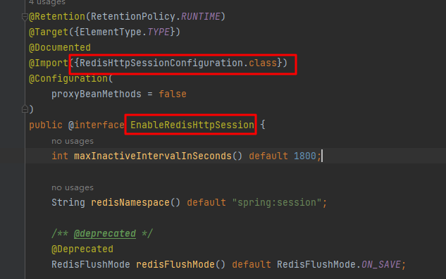
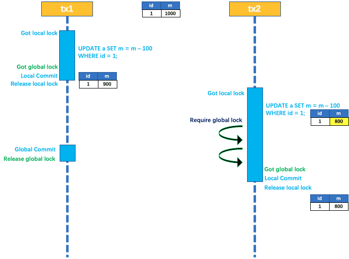

[toc]


# 1. 商品（SPU）上架-信息写入ES

主要事项：

- 确定存入ES的数据模型
- 将数据存入ES，供后续检索

## 1.1 ES中的数据模型

商品上架时存入ES的数据模型：

```java
/**
* @Description sku上架在ES里保存的数据模型
**/
@Data
public class SkuEsModel {
    /**
     * sku Id
     **/
    private Long skuId;
    /**
     * 所属spu Id
     **/
    private Long spuId;
    /**
     * 商品标题
     **/
    private String skuTitle;
    /**
     * 商品价格
     **/
    private BigDecimal skuPrice;
    /**
     * sku图片集
     **/
    private String skuImg;
    /**
     * sku 销量
     **/
    private Long saleCount;
    /**
     * 是否有库存
     **/
    private Boolean hasStock;
    /**
     * 热度评分
     **/
    private Long hotScore;
    /**
     * 品牌Id
     **/
    private Long brandId;
    /**
     * 分类Id
     **/
    private Long catalogId;
    /**
     * 分类名
     **/
    private String catalogName;
    /**
     * 品牌名
     **/
    private String brandName;
    /**
     * 品牌图片
     **/
    private String brandImg;
    /**
     * 分类图片
     **/
    private String catalogImg;
    private List<Attr> attrs;
    @Data
    public static class Attr{
        /**
         * 属性id
         */
        private Long attrId;
        /**
         * 属性名
         */
        private String attrName;
        /**
         * 属性值
         */
        private String attrValue;
    }
}
```


## 1.2 商品服务（gulimall-product）

调gulimall-search服务将数据写入ES方便检索，同时更改spu上架状态。

com.atguigu.product.service.impl.SpuInfoServiceImpl#up

```java
 @Override
    public void up(Long spuId) {
        
        // 1.查询当前sku所有用来检索的规格属性-共一个spu
        List<ProductAttrValueEntity> productAttrValueEntities=productAttrValueService.getSearchAttrs(spuId);
        List<SkuEsModel.Attr> searchAttrs=productAttrValueEntities.stream().map(productAttrValueEntity -> {
            SkuEsModel.Attr attr=new SkuEsModel.Attr();
            BeanUtils.copyProperties(productAttrValueEntity,attr);
            return attr;
        }).collect(Collectors.toList());

        // 2.查出当前spuId对应的所有sku
        List<SkuInfoEntity> skus=skuInfoDao.selectList(new QueryWrapper<SkuInfoEntity>().eq("spu_id",spuId));
        List<Long> skuIds=new ArrayList<>();
        if(skus!=null){
            skuIds=skus.stream().map(SkuInfoEntity::getSkuId).collect(Collectors.toList());
        }

        Map<Long,Boolean> stockMap=null;
        try {
            // 3.远程调用库存系统查出是否有库存
            Result<List<SkuHasStockVo>> hasStock=wareFeignService.getSkuHasStock(skuIds);
            stockMap=hasStock.getData().stream().collect(Collectors.toMap(SkuHasStockVo::getSkuId,SkuHasStockVo::getHasStock));
        }catch (Exception e){
            log.error("远程调用库存服务出现异常，异常原因：{}",e);
        }
        Map<Long, Boolean> finalStockMap = stockMap;
       
        // 4.组装数据
        List<SkuEsModel> skuEsModels=skus.stream().map(sku->{
            SkuEsModel skuEsModel=new SkuEsModel();
            BeanUtils.copyProperties(sku,skuEsModel);
            // skuPrice ,skuImg
            skuEsModel.setSkuPrice(sku.getPrice());
            skuEsModel.setSkuImg(sku.getSkuDefaultImg());
            // hasStock , hotScore
            if(finalStockMap ==null){
                // TODO 后面再处理
                skuEsModel.setHasStock(true); // 调用远程服务出现异常直接置为有库存
            }else{
                skuEsModel.setHasStock(finalStockMap.get(sku.getSkuId()));
            }

            // 热度评分， 初始置0
            skuEsModel.setHotScore(0L);

            // 查询品牌和分类的信息
            BrandEntity brandEntity=brandDao.selectById(sku.getBrandId());
            if(brandEntity!=null){
                skuEsModel.setBrandName(brandEntity.getName());
                skuEsModel.setBrandImg(brandEntity.getLogo());
            }
            CategoryEntity category=categoryDao.selectById(sku.getCatalogId());
            if(category!=null){
                skuEsModel.setCatalogName(category.getName());
            }
            // 设置检索属性
            skuEsModel.setAttrs(searchAttrs);
            return skuEsModel;
        }).collect(Collectors.toList());
        
        // 5. 将数据发送给gulimall-search服务并保存到ES
        Result result=searchFeignService.productStartUp(skuEsModels);
        
        if(result.getCode()==0){ // 远程调用成功
            // 6. 修改spu发布状态
            SpuInfoEntity spuInfoEntity=new SpuInfoEntity();
            spuInfoEntity.setId(spuId);
            spuInfoEntity.setPublishStatus(PublishStatusEnum.UP.getCode());
            spuInfoEntity.setUpdateTime(new Date());
            getBaseMapper().updateById(spuInfoEntity);
        }else{
            // 远程调用失败
            // TODO 重复调用？ 接口幂等性 重试机制
        }
    }
```


## 1.3 检索服务（gulimall-search）

接收gulimall-product发送过来的数据并保存到ES  

/search/product/up

```java
public class ProductSaveServiceImpl implements ProductSaveService {
    @Autowired
    RestHighLevelClient restHighLevelClient;

    /**
     * 主程序启动默认执行：创建索引及映射
     **/
    @PostConstruct
    public void createIndexAndMapping() throws IOException {
        // 1.给es中建立索引: product,并建立映射关系 gulimall-search/src/main/resources/product-mapping.txt
        // 注意CreateIndexRequest导包，需为org.elasticsearch.client.indices.CreateIndexRequest;否则报错
        org.elasticsearch.client.indices.CreateIndexRequest request = new CreateIndexRequest(EsContant.PRODUCT_INDEX);
        request.mapping("{\n" +
                "    \"properties\": {\n" +
                "      \"skuId\": {\n" +
                "        \"type\": \"long\"\n" +
                "      },\n" +
                "      \"spuId\": {\n" +
                "        \"type\": \"keyword\"\n" +
                "      },\n" +
                "      \"skuTitle\": {\n" +
                "        \"type\": \"text\",\n" +
                "        \"analyzer\": \"ik_smart\"\n" +
                "      },\n" +
                "      \"skuPrice\": {\n" +
                "        \"type\": \"keyword\"\n" +
                "      },\n" +
                "      \"skuImg\": {\n" +
                "        \"type\": \"keyword\"\n" +
                "      },\n" +
                "      \"saleCount\": {\n" +
                "        \"type\": \"long\"\n" +
                "      },\n" +
                "      \"hasStock\": {\n" +
                "        \"type\": \"boolean\"\n" +
                "      },\n" +
                "      \"hotScore\": {\n" +
                "        \"type\": \"long\"\n" +
                "      },\n" +
                "      \"brandId\": {\n" +
                "        \"type\": \"long\"\n" +
                "      },\n" +
                "      \"catalogId\": {\n" +
                "        \"type\": \"long\"\n" +
                "      },\n" +
                "      \"brandName\": {\n" +
                "        \"type\": \"keyword\"\n" +
                "      },\n" +
                "      \"brandImg\": {\n" +
                "        \"type\": \"keyword\"\n" +
                "      },\n" +
                "      \"catalogName\": {\n" +
                "        \"type\": \"keyword\"\n" +
                "      },\n" +
                "      \"attrs\": {\n" +
                "        \"type\": \"nested\",\n" +
                "        \"properties\": {\n" +
                "          \"attrId\": {\n" +
                "            \"type\": \"long\"\n" +
                "          },\n" +
                "          \"attrName\": {\n" +
                "            \"type\": \"keyword\"\n" +
                "          },\n" +
                "          \"attrValue\": {\n" +
                "            \"type\": \"keyword\"\n" +
                "          }\n" +
                "        }\n" +
                "      }\n" +
                "    }\n" +
                "  }",XContentType.JSON);
        try {
            restHighLevelClient.indices().create(request, RequestOptions.DEFAULT);
        }catch (Exception e){
            log.error("ES初始化创建失败，mapping已存在请先删除: 发送请求 DELETE /{}",EsContant.PRODUCT_INDEX);
        }
    }
    
    @Override
    public boolean productStartUp(List<SkuEsModel> skuEsModels) throws IOException {
        // 保存到ES
        // 1.给es中建立索引（createIndexAndMapping方法）: product,并建立映射关系 gulimall-search/src/main/resources/product-mapping.txt

        // 2.构造批量请求
        BulkRequest bulkRequest=new BulkRequest();
        for(SkuEsModel skuEsModel:skuEsModels){
            IndexRequest indexRequest=new IndexRequest(EsContant.PRODUCT_INDEX); // 指定索引

            indexRequest.id(skuEsModel.getSkuId().toString()); // Document id设为skuId,防止不断添加数据，skuId相同则覆盖
            String s= JSON.toJSONString(skuEsModel);
            indexRequest.source(s, XContentType.JSON);
            bulkRequest.add(indexRequest);
        }

        // 2. 保存到ES 批量保存
        BulkResponse bulkResponse =restHighLevelClient.bulk(bulkRequest, ElasticSearchConfig.COMMON_OPTIONS);
        // TODO 3.上架出错处理 先用日志简单记录
        boolean error=bulkResponse.hasFailures();
        if (error){
            List<String> collect=Arrays.stream(bulkResponse.getItems()).map(BulkItemResponse::getId).collect(Collectors.toList());
            log.error("商品上架错误:{}",collect);
        }
        return !error;
    }
}

```

## 1.4 效果

SPU上架完成后：发GET请求可以从ES中查到索引为product下的数据，即保存成功。


# 2.动静分离-搭建商城首页环境

## 2.1 Thymeleaf模板引擎

分担访问压力:  页面中的静态资源直接放在nginx，网关做统一鉴权认证等服务，需要经过服务器处理的动态请求才过网关并路由到具体的微服务。


引入thymeleaf模板引擎依赖:

```xml
<!--thymeleaf模板引擎-->
<dependency>
    <groupId>org.springframework.boot</groupId>
    <artifactId>spring-boot-starter-thymeleaf</artifactId>
</dependency>
```


将资料中：首页资源的index文件夹复制到gulimall-product模块static路径下（静态资源）


再将index.html复制到resources/templates下（没有新建一个）：访问端口时默认会找index.html


配置application.yml：

```yaml
spring:
  thymeleaf:
    cache: false #关闭thymeleaf缓存，方便开发期间看到实时效果
```


之后所有和页面相关的都放web下：


重启product服务，访问10000端口即可看到首页：


## 2.2 前端获取实时一、二、三级分类数据

页面跳转和页面渲染出实时的一级分类数据：

（1）配置访问http://localhost:10000/index.html 和http://localhost:10000都跳转到index.html页面

```java
@Controller
public class IndexWebController {
    @Autowired
    CategoryService categoryService;
    /**
     * @description: 配置转发： 访问http://localhost:10000/index.html 和http://localhost:10000都跳转到index.html页面
     * @param:
     * @param model
     * @return: java.lang.String
     **/
    @GetMapping({"/","/index.html"})
    public String indexPage(Model model){
        // 1.查出所有的一级分类
        List<CategoryEntity> categoryEntities=categoryService.getLevelOneCategories();
        // 视图解析器
        model.addAttribute("categorys",categoryEntities);
        return "index";
    }
}
```

（2）前端拿到实时的一级分类数据


效果：


## 2.3 Redis+分布式锁优化分类数据查询

将三级分类数据存入redis，redis中有直接返回，没有才查数据库并写入redis。


同时加分布式锁限制只有一个线程查询数据库，减轻数据库访问压力：


AOP更新缓存：改了数据库中的分类数据就删除缓存，保持缓存和数据库的一致性。


## 2.4 搭建域名访问环境

### 2.4.1 nginx到具体微服务

搭建域名访问环境：以管理员身份打开


效果和直接改hosts相同：


新建方案保存：其中1192.168.30.128为之前装es 容器的虚拟机


直接域名访问9200端口（开了代理必须退出）：


nginx总配置：nginx.conf文件，它包含conf.d/下的所有配置文件


conf.d/default.conf:


复制一份default.conf作为gulimall.conf:


修改gulimall.conf：加上proxy_pass配置，其中192.168.1.4为wins物理机，上面运行gulimall各个微服务；192.168.30.128为虚拟机，上面装了nginx、es等docker容器。由于之前在物理机上配了域名192.168.30.128 gulimall.com，因此数据流转发规则为：

物理机上（192.168.1.4）请求gulimall.com -> 192.168.30.128虚拟机上的nginx服务-> 根据proxy_pass规则转到http://192.168.1.4:10000（相当于又回到物理机） 。


因此gulimall.com可以直接访问商城首页：


### 2.4.2 nginx负载均衡到网关，网关再负载均衡到微服务（推荐）

升级：nginx先到网关，而不是直接到商品服务，由网关再路由到具体服务

#### 2.4.2.1 nginx配置

具体配置参考nginx负载均衡：https://nginx.org/en/docs/http/load_balancing.html


修改/mydata/nginx/conf/conf.d/gulimall.conf: 直接到网关组gulimall ,这样请求到nginx后就会直接转到网关组gulimall(下面nginx.conf里面配了 )，然后再由网关转给具体的服务；同时手动设置头，防止nginx自动丢弃。


修改/mydata/nginx/conf/nginx.conf ：配上网关地址组


#### 2.4.2.2 网关配置域名转发

网关配置域名转发

参考：


放到最后，否则会屏蔽其他规则：


#### 2.4.2.3 效果

所有请求都可以通过域名访问：先到nginx，再到网关，再到微服务


接口也可通过域名访问：


## 2.5 进一步优化nginx-动静分离

新建static文件夹


将所有原来微服务staic下静态数据全部上传到下面，并删掉原微服务下的静态资源：


修改index.html： 原来/index/下的全部改为/static/index/ 如下所示：


/mydata/nginx/conf/conf.d/gulimall.conf加上:  即所有请求为/static的路径都转给/usr/share/nginx/html


注意，上面的/usr/share/nginx/html为容器内路径：


重启nginx容器，然后重新访问：正常


# 3.检索服务

## 3.1 搭建页面环境

检索服务（gulimall-search）：在static文件夹下新建search文件夹，然后将静态资源传上去


index.html放到：


修改：所有herf 和src路径都加上/static，如下所示


域名规则添加：所有到search.gulimall.com的都转给nginx服务器


/mydata/nginx/conf/conf.d/gulimall.conf： 修改后重启nginx


网关配置域名转发：所有域名为search.gulimall.com的都转到gulimall-search服务


idea重新clean install 以下所有模块（可能有缓存，导致search前端页面刷不出），重启gate-way 和search服务

访问http://search.gulimall.com/  


## 3.2  检索服务

### 3.2.1 构造查询条件

可用来检索的字段：

- 检索关键字
- 三级分类Id
- 排序条件：销量、价格、热度
- 其他过滤条件：是否有货、商品价格区间、品牌、分类、属性值


```java
@Data
public class SearchParam {
    /**
     * 检索关键字
     **/
    private String keyword;
    /**
     * 三级分类Id
     **/
    private Long catalog3Id;
    /**
     * 排序条件
     * sort=saleCount_asc/desc  销量
     * sort=skuPrice_asc/desc   价格
     * sort=hotScore_asc/desc   热度
     **/
    private String sort;

    /**
     * 其他过滤条件
     * hasStock(是否有货)  skuPrice区间  brandId、catalog3Id、attrs
     * hasStock=0/1
     * skuPrice区间: 1_500/_500/500_
     **/
    /**
     * 是否有货：0无  1有
     **/
    private Integer hasStock;
    /**
     * 商品价格区间
     **/
    private String skuPrice;
    /**
     * 品牌Id :可同时选多个
     **/
    private List<String> brandId;
    /**
     * 属性 :可同时选多个
     **/
    private List<String> attrs;

    /**
     * 分页当前页码(起始号)，默认1
     **/
    private Integer pageNum=1;
}
```

### 3.2.2 编写ES-DSL查询语句

总体分为：

- 查询：query
- 排序：sort
- 分页： from ,size
- 高亮：hightlight
- 聚合：aggs


#### 3.2.2.1 查询

query:   按照商品标题、分类、品牌Id集合、属性集合、是否有库存、价格区间进行组装

#### 3.2.2.2 排序

sort: 销量、价格区间、热度 。ASC/DESC

#### 3.2.2.3 分页

#### 3.2.2.4 高亮

highlight： 对检索的skuTitle进行高亮显示

#### 3.2.2.5 聚合

aggs: 对ES中命中的数据进行汇总分析。

- brand_agg: 根据品牌ID进行聚合，需要获取品牌ID、品牌名、品牌Logo
- catalog_agg: 根据分类ID进行聚合，需要获取分类ID、分类名
- attr_agg： 根据属性进行聚合，需要获取属性ID、属性名、属性值


DSL语句如下：

```java
{
   //  1. query条件组装
  "query": {
    "bool": {
      "must": [
        {
          "match": {
            "skuTitle": "华为"  // 按照商品标题
          }
        }
      ],
      "filter": [
        {
          "term": {
            "catalogId": "225"  // 按照分类
          }
        },
        {
          "terms": {
            "brandId": [   // 按照品牌Id集合
              "9",
              "12"
            ]
          }
        },
        {               // 按照属性集合（attrs字段对应一个java类，ES中要用nested类型）
          "nested": {
            "path": "attrs",   
            "query": {
              "bool": {
                "must": [
                  {
                    "term": {
                      "attrs.attrId": {
                        "value": "15"
                      }
                    }
                  },
                  {
                    "terms": {
                      "attrs.attrValue": [
                        "HUAWEI Kirin 980",
                        "海思（Hisilicon）"
                      ]
                    }
                  }
                ]
              }
            }
          }
        },
        {
          "term": {
            "hasStock": "true"    // 按照是否有库存
          }
        },
        {
          "range": {
            "skuPrice": {        // 按照价格区间
              "gte": 5000,
              "lte": 8000
            }
          }
        }
      ]
    }
  },
    
    //  2. sort条件组装
  "sort": [                    // 排序
    {
      "skuPrice": {
        "order": "desc"
      }
    }
  ],
    //  3. 分页条件组装
  "from": 0,
  "size": 1,
     //  4. 高亮
  "highlight": {
    "fields": {
      "skuTitle": {
        
      }
    },
    "pre_tags": "<b style='color:red'>",
    "post_tags": "</b>"
  },
    
     //  5. 聚合
  "aggs": {
    "brand_agg": {
      "terms": {
        "field": "brandId",  // 5.1 根据品牌ID聚合
        "size": 10
      },
      "aggs": {
        "brand_name_agg": {  // 获取品牌名-子聚合（基于上一次聚合数据）
          "terms": {
            "field": "brandName",
            "size": 10
          }
        },
        "brand_img_agg": {  // 获取品牌logo-子聚合
          "terms": {
            "field": "brandImg",
            "size": 10
          }
        }
      }
    },
    "catalog_agg": {   // 5.2 根据分类ID聚合
      "terms": {
        "field": "catalogId",
        "size": 10
      },
      "aggs": {
        "catalog_name_agg": { 
          "terms": {
            "field": "catalogName",  // 分类名
            "size": 10
          }
        }
      }
    },
    "attr_agg": {  // 5.2 根据属性聚合（nested）
      "nested": {
        "path": "attrs"
      },
      "aggs": {
        "attr_id__agg": {
          "terms": {
            "field": "attrs.attrId", // 属性Id
            "size": 10
          },
          "aggs": {
            "attr_name_agg": {
              "terms": {
                "field": "attrs.attrName", // 属性名
                "size": 10
              }
            },
            "attr_value_agg": {
              "terms": {
                "field": "attrs.attrValue", // 属性Id
                "size": 10
              }
            }
          }
        }
      }
    }
  }
}
```

### 3.2.3 构建检索请求-  SearchRequest

将检索条件和上面的DSL json转化为java代码，构建出ES检索请求SearchRequest。

com.atguigu.search.service.impl.MallSearchServiceImpl#buildSearchRequest


### 3.2.4 执行检索请求

从ES中查询满足条件的记录


### 3.2.5 解析响应数据SearchResponse并封装成所需格式SearchResult

响应数据SearchResponse格式：


需要返回的信息SearchResult：

- 所有查询到的商品信息：直接从命中记录hits中取

- 所有涉及到的品牌信息：从聚合结果aggregations中取
- 所有涉及到的分类信息：从聚合结果aggregations中取
- 所有查询到的商品涉及的属性信息：从聚合结果aggregations中取
- 分页信息：直接从命中记录hits以及请求参数中取


### 3.2.6 效果

所有录入的商品：苹果+华为，共12件sku


搜索条件：手机（catalogId=255）+  华为(keyword=华为)


搜索条件：手机（catalogId=255）+  华为(keyword=华为) + 价格区间5000~6000（skuPrice）


搜索条件（按价格排序）: catalog3Id=225 & keyword=华为& sort=skuPrice_desc


# 4.商品详情

## 4.1 GROUP_CONCAT连接

JOIN中的group by: 非GROUP_CONCAT中的字段在GROUP BY都要有，下面为找出某一属性下所有sku_id

```mysql
SELECT 
sav.attr_id,
sav.attr_name,
sav.attr_value,
GROUP_CONCAT(DISTINCT sku.sku_id)
FROM pms_sku_sale_attr_value sav
LEFT JOIN pms_sku_info sku ON sav.sku_id=sku.sku_id 
WHERE sku.spu_id=18
GROUP BY sav.attr_id,sav.attr_name,sav.attr_value
```


## 4.2 Mybatis自定义结果集-嵌套属性

```java
@Data
public class SpuItemAttrGroupVo {
    private String groupName;
    private List<SpuBaseAttrVo> attrs;
}


@Data
public class SpuBaseAttrVo {
    private String attrName;
    private String attrValue;
}
```

嵌套属性必须封装自定义结果集或者起别名：下面为自定义结果集

```xml
<!--嵌套属性必须封装自定义结果集 -->
<resultMap id="spuItemAttrGroupVo" type="com.atguigu.product.vo.SpuItemAttrGroupVo">
    <!--将mysql查出来的attr_group_name字段赋给SpuItemAttrGroupVo类里的groupName-->
    <result property="groupName" column="attr_group_name"></result>
    <!--SpuBaseAttrVo -->
    <collection property="attrs" ofType="com.atguigu.product.vo.SpuBaseAttrVo">
        <result property="attrName" column="attr_name"></result>
        <result property="attrValue" column="attr_value"></result>
    </collection>
</resultMap>


<!-- join比子查询快（不用建临时表） -->
<select id="getAttrGroupWithAttrs" resultMap="spuItemAttrGroupVo">
    SELECT av.spu_id,ag.attr_group_id,ag.attr_group_name,aar.attr_id,attr.attr_name,av.attr_value FROM pms_attr_group ag
           LEFT JOIN pms_attr_attrgroup_relation aar ON ag.attr_group_id=aar.attr_group_id
           LEFT JOIN pms_attr attr ON aar.attr_id=attr.attr_id
           LEFT JOIN pms_product_attr_value av ON av.attr_id=attr.attr_id
    WHERE ag.catelog_id=#{catalogId} AND av.spu_id=#{spuId}
</select>
```


起别名：


## 4.3 异步任务编排

商品详情接口：/{skuId}.html     com.atguigu.product.service.impl.SkuInfoServiceImpl#item

任务2、3、4都需要等待任务1的结果（拿到spuId和catalogId），用thenAcceptAsync

任务5和其他任务无关联，可以并行执行。

总的结果需等所有任务都执行完 ，`CompletableFuture.allOf().get();`

```java
 @Override
    public SkuItemVo item(Long skuId) throws ExecutionException, InterruptedException {
        SkuItemVo skuItemVo=new SkuItemVo();
        // 任务编排：  任务1->(2/3/4) 与  任务5 并行
        CompletableFuture<SkuInfoEntity> infoFuture=CompletableFuture.supplyAsync(()->{
            // 任务1.sku基本信息 pms_sku_info
            SkuInfoEntity skuInfoEntity=getById(skuId);
            skuItemVo.setInfo(skuInfoEntity);
            return skuInfoEntity;
        },threadPoolExecutor);
        // 任务2、3、4都必须等任务1执行完再执行
        CompletableFuture<Void> descFuture=infoFuture.thenAcceptAsync(res->{
            // 任务2：spu介绍信息  pms_spu_images pms_spu_info
            SpuInfoDescEntity spuInfoDescEntity =spuInfoDescService.getById(res.getSpuId());
            skuItemVo.setDesp(spuInfoDescEntity);
        },threadPoolExecutor);
        // 其他任务依赖任务1：等1执行完再执行thenApplyAsync
        CompletableFuture<Void> saleAttrFuture=infoFuture.thenAcceptAsync(res->{
            Long spuId=res.getSpuId();
            // 任务3.spu销售属性组合  pms_attr pms_product_attr_value
            List< SkuItemSaleAttrVo> saleAttrs =skuSaleAttrValueDao.getSaleAttrs(spuId);
            skuItemVo.setSaleAttr(saleAttrs);
        },threadPoolExecutor);
        CompletableFuture<Void> baseAttrFuture=infoFuture.thenAcceptAsync(res->{
            Long catalogId=res.getCatalogId();
            Long spuId=res.getSpuId();
            // 任务4.spu规格参数 pms_product_attr_value
            List<SpuItemAttrGroupVo> attrGroupVos=attrGroupService.getAttrGroupWithAttrs(spuId,catalogId);
            skuItemVo.setGroupAttrs(attrGroupVos);
        },threadPoolExecutor);


        // 任务5.sku图片信息 pms_sku_images
        CompletableFuture<Void> skuImagesFuture=CompletableFuture.runAsync(()->{
            List<SkuImagesEntity> skuImages=skuImagesService.getImagesBySkuId(skuId);
            skuItemVo.setImages(skuImages);
        },threadPoolExecutor);
        // 等所有的都做完
        CompletableFuture.allOf(infoFuture,descFuture,saleAttrFuture,baseAttrFuture,skuImagesFuture).get();
        return skuItemVo;
    }
```


# 5.认证服务

## 5.1 SpringMVC页面跳转配置

使用SpringMVC本身的页面跳转，代替在Controller里写跳转方法：

```java
/**
 * 页面跳转配置
 **/
@Configuration
public class GulimallWebConfig implements WebMvcConfigurer {
    @Override
    public void addViewControllers(ViewControllerRegistry registry){
        registry.addViewController("/login.html").setViewName("login");
        registry.addViewController("/register.html").setViewName("register");
    }
}

```

等价于下面:

```java
@Controller
public class LoginController {
    /**
     * 登录页跳转
     **/
    @GetMapping("/login.html")
    public String loginPage(){
        return "login";
    }

    /**
     * 注册页跳转
     **/
    @GetMapping("/register.html")
    public String registerPage(){
        return "register";
    }
}
```


## 5.2 用户注册

### 5.2.1 短信验证码

#### 5.2.1.1 阿里云短信服务

参考：https://help.aliyun.com/zh/sms/developer-reference/using-the-openapi-example?spm=a2c4g.11186623.4.1.1b767f5cwSfweW&scm=20140722.H_2411226._.ID_2411226-OR_rec-V_1


开放权限：


```java
/**
 *  短信验证码配置
 **/
@Configuration
public class SmsConfig {
    @Value("${alibaba.oss.accessKeyId}")
    private String accessKeyId;
    @Value("${alibaba.oss.accessKeySecret}")
    private String accessKeySecret;
    @Bean
    public Client createClient() throws Exception {
        Config config = new Config()
                // 配置 AccessKey ID
                .setAccessKeyId(accessKeyId)
                // 配置 AccessKey Secret
                .setAccessKeySecret(accessKeySecret);

        // 配置 Endpoint
        config.endpoint = "dysmsapi.aliyuncs.com";

        return new Client(config);
    }
}
```


由于未备案只能给绑定的手机号发送短信验证码，且签名和模板都得申请：


```java
@Slf4j
@Component
public class SmsComponent {
    @Value("${alibaba.sms.signName}")
    String signName;
    @Value("${alibaba.sms.templateCode}")
    String templateCode;
    @Autowired
    Client smsClient;
    /**
     * @description: 发送短信
     * @param:
     * @param phone 手机号
     * @return: void
     **/
    public void sendSms(String phone) throws Exception {
        // 6位随机验证码
        //String code= UUID.randomUUID().toString().substring(0,5);
        Random random=new Random();
        int r=random.nextInt(899999);
        String code=r+100000+"";
        
        String templateParam="{\"code\":\""+code+"\"}";
        SendSmsRequest sendSmsRequest = new SendSmsRequest()
                .setPhoneNumbers(phone)
                .setSignName(signName)
                .setTemplateCode(templateCode)
                .setTemplateParam(templateParam);


        // 获取响应对象
        SendSmsResponse sendSmsResponse = smsClient.sendSms(sendSmsRequest);

        // 响应包含服务端响应的 body 和 headers
        log.info("给手机号:【{}】 发送短信验证码:{}",phone,JSON.toJSONString(sendSmsResponse));
    }
}
```


测试：

```java
@Slf4j
@SpringBootTest
class GulimallThirdPartyApplicationTests {
    @Autowired
    SmsComponent smsComponent;

    @Test
    public void sendSms() throws Exception {
        smsComponent.sendSms("13717782203");
    }

}
```

#### 5.2.1.2 短信验证设计

- 随机生成6位验证码，然后调阿里云短信验证码服务给指定手机号发送该验证码
- 同时在redis中保存短信验证码信息（使用String类型，key为sms:code:手机号，value为“验证码_发送时间”），过期时间10min(收到验证码后10min内有效，比较表单提交值和Redis里的值)
- 发送验证码前先查redis，若对应手机号的验证码信息存在，且发送时间在60s以内，则不重复发送


### 5.2.2 注册流程


用户填写注册信息，并发送验证码（该过程会将验证码信息写入redis），提交表单数据后开始格式校验，校验成功进行验证码校验（从redis中取出验证码信息进行对比），验证码校验通过后删除redis（**<font color=red>令牌机制-保证接口幂等性</font>**），随后调用会员服务进行注册（写用户信息表ums_member，写入前会先判断用户名/手机号/邮箱是否已存在），调用成功后转到登录页。

#com.atguigu.authserver.web.LoginController


```json
@Slf4j
@Controller
public class LoginController {
    @Autowired
    ThirdPartyFeignService thirdPartyFeignService;
    @Autowired
    StringRedisTemplate stringRedisTemplate;
    @Autowired
    MemberFeignService memberFeignService;
    
    /**
     * @description: 发送验证码
     * @param: 
     * @param phone 手机号
     * @return: com.atguigu.common.utils.Result
     **/
    @ResponseBody
    @GetMapping("/sms/sendcode")
    public Result sendCode(@RequestParam("phone") String phone) throws Exception {
        ValueOperations<String,String> ops=stringRedisTemplate.opsForValue();
        String redisKey=AuthServerConstant.SMS_CODE_CACHE_PREFIX+phone;
        String redisCode=ops.get(redisKey);
        // redis里有验证码且在60s内：不能重复发送
        if(redisCode!=null){
            long redisTime=Long.parseLong(redisCode.split("_")[1]);
            if(System.currentTimeMillis()-redisTime<60000){
                // 60s 内不能重复发
                return Result.error(BizCodeEnum.VAILD_SMS_CODE_EXCEPTION);
            }
        }

        // 6位随机验证码
        //String code= UUID.randomUUID().toString().substring(0,5);
        Random random=new Random();
        int r=random.nextInt(899999);
        String code=r+100000+"";
        Result result=thirdPartyFeignService.sendCode(phone,code);

        // 接口防刷：前端可以拿到发送验证码的uri ，防止恶意攻击无限调用
        // redis缓存验证码和发送时间
        redisCode=code+"_"+System.currentTimeMillis();
        ops.set(redisKey,redisCode,10, TimeUnit.MINUTES); // sms:code:13717782203 -> 167852  10分钟有效
        return result;
    }
    /**
     * @description: 用户注册
     * @param: 
     * @param userRegisterVo
     * @param bindingResult
     * @param redirectAttributes 重定向携带数据(利用session原理，将数据放在session中，只要跳到下一个页面取出这个数据后，session里的数据就会删掉)
     *                           // TODO 分布式下Session问题
     * @return: java.lang.String
     **/
    @PostMapping("/register")
    public String register(@Valid UserRegisterVo userRegisterVo, BindingResult bindingResult, RedirectAttributes redirectAttributes){
        log.info("注册：{}", JSON.toJSONString(userRegisterVo));
        // 1.注册信息格式校验
        if(bindingResult.hasErrors()){
            log.error("注册信息格式校验失败");
            Map<String ,String > errors=bindingResult.getFieldErrors().stream().collect(Collectors.toMap(FieldError::getField,FieldError::getDefaultMessage));
            //model.addAttribute("errors",errors);

            redirectAttributes.addFlashAttribute("errors",errors);
            return "redirect:http://auth.gulimall.com/register.html";  // 校验出错重新到注册页
        }
        // 2.校验验证码
        String code= userRegisterVo.getCode();
        ValueOperations<String,String> ops=stringRedisTemplate.opsForValue();
        String redisKey=AuthServerConstant.SMS_CODE_CACHE_PREFIX+userRegisterVo.getPhone();
        String redisCode=ops.get(redisKey);
        if(redisCode!=null&&code.equals(redisCode.split("_")[0])){
            // 校验通过删除redis中的验证码（令牌机制-保证接口幂等性）
            stringRedisTemplate.delete(redisKey);
            // 3.调会员服务进行注册
            Result r=memberFeignService.register(userRegisterVo);
            if(r.getCode()==0){
                // 3.注册成功回到登录页
                return "redirect:http://auth.gulimall.com/login.html";
            }else{ // 调用失败
                Map<String ,String> errors=new HashMap<>();
                errors.put("msg",r.getMsg());
                redirectAttributes.addAttribute("errors",errors);
                return "redirect:http://auth.gulimall.com/register.html";  // 重新到注册页
            }

        }else{ // 验证码校验失败
            Map<String,String> errors=new HashMap<>();
            errors.put("code","验证码错误");
            redirectAttributes.addFlashAttribute("errors",errors);
            return "redirect:http://auth.gulimall.com/register.html";  // 重新到注册页
        }
    }
}
```


## 5.3 用户登录

登录成功进入商城首页 ，并显示用户信息

### 5.3.1 Session和Cookies机制

用户登录成功，服务器会创建session（保存在tomcat里的缓存，有过期时间，数据类型为Map（key为用户标识，value为sesssion内容）），并且在第一次登录成功后将session id发给浏览器，浏览器在本地创建cookie时带上session id，每次访问服务器使用session id进行身份校验，从而在过期时间内保持登录状态。


每一个cookie有其作用域，只能在其作用域内生效: 从下面两图可以看出，作用域为auth.gulimall.com下有session id ,即在该服务内生效，而在gulimall.com的作用域下没有（整个商城不生效）。


### 5.3.2 分布式环境下Session共享问题

- **问题1：**同一服务部署多个实例，只在负载均衡到的机器上创建session，下一次请求随机路由到其他实例时携带的session id会被判为非法（该服务器没存）
- **问题2：**不同服务由于作用域机制，无法共享session，比如订单服务无法共享会员服务的session (虽然在会员服务里登录了，但无法访问订单数据)。该问题在单机环境下也存在。


### 5.3.3 分布式session解决方案

#### 5.3.3.1 问题1解决方案

方案1：sesssion复制（同步）

不同服务器互相复制同步session，缺点：占传输带宽，受内存限制。


方案2：客户端存储

服务器不存储session，浏览器自己保存到cookie中，每次访问带上唯一身份标识信息。

缺点：不安全，容易被泄露、篡改


方案3：一致性hash （推荐）

将同一浏览器ip路由到相同服务器上


方案4：统一存储 （推荐，采用）

将session统一存在redis中


#### 5.3.3.2 问题2解决方案

创建session时，指定作用域为父域名，让整个系统都能使用，比如在auth.gulimall.com登录 的，将作用域放大为..gulimall.com


### 5.3.4 Spring Session

采用Spring Session解决上述问题。

参考：https://docs.spring.io/spring-session/reference/3.0/guides/boot-redis.html

#### 5.3.4.1 引入依赖

```xml
<!--版本由spring boot父项目控制-->
<dependency>
    <groupId>org.springframework.session</groupId>
    <artifactId>spring-session-data-redis</artifactId>
</dependency>
       
```

#### 5.3.4.2 application.yml配置

需配置如下信息：

- session类型：redis、mongodb等
- 配置过期时间
- 连接信息：保存类型为redis时配置redis服务器信息

```yaml
spring:
  # 1.redis 连接信息
  redis:
    host: 192.168.30.128
    port: 6379
    password: 181181@Lq
  # 2.session保存类型
  session:
    store-type: redis  #session保存在redis中

#3. session过期时间
server:
  servlet:
    session:
      timeout: 30m #session过期时间30min
  

```

工作原理：springSessionRepositoryFilter替代原来的HttpSession


#### 5.3.4.3 配置作用域和序列化器

每个要用的微服务都要配

```java
@Configuration
public class GulimallSessionConfig {
    /**
     * 配置Session作用域
     **/
    @Bean
    public CookieSerializer cookieSerializer(){
        DefaultCookieSerializer cookieSerializer=new DefaultCookieSerializer();
        cookieSerializer.setDomainName("gulimall.com"); // 设置作用域：放大到整个项目  auth.gulimall.com -> .gulimall.com
        cookieSerializer.setCookieName("GULISESSION");
        return cookieSerializer;
    }

    /**
     * 配置Session 序列化器：默认用jdk 此处使用jackson
     **/
    @Bean
    public RedisSerializer<Object> springSessionDefaultRedisSerializer(){
        return new GenericJackson2JsonRedisSerializer();
    }
}
```

#### 5.3.4.4 其他配置

主启动类加上@EnableRedisHttpSession注解

```java
@EnableRedisHttpSession  // 整合redis作为session存储
public class GulimallAuthServerApplication {
    public static void main(String[] args) {
        SpringApplication.run(GulimallAuthServerApplication.class, args);
    }

}
```

#### 5.3.4.5 效果

登录成功后放入session:


前端在登录成功后取出session:


效果：


gulimall-product、gulimall-search都要开启spring session:


#### 5.3.4.6 spring session原理

（1) @EnableRedisHttpSession导入@RedisHttpSessionConfiguration配置

- 给容器中添加一个组件RedisIndexedSessionRepository：session的增删改查都是借用redis 的DAO层 来做




- RedisHttpSessionConfiguration继承SpringHttpSessionConfiguration
  - 其初始化方法中设置序列化器，并且有监听session的Bean
  - 最关键的是**<font color=red>过滤器SessionRepositoryFilter：每个请求进来都要经过Filter</font>**
    - 创建的时候，就自动从容器中获取到RedisIndexedSessionRepository
    - 关键理解SessionRepositoryFilter的**<font color=red>doFilterInternal</font>**方法：
      - 原始的request、response都被包装：SessionRepositoryRequestWrapper、SessionRepositoryResponseWrapper
      - 以后获取session:  request.getSession()
      - wrappedRequest.getSession()； ====》RedisIndexedSessionRepository中获取到
- 体现**<font color=red>装饰者模式</font>**

```java

protected void doFilterInternal(HttpServletRequest request, HttpServletResponse response, FilterChain filterChain) throws ServletException, IOException {
        request.setAttribute(SESSION_REPOSITORY_ATTR, this.sessionRepository);
        SessionRepositoryFilter<S>.SessionRepositoryRequestWrapper wrappedRequest = new SessionRepositoryRequestWrapper(request, response);
        SessionRepositoryFilter<S>.SessionRepositoryResponseWrapper wrappedResponse = new SessionRepositoryResponseWrapper(wrappedRequest, response);

        try {
            filterChain.doFilter(wrappedRequest, wrappedResponse);
        } finally {
            wrappedRequest.commitSession();
        }

    }
```


# 6.购物车

## 6.1 需求描述

根据登录与否分为用户购物车和离线（游客）购物车

- （1）用户可以在登录状态下将商品添加到购物车【用户购物车】 
  - 放入数据库 
  - mongodb 
  -  **<font color=red>放入 redis（采用）</font>**

 登录以后，会将临时购物车的数据全部合并过来，并清空临时购物车；


- （2）用户可以在未登录状态下将商品添加到购物车【离线（游客）购物车】 
  - 放入 localstorage（客户端存储，后台不存，但这样无法利用用户偏好数据训练推荐模型） 
  - cookie 
  - WebSQL 
  - **<font color=red>放入 redis（采用）</font>**

 浏览器即使关闭，下次进入，离线购物车数据都在

 

购物车功能：

- 用户可以使用购物车一起结算下单 
- 给购物车添加商品
- 用户可以查询自己的购物车 
- 用户可以在购物车中修改购买商品的数量。 
- 用户可以在购物车中删除商品。 
- 选中不选中商品 
- 在购物车中展示商品优惠信息 
- 提示购物车商品价格变化

## 6.2 数据模型分析


因此每一个购物项信息，都是一个对象，基本字段包括：

```json
{
    skuId: 2131241,  // 商品sku id
    check: true, // 是否被选中
    title: "Apple iphone.....",  // 标题
    defaultImage: "...",
    price: 4999,
    count: 1,
    totalPrice: 4999,
    skuSaleVO: {  
    ...
    }
}
```

另外，购物车中不止一条数据，因此最终会是对象数组。即：

```json
[
    {...},
    {...},
    {...}
]
```

List还是Hash？由于购物车写多读多，经常要修改购物车中某一项商品的详情（比如数量），若采用Redis中的List，需要遍历，时间复杂度大，综合考虑使用**<font color=red>Hash</font>**。

首先不同用户应该有独立的购物车，因此购物车应该以用户的作为 key 来存储，Value 是 用户的所有购物车信息。对购物车中的商品进行增、删、改操作，基本都需要根据商品 id 进行判断， 为了方便后期处理，购物车也应该是`k-v`结构，key 是商品 id，value 才是这个商品的购物车信息。 综上所述，购物车结构是一个**<font color=red>双层 Map</font>**：

```java
/**
* userId:用户id
* skuId:skuId
* itemInfo:购物车中商品信息
**/
Map<String userId,Map<String skuId,CartItemInfo itemInfo>> 
```

## 6.3 拦截器+ThreadLocal-身份鉴权

设计思路：

- 用户已登录：HttpServletRequest中的session不为null，表明用户已登录，可以从session中获取用户信息MemberResponseVo（内含用户id）
- 用户未登录：HttpServletRequest中的session为null，此时创建临时用户（对应临时 购物车），用user-key标识身份，服务器随机生成user-key并将其返回浏览器，后续浏览器请求时将user-key写入cookie供鉴权。


注意**<font color=red>从未登录到登录的切换瞬间：此时UserInfoVo既有userId 也有userkey</font>**， 支持后面的购物车合并功能


拦截器：

- 前置拦截（preHandle）：请求到Controller层，先执行拦截器里的preHandle方法（一般用于鉴权），然后执行Controller里的业务逻辑。
- 后置拦截（postHandle）：Controller里的业务逻辑执行完再执行postHandle方法。

```java
/**
 *  购物车拦截器
 **/
public class CartInterceptor implements HandlerInterceptor {
    public static ThreadLocal<UserInfoVo> threadLocal=new InheritableThreadLocal<>(); // 同一线程共享访问（私有）
    /**
     * 前置拦截: 目标方法执行之前拦截：登录了设置userId 未登录设置user-key
     * @param:
     * @param request
     * @param response
     * @param handler
     * @return: boolean
     **/
    @Override
    public boolean preHandle(HttpServletRequest request, HttpServletResponse response, Object handler) throws Exception {
        HttpSession httpSession=request.getSession();  //获取sring session包装后的session
        MemberResponseVo member=(MemberResponseVo)httpSession.getAttribute(AuthServerConstant.LOGIN_USER);
        UserInfoVo userInfoVo=new UserInfoVo();
        if(member!=null){ // 已登录：获取用户购物车
            userInfoVo.setUserId(member.getId());
        }
        //  从未登录到已登录切换瞬间：既有member又有cookie(userId和userKey都要设置)
        //  未登录：获取临时购物车
        Cookie[] cookies=request.getCookies();
        if(cookies!=null&&cookies.length>0){
            for(Cookie cookie:cookies){
                String name=cookie.getName();
                if(name.equals(CartConstant.TEMP_USER_COOKIE_NAME)){// cookie中携带了user-key
                    userInfoVo.setUserKey(cookie.getValue());
                    userInfoVo.setTempUser(true);
                    break;
                }
            }
        }
        // cookie中没有携带user-key，为其创建一个并发回浏览器
        if(userInfoVo.getUserKey()==null|| StringUtils.isEmpty(userInfoVo.getUserKey())){
            String uuid= UUID.randomUUID().toString();
            userInfoVo.setUserKey(uuid);
        }

        // ThreadLocal同一线程共享数据
        threadLocal.set(userInfoVo);
        return true; // 全部放行，false为拦截

    /**
     * 后置拦截: 目标方法执行之后再执行
     * @param:
     * @param request
     * @param response
     * @param handler
     * @param modelAndView
     * @return: void
     **/
    @Override
    public void postHandle(HttpServletRequest request, HttpServletResponse response, Object handler, @Nullable ModelAndView modelAndView) throws Exception{
        // 服务器创建user-key后将其返给浏览器（主要针对首次访问时请求cookie中没有携带user-key的情况）
        UserInfoVo userInfoVo=threadLocal.get();
        if(!userInfoVo.isTempUser()){
            Cookie cookie=new Cookie(CartConstant.TEMP_USER_COOKIE_NAME,userInfoVo.getUserKey());
            cookie.setDomain("gulimall.com");
            cookie.setMaxAge(CartConstant.TEMP_USER_COOKIE_TIMEOUT);
            response.addCookie(cookie);
        }
    }
}
```

需要**<font color=red>手动添加特定的拦截器并设置拦截路径</font>**

```java
@Configuration
public class CartWebConfig implements WebMvcConfigurer {
    /**
     * @description: 添加拦截器
     **/

    @Override
    public void addInterceptors(InterceptorRegistry registry){
        // 添加CartInterceptor拦截器，并拦截当前购物车的所有请求
        registry.addInterceptor(new CartInterceptor()).addPathPatterns("/**");
    }

}
```


**<font color=red>ThreadLocal</font>**：线程的私有变量，线程安全。可用于**<font color=red>同一线程共享数据</font>**（拦截器->controller->service->dao用的是同一线程），因此**<font color=red>可以在CartController获取CartInterceptor里的threadLocal</font>**。


```java
@Slf4j
@Controller
public class CartController {

    /**
     * @description: 跳转到购物车列表页
     *      浏览器cookie： 用user-key标识用户身份，一个月过期
     *      如果第一次使用jd的购物车，会给一个临时身份
     *      浏览器保存user-key在cookie中，每次访问都带上cookie
     *
     *      已登录：session有
     *      未登录：按照cookie里带来的user-key
     *
     * @param:
     * @return: java.lang.String
     **/
    @GetMapping("/cart.html")
    public String cartListPage(HttpSession session){
        UserInfoVo userInfoVo= CartInterceptor.threadLocal.get(); // 获取共享数据threadLocal
        log.info("获取用户信息：{}",JSON.toJSONString(userInfoVo));
        return "cartList";
    }
}
```

未登录访问http://cart.gulimall.com/cart.html后：


## 6.4 购物车实现

### 6.4.1 添加商品到购物车

先从redis中查原购物车：游客和登录用户有不同的购物车key

- 添加的商品购物车中没有: 先远程调用gulimall-product获取sku详情和sku的销售属性组合信息，再将新的键值对写入redis
- 添加的商品购物车中有: 直接从redis中拿到对应的CartItem，修改数量后重新写入redis

```java
@Slf4j
@Service
public class CartServiceImpl implements CartService{
    @Autowired
    StringRedisTemplate redisTemplate;
    @Autowired
    ProductFeignService productFeignService;
    @Autowired
    ThreadPoolExecutor threadPoolExecutor;
    @Override
    public CartItem addToCart(Long skuId, Integer num) throws Exception {
        BoundHashOperations<String,Object,Object> ops=getCartOps();
        Object o=ops.get(skuId.toString());
        if(o==null){ // 购物车中无此商品
            CartItem cartItem = new CartItem();
            // 任务1： 远程获取sku详情
            CompletableFuture<Void> skuInfoFuture=CompletableFuture.runAsync(()->{
                R r=productFeignService.skuInfo(skuId);
                if(r.getCode()==0) {
                    SkuInfoVo skuInfoVo = r.getData("skuInfo", new TypeReference<SkuInfoVo>() {
                    });
                    cartItem.setSkuId(skuId);
                    cartItem.setCheck(true);
                    cartItem.setCount(num);
                    cartItem.setImage(skuInfoVo.getSkuDefaultImg());
                    cartItem.setTitle(skuInfoVo.getSkuTitle());
                    cartItem.setPrice(skuInfoVo.getPrice());
                }else {
                    log.error("远程调用gulimall-product查询sku详情失败，skuId={}",skuId);
                }
            },threadPoolExecutor);

            // 任务2.远程查询sku的销售属性组合信息
            CompletableFuture<Void> skuSaleAttrCombineFuture=CompletableFuture.runAsync(()->{
                Result<List<String>> r=productFeignService.getSkuSaleAttrsCombine(skuId);
                if(r.getCode()==0) {
                    cartItem.setSkuAttr(r.getData());
                }else {
                    log.error("远程调用gulimall-product查询sku销售属性组合失败，skuId={}", skuId);
                }

            },threadPoolExecutor);
            CompletableFuture.allOf(skuInfoFuture,skuSaleAttrCombineFuture).get();

            // 3.将<skuId,cartItem>键值对存入redis
            ops.put(skuId.toString(), JSON.toJSONString(cartItem));
            //log.info("添加商品到购物车:{}",JSON.toJSONString(cartItem));
            return cartItem;
        }else{ // 购物车中有该商品，直接改数量
            CartItem cartItemRedis=JSON.parseObject((String) o,CartItem.class);
            cartItemRedis.setCount(cartItemRedis.getCount()+num);
            ops.put(skuId.toString(), JSON.toJSONString(cartItemRedis));
            return cartItemRedis;
        }
    }
    
    /**
     * 获取购物车的hash操作
     **/
    private BoundHashOperations<String,Object,Object> getCartOps(){
        UserInfoVo userInfoVo =CartInterceptor.threadLocal.get();
        String cartKey="";
        if(userInfoVo.getUserId()!=null){ // 已登录：使用用户购物车
            cartKey=CartConstant.CART_OREFIX+userInfoVo.getUserId();
        }else{ // 未登录：使用临时（游客）购物车
            cartKey=CartConstant.CART_OREFIX+userInfoVo.getUserKey();
        }
        BoundHashOperations<String,Object,Object> ops=redisTemplate.boundHashOps(cartKey);
        return ops;
    }
}
```

已登录用户：将skuId=48的商品加入购物车


session中有登录用户信息:


未登录用户：


### 6.4.2 查看购物车

- 未登录用户：直接从redis中获取临时购物车中的商品
- 已登录用户：若有临时购物车，需先将临时购物车中的购物项合并到用户购物车，然后查合并后的用户购物车，对应用户以游客身份添加商品到购物车，然后切换到登录状态的情况。

```java
@Slf4j
@Service
public class CartServiceImpl implements CartService{
    @Autowired
    StringRedisTemplate redisTemplate;
    @Autowired
    ProductFeignService productFeignService;
    @Autowired
    ThreadPoolExecutor threadPoolExecutor;

    @Override
    public Cart getCart() throws Exception {
        Cart cart=new Cart();
        UserInfoVo userInfoVo= CartInterceptor.threadLocal.get();
        if(userInfoVo.getUserId()!=null){ // 已登录：用户购物车  且要考虑从游客购物车到用户购物车的切换（刚登录需要合并游客购物车中的商品）
            // 1. 判断临时购物车中有无数据：判断是否从游客切换到登录
            String cartKeyInTour= CartConstant.CART_OREFIX+userInfoVo.getUserKey();
            List<CartItem> cartItemsInTour=getCartItems(cartKeyInTour);
            // 2. 游客购物车有商品：合并到用户购物车
            if(cartItemsInTour!=null){
                for(CartItem cartItem:cartItemsInTour){
                    addToCart(cartItem.getSkuId(),cartItem.getCount());
                }
            }
            // 3. 获取用户购物车
            String cartKeyInLogin= CartConstant.CART_OREFIX+userInfoVo.getUserId();
            List<CartItem> cartItemsInLogin=getCartItems(cartKeyInLogin);
            cart.setItems(cartItemsInLogin);
            // 3. 清除临时购物车
            clearCart(cartKeyInTour);
        }else{ // 未登录：游客购物车
            String cartKey= CartConstant.CART_OREFIX+userInfoVo.getUserKey();
            cart.setItems(getCartItems(cartKey));
        }
        return cart;
    }
   
    /**
     * @description: 获取购物车中的所有购物项
     * @param:
     * @param cartKey
     * @return: java.util.List<com.atguigu.cart.vo.CartItem>
     **/
    private List<CartItem> getCartItems(String cartKey){
        BoundHashOperations<String,Object,Object> ops=redisTemplate.boundHashOps(cartKey);
        List<Object> values=ops.values();
        if(values!=null){
            List<CartItem> cartItems=values.stream().map(o->{
                CartItem cartItem=JSON.parseObject((String) o,CartItem.class);
                return cartItem;
            }).collect(Collectors.toList());
            return cartItems;
        }
        return null;
    }
    /**
     * @description: 清空购物车
     **/
    @Override
    public void clearCart(String cartKey){
        redisTemplate.delete(cartKey);
    }
}
```


游客切换到登录：临时购物车合并到用户购物车，并且临时购物车被删除


# 7.订单服务

## 7.1 订单构成


## 7.2 订单确认页


### 7.2.1 Feign远程调用丢失请求头问题

创建CartFeignService代理对象，方法名不是equals、hashCode、toString执行目标方法


invoke方法中创建了一个RequestTemplate对象，接着执行executeAndDecode方法，


解决方法：配置拦截器，在里面为新Request手动设置请求头


```java
package com.atguigu.order.config;
import feign.RequestInterceptor;
import feign.RequestTemplate;
import org.springframework.context.annotation.Bean;
import org.springframework.context.annotation.Configuration;
import org.springframework.web.context.request.RequestContextHolder;
import org.springframework.web.context.request.ServletRequestAttributes;

import javax.servlet.http.HttpServletRequest;
/**
 * 增加拦截器：给新请求同步老请求的cookie，解决Feign远程调用丢失请求头问题
 **/
@Configuration
public class FeignConfig {
    @Bean("requestInterceptor")
    public RequestInterceptor requestInterceptor(){

        return new RequestInterceptor() {
            @Override
            public void apply(RequestTemplate requestTemplate) {
                // 拿到原请求的所有属性（里面有cookie）
                ServletRequestAttributes attributes= (ServletRequestAttributes)RequestContextHolder.getRequestAttributes();
                if(attributes!=null){
                    HttpServletRequest request=attributes.getRequest(); // 老请求
                    if(request!=null){
                        // 同步请求头数据（手动设置cookie）
                        String cookie=request.getHeader("Cookie");
                        // 给新请求同步老请求的cookie
                        requestTemplate.header("Cookie",cookie);
                    }
                }
            }
        };
    }
}
```


RequestContextHolder中可以获取到原请求的所有属性，它利用了ThreadLocal的特性获取同一线程的属性


拦截器起作用


### 7.2.2 Feign异步情况丢失上下文问题


原因：新开的member线程和cart线中RequestContextHolder.RequestAttributes为空（ThreadLocal线程私有），与父线程main中的RequestContextHolder.RequestAttributes不一致（但RequestContextHolder是一个），因此需要手动设置（任务1不用，传了会员id不需要用到session和cookie做身份鉴权）：


## 7.3 接口幂等性

### 7.3.1 定义

接口幂等性就是用户对于同一操作发起的一次或多次请求的结果是一致的；比如支付场景，用户购买了商品支付扣款成功，但是返回结果的时候网络异常，此时钱已经扣了，用户再次点击按钮，此时会进行第二次扣款，返回结果成功，用户查询余额发现多扣钱了，流水记录也变成了两条，这就没有保证接口 的幂等性。

### 7.3.2 场景

- 用户多次点击按钮 
- 用户页面回退再次提交 
- 微服务互相调用，由于网络问题，导致请求失败。feign 触发重试机制 
- 其他业务情况

### 7.3.3 什么情况下需要幂等

以 SQL 为例，有些操作是**天然幂等**的：

- SELECT * FROM table WHER id=?，查询操作不修改数据库，无论执行多少次都不会改变状态

- UPDATE tab1 SET col1=1 WHERE col2=2，无论执行成功多少次状态都唯一

- delete from user where userid=1，多次操作，结果一样，具备幂等性 

- insert into user(userid,name) values(1,'a') 如 userid 为唯一主键，即重复操作上面的业务，只会插入一条用户数据

  

非天然幂等：

- UPDATE tab1 SET col1=col1+1 WHERE col2=2，每次执行的结果都会发生变化，不是幂等的。  
- insert into user(userid,name) values(1,'a') 如 userid 不是主键，可以重复，那上面业务多次操作，数据都会新增多条，不具备幂等性。

### 7.3.4 幂等解决方案

#### 7.3.4.1 token 机制 


以订单提交为例：

1. 生成订单时服务端产生一个token 保存到redis中，并发给浏览器，点提交订单将 token 带上，一般放在请求头里。 

2. 服务器判断 token 是否存在 redis 中，存在表示第一次请求，然后删除 token,继续执行业 务。 

3. 若 token 不存在 于redis 中，表明是重复操作，直接返回重复标记给 client，这样就保证了幂等性

   

 注意： 

1. 校验token时需要**<font color=red>先删 token再执行业务逻辑</font>** ，否则高并发时容易导致多次提交并校验通过

2. **<font color=red>Token 获取、比较和删除必须是做成一组原子操作</font>**（ lua 脚本）： 

   - redis.get(token) 、token.equals、redis.del(token)如果这些操作不是原子的，可能导致高并发下都 get 到同样的数据，都判断成功，继续业务并发执行 

   - 使用 lua 脚本： 

     ```java
     if redis.call('get', KEYS[1]) == ARGV[1] then return redis.call('del', KEYS[1]) else return 0 end
     ```

#### 7.3.4.2 锁机制

- 数据库悲观锁： select * from xxxx where id = 1 for update; 悲观锁使用时一般伴随事务一起使用，数据锁定时间可能会很长，需要根据实际情况选用。 另外要注意的是，id 字段一定是主键或者唯一索引，不然可能造成锁表的结果，处理起来会非常麻烦。 
- 数据库乐观锁 ：这种方法适合在更新的场景中， update t_goods set count = count -1 , version = version + 1 where good_id=2 and version = 1 根据 version 版本，也就是在操作库存前先获取当前商品的 version 版本号，然后操作的时候 带上此 version 号。例如：第一次操作库存时，得到 version 为 1，调用库存服务 version 变成了 2；但返回给订单服务出现了问题，订单服务又一次发起调用库存服务，当订 单服务传如的 version 还是 1，再执行上面的 sql 语句时，就不会执行；因为 version 已经变 为 2 了，where 条件就不成立。这样就保证了不管调用几次，只会真正的处理一次。 乐观锁主要用于处理读多写少的场景。
- 业务层分布式锁：如果多个机器可能在同一时间同时处理相同的数据，比如多台机器定时任务都拿到了相同数 据处理，就可以加分布式锁，锁定此数据，处理完成后释放锁。获取到锁的必须先判断 这个数据是否被处理过。

#### 7.3.4.3 唯一约束

- 数据库唯一约束：插入数据，应该按照唯一索引进行插入，比如订单号，相同的订单就不可能有两条记录插入。 我们在数据库层面防止重复。 这个机制是利用了数据库的主键唯一约束的特性，解决了在 insert 场景时幂等问题。但主键 的要求不是自增的主键，这样就需要业务生成全局唯一的主键。 如果是分库分表场景下，路由规则要保证相同请求下，落地在同一个数据库和同一表中，要 不然数据库主键约束就不起效果了，因为是不同的数据库和表主键不相关。
- redis set 防重：很多数据需要处理，只能被处理一次，比如我们可以计算数据的 MD5 将其放入 redis 的 set， 每次处理数据，先看这个 MD5 是否已经存在，存在就


#### 7.3.4.4 防重表

使用订单号 orderNo 做为去重表的唯一索引，把唯一索引插入去重表，再进行业务操作，且 它们在同一个事务中。这个保证了重复请求时，因为去重表有唯一约束，导致请求失败，避免了幂等问题。需要注意的是，去重表和业务表应该在同一库中，这样就保证了在同一个 事务，即使业务操作失败了，也会把去重表的数据回滚。这个很好的保证了数据一致性。 之前说的 redis 防重也算。


#### 7.3.4.5 全局请求唯一 id

调用接口时，生成一个唯一 id，redis 将数据保存到集合中（去重），存在即处理过。 可以使用 nginx 设置每一个请求的唯一 id； proxy_set_header X-Request-Id $request_i


## 7.4 提交订单


### 7.4.2 本地事务-手动抛异常（默认所有）

**<font color=red>@Transactional默认发生RuntimeException就回滚</font>**

订单服务（com.atguigu.order.service.impl.OrderServiceImpl）submitOrder方法若**<font color=red>锁定库存失败，不手动抛异常，订单不滚</font>**。


库存服务：加了@Transactional注解，锁库存失败发生异常自动回滚。


因此**<font color=red>总体上：下订单->锁库存，若库存锁定失败，库存滚，订单不滚</font>。**


锁库存失败，订单表和订单购物项表都有数据：


解决：手动抛异常


一旦感知到submitOrder方法中发生异常，订单回滚，锁库存失败自动删除订单和订单项：


### 7.4.3 本地事务在分布式下的问题

**<font color=red>本地事务在分布式系统下，只能控制住自己的回滚，控制不了其他服务的回滚。</font>**

本地事务：只涉及一个数据库，没有远程调用

主要有以下两个问题：

- **<font color=red>远程服务假异常</font>**：假设库存服务锁库存成功，但由于网络原因超时，导致订单服务感知到异常，此时订单滚库存不滚，库存锁定成功却没有订单
- **<font color=red>远程服务执行完成，下面的其他方法出现问题</font>**：假设订单服务调库存服务锁库存成功后，自身发生异常，比如下面i=10/0，此时订单滚，库存不滚，也是库存锁了但没有订单。


### 7.4.4 本地事务回顾

调整隔离级别和传播行为

```java
@Transactional(isolation = Isolation.READ_COMMITTED,propagation = Propagation.REQUIRED)
```


特别注意传播行为

- **<font color=red>PROPAGATION_REQUIRED</font>**：如果当前没有事务，就创建一个新事务，如果当前存在事务， 就加入该事务，它是**<font color=red>默认的传播行为</font>**。 
- PROPAGATION_SUPPORTS：支持当前事务，如果当前存在事务，就加入该事务，如果当 前不存在事务，就以非事务执行。 
- PROPAGATION_MANDATORY：支持当前事务，如果当前存在事务，就加入该事务，如果 当前不存在事务，就抛出异常。 
- **<font color=red>PROPAGATION_REQUIRES_NEW</font>**：创建新事务，无论当前存不存在事务，都创建新事务。 
- PROPAGATION_NOT_SUPPORTED：以非事务方式执行操作，如果当前存在事务，就把当 前事务挂起。 
- PROPAGATION_NEVER：以非事务方式执行，如果当前存在事务，则抛出异常。 
- PROPAGATION_NESTED：如果当前存在事务，则在嵌套事务内执行。如果当前没有事务， 则执行与 PROPAGATION_REQUIRED 类似的操作


标注了Propagation.REQUIRED的和之前的共用一个事务，设置也用前一个事务的（自身设置失效，比如下面b事务的超时时间为30）；而标注了Propagation.REQUIRES_NEW的方法会自己起一个事务，和之前的不共用。

```java
	@Transactional(timeout = 30) // a事务的所有设置传播到和它共用一个事务的方法
    public void a(){
        service1.b();  // a事务
        service2.c(); // 新事务，不回滚
        int i=10/0;
    }

    /**
     * b和a共用一个事务
     **/
    @Transactional(propagation = Propagation.REQUIRED,timeout = 10)
    public void b(){

    }

    /**
     * c另起一个事务，不和a共用
     **/
    @Transactional(propagation = Propagation.REQUIRES_NEW)
    public void c(){

    }
```


注意，Spring中, **<font color=red>若b、c和a在同一个Service中，那么b、c的所有设置都失效，因为事务底层用的动态代理</font>。**

```java
	@Transactional(timeout = 30) 
    public void a(){
        // b c和a共用一个service，bc的任何设置都没有
        b();  
        c(); 
        int i=10/0;
    }

   
    @Transactional(propagation = Propagation.REQUIRED,timeout = 10)
    public void b(){

    }
   
    @Transactional(propagation = Propagation.REQUIRES_NEW)
    public void c(){

    }
```


同一对象（Service）内事务方法互调默认失效，原因：绕过了代理对象。

解决办法：

(1)引入spring-boot-starter-aop

```xml
<dependency>
    <groupId>org.springframework.boot</groupId>
    <artifactId>spring-boot-starter-aop</artifactId>
</dependency>
```

（2）主程序开启@EnableAspectJAutoProxy注解，使用aspectj动态代理（没接口也可以创建代理对象），并对外暴露代理对象

```java
@EnableAspectJAutoProxy(exposeProxy = true)
```

（3）本类互调使用代理对象

```java
 @Transactional(timeout = 30)
    public void a(){
        // 获取代理对象
        OrderServiceImpl orderService=(OrderServiceImpl)AopContext.currentProxy();
        // 使用代理对象调用
        orderService.b(); 
        orderService.c();
    }

    /**
     * b和a共用一个事务
     **/
    @Transactional(propagation = Propagation.REQUIRED,timeout = 10)
    public void b(){

    }

    /**
     * c另起一个事务，不和a共用
     **/
    @Transactional(propagation = Propagation.REQUIRES_NEW)
    public void c(){

    }
```


### 7.4.5 分布式事务基础理论

#### 7.4.5.1 CAP 定理

CAP 原则又称 CAP 定理，指的是在一个分布式系统中 

- 一致性（Consistency）：在分布式系统中的所有数据备份，在同一时刻是否同样的值。（等同于所有节点访 问同一份最新的数据副本） 

- 可用性（Availability） ：在集群中一部分节点故障后，集群整体是否还能响应客户端的读写请求。（对数据 更新具备高可用性） 

- 分区容错性（Partition tolerance） ： 大多数分布式系统都分布在多个子网络。每个子网络就叫做一个区（partition）。 分区容错的意思是，区间通信可能失败。比如，一台服务器放在中国，另一台服务 器放在美国，这就是两个区，它们之间可能无法通信。 

  

CAP 原则指的是，这三个要素最多只能同时实现两点，不可能三者兼顾。一般来说，分区容错无法避免，因此可以认为 CAP 的 P 总是成立。CAP 定理告诉我们，  C 和 A 无法同时做到，要么是AP，要么是CP系统。

例如：同时向1、2、3三台机器保存8，但其中3号机器宕机了，要保证一致性，就要让3不可用；而要保证可用性，必然无法保证一致，因为负载均衡到3号机器上时拿不到8。


#### 7.4.5.2  Raft 算法

分布式系统中实现一致性的 raft 算法、paxos http://thesecretlivesofdata.com/raft/。其关键时日志复制和领导选举。


节点的3种状态：

- 随从：节点启动的默认状态
- 候选者：随从在时间阈值内没有收到领导发来的心跳信息，就会变为候选者。候选者会给其他节点发送投票信息，让它们选自己为领导。
- 领导：候选者收到大多数选票（超过1/2）时，从候选者变为领导。领导定期给其他节点发送心跳信息以维持集群的稳定。当领导宕机后，其他节点在一定时间内没收到心跳信息就会开始新的领导选举。


所有对于该分布式系统的改变都必须经过领导：假设客户端想要系统保存5，首先会给领导发送保存5的命令，然后领导会产生一份SET 5的日志（未提交），其他随从节点从领导处复制日志，当领导得知所有节点都将5写好了（未提交），会先提交自己的，然后通知其他节点提交。因此客户端收到保存成功一定是3个节点都保存成功。


红色未提交，黑色已提交


发生分区错误是如何保证一致性？

假设由于网络故障分割为两个分区，分别为CDE（C为领导）和AB，由于AB始终无法获得大多数人同意，因此给它们发送到请求都不能提交；而发给C，可以获得大多数同意（3/5），可以保存成功。等网络恢复后，AB会从老领导C处拿到日志，进行数据同步。


**<font color=red>RAFT算法可以保证一致性，但无法保证系统的可用性</font>**：假设原先有6个节点，由于网络故障分为两个分区，各3各节点，两边都无法选出领导（拿不到>1/2的选票），因此客户端发过来的请求都会被告知系统不可以用 。


对于多数大型互联网应用的场景，主机众多、部署分散，而且现在的集群规模越来越大，所 以节点故障、网络故障是常态，而且要**<font color=red>保证服务可用性达到 99.99999%（N 个 9），即保证 P 和 A，舍弃 C</font>。**


#### 7.4.5.3 BASE 理论

它是对 CAP 理论的延伸，思想是即使无法做到强一致性（CAP 的一致性就是强一致性），但可以采用适当的采取弱一致性，即最终一致性。

 BASE 是指：

- 基本可用（Basically Available） ：是指分布式系统在出现故障的时候，允许损失部分可用性（例如响应时间、 功能上的可用性），允许损失部分可用性。需要注意的是，基本可用绝不等价于系 统不可用。 （1）响应时间上的损失：正常情况下搜索引擎需要在 0.5 秒之内返回给用户相应的 查询结果，但由于出现故障（比如系统部分机房发生断电或断网故障），查询结果的响应时间增加到了 1~2 秒。 （2）功能上的损失：购物网站在购物高峰（如双十一）时，为了保护系统的稳定性， 部分消费者可能会被引导到一个降级页面。 
- 软状态（ Soft State）：软状态是指允许系统存在中间状态，而该中间状态不会影响系统整体可用性。分布 式存储中一般一份数据会有多个副本，允许不同副本同步的延时就是软状态的体 现。mysql replication 的异步复制也是一种体现。 
-  最终一致性（ Eventual Consistency） ： 最终一致性是指系统中的所有数据副本经过一定时间后，最终能够达到一致的状 态。弱一致性和强一致性相反，最终一致性是弱一致性的一种特殊情况。


#### 7.4.5.4 强一致性、弱一致性、最终一致性

从客户端角度，多进程并发访问时，更新过的数据在不同进程如何获取的不同策略，决定了不同的一致性。对于关系型数据库，要求更新过的数据能被后续的访问都能看到，这是**强一 致性**。如果能容忍后续的部分或者全部访问不到，则是**弱一致性**。如果经过一段时间后要求能访问到更新后的数据，则是**最终一致性**。

### 7.4.6 分布式事务几种方案

#### 7.4.6.1 2PC 模式（无法高并发）

数据库支持的 2PC【2 phase commit 二阶提交】，又叫做 XA Transactions。 MySQL 从 5.5 版本开始支持，SQL Server 2005 开始支持，Oracle 7 开始支持。 

其中，XA 是一个两阶段提交协议，该协议分为以下两个阶段： 

第一阶段：事务协调器要求每个涉及到事务的数据库预提交(precommit)此操作，并反映是 否可以提交。

第二阶段：事务协调器要求每个数据库提交数据。 其中，如果有任何一个数据库否决此次提交，那么所有数据库都会被要求回滚它们在此事务中的那部分信息。


- XA 协议比较简单，而且一般商业数据库都实现了 XA 协议，使用分布式事务的成本也比较 低。 
- XA 性能不理想，特别是在交易下单链路，往往并发量很高，XA 无法满足高并发场景 。
- XA 目前在商业数据库支持的比较理想，在 mysql 数据库中支持的不太理想，mysql 的 XA 实现，没有记录 prepare 阶段日志，主备切换回导致主库与备库数据不一致。 
- 许多 nosql 也没有支持 XA，这让 XA 的应用场景变得非常狭隘。 
- 也有 3PC，引入了超时机制（无论协调者还是参与者，在向对方发送请求后，若长时间 未收到回应则做出相应处理）

#### 7.4.6.2 柔性事务-TCC 事务补偿型(用的较多,但无法高并发)

刚性事务：遵循 ACID 原则，强一致性。 

柔性事务：遵循 BASE 理论，最终一致性； 与刚性事务不同，柔性事务允许一定时间内，不同节点的数据不一致，但要求最终一致。


- 一阶段 prepare 行为：调用 自定义 的 prepare 逻辑。
- 二阶段 commit 行为：调用 自定义 的 commit 逻辑。 
- 二阶段 rollback 行为：调用 自定义 的 rollback 逻辑。 

所谓 TCC 模式，是指支持把 自定义的分支事务纳入到全局事务的管理：**<font color=red>每个服务都有自己的try、confirm、cancel逻辑，一旦有任一事务失败，全部执行cancel逻辑回滚。</font>**


#### 7.4.6.3 柔性事务-最大努力通知型方案

按规律进行通知，**不保证数据一定能通知成功，但会提供可查询操作接口进行核对**。这种方案主要用在与第三方系统通讯时，比如：调用微信或支付宝支付后的支付结果通知。这种方案也是结合 MQ 进行实现，例如：通过 MQ 发送 http 请求，设置最大通知次数。达到通知次数后即不再通知。

比如：只要大业务失败了，就给MQ发消息告诉自己失败了，大业务中的所有小事务监听对应的消息队列，只要收到失败消息就进行回滚。

案例：银行通知、商户通知等（各大交易业务平台间的商户通知：多次通知、查询校对、对账文件），支付宝的支付成功异步回调


#### 7.4.6.4 柔性事务-可靠消息+最终一致性方案（异步确保型）

实现：业务处理服务在业务事务提交之前，向实时消息服务请求发送消息，实时消息服务只 记录消息数据，而不是真正的发送。业务处理服务在业务事务提交之后，向实时消息服务确 认发送。只有在得到确认发送指令后，实时消息服务才会真正发送。 防止消息丢失：

```java
/**
* 1、做好消息确认机制（pulisher，consumer【手动 ack】）
* 2、每一个发送的消息都在数据库做好记录。定期将失败的消息再次发送一
遍
*/
```


**<font color=red size=5>柔性事务（7.4.6.3、7.4.6.4）可支持大并发场景</font>**

### 7.4.7 Seata控制分布式事务

#### 7.4.7.1 原理及概述

https://seata.apache.org/zh-cn/docs/overview/what-is-seata

Seata 支持AT（默认，2PC模式）、TCC、SAGA 和 XA 事务模式。由于Seata 底层**<font color=red>加了很多锁（串行执行），不适用高并发场景</font>**。


前提：

- 基于支持本地 ACID 事务的关系型数据库。
- Java 应用，通过 JDBC 访问数据库。


整体机制：

两阶段提交协议的演变：

- 一阶段：业务数据和回滚日志记录在同一个本地事务中提交，释放本地锁和连接资源。
- 二阶段：
  - 提交异步化，非常快速地完成。
  - 回滚通过一阶段的回滚日志进行反向补偿。


写隔离：

- 一阶段本地事务提交前，需要确保先拿到 **全局锁** 。
- 拿不到 **全局锁** ，不能提交本地事务。
- 拿 **全局锁** 的尝试被限制在一定范围内，超出范围将放弃，并回滚本地事务，释放本地锁。

以一个示例来说明：

两个全局事务 tx1 和 tx2，分别对 a 表的 m 字段进行更新操作，m 的初始值 1000。

tx1 先开始，开启本地事务，拿到本地锁，更新操作 m = 1000 - 100 = 900。本地事务提交前，先拿到该记录的 **全局锁** ，本地提交释放本地锁。 tx2 后开始，开启本地事务，拿到本地锁，更新操作 m = 900 - 100 = 800。本地事务提交前，尝试拿该记录的 **全局锁** ，tx1 全局提交前，该记录的全局锁被 tx1 持有，tx2 需要重试等待 **全局锁** 。



tx1 二阶段全局提交，释放 **全局锁** 。tx2 拿到 **全局锁** 提交本地事务。


如果 tx1 的二阶段全局回滚，则 tx1 需要重新获取该数据的本地锁，进行反向补偿的更新操作，实现分支的回滚。

此时，如果 tx2 仍在等待该数据的 **全局锁**，同时持有本地锁，则 tx1 的分支回滚会失败。分支的回滚会一直重试，直到 tx2 的 **全局锁** 等锁超时，放弃 **全局锁** 并回滚本地事务释放本地锁，tx1 的分支回滚最终成功。

因为整个过程 **全局锁** 在 tx1 结束前一直是被 tx1 持有的，所以不会发生 **脏写** 的问题。


术语：

**TC (Transaction Coordinator) - 事务协调者**

维护全局和分支事务的状态，驱动全局事务提交或回滚。

**TM (Transaction Manager) - 事务管理器**

大事务（整体）：定义全局事务的范围：开始全局事务、提交或回滚全局事务。

**RM (Resource Manager) - 资源管理器**

大事务中的小事务（各个微服务，直接与自己的数据库交互）：管理分支事务处理的资源，与TC交谈以注册分支事务和报告分支事务的状态，并驱动分支事务提交或回滚。


流程：TM告知TC自己要开启一个大事务，所有涉及的小事务RM向TC注册，并实时上报状态，TC发现任意一个RM失败就通知所有RM回滚。


#### 7.4.7.2 使用

所有操作参照官网：https://seata.apache.org/zh-cn/docs/v1.6/user/quickstart， 先确定版本，和spring-cloud-alibaba版本保持一致。


1. 每个服务都创建回滚日志表

   ```sql
   CREATE TABLE IF NOT EXISTS `undo_log`
   (
       `branch_id`     BIGINT       NOT NULL COMMENT 'branch transaction id',
       `xid`           VARCHAR(128) NOT NULL COMMENT 'global transaction id',
       `context`       VARCHAR(128) NOT NULL COMMENT 'undo_log context,such as serialization',
       `rollback_info` LONGBLOB     NOT NULL COMMENT 'rollback info',
       `log_status`    INT(11)      NOT NULL COMMENT '0:normal status,1:defense status',
       `log_created`   DATETIME(6)  NOT NULL COMMENT 'create datetime',
       `log_modified`  DATETIME(6)  NOT NULL COMMENT 'modify datetime',
       UNIQUE KEY `ux_undo_log` (`xid`, `branch_id`)
       ) ENGINE = InnoDB AUTO_INCREMENT = 1 DEFAULT CHARSET = utf8mb4 COMMENT ='AT transaction mode undo table';
   ALTER TABLE `undo_log` ADD INDEX `ix_log_created` (`log_created`);
   ```

   


2. 导入依赖

```xml
<dependency>
    <groupId>com.alibaba.cloud</groupId>
    <artifactId>spring-cloud-starter-alibaba-seata</artifactId>
</dependency>

<dependencyManagement>
    <dependencies>
        <dependency>
            <groupId>com.alibaba.cloud</groupId>
            <artifactId>spring-cloud-alibaba-dependencies</artifactId>
            <version>2021.0.5.0</version>
            <type>pom</type>
            <scope>import</scope>
        </dependency>
    </dependencies>
</dependencyManagement>

```


3.安装事务协调器：seata-server  [https://github.com/apache/incubator-seata/releases](https://github.com/apache/incubator-seata/releases,下载服务器软件包，将其解压缩。)

版本得和seata-all保持一致, 下载地址也得参照官网，不同版本下载地址不同


4. 启动

\seata\seata\conf\registry.conf:  指定注册中心的类型（seata要注册到注册中心）以及注册中心地址


win下点bat脚本：


注册成功：


5.所有想要用到分布式事务的微服务都要使用Seata DataSourceProxy代理自己的数据源

```java
package com.atguigu.order.config;
import com.zaxxer.hikari.HikariDataSource;
import io.seata.rm.datasource.DataSourceProxy;
import org.springframework.beans.factory.annotation.Autowired;
import org.springframework.boot.autoconfigure.jdbc.DataSourceProperties;
import org.springframework.context.annotation.Bean;
import org.springframework.context.annotation.Configuration;
import org.springframework.util.StringUtils;

import javax.sql.DataSource;

@Configuration
public class SeataConfig {
    @Autowired
    DataSourceProperties dataSourceProperties;
    @Bean
    public DataSource dataSource(DataSourceProperties dataSourceProperties){
        HikariDataSource dataSource=dataSourceProperties.initializeDataSourceBuilder().type(HikariDataSource.class).build();
        if(StringUtils.hasText(dataSourceProperties.getName())){
            dataSource.setPoolName(dataSourceProperties.getName());
        }
        return new DataSourceProxy(dataSource);
    }
}
```

6.所有想要用到分布式事务的微服务都要导入registry.conf和file.conf

其中file.conf的vgroupMapping改为微服务名-fescar-service-group


7.给分布式大事务的入口标注@GlobalTransactional, 每个远程小事务使用@Transactional即可


8.测试


远程服务（库存）锁库存成功后大事务发生异常还是会回滚：


#### 7.4.7.3 适用场景

Seata 底层加了很多锁（串行执行），不适用高并发场景。较多用于后台程序，比如保存spu信息：

com.atguigu.product.service.impl.SpuInfoServiceImpl#saveSpuInfo


### 7.4.8 最终一致性+消息队列控分布式事务（高并发场景）

#### 7.4.8.1 方案概述

总体设计：


分布式事务常见问题及解决方案

**问题1：超时关单如何实现？**

答：下单成功后，订单服务往延时队列order.delay.queue中发消息OrderVo，延时队列设置30min过期，因此30min后消息会经order-event-exchange交换器到达队列order.release.order.queue，同时监听该队列里的OrderVo消息，收到消息后就触发handleOrderClose关闭订单逻辑。


监听队列，关单逻辑：若订单此时还未支付就表明已超时，将订单状态由未支付更改为已关闭。关单出现任何异常都会将消息重新入队。


**问题2：下单时订单服务调库存服务远程锁库存成功，但后面业务出异常，订单回滚，库存不滚，如何让库存回滚？**


答：库存服务锁库存成功后，创建库存工作单（里面由订单号orderSn）和工作单详情(记录skuId、商品在哪个仓库锁了几件，以及工作单状态（锁定、已解锁、扣减），方便后续解锁)，并向stock.delay.queue延时队列里发消息（StockLockedVo：包括库存工作单id和工作单详情），由于stock.delay.queue设置了50min过期（订单30min自动过期关单，晚于订单关闭时间），因此50min后消息经过stock.event.exchange到达队列”stock.release.stock.queue“，库存解锁服务监听该队列，并消费类型为StockLockedVo的消息，进入库存解锁流程handleStockLockedRelease。


handleStockLockedRelease库存解锁逻辑：收到StockLockedVo消息后，根据库存详情单主键查对应的工作单详情

- 情况1：工作单详情在数据库中不存在，表明库存本身锁定失败，已经回滚，无需解锁
- 情况2：工作单详情在数据库中存在且状态为已锁定（其他状态无需解锁），此时更具订单情况判断是否需要解锁库存：
  - 订单表中没有该订单：表明库存锁定成功后订单服务自己出异常回滚了（比如上面int  i=10/0）, 此时需要解锁库存
  - 订单表中有对应的订单，且状态为已关闭（取消）： 对应超时关单或用户主动取消订单的场景，需要解锁库存；其他情况表明一切正常，无需解锁。

注意：

- 开启手动ACK，保证解锁成功才从队列移除消息；解锁库存发生异常再将消息重新入队。
- 解锁成功后将详情工作单状态置为已解锁，防止重复解锁


**问题3：远程服务假失败**

订单服务调库存服务锁库存成功后，由于网络原因，没有收到库存服务的反馈，或者接口超时导致订单服务认为调用远程服务失败，从而回滚订单，最终库存扣减了，订单却没了。


答：同上，库存扣减成功后就会向延时队列stock.delay.queue发消息（StockLockedVo），超过50min后抵达”stock.release.stock.queue“触发handleStockLockedRelease库存解锁逻辑：由于订单回滚，数据库中找不到对应的订单，若库存工作详情单若为锁定状态，就会进行解锁。


**问题4：若订单超时后，因机器卡顿（订单服务宕机）、消息积压等使关闭订单晚于库存解锁消息到达stock.release.stock.queue的时刻，数据库中订单为新建状态，此时库存无法解锁（且会将消息从stock.release.stock.queue队列里移除，之后即使订单服务关闭订单成功，库存也永久无法解锁。）**


答：加上以下逻辑：订单关闭成功后，订单服务再往stock.release.stock.queue发送消息告知订单已关闭，库存服务收到消息后立即解锁库存。


#### 7.4.8.2 核心代码

订单服务：

（1）下单

```java
@Slf4j
@Service("orderService")
public class OrderServiceImpl extends ServiceImpl<OrderDao, OrderEntity> implements OrderService {
    private ThreadLocal<OrderSubmitVo> orderSubmitVoThreadLocal=new ThreadLocal<>();

    @Autowired
    MemberFeignService memberFeignService;
    @Autowired
    CartFeignService cartFeignService;
    @Autowired
    WareFeignService wareFeignService;
    @Autowired
    ProductFeignService productFeignService;
    @Autowired
    ThreadPoolExecutor threadPoolExecutor;
    @Autowired
    StringRedisTemplate stringRedisTemplate;
    @Autowired
    OrderItemService orderItemService;
    @Autowired
    RabbitTemplate rabbitTemplate;
   
    /**
     * @description: 提交订单（下单）
     **/
    
    //@GlobalTransactional
    @Transactional
    @Override
    public SubmitOrderRespVo submitOrder(OrderSubmitVo orderSubmitVo) {
        orderSubmitVoThreadLocal.set(orderSubmitVo);
        SubmitOrderRespVo submitOrderRespVo=new SubmitOrderRespVo();
        submitOrderRespVo.setCode(OrderSubmitErrorEnum.SUCCESS.getCode());
        MemberResponseVo member=LoginUserInterceptor.loginUser.get();
        // 1.验令牌【验证令牌和删令牌必须做成原子操作，防止并发出问题】
        // lua脚本: 执行后返回0失败  1成功
        String script="if redis.call('get', KEYS[1]) == ARGV[1] then return redis.call('del', KEYS[1]) else return 0 end";
        String orderToken=orderSubmitVo.getOrderToken(); //前端传来的令牌
        Long result=stringRedisTemplate.execute(new DefaultRedisScript<Long>(script,Long.class),
                Arrays.asList(OrderConstant.USER_ORDER_TOKEN_PREFIX+member.getId()),orderToken);
        if(result==0L){ // 令牌检验失败
            submitOrderRespVo.setCode(OrderSubmitErrorEnum.TOKEN_INVALID.getCode());
            return submitOrderRespVo;
        }else{ // 令牌校验成功
            // 2.创建订单、订单项等信息
            OrderCreateVo orderCreateVo=createOrder();
            // 3.验价
            BigDecimal payAmount=orderCreateVo.getOrder().getPayAmount();
            BigDecimal payPrice=orderSubmitVo.getPayPrice(); // 页面提交过来的应付金额
            if(Math.abs(payAmount.subtract(payPrice).doubleValue())<0.01){ // 对比成功
                // 4. 保存订单、订单项到数据库
                saveOrder(orderCreateVo);
                // 5. 远程锁定库存: 只要有异常，回滚订单数据
                WareSkuLockVo wareSkuLockVo=new WareSkuLockVo();
                wareSkuLockVo.setOrderSn(orderCreateVo.getOrder().getOrderSn());
                List<OrderItemVo> locks=orderCreateVo.getOrderItems().stream().map(orderItemEntity->{
                    OrderItemVo orderItemVo=new OrderItemVo();
                    orderItemVo.setSkuId(orderItemEntity.getSkuId());
                    orderItemVo.setTitle(orderItemEntity.getSkuName());
                    orderItemVo.setCount(orderItemEntity.getSkuQuantity());
                    return orderItemVo;
                }).collect(Collectors.toList());
                wareSkuLockVo.setLocks(locks);
                Result<Boolean> r=wareFeignService.orderLockStock(wareSkuLockVo);
                if(r.getCode()==0){ // 锁定成功
                    submitOrderRespVo.setOrder(orderCreateVo.getOrder());
                    // TODO 分布式事务：远程调用成功后发生异常 如何让远程事务
                    // int i=10/0;
                    // TODO 下单成功，发送消息给MQ（为了后面定时关单）
                    rabbitTemplate.convertAndSend("order-event-exchange","order.create.order",orderCreateVo.getOrder());
                    return submitOrderRespVo;
                }else{ // 锁定失败
                    log.error("远程调用gulimall-ware锁定库存失败");
                    submitOrderRespVo.setCode(OrderSubmitErrorEnum.STOCK_LOCK_FAIL.getCode());
                    throw new NoStockExecption();  // 不手动抛异常：库存锁定失败订单不回滚
                }
            }else{
                submitOrderRespVo.setCode(OrderSubmitErrorEnum.PRICE_CKECK_FAIL.getCode()); //验价失败
                log.error("检验订单价格失败，payAmount={}，payPrice={}",payAmount,payPrice);
                return submitOrderRespVo;
            }
        }
    }
    
    
    /**
     * @description: 关闭订单
     **/
    @Override
    public void closeOrder(OrderEntity order) {
        OrderEntity orderInDB=getBaseMapper().selectById(order.getId());
        if(orderInDB!=null&&orderInDB.getStatus()==OrderStatusEnum.NEW.getCode()){ // 订单在数据库里存在且状态为未支付（到队列已超时）
            // 更新状态
            OrderEntity update=new OrderEntity();
            update.setId(orderInDB.getId());
            update.setStatus(OrderStatusEnum.CLOSED.getCode());
            update.setModifyTime(new Date());
            updateById(update);
            // 消息积压、订单服务卡顿宕机等原因导致订单关闭消息未及时消费，
            // 库存解锁晚于订单关闭，订单状态是新建导致解锁库存失败，且消息被消费移除永久无法解锁库存
            // -->> 主动往"stock.release.stock.queue"发送消息订单已关闭，库存服务收到后立即解锁对应的库存
            OrderVo orderVo=new OrderVo();
            BeanUtils.copyProperties(orderInDB,orderVo);
            rabbitTemplate.convertAndSend("order-event-exchange","order.release.other",orderVo);
        }
    }
}
```


（2）超时关单：

```java
@Slf4j
@Service
@RabbitListener(queues = "order.release.order.queue") // 监听"order.release.order.queue"队列
public class OrderCloseListener {
    @Autowired
    OrderService orderService;
    @RabbitHandler
    public void handleOrderClose(OrderEntity order, Message message, Channel channel) throws IOException {
        log.info("收到定时关单消息:{}", JSON.toJSONString(order));
        try {
            orderService.closeOrder(order);
            channel.basicAck(message.getMessageProperties().getDeliveryTag(),false); // 关单成功，从队列移除消息
        }catch (Exception e){ // 关单出现异常，消息重新投放到消息队列
            channel.basicReject(message.getMessageProperties().getDeliveryTag(),true);
        }
    }
}
```


库存服务：

（1）锁定库存

```java
@Slf4j
@Service("wareSkuService")
public class WareSkuServiceImpl extends ServiceImpl<WareSkuDao, WareSkuEntity> implements WareSkuService {
    @Autowired
    WareSkuDao wareSkuDao;
    @Autowired
    ProductFeignService productFeignService;
    @Autowired
    RabbitTemplate rabbitTemplate;
    @Autowired
    WareOrderTaskService wareOrderTaskService;
    @Autowired
    WareOrderTaskDetailService wareOrderTaskDetailService;
    

    /**
     * @description: 为订单锁定库存：只要有一个商品锁定失败就回滚
     * Transactional 默认运行时异常就会回滚
     *
     * 分布式事务
     * 库存解锁场景：
     * 1、下的订单成功，超时未支付被系统自动取消、或者被用户手动取消
     * 2、下订单成功，库存锁定成功，接下来的业务调用失败 -> 整个大事务失败，订单回滚
     **/
    @Transactional(rollbackFor= NoStockExecption.class)
    @Override
    public Boolean orderLockStock(WareSkuLockVo wareSkuLockVo) {
        // 保存库存工作单： 追溯某件商品在哪个仓库锁了多少， 方便后续解锁
        WareOrderTaskEntity wareOrderTaskEntity=new WareOrderTaskEntity();
        wareOrderTaskEntity.setOrderSn(wareSkuLockVo.getOrderSn());
        wareOrderTaskEntity.setCreateTime(new Date());
        wareOrderTaskService.save(wareOrderTaskEntity);

        // 1.查出有库存的所有仓库id（实际是锁最近的仓库, 这里简化）
        List<OrderItemVo> locks=wareSkuLockVo.getLocks();
        if(locks!=null){
            List<SkuWareHasStock> skuWareHasStocks=locks.stream().map(orderItemVo -> {
                SkuWareHasStock stock=new SkuWareHasStock();
                stock.setSkuId(orderItemVo.getSkuId());
                stock.setNum(orderItemVo.getCount());
                List<Long> wareIds=wareSkuDao.listWareIdsHasStock(orderItemVo.getSkuId());
                stock.setWareIds(wareIds);
                return stock;
            }).collect(Collectors.toList());
            // 2. 锁定库存
            boolean lockedAll=true; // 是否全部锁成功（一个失败全部失败）
            for(SkuWareHasStock wareHasStock:skuWareHasStocks){
                boolean locked=false;
                List<Long> wardIds=wareHasStock.getWareIds();
                if(wardIds==null||wardIds.isEmpty()){ // 该商品没有库存
                    lockedAll=false;
                    throw new NoStockExecption(wareHasStock.getSkuId());
                }else{
                    // 每锁定成功一件sku，将StockLockedVo[库存工作单id,库存工作详情]发给MQ
                    for(Long wareId:wardIds){
                        Long count=wareSkuDao.lockSkuStock(wareHasStock.getSkuId(),wareId,wareHasStock.getNum());
                        if(count==1){ // 当前仓库锁定成功退出，锁定失败继续下一仓库
                            locked=true;
                            // TODO 告诉MQ sku库存锁定成功
                            // 保存库存工作单详情
                            WareOrderTaskDetailEntity wareOrderTaskDetailEntity=new WareOrderTaskDetailEntity();
                            wareOrderTaskDetailEntity.setWareId(wareId);
                            wareOrderTaskDetailEntity.setSkuId(wareHasStock.getSkuId());
                            wareOrderTaskDetailEntity.setSkuNum(wareHasStock.getNum());
                            wareOrderTaskDetailEntity.setLockStatus(LockStatusEnum.LOCKED.getCode()); // 置为已锁定
                            wareOrderTaskDetailEntity.setTaskId(wareOrderTaskEntity.getId());
                            wareOrderTaskDetailService.save(wareOrderTaskDetailEntity);

                            // 给MQ发消息: [库存工作单id,库存工作详情]
                            StockLockedVo stockLockedVo=new StockLockedVo();
                            stockLockedVo.setId(wareOrderTaskEntity.getId());
                            StockLockedDetailVo stockLockedDetailVo=new StockLockedDetailVo();
                            BeanUtils.copyProperties(wareOrderTaskDetailEntity,stockLockedDetailVo);
                            stockLockedVo.setDetail(stockLockedDetailVo);
                            rabbitTemplate.convertAndSend(WareConstant.STOCK_EVENT_EXCHANGE,WareConstant.STOCK_LOCKED_ROUTING_KEY,stockLockedVo);
                            break;
                        }
                    }
                    if(!locked){ // 只要一个商品锁定失败就整体失败
                        lockedAll=false;
                        throw new NoStockExecption(wareHasStock.getSkuId());
                    }
                }
            }
        }
        // 所有商品都锁定成功
        return true;
    }
}
```

(2) 解锁库存

```java
@Slf4j
@Service
@RabbitListener(queues = WareConstant.STOCK_RELEASE_STOCK_QUEUE) // 监听"stock.release.stock.queue"队列
public class StockReleaseListener {
    @Autowired
    WareOrderTaskService wareOrderTaskService;
    @Autowired
    WareOrderTaskDetailService wareOrderTaskDetailService;
    @Autowired
    OrderFeignService orderFeignService;
    @Autowired
    WareSkuDao wareSkuDao;

    /**
     * @description: 监听队列：解锁库存
     * 注意：解锁库存失败不要删消息，需要重新解锁 （手动ACK）
     **/
    @RabbitHandler
    public void handleStockLockedRelease(StockLockedVo stockLockedVo, Message message, Channel channel) throws IOException {
        log.info("收到解锁库存的消息:{}", JSON.toJSONString(stockLockedVo));
        Long id=stockLockedVo.getId(); // 库存工作单id
        Long detailId=stockLockedVo.getDetail().getId(); // 库存工作单详情Id

        /**
         * 情况1： detailId在数据库wms_ware_order_task_detail表中不存在：库存本身锁定失败，自己回滚，无需解锁
         **/

        /**
         * 情况2： detailId在数据库wms_ware_order_task_detail表中存在,且状态为已锁定（解锁过的不重复解锁）：库存本身锁定成功，此时需要根据订单情况判断是否需要解锁
         *      1) oms_order表中无该订单： 订单出问题自己回滚了，要解锁库存
         *      2) oms_order表中有该订单： 订单状态为已取消，要解锁库存；其他情况表明一切正常，无需解锁。
         **/
        WareOrderTaskDetailEntity wareOrderTaskDetailEntity=wareOrderTaskDetailService.getById(detailId);
        if(wareOrderTaskDetailEntity!=null&&wareOrderTaskDetailEntity.getLockStatus()==LockStatusEnum.LOCKED.getCode()){
            WareOrderTaskEntity wareOrderTaskEntity=wareOrderTaskService.getById(id);
            String orderSn=wareOrderTaskEntity.getOrderSn();
            Result<OrderVo> r= orderFeignService.getOrderStatus(orderSn);
            if(r.getCode()==0){
                OrderVo orderVo=r.getData();
                // oms_order表中无该订单或订单状态为已关闭(取消)  -> 解锁库存
                if(orderVo==null||orderVo.getStatus()==OrderStatusEnum.CLOSED.getCode()){
                    unLockStock(wareOrderTaskDetailEntity.getSkuId(),wareOrderTaskDetailEntity.getWareId(),wareOrderTaskDetailEntity.getSkuNum(),detailId);
                    channel.basicAck(message.getMessageProperties().getDeliveryTag(),false); // 手动ACK：解锁库存失败不会删消息
                }
            }else{
                channel.basicReject(message.getMessageProperties().getDeliveryTag(),true); //拒绝并将消息重新投放到队列
                log.error("远程查询订单状态失败,orderSn={}",orderSn);
            }
        }else{ // 无需解锁：直接把消息删掉
            channel.basicAck(message.getMessageProperties().getDeliveryTag(),false);
        }
    }

    /**
     * @description: 防止订单服务卡顿（宕机）、消息积压等原因，
     * 库存解锁消息处理早于订单关闭（此时订单为新建状态，库存服务收到消息后啥也不做就走了，
     * 由于库存解锁消息被移除，后面即使订单关闭成功，库存也永远无法解锁）
     *     此处监听订单关闭后发来的消息（消息服务关单后主动发）
     * @param orderVo 同orderEntity
     * @param message
     * @param channel
     **/
    @RabbitHandler
    public void handleOrderCloseRelease(OrderVo orderVo,Message message, Channel channel) throws IOException {
        log.info("收到订单关闭消息,准备解锁库存:{}",JSON.toJSONString(orderVo));
        try {
            String orderSn=orderVo.getOrderSn();
            // 根据订单号查库存工作单
            WareOrderTaskEntity wareOrderTaskEntity=wareOrderTaskService.getOrderTaskByOrderSn(orderSn);
            // 查库存工作单详情，找到未解锁的 ，防止重复解锁
            List<WareOrderTaskDetailEntity> unlocked =wareOrderTaskDetailService.list(new QueryWrapper<WareOrderTaskDetailEntity>().eq("task_id",wareOrderTaskEntity.getId()).eq("lock_status",LockStatusEnum.LOCKED.getCode()));
            unLockStockBatch(unlocked);   // 幂等：不用担心消重复发，只解锁库存工作单状态为锁定的库存（解锁后就将状态改为已解锁，后续无需解锁）
            channel.basicAck(message.getMessageProperties().getDeliveryTag(),false);  // 解锁成功从队列移除
        }catch (Exception e){
            channel.basicReject(message.getMessageProperties().getDeliveryTag(),true); //解锁出现异常将消息重新投放到队列
        }
    }

    @Transactional  // 批量解锁库存： 任一解锁失败 回滚
    public void unLockStockBatch(List<WareOrderTaskDetailEntity> unlocked){
        if(unlocked!=null&&!unlocked.isEmpty()){
            for(WareOrderTaskDetailEntity entity:unlocked){
                unLockStock(entity.getSkuId(),entity.getWareId(),entity.getSkuNum(),entity.getId());
            }
        }
    }

    /**
     * @description: 解锁库存
     * @param skuId
     * @param wareId 仓库id
     * @param num 解锁数量
     * @param detailId 库存工作详情单id
     **/
    private void unLockStock(Long skuId,Long wareId,Integer num,Long detailId){
        wareSkuDao.unLockStock(skuId,wareId,num);

        // 更新库存工作详情单的状态
        WareOrderTaskDetailEntity wareOrderTaskDetailEntity=new WareOrderTaskDetailEntity();
        wareOrderTaskDetailEntity.setId(detailId);
        wareOrderTaskDetailEntity.setLockStatus(LockStatusEnum.UNLOCKED.getCode()); // 变为已解锁
        wareOrderTaskDetailService.updateById(wareOrderTaskDetailEntity);
    }
}
```


#### 7.4.8.3 测试

##### 7.4.8.3.1 创建的交换机和队列


##### 7.4.8.3.2 测试超时自动关单，同时解锁库存（问题1）

提交如下订单：


超时未支付：测试设置订单延时队列1min过期，库存延时队列2min过期。前端支付页显示的时间不用管，还没开发支付功能，只是静态页面。


- 创建订单之初

订单延时队列和库存延时队列都有消息，由于每锁定一项商品库存就发一条消息给库存延时队列，买了两项商品，因此是2条。


订单状态为待支付


库存工作单详情锁定状态为：已锁定


库存锁定情况：锁了3件iphone11 和1件华为mate30


- 1min后

订单过期，orderReleaseOrderQueue队列收到关闭订单消息，触发handleOrderClose关单逻辑:  将订单状态变为已关闭，同时向stock.release.stock.queue队列发送消息要求解锁库存，库存服务收到消息后触发解锁库存逻辑handleOrderCloseRelease


订单状态变为已关闭


工作单详情状态变为已解锁：


锁定数量回滚：


- 2min后

stock.delay.queue队列里的消息过期并抵达stock.release.stock.queue，触发库存解锁逻辑handleStockLockedRelease：但由于库存工作单状态为已解锁，不再重复解锁。队列中消息全部被消费。


##### 7.4.8.3.3 测试远程服务（锁库存）调用成功后发生异常，远程服务能否回滚（问题2）

打开异常代码：int i=10/0； 模拟订单服务调用库存服务锁库存成功后发生异常，观察库存能否解锁


- 提交订单伊始


订单服务发生异常订单自动回滚，数据库没有对应的订单：


锁定库存成功，往库存延时队列中发消息StockLockedVo，买了两项商品（2条消息）


数据库锁定库存成功：


- 2min后

收到解锁库存的消息，触发库存解锁逻辑handleStockLockedRelease：


库存解锁成功：


消息被消费移除：


##### 7.4.8.3.4 测试远程服务假异常（问题3）

类似7.4.8.3.3

##### 7.4.8.3.5 测试关单晚于库存解锁消息到达时间（问题4）

将订单过期时间设为2min，库存过期时间设为1min，模拟关单晚于库存解锁消息到达时间。

类似问题1，1min时库存消息先到stock.release.stock.queue，触发handleStockLockedRelease库存解锁逻辑，但由于此时订单存在且状态为待付款，因此不会解锁，且消息被消费移除；等到2min时，订单过期，将订单状态改为已关闭，并向stock.release.stock.queue发送消息，要求解锁库存，库存服务监听收到该消息后触发handleOrderCloseRelease库存解锁逻辑，此时库存解锁成功。

