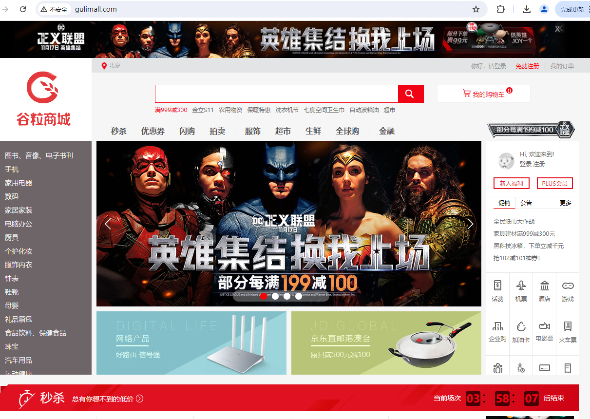

[toc]


# 1. 商品（SPU）上架-信息写入ES

主要事项：

- 封装需要存入ES的数据模型
- 将数据存入ES，方便检索

## 1.1 ES中的数据模型

商品上架时存入ES的数据模型：

```java
/**
* @Description sku上架在ES里保存的数据模型
**/
@Data
public class SkuEsModel {
    /**
     * sku Id
     **/
    private Long skuId;
    /**
     * 所属spu Id
     **/
    private Long spuId;
    /**
     * 商品标题
     **/
    private String skuTitle;
    /**
     * 商品价格
     **/
    private BigDecimal skuPrice;
    /**
     * sku图片集
     **/
    private String skuImg;
    /**
     * sku 销量
     **/
    private Long saleCount;
    /**
     * 是否有库存
     **/
    private Boolean hasStock;
    /**
     * 热度评分
     **/
    private Long hotScore;
    /**
     * 品牌Id
     **/
    private Long brandId;
    /**
     * 分类Id
     **/
    private Long catalogId;
    /**
     * 分类名
     **/
    private String catalogName;
    /**
     * 品牌名
     **/
    private String brandName;
    /**
     * 品牌图片
     **/
    private String brandImg;
    /**
     * 分类图片
     **/
    private String catalogImg;
    private List<Attr> attrs;
    @Data
    public static class Attr{
        /**
         * 属性id
         */
        private Long attrId;
        /**
         * 属性名
         */
        private String attrName;
        /**
         * 属性值
         */
        private String attrValue;
    }
}
```


## 1.2 商品服务（gulimall-product）

调gulimall-search服务将数据写入ES方便检索，同时更改spu上架状态。

com.atguigu.product.service.impl.SpuInfoServiceImpl#up

```java
 @Override
    public void up(Long spuId) {
        
        // 1.查询当前sku所有用来检索的规格属性-共一个spu
        List<ProductAttrValueEntity> productAttrValueEntities=productAttrValueService.getSearchAttrs(spuId);
        List<SkuEsModel.Attr> searchAttrs=productAttrValueEntities.stream().map(productAttrValueEntity -> {
            SkuEsModel.Attr attr=new SkuEsModel.Attr();
            BeanUtils.copyProperties(productAttrValueEntity,attr);
            return attr;
        }).collect(Collectors.toList());

        // 2.查出当前spuId对应的所有sku
        List<SkuInfoEntity> skus=skuInfoDao.selectList(new QueryWrapper<SkuInfoEntity>().eq("spu_id",spuId));
        List<Long> skuIds=new ArrayList<>();
        if(skus!=null){
            skuIds=skus.stream().map(SkuInfoEntity::getSkuId).collect(Collectors.toList());
        }

        Map<Long,Boolean> stockMap=null;
        try {
            // 3.远程调用库存系统查出是否有库存
            Result<List<SkuHasStockVo>> hasStock=wareFeignService.getSkuHasStock(skuIds);
            stockMap=hasStock.getData().stream().collect(Collectors.toMap(SkuHasStockVo::getSkuId,SkuHasStockVo::getHasStock));
        }catch (Exception e){
            log.error("远程调用库存服务出现异常，异常原因：{}",e);
        }
        Map<Long, Boolean> finalStockMap = stockMap;
       
        // 4.组装数据
        List<SkuEsModel> skuEsModels=skus.stream().map(sku->{
            SkuEsModel skuEsModel=new SkuEsModel();
            BeanUtils.copyProperties(sku,skuEsModel);
            // skuPrice ,skuImg
            skuEsModel.setSkuPrice(sku.getPrice());
            skuEsModel.setSkuImg(sku.getSkuDefaultImg());
            // hasStock , hotScore
            if(finalStockMap ==null){
                // TODO 后面再处理
                skuEsModel.setHasStock(true); // 调用远程服务出现异常直接置为有库存
            }else{
                skuEsModel.setHasStock(finalStockMap.get(sku.getSkuId()));
            }

            // 热度评分， 初始置0
            skuEsModel.setHotScore(0L);

            // 查询品牌和分类的信息
            BrandEntity brandEntity=brandDao.selectById(sku.getBrandId());
            if(brandEntity!=null){
                skuEsModel.setBrandName(brandEntity.getName());
                skuEsModel.setBrandImg(brandEntity.getLogo());
            }
            CategoryEntity category=categoryDao.selectById(sku.getCatalogId());
            if(category!=null){
                skuEsModel.setCatalogName(category.getName());
            }
            // 设置检索属性
            skuEsModel.setAttrs(searchAttrs);
            return skuEsModel;
        }).collect(Collectors.toList());
        
        // 5. 将数据发送给gulimall-search服务并保存到ES
        Result result=searchFeignService.productStartUp(skuEsModels);
        
        if(result.getCode()==0){ // 远程调用成功
            // 6. 修改spu发布状态
            SpuInfoEntity spuInfoEntity=new SpuInfoEntity();
            spuInfoEntity.setId(spuId);
            spuInfoEntity.setPublishStatus(PublishStatusEnum.UP.getCode());
            spuInfoEntity.setUpdateTime(new Date());
            getBaseMapper().updateById(spuInfoEntity);
        }else{
            // 远程调用失败
            // TODO 重复调用？ 接口幂等性 重试机制
        }
    }
```


## 1.3 检索服务（gulimall-search）

接收gulimall-product发送过来的数据并保存到ES  

/search/product/up

```java
public class ProductSaveServiceImpl implements ProductSaveService {
    @Autowired
    RestHighLevelClient restHighLevelClient;

    /**
     * 主程序启动默认执行：创建索引及映射
     **/
    @PostConstruct
    public void createIndexAndMapping() throws IOException {
        // 1.给es中建立索引: product,并建立映射关系 gulimall-search/src/main/resources/product-mapping.txt
        // 注意CreateIndexRequest导包，需为org.elasticsearch.client.indices.CreateIndexRequest;否则报错
        org.elasticsearch.client.indices.CreateIndexRequest request = new CreateIndexRequest(EsContant.PRODUCT_INDEX);
        request.mapping("{\n" +
                "    \"properties\": {\n" +
                "      \"skuId\": {\n" +
                "        \"type\": \"long\"\n" +
                "      },\n" +
                "      \"spuId\": {\n" +
                "        \"type\": \"keyword\"\n" +
                "      },\n" +
                "      \"skuTitle\": {\n" +
                "        \"type\": \"text\",\n" +
                "        \"analyzer\": \"ik_smart\"\n" +
                "      },\n" +
                "      \"skuPrice\": {\n" +
                "        \"type\": \"keyword\"\n" +
                "      },\n" +
                "      \"skuImg\": {\n" +
                "        \"type\": \"keyword\"\n" +
                "      },\n" +
                "      \"saleCount\": {\n" +
                "        \"type\": \"long\"\n" +
                "      },\n" +
                "      \"hasStock\": {\n" +
                "        \"type\": \"boolean\"\n" +
                "      },\n" +
                "      \"hotScore\": {\n" +
                "        \"type\": \"long\"\n" +
                "      },\n" +
                "      \"brandId\": {\n" +
                "        \"type\": \"long\"\n" +
                "      },\n" +
                "      \"catalogId\": {\n" +
                "        \"type\": \"long\"\n" +
                "      },\n" +
                "      \"brandName\": {\n" +
                "        \"type\": \"keyword\"\n" +
                "      },\n" +
                "      \"brandImg\": {\n" +
                "        \"type\": \"keyword\"\n" +
                "      },\n" +
                "      \"catalogName\": {\n" +
                "        \"type\": \"keyword\"\n" +
                "      },\n" +
                "      \"attrs\": {\n" +
                "        \"type\": \"nested\",\n" +
                "        \"properties\": {\n" +
                "          \"attrId\": {\n" +
                "            \"type\": \"long\"\n" +
                "          },\n" +
                "          \"attrName\": {\n" +
                "            \"type\": \"keyword\"\n" +
                "          },\n" +
                "          \"attrValue\": {\n" +
                "            \"type\": \"keyword\"\n" +
                "          }\n" +
                "        }\n" +
                "      }\n" +
                "    }\n" +
                "  }",XContentType.JSON);
        try {
            restHighLevelClient.indices().create(request, RequestOptions.DEFAULT);
        }catch (Exception e){
            log.error("ES初始化创建失败，mapping已存在请先删除: 发送请求 DELETE /{}",EsContant.PRODUCT_INDEX);
        }
    }
    
    @Override
    public boolean productStartUp(List<SkuEsModel> skuEsModels) throws IOException {
        // 保存到ES
        // 1.给es中建立索引（createIndexAndMapping方法）: product,并建立映射关系 gulimall-search/src/main/resources/product-mapping.txt

        // 2.构造批量请求
        BulkRequest bulkRequest=new BulkRequest();
        for(SkuEsModel skuEsModel:skuEsModels){
            IndexRequest indexRequest=new IndexRequest(EsContant.PRODUCT_INDEX); // 指定索引

            indexRequest.id(skuEsModel.getSkuId().toString()); // Document id设为skuId,防止不断添加数据，skuId相同则覆盖
            String s= JSON.toJSONString(skuEsModel);
            indexRequest.source(s, XContentType.JSON);
            bulkRequest.add(indexRequest);
        }

        // 2. 保存到ES 批量保存
        BulkResponse bulkResponse =restHighLevelClient.bulk(bulkRequest, ElasticSearchConfig.COMMON_OPTIONS);
        // TODO 3.上架出错处理 先用日志简单记录
        boolean error=bulkResponse.hasFailures();
        if (error){
            List<String> collect=Arrays.stream(bulkResponse.getItems()).map(BulkItemResponse::getId).collect(Collectors.toList());
            log.error("商品上架错误:{}",collect);
        }
        return !error;
    }
}

```

## 1.4 效果

SPU上架完成后：发GET请求可以从ES中查到索引为product下的数据，即保存成功。


# 2.动静分离-搭建商城首页环境

## 2.1 Thymeleaf模板引擎

分担访问压力:  页面中的静态资源直接放在nginx，网关做统一鉴权认证等服务，需要经过服务器处理的动态请求才过网关并路由到具体的微服务。


引入thymeleaf模板引擎依赖:

```xml
<!--thymeleaf模板引擎-->
<dependency>
    <groupId>org.springframework.boot</groupId>
    <artifactId>spring-boot-starter-thymeleaf</artifactId>
</dependency>
```


将资料中：首页资源的index文件夹复制到gulimall-product模块static路径下（静态资源）


再将index.html复制到resources/templates下（没有新建一个）：访问端口时默认会找index.html


配置application.yml：

```yaml
spring:
  thymeleaf:
    cache: false #关闭thymeleaf缓存，方便开发期间看到实时效果
```


之后所有和页面相关的都放web下：


重启product服务，访问10000端口即可看到首页：


## 2.2 前端获取实时一、二、三级分类数据

页面跳转和页面渲染出实时的一级分类数据：

（1）配置访问http://localhost:10000/index.html 和http://localhost:10000都跳转到index.html页面

```java
@Controller
public class IndexWebController {
    @Autowired
    CategoryService categoryService;
    /**
     * @description: 配置转发： 访问http://localhost:10000/index.html 和http://localhost:10000都跳转到index.html页面
     * @param:
     * @param model
     * @return: java.lang.String
     **/
    @GetMapping({"/","/index.html"})
    public String indexPage(Model model){
        // 1.查出所有的一级分类
        List<CategoryEntity> categoryEntities=categoryService.getLevelOneCategories();
        // 视图解析器
        model.addAttribute("categorys",categoryEntities);
        return "index";
    }
}
```

（2）前端拿到实时的一级分类数据


效果：


## 2.3 搭建域名访问环境

### 2.3.1 nginx到具体微服务

搭建域名访问环境：以管理员身份打开


效果和直接改hosts相同：


新建方案保存：其中1192.168.30.128为之前装es 容器的虚拟机


直接域名访问9200端口（开了代理必须退出）：


nginx总配置：nginx.conf文件，它包含conf.d/下的所有配置文件


conf.d/default.conf:


复制一份default.conf作为gulimall.conf:


修改gulimall.conf：加上proxy_pass配置，其中192.168.1.4为wins物理机，上面运行gulimall各个微服务；192.168.30.128为虚拟机，上面装了nginx、es等docker容器。由于之前在物理机上配了域名192.168.30.128 gulimall.com，因此数据流转发规则为：

物理机上（192.168.1.4）请求gulimall.com -> 192.168.30.128虚拟机上的nginx服务-> 根据proxy_pass规则转到http://192.168.1.4:10000（相当于又回到物理机） 。


因此直接访问gulimall.com可以访问商城首页：




### 2.3.2 nginx负载均衡到网关，网关再负载均衡到微服务（推荐）

升级：nginx先到网关，而不是直接到商品服务，由网关再路由到具体服务

#### 2.3.2.1 nginx配置

具体配置参考nginx负载均衡：https://nginx.org/en/docs/http/load_balancing.html


修改/mydata/nginx/conf/conf.d/gulimall.conf: 直接到网关组gulimall ,这样请求到nginx后就会直接转到网关组gulimall(下面nginx.conf里面配了 )，然后再由网关转给具体的服务；同时手动设置头，防止nginx自动丢弃。


修改/mydata/nginx/conf/nginx.conf ：配上网关地址组


#### 2.3.2.2 网关配置域名转发

网关配置域名转发

参考：


放到最后，否则会屏蔽其他规则：


#### 2.3.2.3 效果

所有请求都可以通过域名访问：先到nginx，再到网关，再到微服务


接口也可通过域名访问：


## 2.4 进一步优化nginx-动静分离

新建static文件夹


将所有原来微服务staic下静态数据全部上传到下面，并删掉原微服务下的静态资源：


修改index.html： 原来/index/下的全部改为/static/index/ 如下所示：


/mydata/nginx/conf/conf.d/gulimall.conf加上:  即所有请求为/static的路径都转给/usr/share/nginx/html


注意，上面的/usr/share/nginx/html为容器内路径：


重启nginx容器，然后重新访问：正常


# 3.检索服务

## 3.1 搭建页面环境

检索服务（gulimall-search）：在static文件夹下新建search文件夹，然后将静态资源传上去


index.html放到：


修改：所有herf 和src路径都加上/static，如下所示


域名规则添加：所有到search.gulimall.com的都转给nginx服务器


/mydata/nginx/conf/conf.d/gulimall.conf： 修改后重启nginx


网关配置域名转发：所有域名为search.gulimall.com的都转到gulimall-search服务


idea重新clean install 以下所有模块（可能有缓存，导致search前端页面刷不出），重启gate-way 和search服务

访问http://search.gulimall.com/  


## 3.2  检索服务

### 3.2.1 构造查询条件

可用来检索的字段：

- 检索关键字
- 三级分类Id
- 排序条件：销量、价格、热度
- 其他过滤条件：是否有货、商品价格区间、品牌、分类、属性值


```java
@Data
public class SearchParam {
    /**
     * 检索关键字
     **/
    private String keyword;
    /**
     * 三级分类Id
     **/
    private Long catalog3Id;
    /**
     * 排序条件
     * sort=saleCount_asc/desc  销量
     * sort=skuPrice_asc/desc   价格
     * sort=hotScore_asc/desc   热度
     **/
    private String sort;

    /**
     * 其他过滤条件
     * hasStock(是否有货)  skuPrice区间  brandId、catalog3Id、attrs
     * hasStock=0/1
     * skuPrice区间: 1_500/_500/500_
     **/
    /**
     * 是否有货：0无  1有
     **/
    private Integer hasStock;
    /**
     * 商品价格区间
     **/
    private String skuPrice;
    /**
     * 品牌Id :可同时选多个
     **/
    private List<String> brandId;
    /**
     * 属性 :可同时选多个
     **/
    private List<String> attrs;

    /**
     * 分页当前页码(起始号)，默认1
     **/
    private Integer pageNum=1;
}
```

### 3.2.2 编写ES-DSL查询语句

总体分为：

- 查询：query
- 排序：sort
- 分页： from ,size
- 高亮：hightlight
- 聚合：aggs


#### 3.2.2.1 查询

query:   按照商品标题、分类、品牌Id集合、属性集合、是否有库存、价格区间进行组装

#### 3.2.2.2 排序

sort: 销量、价格区间、热度 。ASC/DESC

#### 3.2.2.3 分页

#### 3.2.2.4 高亮

highlight： 对检索的skuTitle进行高亮显示

#### 3.2.2.5 聚合

aggs: 对ES中命中的数据进行汇总分析。

- brand_agg: 根据品牌ID进行聚合，需要获取品牌ID、品牌名、品牌Logo
- catalog_agg: 根据分类ID进行聚合，需要获取分类ID、分类名
- attr_agg： 根据属性进行聚合，需要获取属性ID、属性名、属性值


DSL语句如下：

```java
{
   //  1. query条件组装
  "query": {
    "bool": {
      "must": [
        {
          "match": {
            "skuTitle": "华为"  // 按照商品标题
          }
        }
      ],
      "filter": [
        {
          "term": {
            "catalogId": "225"  // 按照分类
          }
        },
        {
          "terms": {
            "brandId": [   // 按照品牌Id集合
              "9",
              "12"
            ]
          }
        },
        {               // 按照属性集合（attrs字段对应一个java类，ES中要用nested类型）
          "nested": {
            "path": "attrs",   
            "query": {
              "bool": {
                "must": [
                  {
                    "term": {
                      "attrs.attrId": {
                        "value": "15"
                      }
                    }
                  },
                  {
                    "terms": {
                      "attrs.attrValue": [
                        "HUAWEI Kirin 980",
                        "海思（Hisilicon）"
                      ]
                    }
                  }
                ]
              }
            }
          }
        },
        {
          "term": {
            "hasStock": "true"    // 按照是否有库存
          }
        },
        {
          "range": {
            "skuPrice": {        // 按照价格区间
              "gte": 5000,
              "lte": 8000
            }
          }
        }
      ]
    }
  },
    
    //  2. sort条件组装
  "sort": [                    // 排序
    {
      "skuPrice": {
        "order": "desc"
      }
    }
  ],
    //  3. 分页条件组装
  "from": 0,
  "size": 1,
     //  4. 高亮
  "highlight": {
    "fields": {
      "skuTitle": {
        
      }
    },
    "pre_tags": "<b style='color:red'>",
    "post_tags": "</b>"
  },
    
     //  5. 聚合
  "aggs": {
    "brand_agg": {
      "terms": {
        "field": "brandId",  // 5.1 根据品牌ID聚合
        "size": 10
      },
      "aggs": {
        "brand_name_agg": {  // 获取品牌名-子聚合（基于上一次聚合数据）
          "terms": {
            "field": "brandName",
            "size": 10
          }
        },
        "brand_img_agg": {  // 获取品牌logo-子聚合
          "terms": {
            "field": "brandImg",
            "size": 10
          }
        }
      }
    },
    "catalog_agg": {   // 5.2 根据分类ID聚合
      "terms": {
        "field": "catalogId",
        "size": 10
      },
      "aggs": {
        "catalog_name_agg": { 
          "terms": {
            "field": "catalogName",  // 分类名
            "size": 10
          }
        }
      }
    },
    "attr_agg": {  // 5.2 根据属性聚合（nested）
      "nested": {
        "path": "attrs"
      },
      "aggs": {
        "attr_id__agg": {
          "terms": {
            "field": "attrs.attrId", // 属性Id
            "size": 10
          },
          "aggs": {
            "attr_name_agg": {
              "terms": {
                "field": "attrs.attrName", // 属性名
                "size": 10
              }
            },
            "attr_value_agg": {
              "terms": {
                "field": "attrs.attrValue", // 属性Id
                "size": 10
              }
            }
          }
        }
      }
    }
  }
}
```

### 3.2.3 构建检索请求-  SearchRequest

将检索条件和上面的DSL json转化为java代码，构建出ES检索请求SearchRequest。

com.atguigu.search.service.impl.MallSearchServiceImpl#buildSearchRequest


### 3.2.4 执行检索请求

从ES中查询满足条件的记录


### 3.2.5 解析响应数据SearchResponse并封装成所需格式SearchResult

响应数据SearchResponse格式：


需要返回的信息SearchResult：

- 所有查询到的商品信息：直接从命中记录hits中取

- 所有涉及到的品牌信息：从聚合结果aggregations中取
- 所有涉及到的分类信息：从聚合结果aggregations中取
- 所有查询到的商品涉及的属性信息：从聚合结果aggregations中取
- 分页信息：直接从命中记录hits以及请求参数中取


### 3.2.6 效果

所有录入的商品：苹果+华为，共12件sku


搜索条件：手机（catalogId=255）+  华为(keyword=华为)


搜索条件：手机（catalogId=255）+  华为(keyword=华为) + 价格区间5000~6000（skuPrice）


